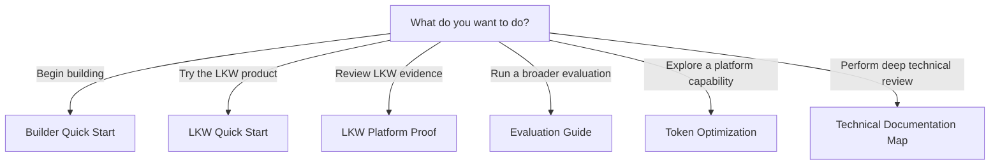

<!--
© Artur Czarnecki. All rights reserved.
Intergrax is source-available under the Intergrax Evaluation and Collaboration License 1.0.
See LICENSE for permitted evaluation, collaboration, and contribution use.
-->

# Build and Evaluate with Intergrax

Choose the right path to evaluate Intergrax, inspect its proof, or begin building a specialized application.

> New to building with Intergrax? Start with the [Builder Quick Start](BUILDER_QUICKSTART.md).

This document is the deeper route-selection and planning guide. The [Builder Quick Start](BUILDER_QUICKSTART.md) provides first bounded builder orientation; the [Evaluation Guide](EVALUATION_GUIDE.md) remains the execution-oriented evaluation catalog.

> [!WARNING]
> **Evaluation does not grant production permission, commercial permission, hosting, or redistribution permission.** [LICENSE](LICENSE) is authoritative.

> [!NOTE]
> Intergrax is under **active R&D**. Proof paths validate **bounded mechanisms**, not universal production readiness.

---

## At a glance

| Question | Answer |
| -------- | ------ |
| **Current stage** | Source-available, active R&D, bounded proof paths |
| **Best first step** | [Builder Quick Start](BUILDER_QUICKSTART.md) |
| **Primary product proof** | LKW |
| **Featured platform capability** | Token Optimization |
| **Permission boundary** | Production/commercial use requires written permission |

---

## Choose your path

| Goal | Recommended path | What you will learn |
| ---- | ---------------- | ------------------- |
| First builder orientation | [Builder Quick Start](BUILDER_QUICKSTART.md) | Choose a concrete workflow, ownership boundary and nearest existing verification path |
| Try the primary LKW product path | [LKW Quick Start](applications/local_workspace_application/docs/QUICKSTART.md) | Run the supported indexed product evaluation |
| Review bounded LKW technical evidence | [LKW Platform Proof](docs/public-adoption/LKW_PLATFORM_PROOF.md) | Review bounded application and platform evidence |
| Run a broader evaluation | [Evaluation Guide](EVALUATION_GUIDE.md) | Follow a time-boxed evaluation across product and platform paths |
| Explore Token Optimization | [Token Optimization guide](docs/features/token_optimization/README.md) | Review deterministic mechanisms and bounded vLLM proof scope |
| Inspect current evidence | [PROOFS.md](PROOFS.md) | Review public proof status and claim boundaries |
| Build a specialized application | [Agent Creation Guide](docs/guides/AGENT_CREATION_GUIDE.md) and [application usage docs](applications/USAGE.md) | Compose a product workflow on shared foundations |
| Perform deep technical review | [Technical Documentation Map](docs/DOCUMENTATION_MAP.md) | Navigate architecture, plans and implementation detail |



---

## Path 1 — First builder orientation

Start at [Builder Quick Start](BUILDER_QUICKSTART.md).

Use it to:

- choose a concrete workflow;
- identify the application and platform ownership boundary;
- find the nearest existing setup or verification path;
- continue to deeper planning only when the workflow justifies it.

Builder Quick Start owns the first checkpoint. This document routes you there without duplicating its onboarding guidance.

---

## Path 2 — LKW product evaluation and technical evidence

**Supported product evaluation:** [LKW Quick Start](applications/local_workspace_application/docs/QUICKSTART.md)

The LKW Quick Start is the supported product path for trying the indexed workspace workflow.

**Bounded technical reviewer evidence:** [LKW Platform Proof](docs/public-adoption/LKW_PLATFORM_PROOF.md)

The Platform Proof is the deeper reviewer route for bounded application and platform behavior through Local Knowledge Workspace — ingest, indexed knowledge, hosting, observability, and persisted execution evidence.

Neither route proves finished SaaS, completed Hybrid Ask, or commercial readiness. LKW remains **PARTIAL** at **Backend Product Alpha / MVP**.

---

## Path 3 — Token Optimization

**Featured platform-capability proof:** [Token Optimization guide](docs/features/token_optimization/README.md)

Covers implemented deterministic mechanisms, cache-aware execution, protected-region validation, receipts, and a **bounded vLLM** proof path. Claim guardrails: [TOKEN_OPTIMIZATION_CLAIMS.md](docs/public-adoption/TOKEN_OPTIMIZATION_CLAIMS.md).

No universal or production-proven savings claim is made. Status remains **PARTIAL**.

---

## Path 4 — Build a specialized application

| Resource | Role |
| -------- | ---- |
| [Agent Creation Guide](docs/guides/AGENT_CREATION_GUIDE.md) | Domain agent and harness integration |
| [applications/USAGE.md](applications/USAGE.md) | Application-layer usage patterns |
| [ARCHITECTURE_OVERVIEW.md](ARCHITECTURE_OVERVIEW.md) | Responsibility boundaries before you build |

**Build sequence:**

```text
define the product workflow
→ choose reusable platform capabilities
→ configure policy, knowledge and tools
→ implement domain decisions
→ run bounded tests and proof paths
→ record limitations
```

This sequence describes bounded evaluation and building — not unrestricted production deployment.

---

## What evidence should you capture?

When you run a proof or evaluation path, record:

- exact commit;
- environment;
- model or provider;
- configuration;
- proof path;
- observed result;
- limitation;
- failing or skipped step.

Full public proof dashboard: [PROOFS.md](PROOFS.md).

---

## Evaluation and permission boundaries

- Local **non-production evaluation** is permitted subject to [LICENSE](LICENSE).
- Collaboration routes are in [COLLABORATION.md](COLLABORATION.md).
- **Production use**, **commercial use**, hosting, and redistribution require **explicit written permission**.
- The license is authoritative; this section does not reproduce legal clauses.

---

## Detailed evaluation material

| Document | Role |
| -------- | ---- |
| [EVALUATION_GUIDE.md](EVALUATION_GUIDE.md) | Detailed bounded execution companion — timed evaluation passes |
| [README](README.md) | Repository overview and first-contact context |
| [PROOFS.md](PROOFS.md) | Proof status and verification paths |
| [Public Documentation Map](docs/PUBLIC_DOCUMENTATION_MAP.md) | Reader-intent routing across public docs |

**BUILD_WITH_INTERGRAX.md** owns public route selection. **EVALUATION_GUIDE.md** remains the detailed bounded execution companion for step-by-step evaluation passes.
