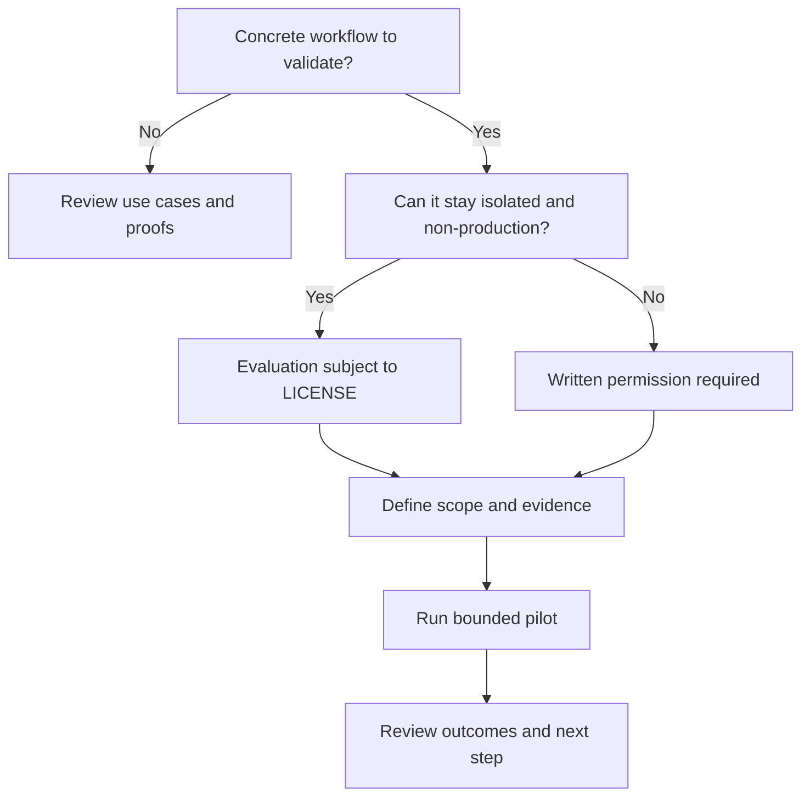

<!--
© Artur Czarnecki. All rights reserved.
Intergrax is source-available under the Intergrax Evaluation and Collaboration License 1.0.
See LICENSE for permitted evaluation, collaboration, and contribution use.
-->

# Partners and Pilots

Intergrax is **source-available** and under **active R&D**. Local Knowledge Workspace (LKW) is **Backend Product Alpha / MVP** and remains **PARTIAL**.

A partner discussion or pilot name does **not** grant production, commercial, hosting, redistribution, or endorsement rights. [LICENSE](LICENSE) is legally authoritative.

This guide helps your team determine partner fit, prepare a bounded pilot, and understand when written permission is required before you start.

Primary audience: Partner, integrator or design partner with a concrete workflow to evaluate or a bounded pilot to propose.

---

## At a glance

**Primary next action:** [prepare the pilot brief](#pilot-brief) in this document before starting a discussion.

| Question | Answer |
|----------|--------|
| Strongest current partner path | Governed private knowledge workflow using LKW |
| Good-fit partner | Concrete workflow requiring controlled knowledge, policy, evidence, or tool execution |
| First preparation step | Define workflow, users, data, actions, boundaries, and success |
| Evaluation-only pilot | Isolated non-production Evaluation subject to [LICENSE](LICENSE) |
| Operational pilot | Real users, production data, or business processes require explicit written permission before starting |
| Permission source | [LICENSE](LICENSE) |
| Contact | jakbu.czarnecki.83@gmail.com |

---

## Partner qualification sequence

1. Confirm that there is a concrete workflow.
2. Check whether the workflow fits current product boundaries.
3. Classify the intended activity as evaluation-only or operational.
4. Prepare the pilot brief.
5. Start the appropriate discussion.

---

## Partner decision flow

Labels such as **pilot**, **sandbox**, **test**, or **proof of concept** do **not** determine permission status. Actual users, data, processes, and outputs determine the classification under [LICENSE](LICENSE).

---

## Who is a good fit

| Partner profile | Concrete need | Best starting path |
|-----------------|---------------|-------------------|
| Private knowledge team | Governed assistant over controlled documents and citations | LKW private knowledge workflow |
| Specialized agent-application product team | Reusable policy, evidence, and execution foundations for one product | Specialized governed application evaluation |
| AI platform team | Reusable policy, evidence, or knowledge foundations across products | Token Optimization or architecture review |
| Evidence, observability, or attestation integration team | Boundary events, receipts, or external attestation patterns | Evidence or attestation integration evaluation |
| Technical evaluator | Bounded proof paths with reproducible friction reports | [BUILD_WITH_INTERGRAX.md](BUILD_WITH_INTERGRAX.md) evaluation |

Not every proposal will be accepted. Fit depends on workflow clarity, scope, and current product boundaries.

---

## Current partner and pilot tracks

| Track | User outcome | Current boundary | Verify |
|-------|--------------|------------------|--------|
| LKW private knowledge workflow | Guided product proof over controlled knowledge | Primary product pilot direction · Backend Product Alpha / MVP · **PARTIAL** | [LKW Platform Proof](docs/public-adoption/LKW_PLATFORM_PROOF.md) · [PROOFS.md](PROOFS.md) |
| Specialized governed application | Validate harness fit for one product workflow | Reasonable technical evaluation; product-specific validation remains required | [BUILD_WITH_INTERGRAX.md](BUILD_WITH_INTERGRAX.md) · [ARCHITECTURE_OVERVIEW.md](ARCHITECTURE_OVERVIEW.md) |
| Token Optimization evaluation | Inspect deterministic optimization mechanisms | Featured platform-capability proof · **PARTIAL** · bounded technical evaluation | [Token Optimization guide](docs/features/token_optimization/README.md) |
| Evidence or attestation integration | Test boundary-event and external receipt patterns | Bounded integration evaluation; not certification, compliance approval, or legal attestation | [BoundaryAttest case study](docs/case-studies/BOUNDARYATTEST_ATTESTATION_POC.md) |

---

## Evaluation or operational pilot?

### Evaluation-only pilot

An evaluation-only pilot stays **isolated and non-production** and is solely for **Evaluation** under [LICENSE](LICENSE):

- synthetic or appropriately anonymized test data;
- no real customer-facing service;
- no ongoing operational business process;
- no replacement of a production tool.

**Evaluation Participants** may include employees, contractors, advisers, and technical reviewers acting solely for Evaluation. The activity remains subject to the exact terms of [LICENSE](LICENSE).

### Operational or production pilot

The following normally place the activity **outside** the public evaluation grant:

- real operational users or real customers;
- production data;
- customer-facing output;
- ongoing business process;
- replacement of an operational tool;
- hosting or SaaS;
- paid or commercial product integration.

**Explicit written permission or a separate agreement is required before the activity starts.** Contacting the maintainer does not grant permission.

---

## Pilot workflow

1. **Check fit** — Output: confirmed workflow category and relevant proof path.
2. **Describe the workflow** — Output: one-paragraph workflow summary with users and data sources.
3. **Classify the intended use** — Output: evaluation-only or operational/production classification.
4. **Define scope and evidence** — Output: allowed actions, forbidden actions, and required evidence.
5. **Prepare the environment** — Output: isolated evaluation setup or written permission for operational use.
6. **Run the bounded evaluation or authorized pilot** — Output: completed tasks with captured evidence.
7. **Review outcomes** — Output: success review against criteria below.
8. **Continue, revise, or stop** — Output: decision on next step, scope change, or exit.

---

## Pilot brief

Prepare a concise brief that includes:

- concrete user workflow;
- intended users and roles;
- knowledge and data sources;
- production-data status;
- allowed actions;
- forbidden actions;
- human approvals;
- required evidence and citations;
- environment and deployment assumptions;
- success criteria;
- repeated-use criteria;
- integration requirements;
- production or commercial intent;
- desired decision after the pilot.

---

## Success review

After the pilot, review:

- useful task completion;
- evidence and citation correctness;
- policy and permission behavior;
- setup repeatability;
- restart and recovery behavior where applicable;
- user trust;
- repeated use;
- blockers;
- whether further development is justified.

Do not treat a single pilot as proof of universal performance or production readiness.

---

## What is not included automatically

A partner discussion or pilot does **not** include:

- production rights;
- commercial rights;
- hosting rights;
- redistribution rights;
- exclusivity;
- endorsement;
- SLA;
- production support;
- certification;
- compliance approval;
- acceptance of every requested feature;
- release-date commitment.

---

## Start a discussion

**Email:** jakbu.czarnecki.83@gmail.com

Start the discussion with a completed or substantially prepared pilot brief. Before contacting, review:

- [USE_CASES.md](USE_CASES.md) — use-case fit;
- [ROADMAP.md](ROADMAP.md) — current validation direction;
- [BUILD_WITH_INTERGRAX.md](BUILD_WITH_INTERGRAX.md) — evaluation paths;
- [COLLABORATION.md](COLLABORATION.md) — collaboration and permission routes;
- [LICENSE](LICENSE) — legally authoritative terms.
