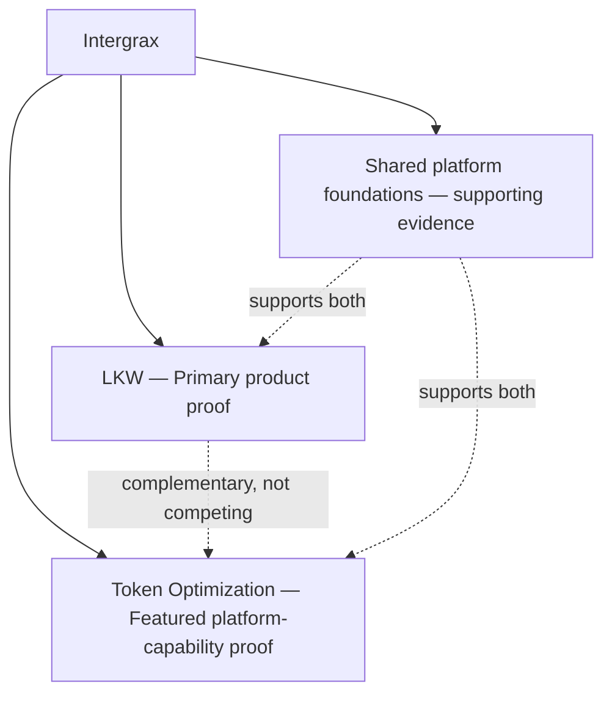
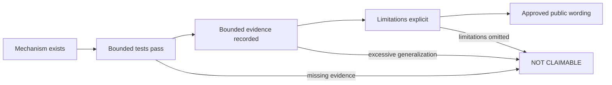

<!--
© Artur Czarnecki. All rights reserved.
Intergrax is source-available under the Intergrax Evaluation and Collaboration License 1.0.
See LICENSE for permitted evaluation, collaboration, and contribution use.
-->

# Intergrax Proofs

**Evidence before promises.**

Intergrax separates **implemented mechanisms**, **bounded verification**, **partial product capability**, **planned work**, and **claims that are not currently supported**. This page is the public proof dashboard — no internal task IDs required.

> [!NOTE]
> Intergrax is **source-available** and under **active R&D**. Technical proof does not imply finished SaaS, production readiness, real-user validation, or commercial validation.

## Status legend

| Label | Meaning |
|-------|---------|
| ✅ **IMPLEMENTED** | A concrete mechanism exists with bounded tests or accepted implementation evidence; no live, product, or production validation is implied. |
| 🧪 **BOUNDED PROOF** | Proof was executed in a named environment with available evidence and stated limitations; wording must not generalize beyond that scope. |
| 🟡 **PARTIAL** | Some slices are implemented; end-to-end capability, dependency, or validation gate remains open. |
| 🗓️ **PLANNED** | Architecture or scheduling exists; runtime behavior, proof, or integration is not yet available. |
| ⛔ **NOT CLAIMABLE** | No evidence supports the claim, or guardrails explicitly block public wording. |

Text labels are authoritative; symbols are visual support only.

## Proof landscape

LKW and Token Optimization answer different reviewer questions. LKW demonstrates a real Tier-3 application workflow; Token Optimization demonstrates a reusable platform mechanism.

## At a glance

| Proof path | Classification | Current public status | What it demonstrates | Verify |
|------------|----------------|----------------------|----------------------|--------|
| **LKW** | Primary product proof | 🟡 **PARTIAL** (Backend Product Alpha / MVP) | Bounded Tier-3 platform behavior, indexed knowledge, background ingest, hosting, observability | [LKW Platform Proof](docs/public-adoption/LKW_PLATFORM_PROOF.md) |
| **Token Optimization** | Featured platform-capability proof | 🟡 **PARTIAL** | Deterministic optimization pipeline, cache-aware execution, bounded vLLM prefix-cache proof | [Token Optimization guide](docs/features/token_optimization/README.md) |
| **Shared platform foundations** | Supporting evidence | ✅ **IMPLEMENTED** (bounded) | RAG, observability, proof receipts, application hosting contracts exercised by LKW | [Public documentation map](docs/PUBLIC_DOCUMENTATION_MAP.md) |

---

## LKW — Primary product proof

**Role:** Primary product proof · **Product status:** Backend Product Alpha / MVP

| Capability | Status | What it demonstrates | Limitation |
|------------|--------|----------------------|------------|
| Core Tier-3 platform proof | 🧪 **BOUNDED PROOF** | Real application startup, observability, ingest, hosting, ProofReceipt persistence | Bounded to documented certification profiles; not full live platform proof |
| Web URL knowledge intake | 🧪 **BOUNDED PROOF** | End-to-end WEB_URL intake, indexing, grounded Ask over indexed content | Not live external-website certification |
| Ollama / vLLM model runtime portability | 🧪 **BOUNDED PROOF** | Same workspace workflows on Ollama and vLLM without reindexing | Not complete product parity across all features |
| Current Slack DM path | 🟡 **PARTIAL** | Operate LKW through Slack DM for knowledge already in the selected workspace | Durable bindings, shared channels, and full conversational runtime not complete |
| Slack connected source | 🟡 **PARTIAL** | Platform can read and synchronize Slack conversations; workspace attachment in progress | Connected-source slice not accepted; Hybrid Ask not available |
| Hybrid Ask | 🗓️ **PLANNED** | Indexed + live evidence in one grounded answer | Not implemented |
| Google Workspace LKW proof | 🗓️ **PLANNED** | Governed Google Workspace knowledge in LKW | Blocked on prior Slack proof acceptance |
| Final live platform proof | 🗓️ **PLANNED** | Multi-source live demonstration in one workspace | Not completed |
| Real-user validation | ⛔ **NOT CLAIMABLE** | — | No completed real-user validation program |
| Commercial validation | ⛔ **NOT CLAIMABLE** | — | No completed commercial validation |

Deeper detail: [LKW Platform Proof](docs/public-adoption/LKW_PLATFORM_PROOF.md) · [LKW implementation plan](applications/local_workspace_application/docs/IMPLEMENTATION_PLAN.md)

---

## Token Optimization — Featured platform-capability proof

**Role:** Featured platform-capability proof

| Capability | Status | What it demonstrates | Limitation |
|------------|--------|----------------------|------------|
| Deterministic optimization pipeline | ✅ **IMPLEMENTED** | Layer registry, pipeline runner, built-in catalog, plugin contract | Not globally auto-enabled |
| Approved-configuration LLM routing | ✅ **IMPLEMENTED** | Policy-governed router with approved catalog only | Router output is advisory until application applies it |
| Protected-region validation | ✅ **IMPLEMENTED** | Central validation after content-changing layers | Does not guarantee semantic equivalence for all lossy paths |
| Receipts and fallback | ✅ **IMPLEMENTED** | Attribution, savings metadata, safe fallback on validation failure | Receipts exclude raw content |
| Cache-stable prompt assembly | ✅ **IMPLEMENTED** | Stable prefix, dynamic tail, append-only rules | Does not prove provider cache behavior alone |
| Exact-send integrity | ✅ **IMPLEMENTED** | Message and tool-schema integrity before adapter send | Provider-specific cache behavior varies |
| Cache-aware execution gate | ✅ **IMPLEMENTED** | Only `RUN` executes pipeline; conflicting evidence rejected | Does not perform in-cache compaction |
| Bounded vLLM prefix-cache proof | 🧪 **BOUNDED PROOF** | Cold/warm/changed-prefix reuse in documented vLLM environment | Named version, model, and workload only |
| Unified Context Lifecycle | 🟡 **PARTIAL** | Contracts and runtime integration through CTX-UCL-5 accepted/closed; legacy migration CTX-UCL-6 in progress | CTX-UCL-6A ready for review; CTX-UCL-CLOSEOUT-1 not started; durable production integration not complete |
| Durable in-cache compaction | 🗓️ **PLANNED** | TOKEN-10E architecture defined | Runtime blocked until UCL closeout |
| Universal proof and hard gates | 🗓️ **PLANNED** | TOKEN-10F / TOKEN-10G harness and corpus | Hard gates not passed |
| Universal token reduction | ⛔ **NOT CLAIMABLE** | — | No universal savings evidence |
| Production-proven savings | ⛔ **NOT CLAIMABLE** | — | TOKEN-10G / TOKEN-10H not complete |

Deeper detail: [Token Optimization guide](docs/features/token_optimization/README.md) · [Claim guardrails](docs/public-adoption/TOKEN_OPTIMIZATION_CLAIMS.md)

---

## Claim-to-proof lifecycle

**Remember:** implemented code ≠ live proof ≠ product validation ≠ commercial validation ≠ production readiness.

---

## What Intergrax does not currently claim

> [!WARNING]
> The following are **not** current public claims:
>
> - finished SaaS product
> - completed commercial validation
> - universal production readiness
> - universal token or cost savings
> - completed Hybrid Ask
> - complete vendor integration catalog
> - completed durable in-cache compaction
> - real-user validation at scale

Real-user and commercial validation remain **incomplete**.

---

## Verification paths

| Document | Purpose |
|----------|---------|
| [LKW Platform Proof](docs/public-adoption/LKW_PLATFORM_PROOF.md) | Guided LKW reviewer proof path |
| [Token Optimization guide](docs/features/token_optimization/README.md) | Engine overview and proof catalog |
| [Token Optimization claim guardrails](docs/public-adoption/TOKEN_OPTIMIZATION_CLAIMS.md) | Safe public wording boundaries |
| [Public documentation map](docs/PUBLIC_DOCUMENTATION_MAP.md) | Reader-intent navigation |
| [Technical documentation map](docs/DOCUMENTATION_MAP.md) | Deep technical review entry |

Maintainer status and wording rules: [Public Proof and Claims Model](docs/public-adoption/PUBLIC_PROOF_AND_CLAIMS_MODEL.md)
