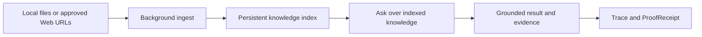
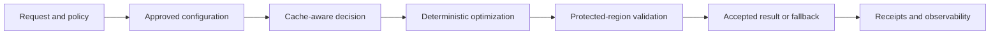
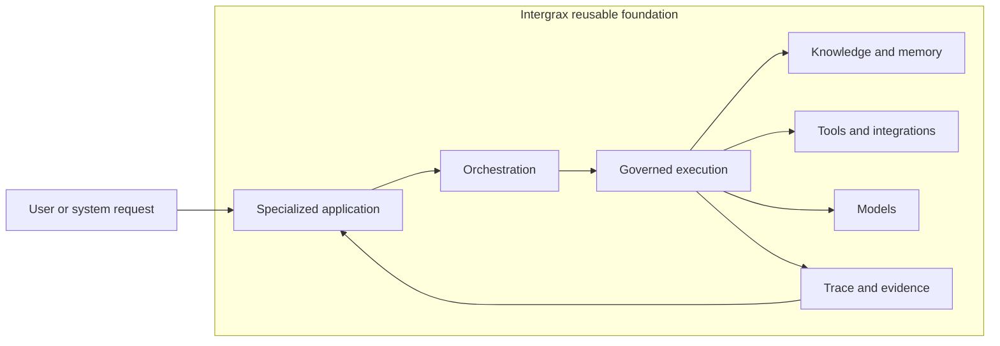

# Intergrax

Intergrax helps teams build specialized agent applications without rebuilding the same policy, knowledge, evidence, integration, and execution foundations for every product.

Intergrax is a reusable Harness AI foundation for governed agent applications.

[](https://www.python.org/downloads/)
[](LICENSE)
[](#license-and-collaboration)
[](PROOFS.md)

<picture>
  <source
    media="(prefers-color-scheme: dark)"
    srcset="docs/assets/public/intergrax-hero-dark.svg"
  >
  <source
    media="(prefers-color-scheme: light)"
    srcset="docs/assets/public/intergrax-hero-light.svg"
  >
  
</picture>

**[See the LKW product proof](docs/public-adoption/LKW_PLATFORM_PROOF.md)** · **[Explore Token Optimization](docs/features/token_optimization/README.md)** · **[Review current proofs](PROOFS.md)**

> [!NOTE]
> Intergrax is **source-available** and under **active R&D**. LKW is a **Backend Product Alpha / MVP**. **Real-user validation** and **commercial validation** are incomplete.

---

## Building the agent is not the hard part

Building an impressive agent demo is relatively easy. Delivering a controlled application that a team can review, operate, and trust is difficult.

Teams repeatedly rebuild the same foundations for every new product: permissions and identity, knowledge access, policy enforcement, human-in-the-loop gates, tool and integration boundaries, trace and evidence collection, testing, and runtime governance. This repeated infrastructure work slows every product and creates inconsistent governance across applications.

Intergrax provides reusable foundations so product teams can focus on the concrete workflow instead of rebuilding the harness for each application.

**Why Intergrax:** [WHY_INTERGRAX.md](WHY_INTERGRAX.md)

---

## What Intergrax changes

| Outcome | What it means |
| ------- | ------------- |
| **Application-first development** | Ship a specialized product workflow on shared foundations instead of inventing a new runtime stack each time. |
| **Governed execution** | Policy, budgets, human review, and trace surround every step — not bolted on after the demo works. |
| **Reusable knowledge and evidence foundations** | Indexing, retrieval, receipts, and observability are platform capabilities products compose — not one-off scripts. |
| **Explicit responsibility boundaries** | Applications, orchestration, agents, and the harness each own a clear slice of the system. |

---

## Product proof: Local Knowledge Workspace

**Primary product proof** · **Backend Product Alpha / MVP**

Local Knowledge Workspace (LKW) is the current primary product-development program. It is a real application used to pressure and validate reusable Intergrax foundations — not a finished SaaS, not complete Hybrid Ask, and not commercially validated.



**Current scope:** indexed-knowledge proof is **bounded** to documented environments. Slack DM operation is **partial**. Live provider evidence and full **Hybrid Ask** remain **planned**.

**Go deeper:** [LKW Platform Proof](docs/public-adoption/LKW_PLATFORM_PROOF.md) · [Proof dashboard](PROOFS.md)

---

## What is proven today

> [!WARNING]
> **Implemented code** does not automatically mean **live proof**, **production readiness**, or **commercial validation**.

| Area | Public status | What is demonstrated | Verify |
| ---- | ------------- | -------------------- | ------ |
| **LKW** | PARTIAL — bounded product/platform proof | Indexed knowledge, background ingest, hosting, observability, ProofReceipt | [LKW Platform Proof](docs/public-adoption/LKW_PLATFORM_PROOF.md) |
| **Token Optimization** | PARTIAL — implemented mechanisms plus bounded vLLM proof | Deterministic pipeline, cache-aware execution, receipts | [Token Optimization guide](docs/features/token_optimization/README.md) |
| **Shared platform foundations** | IMPLEMENTED — bounded supporting evidence | RAG, observability, proof receipts exercised by LKW | [Public documentation map](docs/PUBLIC_DOCUMENTATION_MAP.md) |

Full matrices, limitations, and claim boundaries: **[PROOFS.md](PROOFS.md)**

---

## Featured platform capability: Token Optimization

**Featured platform-capability proof** · **PARTIAL**

Token Optimization is a reusable platform mechanism for deterministic prompt and context optimization under policy — not a generic prompt-shortening utility.



**Implemented today:** deterministic optimization pipeline, approved-configuration routing, protected-region validation, receipts and fallback, cache-stable prompt assembly, exact-send integrity, and cache-aware execution.

**Bounded proof:** documented **bounded vLLM** prefix-cache proof in a named environment.

**Not complete:** Unified Context Lifecycle remains **partial**; **durable in-cache compaction incomplete**; universal hard gates are incomplete; **universal savings not claimed**; production-proven savings are not claimed.

**Go deeper:** [Token Optimization guide](docs/features/token_optimization/README.md) · [Claim guardrails](docs/public-adoption/TOKEN_OPTIMIZATION_CLAIMS.md)

---

## How Intergrax works

Harness AI is reusable infrastructure for governed agent applications. A specialized product hosts the user workflow; Intergrax supplies orchestration, governed execution, knowledge systems, tools, models, and evidence collection around that workflow.



**Responsibility boundaries:**

- **Applications** own the concrete product environment.
- **Orchestration** coordinates work.
- **Agents** make domain decisions.
- **The harness** controls execution, policy, and evidence.

**Deep dive:** [Architecture overview](ARCHITECTURE_OVERVIEW.md) · [Harness AI narrative](docs/guides/INTERGRAX_HARNESS_NARRATIVE.md) · [Technical documentation map](docs/DOCUMENTATION_MAP.md)

---

## Quick start

**Goal:** clone → install → verify → run → inspect.

### Prerequisites

Python 3.12 · [`uv`](https://github.com/astral-sh/uv) · Git

### Install and verify

```bash
git clone https://github.com/jakbuczarnecki/intergrax.git
cd intergrax
uv sync --extra dev
uv run intergrax doctor
uv run pytest -m gate -q
```

### Run the lab host

```bash
uv run uvicorn lab_application.host.main:app \
  --host 127.0.0.1 \
  --port 8090
```

### Execute and inspect

```bash
# Submit a run
curl -s -X POST http://127.0.0.1:8090/v1/lab/run \
  -H "Content-Type: application/json" \
  -d '{"message":"hello","capability":"echo.basic"}'

# Inspect trace — copy task_id from the response
curl -s \
  "http://127.0.0.1:8090/debug/tasks/{task_id}/trace?include_runtime=true"
```

**Expected response (abbreviated):**

```json
{"task_id":"01JABC…","state":"completed","answer":"hello","agent_id":"echo"}
```

**Builder and evaluation paths:** [BUILD_WITH_INTERGRAX.md](BUILD_WITH_INTERGRAX.md) · [Evaluation Guide](EVALUATION_GUIDE.md) · [Agent Creation Guide](docs/guides/AGENT_CREATION_GUIDE.md) · [Public documentation map](docs/PUBLIC_DOCUMENTATION_MAP.md)

<details>
<summary>Run the complete local evidence path</summary>

After the quick start, run the canonical proof path:

```bash
uv run intergrax certify core --level L2
uv run intergrax trace export
uv run intergrax evidence live-core
uv run intergrax evidence eval
uv run intergrax evidence cost
uv run intergrax evidence posture
uv run intergrax evidence posture export
```

Artifacts land under `build/evidence/`.

**What this does not prove:**

- production runtime certification
- security/compliance attestation
- real provider execution
- real LLM evaluation
- billing
- provider pricing
- cloud cost estimation
- product-specific acceptance

**Architecture framing:** [Production gates](docs/architecture/satellites/EXPERIMENTATION_AND_DEVELOPER_EXPERIENCE_production_gates.md) · [Harness evidence pack](docs/plan/HARNESS_EVIDENCE_PACK.md)

</details>

<!-- Compatibility anchors for inbound documentation links -->
<a id="proof-of-platform"></a>
<a id="start-here"></a>
<a id="harness-ai--the-core-idea"></a>
<a id="the-agent-model--why-architects-choose-intergrax"></a>

---

## Choose your path

| Goal | Start here |
| ---- | ---------- |
| Understand why Intergrax exists | [WHY_INTERGRAX.md](WHY_INTERGRAX.md) |
| See the public architecture | [ARCHITECTURE_OVERVIEW.md](ARCHITECTURE_OVERVIEW.md) |
| Explore concrete use cases | [USE_CASES.md](USE_CASES.md) |
| See the public roadmap | [ROADMAP.md](ROADMAP.md) |
| Build or evaluate with Intergrax | [BUILD_WITH_INTERGRAX.md](BUILD_WITH_INTERGRAX.md) |
| See a real product proof | [LKW Platform Proof](docs/public-adoption/LKW_PLATFORM_PROOF.md) |
| Explore Token Optimization | [Token Optimization guide](docs/features/token_optimization/README.md) |
| Check current evidence | [PROOFS.md](PROOFS.md) |
| Run a technical evaluation | [EVALUATION_GUIDE.md](EVALUATION_GUIDE.md) |
| Understand the project structure | [Public Documentation Map](docs/PUBLIC_DOCUMENTATION_MAP.md) |
| Perform deep technical review | [Technical Documentation Map](docs/DOCUMENTATION_MAP.md) |
| Discuss a pilot or partnership | [PARTNERS.md](PARTNERS.md) |
| Check permission boundaries | [COLLABORATION.md](COLLABORATION.md) and [LICENSE](LICENSE) |

Technical readers: [llms.txt](llms.txt)

---

## License and collaboration

Intergrax is **source-available** under the Intergrax Evaluation and Collaboration License 1.0.

You may clone, install, run, test, and modify the repository locally for **non-production evaluation**. Authorized collaboration and contribution paths are described in [COLLABORATION.md](COLLABORATION.md).

**Production use**, **commercial use**, hosting, and redistribution require **explicit written permission**. [LICENSE](LICENSE) is legally authoritative.
