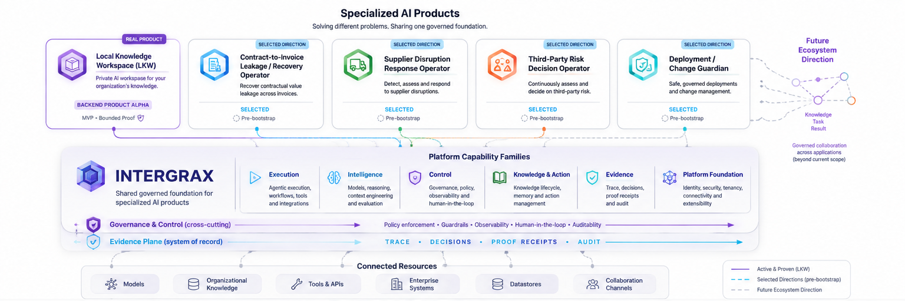
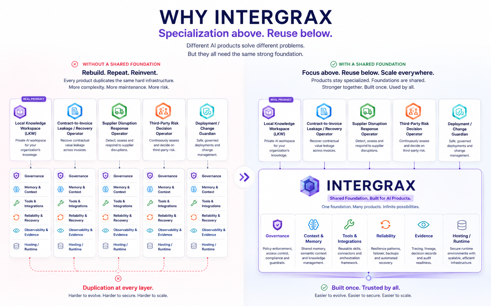
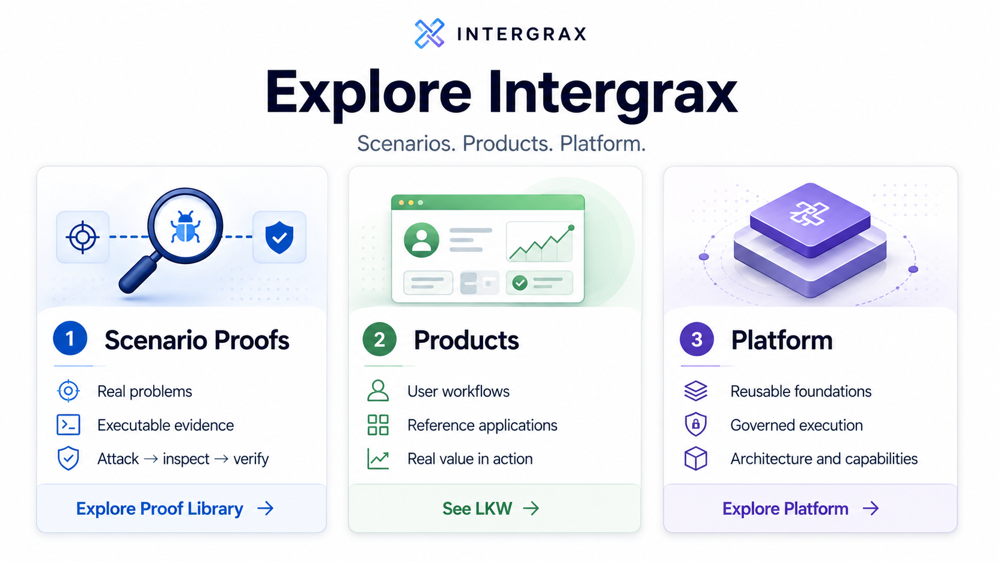
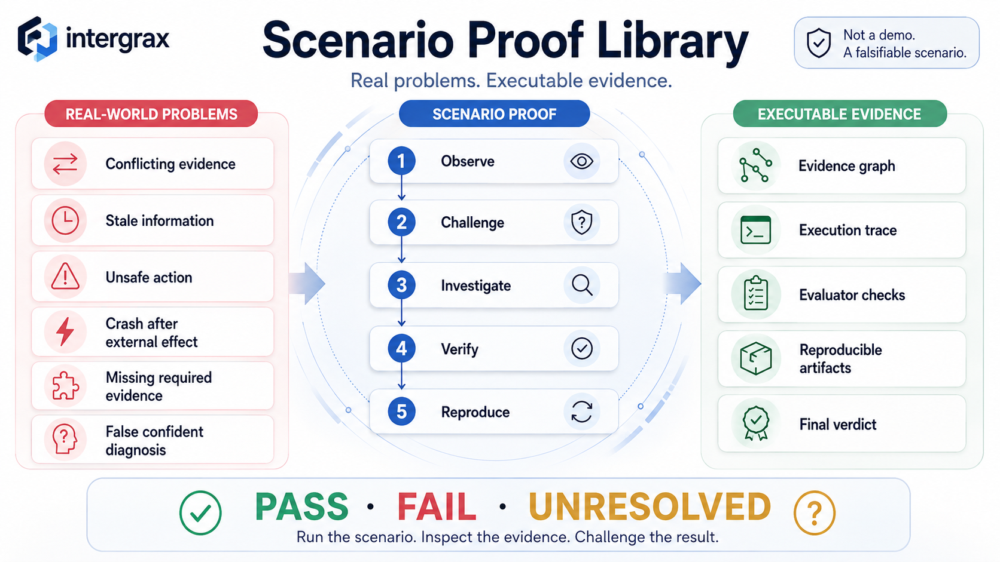
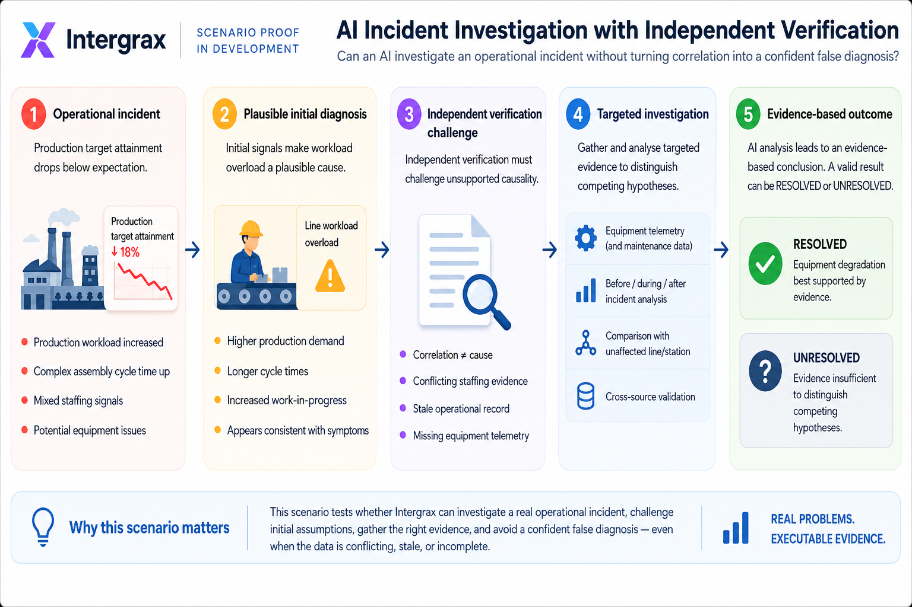
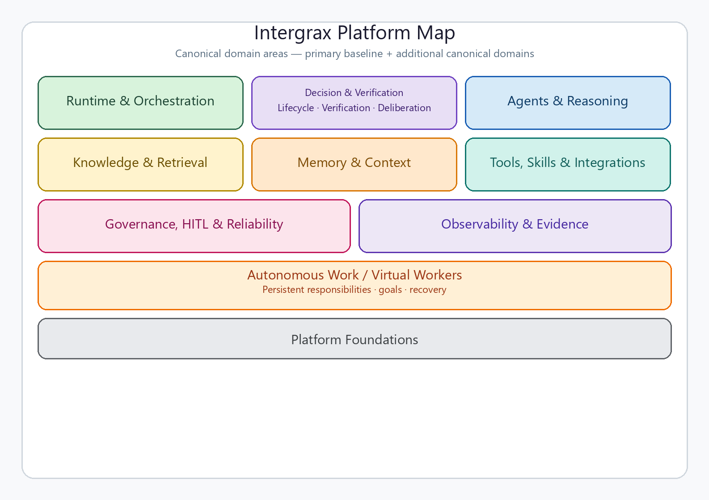
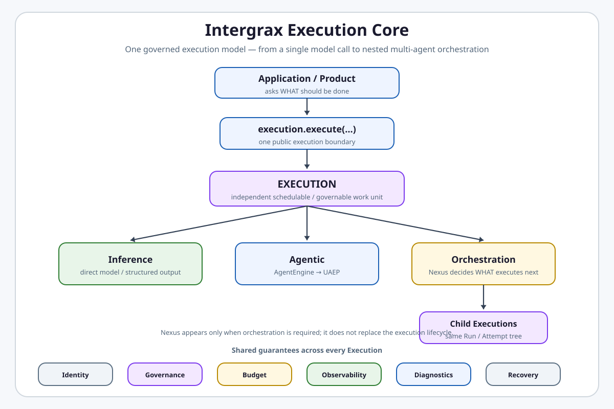
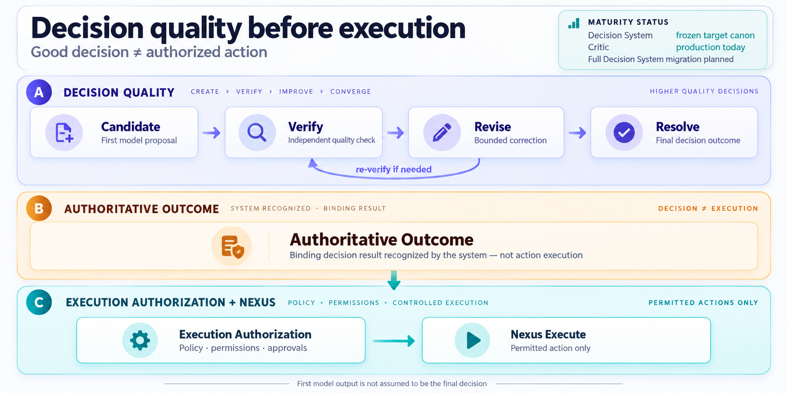
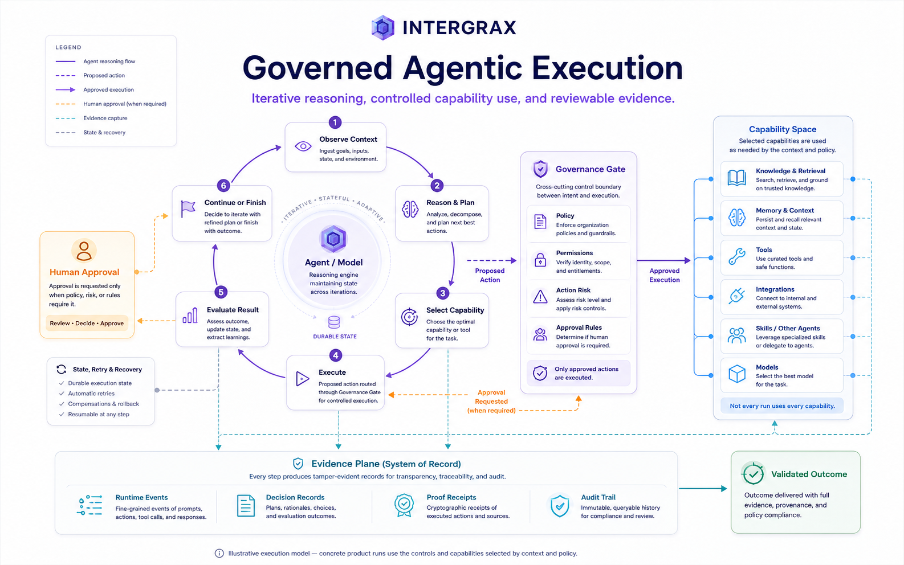

# Intergrax

Intergrax helps teams build specialized AI applications where policy, authority,
and evidence can determine whether an answer or action is allowed to proceed -
instead of leaving that decision entirely to the model.

It provides reusable governed foundations for knowledge, actions, approvals,
integrations, recovery, and reviewable evidence so product teams do not rebuild
those mechanisms for every workflow.

[](LICENSE)
[](#license-and-collaboration)
[](docs/project/proofs/PROOFS.md)

**[Explore Proof Library](docs/project/proofs/PROOF_LIBRARY.md)** · **[See LKW](applications/local_workspace_application/docs/product/LKW_PRODUCT_TOUR.md)** · **[Run LKW locally](applications/local_workspace_application/docs/product/QUICKSTART.md)** · **[Why Intergrax](docs/project/overview/WHY_INTERGRAX.md)**

> Intergrax is not trying to win by having more agent-framework features. Agent frameworks help build agent behavior and workflows; managed platforms help deploy and operate agentic workloads. Intergrax targets the **shared operating boundaries** across specialized AI products - policy, authority, evidence, execution, recovery, and canonical history - so they do not have to be rebuilt independently around every application.
>
> The hypothesis is that each next governed AI product can reuse more of this operating model. That acceleration is **not yet established** and remains a validation goal.

<a href="docs/project/assets/public/readme/fullsize/intergrax-ecosystem-hero.md">
<picture>
  <source media="(prefers-color-scheme: dark)" srcset="docs/project/assets/public/readme/intergrax-ecosystem-hero-dark.png">
  <source media="(prefers-color-scheme: light)" srcset="docs/project/assets/public/readme/intergrax-ecosystem-hero-light.png">
  
</picture>
</a>

> Intergrax is **source-available** and under **active R&D**.

**Current reality:** [Local Knowledge Workspace](applications/local_workspace_application/docs/product/LKW_PRODUCT_TOUR.md) is the active reference product at **Backend Product Alpha / MVP** with bounded proof paths. **Real-user validation** and **commercial validation** remain incomplete. Additional portfolio directions are **selected pre-bootstrap** only - their presence does not imply implementation or runtime proof.

---

<a id="start-here"></a>
## Choose your path

| If you are… | Start here | What this gives you |
| --- | --- | --- |
| AI Engineer / Builder | [Builder Quick Start](docs/project/builders/BUILDER_QUICKSTART.md) | Build a runnable agent + application stack |
| Architect / Principal Engineer | [Architecture Overview](docs/project/architecture/ARCHITECTURE_OVERVIEW.md) | Understand responsibilities, boundaries, and system design |
| CTO / Engineering Leader | [Use Cases](docs/project/overview/USE_CASES.md) | Decide whether Intergrax fits a concrete workflow |
| Scenario explorer | [Proof Library](docs/project/proofs/PROOF_LIBRARY.md) | Explore difficult real-world problems and executable Scenario Proofs |
| Technical Reviewer | [PROOFS](docs/project/proofs/PROOFS.md) | Audit evidence and public claims - what is implemented / boundedly proven |
| Investor / Strategic Evaluator | [Why Intergrax](docs/project/overview/WHY_INTERGRAX.md) | Understand the platform thesis, LKW wedge, and open validation gates |
| Design Partner / Integrator | [Partners](docs/project/community/PARTNERS.md) | Explore a bounded evaluation or pilot around a concrete workflow |

Looking for configuration, evaluation guidance, roadmap, collaboration,
permissions, capability-specific material, or deeper technical documentation?
Explore the [Public Documentation Map](docs/project/community/PUBLIC_DOCUMENTATION_MAP.md).

Questions? See the [FAQ](docs/project/overview/FAQ.md).

---

## Why this matters

Building an impressive AI demo is easier than operating a controlled AI
application that a team can review and trust. Teams repeatedly rebuild
knowledge access, policy, integrations, approvals, and evidence foundations
around each product.

Intergrax centralizes reusable mechanisms so product teams can focus on the
specialized workflow. Read [Why Intergrax](docs/project/overview/WHY_INTERGRAX.md)
for the category, problem, and fit.

Intergrax is evolving toward governed autonomous AI systems and persistent
**Virtual Workers** that own responsibilities and goals across many executions.
This is **canonical architecture / implementation roadmap** direction — the
Virtual Worker runtime, control plane, and Virtual Workforce product are
**not implemented yet**.

<a href="docs/project/assets/public/readme/fullsize/intergrax-why.md">
<picture>
  <source media="(prefers-color-scheme: dark)" srcset="docs/project/assets/public/readme/intergrax-why-dark.png">
  <source media="(prefers-color-scheme: light)" srcset="docs/project/assets/public/readme/intergrax-why-light.png">
  
</picture>
</a>

[View full-size diagram](docs/project/assets/public/readme/fullsize/intergrax-why.md)

---

## Explore Intergrax

Three useful ways to evaluate Intergrax - each answers a different question. The visual maps **Scenario Proofs**, **Products**, and **Platform**.

<a href="docs/project/assets/public/readme/fullsize/intergrax-three-entry-points.md">
<picture>
  <source media="(prefers-color-scheme: dark)" srcset="docs/project/assets/public/readme/intergrax-three-entry-points-dark.png">
  <source media="(prefers-color-scheme: light)" srcset="docs/project/assets/public/readme/intergrax-three-entry-points-light.png">
  
</picture>
</a>

[View full-size diagram](docs/project/assets/public/readme/fullsize/intergrax-three-entry-points.md)

**[Explore Proof Library](docs/project/proofs/PROOF_LIBRARY.md)** · **[See LKW](applications/local_workspace_application/docs/product/LKW_PRODUCT_TOUR.md)** · **[Explore Platform](#explore-the-intergrax-platform)**

---

## Real problems. Executable evidence.

**Scenario Proof Library**

Intergrax is easier to understand by watching it handle difficult problems - not by reading feature lists.

Scenario Proofs start where AI systems can fail: conflicting evidence, stale information, unsafe actions, crash after an external side effect, missing required evidence, or false confident diagnosis.

Scenario Proofs are executable falsification attempts against bounded real-world
system claims - designed to be run, inspected, challenged, and reproduced.

Each accepted Scenario Proof exposes: problem → failure risk → adversarial scenario → execution → evidence → verdict → reproduction.

Scenario Proofs are how Intergrax intends to show the same governed mechanisms surviving different bounded problems - observable evidence of reuse, not just a claim of reuse.

They are **not** a marketing demo, feature showcase, or product claim. Product, user, and commercial validation are tracked separately.

<a href="docs/project/assets/public/readme/fullsize/intergrax-scenarios-overview.md">
<picture>
  <source media="(prefers-color-scheme: dark)" srcset="docs/project/assets/public/readme/intergrax-scenarios-overview-dark.png">
  <source media="(prefers-color-scheme: light)" srcset="docs/project/assets/public/readme/intergrax-scenarios-overview-light.png">
  
</picture>
</a>

[View full-size diagram](docs/project/assets/public/readme/fullsize/intergrax-scenarios-overview.md)

**[Explore Proof Library](docs/project/proofs/PROOF_LIBRARY.md)** · **[Propose a Scenario](https://github.com/jakbuczarnecki/intergrax/issues/new?template=scenario_proposal.yml)**

### Featured scenario in development

**AI Incident Investigation with Independent Verification**

> Can an AI investigate an operational incident without turning correlation into a confident false diagnosis?

Initial production signals make workload overload plausible - but evidence is conflicting, stale, and incomplete. Independent verification must challenge unsupported causality, gather targeted evidence to distinguish competing hypotheses, and produce a bounded **RESOLVED** or honest **UNRESOLVED** outcome.

**Status:** FULL-1 RESOLVED and FULL-2 UNRESOLVED are implemented and executable; public Scenario Proof not yet accepted or published.

<a href="docs/project/assets/public/readme/fullsize/scenario-ai-incident-investigation.md">
<picture>
  <source media="(prefers-color-scheme: dark)" srcset="docs/project/assets/public/readme/scenario-ai-incident-investigation-dark.png">
  <source media="(prefers-color-scheme: light)" srcset="docs/project/assets/public/readme/scenario-ai-incident-investigation-light.png">
  
</picture>
</a>

[View full-size diagram](docs/project/assets/public/readme/fullsize/scenario-ai-incident-investigation.md)

**[Scenario design document](platform_proofs/scenarios/ai_incident_investigation/README.md)** · **[Proof Library](docs/project/proofs/PROOF_LIBRARY.md)**

---

## Local Knowledge Workspace (LKW)

LKW is a governed AI knowledge workspace for approved organizational knowledge,
grounded Ask workflows, source references, and persisted evidence. Intergrax
provides the governed evidence mechanisms underneath.

### Product workflow

```text
approved knowledge
→ LKW workspace
→ ask from Slack / supported client
→ grounded answer
→ sources / persisted evidence
```

**Slack** is the primary daily-use conversational interface direction for LKW
1.0. A bounded DM Ask path is live-verified today; broader Slack workspace,
source-management, and daily-use flows remain under productization.

**Status:** Backend Product Alpha / MVP - **PARTIAL**

**Accepted bounded proof paths:**

- Product Quick Start
- Governed Evidence Decision Proof
- Trusted Ask
- Core Platform Proof

#### A. Product Quick Start

The easiest supported local executable product path - indexed Ask V1, not Hybrid Ask
qualification:

- **indexed Ask V1** over a bundled sample document
- **AURORA-17** is the expected success marker
- one-command onboarding - does **not** require Slack setup

[Run Product Quick Start](applications/local_workspace_application/docs/product/QUICKSTART.md)

#### B. Governed Evidence Decision Proof

Advanced bounded proof inside the LKW application stack demonstrating governed
answer admissibility over four independent **controlled live providers**
(Docker-backed organizational services via real runtime/HTTP; **not external SaaS validation**) - `LIVE_ONLY` obligations, versioned policy-derived
requirements, execution-time authority revalidation, temporal admissibility,
typed failure semantics, deterministic LLM suppression when admissibility is
unsatisfied, and persisted structural proof.

**Hybrid Ask combining indexed and authorized live evidence** is outside this
proof's scope - see the [Governed Evidence Decision Proof](applications/local_workspace_application/docs/proof/GOVERNED_HYBRID_KNOWLEDGE_PROOF.md).

<a href="applications/local_workspace_application/docs/assets/fullsize/lkw-governed-evidence-gate.md">
<picture>
  <source media="(prefers-color-scheme: dark)" srcset="applications/local_workspace_application/docs/assets/lkw-governed-evidence-gate-dark.png">
  <source media="(prefers-color-scheme: light)" srcset="applications/local_workspace_application/docs/assets/lkw-governed-evidence-gate-light.png">
  
</picture>
</a>

**Other bounded paths:** indexed Hybrid Ask branch (`LKW-HYBRID-ASK-INDEXED`) -
real application code path; [Trusted Ask](applications/local_workspace_application/docs/proof/LKW_PLATFORM_PROOF.md#trusted-ask-workspace-mvp-2)
(`LKW-ASK-WORKSPACE-LIVE`) - durable workspace Ask across restart. Current limits
(external live-provider access, end-user packaging; real-user validation and commercial
validation incomplete): [LKW Platform Proof](applications/local_workspace_application/docs/proof/LKW_PLATFORM_PROOF.md) · [PROOFS](docs/project/proofs/PROOFS.md).

## Try LKW

Run the supported Product Quick Start on Windows, Linux, or macOS. The expected
answer marker is `AURORA-17`. Prerequisites, commands, and troubleshooting live
in the [LKW Quick Start](applications/local_workspace_application/docs/product/QUICKSTART.md).

<a id="try-lkw"></a>

### LKW routes

| Route | Purpose |
| --- | --- |
| [Product Tour](applications/local_workspace_application/docs/product/LKW_PRODUCT_TOUR.md) | Understand what the product experience looks like |
| [Quick Start](applications/local_workspace_application/docs/product/QUICKSTART.md) | Run the canonical product path |
| [Governed Evidence Decision Proof](applications/local_workspace_application/docs/proof/GOVERNED_HYBRID_KNOWLEDGE_PROOF.md) | Inspect advanced governed evidence admissibility over controlled live providers |
| [Core Platform Proof](applications/local_workspace_application/docs/proof/LKW_PLATFORM_PROOF.md) | Verify bounded infrastructure/platform behavior |

**Core Platform Proof** is separate from Product Quick Start and Trusted Ask: a
platform-level bounded proof covering startup/readiness, durable knowledge and
execution, background processing, persisted reviewable evidence, hosting/recovery,
and watched-folder indexing - not production readiness, commercial validation,
or provider-wide qualification.

**Proof families:** Product evaluation (`LKW-PRODUCT-QUICKSTART-*`), Core platform (`LKW-BACKGROUND-TASK`, `LKW-HOSTING`, `LKW-FILE-WATCHER`), Indexed Hybrid Ask (`LKW-HYBRID-ASK-INDEXED`), Trusted Ask (`LKW-ASK-WORKSPACE-LIVE`), Governed Evidence Decision Proof (`advanced_flagship_proof`).

---

<a id="explore-the-intergrax-platform"></a>
## Explore the Intergrax Platform

**What is Intergrax built from?** The platform is organized into human-readable
areas below. Each area links to canonical **domain architecture** documents -
the public entry points for *what* a subsystem should do. For cross-layer
capabilities, see [Platform capabilities](#platform-capabilities) and
[Future strategic directions](#future-strategic-directions).
For deep engineering registers, use architecture **satellites** (on demand via the
[Technical Documentation Map](docs/project/technical/DOCUMENTATION_MAP.md)) -
not as a first-contact route.

<a href="docs/project/assets/public/readme/fullsize/intergrax-platform-map.md">
<picture>
  <source media="(prefers-color-scheme: dark)" srcset="docs/project/assets/public/readme/intergrax-platform-map-dark.png">
  <source media="(prefers-color-scheme: light)" srcset="docs/project/assets/public/readme/intergrax-platform-map-light.png">
  
</picture>
</a>

[View full-size diagram](docs/project/assets/public/readme/fullsize/intergrax-platform-map.md)

| Platform area | What it provides | Explore |
| --- | --- | --- |
| **Runtime & Orchestration** | Unified execution, workflow orchestration, and Nexus execution paths | [Unified Execution Runtime](docs/project/architecture/UNIFIED_EXECUTION_RUNTIME.md) · [Orchestration](docs/project/architecture/ORCHESTRATION.md) · [Nexus Execution Flow](docs/project/architecture/NEXUS_EXECUTION_FLOW.md) |
| **Agents & Reasoning** | Agent contracts, reasoning and cognition, adaptive harness intelligence | [Agent Contracts & Assembly](docs/project/architecture/AGENT_CONTRACTS_AND_ASSEMBLY.md) · [Reasoning & Cognition](docs/project/architecture/REASONING_AND_COGNITION.md) · [Adaptive Harness Intelligence](docs/project/architecture/ADAPTIVE_HARNESS_INTELLIGENCE.md) |
| **Decision & Verification** | Decision lifecycle, compositional verification, and deliberation strategies inside Nexus - **target canon**; production remains Critic until migration | [Decision System](docs/project/architecture/DECISION_SYSTEM.md) · [Decision Verification](docs/project/architecture/DECISION_VERIFICATION.md) · [Decision Deliberation](docs/project/architecture/DECISION_DELIBERATION.md) · **CURRENT:** [Critic Verification](docs/project/architecture/CRITIC_VERIFICATION.md) |
| **Knowledge & Retrieval** | Retrieval, grounding, and knowledge-source integration boundaries | [RAG](docs/project/architecture/RAG.md) · [Knowledge Source Integrations](docs/project/architecture/KNOWLEDGE_SOURCE_INTEGRATIONS.md) |
| **Memory & Context** | Durable memory, context engineering, and unified context lifecycle | [Memory](docs/project/architecture/MEMORY.md) · [Context Engineering](docs/project/architecture/CONTEXT_ENGINEERING.md) · [Unified Context Lifecycle](docs/project/architecture/UNIFIED_CONTEXT_LIFECYCLE.md) |
| **Tools, Skills & Integrations** | Tools, skills, integrations, LLM adapters, and code-craft surfaces | [Tools](docs/project/architecture/TOOLS.md) · [Skills](docs/project/architecture/SKILLS.md) · [Integrations](docs/project/architecture/INTEGRATIONS.md) · [LLM Adapters](docs/project/architecture/LLM_ADAPTERS.md) · [Code Craft](docs/project/architecture/CODE_CRAFT.md) |
| **Governance, HITL & Reliability** | Policy and approval enforcement, failure handling, and human-in-the-loop | [Governed Execution](docs/project/architecture/GOVERNED_EXECUTION.md) · [Reliability / Failure / HITL](docs/project/architecture/RELIABILITY_FAILURE_AND_HITL.md) |
| **Observability & Evidence** | Runtime observability, proof receipts, and reviewable execution records | [Observability](docs/project/architecture/OBSERVABILITY.md) · [Proof Receipts](docs/project/architecture/PROOF_RECEIPTS.md) |
| **Autonomous Work / Virtual Workers** | Persistent governed workers that own responsibilities and goals across many executions — **canonical architecture; runtime not implemented** | [Autonomous Work](docs/project/architecture/AUTONOMOUS_WORK.md) · [Virtual Workforce](docs/project/overview/VIRTUAL_WORKFORCE.md) |
| **Extensibility & Ecosystem** | Governed plugins, agent distribution, marketplace direction, multiplayer collaboration | [Platform Plugins](docs/project/architecture/PLATFORM_PLUGINS.md) · [Agent Distribution](docs/project/architecture/AGENT_DISTRIBUTION.md) · [Multiplayer AI](docs/project/capabilities/architecture/MULTIPLAYER_AI.md) · [Agent Marketplace](docs/project/overview/AGENT_MARKETPLACE.md) |
| **Application Platform** | Tier-3 application environment and application hosting | [Tier-3 Application Environment](docs/project/architecture/TIER3_APPLICATION_ENVIRONMENT.md) · [Application Hosting](docs/project/architecture/APPLICATION_HOSTING.md) |
| **Platform Foundations & Scale** | Core platform foundation, elastic capacity, modality, and developer experience | [Platform Foundation](docs/project/architecture/PLATFORM_FOUNDATION.md) · [Elastic Capacity & Scaling](docs/project/architecture/ELASTIC_CAPACITY_AND_SCALING.md) · [Modality](docs/project/architecture/MODALITY.md) · [Experimentation & DX](docs/project/architecture/EXPERIMENTATION_AND_DEVELOPER_EXPERIENCE.md) |

Full technical domain index:
[runtime architecture hub](docs/project/architecture/intergrax_runtime_architecture.md).
Project-level mental model:
[Architecture Overview](docs/project/architecture/ARCHITECTURE_OVERVIEW.md).

| Route | Start here |
| --- | --- |
| **Explore difficult scenarios** | [Proof Library](docs/project/proofs/PROOF_LIBRARY.md) |
| **Build** | [Builder Quick Start](docs/project/builders/BUILDER_QUICKSTART.md) |
| **Understand architecture** | [Architecture Overview](docs/project/architecture/ARCHITECTURE_OVERVIEW.md) |
| **Audit evidence and claims** | [PROOFS](docs/project/proofs/PROOFS.md) |
| **Explore all documentation** | [Public Documentation Map](docs/project/community/PUBLIC_DOCUMENTATION_MAP.md) · [Technical Documentation Map](docs/project/technical/DOCUMENTATION_MAP.md) |

---

## One execution model across the platform

Intergrax uses one execution model across the platform: workloads may be direct
inference, autonomous agent execution, or orchestration through Nexus for child
Executions - without forcing every request through the same orchestration machinery.
Execution is the common governed unit; identity, authority, budgets, observability,
diagnostics, and recovery stay correlated across the execution tree.

<a href="docs/project/architecture/UNIFIED_EXECUTION_ARCHITECTURE.md">
<picture>
  <source media="(prefers-color-scheme: dark)" srcset="docs/project/architecture/assets/unified-execution-platform-core-dark.svg">
  <source media="(prefers-color-scheme: light)" srcset="docs/project/architecture/assets/unified-execution-platform-core-light.svg">
  
</picture>
</a>

[Explore the Unified Execution Architecture](docs/project/architecture/UNIFIED_EXECUTION_ARCHITECTURE.md)

The unified model is the frozen target architecture; implementation is migrating
toward it, and linked domain documents distinguish target semantics from current
runtime state.

---

## Decision quality before execution

Intergrax does not have to treat the first model output as the final decision.
A governed run can treat model output as a **candidate**, run **verification**,
surface **disagreement**, apply bounded **revision**, and reach an **authoritative
outcome** - separate from **execution authorization** and Nexus side effects.

> **Maturity:** Decision System architecture is **frozen target canon** (A4).
> Runtime migration is **planned**; production correctness remains the **Critic /
> CVL path** until clean-cut migration. Council is **not shipped**.

<a href="docs/project/assets/public/readme/fullsize/intergrax-decision-system.md">
<picture>
  <source media="(prefers-color-scheme: dark)" srcset="docs/project/assets/public/readme/intergrax-decision-system-dark.png">
  <source media="(prefers-color-scheme: light)" srcset="docs/project/assets/public/readme/intergrax-decision-system-light.png">
  
</picture>
</a>

[View full-size diagram](docs/project/assets/public/readme/fullsize/intergrax-decision-system.md) · [Decision System](docs/project/architecture/DECISION_SYSTEM.md) · [Verification](docs/project/architecture/DECISION_VERIFICATION.md) · [Deliberation](docs/project/architecture/DECISION_DELIBERATION.md)

---

## AI execution should not be a black box

Meaningful AI execution should be reconstructable, reviewable, and attributable.
Intergrax is designed so important actions do not disappear inside an opaque agent loop.

<a href="docs/project/assets/public/readme/fullsize/intergrax-governed-execution.md">
<picture>
  <source media="(prefers-color-scheme: dark)" srcset="docs/project/assets/public/readme/intergrax-governed-execution-dark.png">
  <source media="(prefers-color-scheme: light)" srcset="docs/project/assets/public/readme/intergrax-governed-execution-light.png">
  
</picture>
</a>

[View full-size diagram](docs/project/assets/public/readme/fullsize/intergrax-governed-execution.md)

A governed run can leave correlated runtime events, typed [`DecisionRecord`](docs/project/architecture/REASONING_AND_COGNITION.md) artifacts, and structured [`ProofReceipt`](docs/project/architecture/PROOF_RECEIPTS.md) evidence.
This is execution-level explainability, not hidden model reasoning.
Universal every-path production observability is not claimed.

[Observability](docs/project/architecture/OBSERVABILITY.md) ·
[Reasoning / DecisionRecord](docs/project/architecture/REASONING_AND_COGNITION.md) ·
[Proof Receipts](docs/project/architecture/PROOF_RECEIPTS.md)

**Runnable evidence:** Inspect the current bounded LKW observability proof, including independently inspectable Elasticsearch/Kibana records, controlled Sentry problem signals, and persisted execution evidence.
[LKW bounded observability proof](applications/local_workspace_application/docs/proof/LKW_PLATFORM_PROOF.md) · [Controlled Sentry proof](applications/local_workspace_application/docs/SENTRY_OBSERVABILITY.md)

## Responsibility model

The root-level model is about responsibility, not a mandatory execution
sequence. A request uses only the configured resources its product context
selects.

| Responsibility | What it owns |
| --- | --- |
| **Specialized product application** | Product workflow, UX, business semantics, permissions, and acceptance |
| **Intergrax** | Reusable application operating layer for policy and approval boundaries, controlled context, governed execution, recovery, observability, and evidence / provenance |
| **Model / agent** | Reasoning, inference, and decision generation within supplied context and governed boundaries |
| **Knowledge / tools / integrations / models** | Selected resources behind configured access and effect boundaries |
| **Evidence / provenance** | Reviewable receipts, traces, and records produced during execution |

See the [Architecture Overview](docs/project/architecture/ARCHITECTURE_OVERVIEW.md)
for the complete responsibility model.

<a id="platform-capabilities"></a>
## Platform capabilities

Compact index of implemented and boundedly proven platform capabilities. Status is
capability-specific; see linked architecture and proof routes for detail.

| Capability | What it adds | Current maturity | Explore |
| --- | --- | --- | --- |
| **Governed Execution** | Reusable policy and approval enforcement around agent decisions, tool/action boundaries and meaningful side effects, with canonical HITL and plugin-extensible policy rules | **IMPLEMENTED CORE - coverage / qualification ongoing** - complete platform-wide governance and production qualification **not established** | [Governed Execution](docs/project/architecture/GOVERNED_EXECUTION.md) |
| **Observability & Auditability** | Shared observability spine for reconstructable, reviewable governed execution - runtime events, [`DecisionRecord`](docs/project/architecture/REASONING_AND_COGNITION.md) artifacts, [`ProofReceipt`](docs/project/architecture/PROOF_RECEIPTS.md) evidence; execution-level explainability, not hidden chain-of-thought | **IMPLEMENTED CORE + BOUNDED PROOF** - universal every-path production observability **not claimed** | [Observability](docs/project/architecture/OBSERVABILITY.md) · [LKW bounded observability proof](applications/local_workspace_application/docs/proof/LKW_PLATFORM_PROOF.md) · [Controlled Sentry proof](applications/local_workspace_application/docs/SENTRY_OBSERVABILITY.md) |
| **Token Optimization** | Featured platform-capability proof - policy-governed context and prompt optimization with receipts, fallback, and bounded offline proof | **PARTIAL - bounded** - universal savings and production-proven savings **not established** | [Token Optimization guide](docs/project/capabilities/token_optimization/README.md) · [Claim guardrails](docs/project/capabilities/TOKEN_OPTIMIZATION_CLAIMS.md) |

<a id="future-strategic-directions"></a>
### Future strategic directions

Selected portfolio and platform directions that are **not shipped today** or
lack established runtime proof:

| Direction | What it adds | Current maturity | Explore |
| --- | --- | --- | --- |
| **Multiplayer AI** | Governed multi-principal collaboration among humans, agents, services, and external agents | **Architecture / roadmap stage** - runtime proof **not yet established** | [Multiplayer AI architecture](docs/project/capabilities/architecture/MULTIPLAYER_AI.md) |
| **Autonomous Work / Virtual Workforce** | Persistent Virtual Workers that own business responsibilities and goals across many governed executions | **Canonical architecture frozen** — worker runtime, control plane, reference application, and end-to-end proof **not implemented** | [Virtual Workforce](docs/project/overview/VIRTUAL_WORKFORCE.md) · [Autonomous Work](docs/project/architecture/AUTONOMOUS_WORK.md) |
| **Platform Extensibility** | Governed extension/package model across domain-owned contracts | **Canonical architecture frozen** - multiple extension-platform slices implemented; core program closed. Residual Protocol v2 work remains planned; complete third-party install-to-runtime E2E proof **not yet established** | [Platform Plugins](docs/project/architecture/PLATFORM_PLUGINS.md) |
| **Agent Marketplace** | Future ecosystem layer - discovery and distribution over governed Agent Distribution / Platform Extensibility | **FUTURE PRODUCT - NOT SHIPPED TODAY** | [Agent Marketplace concept](docs/project/overview/AGENT_MARKETPLACE.md) |

## License and collaboration

Intergrax is **source-available** under the Intergrax Evaluation and
Collaboration License 1.0. You may clone, install, run, test, and modify the
repository locally for **non-production evaluation**, subject to the
[LICENSE](LICENSE).

Feedback, contribution, permission, and pilot routes are described in
[Collaboration](docs/project/community/COLLABORATION.md) and
[Partners](docs/project/community/PARTNERS.md). Production use, commercial use,
hosting, and redistribution require **explicit written permission or agreement**
under the legally authoritative [LICENSE](LICENSE).
