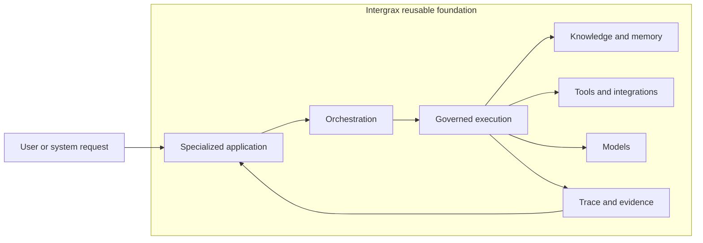

# Intergrax

Intergrax helps teams build AI applications that can use their knowledge and tools while keeping access, actions, and evidence under control.

Teams reuse shared policy, knowledge, integration, execution, and evidence foundations instead of rebuilding them for every product.

Local Knowledge Workspace (LKW) is the primary product path: a private-by-default workspace for adding approved knowledge sources, asking questions, and receiving grounded answers with source references and inspectable evidence.

[](https://www.python.org/downloads/)
[](LICENSE)
[](#license-and-collaboration)
[](PROOFS.md)

**[Try LKW](#try-lkw)** · [See the LKW workflow](LKW_PRODUCT_TOUR.md) · [Explore Token Optimization](#token-optimization) · [Review architecture and proofs](ARCHITECTURE_OVERVIEW.md) · [PROOFS.md](PROOFS.md)

> Intergrax is **source-available** and under **active R&D**. LKW is a **Backend Product Alpha / MVP**. **Real-user validation** and **commercial validation** are incomplete.

---

## Local Knowledge Workspace (LKW)

### Product workflow

1. Add an approved knowledge source.
2. Intergrax processes and indexes it.
3. Ask a question over indexed knowledge.
4. Receive a grounded result with source references and inspectable evidence.

<picture>
  <source
    media="(prefers-color-scheme: dark)"
    srcset="docs/assets/public/lkw-grounded-result-dark.svg"
  >
  <source
    media="(prefers-color-scheme: light)"
    srcset="docs/assets/public/lkw-grounded-result-light.svg"
  >
  
</picture>

This neutral visual represents the documented Quick Start, not a finished UI screenshot; dynamic workspace and Ask-run IDs are omitted.

**See the complete LKW product tour** → [LKW_PRODUCT_TOUR.md](LKW_PRODUCT_TOUR.md)

### What is boundedly proven today

LKW is a Backend Product Alpha / MVP under active development. The current bounded product proof covers indexed knowledge workflows; complete live or hybrid access, finished end-user packaging, real-user validation, and commercial validation are not complete.

**Boundedly demonstrated:**

- indexed knowledge and background ingest;
- persisted knowledge across documented restart paths;
- grounded Ask over documented indexed content;
- hosting, observability and ProofReceipt evidence.

**Not complete:**

- Hybrid Ask;
- complete live-provider access;
- finished end-user packaging;
- real-user validation;
- commercial validation.

**Review the bounded LKW proof** → [docs/public-adoption/LKW_PLATFORM_PROOF.md](docs/public-adoption/LKW_PLATFORM_PROOF.md)

**Check current proof status** → [PROOFS.md](PROOFS.md)

---

## Try LKW

One supported command takes you from repository checkout to a grounded answer with a source citation over indexed knowledge — using managed file upload, without manual API JSON or local path allowlists.

**Windows:**

```bat
applications\local_workspace_application\scripts\run-lkw-product-quickstart-windows.bat
```

**Linux:**

```sh
./applications/local_workspace_application/scripts/run-lkw-product-quickstart-linux.sh
```

**macOS:**

```sh
./applications/local_workspace_application/scripts/run-lkw-product-quickstart-macos.sh
```

**Expected answer marker:** `AURORA-17` · **Expected source file:** `lkw_product_quickstart.txt`

**Detailed guide:** [applications/local_workspace_application/docs/QUICKSTART.md](applications/local_workspace_application/docs/QUICKSTART.md)

First run may download Docker images and the configured local model; duration depends on your environment and is not yet externally validated as a fixed time target.

<a id="try-lkw"></a>

---

## Why this matters

Building an impressive AI demo is relatively easy. Operating a controlled application that a team can review and trust is harder.

Teams repeatedly rebuild permissions, knowledge access, integrations, policy enforcement, and evidence collection for every new product. Intergrax centralizes those reusable foundations so product teams can focus on the concrete workflow.

**Why Intergrax:** [WHY_INTERGRAX.md](WHY_INTERGRAX.md)

---

## The foundation behind LKW

Intergrax is a reusable foundation for governed AI applications.

| Outcome | What it means |
| ------- | ------------- |
| **Product-first development** | Ship a specialized product workflow on shared foundations instead of inventing a new runtime stack each time. |
| **Controlled execution and evidence** | Policy, budgets, human review, and trace surround every step — not bolted on after the demo works. |
| **Reusable foundations across applications** | Indexing, retrieval, receipts, and observability are platform capabilities products compose — not one-off scripts. |
| **Clear responsibility boundaries** | Applications, orchestration, agents, and the harness each own a clear slice of the system. |

<picture>
  <source
    media="(prefers-color-scheme: dark)"
    srcset="docs/assets/public/intergrax-hero-dark.svg"
  >
  <source
    media="(prefers-color-scheme: light)"
    srcset="docs/assets/public/intergrax-hero-light.svg"
  >
  
</picture>

A specialized product hosts the user workflow; Intergrax supplies orchestration, governed execution, knowledge systems, tools, models, and evidence collection around that workflow.



**Deep dive:** [Architecture overview](ARCHITECTURE_OVERVIEW.md) · [Harness AI narrative](docs/guides/INTERGRAX_HARNESS_NARRATIVE.md) · [Technical documentation map](docs/DOCUMENTATION_MAP.md)

---

## What exists today

> [!WARNING]
> **Implemented code** does not automatically mean **live proof**, **finished product**, **production readiness**, or **commercial validation**.

| Area | Status |
| ---- | ------ |
| **LKW** | PARTIAL — Backend Product Alpha / MVP |
| **Token Optimization** | PARTIAL |
| **Shared platform foundations** | IMPLEMENTED — bounded supporting evidence |

Full matrices, limitations, and claim boundaries: **[PROOFS.md](PROOFS.md)**

---

## Token Optimization

**Secondary platform capability**

Token Optimization is a reusable platform mechanism for deterministic prompt and context optimization under policy — with protected-region validation, receipts and fallback, and a bounded vLLM proof path.

**Implemented today:** deterministic optimization pipeline, approved-configuration routing, protected-region validation, receipts and fallback, cache-stable prompt assembly, exact-send integrity, and cache-aware execution.

**Not complete:** durable in-cache compaction is incomplete; universal hard gates are incomplete; **universal savings not claimed**; production-proven savings are not claimed.

**Go deeper:** [Token Optimization guide](docs/features/token_optimization/README.md) · [Claim guardrails](docs/public-adoption/TOKEN_OPTIMIZATION_CLAIMS.md)

---

## Choose your path

| Goal | Start here |
| ---- | ---------- |
| Understand LKW without running it | [LKW_PRODUCT_TOUR.md](LKW_PRODUCT_TOUR.md) |
| Try LKW | [LKW Quick Start](applications/local_workspace_application/docs/QUICKSTART.md) |
| Review bounded technical evidence | [LKW Platform Proof](docs/public-adoption/LKW_PLATFORM_PROOF.md) |
| Review current proofs | [PROOFS.md](PROOFS.md) |
| Understand the architecture | [ARCHITECTURE_OVERVIEW.md](ARCHITECTURE_OVERVIEW.md) |
| Start building with Intergrax | [BUILDER_QUICKSTART.md](BUILDER_QUICKSTART.md) |
| Plan a deeper build | [BUILD_WITH_INTERGRAX.md](BUILD_WITH_INTERGRAX.md) |
| Run a broader evaluation | [EVALUATION_GUIDE.md](EVALUATION_GUIDE.md) |
| Explore use cases | [USE_CASES.md](USE_CASES.md) |
| Discuss a pilot or partnership | [PARTNERS.md](PARTNERS.md) |
| Review license and permission boundaries | [COLLABORATION.md](COLLABORATION.md) and [LICENSE](LICENSE) |

Technical documentation: [Public Documentation Map](docs/PUBLIC_DOCUMENTATION_MAP.md) · [Technical Documentation Map](docs/DOCUMENTATION_MAP.md)

<!-- Compatibility anchors for inbound documentation links -->
<a id="quick-start"></a>
<a id="proof-of-platform"></a>
<a id="start-here"></a>
<a id="harness-ai--the-core-idea"></a>
<a id="the-agent-model--why-architects-choose-intergrax"></a>

---

## Current boundaries

Intergrax is **not** currently positioned as:

- a finished SaaS;
- a product with completed Hybrid Ask;
- a product with completed real-user validation;
- a product with completed commercial validation;
- a universal production-readiness claim;
- a universal token-savings claim.

---

## License and collaboration

Intergrax is **source-available** under the Intergrax Evaluation and Collaboration License 1.0.

You may clone, install, run, test, and modify the repository locally for **non-production evaluation**. Authorized collaboration and contribution paths are described in [COLLABORATION.md](COLLABORATION.md).

**Production use**, **commercial use**, hosting, and redistribution require **explicit written permission**. [LICENSE](LICENSE) is legally authoritative.
