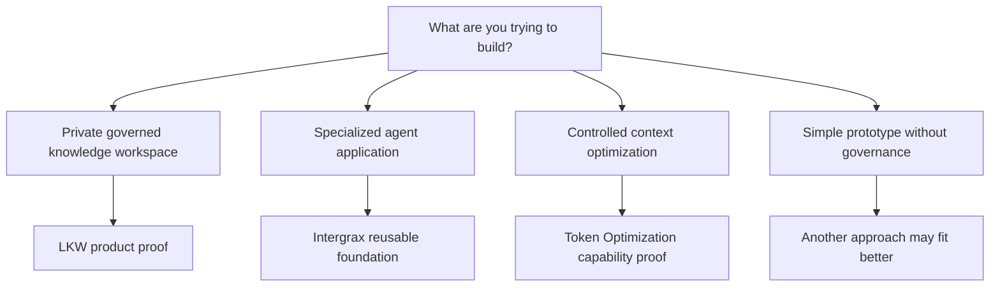

<!--
© Artur Czarnecki. All rights reserved.
Intergrax is source-available under the Intergrax Evaluation and Collaboration License 1.0.
See LICENSE for permitted evaluation, collaboration, and contribution use.
-->

# Intergrax Use Cases

This document helps you determine whether Intergrax fits a concrete governed agent or knowledge-workflow problem — with honest boundaries about what is proven, partial, or planned.

> [!NOTE]
> Intergrax is **source-available** and under active R&D. LKW is the strongest current product use case — **Primary product proof**, **Backend Product Alpha / MVP** — with **PARTIAL** proof status. Other use cases range from bounded platform support to planned validation.

Primary decision audience: CTO, product lead or technical buyer assessing fit, maturity, risk and the next bounded evaluation step.

## At a glance

| Question | Answer |
|----------|--------|
| Strongest current fit | Governed private knowledge workspace |
| Best public proof | [LKW Platform Proof](docs/public-adoption/LKW_PLATFORM_PROOF.md) |
| Best fit for platform evaluators | Specialized applications requiring policy, evidence, knowledge or controlled tools |
| Next product fit to validate | Multi-source indexed + authorized live evidence workflow |
| Not a fit today | Finished SaaS, generic no-code builder or unrestricted open-source framework |

## Buyer decision path

| Decision question | Where to check | Decision output |
| ----------------- | -------------- | --------------- |
| Does the concrete workflow fit the current product or platform direction? | This Use Cases guide | Fit, bounded fit, planned fit or not a fit |
| What is actually implemented or boundedly proven? | [PROOFS.md](PROOFS.md) | Current evidence and claim limits |
| Which important capabilities remain incomplete? | Current boundaries in this guide and [ROADMAP.md](ROADMAP.md) | Known product and validation risk |
| Is a non-production technical evaluation justified? | [EVALUATION_GUIDE.md](EVALUATION_GUIDE.md) | Proceed, defer or stop |
| Does the intended activity require a pilot or written permission? | [PARTNERS.md](PARTNERS.md), [COLLABORATION.md](COLLABORATION.md) and [LICENSE](LICENSE) | Correct partner and permission route |

The primary buyer next action after confirming apparent fit is to [review the current proof status](PROOFS.md) before starting a pilot or commercial discussion.

The diagram shows **evaluation routes**, not completed commercial products. Follow links below for current proof status.

## Primary use case today — Private Knowledge Workspace

### The problem

Knowledge is distributed across private files, Web sources and organizational systems. Answers need citations and evidence. Source access must be controlled. Indexing, live access and permissions must not be mixed implicitly. Deployment and storage should remain user-controlled.

### What LKW aims to provide

- Durable workspace configuration
- Approved indexed sources
- Grounded Ask with citations and evidence
- Controlled conversational access (Slack DM today, partial)
- Future authorized live evidence through Hybrid Ask — **Hybrid Ask is not complete**

### Current boundary

**Primary product proof** · **Backend Product Alpha / MVP** · **PARTIAL**

Verify: [LKW Platform Proof](docs/public-adoption/LKW_PLATFORM_PROOF.md) · [PROOFS.md](PROOFS.md)

Hybrid Ask and complete live provider access are not currently available.

## Current bounded-fit use cases

| Use case | User outcome | Current support | Verify |
|----------|--------------|-----------------|--------|
| Governed knowledge assistant over indexed sources | Ask over approved indexed knowledge with citations | Bounded through LKW indexed knowledge proof | [LKW Platform Proof](docs/public-adoption/LKW_PLATFORM_PROOF.md) |
| Reusable foundation for a specialized agent application | Build a product on shared policy, knowledge and evidence foundations | Shared platform mechanisms with bounded supporting evidence; product-specific validation still required | [BUILD_WITH_INTERGRAX.md](BUILD_WITH_INTERGRAX.md) |
| Evidence-aware agent or integration workflow | Inspect runs with trace, receipts and boundary evidence | Bounded supporting paths; not a certification or compliance claim | [BoundaryAttest case study](docs/case-studies/BOUNDARYATTEST_ATTESTATION_POC.md) |
| Governed prompt and context optimization | Deterministic optimization under policy with receipts | **Featured platform-capability proof**; **PARTIAL** with bounded vLLM evidence | [Token Optimization guide](docs/features/token_optimization/README.md) |

Universal savings are not claimed for Token Optimization.

## Use cases to validate next

| Desired user result | What remains unproven |
|---------------------|----------------------|
| Multi-source knowledge investigation combining indexed and authorized live evidence | Hybrid Ask end-to-end with unified provenance — **Hybrid Ask is not complete** |
| Slack as interaction surface and approved knowledge source | Durable connected Slack knowledge workflow |
| Governed Google Workspace knowledge inside LKW | First bounded Google Workspace proof after prerequisite product proof |
| Repeatable design-partner deployment | Self-serve setup without ad hoc developer reconstruction |
| Recurring knowledge-workspace usage by real users | Real-user validation incomplete; commercial validation incomplete |

See [ROADMAP.md](ROADMAP.md) for outcome-gated direction.

## Fit matrix

| Your need | Current fit | Why | Best next step |
|-----------|-------------|-----|----------------|
| Private governed knowledge workspace | **Strongest current fit** | LKW is the Primary product proof with bounded indexed-knowledge path | [LKW Platform Proof](docs/public-adoption/LKW_PLATFORM_PROOF.md) |
| Specialized application requiring policy and evidence | **Reasonable technical evaluation** | Shared foundations exist; your product still needs its own validation | [BUILD_WITH_INTERGRAX.md](BUILD_WITH_INTERGRAX.md) |
| Multiple agent applications sharing foundations | **Reasonable technical evaluation** | Reusable mechanisms with bounded evidence; not a finished platform product | [ARCHITECTURE_OVERVIEW.md](ARCHITECTURE_OVERVIEW.md) |
| Full multi-provider live assistant needed immediately | **Not a fit today** | Live provider access and Hybrid Ask remain incomplete | [ROADMAP.md](ROADMAP.md) |
| Multi-source investigation combining indexed and authorized live evidence | **Planned fit** | Hybrid Ask remains incomplete | [ROADMAP.md](ROADMAP.md) |
| Governed Google Workspace knowledge inside LKW | **Planned fit** | The first bounded Google Workspace LKW proof is not complete | [ROADMAP.md](ROADMAP.md) |
| Generic chatbot prototype | **Not a fit today** | Intergrax targets governed applications, not quick chat demos | Another approach may fit better |
| Finished no-code SaaS offering | **Not a fit today** | No finished hosted product; active R&D | [PARTNERS.md](PARTNERS.md) for authorized discussions |
| Unrestricted open-source framework | **Not a fit today** | Source-available under evaluation license, not unrestricted OSS | [LICENSE](LICENSE) |

## What Intergrax does not currently offer

- No finished hosted SaaS
- No complete Hybrid Ask
- No complete multi-provider live access
- No universal production certification
- No compliance certification
- No unrestricted open-source rights
- No universal token or cost reduction
- No automatic acceptance of every proposed use case

## Define a useful evaluation

A good evaluation description should capture:

- **Concrete user workflow** — what a person does start to finish
- **Data and knowledge sources** — what may be read or indexed
- **Allowed actions** — what the system may do autonomously
- **Forbidden actions** — what must never happen without approval
- **Required evidence** — citations, receipts, trace or audit surfaces
- **Human approvals** — where a person must confirm
- **Success criteria** — what would make the trial worthwhile
- **Repeated-use criteria** — what would make someone return

## Decision summary

| Current conclusion | Next action |
| ------------------ | ----------- |
| Strong or bounded fit, but evidence not yet reviewed | Review [PROOFS.md](PROOFS.md) |
| Evidence is relevant and a technical trial is justified | Use [EVALUATION_GUIDE.md](EVALUATION_GUIDE.md) |
| A partner, pilot or operational discussion is needed | Use [PARTNERS.md](PARTNERS.md) |
| The use case is currently not supported | Stop or choose another approach |
| Rights or permission are unclear | Review [COLLABORATION.md](COLLABORATION.md) and [LICENSE](LICENSE) |

**Start here:** [BUILD_WITH_INTERGRAX.md](BUILD_WITH_INTERGRAX.md) · [EVALUATION_GUIDE.md](EVALUATION_GUIDE.md) · [PROOFS.md](PROOFS.md) · [ROADMAP.md](ROADMAP.md) · [PARTNERS.md](PARTNERS.md) · [COLLABORATION.md](COLLABORATION.md) · [LICENSE](LICENSE)
