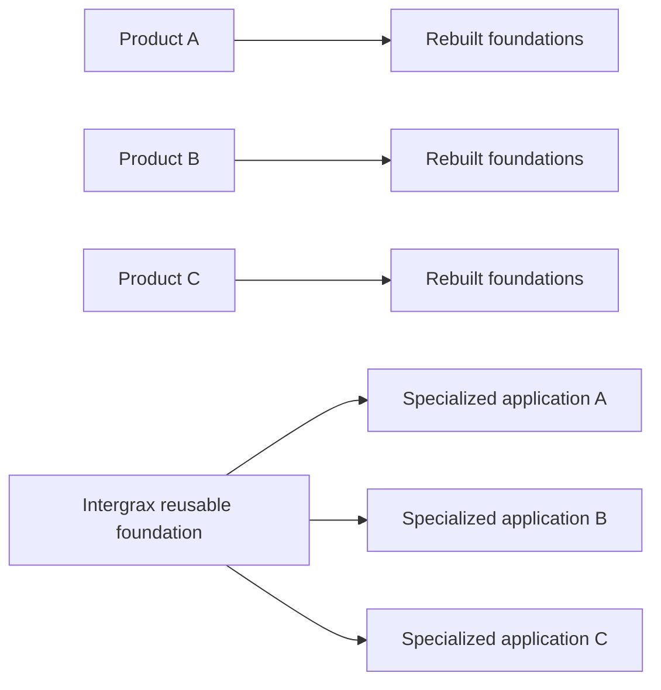

<!--
© Artur Czarnecki. All rights reserved.
Intergrax is source-available under the Intergrax Evaluation and Collaboration License 1.0.
See LICENSE for permitted evaluation, collaboration, and contribution use.
-->

# Why Intergrax

Intergrax helps teams understand whether reusable governed foundations fit the problem they are trying to solve.

Intergrax helps teams build specialized agent applications without rebuilding the same policy, knowledge, evidence, integration, and execution foundations for every product.

> [!NOTE]
> Intergrax is **source-available** and under **active R&D**. LKW is the current **primary product proof** and remains **Backend Product Alpha / MVP**. **Real-user** and **commercial validation** are incomplete.

---

## At a glance

| Question | Answer |
| -------- | ------ |
| What is Intergrax? | A reusable Harness AI foundation for governed agent applications. |
| What problem does it address? | Teams repeatedly rebuild permissions, policy, knowledge, tools, evidence, and operational boundaries for every new agent product. |
| Who is it for? | Teams building specialized agent-backed applications, platform engineers evaluating reusable infrastructure, and technical design partners with a concrete workflow to validate. |
| Current proof | LKW as **Primary product proof**; Token Optimization as **Featured platform-capability proof** — both **PARTIAL**. |
| Current maturity | **Source-available**, **active R&D**; bounded proof paths, not universal production readiness. |

---

## The repeated problem

Building an impressive agent demo is relatively easy. Delivering a controlled application that a team can review, operate, and trust is difficult.

Every new product tends to need the same foundations again: permissions and identity, knowledge access, policy enforcement, human-in-the-loop gates, tool and integration boundaries, trace and evidence collection, testing, and runtime governance. Rebuilding these separately for each product creates inconsistency, slows delivery, and makes governance harder to audit across applications.

---

## The Intergrax approach

Intergrax concentrates repeatable infrastructure into one governed foundation so product teams can focus on the concrete workflow.

| Differentiator | What it means |
| -------------- | ------------- |
| **Application-first** | Real applications and user workflows lead development. |
| **Governed execution by default** | Policy, budgets, human review, and trace surround execution — not bolted on after the demo works. |
| **Reusable delivery foundation** | Multiple products reuse shared knowledge, evidence, integration, and execution infrastructure. |
| **Explicit responsibility boundaries** | Applications, orchestration, agents, and the harness each own a clear slice of the system. |

The diagram contrasts rebuilding foundations per product with reusing one governed foundation. It does not imply that every future product is already implemented.

---

## Who it is for

1. Teams building specialized agent-backed applications that need governance, evidence, knowledge access, or controlled tool execution.
2. AI platform engineers and architects evaluating reusable agent-application infrastructure.
3. Technical design partners with a concrete workflow worth validating.

Intergrax is not aimed at every possible AI project, generic consumers, or teams that only need a one-off demo.

---

## When Intergrax fits

| Intergrax may fit when | Another approach may fit better when |
| ---------------------- | ------------------------------------ |
| You need governed execution, evidence, and knowledge access in a specialized product | Finished SaaS needed immediately — not building your own application |
| You want reusable platform foundations instead of a new runtime per product | You want a simple prompt prototype only |
| You are evaluating infrastructure for multiple agent-backed applications | You expect a no-code workflow builder |
| You can accept bounded proof and active R&D | You require an unrestricted open-source license |
| Governance, policy, and evidence matter to your reviewers | You have no governance or evidence requirements |

Other frameworks and tools may suit different needs. This guide does not dismiss them.

---

## What exists today

| Area | Classification | Status | Notes |
| ---- | -------------- | ------ | ----- |
| **LKW** | **Primary product proof** | **PARTIAL** | **Backend Product Alpha / MVP** — bounded application and platform proof. |
| **Token Optimization** | **Featured platform-capability proof** | **PARTIAL** | Implemented mechanisms plus **bounded vLLM** proof. |

**Evidence and detail:** [PROOFS.md](PROOFS.md) · [LKW Platform Proof](docs/public-adoption/LKW_PLATFORM_PROOF.md) · [Token Optimization guide](docs/features/token_optimization/README.md)

---

## What Intergrax does not currently claim

Intergrax does **not** currently claim:

- a finished SaaS;
- completed real-user validation;
- completed commercial validation;
- universal production readiness;
- completed Hybrid Ask;
- universal token savings or production-proven savings.

Detailed proof matrices and claim boundaries remain in [PROOFS.md](PROOFS.md).

---

## Next steps

| Goal | Document |
| ---- | -------- |
| Understand how it works | [ARCHITECTURE_OVERVIEW.md](ARCHITECTURE_OVERVIEW.md) |
| Start evaluating or building | [BUILD_WITH_INTERGRAX.md](BUILD_WITH_INTERGRAX.md) |
| Review evidence | [PROOFS.md](PROOFS.md) |
