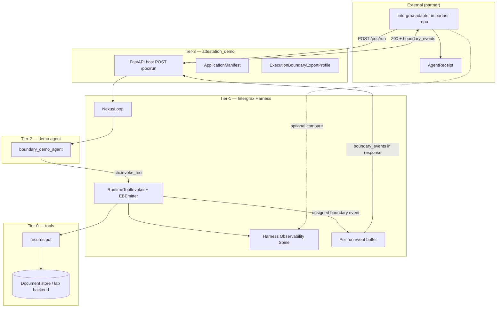
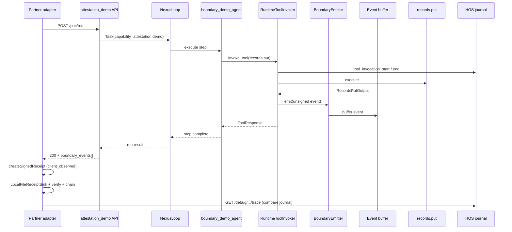
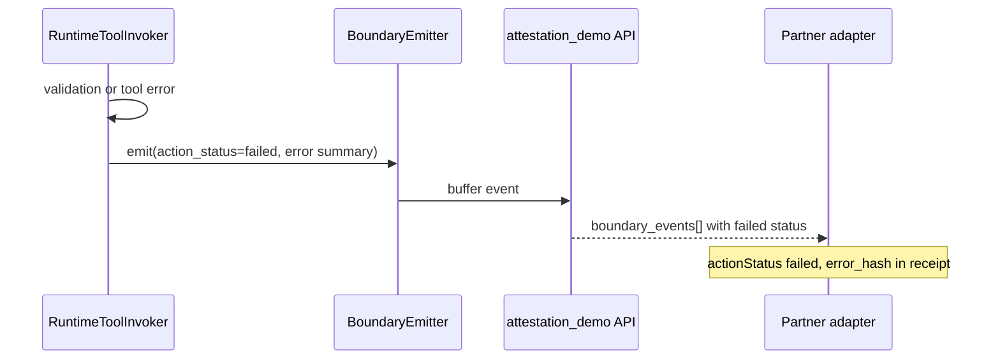

# attestation_demo — architecture

**Status:** PoC v1 (partner-ready)  
**Implementation tracker:** [`IMPLEMENTATION_PLAN.md`](IMPLEMENTATION_PLAN.md)  
**Application ADRs:** [`adr/README.md`](adr/README.md)  
**Domain pair (platform):** `OBSERVABILITY.md` + `TIER3_APPLICATION_ENVIRONMENT.md`  
**Partner product:** AgentReceipt (external; not part of Intergrax)

**PoC v1 delivery (agreed):** execution-boundary events in the **trigger API response only**. Webhook delivery is **deferred** to a later phase.

---

## Dependencies (pyproject.toml)

| Extra | Role |
|-------|------|
| *(base)* | `uv sync` from repo root — harness + FastAPI + records tool bundle |
| `dev-ci` | Gate tests before partner handoff / deploy |

Tier-2 agent: `agents/boundary_demo/` (on `PYTHONPATH` with `applications/`).

Deploy triad: [`BUILD_AND_DEPLOY.md`](BUILD_AND_DEPLOY.md) · `docker/` · gate `test_application_deploy_triad.py`.

---

## 1. Business purpose

### 1.1 Problem

Intergrax already answers **inside the organization**:

- What happened during a run?
- Why did policy allow or deny an action?
- How do we replay and debug?

It does **not** natively answer **outside the organization**:

- Can a partner verify that a side-effecting tool action occurred **without** access to our journal?
- Can execution evidence be attached to a ticket, audit packet, or external workflow?

**AgentReceipt** is an external partner product that provides portable signed receipts. Intergrax does **not** build or host that product.

### 1.2 Business goal of this solution

| Goal | Owner |
|------|-------|
| Demonstrate governed tool execution on Intergrax | Intergrax |
| Emit **unsigned, neutral execution-boundary facts** at the harness tool boundary | Intergrax (platform) |
| Sign, chain, verify portable receipts | AgentReceipt (partner) |
| Validate that receipts add value beyond internal trace | Joint PoC |

### 1.3 What we sell vs what we do not sell

| Intergrax provides | Intergrax does **not** provide |
|--------------------|--------------------------------|
| Optional **Execution Boundary Export (EBE)** on side-effecting tools | Receipt product |
| Test Tier-3 host + demo agent for partner PoC | AgentReceipt hosting |
| Stable `execution_boundary_event.v1` payload (unsigned) | Ed25519 receipt signing or host attestation keys |
| Boundary events in **API response** (PoC v1) | Implied cryptographic attestation by Intergrax |
| Internal HOS trace (unchanged) | Compliance-grade external audit product |

---

## 2. Implementation purpose

Build the **smallest end-to-end path** that lets an external consumer (AgentReceipt adapter) receive tool execution facts **at the harness boundary** without:

- forking Intergrax,
- changing trace/policy semantics,
- embedding AgentReceipt in the platform.

**PoC scope:** tool-level boundary only (`RuntimeToolInvoker`). Step-level export via `HarnessKernel` is **phase 2** (explicitly deferred per partner agreement).

**Reference tool:** `records.put` (`side_effects=true`, `risk_level=MEDIUM`).

**Partner PoC adapter flow (external):**

1. Trigger run via `POST /poc/run`
2. Receive `boundary_events[]` in API response
3. Map event → `createSignedReceipt`
4. Write via `LocalFileReceiptSink`
5. Run `verify` / `chain`
6. Compare receipt with corresponding Intergrax journal entry (debug API)

---

## 3. Trust model (PoC v1 — agreed)

### 3.1 What Intergrax emits

Intergrax emits **unsigned** `execution_boundary_event.v1` records. No platform signature, no receipt chain, no host attestation key in PoC v1.

### 3.2 What the partner receipt proves

When the partner adapter signs with **its own local key**:

| Proven | Not proven |
|--------|------------|
| The adapter received and recorded a specific payload | Intergrax cryptographically attested the event |
| Input/output hashes match the signed receipt fields | The action was correct, authorized, or compliant |
| Local chain integrity (`previous_receipt_hash`) | Independent third-party trust without deployment assumptions |

### 3.3 PoC framing (partner choice)

Two acceptable framings documented for PoC v1:

1. **Trusted execution-side deployment** — adapter runs in the same trusted environment as the Intergrax host; document that assumption explicitly.
2. **Locally observed evidence** — partner sets `receipt_role: "client_observed"` (not `server_attested`) to avoid overstating proof.

**Intergrax documentation must not claim** that PoC receipts are “server attested by Intergrax.”

### 3.4 Future phase (out of PoC v1)

Host-side signing of boundary events (optional `event_integrity_seal` or platform key) may be added later. That would be a separate trust model and ADR; it is **not** part of this PoC.

---

## 4. Architectural principles

1. **Emit at the boundary** — EBE fires where the harness executes tools, not inside Tier-2 agent code.
2. **Selective capture** — only `side_effects=true` tools in PoC (configurable later).
3. **Event-first, receipt-second** — platform emits unsigned facts; partner signs receipts.
4. **No HOS fork** — boundary events are an optional side channel; unified journal unchanged.
5. **Tier-3 configures, Tier-1 emits** — profile on the application host; emission in `RuntimeToolInvoker`.
6. **Vendor-neutral schema** — `execution_boundary_event.v1`, not “AgentReceipt schema”.
7. **Honest trust documentation** — never overstate what unsigned events prove.

---

## 5. System context (PoC v1)



**Deferred (phase 2):** webhook POST delivery to partner listener.

---

## 6. Layer responsibilities

| Tier | Component | Responsibility |
|------|-----------|----------------|
| **Tier-3** | `attestation_demo` host | Lab host; enables EBE profile; exposes `POST /poc/run` with `boundary_events[]` |
| **Tier-2** | `boundary_demo_agent` | Business step: decide to call `records.put` with demo payload |
| **Tier-1** | `ExecutionBoundaryEmitter` | After tool invoke: build **unsigned** event; buffer for API response |
| **Tier-1** | `RuntimeToolInvoker` | Unchanged semantics; calls emitter post-execution |
| **Tier-1** | HOS | Internal trace/policy journal (no receipt logic) |
| **Tier-0** | `records.put` | Side-effecting catalog tool |
| **External** | AgentReceipt + adapter | Map event → `createSignedReceipt` → sign/chain/verify; compare with journal |

---

## 7. Platform changes (Tier-1)

### 7.1 New subsystem: Execution Boundary Export (EBE)

**Location (target):** `intergrax/runtime/attestation/`

| Module | Role | PoC v1 |
|--------|------|--------|
| `execution_boundary_event.py` | Pydantic model, `schema_id=execution_boundary_event.v1` | Required |
| `attestation_policy.py` | `off` \| `side_effects_only` \| `allowlist` | Required |
| `boundary_emitter.py` | Build unsigned event from invoker context; invoke sinks | Required |
| `sinks/memory.py` | Per-run buffer surfaced in API response | Required |
| `sinks/file.py` | Optional local JSON (dev/debug) | Optional |
| `sinks/webhook.py` | HTTP POST to configured URL | **Deferred** |

### 7.2 Integration point: `RuntimeToolInvoker`

All catalog tool paths converge here. **Single hook** ensures PoC coverage.

```text
RuntimeToolInvoker.invoke()
  → scope check
  → schema validation
  → trace: tool_invocation_start
  → execute tool
  → trace: tool_invocation_end
  → [NEW] if attestation_policy.should_emit(contract, result):
          ExecutionBoundaryEmitter.emit(unsigned event)
  → return ToolExecutionResult
```

**Invariant:** EBE must not block tool execution. Buffer/sink failures are logged; they do not fail the invoke.

### 7.3 Configuration bridge (Tier-3 → Tier-1)

| Layer | Artifact |
|-------|----------|
| Contract | `ExecutionBoundaryExportProfile` on `ApplicationEnvironmentProfile` |
| Bridge | `intergrax/applications/_shared/attestation_wiring.py` |
| Runtime | `RuntimeConfig.execution_boundary_export` (or metadata key) |

### 7.4 Phase 2 (out of PoC v1)

| Item | Status |
|------|--------|
| `HarnessKernel` step-level events | Deferred |
| Webhook sink delivery | Deferred |
| Host-side event signing | Deferred |

---

## 8. Execution boundary event contract

### 8.1 Schema: `execution_boundary_event.v1`

Events are **unsigned**. Field `signed: false` is explicit in PoC v1 payloads.

```json
{
  "schema_id": "execution_boundary_event.v1",
  "event_id": "uuid",
  "boundary_type": "tool_execution",
  "signed": false,
  "tool_id": "records.put",
  "agent_id": "boundary_demo_agent",
  "run_id": "run-abc",
  "step_id": "step-2",
  "task_id": "task-xyz",
  "tenant_id": "default",
  "action_status": "executed",
  "side_effects": true,
  "risk_level": "medium",
  "input": {
    "partition_key": "attestation_demo",
    "row_key": "poc-001",
    "data": { "title": "PoC report", "version": 1 }
  },
  "output": {
    "stored": true,
    "partition_key": "attestation_demo",
    "row_key": "poc-001"
  },
  "input_hash": "sha256:optional-cross-check",
  "output_hash": "sha256:optional-cross-check",
  "occurred_at": "2026-06-13T12:00:00Z",
  "lineage": {
    "ref": "run-abc:step-2",
    "type": "execution_record"
  },
  "runtime_ref": {
    "platform": "intergrax",
    "runtime_version": "…"
  }
}
```

### 8.2 Partner mapping (AgentReceipt adapter — external)

| Boundary event | AgentReceipt `createSignedReceipt` |
|----------------|-----------------------------------|
| `agent_id` | `agentId` |
| `tool_id` | `tool` |
| `action_status: executed` | `actionStatus: "executed"` |
| `action_status: failed` | `actionStatus: "failed"` + `error` |
| `input` | `input` (hashed by partner `hashValue` / `stableJson`) |
| `output` | `output` |
| `lineage.ref` | `lineage.ref` |
| `lineage.type` | `lineage.type: "execution_record"` |
| — | `receiptRole: "client_observed"` **recommended for PoC v1** |
| — | `previousReceiptHash` (partner local chain) |

**Do not map to `server_attested` in PoC v1** unless the partner explicitly documents a trusted co-located deployment and accepts the trust limits in §3.

Intergrax does **not** ship the adapter.

### 8.3 Privacy

- PoC includes canonical `input`/`output` for hash compatibility with AgentReceipt `stableJson`.
- Production profiles may move to hash-only modes (future).

---

## 9. Tier-3 application: `attestation_demo`

### 9.1 Purpose

Minimal **partner sandbox host**. Demonstrates normal Tier-3 + Tier-2 composition with EBE enabled and boundary events returned synchronously from the trigger route.

### 9.2 Package layout (target)

```text
applications/attestation_demo/
  ARCHITECTURE.md
  IMPLEMENTATION_PLAN.md
  README.md                    PoC quickstart + sample payloads for partner
  manifest.py
  host/
    factory.py
    main.py
    settings.py
    wiring.py
    integration_wiring.py
  serving/
    fastapi_router.py          POST /poc/run
  attestation_demo_tests/
```

### 9.3 Manifest

| Field | Value |
|-------|-------|
| `app_id` | `attestation_demo` |
| `route_prefix` | `/v1/attestation_demo` |
| `env_prefix` | `ATTESTATION_DEMO_` |
| `environment` | `lab_defaults` + `ExecutionBoundaryExportProfile` enabled |
| `agents` | `BoundaryDemoAgent` |
| `tool_profile` | `records` bundle (+ lab integration) |

### 9.4 HTTP surface (PoC v1)

| Method | Path | Purpose | PoC v1 |
|--------|------|---------|--------|
| `POST` | `/v1/attestation_demo/poc/run` | Trigger demo → agent → `records.put` → return `boundary_events[]` | **Primary** |
| `GET` | `/v1/attestation_demo/poc/runs/{run_id}/boundary-events` | Read buffered events (debug) | Optional |
| `GET` | `/debug/tasks/{run_id}/trace` | Partner journal comparison | Existing debug API |
| `POST` | `/v1/tasks/run-async` | Standard harness route | Secondary |

### 9.5 Trigger request (example)

```json
{
  "tenant_id": "default",
  "partition_key": "attestation_demo",
  "row_key": "poc-001",
  "document": { "title": "Partner PoC", "version": 1 }
}
```

### 9.6 Trigger response (example)

```json
{
  "run_id": "run-abc",
  "task_id": "run-abc",
  "status": "completed",
  "boundary_events": [
    {
      "schema_id": "execution_boundary_event.v1",
      "signed": false,
      "tool_id": "records.put",
      "agent_id": "boundary_demo_agent",
      "action_status": "executed",
      "input": { "partition_key": "attestation_demo", "row_key": "poc-001", "data": { "title": "Partner PoC", "version": 1 } },
      "output": { "stored": true, "partition_key": "attestation_demo", "row_key": "poc-001" },
      "run_id": "run-abc",
      "step_id": "UAEPToolGateway:records.put:0",
      "occurred_at": "2026-06-13T12:00:00Z",
      "lineage": { "ref": "run-abc:step-1", "type": "execution_record" }
    }
  ]
}
```

Partner deliverables when ready: **base URL**, this request format, and a committed sample response JSON.

### 9.7 Profile: `ExecutionBoundaryExportProfile` (PoC v1)

```yaml
enabled: true
capture_mode: side_effects_only
tool_allowlist: []
delivery:
  include_in_task_response: true    # primary PoC v1 path
  webhook:
    enabled: false                  # deferred per partner agreement
step_level_enabled: false
```

---

## 10. Tier-2 agent: `boundary_demo_agent`

### 10.1 Purpose

Single-purpose demo agent. **No receipt logic.**

### 10.2 Location (target)

`agents/boundary_demo/`

### 10.3 Behavior

```text
on_next_step / run_step:
  1. Parse task message or metadata for partition_key, row_key, document payload
  2. Build RecordsPutInput
  3. ctx.invoke_tool(ToolRequest(tool_name="records.put", input=...))
  4. Return step outcome (continue / complete)
```

### 10.4 Contract

| Field | Value |
|-------|-------|
| `agent_id` | `boundary_demo_agent` |
| `capabilities` | `attestation.demo` |
| `allowed_tools` | `records.put` |
| `side_effect_mode` | `immediate` |

Agent **never** calls AgentReceipt, webhooks, or signing APIs.

---

## 11. End-to-end flows

### 11.1 Happy path (PoC v1 — API response only)



### 11.2 Failed tool path



### 11.3 Idempotent replay

When `IdempotentToolInvoker` returns cache hit, PoC default: emit once per logical invoke with `idempotency_cache_hit: true` in optional metadata, or skip duplicate emit (document in IMPLEMENTATION_PLAN).

---

## 12. What stays unchanged

| Subsystem | Change |
|-----------|--------|
| `HarnessKernel` policy pre/post | None in PoC v1 |
| HOS / `RuntimeEvent` / unified journal | None |
| `MiddlewarePipeline` AFTER_TOOL_CALL | None (EBE is invoker-level) |
| AgentReceipt repository | None |
| Tier dependency rules | Preserved |

---

## 13. Security and operations

| Topic | PoC posture |
|-------|-------------|
| API auth | Harness API key on `/poc/run` |
| Event signing | **None** from Intergrax in v1 |
| Trust documentation | Explicit in README + event `signed: false` |
| Payload sensitivity | Demo data only; no production PII |
| Buffer failure | Log + continue; never fail tool invoke |
| Receipt signing | Partner-only |

---

## 14. Verification

| Level | Check |
|-------|-------|
| Unit | Emitter policy, schema, memory buffer |
| Integration | `POST /poc/run` returns `boundary_events[]` with `records.put` |
| Gate | `tests/unit/runtime/attestation/` |
| Partner | Adapter: receipt verify + chain + journal comparison |
| Trust | Docs state unsigned events; no `server_attested` claim from Intergrax |

---

## 15. Delivery phases (revised)

| Phase | Deliverable | PoC v1 |
|-------|-------------|--------|
| **EBE-1** | `execution_boundary_event.v1` + invoker hook + memory buffer | Yes |
| **EBE-2** | `ExecutionBoundaryExportProfile` + wiring bridge | Yes |
| **EBE-3** | `attestation_demo` host + `POST /poc/run` | Yes |
| **EBE-4** | `boundary_demo_agent` + `records.put` lab wiring | Yes |
| **EBE-5** | `README.md` + sample request/response JSON for partner | Yes |
| **EBE-6** | Domain doc update (`OBSERVABILITY` pair) + ADR (trust model) | Yes |
| **EBE-7** | Webhook sink | **Deferred** |
| **EBE-8** | HarnessKernel step-level events | **Deferred** |
| **EBE-9** | Host-side event signing | **Deferred** |

---

## 16. Documentation and ADR

| Artifact | Action |
|----------|--------|
| `applications/attestation_demo/README.md` | Quickstart, trust model, sample payloads |
| `applications/attestation_demo/partner_handoff/` | Committed request/response JSON + integration guide |
| `docs/architecture/OBSERVABILITY.md` | §18 Execution Boundary Export; unsigned events; non-goal: receipt product |
| `docs/plan/OBSERVABILITY.md` | Phase EBE register (EBE-1…EBE-9) |
| `docs/adr/entries/2026-06-13/ADR-OBS-002.md` | Unsigned boundary export vs host attestation |
| `applications/attestation_demo/IMPLEMENTATION_PLAN.md` | Task checklist |
| `applications/attestation_demo/adr/` | Application ADRs (ADR-ATTESTATION_DEMO-001) |

---

## 17. Success criteria (PoC v1 done)

1. Partner triggers `POST /v1/attestation_demo/poc/run` without Intergrax fork.
2. Response contains at least one unsigned `execution_boundary_event.v1` for `records.put`.
3. Partner adapter maps event → `createSignedReceipt` → `LocalFileReceiptSink` → valid `verify` / `chain`.
4. Partner can compare receipt fields with Intergrax debug journal for the same `run_id`.
5. Documentation does **not** claim Intergrax server attestation for PoC v1.
6. Internal HOS journal still reconstructs the run independently.
7. No Tier-2 agent code imports partner packages.

---

## 18. Explicit non-goals (PoC v1)

- Webhook delivery
- HarnessKernel step-level boundary events
- Intergrax host signing of boundary events
- `server_attested` receipts implied by platform
- Platform-wide mandatory EBE for all hosts
- AgentReceipt embedding or pip dependency
- Compliance / legal-grade audit claims
