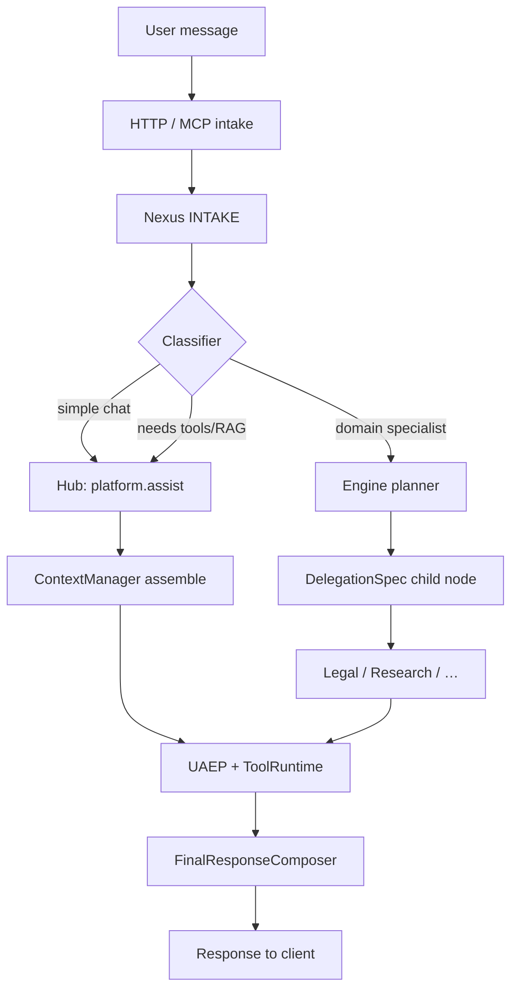

# Intergrax Assistant (IAA) — architecture

**Status:** Architecture baseline v1 (2026-06-08) — lab profile scaffold + hub-and-spoke design  
**Tier:** Tier-3 application (`intergrax_assistant_application`)  
**Hub agent:** Tier-2 `intergrax_assistant` (`platform.assist`)  
**ADR:** [`adr/ADR-INTERGRAX_ASSISTANT-001.md`](docs/adr/ADR-INTERGRAX_ASSISTANT-001.md)  
**Implementation tracker:** [`IMPLEMENTATION_PLAN.md`](docs/IMPLEMENTATION_PLAN.md)

---

## 0. How to use this document

| Need | Read section |
|------|----------------|
| Product purpose and boundaries | §1 · §2 |
| Hub vs specialists | §3 |
| LLM adapter swap (local / cloud) | §4 |
| Memory, RAG, tools | §5 |
| Request flow (step by step) | §6 |
| Env vars and roster flags | §7 |
| Run locally | §8 |

**Rule:** change this file first, then update `IMPLEMENTATION_PLAN.md`. Platform harness work stays in `docs/intergrax_runtime_architecture.md` §6.1.

---

## 1. Strategic purpose

**Intergrax Assistant (IAA)** is a **Harness-native conversational environment** — a ChatGPT-shaped product shell that exercises the full Intergrax Agent OS:

- **Swappable LLM** — local Ollama by default; any registered adapter via env (OpenAI, Groq, Anthropic, vLLM, …).
- **Full harness planes** — session memory, user LTM, RAG, tools, skills, integrations, trace, policy, HITL hooks.
- **Hub-and-spoke agents** — one concierge agent for everyday chat; optional delegation to platform specialists (Legal, Research, …) via Nexus — never direct agent-to-agent calls.
- **Experimentation vehicle** — validate architecture ideas (delegation, memory, local-first) before promoting to a product profile.

IAA is **not** a replacement for domain products (LKW, DSW, Legal SKU). It is the **general harness chat lab** for platform exploration.

---

## 2. What IAA is and is not

### 2.1 What IAA is

| Property | Description |
|----------|-------------|
| **Tier-3 lab host** | Own manifest, env, Docker, HTTP + MCP on port `8096` |
| **Conversational entry** | `POST /v1/intergrax_assistant/run` with `capability=platform.assist` |
| **LLM-agnostic** | `INTERGRAX_LLM_PROVIDER` + `INTERGRAX_LLM_MODEL` on environment profile |
| **Memory-aware** | Harness memory flags from `lab_defaults()` — session, user/org, task KV, RAG |
| **Delegation-ready** | `INTERGRAX_ASSISTANT_ENGINE_PLANNER=true` → `planner_kind=engine` |

### 2.2 What IAA is not

| Not this | Why |
|----------|-----|
| Monolithic “god agent” with every tool | Policy + LLM tool-selection limits; curated allow-list on contract |
| Nested harness / agent spawning agents | Forbidden — Nexus `DelegationSpec` only (§42.14.3) |
| Production multi-tenant SaaS | Lab profile; product promotion is a later wave |
| Replacement for `lab_application` | Lab = debug surface for many agents; IAA = chat-shaped harness product experiment |

---

## 3. Agent roster — hub and optional specialists

### 3.1 Topology

```text
                    ┌─────────────────────────────┐
                    │  intergrax_assistant (HUB)  │
                    │  capability: platform.assist │
                    │  default for every chat turn   │
                    └──────────────┬──────────────┘
                                   │ Nexus delegation (when classifier/plan decides)
           ┌───────────────────────┼───────────────────────┐
           ▼                       ▼                       ▼
    ┌─────────────┐        ┌─────────────┐        ┌─────────────┐
    │ LegalAgent  │        │ ResearchAgent│       │  EchoAgent  │
    │ legal.review│        │ research.*   │       │ echo.basic  │
    └─────────────┘        └──────┬──────┘        └─────────────┘
                                  ▼
                           ┌─────────────┐
                           │ SummaryAgent │
                           │research.summarize│
                           └─────────────┘
```

### 3.2 Mount rules

| Agent | Capability | Default mounted | Env flag |
|-------|------------|-----------------|----------|
| `intergrax_assistant` | `platform.assist` | **Always** | — |
| `echo` | `echo.basic` | No | `INTERGRAX_ASSISTANT_INCLUDE_ECHO=true` |
| `legal` | `legal.review` | No | `INTERGRAX_ASSISTANT_INCLUDE_LEGAL=true` |
| `research` | `research.web_search`, `research.pipeline` | No | `INTERGRAX_ASSISTANT_INCLUDE_RESEARCH=true` |
| `summary` | `research.summarize` | No | (with research flag) |

Manifest builder: `manifest.py` → `build_intergrax_assistant_manifest(settings)`.

---

## 4. LLM adapter selection (key value proposition)

IAA resolves the LLM at **Tier-3 environment profile** — not inside the hub agent.

| Mechanism | Location |
|-----------|----------|
| Profile factory | `host/environment_profile.py` |
| Env resolution | `llm_profile_from_env(prefix=INTERGRAX_LLM)` |
| Adapter creation | `ApplicationEnvironmentProfile.llm_profile.create_adapter()` via harness host runtime |
| Default (lab) | `ollama` + `llama3.1:latest` — fully local when Ollama is running |

### 4.1 Local-first example

```bash
INTERGRAX_LLM_PROVIDER=ollama
INTERGRAX_LLM_MODEL=llama3.1:latest
```

### 4.2 Cloud swap (no code change)

```bash
INTERGRAX_LLM_PROVIDER=openai
INTERGRAX_LLM_MODEL=gpt-4o-mini
OPENAI_API_KEY=sk-...
```

See [`docs/architecture/LLM_ADAPTERS.md`](../../docs/architecture/LLM_ADAPTERS.md) for the full provider matrix.

---

## 5. Harness planes wired in this host

| Plane | IAA configuration | Module / doc |
|-------|-------------------|--------------|
| **Integrations** | `IntegrationProfile.lab_stack()` | `integrations/registry/profile.py` |
| **Tools** | Curated harness tool allow-list from `lab_defaults()` | [`docs/architecture/TOOLS.md`](../../docs/architecture/TOOLS.md) |
| **Skills** | Lab skill profile | [`docs/architecture/SKILLS.md`](../../docs/architecture/SKILLS.md) |
| **Session STM** | `SessionManager` + sqlite bundle | AGENT_CREATION_GUIDE Appendix G |
| **User LTM** | `UserProfileManager` | Appendix G |
| **Task KV** | `TaskMemory` / `MemoryView` | Appendix G |
| **RAG** | `ContextProfile.enable_rag=True` | Architecture §7.1.2 |
| **Orchestration** | Engine planner + delegation depth cap | Appendix I |
| **Trace / debug** | Debug API + sqlite trace | `lab_application` pattern |
| **MCP** | `/mcp` coupled to same `NexusLoop` | `mcp/server.py` |
| **Plugins** | Optional `INTERGRAX_DISCOVER_PLUGINS=true` | `TIER3_READINESS.md` |

Environment profile id: `intergrax_assistant.harness_lab`.

---

## 6. End-to-end request flow

### 6.1 Layer diagram

```text
┌──────────────────────────────────────────────────────────────────────────┐
│  CLIENT (thin)                                                            │
│  curl · Cursor MCP · future web UI · Slack intake                         │
└───────────────────────────────┬──────────────────────────────────────────┘
                                │ HTTP POST /v1/intergrax_assistant/run
                                │ MCP tool invoke
                                ▼
┌──────────────────────────────────────────────────────────────────────────┐
│  TIER-3  intergrax_assistant_application                                  │
│  FastAPI factory · manifest · environment_profile · agent_builders        │
│  build_harness_host_runtime → UnifiedTaskRunner                           │
└───────────────────────────────┬──────────────────────────────────────────┘
                                ▼
┌──────────────────────────────────────────────────────────────────────────┐
│  TIER-1  Nexus Agent OS                                                   │
│  1. INTAKE          — task + tenant/user/session metadata                 │
│  2. CLASSIFICATION  — single-agent vs multi-agent vs specialist route       │
│  3. PLANNING        — engine planner (LLM JSON plan) or default path       │
│  4. GRAPH EXEC      — hub node and/or DelegationSpec child nodes            │
│  5. CONTEXT BUILD   — history + RAG + user LTM + budget trim              │
│  6. AGENT ENGINE    — UAEP steps on selected agent                          │
│  7. TOOL RUNTIME    — policy-gated tool/skill execution                     │
│  8. MERGE           — FinalResponseComposer → client JSON                   │
└───────────────────────────────┬──────────────────────────────────────────┘
                                ▼
┌──────────────────────────────────────────────────────────────────────────┐
│  TIER-2  intergrax_assistant (hub)  OR  delegated specialist agents        │
└───────────────────────────────┬──────────────────────────────────────────┘
                                ▼
┌──────────────────────────────────────────────────────────────────────────┐
│  TIER-0  LLMAdapter · integrations · tools · skills · RAG · memory stores │
└──────────────────────────────────────────────────────────────────────────┘
```

### 6.2 Step-by-step (one chat message)

| Step | Component | Action |
|------|-----------|--------|
| **1** | Client | Sends `message`, optional `session_id`, `tenant_id`, `user_id`, `capability` (default `platform.assist`) |
| **2** | `fastapi_router` | Maps body → `RuntimeRequest` → `UnifiedTaskRunner` |
| **3** | `NexusIntakeRunner` | Creates/resumes task; attaches session id to memory scope |
| **4** | `ClassifyingTaskClassifier` | Decides routing: hub-only vs pipeline requiring specialists |
| **5** | `EngineBackedNexusPlanner` | When needed, LLM proposes plan with delegation edges to mounted specialists |
| **6** | `GraphExecutor` | Runs hub `intergrax_assistant` node; child nodes get isolated `task_id/delegation/{node_id}/` memory |
| **7** | `ContextManager` | Assembles turn context: session history, RAG hits, user facts, tool catalog slice |
| **8** | `IntergraxAssistantAgent` | UAEP pipeline — LLM turn + optional `CatalogToolPlanner` tool loop |
| **9** | `ToolRuntime` | Executes allowed tools (rag.retrieve, websearch.query, sandbox.exec, …) under policy |
| **10** | Specialist node (optional) | Legal/Research agent runs in delegated namespace; artifacts in `SharedTaskContext` |
| **11** | `FinalResponseComposer` | Merges node outputs (`merge_strategy=last_wins` for chat) |
| **12** | Client | Receives `state`, `answer`, `run_id` for trace inspection via `/debug/*` |

### 6.3 Mermaid — decision flow



---

## 7. Configuration reference

### 7.1 Application env (`INTERGRAX_ASSISTANT_*`)

See [`.env.example`](.env.example).

### 7.2 LLM env (`INTERGRAX_LLM_*`)

| Variable | Default | Purpose |
|----------|---------|---------|
| `INTERGRAX_LLM_PROVIDER` | `ollama` | Adapter slug |
| `INTERGRAX_LLM_MODEL` | `llama3.1:latest` | Model id |

### 7.3 Specialist roster flags

| Variable | Default | Effect |
|----------|---------|--------|
| `INTERGRAX_ASSISTANT_INCLUDE_ECHO` | `false` | Mount EchoAgent |
| `INTERGRAX_ASSISTANT_INCLUDE_LEGAL` | `false` | Mount LegalAgent |
| `INTERGRAX_ASSISTANT_INCLUDE_RESEARCH` | `false` | Mount Research + Summary |
| `INTERGRAX_ASSISTANT_MAX_DELEGATION_DEPTH` | `4` | Nexus delegation cap |

---

## 8. Run and verify

```bash
cp applications/intergrax_assistant_application/.env.example applications/intergrax_assistant_application/.env
uv run uvicorn intergrax_assistant_application.host.main:app --host 127.0.0.1 --port 8096
curl -s http://127.0.0.1:8096/health
curl -s http://127.0.0.1:8096/v1/intergrax_assistant/agents
curl -s -X POST http://127.0.0.1:8096/v1/intergrax_assistant/run \
  -H "Content-Type: application/json" \
  -d '{"message":"hello","capability":"platform.assist"}'
```

Tests:

```bash
uv run pytest applications/intergrax_assistant_application/intergrax_assistant_application_tests -q
```

---

## 9. Dependencies

- Core `Intergrax-ai` from repo root (`uv sync`)
- Local LLM: Ollama running when `INTERGRAX_LLM_PROVIDER=ollama`
- Optional cloud keys per provider — see `docs/architecture/LLM_ADAPTERS.md`
- Deploy triad: `docker/`, `BUILD_AND_DEPLOY.md`

---

## 10. Related documentation

| Document | Role |
|----------|------|
| [`agents/intergrax_assistant/ARCHITECTURE.md`](../../agents/intergrax_assistant/ARCHITECTURE.md) | Hub agent (Tier-2) |
| [`docs/intergrax_runtime_architecture.md`](../../docs/intergrax_runtime_architecture.md) §7.4.11 | Platform canon entry |
| [`docs/guides/AGENT_CREATION_GUIDE.md`](../../docs/guides/AGENT_CREATION_GUIDE.md) Appendix F · I · G | Tier-3, orchestration, memory |
| [`docs/architecture/LLM_ADAPTERS.md`](../../docs/architecture/LLM_ADAPTERS.md) | Provider swap |
| [`applications/TIER3_READINESS.md`](../TIER3_READINESS.md) | Scaffold checklist |

---

## 11. Architecture decisions

| ADR | Title |
|-----|-------|
| [ADR-INTERGRAX_ASSISTANT-001](docs/adr/ADR-INTERGRAX_ASSISTANT-001.md) | Hub-and-spoke harness chat environment |
