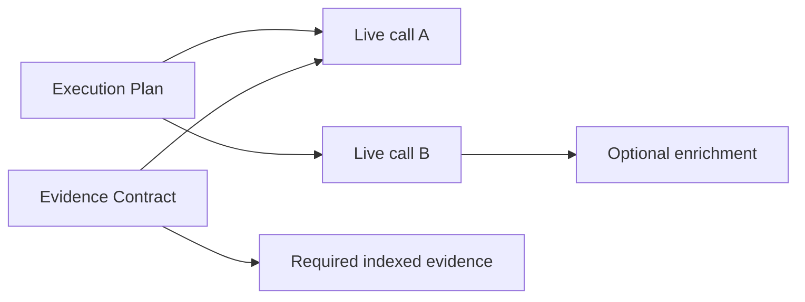
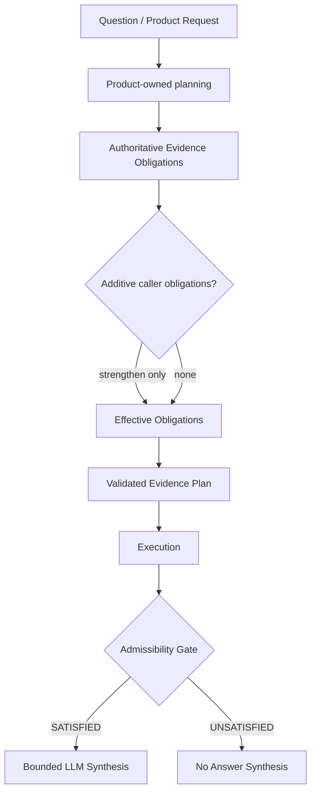
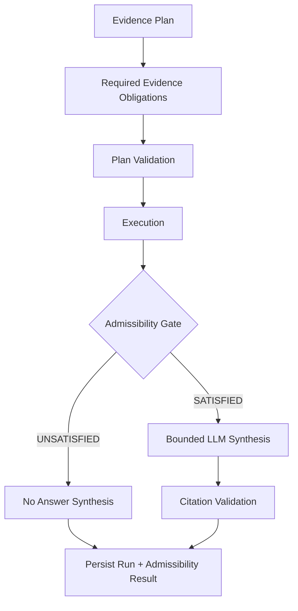
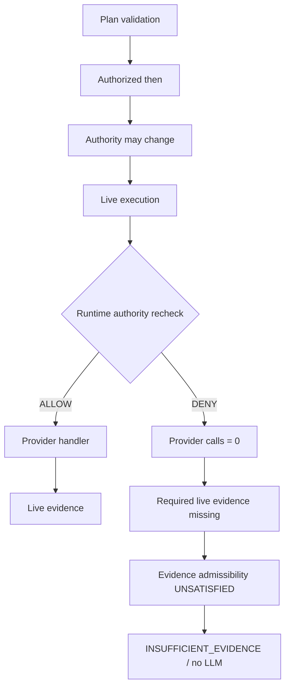

# Hybrid Ask — unified evidence, query orchestration and read-only live execution

**Status:** ACCEPTED / CLOSED
**Task:** LKW-HYBRID-ASK-ARCH-1
**Classification:** docs-only architecture and implementation contract

**Canonical references:** [`KNOWLEDGE_ACCESS_ARCHITECTURE.md`](KNOWLEDGE_ACCESS_ARCHITECTURE.md) · [`KNOWLEDGE_ACCESS_IMPLEMENTATION_CONTRACT.md`](KNOWLEDGE_ACCESS_IMPLEMENTATION_CONTRACT.md) · [`ASK_WORKSPACE_DISCOVERY.md`](ASK_WORKSPACE_DISCOVERY.md) · [`CONVERSATION_CONTEXT_ARCHITECTURE.md`](CONVERSATION_CONTEXT_ARCHITECTURE.md)

---

## 1. One-sentence outcome

One workspace question can combine indexed RAG evidence with authorized read-only live provider evidence in a single grounded response with unified provenance, strict policy enforcement and no automatic persistence of live result bodies.

---

## 2. Current-state truth

### 2.1 Implemented Ask pipeline (indexed RAG only)

```text
WorkspaceAskService
→ workspace authorization (ManagedWorkspaceService)
→ local.workspace.search (LocalWorkspaceTaskExecutor)
→ map_search_hits → WorkspaceSearchHitV1
→ AskAnswerAssembler (one bounded LLM call)
→ project_ask_citations (document/source citations)
→ durable WorkspaceAskRun (DocumentStore via WorkspaceAskRepository)
```

**Facts from the repository today:**

| Area | Current state |
|------|---------------|
| Ask mode | **Indexed RAG only** — `WorkspaceAskService` always invokes `local.workspace.search`; no live capability execution |
| Evidence model | `WorkspaceAskRun.evidence` is `list[WorkspaceSearchHitV1]` |
| Citations | `AskCitation` / `WorkspaceAskCitationV1` assume durable documents and sources (`document_id`, `source_id`, `source_path`, `file_name`) |
| Assembler input | `AskAnswerAssembler.assemble(question, evidence: list[WorkspaceSearchHitV1])` |
| Evidence indexing | Positional `E1`, `E2`, … indexes over verified hits only |
| Live Access Bindings | Durable configuration via `WorkspaceLiveAccessBinding`; `WorkspaceLiveAccessBindingService` authorizes bindings but **does not execute** them during Ask |
| Query Policy V1 | `QueryPolicyModeV1` contains only `indexed_only` and `live_only` |
| Hybrid / automatic | **Not implemented** — `hybrid` and `automatic` do not exist in models or runtime |
| Live query executor | **No production executor** — no `WorkspaceLiveCapabilityExecutorPort`, no Knowledge Query Orchestrator |
| Unified evidence / citation ABI | **Absent** — no discriminated indexed/live union |
| Hybrid Ask | **Not implemented** |

Absent Query Policy continues to behave as **indexed-only** unless a separately accepted migration states otherwise.

---

## 3. Product modes (frozen implementation sequence)

### 3.1 `indexed_only`

- Execute indexed workspace retrieval only.
- Never invoke a live capability.
- Preserve existing `WorkspaceAskService` behavior and public HTTP compatibility.
- Absent Query Policy defaults to indexed-only.

### 3.2 `live_only`

- Execute only explicitly authorized Live Access Bindings.
- Do not run indexed RAG retrieval.
- Require at least one validated live call for a completed answer.
- No arbitrary provider access; no implicit access through Connection Attachment alone.

### 3.3 `hybrid`

- Execute both indexed retrieval **and** at least one validated live capability call (V1 Hybrid Ask proof minimum).
- Normalize both result families into one evidence collection.
- Allow **one** synthesis call over that collection.
- Citations must retain indexed/live distinction.
- A failed required live call must **not** silently downgrade to indexed-only success.
- No unrestricted model autonomy over provider execution.

### 3.4 `automatic` — deferred

Orchestration may not auto-select modes in V2. `automatic` is excluded from `QueryPolicyModeV2`.

### 3.5 Query Policy V2 vocabulary

```text
QueryPolicyModeV2:
  indexed_only
  live_only
  hybrid
```

**V1 backward compatibility:** persisted `WorkspaceQueryPolicy` records with `QueryPolicyModeV1` (`indexed_only` | `live_only`) remain valid and readable. `hybrid` requires V2 mode enum and acceptance of this architecture. Migration adds V2 fields without mutating historical revision payloads in place.

### 3.6 Absent Query Policy defaults (frozen)

| Request context | Effective mode | Outcome |
|-----------------|----------------|---------|
| No persisted Query Policy + `indexed_only` V1 or V2 request | `indexed_only` | **No error** — indexed retrieval proceeds |
| No persisted Query Policy + `live_only` or `hybrid` request | — | `query_policy_required` → **HTTP 409** |

Absent Query Policy does **not** authorize live or hybrid execution.

---

## 4. Query input and authority

### 4.1 Frontend-neutral query command (conceptual)

```text
KnowledgeQueryCommandV1
├── tenant_id
├── principal_id (or authenticated-principal reference)
├── workspace_id
├── question
├── audience_context
├── requested_evidence_mode (when public contract allows)
├── configuration_revision (committed Workspace Knowledge Configuration)
└── request/run identity
```

Effective configuration is read from **one committed revision**. Child records from different revisions must not be mixed.

### 4.2 Non-authoritative frontend values

Frontend-provided values must **not** supply authoritative:

```text
provider_id
integration_kind
connection credentials
provider endpoint
capability implementation
remote authorization state
```

These are derived from committed configuration, binding metadata and registered capability contracts.

---

## 5. Audience context

Typed audience context (minimum):

```text
AudienceContextV1
├── audience: personal | shared
└── eligibility inputs for source/binding validation
```

**Rules** (canonical detail: [`CONVERSATION_CONTEXT_ARCHITECTURE.md`](CONVERSATION_CONTEXT_ARCHITECTURE.md) §5, §10.1):

| Rule | Enforcement |
|------|-------------|
| Personal evidence in shared Ask | **Rejected** before synthesis |
| `PERSONAL_ONLY` Indexed Sources / Live Access Bindings in shared audience | **Rejected** |
| Mixed personal/shared evidence in one run | **Rejected deterministically** |
| Prompt instructions as authorization | **Forbidden** — validation is code, not prompt |

The core orchestrator contract is HTTP- and Slack-neutral. V1 HTTP proof may use a personal audience adapter; shared audience follows Conversation Context guards.

---

## 6. Evidence Plan

### 6.1 `EvidencePlanV1` (immutable, typed)

```text
EvidencePlanV1
├── plan_id
├── tenant_id
├── workspace_id
├── configuration_revision
├── mode: indexed_only | live_only | hybrid
├── indexed_retrieval_directive (optional per mode)
├── ordered_live_call_proposals: list[LiveCallProposalV1]
├── required_evidence_obligations: list[RequiredEvidenceObligationV1]
├── budget_snapshot
└── audience_context
```

**Indexed retrieval directive** (when present):

```text
IndexedRetrievalDirectiveV1
├── max_results (bounded)
└── retrieval_limits aligned with Query Policy
```

**Live call proposal** (safe logical values only):

```text
LiveCallProposalV1
├── call_id
├── live_access_binding_id
├── capability_id
└── typed_capability_request (schema-validated payload)
```

### 6.2 Model may propose; validator must approve

The model may propose a typed plan. A **deterministic validator** must approve every executable directive before execution.

### 6.3 Forbidden model-controlled values

The plan must not authoritatively contain:

```text
connection_ref
provider_id
integration_kind
credential_ref
provider client
provider endpoint
arbitrary URL
raw HTTP method / headers
arbitrary Graph request
arbitrary JQL
arbitrary SQL / DAX
arbitrary MCP tool
```

These are resolved from committed configuration and registered capability descriptors.

### 6.4 Required evidence obligations

`EvidencePlanV1` may declare **typed, structural obligations** that execution must satisfy before answer synthesis:

```text
RequiredEvidenceObligationV1 (discriminated union)
├── IndexedEvidenceRequirementV1
│   ├── requirement_id (unique, nonblank)
│   ├── semantic_role (audit/explanation only — not enforcement)
│   └── indexed_source_binding_id (optional scope)
└── LiveEvidenceRequirementV1
    ├── requirement_id (unique, nonblank)
    ├── semantic_role (audit/explanation only — not enforcement)
    └── call_id (must reference a planned live call)
```

Plan validation fails closed on duplicate `requirement_id`, unknown `call_id`, mode/type mismatch, or unknown indexed binding.

#### 6.4.1 Obligation ownership (COMM-5C1-R1 / R2)

Mandatory evidence requirements are **not client-removable**. The HTTP request does not authoritatively declare them.

**Execution plan** (what we attempt) and **evidence contract** (what must exist for admissibility) are separate:



| Invariant | Meaning |
|-----------|---------|
| HYBRID requires indexed + live participation | Plan validation and citation rules still enforce indexed retrieval and live execution structure |
| Planned calls are not automatically mandatory | `ordered_live_call_proposals` does not imply per-call `LiveEvidenceRequirementV1` |
| Explicit obligations control admissibility | Product/provider planning supplies mandatory evidence requirements |
| Caller may only strengthen | Additive obligations; duplicate `requirement_id` fails closed |



| Source | Role |
|--------|------|
| `derive_product_evidence_obligations` | Product-owned **indexed** admissibility obligation for generic HYBRID Workspace Ask — not per planned live call |
| `ProviderEvidencePlanV1.required_evidence_obligations` | Provider-owned obligations from `WorkspaceAskProviderStrategy.build_plan` |
| `WorkspaceAskCommandV2.required_evidence_obligations` | **Additive only** — may strengthen, never replace authoritative minimum |
| `compose_evidence_obligations` | Merges layers; duplicate `requirement_id` fails closed |

`semantic_role` is explanatory for audit — enforcement uses structural fields only (`call_id`, `indexed_source_binding_id`, evidence type).

Persisted `WorkspaceAskRunV2` records are **self-consistent**: obligations, per-requirement evaluations, matched evidence IDs, persisted evidence, and final status must agree.

### 6.5 Evidence Admissibility gate

After orchestration, a **deterministic evaluator** compares execution evidence against the validated obligations. It does not call providers, LLMs, or repositories.



| Invariant | Meaning |
|-----------|---------|
| Structural matching only | Satisfaction uses evidence type, `call_id`, and `indexed_source_binding_id` — never answer text or semantic labels |
| Earlier gate | Admissibility runs **before** `HybridAskAnswerAssemblerV2` |
| Defense in depth | Citation validation and HYBRID indexed+live citation rules remain after synthesis |
| EPHEMERAL durability | Persisted runs store obligation snapshots, matched evidence IDs, and reason codes — never raw live bodies |

**Why this matters:** evidence diversity (indexed **and** live present) is not the same as evidence **completeness** (every declared obligation structurally satisfied). Admissibility enforces completeness; citation rules enforce provenance integrity.

---

## 7. Plan validation (frozen order)

```text
 1. tenant/workspace authorization
 2. committed configuration revision
 3. requested mode vs Query Policy
 4. active Workspace Connection Attachment
 5. active Live Access Binding
 6. audience eligibility
 7. Connection administrative availability
 8. capability present on binding allowlist
 9. capability present in Query Policy allowlist
10. connection present in Query Policy allowlist
11. read-only capability descriptor (runtime catalog)
12. request schema validation
13. resource-scope validation
14. live-call count budget
15. result-item and byte budgets
16. total-duration budget
```

**Executable capability set** = intersection of:

```text
active binding capabilities
∩ Query Policy capabilities
∩ runtime capability catalog (TenantLiveCapabilityCatalog)
∩ audience eligibility
```

No layer may widen another layer's authorization.

---

## 8. Live capability execution boundary (frozen)

Four separate runtime concepts must not be conflated:

### 8.1 `TenantLiveCapabilityCatalog` (descriptor catalog only)

Platform-owned descriptor catalog. **Not** an integration resolver and **not** an executable handler registry.

**Responsibilities:**

- Advertise typed capability metadata (`LiveCapabilityDescriptorV1`)
- Provide request/result schema references
- Provide read-only / effect / resource / limit metadata
- Perform **no** provider invocation

### 8.2 `TenantConnectionCapabilityReadService` (safe projections only)

Exposes safe Connection projections and descriptor listing. It does **not** resolve a runtime integration instance. Do not describe it as an integration resolver.

### 8.3 `TenantConnectionIntegrationResolverPort` (runtime integration resolution)

Narrow runtime port:

```text
resolve(
    tenant_id,
    connection_ref,
    provider_id,
    integration_kind,
) -> existing integration instance
```

**Production adapter:** `KnowledgeConnectionRegistry` (or an explicitly named adapter over it).

**Rules:**

- Return only an **already rehydrated** integration instance
- Never construct a second client
- Never read credentials
- Fail safely when the runtime integration is unavailable

Alternative resolution path: `ConnectionAwareVendorResolver` when wired to the same registry-backed instance — still **one** rehydrated integration, never a duplicate client.

### 8.4 `LiveCapabilityHandlerV1` (provider capability implementation)

```text
execute(
    integration,
    validated_request,
    resolved_resource_scope,
    effective_budget,
) -> normalized provider result
```

A handler must:

- Be read-only
- Receive the **already resolved** integration instance
- Accept a capability-specific validated request
- Never resolve credentials
- Never persist result bodies
- Return a typed result for normalization

### 8.5 `LiveCapabilityHandlerRegistry` (executable handlers)

Runtime registry keyed by:

```text
provider_id
integration_kind
capability_id
```

Separate from `TenantLiveCapabilityCatalog`. Validation must require:

```text
descriptor identity
=
handler registry identity
=
validated Live Access Binding identity
```

### 8.6 `WorkspaceLiveCapabilityExecutorPort` / `WorkspaceLiveCapabilityExecutor`

Provider-neutral application port. One validated executable live call in; transient normalized live evidence out.

**Frozen dependencies:**

```text
TenantConnectionPort
TenantLiveCapabilityCatalogPort
TenantConnectionIntegrationResolverPort
LiveCapabilityHandlerRegistry
live result normalizer
clock / timeout boundary
```

**Execution flow:**

```text
validated ExecutableLiveCallV1
→ call identity validation
→ runtime authority revalidation (WorkspaceLiveAccessRuntimeAuthority)
→ existing integration resolution (TenantConnectionIntegrationResolverPort)
→ bounded handler execution (LiveCapabilityHandlerV1)
→ normalized transient live evidence (LiveWorkspaceEvidenceV1)
→ optional safe receipt
```

Plan validation establishes **plan-time authorization** (binding was admissible to plan). Runtime authority establishes **execution-time authorization** (binding is still admissible to execute now). These are intentionally different checks; a validated plan snapshot must not bypass execution-time denial.



Governed live-capable Workspace Ask composition must wire `WorkspaceLiveAccessRuntimeAuthority` from resolved host dependencies (`TenantConnectionPort` + `TenantLiveCapabilityCatalog`). `INDEXED_ONLY` composition may omit runtime authority.

**Responsibilities:**

- Enforce timeout, item and byte limits (strictest effective budget)
- Normalize provider errors to stable domain codes
- Never expose credentials or raw provider clients
- Never persist result bodies by itself

**Rejected:** direct Jira, Confluence, Microsoft Graph or Slack branches in the executor; orchestrator calling `JiraIssueTrackerIntegration` / `ConfluenceWikiKnowledgeIntegration` directly; provider branches in `WorkspaceAskService`; separate provider-specific Ask services; describing `TenantConnectionCapabilityReadService` as an integration resolver.

---

## 9. First provider decision

### 9.1 External Vendor Knowledge proof (not LKW-owned)

The first bounded live capability proof is delivered by **Vendor Knowledge**, not by the LKW Hybrid Ask roadmap. LKW validates provider-neutral plans and executes through registered handlers; provider-specific request models, handlers and API semantics remain Vendor Knowledge scope.

A provider such as Jira may appear only as a possible **external** Vendor Knowledge acceptance proof. LKW must not implement Jira, Confluence, Slack or Microsoft Graph handlers in Hybrid Ask slices.

```text
LKW-HYBRID-ASK-1C requires at least one accepted provider-specific
LiveCapabilityHandler implementation delivered by Vendor Knowledge.

The provider is selected and implemented in the Vendor Knowledge roadmap,
not in the LKW Hybrid Ask roadmap.
```

**Deferred to Vendor Knowledge capability tasks:** provider-specific inventory/search capabilities beyond the first accepted read-only proof.

### 9.2 Deferred provider notes (documentation only)

Confluence and Microsoft Graph live search require separate bounded contracts in Vendor Knowledge and must not be simulated through delta, reconciliation or full inventory.

---

## 10. Unified evidence ABI

Two separate model families: **transient synthesis evidence** (in-memory during execution) and **durable evidence projection** (persisted Ask record).

### 10.1 Transient synthesis evidence (in-memory only)

Exists during query execution and synthesis. Contains bounded `content`. Passed to the assembler. **Not** the durable Ask record contract. Discarded after finalization according to retention policy.

```text
WorkspaceEvidenceV1
├── IndexedWorkspaceEvidenceV1
└── LiveWorkspaceEvidenceV1
```

**Common transient fields:**

```text
evidence_id
evidence_type          # indexed | live
tenant_id
workspace_id
safe_display_name
retrieved_at
content                # excerpt or bounded structured content (transient only)
content_hash
audience
```

### 10.2 Indexed provenance (transient)

```text
source_id
document_id
chunk_id
location
score
safe_source_label / path projection
indexed_source_binding_id (when available)
```

### 10.3 Live provenance (transient)

```text
live_access_binding_id
connection_ref
capability_id
remote_resource_id
remote_item_id
provider_id
integration_kind
call_id
remote_updated_at
safe_locator (when approved)
truncation_state
execution_receipt_id (when retained)
```

Provider identity is permitted in safe provenance. Credentials, private endpoints and raw authorization material are forbidden.

### 10.4 Durable evidence projection (persisted Ask record)

Separate name family — **not** `WorkspaceEvidenceV1`:

```text
PersistedAskEvidenceV2
├── PersistedIndexedEvidenceV2
└── PersistedLiveEvidenceProvenanceV2
```

`WorkspaceAskRunV2` stores `list[PersistedAskEvidenceV2]` — provenance projections only, never transient live bodies.

### 10.5 Evidence identity rules

Evidence IDs must:

- Be unique within one Ask run
- Remain stable from plan validation through synthesis
- Not embed secrets or raw provider payloads
- Support deterministic citation resolution
- Distinguish indexed and live namespaces

**Recommended encoding:**

```text
indexed:  idx:{workspace_id}:{document_id}:{chunk_id_or_digest}
live:     live:{call_id}:{remote_item_id_digest}
```

List position (`E1`, `E2`) may remain a **synthesis index** but must not be the sole durable evidence identity.

---

## 11. Unified citation ABI

### 11.1 Discriminated union

```text
WorkspaceCitationV1
├── IndexedWorkspaceCitationV1
└── LiveWorkspaceCitationV1
```

### 11.2 Common fields

```text
evidence_id
evidence_type
safe_display_name
excerpt (when retention permits)
retrieved_at
```

### 11.3 Indexed citation (backward compatible)

Retains existing `WorkspaceAskCitationV1` fields where practical: `document_id`, `source_id`, `workspace_id`, `source_path`, `file_name`, `chunk_id`, `score`, `location`.

### 11.4 Live citation

```text
provider_id
connection_safe_label
capability_id
remote_resource_id / remote_item_id (when safe)
freshness (remote_updated_at)
call_id / receipt_id
```

A live citation must **not** pretend to be a durable LKW Document.

Safe final citations may contain only explicitly frozen minimum fields. Under `EPHEMERAL`, an excerpt is **not** retained unless the architecture explicitly classifies it as retained content (see §13).

### 11.5 Public HTTP versioning (frozen path versioning)

Explicit path versioning — **no** content negotiation required to distinguish V1 and V2.

| Route | Contract | Behavior |
|-------|----------|----------|
| `POST /v1/local_workspace/workspaces/{workspace_id}/ask` | `WorkspaceAskRequestV1` / `WorkspaceAskResponseV1` | **Indexed-only** — never invokes live capabilities; response shape unchanged |
| `GET /v1/local_workspace/asks/{run_id}` | V1 run projection | Indexed-only durable shape for V1 runs |
| `POST /v2/local_workspace/workspaces/{workspace_id}/ask` | `WorkspaceAskRequestV2` / `WorkspaceAskResponseV2` | Supports `indexed_only`, `live_only`, `hybrid` |
| `GET /v2/local_workspace/asks/{run_id}` | `WorkspaceAskRunV2` durable projection | Returns durable V2 projection — **not** transient live bodies |

**Rejected alternatives:** `Accept` header versioning, `schema-version` header, `api_version` request field.

**Cross-version run access (frozen):**

```text
GET /v1/local_workspace/asks/{run_id}
+ run is WorkspaceAskRunV2
→ HTTP 409
→ ask_run_version_mismatch

GET /v2/local_workspace/asks/{run_id}
+ run is WorkspaceAskRun V1
→ HTTP 409
→ ask_run_version_mismatch
```

- V1 GET returns only V1 records.
- V2 GET returns only V2 records.
- No automatic V2-to-V1 projection.
- No automatic V1-to-V2 projection.
- No document-only representation of a hybrid run.
- The repository may identify the stored schema version, but the route must fail deterministically when the version does not match.
- V1 clients that only use V1 routes continue to receive unchanged indexed-only behavior for V1 runs.

---

## 12. Synthesis contract

One synthesis step over unified `WorkspaceEvidenceV1` collection.

| Rule | Requirement |
|------|-------------|
| Assembler input | Provider-neutral evidence list |
| Assembler executes live calls | **No** |
| Invent evidence IDs | **No** |
| Used evidence IDs | Must resolve to validated evidence |
| Completed answer | At least one citation |
| Hybrid acceptance | At least one used indexed **and** one used live evidence item |
| Answer text | May reference both modes; provenance remains distinguishable |
| Insufficient evidence | First-class `insufficient_evidence` status |
| Model-only trust | No evidence body trusted solely because the model references it |

**Rejected:** separate indexed-answer and live-answer LLM calls with concatenated prose.

`AskAnswerAssembler` evolves to accept `list[WorkspaceEvidenceV1]`; indexed-only path projects indexed members to preserve behavior.

---

## 13. Live result retention

Query Policy `live_result_retention` (`LiveResultRetentionV1`) governs post-synthesis persistence of live evidence.

### 13.1 Transient evidence destruction point

Transient `WorkspaceEvidenceV1` (including `content`) exists only from plan validation through synthesis finalization. After the run is finalized and persisted:

- Transient live evidence bodies are destroyed per retention policy.
- Only durable projections (`PersistedAskEvidenceV2`, citations, optional receipts) remain in `WorkspaceAskRunV2`.
- `GET /v2/local_workspace/asks/{run_id}` returns the durable projection only.

### 13.2 `EPHEMERAL` (default)

- Raw provider result never durably persisted
- Normalized live evidence body/excerpt **not** stored in Ask repository after synthesis
- Final answer may remain part of durable Ask run
- Safe citations and minimum audit provenance may persist per public contract
- No LKW Document, Chunk or Vector created from live results

**`PersistedLiveEvidenceProvenanceV2` under `EPHEMERAL` may contain only:**

```text
evidence_id
evidence_type
safe_display_name
provider_id
live_access_binding_id
connection_ref or safe connection label
capability_id
safe remote resource/item references when approved
retrieved_at
remote_updated_at
content_hash
truncated
call_id
```

**Must not contain:**

```text
content
excerpt copied from live result
structured live result
raw provider body
```

### 13.3 `RECEIPT_ONLY`

May additionally persist `LiveExecutionReceiptV1`:

```text
receipt_id
run_id
call_id
live_access_binding_id
capability_id
started_at
completed_at
item_count
byte_count
content_hash / result_hash
truncated
normalized_outcome (safe enum / code only)
```

Must **not** persist: raw provider body, credentials, tokens, private headers, provider client, unapproved private locator. Live evidence bodies and excerpts remain forbidden.

### 13.4 `WorkspaceAskRunV2` (durable model)

Frozen contents:

```text
run metadata
answer
citations
persisted evidence provenance (list[PersistedAskEvidenceV2])
optional safe receipts
execution status
```

Must **not** contain transient live evidence bodies or `WorkspaceEvidenceV1.content`.

- **V1 runs** (`WorkspaceAskRun`): indexed evidence as `WorkspaceSearchHitV1`; unchanged for historical reads.
- In-flight execution state (plan, partial calls) is separate from durable run record.

---

## 14. Ask Run persistence and compatibility

| Question | Decision |
|----------|----------|
| V1 vs V2 model | `WorkspaceAskRun` remains V1; introduce `WorkspaceAskRunV2` for hybrid/live |
| Indexed run readability | V1 records unchanged; repository returns V1 shape for `run_id` without V2 marker |
| Transient vs durable evidence | `WorkspaceEvidenceV1` transient during execution; `PersistedAskEvidenceV2` durable in run |
| In-flight vs durable | `EvidencePlanV1` and execution receipts are separate types from persisted run evidence |
| Citation versioning | `citation_schema_version: 1 /| 2` on run; V2 uses discriminated citations |
| Live fields persisted | Provenance + citations + optional receipt only — never raw body by default |
| Run metadata | `query_mode`, `configuration_revision`, `plan_id`, `indexed_retrieval_status`, `live_execution_status`, `truncation`, `partial_failure` |
| GET Run V1 | `GET /v1/local_workspace/asks/{run_id}` — V1 indexed projection only; V2 run → `ask_run_version_mismatch` (409) |
| GET Run V2 | `GET /v2/local_workspace/asks/{run_id}` — durable `WorkspaceAskRunV2` projection without transient bodies; V1 run → `ask_run_version_mismatch` (409) |
| Cross-version access | No projection; version mismatch fails with HTTP 409 |

No in-place mutation of historical records without explicit migration task.

---

## 15. Failure semantics

Stable domain outcomes (fail-closed). Each code has **one** unambiguous HTTP status for V2. Where V1 behavior differs, implementation documents it explicitly (`LKW-HYBRID-ASK-1E`) — do not mix statuses in one cell.

| Code | Meaning | V2 HTTP |
|------|---------|---------|
| `workspace_not_found` | Workspace missing or unauthorized | 404 |
| `query_policy_required` | No persisted policy; `live_only` or `hybrid` requested | 409 |
| `query_policy_invalid` | Committed server projection is invalid | 503 |
| `query_mode_not_allowed` | Mode not permitted by policy | 403 |
| `configuration_revision_mismatch` | Request revision does not match committed head | 409 |
| `ask_run_version_mismatch` | Run schema version does not match route version | 409 |
| `configuration_projection_unstable` | Head revision changed during plan/commit | 503 |
| `configuration_projection_invalid` | Committed projection failed validation | 503 |
| `indexed_retrieval_failed` | Search/RAG path failed | 502 |
| `live_binding_not_found` | Binding ID unknown | 404 |
| `live_binding_unavailable` | Binding disabled/unavailable | 409 |
| `live_capability_not_allowed` | Not on binding/policy intersection | 403 |
| `live_capability_unavailable` | Catalog/connection unavailable | 503 |
| `live_request_invalid` | Typed request failed schema/scope | 400 |
| `live_execution_timeout` | Exceeded duration budget | 504 |
| `live_execution_failed` | Provider error after normalization | 502 |
| `live_result_invalid` | Normalization/validation failed | 502 |
| `live_result_too_large` | Exceeded byte/item budget | 413 |
| `audience_mismatch` | Personal/shared violation | 403 |
| `insufficient_evidence` | Cannot ground answer | 200 (product status) |
| `assembly_failed` | Synthesis/parse failure | 502 |
| `unknown_evidence_id` | Model cited unknown ID | 502 |
| `persistence_failed` | Run save failed | 500 |

**Query Policy default (no error):** absent persisted Query Policy + `indexed_only` V1/V2 request → effective `indexed_only`, no error.

Configuration projection failures (`configuration_projection_unstable`, `configuration_projection_invalid`, `query_policy_invalid`) map to **503** — aligned with accepted Knowledge Access HTTP behavior. Do **not** map them to 409.

**Hybrid fail-closed rules:**

- Required planned live call cannot silently disappear
- Authorization failure ≠ `insufficient_evidence`
- Provider unavailability ≠ no matching result
- Partial provider payloads not synthesized unless normalized and marked complete enough
- Unavailable live dependency does not auto-disable durable bindings
- No raw provider exception text in public responses

---

## 16. Budgets and truncation

Enforced fields (Query Policy upper bound; capability descriptor may lower):

```text
max_live_calls
max_total_duration_ms
max_result_items
max_result_bytes
```

- Strictest effective value wins across policy, descriptor and remaining run budget
- Budget calculated before and during execution
- Normalization cannot exceed remaining budget
- Truncation explicit in evidence and receipt; provenance identity preserved
- Oversized unsafe payloads fail closed
- No automatic second live call after budget exhaustion

---

## 17. Observability

**Safe fields:**

```text
run_id, plan_id, call_id
tenant_hash / workspace_hash (or approved opaque refs)
configuration_revision, mode, capability_id, live_access_binding_id
duration_ms, item_count, byte_count, truncated, normalized_outcome, error_code
```

**Never log by default:** question content, raw live results, credentials, tokens, private URLs, authorization headers, provider client repr.

Identifiers that may contain PII or tenant-identifying material use hashing or redaction per deployment observability policy.

---

## 18. Explicitly rejected designs

| Rejected | Reason |
|----------|--------|
| Extend `WorkspaceSearchHitV1` with optional live fields | Breaks indexed contract; prevents clean union |
| Pretend live evidence is an indexed Document | Violates persistence boundary |
| Persist live result bodies by default | Violates EPHEMERAL contract |
| LLM chooses provider IDs, credentials, endpoints, URLs | Authorization bypass |
| LLM executes arbitrary JQL/SQL/DAX/Graph/MCP | Unbounded provider access |
| Authorize live calls from Connection Attachment alone | Missing binding allowlist |
| Authorize live calls from Query Policy alone | Missing binding scope |
| Bypass Live Access Binding | Policy intersection violated |
| Provider branches in `WorkspaceAskService` | Orchestrator owns mode logic |
| Separate provider-specific Ask services | Duplicates policy enforcement |
| Direct provider calls from answer assembler | Separation of concerns |
| One client for indexed + another for live access | Connection reuse violated |
| Silent fallback from failed hybrid to indexed-only | Fail-closed hybrid semantics |
| Citation IDs from list position only | Unstable provenance |
| Merge personal and shared evidence | Audience isolation |
| Convert live results to Documents without Knowledge Intake | Intake owns durability |

---

## 19. Implementation decomposition

Parent block: **`LKW-HYBRID-ASK-1`** — **IN_PROGRESS**.

**Dependency chain:** `1A → 1B → 1C`.

### Ownership boundary (frozen)

```text
LKW owns:
- evidence and citation contracts;
- Query Policy;
- plan validation;
- handler interfaces and registry;
- integration-instance resolution;
- live execution budgets and error normalization;
- indexed/live/hybrid orchestration;
- Ask persistence and API.

Vendor Knowledge owns:
- provider-specific request/result schemas;
- provider-specific handlers;
- Jira, Confluence, Slack, Microsoft Graph and other provider calls;
- provider API semantics;
- provider pagination and resource validation;
- mapping provider responses to the provider-neutral live result boundary.
```

### `LKW-HYBRID-ASK-1A` — Provider-neutral core contracts, durable Query Policy V2 and Evidence Plan validation

| | |
|---|---|
| **Purpose** | Freeze provider-neutral evidence/citation/run contracts; durable Query Policy V2; deterministic Evidence Plan validation |
| **Depends on** | `LKW-KNOWLEDGE-ACCESS-1` (accepted), this architecture |
| **Production scope** | `hybrid_ask_models.py`, `hybrid_ask_policy.py`, Ask repository V1/V2 detection, configuration policy V2 persistence |
| **Non-goals** | Provider handlers, live executor, orchestrator execution, HTTP V2 routes |
| **Tests** | V1 compatibility, V2 persistence, policy resolution, Evidence Plan validation |
| **Status** | **READY_FOR_REVIEW** |

### `LKW-HYBRID-ASK-1B` — Provider-neutral Live Capability execution and Knowledge Query orchestration

| | |
|---|---|
| **Purpose** | `WorkspaceLiveCapabilityExecutorPort`, `LiveCapabilityHandlerRegistry`, `KnowledgeQueryOrchestrator` for `indexed_only`, `live_only`, `hybrid` |
| **Depends on** | `1A`, `TenantLiveCapabilityCatalog`, integration resolver ports |
| **Production scope** | Executor, orchestrator, unified in-memory evidence collection, fail-closed hybrid semantics |
| **Non-goals** | Provider-specific handlers (Vendor Knowledge), HTTP, assembler changes beyond interface |
| **Tests** | Per-mode orchestration, budget enforcement, no durable live bodies |
| **Status** | **PLANNED** |

### `LKW-HYBRID-ASK-1C` — Workspace Ask integration, HTTP V2 and bounded product acceptance proof

| | |
|---|---|
| **Purpose** | Wire orchestrator into Ask; repository/HTTP V1/V2; bounded hybrid acceptance proof |
| **Depends on** | `1B`, at least one accepted Vendor Knowledge `LiveCapabilityHandler` |
| **Production scope** | `WorkspaceAskService` evolution, V2 routes, retention, stable errors, acceptance proof |
| **Non-goals** | Provider selection/implementation (Vendor Knowledge roadmap) |
| **Tests** | Indexed-only regression; hybrid HTTP proof; GET Run V1/V2 version mismatch |
| **Status** | **PLANNED** |

**Slice status after `LKW-HYBRID-ASK-1A`:**

```text
LKW-HYBRID-ASK-ARCH-1 — ACCEPTED / CLOSED
LKW-HYBRID-ASK-1 — IN_PROGRESS
LKW-HYBRID-ASK-1A — READY_FOR_REVIEW
LKW-HYBRID-ASK-1B — PLANNED
LKW-HYBRID-ASK-1C — PLANNED
```

---

## 20. Relationship to adjacent blocks

| Block | Relationship |
|-------|--------------|
| `LKW-KNOWLEDGE-ACCESS-1` | **Prerequisite (accepted)** — configuration, bindings, Query Policy V1 |
| `LKW-CONVERSATION-CONTEXT-1` | Audience guards feed orchestrator; Hybrid Ask does not reimplement Conversation Context |
| `LKW-CONVERSATIONAL-FRONTEND-1` | Planner invokes `workspace.ask`; follows this contract |
| Vendor Knowledge | Connection catalog, capability catalog, integration reuse — platform-owned |
| `KNOWLEDGE_ACCESS_ARCHITECTURE.md` | Target vocabulary; this document freezes Hybrid Ask implementation contract |

---

## 21. References

| Document | Role |
|----------|------|
| [`IMPLEMENTATION_PLAN.md`](IMPLEMENTATION_PLAN.md) | Roadmap status and slice tracking |
| [`ARCHITECTURE.md`](ARCHITECTURE.md) | LKW product architecture index |
| [`KNOWLEDGE_ACCESS_IMPLEMENTATION_CONTRACT.md`](KNOWLEDGE_ACCESS_IMPLEMENTATION_CONTRACT.md) | Query Policy V1, Live Access Binding HTTP contract |
