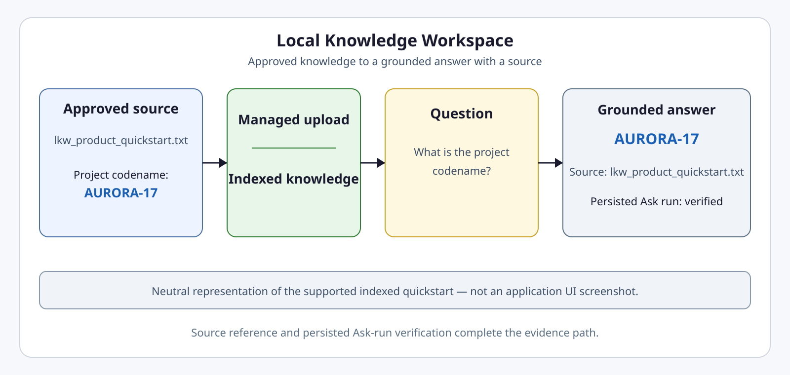
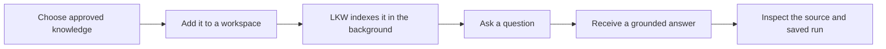

# Local Knowledge Workspace — Product Tour

Local Knowledge Workspace (LKW) is the primary Intergrax product path: a workspace for adding approved knowledge, asking questions, and receiving grounded answers with a source reference.

This tour explains the supported indexed-knowledge experience without requiring installation or a local run. It is a product walkthrough, not a screenshot of a finished application UI. Readers who want to run the path should use the [LKW Quick Start](QUICKSTART.md); technical reviewers should use the [LKW Platform Proof](../proof/LKW_PLATFORM_PROOF.md).

LKW is the **Primary Product Proof** and currently a **Backend Product Alpha / MVP** with **PARTIAL** status.

## At a glance

| Item | Meaning |
|------|---------|
| Product | Local Knowledge Workspace |
| Current scope | Indexed knowledge from approved sources |
| User result | Grounded answer with a source reference |
| Inspectable evidence | Source and persisted Ask-run verification |
| Maturity | Backend Product Alpha / MVP |
| Primary next action | Run the supported LKW Quick Start |
| Run it | [LKW Quick Start](QUICKSTART.md) |
| Technical review | [LKW Platform Proof](../proof/LKW_PLATFORM_PROOF.md) |

<picture>
  <source
    media="(prefers-color-scheme: dark)"
    srcset="../assets/lkw-grounded-result-dark.svg"
  >
  <source
    media="(prefers-color-scheme: light)"
    srcset="../assets/lkw-grounded-result-light.svg"
  >
  
</picture>

This is a neutral representation of the supported indexed workflow, not a finished application UI screenshot.

## Choose the right LKW route

| Route | Use it when | What it requires | What it gives you |
|-------|-------------|------------------|-------------------|
| Product Tour | You want to understand LKW | Reading only | Product experience and boundaries |
| Quick Start | You want to run LKW | Local prerequisites | Grounded sample answer and source |
| Platform Proof | You want technical evidence | Reviewer environment and proof steps | Bounded platform evidence |

**Proofs:** `LKW-PRODUCT-QUICKSTART-WINDOWS`, `LKW-PRODUCT-QUICKSTART-LINUX`, `LKW-PRODUCT-QUICKSTART-MACOS`

**Product Tour ≠ Quick Start ≠ Platform Proof.** None replaces the others.

## The LKW experience

### 1. Add approved knowledge

You begin with knowledge that is approved for the workspace. The experience is centered on a deliberate source choice rather than an unrestricted view of local files.

### 2. Let LKW prepare it

LKW prepares the selected knowledge for questions in the background. Once it is indexed, the workspace can use that knowledge as the basis for an answer.

### 3. Ask a question

You ask a question about the indexed knowledge in the workspace. The supported product path focuses on questions that can be answered from that prepared scope.

### 4. Receive a grounded answer

LKW returns an answer grounded in the indexed knowledge. The result is useful as a bounded product outcome, not a claim that every possible question will be answered correctly.

### 5. Inspect the source and saved result

The result includes a source reference so you can see where the answer came from, and a saved Ask run so the outcome can be inspected again.

## What you receive

| Result | Why it matters |
|--------|----------------|
| Grounded answer | The response is based on indexed knowledge |
| Source reference | You can see where the answer came from |
| Persisted Ask run | The result can be inspected again |
| Explicit boundaries | You know what is and is not demonstrated |

## What this proves

This tour represents the actual application/runtime indexed Ask path through Hybrid Ask over documented indexed evidence: approved knowledge, managed sample upload, grounded Ask, source reference, and persisted Ask-run verification.

## Current boundary

This tour does **not** represent:

- mixed indexed + authorized live Hybrid Ask;
- complete live-provider access;
- finished end-user UI;
- finished SaaS;
- production-readiness certification;
- security or compliance certification;
- real-user validation;
- commercial validation.

## Primary next action

**Run the supported LKW product path:** [LKW Quick Start](QUICKSTART.md)

## Other routes

| Route | Use it for |
|-------|------------|
| [LKW Platform Proof](../proof/LKW_PLATFORM_PROOF.md) | Inspect deeper technical evidence |
| [docs/project/proofs/PROOFS.md](../../../../docs/project/proofs/PROOFS.md) | Check current evidence status |
| [docs/project/overview/USE_CASES.md](../../../../docs/project/overview/USE_CASES.md) | Check whether the use case fits |
| [Evaluation Guide](../../../../docs/project/builders/EVALUATION_GUIDE.md) | Evaluate one bounded claim fairly |
| [README.md](../../../../README.md) | Return to the project overview |
