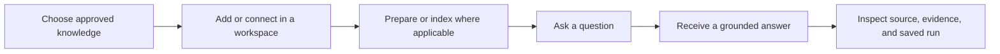
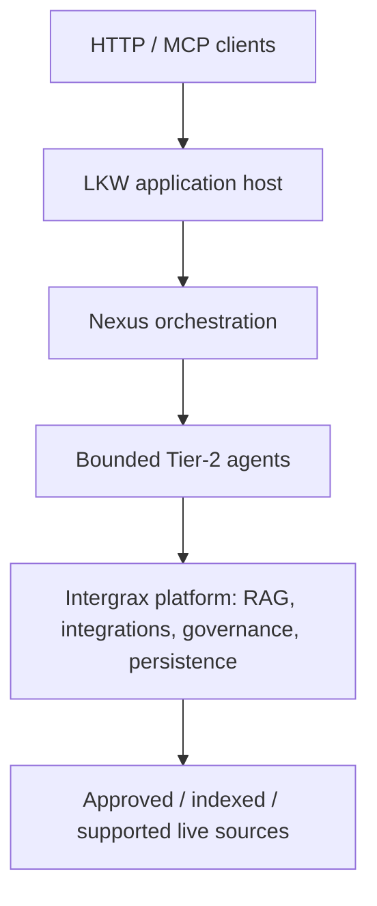
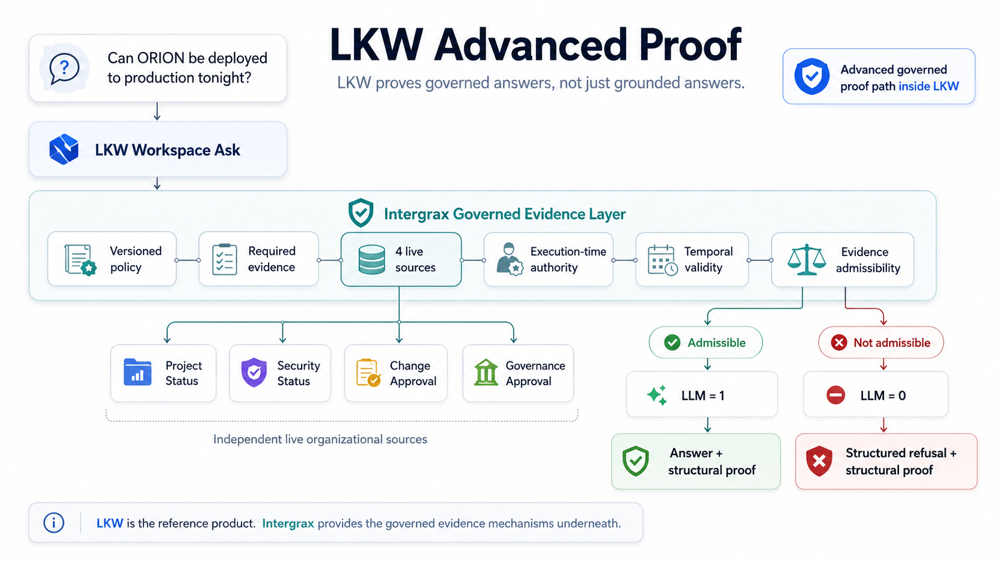

# Local Knowledge Workspace — Product Tour

**Local Knowledge Workspace (LKW)** is Intergrax's active reference product: a **governed AI knowledge workspace** for organizational knowledge that may live across approved documents and connected systems.

Users can add or connect approved knowledge, ask questions, receive grounded and reviewable answers, inspect sources and evidence, and use current external evidence on supported governed paths.

This tour explains the supported product experience without requiring installation or a local run. It is a product walkthrough, not a screenshot of a finished application UI.

**Maturity:** Backend Product Alpha / MVP — **PARTIAL**. See [Current boundary](#current-boundary) for the full evidence limit inventory.

## At a glance

| Item | Meaning |
|------|---------|
| **Product** | Local Knowledge Workspace |
| **Primary problem** | Organizational knowledge fragmented across approved files, web sources, connected systems, and current external systems |
| **Primary experience** | Governed Ask over approved and prepared knowledge |
| **Primary user outcome** | Grounded answer with inspectable source reference and persisted run |
| **Maturity** | Backend Product Alpha / MVP — **PARTIAL** |
| **Flagship proof** | [Governed Evidence Decision Proof](../proof/GOVERNED_HYBRID_KNOWLEDGE_PROOF.md) — advanced **LIVE_ONLY** admissibility path |
| **Try it** | [LKW Quick Start](QUICKSTART.md) — primary executable product path |
| **Technical architecture** | [LKW Architecture](../ARCHITECTURE.md) — how the product is built and where LKW ends / Intergrax begins |

## The problem LKW addresses

Project and organizational knowledge rarely sits in one place. It may be spread across:

- approved files and documents
- web sources
- connected organizational systems
- current external or live systems where integration is supported

You may need to **find** information, **gather** facts from multiple sources, **inspect current state**, **combine evidence**, and **synthesize** a result — while keeping answers reviewable rather than opaque.

LKW provides one governed workspace path for those needs. Scope limits are listed under [Current boundary](#current-boundary).

## Who LKW is for

LKW fits teams and reviewers who work with fragmented organizational knowledge and need bounded, inspectable outcomes:

- teams coordinating knowledge across approved documents and connected systems
- engineering, project, and operational workflows that need reviewable answers with sources
- reviewers who need evidence and persisted runs, not opaque chat output alone

This is a workflow fit, not a claim of market or real-user validation.

## The LKW experience

### 1. Add or connect approved knowledge

You begin with knowledge approved for the workspace — uploaded documents, managed samples, or connected sources where supported. The experience centers on deliberate source choice, not unrestricted filesystem access.

### 2. Let LKW prepare it

LKW prepares selected knowledge for questions. Indexed material is prepared in the background; supported live evidence follows separate governed paths where available.

### 3. Ask a question

You ask about the prepared scope. The primary supported product path answers from indexed, approved knowledge. Advanced governed paths may acquire current external evidence where explicitly supported.

### 4. Receive a grounded answer

LKW returns an answer grounded in admissible evidence for that path — a bounded product outcome on supported routes.

### 5. Inspect the source and saved result

Results include source references where applicable, plus a persisted Ask run so outcomes can be reviewed again.

## Business and operational value

| Situation | What LKW provides |
|-----------|-------------------|
| Fragmented knowledge | One governed Ask path instead of ad-hoc search across silos |
| Opaque AI answers | Source and evidence visibility on supported paths |
| Need to inspect current organizational state | Bounded live evidence path where supported |
| Need for review and audit | Persisted, inspectable Ask runs and structural proof on advanced paths |
| Risk of answering without required evidence | Advanced governed admissibility proof on the flagship **LIVE_ONLY** path |

Proof-path scope and partial coverage: [Current boundary](#current-boundary).

## Why Intergrax

LKW is built as a Tier-3 application on Intergrax — reuse is a consequence of product construction, not a separate platform catalog.

| LKW needs | Reused Intergrax capability |
|-----------|----------------------------|
| Approved knowledge intake, indexing, and retrieval | Knowledge Intake, RAG, and knowledge-access boundaries |
| Authorized reads from connected systems | Integrations and live-capability boundaries |
| Evidence requirements before synthesis | Governed execution and evidence admissibility |
| Policy and connection validity at run time | Runtime authority |
| Surviving restarts and reviewing past outcomes | Durable execution, persistence, and ProofReceipt |
| Traceable, inspectable runs | Observability and provenance |
| Bounded agent workflows for Ask | Nexus orchestration |

## Architecture at a glance

LKW separates thin clients from the product host and reuses Intergrax platform capabilities behind one application boundary:

**Deeper design:** [LKW Architecture](../ARCHITECTURE.md) — product layers, responsibility boundaries, and where LKW ends / Intergrax begins.

## Flagship proof — Governed Evidence Decision Proof

The strongest advanced proof story is the [Governed Evidence Decision Proof](../proof/GOVERNED_HYBRID_KNOWLEDGE_PROOF.md): governed answer admissibility over **live organizational evidence** (**LIVE_ONLY**).

It demonstrates versioned policy-derived obligations, four independent controlled live providers reached via real HTTP/runtime paths (not external SaaS validation), execution-time authority, temporal admissibility, typed failure semantics, LLM suppression when inadmissible, and persisted structural proof over Docker-backed vendor truth.

It is **LIVE_ONLY** — see [Current boundary](#current-boundary) for hybrid and validation limits.

<a href="../assets/fullsize/lkw-governed-evidence-gate.md">
<picture>
  <source
    media="(prefers-color-scheme: dark)"
    srcset="../assets/lkw-governed-evidence-gate-dark.png"
  >
  <source
    media="(prefers-color-scheme: light)"
    srcset="../assets/lkw-governed-evidence-gate-light.png"
  >
  
</picture>
</a>

This visual represents the governed evidence proof story — not the Product Quick Start indexed path and not a finished application UI screenshot.

## Supporting proof highlights

| Proof path | What it demonstrates | Owner |
|------------|---------------------|-------|
| **Product Quick Start** | Runnable indexed Ask over approved sample knowledge with citation and persisted run verification | [LKW Quick Start](QUICKSTART.md) |
| **Governed Evidence Decision Proof** | **LIVE_ONLY** multi-provider evidence admissibility, authority, and structural proof | [Governed Evidence Decision Proof](../proof/GOVERNED_HYBRID_KNOWLEDGE_PROOF.md) |
| **Trusted Ask** | Durable workspace Ask over indexed knowledge with citations and persisted runs | [LKW Platform Proof](../proof/LKW_PLATFORM_PROOF.md) — Trusted Ask section |
| **Core Platform Proof** | Real application startup, ingest worker path, persistence, hosting, and ProofReceipt evidence | [LKW Platform Proof](../proof/LKW_PLATFORM_PROOF.md) |

Proof documents own semantics, commands, and receipt detail. This tour summarizes outcomes only.

## How do I know this works?

LKW offers distinct public proof stories — choose by goal:

| Path | What it is | What you get |
|------|------------|--------------|
| **Product Quick Start** | Indexed, grounded onboarding path | One-command indexed Ask V1; **AURORA-17** success marker |
| **Governed Evidence Decision Proof** | Bounded advanced proof inside the LKW application stack | Governed answer admissibility over **live organizational evidence** (`LIVE_ONLY`) |

**Product Quick Start** is the easiest runnable product evaluation: approved sample knowledge, managed upload, indexed Ask, source citation, and persisted Ask-run verification.

**Governed Evidence Decision Proof** demonstrates versioned policy-derived obligations, four independent controlled live providers reached via real HTTP/runtime paths (not external SaaS validation), execution-time authority, temporal admissibility, typed failure semantics, LLM gating, and persisted structural proof over Docker-backed vendor truth (**LIVE_ONLY**).

See the [Governed Evidence Decision Proof](../proof/GOVERNED_HYBRID_KNOWLEDGE_PROOF.md) for the canonical technical narrative and [Current boundary](#current-boundary) for what remains outside that proof.

**Product Tour ≠ Quick Start ≠ Platform Proof.** None replaces the others.

## What this proves

This tour represents the actual application/runtime indexed Ask path through Hybrid Ask over documented indexed evidence: approved knowledge, managed sample upload, grounded Ask, source reference, and persisted Ask-run verification.

Advanced governed paths prove additional evidence-admissibility behavior; they do not certify every product-wide combination.

## Current boundary

LKW today does **not** represent:

- complete mixed indexed + authorized live Hybrid Ask;
- complete external live-provider access;
- finished end-user UI;
- finished SaaS;
- production-readiness certification;
- security or compliance certification;
- real-user validation;
- commercial validation.

## Try it — Quick Start

Want to run the supported product slice? Use the [LKW Quick Start](QUICKSTART.md).

## Technical architecture review

Understand how the product is built and where LKW ends / Intergrax begins: [LKW Architecture](../ARCHITECTURE.md).

For bounded technical evidence beyond this tour: [LKW Platform Proof](../proof/LKW_PLATFORM_PROOF.md).

## Go deeper

| Route | Use it for |
|-------|------------|
| [LKW Quick Start](QUICKSTART.md) | Run the supported product path |
| [Governed Evidence Decision Proof](../proof/GOVERNED_HYBRID_KNOWLEDGE_PROOF.md) | Advanced governed evidence admissibility proof |
| [LKW Platform Proof](../proof/LKW_PLATFORM_PROOF.md) | Core Platform Proof, Trusted Ask, and deeper technical evidence |
| [LKW Architecture](../ARCHITECTURE.md) | Product design and Intergrax boundary |
| [docs/project/proofs/PROOFS.md](../../../../docs/project/proofs/PROOFS.md) | Current public evidence dashboard |
| [README.md](../../../../README.md) | Return to the project overview |
