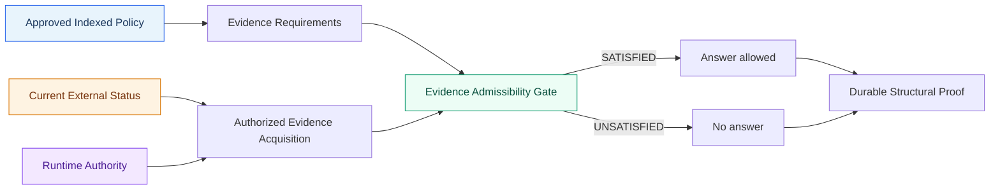
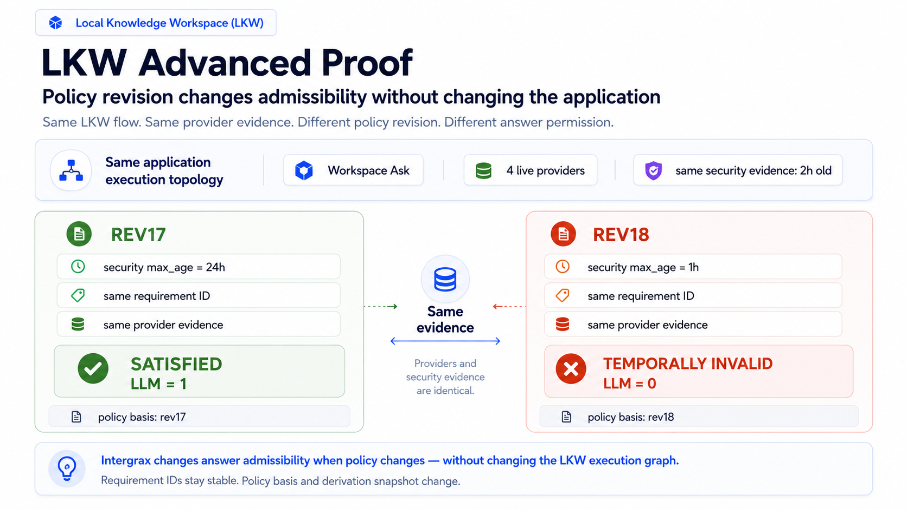
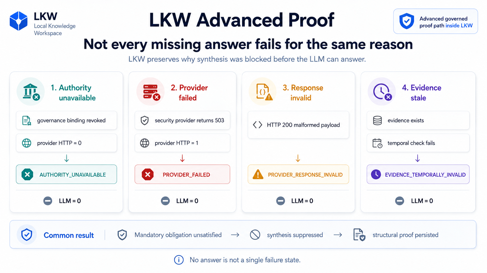
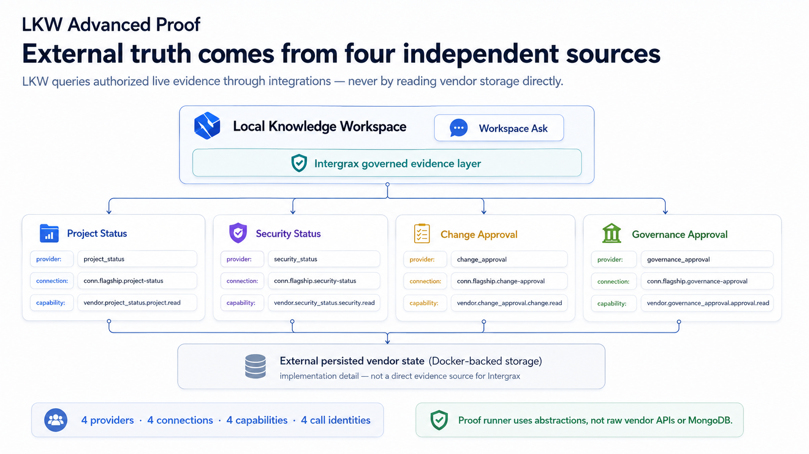
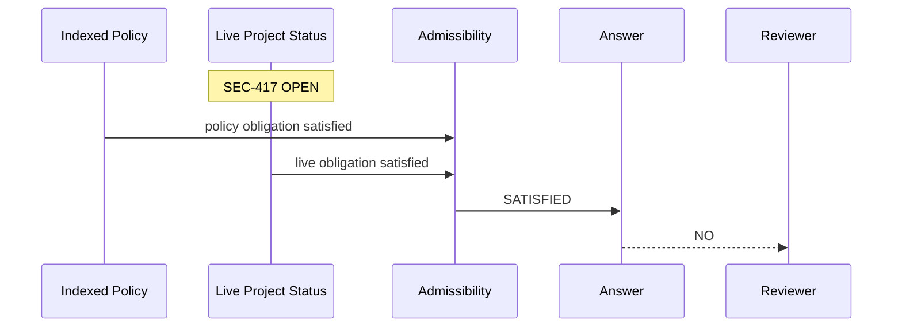
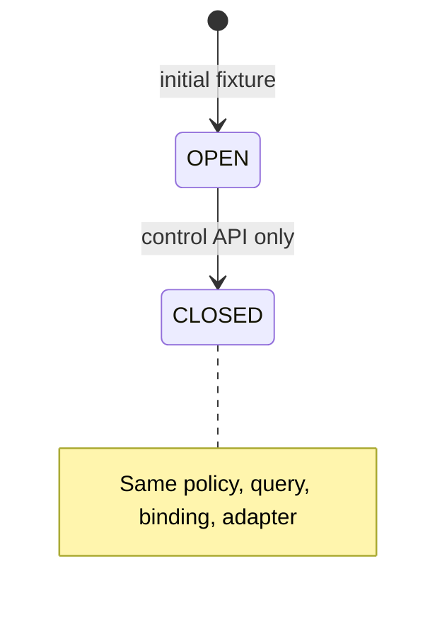
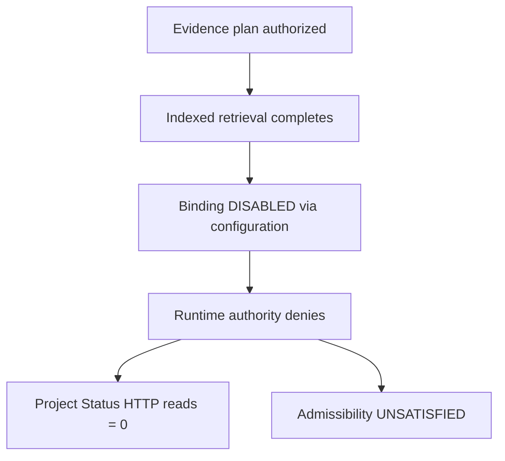
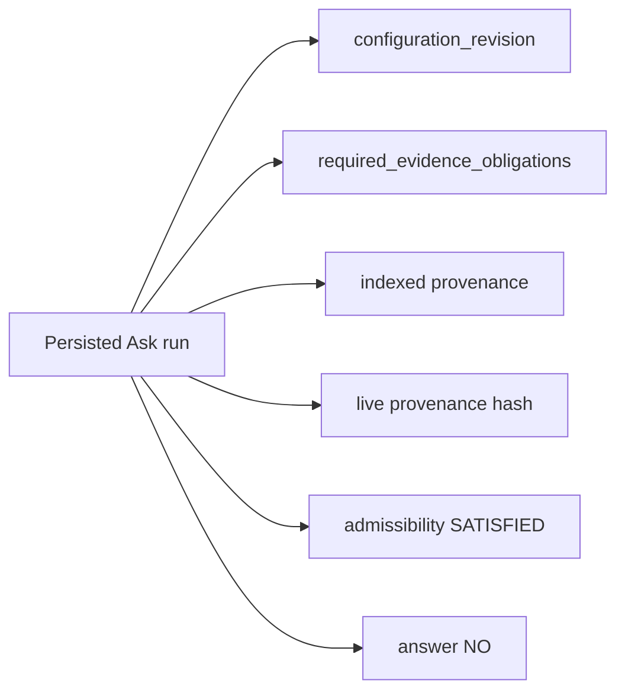
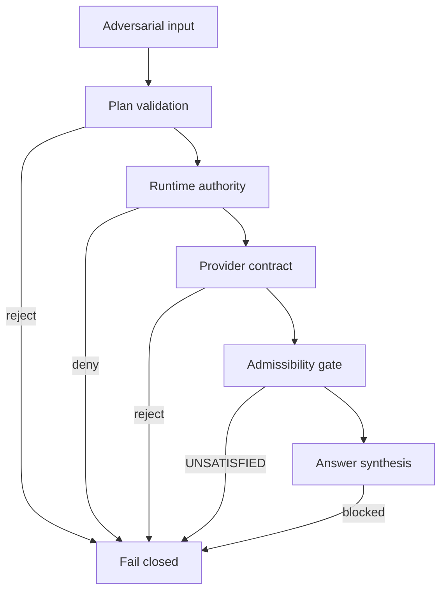

# Governed Hybrid Knowledge Proof

**Intergrax determines what evidence is required for an answer to be admissible, resolves it through authorized indexed and live sources, revalidates authority at execution time, and preserves structural proof of why a past answer was valid.**

> **Scope note:** COMM-5 bounded proof paths collectively exercise indexed and live
> evidence mechanisms. The **Advanced Flagship proof (F3-F)** — the public
> **Governed Evidence Decision Proof** — is specifically **LIVE_ONLY** with four
> independent **controlled live providers** (Docker-backed services reached through
> real runtime HTTP). They are **not** four verified external SaaS systems.
> Complete indexed + authorized live Hybrid Ask in a single admissibility gate
> remains **not proven**.

### Provider evidence levels

| Level | Meaning |
|-------|---------|
| **mock** | Substituted test response; no independent service process |
| **controlled live provider / service** | A genuinely running, independent service reached through real runtime/network paths, operated inside the proof environment (for example Docker) — not a mock, but not external-provider certification |
| **external live provider** | A real vendor system outside proof-harness control (for example production Jira, ServiceNow, or customer VPC SaaS) |

**F3-F uses controlled live providers only.** Real HTTP, separate processes, execution-time authority, failure semantics, and restart persistence are proven. **External SaaS validation is not claimed.**

<a href="../assets/fullsize/lkw-governed-evidence-gate.md">
<picture>
  <source
    media="(prefers-color-scheme: dark)"
    srcset="../assets/lkw-governed-evidence-gate-dark.png"
  >
  <source
    media="(prefers-color-scheme: light)"
    srcset="../assets/lkw-governed-evidence-gate-light.png"
  >
  
</picture>
</a>

*Conceptual COMM-5 evidence model. The F3-F Advanced Flagship below is **LIVE_ONLY**
and receives versioned policy rules through the policy-resolution boundary; it does
not perform indexed policy retrieval.*



---

## What is proven today

The strongest accepted public evidence is the **Governed Evidence Decision Proof**
(**Advanced Flagship / F3-F**): a **LIVE_ONLY**, multi-provider, bounded governed
evidence proof over four independent **controlled live providers** — Docker-backed
organizational services reached through real runtime HTTP, not external SaaS.

F3-F demonstrates that Intergrax can derive mandatory live evidence obligations
from versioned policy rules, acquire four independent controlled live services
through authorized connections and capabilities, revalidate authority at execution
time,
apply temporal admissibility, classify typed evidence failures, suppress LLM
synthesis when admissibility is unsatisfied, and persist structural proof of why
a past answer was or was not permitted.

Earlier bounded proofs — indexed policy plus a single live provider (COMM-5D),
adversarial hardening, and Docker vendor-persistence foundations — remain valid
building blocks documented under [Earlier proof lineage](#earlier-proof-lineage).

---

## Governed Evidence Decision Proof (Advanced Flagship / F3-F)

| | |
|---|---|
| **Public name** | Governed Evidence Decision Proof |
| **Internal** | Advanced Flagship Proof / F3-F |
| **Mode** | **LIVE_ONLY** |
| **Question** | Can ORION be deployed to production tonight? |

**Core demonstrated behavior:**

- four policy-derived mandatory live evidence obligations
- four independent controlled live providers (Docker-backed; real HTTP/runtime path)
- four connections
- four capabilities
- execution-time authority revalidation
- temporal admissibility
- typed failure semantics
- mandatory inadmissibility suppresses LLM
- structural reason persistence across run reload
- Docker-backed vendor truth
- vendor restart without reseed

**Claim boundary:** F3-F is a **multi-provider**, **LIVE_ONLY**, **bounded
governed evidence proof** over **controlled live providers**. Real runtime/network
execution is proven; **external live provider / SaaS validation is not**. It is
**not** complete indexed + authorized live Hybrid Ask certification. COMM-5
collectively exercises indexed and live mechanisms across separate bounded paths;
F3-F itself exercises **controlled live evidence only**.

**Admissibility note:** `SATISFIED` means the evidence gate permits synthesis. It
does **not** mean deployment is approved, the business result is positive, or the
answer is guaranteed correct. Evidence may be admissible while provider facts still
indicate BLOCKED/NO.

<a href="../assets/fullsize/lkw-policy-revision-admissibility.md">
<picture>
  <source
    media="(prefers-color-scheme: dark)"
    srcset="../assets/lkw-policy-revision-admissibility-dark.png"
  >
  <source
    media="(prefers-color-scheme: light)"
    srcset="../assets/lkw-policy-revision-admissibility-light.png"
  >
  
</picture>
</a>

Composes F3-A/B/C/D/E into one Docker-backed four-provider governed decision proof.

---

## How to run the Advanced Flagship

**Prerequisites:** Python 3.12, `uv`, repo checkout, Docker. No cloud credentials.

```bash
docker compose \
  -f applications/local_workspace_application/docker/docker-compose.governed-hybrid-proof.yml \
  up --build -d

uv run python -m proof_infrastructure.governed_hybrid_knowledge_proof.advanced_flagship_proof
```

**Duration:** Docker-backed proof (minutes on a developer machine, depending on image build).

Tests: `tests/unit/proof_infrastructure/test_advanced_flagship_proof.py`

---

## Flagship scenario matrix

| Scenario | Expected |
|----------|----------|
| REV17 all satisfied | 4 policy-derived obligations, LLM = 1 |
| REV18 stale security | same evidence, tighter policy, LLM = 0 |
| REV18 fresh security | evidence refresh only, LLM = 1 |
| Authority revoked | governance HTTP = 0, AUTHORITY_UNAVAILABLE |
| Provider 503 | real security HTTP, PROVIDER_FAILED |
| Malformed response | PROVIDER_RESPONSE_INVALID |
| Vendor restart | persisted Mongo record survives process restart |
| Structural history | REV17 vs REV18 policy basis / snapshot comparison |

---

## Policy revision story

The flagship proof uses versioned deployment policy rules. Under **REV17**, the
same two-hour-old security evidence satisfies a 24-hour maximum-age obligation and
admissibility is **SATISFIED**. Under **REV18**, the policy tightens to a one-hour
maximum age on the same evidence snapshot — admissibility becomes **UNSATISFIED** and
LLM synthesis is suppressed (`LLM = 0`). After a fresh security evidence refresh
only, **REV18** admissibility returns to **SATISFIED** (`LLM = 1`).

Policy revision changes admissibility requirements without changing the underlying
provider facts until evidence is refreshed.

---

## Failure semantics

<a href="../assets/fullsize/lkw-evidence-failure-semantics.md">
<picture>
  <source
    media="(prefers-color-scheme: dark)"
    srcset="../assets/lkw-evidence-failure-semantics-dark.png"
  >
  <source
    media="(prefers-color-scheme: light)"
    srcset="../assets/lkw-evidence-failure-semantics-light.png"
  >
  
</picture>
</a>

The flagship proof distinguishes typed failure paths that all suppress LLM synthesis:

| Failure class | Trigger (flagship) | HTTP to provider | LLM | Admissibility |
|---------------|-------------------|------------------|-----|---------------|
| Authority unavailable | binding revoked before live call | 0 | 0 | UNSATISFIED |
| Provider failed | real HTTP, vendor returns 503 | 1 | 0 | UNSATISFIED |
| Provider response invalid | malformed provider payload | 1 | 0 | UNSATISFIED |
| Temporally invalid evidence | policy max-age tightened (REV18 stale) | prior reads | 0 | UNSATISFIED |

**Governance denial vs provider failure:** runtime authority or plan validation can
stop execution before any live HTTP call (`HTTP = 0`). Provider failure occurs after
the provider is authorized and called (`HTTP = 1`) but does not yield valid live
evidence satisfying required obligations. In both cases synthesis is blocked
(`LLM = 0`, `answer = None`), but provider failures finalize into a valid typed
`INSUFFICIENT_EVIDENCE` run with `evidence_admissibility = UNSATISFIED` rather than
an accidental validation error.

---

## Controlled vendor truth and persistence

<a href="../assets/fullsize/lkw-external-evidence-authority.md">
<picture>
  <source
    media="(prefers-color-scheme: dark)"
    srcset="../assets/lkw-external-evidence-authority-dark.png"
  >
  <source
    media="(prefers-color-scheme: light)"
    srcset="../assets/lkw-external-evidence-authority-light.png"
  >
  
</picture>
</a>

The Advanced Flagship uses four independent **controlled live providers**
(Docker-backed HTTP services) accessed only through Intergrax integration
abstractions — never through direct proof-harness HTTP or storage mutation.
Vendor state lives outside the Intergrax process but **inside the proof environment**;
this is not external SaaS validation.

**F3-E-R1** (Security Status vendor) established Docker-backed Mongo persistence
for one controlled vendor. F3-F extends that pattern across four providers and proves
vendor restart without reseed: persisted Mongo records survive controlled vendor
process restart.

| Ownership | Responsibility |
|-----------|----------------|
| MongoDB | Persistence for Dockerized controlled vendors only |
| Controlled vendors | Domain access to vendor persistence via typed stores |
| Integration layer | Intergrax-facing vendor read access |
| `WorkspaceAskServiceV2` | Governed decision execution |
| Proof runner | Scenario coordination only |

**Boundary invariants:**

- The flagship proof runner never talks directly to vendor storage or vendor HTTP. All vendor reads pass through Intergrax integration abstractions; proof-only administration and lifecycle operations pass through typed proof infrastructure ports (`ControlledSecurityStatusAdminPort`, `GovernedHybridDockerEnvironmentV1`).
- MongoDB is an implementation detail of Dockerized vendors and is never a direct evidence source for Intergrax.

**Data flow (Docker flagship):**

```text
proof runner
→ GovernedHybridDockerEnvironmentV1 / GovernedSecurityDockerScenarioV1
→ WorkspaceAskServiceV2
→ KnowledgeQueryOrchestratorV1
→ LiveCapabilityExecutorV1
→ WorkspaceLiveAccessRuntimeAuthority
→ SecurityStatusIntegration (and three additional provider integrations)
→ controlled vendor HTTP
→ MongoSecurityStatusStore (per vendor)
→ MongoDB (named volume: governed_proof_vendor_data)
```

Proof control (seed, failure injection, readiness) uses typed proof admin ports only — never production integration mutation.

Optional focused Docker persistence runner (F3-E-R1 building block):

```bash
docker compose \
  -f applications/local_workspace_application/docker/docker-compose.governed-hybrid-proof.yml \
  up -d --build

uv run python -m proof_infrastructure.governed_hybrid_knowledge_proof.docker_persistence_proof
```

---

## Structural proof and reload

The flagship **Structural history** scenario compares persisted Ask runs across
**REV17** and **REV18**, demonstrating that structural proof records the policy
basis, required obligations, admissibility outcome, and answer permission at execution
time — not a replay of raw live payload bodies.

**Limitation (explicit):** EPHEMERAL live bodies are **not** durably retained.
Historical proof uses structural identity — `content_hash`, binding/capability IDs,
timestamps, admissibility — not raw live payload replay.

The **Vendor restart** scenario proves that Docker-backed vendor state survives
controlled process restart without reseed, while structural Ask-run proof remains
inspectable across reload.

---

## Explicit limitations

| Boundary | Status |
|----------|--------|
| F3-F mode | **LIVE_ONLY** — not mixed indexed + authorized live Hybrid Ask |
| Product Quick Start | Separate indexed onboarding path — not this proof |
| Admissibility | Permits synthesis only — not deployment approval or positive business outcome |
| Live payload replay | EPHEMERAL bodies not durably retained |
| Production readiness | Not claimed |
| External live provider / SaaS validation | Not claimed — controlled Docker-backed services only |
| Real enterprise vendor deployment | Not claimed |
| Universal vendor interoperability | Not claimed |
| Real-user / commercial validation | Not established |

Complete indexed + authorized live Hybrid Ask in a single admissibility gate remains
**not proven**.

---

## Earlier proof lineage

The Advanced Flagship was assembled from earlier bounded slices:

```text
COMM-5D (indexed policy + single live provider)
  → adversarial hardening
  → temporal / failure / provider-persistence foundations (F3-E-R1)
  → F3-F Advanced Flagship (four controlled live providers, LIVE_ONLY)
```

These proofs remain valid evidence for the mechanisms they exercise. They are
**building blocks**, not the final public flagship story.

### COMM-5D — indexed policy + single live provider

The COMM-5D proof demonstrated indexed deployment policy plus a single authorized
**Project Status** live provider across four scenarios: Reality, Freshness, Authority,
and History.

#### Quick start (COMM-5D)

**Prerequisites:** Python 3.12, `uv`, repo checkout. No cloud credentials. No manual HTTP service.

```bash
uv run python -m proof_infrastructure.governed_hybrid_knowledge_proof
```

Optional machine-readable output:

```bash
uv run python -m proof_infrastructure.governed_hybrid_knowledge_proof --json
```

**Duration:** local deterministic proof (seconds on a developer machine).

#### What COMM-5D demonstrated

| Guarantee | Mechanism exercised |
|-----------|---------------------|
| Explicit evidence requirements | HYBRID Query Policy + product/provider obligations |
| Indexed + live admissibility | `evaluate_execution_admissibility` |
| Authority revalidated at execution | `WorkspaceLiveAccessRuntimeAuthority` |
| Required evidence failure blocks synthesis | `INSUFFICIENT_EVIDENCE`, LLM calls = 0 |
| Provider non-invocation is measurable | Project Status `read_request_count` |
| Structural historical proof | `WorkspaceAskServiceV2.get_run` / `WorkspaceAskRepository` |

This slice claims **Intergrax behavior only** — not comparisons to other platforms.

#### Story — ORION deployment readiness

**Project:** ORION  
**Question (all scenarios):** `Is ORION ready for deployment?`

**Approved indexed policy** (managed document path):

```text
Deployment Policy — Approved

A project is ready for deployment only when:
1. readiness score is at least 90
2. no security blocker is OPEN
```

**External live status (controlled HTTP):** readiness `94`, blocker `SEC-417`.

#### 01 — Reality matters



| Check | Expected |
|-------|----------|
| Live HTTP reads | 1 |
| Admissibility | SATISFIED |
| Decision | **NO** |

#### 02 — Freshness matters

Only external state changes: `SEC-417` OPEN → CLOSED.



| Check | Expected |
|-------|----------|
| Live HTTP reads | 1 |
| Admissibility | SATISFIED |
| Decision | **YES** |

#### 03 — Authority matters

Binding ACTIVE during planning; **DISABLED** after indexed retrieval, before live HTTP.



| Check | Expected |
|-------|----------|
| Live HTTP reads | **0** |
| LLM calls | **0** |
| Ask status | `INSUFFICIENT_EVIDENCE` |
| Decision | **CANNOT DETERMINE** |

#### 04 — History matters

Current live state may be CLOSED; historical Ask #1 still explains **why NO was valid then**.



#### Expected terminal output (COMM-5D, representative)

```text
============================================================
INTERGRAX — GOVERNED HYBRID KNOWLEDGE PROOF
============================================================

01 REALITY — current blocker changes the decision
HTTP reads: 1
Admissibility: SATISFIED
Decision: NO
RESULT: PASS

02 FRESHNESS — reality changes, policy does not
HTTP reads: 1
Admissibility: SATISFIED
Decision: YES
RESULT: PASS

03 AUTHORITY — revoked means physically not called
HTTP reads: 0
Admissibility: UNSATISFIED
LLM calls: 0
Decision: CANNOT DETERMINE
RESULT: PASS

04 HISTORY — why was NO valid then?
Decision: NO
RESULT: PASS

============================================================
4 / 4 PROOFS PASSED
============================================================
```

#### Real boundaries exercised (COMM-5D)

| Layer | Component |
|-------|-----------|
| Application | `WorkspaceAskServiceV2` |
| Indexed path | managed local document → `WorkspaceDocumentIndexingService` / `local.workspace.index` → `local.workspace.search` → `WorkspaceIndexedEvidenceRetrieverV1` |
| Indexed identity | normal tenant/workspace scope, managed-workspace service `user_id`, canonical `TaskId` — no proof identity/scope adapters |
| Connection | `TenantConnection` → `TenantConnectionRehydrator` → `KnowledgeConnectionRegistry` → `KnowledgeConnectionRegistryIntegrationResolverV1` |
| Live path | `LiveCapabilityExecutorV1` + `ProjectStatusReadLiveHandlerV1` |
| Authority revoke | `LiveAccessLifecycleService.disable` → `WorkspaceLiveAccessRuntimeAuthority` reload |
| Admissibility | `evaluate_execution_admissibility` |
| Synthesis | `HybridAskAnswerAssemblerV2` + deterministic proof LLM |
| Persistence | `WorkspaceAskRepository.get_run_v2` |
| External HTTP | `proof_infrastructure.controlled_project_status_service` |

No fake search-result injection, no manual integration registration, no direct configuration mutation by the proof harness.

### Adversarial verification

The following **adversarial invariants** are verified against the same real COMM-5D harness (`WorkspaceAskServiceV2`, indexed path, tenant connection, runtime authority, Project Status HTTP, admissibility, persistence). These are architectural proofs — not penetration-test certification.



| Attack | Expected defense | HTTP | LLM | Result |
|--------|------------------|-----:|----:|--------|
| A — required live missing | admissibility UNSATISFIED (indexed alone) | 0 | 0 | PASS |
| B — mid-flight revoke | execution-time authority deny | 0 | 0 | PASS |
| C — wrong connection/provider | plan validation reject | 0 | 0 | PASS |
| D — wrong tenant | workspace scope reject | 0 | 0 | PASS |
| E — wrong workspace | workspace scope reject | 0 | 0 | PASS |
| F — malformed / invalid-schema live payload | provider called; admissibility UNSATISFIED | 1 | 0 | PASS |
| G — 404 / 5xx | provider called; admissibility UNSATISFIED | 1 | 0 | PASS |
| H — caller downgrade | typed contract reject | 0 | 0 | PASS |
| I — stale plan | runtime revalidation deny | 0 | 0 | PASS |
| J — connection disabled | connection authority deny | 0 | 0 | PASS |
| K — capability mismatch | plan validation reject | 0 | 0 | PASS |
| L — EPHEMERAL leak | structural provenance only durable | 1 | 1 | PASS |
| M — historical immutability | persisted run unchanged | 1 | 1 | PASS |
| N — wrong call evidence | admissibility UNSATISFIED | 0 | 0 | PASS |
| O — duplicate/replay | NOT REACHABLE BY CONTRACT | 0 | 0 | PASS |

Tests: `tests/unit/proof_infrastructure/test_governed_hybrid_knowledge_adversarial.py`

---

## Architecture and tests

Hybrid Ask architecture and COMM-5C3 Project Status boundary:

[`HYBRID_ASK_ARCHITECTURE.md`](../HYBRID_ASK_ARCHITECTURE.md)

### Automated tests

```bash
uv run pytest tests/unit/proof_infrastructure/test_governed_hybrid_knowledge_proof.py -v
uv run pytest tests/unit/proof_infrastructure/test_governed_hybrid_knowledge_adversarial.py -v
uv run pytest tests/unit/proof_infrastructure/test_advanced_flagship_proof.py -v
```
