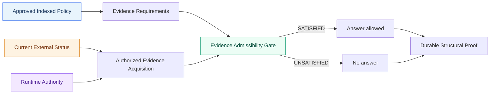
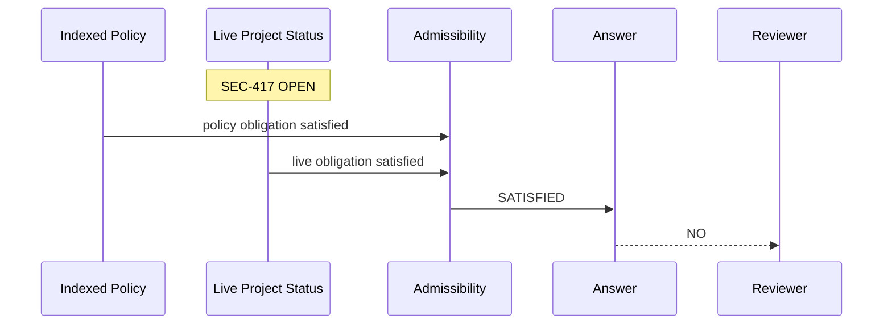
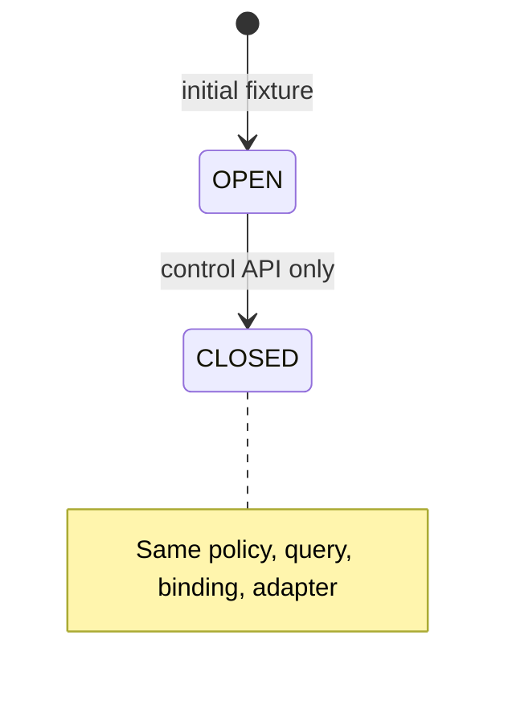
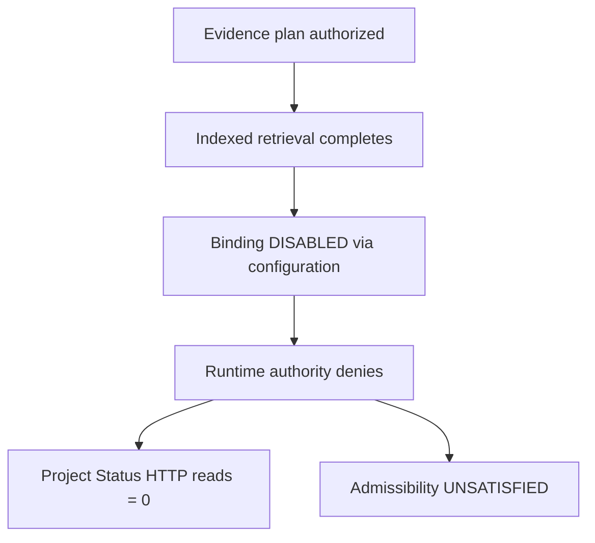
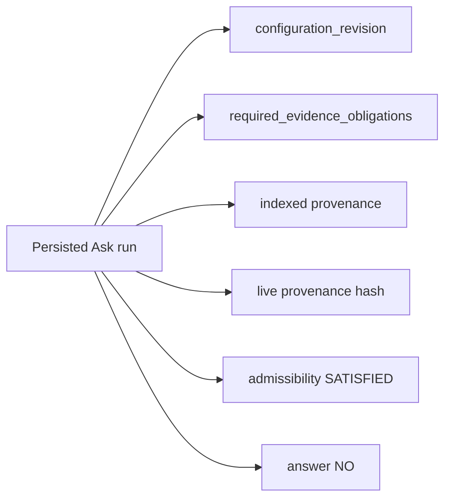
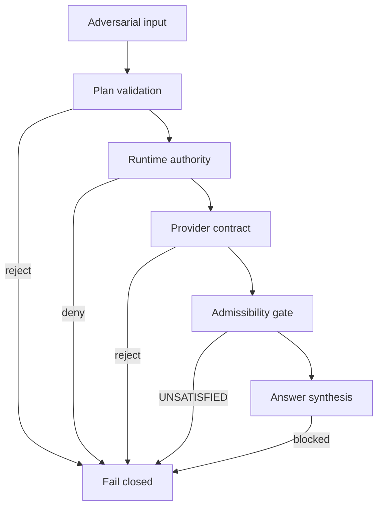

# Governed Hybrid Knowledge Proof

**Intergrax determines what evidence is required for an answer to be admissible, resolves it through authorized indexed and live sources, revalidates authority at execution time, and preserves structural proof of why a past answer was valid.**



---

## Quick start

**Prerequisites:** Python 3.12, `uv`, repo checkout. No cloud credentials. No manual HTTP service.

```bash
uv run python -m proof_infrastructure.governed_hybrid_knowledge_proof
```

Optional machine-readable output:

```bash
uv run python -m proof_infrastructure.governed_hybrid_knowledge_proof --json
```

**Duration:** local deterministic proof (seconds on a developer machine).

---

## What this proof demonstrates

| Guarantee | Mechanism exercised |
|-----------|---------------------|
| Explicit evidence requirements | HYBRID Query Policy + product/provider obligations |
| Indexed + live admissibility | `evaluate_execution_admissibility` |
| Authority revalidated at execution | `WorkspaceLiveAccessRuntimeAuthority` |
| Required evidence failure blocks synthesis | `INSUFFICIENT_EVIDENCE`, LLM calls = 0 |
| Provider non-invocation is measurable | Project Status `read_request_count` |
| Structural historical proof | `WorkspaceAskServiceV2.get_run` / `WorkspaceAskRepository` |

This document claims **Intergrax behavior only** — not comparisons to other platforms.

---

## Story — ORION deployment readiness

**Project:** ORION  
**Question (all scenarios):** `Is ORION ready for deployment?`

**Approved indexed policy** (managed document path):

```text
Deployment Policy — Approved

A project is ready for deployment only when:
1. readiness score is at least 90
2. no security blocker is OPEN
```

**External live status (controlled HTTP):** readiness `94`, blocker `SEC-417`.

---

## 01 — Reality matters



| Check | Expected |
|-------|----------|
| Live HTTP reads | 1 |
| Admissibility | SATISFIED |
| Decision | **NO** |

---

## 02 — Freshness matters

Only external state changes: `SEC-417` OPEN → CLOSED.



| Check | Expected |
|-------|----------|
| Live HTTP reads | 1 |
| Admissibility | SATISFIED |
| Decision | **YES** |

---

## 03 — Authority matters

Binding ACTIVE during planning; **DISABLED** after indexed retrieval, before live HTTP.



| Check | Expected |
|-------|----------|
| Live HTTP reads | **0** |
| LLM calls | **0** |
| Ask status | `INSUFFICIENT_EVIDENCE` |
| Decision | **CANNOT DETERMINE** |

---

## 04 — History matters

Current live state may be CLOSED; historical Ask #1 still explains **why NO was valid then**.



**Limitation (explicit):** EPHEMERAL live bodies are **not** durably retained. Historical proof uses structural identity — `content_hash`, binding/capability IDs, timestamps, admissibility — not raw live payload replay.

---

## Expected terminal output (representative)

```text
============================================================
INTERGRAX — GOVERNED HYBRID KNOWLEDGE PROOF
============================================================

01 REALITY — current blocker changes the decision
HTTP reads: 1
Admissibility: SATISFIED
Decision: NO
RESULT: PASS

02 FRESHNESS — reality changes, policy does not
HTTP reads: 1
Admissibility: SATISFIED
Decision: YES
RESULT: PASS

03 AUTHORITY — revoked means physically not called
HTTP reads: 0
Admissibility: UNSATISFIED
LLM calls: 0
Decision: CANNOT DETERMINE
RESULT: PASS

04 HISTORY — why was NO valid then?
Decision: NO
RESULT: PASS

============================================================
4 / 4 PROOFS PASSED
============================================================
```

---

## Real boundaries exercised

| Layer | Component |
|-------|-----------|
| Application | `WorkspaceAskServiceV2` |
| Indexed path | managed local document → `WorkspaceDocumentIndexingService` / `local.workspace.index` → `local.workspace.search` → `WorkspaceIndexedEvidenceRetrieverV1` |
| Indexed identity | normal tenant/workspace scope, managed-workspace service `user_id`, canonical `TaskId` — no proof identity/scope adapters |
| Connection | `TenantConnection` → `TenantConnectionRehydrator` → `KnowledgeConnectionRegistry` → `KnowledgeConnectionRegistryIntegrationResolverV1` |
| Live path | `LiveCapabilityExecutorV1` + `ProjectStatusReadLiveHandlerV1` |
| Authority revoke | `LiveAccessLifecycleService.disable` → `WorkspaceLiveAccessRuntimeAuthority` reload |
| Admissibility | `evaluate_execution_admissibility` |
| Synthesis | `HybridAskAnswerAssemblerV2` + deterministic proof LLM |
| Persistence | `WorkspaceAskRepository.get_run_v2` |
| External HTTP | `proof_infrastructure.controlled_project_status_service` |

No fake search-result injection, no manual integration registration, no direct configuration mutation by the proof harness.

---

## Architecture deep link

Hybrid Ask architecture and COMM-5C3 Project Status boundary:

[`HYBRID_ASK_ARCHITECTURE.md`](../HYBRID_ASK_ARCHITECTURE.md)

---

## Automated tests

```bash
uv run pytest tests/unit/proof_infrastructure/test_governed_hybrid_knowledge_proof.py -v
uv run pytest tests/unit/proof_infrastructure/test_governed_hybrid_knowledge_adversarial.py -v
```

---

## Adversarial verification

The following **adversarial invariants** are verified against the same real COMM-5D harness (`WorkspaceAskServiceV2`, indexed path, tenant connection, runtime authority, Project Status HTTP, admissibility, persistence). These are architectural proofs — not penetration-test certification.



| Attack | Expected defense | HTTP | LLM | Result |
|--------|------------------|-----:|----:|--------|
| A — required live missing | admissibility UNSATISFIED (indexed alone) | 0 | 0 | PASS |
| B — mid-flight revoke | execution-time authority deny | 0 | 0 | PASS |
| C — wrong connection/provider | plan validation reject | 0 | 0 | PASS |
| D — wrong tenant | workspace scope reject | 0 | 0 | PASS |
| E — wrong workspace | workspace scope reject | 0 | 0 | PASS |
| F — malformed / invalid-schema live payload | provider called; admissibility UNSATISFIED | 1 | 0 | PASS |
| G — 404 / 5xx | provider called; admissibility UNSATISFIED | 1 | 0 | PASS |
| H — caller downgrade | typed contract reject | 0 | 0 | PASS |
| I — stale plan | runtime revalidation deny | 0 | 0 | PASS |
| J — connection disabled | connection authority deny | 0 | 0 | PASS |
| K — capability mismatch | plan validation reject | 0 | 0 | PASS |
| L — EPHEMERAL leak | structural provenance only durable | 1 | 1 | PASS |
| M — historical immutability | persisted run unchanged | 1 | 1 | PASS |
| N — wrong call evidence | admissibility UNSATISFIED | 0 | 0 | PASS |
| O — duplicate/replay | NOT REACHABLE BY CONTRACT | 0 | 0 | PASS |

Tests: `tests/unit/proof_infrastructure/test_governed_hybrid_knowledge_adversarial.py`

**Governance denial vs provider failure:** runtime authority or plan validation can stop execution before any live HTTP call (`HTTP = 0`). Provider failure occurs after the provider is authorized and called (`HTTP = 1`) but does not yield valid live evidence satisfying required obligations. In both cases synthesis is blocked (`LLM = 0`, `answer = None`), but provider failures finalize into a valid typed `INSUFFICIENT_EVIDENCE` run with `evidence_admissibility = UNSATISFIED` rather than an accidental validation error.

---

## Docker vendor persistence (F3-E-R1)

The flagship COMM-5D proof uses an in-process controlled Project Status vendor. **F3-E-R1** adds a Docker-backed Mongo persistence proof for the controlled **Security Status** vendor.

```bash
docker compose \
  -f applications/local_workspace_application/docker/docker-compose.governed-hybrid-proof.yml \
  up -d --build

uv run python -m proof_infrastructure.governed_hybrid_knowledge_proof.docker_persistence_proof
```

| Ownership | Responsibility |
|-----------|----------------|
| MongoDB | Persistence for the Dockerized controlled vendor only |
| Security vendor | Domain access to vendor persistence via `MongoSecurityStatusStore` |
| `SecurityStatusIntegration` | Intergrax-facing vendor read access |
| `WorkspaceAskServiceV2` | Governed decision execution |
| Proof runner | Scenario coordination only |

**Boundary invariants:**

- The flagship proof runner never talks directly to vendor storage or vendor HTTP. All vendor reads pass through Intergrax integration abstractions; proof-only administration and lifecycle operations pass through typed proof infrastructure ports (`ControlledSecurityStatusAdminPort`, `GovernedHybridDockerEnvironmentV1`).
- MongoDB is an implementation detail of the Dockerized vendor and is never a direct evidence source for Intergrax.

**Data flow (Docker R1):**

```text
proof runner
→ GovernedHybridDockerEnvironmentV1 / GovernedSecurityDockerScenarioV1
→ WorkspaceAskServiceV2
→ KnowledgeQueryOrchestratorV1
→ LiveCapabilityExecutorV1
→ WorkspaceLiveAccessRuntimeAuthority
→ SecurityStatusIntegration
→ HttpxSecurityStatusReadClient
→ controlled vendor HTTP
→ MongoSecurityStatusStore
→ MongoDB (named volume: governed_proof_vendor_data)
```

Proof control (seed, failure injection, readiness) uses `ControlledSecurityStatusAdminPort` only — never production integration mutation.
