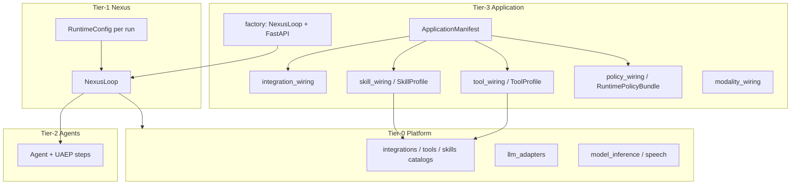

# Harness Application Layer Audit (Harness-Only)

Audit of Intergrax harness implementation (excluding business agents K.1/K.2), aligned with `IDEAL_HARNESS_AI_ARCHITECTURE.md` and `intergrax_runtime_architecture.md`.

**Scope:** Harness-only — no K.1/K.2 and no expansion of product business agents.  
**Date:** 2026-06-03  
**Reason for this file:** Explicit user request for a persistent audit artifact (not auto-generated documentation).

---

## 1. Does the documentation describe the harness as you assume?

**Yes — with vocabulary clarified.**

| Your assumption | What the Intergrax canon says | What IDEAL says |
|-----------------|-------------------------------|-----------------|
| **Agent** = autonomous business logic | **Tier-2** (`agents/`) — steps, prompts, `AgentContract`, UAEP; **no** product logic in Tier-3 | Agents = “composable workers” built from profiles |
| **Harness / environment** = rules, tools, policies, observability | **Tier-3 Application** = “product shell”, not an agent; composes Nexus + agent registry + profiles | **Harness** = governance + standards + registries; **Runtime** = execution fabric |
| **Harness = application + agents** | Practical composition: **Application (Tier-3) + selected agents (Tier-2) + Nexus (Tier-1) + Platform (Tier-0)** | Chain: `Harness → Runtime → Agents → Applications → Products` |

The canon (§5.3) maps this explicitly:

```text
Harness (Nexus + platform + application wiring)
  → runs Agent (Tier-2)
    → SkillManifest → tool_ids
    → ToolRuntime → integrations
    → LLMProfile / ModalityProfile (via run config)
```

**Terminology difference:** In IDEAL, “Application” is often a **domain package** (Legal, Research), while in Intergrax **Application = Tier-3 host** (deployable environment). Your “harness = work environment” maps to **`applications/<name>/` + `NexusLoop` + Tier-0 profiles**, and agents are a **separate layer** in `agents/`, attached via manifest — consistent with “Applications MUST NOT contain agent domain logic”.

**Conclusion:** The model “autonomous agent + configurable shadow workspace” is **aligned with the architecture** when workspace = Tier-3 wiring (tools, policy, trace, sandbox, integrations), not code under `agents/`.

---

## 2. Mapping IDEAL’s 9 layers → Intergrax → customization via `applications/`



Rating legend: **Full** | **Partial** | **Platform (requires Tier-0/1 PR)** | **Gap**

| IDEAL layer | Harness implementation | Tier-3 customization | Rating |
|-------------|------------------------|----------------------|--------|
| **3.1 Interface** | `applications/*/host/main.py`, `factory.py`, lab/legal/research routers, MCP, `/debug/*` | `ApplicationManifest` (prefix, port, `ApplicationFeatures`), per-app `.env` | **Full** (lab/poc/legal pattern) |
| **3.2 Identity & Trust** | `harness_auth`, `tenant_id` on `RuntimeRequest`, trace isolation by tenant | `LabApplicationSettings.requires_harness_api_key`, middleware in factory | **Partial** — no full ABAC/RBAC as application DSL; tenancy exists; product RBAC is a separate host concern |
| **3.3 Policy & Governance** | `RuntimePolicyBundle`, `ToolScopePolicy` / `ToolAccessPolicy`, `ModalityProfile`, HITL in Nexus | `build_runtime_policy_bundle(domain_fragments=...)`, `ToolProfile`, `wire_modality_extras`, legal: policy fragments | **Partial** — bundle and allowlists yes; **no** rich per-app rule engine without Python code |
| **3.4 Orchestration** | `NexusLoop`, planner, graph, long-running scheduler | `AgentRegistry` + manifest roster; optional `classifier`/`planner` on `NexusLoop` ctor | **Partial** — multi-agent via Nexus graph, but **no** standard “application manifest → custom graph topology” |
| **3.5 Cognition (LLM)** | `LLMAdapter`, `LLMProfile`, `RuntimeConfig` | Per-agent factory (e.g. legal `LLMProfile.from_env`); lab via `build_lab_agent_runtime_config` | **Partial** — strong per-agent; **manifest lacks** application-level `LLMProfile` field |
| **3.5.1 Modality** | Plane C: tools + `ModalityProfile` + execution profile | `wire_modality_extras`, `LEGAL_ENABLE_MODALITY_TOOLS`, env execution/celery | **Full** (harness scope W-ML Done) |
| **3.6 Capability** | Integration → Tool → Skill (P-Ext Done) | `bootstrap_catalogs`, `ToolProfile`, `SkillProfile`, EP `intergrax.*`, `ToolWiringContext` | **Full** catalog extensibility; **limit:** no hot-reload, marketplace out of scope |
| **3.7 Memory & RAG** | RAG managers, task memory, context budget | `IntegrationProfile` (qdrant, sqlite), `RuntimeConfig` enable_rag / memory flags, `wire_task_memory` | **Partial** — integration profiles yes; **ContextProfile/MemoryProfile** not separate manifest objects (IDEAL §17) |
| **3.8 Reliability** | retry, checkpoint, idempotency, circuit breaker | Stores in `wire_lab_integrations`, `IdempotentToolInvoker` via config, scheduler in lab features | **Partial** — mechanisms exist; application **lacks** a single “ReliabilityProfile” on manifest |
| **3.9 Observability** | trace, runtime events, plugins, metrics export, SLO docs | `trace_db_path`, `bootstrap_nexus_platform`, OTEL/Sentry slugs, `TASK_COMPLETED` + modality_metrics | **Full** at harness lab level; operational L3 = release evidence (W-OPS.5) |

---

## 3. Audit of “agent environment” layers (Tier-3 + what the application feeds into Nexus)

### 3.1 Composition contract — **strong, typed**

| Element | Where | Freedom |
|---------|--------|---------|
| `ApplicationManifest` | `applications/contracts/manifest.py` | `app_id`, roster (`AgentBinding.mount`), `IntegrationProfile`, `ApplicationFeatures` |
| `ApplicationBuildContext` | passed to agent factories | settings, tool/skill registry, policy bundle, trace path |
| `build_application_registry` | `_shared/wiring.py` | typed factories, no `getattr` on load path (W-OPS.14); exception: `agent_ref` / pydantic `__setattr__` on mount |

**Agent vs environment separation:** manifest **does not** import agent steps — only Tier-2 classes and Tier-3 factories (`legal_application/host/wiring.py` vs `legal/legal_agent.py`). This is the reference pattern and matches IDEAL §17.

### 3.2 Integrations (Tier-0) — **full catalog customization**

- `bootstrap_application_integration_catalog(preset="core"|"full")`
- `IntegrationProfile` with slugs per category (`lab_harness_preset`, legal-specific profile)
- Plugins: `INTERGRAX_DISCOVER_PLUGINS`, `IntegrationPlugin` + manifest (~99 slugs)

**Limits:** a new integration **category** = Tier-0 change + approval (§5.2.4); applications **cannot** bypass Tier-0 in production.

### 3.3 Tools & Skills — **full set customization, partial runtime customization**

| Mechanism | Customization |
|-----------|----------------|
| `ToolProfile.enabled` / `enabled_bundles` | lab harness list, legal modality flag |
| `ToolWiringContext` + `wire_modality_extras` | vision/speech/execution profiles |
| `SkillProfile` | e.g. legal `enabled_bundles=["legal"]`, lab `lab_skill_profile()` |
| `ToolPlugin` / `SkillPlugin` | pip packages, `EXTENSION_AUTHOR_GUIDE.md` |

**Full freedom:** which `tool_id` / `skill_id` are in the environment.  
**Partial:** handlers must live in the Tier-0 catalog (or plugin); agents get `allowed_tools` from contract + policy, not “arbitrary Python at runtime”.

### 3.4 Policy, rules, HITL — **partial**

Available from applications:

- `RuntimePolicyBundle` → `budget`, `plan_loop`, `tool_access` / `ToolScopePolicy`, `domain_fragments`
- `ModalityProfile` + `ToolAccessPolicy.apply_modality_profile`
- `RuntimeConfig`: `tool_scope_policy`, `runtime_policies`, `hitl_default_message`, `production_mode`

Gaps vs IDEAL “policy-first everywhere”:

- **`PolicyEngine`** — facade over `RuntimePolicyEngine`; applications **cannot** supply a declarative rule set (YAML/DSL) without code
- **V-SEC guardrails** (prompt/tool injection) — mainly Phase V artifacts / CI, not per-app plug-ins under `applications/`
- **Execution modes** (strict/balanced/exploratory) — not first-class manifest fields

### 3.5 Orchestration & shadow workspace — **partial**

`NexusLoop.__init__` accepts among others:

- `registry`, `planner`, `classifier`, `trace_store`, `policy_engine`, `shadow_manager`, `sandbox_manager`, checkpoint/HITL stores

In **lab `factory.py`** a **single** `NexusLoop` is assembled from lab integrations — a solid base, but:

- **Shadow workspace:** `ShadowWorkspaceManager` is in the Nexus API; **no** shared Tier-3 helper like `wire_shadow_workspace(settings)` in `_shared/` — each application must inject it
- **Multi-agent topology:** via Nexus planner/graph, not a declarative “application graph spec”
- **Long-running scheduler:** `ApplicationFeatures.long_running_scheduler` — lab yes, product profile defaults no

### 3.6 Cognition & profiles (IDEAL §17) — **split between agent and host**

IDEAL:

```text
Agent = LLMProfile + ModalityProfile + Skill Set + Policy Bundle + Context Profile + Memory Profile + Tool Permissions
```

Intergrax (actual state):

| IDEAL component | Where configured | Completeness |
|-----------------|------------------|--------------|
| LLM Profile | mainly Tier-2 factory + `RuntimeConfig.llm_adapter` | per agent ✓; per application manifest ✗ |
| Modality Profile | Tier-3 `wire_modality_extras` + `RuntimeConfig` | ✓ |
| Skill Set | `SkillProfile` + agent contract `skill_ids` | ✓ (two places — consistency required) |
| Policy Bundle | `build_runtime_policy_bundle` | ✓ |
| Context Profile | `ContextManager` / `TaskContextAssemblyOptions` in Nexus | only via `RuntimeConfig`, not manifest |
| Memory Profile | flags on `RuntimeConfig` + integrations | partial |
| Tool Permissions | `AgentContract.allowed_tools` + policy | ✓ (agent + env) |

**Conclusion:** IDEAL §17 is **documented and partially implemented**, but **not a single `ApplicationManifest` field set** — customization is spread across `host/*.py`, which allows freedom but requires discipline from application authors.

### 3.7 Observability & interactions — **full for harness lab**

- Trace SQLite, runtime events, debug API, MCP, interaction intake (`lab_json`, slack…)
- Plugins: metrics export on `TASK_COMPLETED`, modality on trace + runtime event
- SLO / ops: `HARNESS_ENVIRONMENT.md`, `phase_w_ops_evidence.py`

Product hosts (legal) — narrower surface (no full lab debug) — **intentional** (`ApplicationFeatures.product_defaults`).

### 3.8 Plugin extensibility (P-Ext) — **Done, with boundaries**

| Layer | Shipped | External |
|---------|---------|----------|
| Integrations | manifest+factory ~99 | `IntegrationPlugin` |
| Tools | 13/13 `ToolPlugin` | EP `intergrax.tools` |
| Skills | 3/3 `SkillPlugin` | EP `intergrax.skills` |

**Not included:** marketplace UI, hot-reload, skill as LangGraph workflow.

---

## 4. IDEAL alignment — maturity level (harness-only)

From the plan and audit (`adut_dojrzalosci_harness.md`, Phase W-OPS **Done** in code):

| IDEAL area | Harness implementation state | Application customization |
|------------|------------------------------|---------------------------|
| Registries / capability graph | V-CG + W-ML edges | indirect (via catalogs) |
| Policy / governance | strong in CI, bundle at runtime | partial per app |
| Reliability | idempotency, circuit breaker, checkpoint tests | partial wiring |
| Observability | trace + metrics + SLO docs | full in lab |
| **Operational L3** | code Done; **sign-off** = 2 release cycles recorded (2026-06-03: `h-app-2026-06-02`, `h-app-2026-06-03`) | process + CI (`harness-release.yml` on `v*` tags) |

**L2+ scalable harness** — yes. **Full freedom to customize every IDEAL layer without touching the platform** — **no**; this is intentional (Tier-0/1 as product, Tier-3 as composition).

---

## 5. Answer on “full freedom to build environments”

### What is fully achievable via `applications/` (without Tier-0 changes)

1. Choice of **integrations** (preset + profile + plugins).
2. Choice of **tools and skills** (profiles + wiring context + modality).
3. **Agent roster** and factories with access to `ApplicationBuildContext`.
4. **Policy bundle** (budget, plan loop, tool scope, domain fragments).
5. **Production host**: auth, env, trace DB, MCP, interaction routes, features.
6. **Plugins** on the composed `NexusLoop`.

### Where freedom is partial (Tier-3 code or platform PR required)

1. **Custom policy rules** beyond `domain_fragments` and allowlists.
2. **Custom planner / classifier / graph builder** — API exists, no standard manifest contract.
3. **LLMProfile / ContextProfile / MemoryProfile** as one environment package (IDEAL §17).
4. **Shadow workspace & sandbox** — infrastructure in Nexus, weak ready-made wiring in `_shared/`.
5. **New integration categories / new modality planes** — only via Tier-0 extension.
6. **Policy learning / L4 adaptive** — out of harness scope (IDEAL §25).

### Antipatterns — are they violated?

| IDEAL §13 antipattern | Harness |
|------------------------|---------|
| Agent god-object | **No** — UAEP + contracts |
| Tools without policy | **No** — `RuntimeToolInvoker` + scope |
| Registry bypass | **Rare** — legal/lab use catalogs; avoid hardcode in agents |
| Missing observability | **No** on lab strict path |

Minor technical note: `poc_template_application/host/wiring.py` uses `getattr(manifest, "integration_profile", None)` — replace with typed access (`manifest.integration_profile`) for W-OPS.14 consistency.

---

## 6. Final verdict

| Question | Answer |
|----------|--------|
| Does documentation describe the harness as **environment + agents**? | **Yes** — Tier-3 Application = environment; Tier-2 Agent = logic; Nexus + Tier-0 = OS and drivers. |
| Does this match IDEAL? | **Yes** in the layered model and §17; IDEAL uses different ordering of “Application/Product”, but §26 and canon §5.3 enforce the same separation. |
| Is **every** layer fully customizable via applications? | **Not 100%** — **Capability (tools/skills/integrations)** and **Interface/host** are closest to “full freedom”; **Policy, Orchestration, Cognition profiles** are **partial**; **new universals** require Tier-0/1. |
| Is agent / harness separation preserved in code? | **Yes** — manifest + wiring vs `agents/<name>/`; tests and architecture rules enforce it. |

**Architectural recommendation:** typed `ApplicationEnvironmentProfile` aggregating environment profiles (IDEAL §17) — delivery in **§7** (phase H-APP.1).

---

## 7. Implementation backlog — 100% audit closure (Phase H-APP)

**Canonical task register (all 43 IDs, status, paydown):** [`INTERGRAX_IMPLEMENTATION_PLAN.md`](INTERGRAX_IMPLEMENTATION_PLAN.md) — [Phase H-APP](INTERGRAX_IMPLEMENTATION_PLAN.md#phase-h-app--tier-3-application-environment-full-configurability) · execution order **§6.2x**.

**Goal:** Close every **Partial** / **Gap** topic from §2–§6 at application-layer configurability, without Band 3 product agents (K.1/K.2).

**Delivery rule:** One `H-APP.*` ID per PR → gate green → update paydown row in the implementation plan (not duplicated here).

**Out of explicit 100% scope (audit already defers):** marketplace UI, catalog hot-reload, skill-as-LangGraph-pack, IDEAL L4 policy learning (§25), new integration **categories** without Tier-0 RFC (§5.2.4), K.1/K.2 product agents.

```text
Wave H0 — Docs & hygiene (terminology, CI guards)
Wave H1 — ApplicationEnvironmentProfile + unified wiring (IDEAL §17 umbrella)
Wave H2 — Identity, policy DSL, execution modes, V-SEC app hooks
Wave H3 — Orchestration factory (graph spec, shadow/sandbox, Nexus composition)
Wave H4 — Context/Memory/Reliability profiles + runtime bridge
Wave H5 — Host migration matrix (all Tier-3 apps)
Wave H6 — Operational L3 sign-off (process, not feature code)
```

### 7.0 Traceability matrix (audit section → task IDs)

| Audit § | Topic | Task IDs |
|---------|--------|----------|
| §1 | Terminology harness vs application vs agent | H-APP.0.1–H-APP.0.2 |
| §2.3.2 | Identity ABAC/RBAC per application | H-APP.2.1–H-APP.2.3 |
| §2.3.3, §3.4 | Policy DSL, execution modes, V-SEC per app | H-APP.2.4–H-APP.2.8 |
| §2.3.4, §3.5 | Orchestration graph spec, Nexus factory | H-APP.3.1–H-APP.3.6 |
| §2.3.5, §3.6 | LLMProfile on application manifest | H-APP.1.3, H-APP.1.6 |
| §2.3.7, §3.6 | ContextProfile, MemoryProfile | H-APP.4.1–H-APP.4.4 |
| §2.3.8, §3.8 | ReliabilityProfile | H-APP.4.5–H-APP.4.7 |
| §3.1 | Typed composition, no getattr in hosts | H-APP.0.3, H-APP.5.4 |
| §3.3 | Skill/tool permission consistency | H-APP.1.7, H-APP.0.4 |
| §3.5 | Shadow workspace + sandbox wiring | H-APP.3.4–H-APP.3.5 |
| §3.7 | Product observability profile (optional debug) | H-APP.4.8 |
| §4 | Operational L3 release evidence | H-APP.6.1–H-APP.6.2 |
| §5 | Registry bypass prevention | H-APP.0.4 |
| §6 | EnvironmentProfile recommendation | H-APP.1.1–H-APP.1.5 |
| §6 (follow-up) | Per-app migration checklist | H-APP.5.1–H-APP.5.3 |

---

### Wave H0 — Documentation & hygiene

| ID | Deliverable | Audit ref | Location / acceptance |
|----|-------------|-----------|------------------------|
| H-APP.0.1 | **Harness terminology glossary** — table: Harness vs Tier-1 Nexus vs Tier-3 Application vs Tier-2 Agent vs Product; map to IDEAL §0.2 chain | §1, §6 | Update `intergrax_runtime_architecture.md` §5.3 + one row in `IDEAL_HARNESS_AI_ARCHITECTURE.md` §26 cross-link |
| H-APP.0.2 | **Author guide: environment vs agent** — “what belongs in `applications/` vs `agents/`” with forbidden patterns | §1, §3.1 | Extend `EXTENSION_AUTHOR_GUIDE.md` or `AGENT_CREATION_GUIDE.md` (existing doc only) |
| H-APP.0.3 | Fix `poc_template_application/host/wiring.py` — use `manifest.integration_profile` (no `getattr`) | §5 note | Typed access; gate test |
| H-APP.0.4 | **`check_agent_registry_bypass.py`** — fail CI if Tier-2 agents import integrations/tools directly (allowlist harness tests) | §5 antipatterns | `scripts/` + `pytest -m gate` smoke |
| H-APP.0.5 | **Conformance test** — `ApplicationManifest` + `ApplicationBuildContext` round-trip for lab/legal/poc manifests | §3.1 | `tests/unit/applications/test_manifest_conformance.py` |

---

### Wave H1 — `ApplicationEnvironmentProfile` (IDEAL §17 umbrella)

| ID | Deliverable | Audit ref | Location / acceptance |
|----|-------------|-----------|------------------------|
| H-APP.1.1 | **`ApplicationEnvironmentProfile`** Pydantic model (`extra=forbid`) aggregating: `ToolProfile`, `SkillProfile`, `ModalityProfile`, `RuntimePolicyBundle`, `LLMProfile`, `ContextProfile`, `MemoryProfile`, `ReliabilityProfile`, `ObservabilityProfile`, `OrchestrationProfile`, `IdentityProfile`, `ApplicationFeatures` | §3.6, §6 | `intergrax/applications/contracts/environment_profile.py` |
| H-APP.1.2 | Extend **`ApplicationManifest`** with optional `environment: ApplicationEnvironmentProfile \| None` and `environment_defaults()` factories for `lab` / `product` | §6 | `applications/contracts/manifest.py` |
| H-APP.1.3 | **`LLMProfile` slot** on environment — default adapter for app unless agent factory overrides | §2.3.5, §3.6 | Field + validation; no business logic in Tier-3 |
| H-APP.1.4 | **`wire_application_environment(ctx, profile)`** — single Tier-3 entry: catalogs, modality, policy, tool/skill registries | §6, §3.3 | `intergrax/applications/_shared/environment_wiring.py` |
| H-APP.1.5 | **`materialize_runtime_config(request, harness_ctx, env)`** — maps environment → `RuntimeConfig` (replaces scattered `build_lab_agent_runtime_config` patterns) | §3.6 | `applications/_shared/runtime_config_bridge.py` extension |
| H-APP.1.6 | **`resolve_llm_adapter(env, agent_override)`** — explicit precedence: agent factory > environment > platform default | §3.6 | Typed resolver; unit tests |
| H-APP.1.7 | **`EnvironmentSkillToolConsistencyCheck`** — at wiring time warn/fail if `AgentContract.skill_ids` / `allowed_tools` not subset of environment profiles | §3.3, §3.6 | `applications/_shared/conformance.py` |
| H-APP.1.8 | Gate tests: lab manifest builds with full `ApplicationEnvironmentProfile` | §3.1 | `tests/unit/applications/test_environment_profile.py` |

---

### Wave H2 — Identity, policy & governance (application-configurable)

| ID | Deliverable | Audit ref | Location / acceptance |
|----|-------------|-----------|------------------------|
| H-APP.2.1 | **`IdentityProfile`** — `require_api_key`, `api_key_env`, `tenant_required`, optional `role_claims_header`, `service_identities: dict[str, ...]` | §2.3.2 | Part of `ApplicationEnvironmentProfile` |
| H-APP.2.2 | **`wire_application_identity(app, profile)`** — applies `harness_auth` middleware from profile (not hardcoded in each factory) | §2.3.2 | `applications/_shared/identity_wiring.py` |
| H-APP.2.3 | **`ApplicationScopePolicy`** Protocol + default static implementation — map roles/scopes → allowed `tool_id` / `agent_id` | §2.3.2 | `intergrax/runtime/identity/` or `applications/contracts/` |
| H-APP.2.4 | **`PolicyRulesProfile`** — declarative rules file (YAML/JSON) loaded into `PolicyEngine` via registry of typed rule handlers (no `eval`, no getattr) | §2.3.3, §3.4, §5.2 | `intergrax/runtime/policy/rules/` + schema |
| H-APP.2.5 | **`ExecutionMode` enum** on environment: `STRICT` \| `BALANCED` \| `EXPLORATORY` → maps to `RuntimePolicies` + plan loop + tool retry defaults | §3.4 | `applications/contracts/execution_mode.py` |
| H-APP.2.6 | **`wire_policy_bundle(env)`** merges `PolicyRulesProfile` + `domain_fragments` + `ExecutionMode` | §3.4 | Extend `policy_wiring.py` |
| H-APP.2.7 | **`ApplicationSecurityProfile`** — per-app toggles for V-SEC defenses (prompt/tool/retrieval/tenant) with hooks registering into Nexus middleware | §3.4 | Bridge to `runtime/architecture` V-SEC modules |
| H-APP.2.8 | Lab host: load optional `policy/rules/harness_lab.yaml` as reference | §3.4 | `applications/lab_application/policy/` + test |

---

### Wave H3 — Orchestration & workspace (application-configurable)

| ID | Deliverable | Audit ref | Location / acceptance |
|----|-------------|-----------|------------------------|
| H-APP.3.1 | **`OrchestrationProfile`** — optional overrides: `planner_kind`, `classifier_kind`, `retry_policy`, `long_running_enabled`, `max_delegation_depth` | §2.3.4, §3.5 | Typed fields only |
| H-APP.3.2 | **`ApplicationGraphSpec`** — declarative multi-agent topology (nodes = agent_id, edges = depends_on / delegates_to) validated against roster | §2.3.4, §3.5 | `applications/contracts/graph_spec.py` |
| H-APP.3.3 | **`build_nexus_loop_from_environment(registry, integrations, env)`** — applies `OrchestrationProfile` + graph spec to `NexusLoop` ctor | §3.5 | `applications/_shared/nexus_factory.py` |
| H-APP.3.4 | **`wire_shadow_workspace(env)`** — configures `ShadowWorkspaceManager` paths, quotas, retention from profile | §3.5, §5.2 | `applications/_shared/shadow_wiring.py` |
| H-APP.3.5 | **`wire_sandbox_sessions(env)`** — binds `SandboxSessionManager` + enables `sandbox.exec` in `ToolProfile` when configured | §3.5, §5.2 | `applications/_shared/sandbox_wiring.py` |
| H-APP.3.6 | Integration test: lab graph spec runs echo → mock agent chain with trace | §3.5 | `tests/integration/applications/test_lab_graph_spec.py` |

---

### Wave H4 — Context, memory, reliability, observability profiles

| ID | Deliverable | Audit ref | Location / acceptance |
|----|-------------|-----------|------------------------|
| H-APP.4.1 | **`ContextProfile`** — `TaskContextAssemblyOptions`, `ContextBudgetPolicy` presets, RAG/web toggles | §2.3.7, §3.6 | Pydantic model |
| H-APP.4.2 | **`MemoryProfile`** — user/org/long-term flags, retention, scope boundaries | §2.3.7, §3.6 | Pydantic model |
| H-APP.4.3 | Wire context/memory into `materialize_runtime_config` | §3.6 | Bridge only; no agent logic |
| H-APP.4.4 | **`wire_task_memory_from_profile(env)`** — unify `wire_task_memory` under environment | §3.7 | `_shared/task_memory_wiring.py` |
| H-APP.4.5 | **`ReliabilityProfile`** — idempotency defaults, circuit breaker thresholds, checkpoint cadence, scheduler enable | §2.3.8, §3.8 | Pydantic model |
| H-APP.4.6 | Apply reliability to `NexusLoop` + `RuntimeConfig.idempotency_store` + integration circuit breaker config | §3.8 | `nexus_factory.py` |
| H-APP.4.7 | Gate test: long-running + idempotency enabled via environment only | §3.8 | `tests/unit/applications/test_reliability_profile.py` |
| H-APP.4.8 | **`ObservabilityProfile`** — trace backend, OTEL on/off, metrics plugins, optional `debug_surface_override` for product hosts | §3.7, §2.3.9 | Product can enable read-only debug without full lab surface |

---

### Wave H5 — Migrate all Tier-3 hosts to unified environment model

| ID | Deliverable | Audit ref | Location / acceptance |
|----|-------------|-----------|------------------------|
| H-APP.5.1 | **`lab_application`** — `build_lab_environment_profile(settings)` + refactor `wiring.py` / `factory.py` to `wire_application_environment` + `build_nexus_loop_from_environment` | §6, §3.7 | No behavior regression; gate + smoke |
| H-APP.5.2 | **`legal_application`** + **`research_application`** — product `ApplicationEnvironmentProfile.product_defaults()` + domain policy fragments | §3.7 | Legal modality + skill bundles preserved |
| H-APP.5.3 | **`poc_template_application`** + **`docker_verify_application`** — scaffold uses environment profile as single template for new apps | §2.3.1 | `scaffold new-application` emits profile stub |
| H-APP.5.4 | **Migration checklist doc section** in this file §7.6 (per-file before/after table) | §6 follow-up | Appendix table below |
| H-APP.5.5 | **`intergrax scaffold new-application`** — generate `environment_profile.py`, `policy/rules/`, wired manifest | §2.3.1 | CLI parity with H-APP.1 |

#### 7.6 Per-application migration checklist (H-APP.5.4)

| Application | Files to refactor | Must wire via environment |
|-------------|-------------------|---------------------------|
| `lab_application` | `host/wiring.py`, `host/factory.py`, `host/tool_wiring.py`, `host/integration_wiring.py` | Full lab profile + harness tools + modality + plugins |
| `legal_application` | `host/wiring.py`, `host/factory.py`, `host/tool_wiring.py` | Product profile + legal skill bundle + optional modality |
| `research_application` | `host/wiring.py`, `host/factory.py` | Product profile + research agents roster |
| `poc_template_application` | `host/wiring.py`, `host/factory.py` | Minimal product/lab selectable template |
| `docker_verify_application` | `host/factory.py` | CI-oriented slim profile |

---

### Wave H6 — Operational L3 & governance closure (process + CI)

| ID | Deliverable | Audit ref | Location / acceptance |
|----|-------------|-----------|------------------------|
| H-APP.6.1 | Record **2 release cycles** via `record_harness_release_cycle.py --verify-gate` | §4, §2.3.9 | `build/architecture_hardening/release_cycles.json` |
| H-APP.6.2 | CI job runs `phase_w_ops_evidence.py --enforce` on release tags | §4 | `.github/workflows/` harness-strict or release workflow |
| H-APP.6.3 | Update **`HARNESS_APPLICATION_LAYER_AUDIT.md` §4 table** — mark Operational L3 **Signed off** with dates | §4 | Doc row only after H-APP.6.1 |

---

### Wave H7 — Explicitly deferred (not required for harness application 100%)

| Topic | Reason |
|-------|--------|
| Integration marketplace UI | Out of P-Ext scope per audit §3.8 |
| Catalog hot-reload | Out of P-Ext scope |
| LangGraph skill packs | Separate initiative |
| IDEAL L4 adaptive / policy learning | IDEAL §25; not Band 2 |
| New Tier-0 integration categories | Requires §5.2.4 RFC — document process only (H-APP.0.2) |
| K.1 / K.2 business agents | Band 3 frozen |

---

### 7.7 Summary counts

| Wave | Tasks | Closes audit |
|------|-------|----------------|
| H0 | 5 | Terminology, hygiene, CI guards |
| H1 | 8 | IDEAL §17 umbrella (core recommendation) |
| H2 | 8 | Identity + policy + V-SEC app hooks |
| H3 | 6 | Orchestration + shadow + sandbox |
| H4 | 8 | Context/memory/reliability/observability |
| H5 | 5 | All Tier-3 hosts + scaffold |
| H6 | 3 | Operational L3 evidence |
| **Total** | **43** | All §2–§6 actionable items |

**Suggested PR order:** H0.3 → H1.1–H1.4 → H1.5–H1.8 → H3.4–H3.5 → H2.* → H4.* → H3.1–H3.3 → H5.* → H0.1–H0.2 → H6.*.

---

## References

- [IDEAL_HARNESS_AI_ARCHITECTURE.md](IDEAL_HARNESS_AI_ARCHITECTURE.md)
- [intergrax_runtime_architecture.md](intergrax_runtime_architecture.md) — §5.3 Harness AI Alignment, Tier-3 Applications
- [HARNESS_ENVIRONMENT.md](HARNESS_ENVIRONMENT.md)
- [EXTENSION_AUTHOR_GUIDE.md](EXTENSION_AUTHOR_GUIDE.md)
- [INTERGRAX_IMPLEMENTATION_PLAN.md](INTERGRAX_IMPLEMENTATION_PLAN.md) — Phases W-ML, W-OPS, P-Ext, **H-APP**
