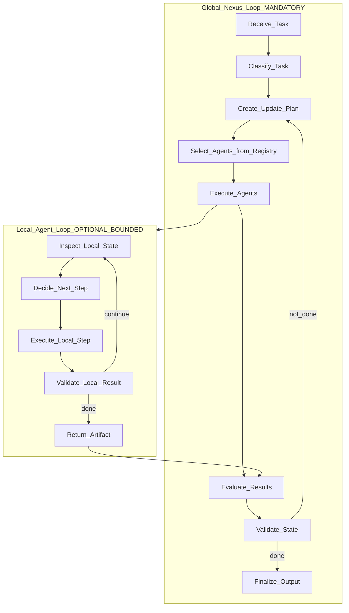
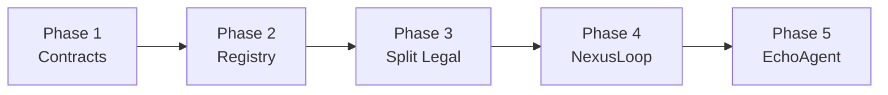

# Intergrax Implementation Gap Analysis

| Field | Value |
|-------|-------|
| **Status** | Architectural analysis · **§14–§16 live** · repo split complete (2026-05-27) |
| **Target (source of truth)** | [`intergrax_runtime_architecture.md`](intergrax_runtime_architecture.md) — Tier model §5.1, **Unified Execution Runtime §42** |
| **Documentation map** | [`README.md`](README.md) |
| **Scope** | Implementation vs. canonical spec |
| **Author** | Intergrax architectural analysis |

---

## Table of Contents

1. [Executive Summary](#1-executive-summary)
2. [Current Architecture Overview](#2-current-architecture-overview)
3. [Target Architecture Summary](#3-target-architecture-summary)
4. [Alignment Analysis](#4-alignment-analysis)
5. [Gap Analysis](#5-gap-analysis)
6. [Architectural Violations](#6-architectural-violations)
7. [Runtime Maturity Analysis](#7-runtime-maturity-analysis)
8. [Refactoring Recommendations](#8-refactoring-recommendations)
9. [Minimal Migration Plan](#9-minimal-migration-plan)
10. [Proposed Folder Structure](#10-proposed-folder-structure)
11. [Priority Order](#11-priority-order)
12. [Risks](#12-risks)
13. [Final Recommendation](#13-final-recommendation)
14. [Implementation Status (Phases A–C)](#14-implementation-status-phases-ac)
15. [§42 Unified Execution Runtime — Gap Matrix](#15-42-unified-execution-runtime--gap-matrix)
16. [§42 Implementation Roadmap (P4+)](#16-42-implementation-roadmap-p4)

---

**Reading guide:** §1–§13 describe the **baseline audit** (pre–Phase A). **§14–§16** are the **live implementation status**. Repo layout: `agents/legal` + `applications/legal_application` (legacy `applications/legal_agent/` removed).

---

### 1.1 Alignment with Target Architecture

**Overall score: ~82–88% (architecture §1–41) · ~50–55% (§42 Unified Execution Runtime)**

Intergrax has evolved from *"Nexus MVP + Legal Agent"* to a **multi-agent-capable runtime** (Phases A–C): NexusLoop, AgentRegistry, ExecutionGraph, TaskLifecycle, Research pipeline. The **§42 Unified Execution Runtime** (event-driven UAEP, hooks, governance) is **partially wired** — P4.1–P4.5 complete; Echo, Research, Summary, and Legal run through UAEP.

> **Note:** §1–§13 below describe the **baseline analysis** (pre-Phase A). Current status: §14–§16.

| Area | Score | Notes |
|------|-------|-------|
| Components / adapters layer (Layer 1) | **High (~75%)** | RAG, tools, LLM adapters, websearch, queueing, distributed |
| Nexus layer (Layer 2) | **Medium-high (~60%)** | Strong single-agent pipeline; missing global loop, registry, execution graph |
| Agents layer (Layer 3) | **Low (~30%)** | One agent in `applications/`; no `/agents/`; simplified contract |
| Application model (execution environments) | **Absent (~5%)** | `applications/` contains an agent, not an execution environment |
| Harness / experimentation | **Medium (~40%)** | Notebooks, EvalRunner, replay; missing scaffold, registry, experiment flow |

### 1.2 Top Architectural Issues (baseline — all resolved; see §14)

> **Resolved (2026-05-27):** Legal split, NexusLoop, registry, Echo/Research agents, shim removal.

1. ~~**Agents and applications conflated**~~ — was `applications/legal_agent/` monolith. **Now:** `agents/legal/` + `applications/legal_application/`.

2. ~~**Missing global Nexus loop and agent registry**~~ — **Now:** `NexusLoop`, `AgentRegistry`, `Task`, `TaskLifecycle`, `ExecutionGraph`.

3. ~~**Fat Agent in Legal**~~ — **Resolved (E.1 + E.4):** sequential and dynamic Legal expose UAEP step boundaries; loop phases in `legal_execution_loop`.

### 1.3 Most Important Missing Runtime Concepts

- **AgentRegistry + capability routing** (canon §15–16)
- **Global Nexus Loop** — task intake → classify → plan → select agent → execute → validate (§9.1, §41)
- **TaskLifecycle** and **Task** object (§23)
- **ExecutionGraph** for multi-agent tasks (§24)
- **AgentContract** (rich metadata) and **AgentExecutionResult** at the Agent→Nexus boundary (§12–14)
- **ShadowWorkspace** and **Sandbox** (§20–21)
- **Separation of `/agents` vs `/applications`** as logical layers

### 1.4 Migration Complexity

**Medium-high**, but **evolutionary** — does not require a full rewrite.

- **Preserve:** entire Nexus stack, RAG, tools, tracing, Legal Agent as reference implementation
- **Refactor:** folder structure, agent contract, registration, minimal global loop
- **Regression risk:** Legal tests in `agents/legal/tests/` and `applications/legal_application/legal_tests/`; gate suite `pytest tests/ -m gate`
- **Estimated P0 effort:** 2–4 weeks (contracts + registry + Legal split + minimal NexusLoop)

---

## 2. Current Architecture Overview

### 2.1 Repository Structure (current)

```text
intergrax/              # Tier-0/1 framework
agents/                 # Tier-2 capabilities (legal, echo, research, …)
applications/           # Tier-3 execution environments
  legal_application/    # Legal host + serving + legal_tests
  research_application/
tests/                  # Framework unit/integration tests
docs/
prompts/
notebooks/
infra/
tools/
```

### 2.1.1 Baseline snapshot (pre-migration, for audit trail)

```text
intergrax/           # Framework package Tier-0/1
applications/        # Was: legal_agent monolith only
tests/
docs/
...
```

The tier model is documented in [`intergrax_runtime_architecture.md`](intergrax_runtime_architecture.md) §5.1 and encoded in [`intergrax/agent_kit/tiers.py`](../intergrax/agent_kit/tiers.py):

```12:29:intergrax/agent_kit/tiers.py
class DeploymentTier(IntEnum):
    """
    Platform tier label—for logs, metrics, and product configuration.

    Aligned with ``docs/intergrax_runtime_architecture.md`` §5.1:

    - ``PLATFORM`` (0): Tier-0 — universal components (LLM, memory, adapters, …).
    - ``FRAMEWORK`` (1): Tier-1 — Nexus Agent OS (orchestration, registry, …).
    - ``AGENT`` (2): Tier-2 — concrete agent capability modules under ``agents/``.
    - ``APPLICATION`` (3): Tier-3 — ready-made environments under ``applications/``.
    """

    PLATFORM = 0
    FRAMEWORK = 1
    AGENT = 2
    APPLICATION = 3
```

> Historical three-layer doc: [`docs/archive/ARCHITECTURE.md`](../archive/ARCHITECTURE.md) (deprecated).

### 2.2 Current Layers

#### Layer 0 — Platform Capabilities

Informal infrastructure layer inside `intergrax/`:

| Module | Role | Key Files |
|--------|------|-----------|
| `rag/` | Full RAG stack (~130 files) | loaders, splitters, embedding, vectorstore, retrievers, rerankers, answers |
| `tools/` | Tool registry and executor | [`ToolRegistry`](intergrax/tools/registry.py), [`ToolExecutor`](intergrax/tools/tool_executor.py) |
| `llm_adapters/` | LLM provider adapters | [`LLMAdapterRegistry`](intergrax/llm_adapters/llm_provider_registry.py) |
| `websearch/` | Web search | [`WebSearchExecutor`](intergrax/websearch/service/websearch_executor.py) |
| `memory/` | Conversational memory, profiles | [`ConversationalMemory`](intergrax/memory/conversational_memory.py) |
| `queueing/` | Kafka, RabbitMQ, Celery | [`TaskExecutionRegistry`](intergrax/queueing/worker/registry.py) |
| `distributed/` | Redis KV, semaphores, rate limit | [`DistributedProviderRegistry`](intergrax/distributed/registry.py) |
| `prompts/` | YAML prompt registry | [`YamlPromptRegistry`](intergrax/prompts/registry/yaml_registry.py) |

#### Layer 1 — Nexus Runtime (Tier-1)

Central runtime in [`intergrax/runtime/nexus/`](intergrax/runtime/nexus/) (~121 files).

**Entry point:**

```97:113:intergrax/runtime/nexus/engine/runtime.py
    async def run(self, request: RuntimeRequest) -> RuntimeAnswer:
        """
        Main async entrypoint for the runtime.
        """

        if not request.tenant_id:
            raise ValueError("tenant_id must be provided in RuntimeRequest.")

        run_id = f"run_{uuid.uuid4().hex}"
        start_perf = time.perf_counter()

        state = RuntimeState(
            context=self.context,
            request=request,
            run_id=run_id,
            llm_usage_tracker=LLMUsageTracker(run_id=run_id),
        )
```

**Key classes:**

| Class | File | Role |
|-------|------|------|
| `RuntimeEngine` | `engine/runtime.py` | Main entry point — run lifecycle, retry, budget, trace finalize |
| `RuntimeContext` | `engine/runtime_context.py` | DI: session, RAG, websearch, tools, trace, governance |
| `RuntimeState` | `engine/runtime_state.py` | Mutable run state: session, flags, trace, `agent_state` |
| `RuntimeConfig` | `config.py` | Flags, LLM adapter, pipeline injection, budget |
| `PipelineFactory` | `pipelines/pipeline_factory.py` | Builds pipeline from `config.pipeline` or default `NoPlannerPipeline` |
| `PlanLoopController` | `planning/plan_loop_controller.py` | Plan→execute→replan loop inside planner pipelines |

**Pipelines:**

| Pipeline | File | Model |
|----------|------|-------|
| `NoPlannerPipeline` | `pipelines/no_planner_pipeline.py` | SETUP → RAG → memory → websearch → tools → CoreLLM → persist |
| `PlannerStaticPipeline` | `pipelines/planner_static_pipeline.py` | SETUP → `PlanLoopController.run_static()` |
| `PlannerDynamicPipeline` | `pipelines/planner_dynamic_pipeline.py` | SETUP → `PlanLoopController.run_dynamic()` |

**Runtime steps (Tier-1):** `RagStep`, `WebsearchStep`, `ToolsStep`, `CoreLLMStep`, `PersistAndBuildAnswerStep` + `SETUP_STEPS` in `runtime_steps/setup_steps_tool.py`.

**Runner:** `RuntimeStepRunner.execute_pipeline(steps, state)` in `runtime_steps/contract.py`.

#### Layer 2 — Agent Bridge (Tier-1→2)

```11:47:intergrax/agents/agent_contract.py
class Agent(ABC):
    """
    Tier-2 Agent contract.

    Agent is responsible for:
    - building RuntimeContext (including RuntimeConfig)
    - configuring pipeline via config.pipeline

    Agent is NOT responsible for:
    - RuntimeState
    - execution
    - lifecycle management
    """

    @abstractmethod
    def build_context(self, request: RuntimeRequest) -> RuntimeContext:
        ...

    async def run(self, request: RuntimeRequest) -> RuntimeAnswer:
        from intergrax.agents.agent_engine import AgentEngine
        return await AgentEngine.run_agent(self, request)
```

```12:47:intergrax/agents/agent_engine.py
class AgentEngine:
    """
    Thin orchestration layer (Tier-2 → Tier-1 bridge).
    ...
    """

    def __init__(self, agents: Dict[str, Agent]) -> None:
        self._agents = agents

    async def run(self, request: RuntimeRequest) -> RuntimeAnswer:
        agent_id = request.agent_id
        ...
        agent = self._agents.get(agent_id)
        ...
        return await AgentEngine.run_agent(agent, request)

    @staticmethod
    async def run_agent(agent: Agent, request: RuntimeRequest) -> RuntimeAnswer:
        context = agent.build_context(request)
        runtime = RuntimeEngine(context)
        return await runtime.run(request)
```

The folder [`intergrax/agents/`](intergrax/agents/) contains the **framework contract and engine**. Agent implementations live under repo-root [`agents/`](agents/) (e.g. `legal`, `echo`).

#### Layer 3 — Products (Tier-2)

**Single product (baseline):** was `applications/legal_agent/` (~114 files). **Current:** `agents/legal/` + `applications/legal_application/`.

<details>
<summary>Historical package layout (removed)</summary>

Package structure (import path was `legal_agent`):

```text
applications/legal_agent/   # REMOVED — use agents/legal + legal_application
├── legal_agent.py
├── domain/, steps/, pipeline/, …
├── host/, serving/
└── tests/
```

</details>

**Current canonical layout:**

```text
agents/legal/
├── legal_agent.py          # LegalAgent(Agent) — module file name, import as `legal`
├── domain/, pipeline/, steps/, …
└── tests/

applications/legal_application/
├── host/, serving/
└── legal_tests/
```

**Tier-1 ↔ Tier-2 boundary:** `intergrax` **does not import** `legal` (one-way dependency).

### 2.3 Current Orchestration Model

```mermaid
sequenceDiagram
    participant Client
    participant Host as LegalHost_FastAPI
    participant Svc as DefaultLegalAgentService
    participant AE as AgentEngine
    participant Agent as LegalAgent
    participant RE as RuntimeEngine
    participant Pipe as LegalDynamicPipeline
    participant Loop as LegalExecutionLoop

    Client->>Host: POST /legal/chat
    Host->>Svc: run_legal_chat()
    Svc->>AE: run(RuntimeRequest)
    AE->>Agent: build_context()
    AE->>RE: RuntimeEngine(context).run()
    RE->>Pipe: pipeline.run(state)
    Pipe->>Loop: run_legal_dynamic_execution_loop()
    Loop-->>Pipe: state.runtime_answer
    Pipe-->>RE: RuntimeAnswer
    RE-->>Client: RuntimeAnswer + trace_events
```

**Key observations (baseline; NexusLoop added in Phase A — see §14):**

1. **No global Nexus loop** — `AgentEngine` routes by `agent_id` from the request; no task classification or capability matching.
2. **PlanLoopController** handles plan→execute→replan **inside the Nexus pipeline** (STATIC/DYNAMIC planner), not global multi-agent orchestration.
3. **Legal Agent has its own orchestration loop** in `run_legal_dynamic_execution_loop()` — LLM routing, replanning, tool governance.
4. **Three parallel orchestration models:**
   - Nexus (`RuntimeEngine` + pipelines) — active, production
   - [`ChatAgent`](intergrax/chat_agent.py) — legacy LLM router + RAG/tools, outside `Agent` contract
   - [`Supervisor`](intergrax/supervisor/supervisor.py) — LangGraph-style multi-component, not integrated with Nexus

### 2.4 Agent Structure (current)

| Location | Contents | Canon Alignment |
|----------|----------|-----------------|
| `intergrax/agents/` | `Agent` contract, `AgentEngine` | Framework — OK |
| `agents/legal/` | Legal capability (`import legal`) | **ALIGNED** |
| `agents/echo/`, `agents/research/` | Reference / multi-agent capabilities | **ALIGNED** |
| `applications/legal_application/` | Host + serving only | **ALIGNED** |
| `intergrax/chat_agent.py` | Legacy chat agent | Deprecated |
| `intergrax/supervisor/` | Separate supervisor | Deprecated / alternate path |

Repo-root [`agents/`](agents/) holds Tier-2 implementations. Legacy `applications/legal_agent/` **removed**.

### 2.4.1 Baseline (pre-split)

| Location | Contents | Canon Alignment |
|----------|----------|-----------------|
| `applications/legal_agent/` | Agent + pipeline + host + serving monolith | **MISALIGNED** (removed) |

There was no `/agents/` folder at the repository root.

### 2.5 Application Structure (current)

`applications/` implements **execution environments**:

- `legal_application/` — FastAPI host, serving, `legal_tests/`
- `research_application/` — research host scaffold

Factory wiring (canonical):

```python
# applications/legal_application/host/factory.py
agent = build_legal_agent(settings)
mount_legal_agent_routes(app, agents={...}, ...)
```

NexusLoop integration in host is **partial** — Legal still uses direct `AgentEngine` path in places; global loop available for Echo/Research.

### 2.5.1 Baseline (pre-split)

The `applications/` folder did not implement the execution-environment concept — it contained a product monolith:

```22:70:applications/legal_agent/host/factory.py
def create_legal_backend_app(*, settings: Optional[LegalBackendSettings] = None) -> FastAPI:
    ...
    agent = build_legal_agent(settings)
    mount_legal_agent_routes(
        app,
        agents={settings.legal_default_agent_id: agent},
        default_agent_id=settings.legal_default_agent_id,
        ...
    )
```

Application = FastAPI host + agent wiring + HTTP routes. Missing:

- orchestration rules as a separate layer
- composition of multiple agents
- execution environment configuration independent of the agent

### 2.6 Integration Model

Integrations are organized per domain with their own registries:

| Registry | File | Status |
|----------|------|--------|
| `ToolRegistry` | `tools/registry.py` | EXISTS |
| `LLMAdapterRegistry` | `llm_adapters/llm_provider_registry.py` | EXISTS |
| `EmbeddingProviderRegistry` | `rag/embedding/registry/` | EXISTS |
| `RetrieverRegistry` | `rag/retrievers/registry/` | EXISTS |
| `RerankerRegistry` | `rag/rerankers/registry/` | EXISTS |
| `DocumentHandlerRegistry` | `rag/document_loaders/registry/` | EXISTS |
| `YamlPromptRegistry` | `prompts/registry/yaml_registry.py` | EXISTS |
| `TokenizerRegistry` | `tokenizers/registry/` | EXISTS |
| `TaskExecutionRegistry` | `queueing/worker/registry.py` | EXISTS (worker tasks, not agent tasks) |
| **`AdapterRegistry` (unified)** | — | **MISSING** |
| **`AgentRegistry`** | — | **MISSING** |

### 2.7 State Management

| Level | Object | Contents |
|-------|--------|----------|
| Runtime (Tier-1) | `RuntimeState` | session, history, flags, `tool_traces`, `trace_events`, `runtime_answer` |
| Agent (Tier-2) | `state.agent_state: AgentState` | e.g. `LegalAgentState` — clauses, decisions, metrics |
| API | `RunStore` / `RunResponse` | HTTP run status (`fastapi_core/runs/`) |
| Session | `ChatSession` via `SessionManager` | Message persistence (SQLite/in-memory) |

### 2.8 Execution Model

**Primary path (`RuntimeEngine.run()`):**

1. Validate `tenant_id`, generate `run_id`
2. Create `RuntimeState` + LLM tracker
3. Concurrency semaphore (optional)
4. `BudgetEnforcer` (optional)
5. `PipelineFactory.build_pipeline()`
6. Emit trace `run_start`
7. Retry loop (`max_run_retries`, `retry_run_on` error codes)
8. `asyncio.wait_for` if `runtime_timeout_ms`
9. Output contract validation (non-empty string)
10. Budget checks (LLM calls, tool calls, tokens, wall time)
11. HITL: `PolicyAbortError`, `BudgetExceededError` → `StopReason.NEEDS_USER_INPUT`
12. `finalize_llm_tracker`, `trace_writer.finalize_run`, `governance_service.evaluate`
13. Release semaphore

**Separate FastAPI runs path:**

[`DefaultRunService.create_run()`](intergrax/fastapi_core/runs/default_service.py) → `ExecutionAdapter.start_execution()` in background — lifecycle PENDING→RUNNING→COMPLETED via `RunStateMachine`. **Not unified** with `RuntimeEngine.run()`.

**Worker queue (separate path):**

`dispatcher` → `execute_logical_task()` with idempotency ledger.

### 2.9 Observability

| Component | File | Role |
|-----------|------|------|
| `TraceEvent`, `TraceComponent` | `tracing/trace_models.py` | Trace event model |
| `InMemoryRunTraceStore` | `tracing/in_memory_trace_store.py` | In-memory store |
| `SQLiteRunTraceStore` | `tracing/sqlite_run_trace_store.py` | SQLite store |
| `RunTraceWriter` | `tracing/persistence_models.py` | Run metadata persistence |
| `GovernanceService.evaluate()` | `runtime/governance/service.py` | Post-run governance |
| `EvalRunner` | `eval/eval_runner.py` | Evaluation on RuntimeEngine + replay |
| `ReplayEngine` | `runtime/replay/replay_engine.py` | Run reconstruction from trace |

Trace emission: `RuntimeState.trace_event(component, step, message, level, payload)`.

---

## 3. Target Architecture Summary

Summary based on [`intergrax_runtime_architecture.md`](intergrax_runtime_architecture.md).

### 3.1 Three Layers

```text
+--------------------------------------------------------------+
| LAYER 3 — AGENTS (bounded capability modules)                |
| ProblemRadarAgent, VendorDiscoveryAgent, LegalAgent, ...      |
+--------------------------------------------------------------+
| LAYER 2 — NEXUS RUNTIME (domain-agnostic orchestration)      |
| Global Loop, Task Lifecycle, Agent Router, Execution Graph,  |
| Context Manager, Validation, Retry, Sandbox, Tracing         |
+--------------------------------------------------------------+
| LAYER 1 — COMPONENTS / ADAPTERS (infrastructure)             |
| LLM, PostgreSQL, Redis, Vector Store, Slack, Browser, ...    |
+--------------------------------------------------------------+
```

#### Layer 1: Components / Adapters (§7.1, §17)

- Reusable technical integrations
- Expose operations through stable interfaces
- **MUST NOT:** orchestration, agent-specific business logic, agent routing decisions

#### Layer 2: Nexus Runtime (§7.2, §9–10)

Nexus is the **AI operating layer** — domain-agnostic.

**Owns:**

- Task Intake → normalize to `Task` object
- Task Classification (simple, single-agent, multi-agent, long-running, HITL, unsafe)
- Planning (steps, dependencies, agent assignments, validation criteria)
- Agent Selection (intent, registry, capabilities, cost, risk)
- Execution Graph (nodes, dependencies, statuses)
- State Management (global task state)
- Context Management (per-agent context decisions)
- Tool/Adapter Access Policy
- Validation (global completeness)
- Final Response (compose final answer)
- Observability, Retry, HITL, Sandbox, Shadow Workspace

**MUST NOT:** become Legal Agent, Vendor Agent, or Problem Radar Agent.

#### Layer 3: Agents (§7.3, §11–14)

Agents are **bounded capability modules** — reusable, portable, composable.

**Responsibilities:**

- Understand local task
- Use allowed tools
- Domain logic
- Structured output + local validation
- Report uncertainty and failures
- Return artifacts to Nexus

**NOT responsible for:** global orchestration, lifecycle, retry, cross-agent memory, bypassing Nexus.

### 3.2 Dual Loop Architecture (§9)



### 3.3 Applications vs Agents (Architectural Intent Extension)

The canonical document **does not explicitly define "Application"** as a separate layer, but the concept aligns with:

- §16 Capability Model — route to capabilities, not class names
- §43.5 — "Agents are capability modules, not independent products"
- §8.2 Experimentation First — laboratory, not SaaS

**Target model (project intent):**

| Concept | Location | Role |
|---------|----------|------|
| **Agent** | `/agents/<name>/` | Reusable capability module (LegalAgent, ResearchAgent) |
| **Application** | `/applications/<name>/` | Execution environment — composes agents, adapters, rules, orchestration config, host |

**Target example:**

```text
applications/problem_radar_application/
    → combines: SourceCollectionAgent, ClusteringAgent, PitchDeckAgent
    → adapters: VectorStorageAdapter, PostgreSQLAdapter
    → rules: orchestration topology, storage rules, reporting pipeline
    → host: FastAPI/CLI entry point
```

### 3.4 Canonical Experimentation Flow (§2, §35, §41)

```text
new idea
    → define agent capability
    → implement agent contract
    → register agent in Nexus
    → connect required adapters/tools
    → run experiment
    → observe traces, cost, quality, failures
    → validate or reject hypothesis
```

Minimal runtime flow (§41):

```text
1. User submits task
2. Nexus creates Task object
3. Nexus classifies task
4. Nexus creates simple plan
5. Nexus selects agent from registry
6. Nexus executes agent
7. Agent returns structured result
8. Nexus validates result
9. Nexus logs full trace
10. Nexus returns final response
```

### 3.5 Anti-patterns (§42)

| Anti-pattern | Description |
|--------------|-------------|
| Fat Agent (§42.1) | routing, global orchestration, scheduler, UI, platform state inside agent |
| Fat Nexus (§42.2) | domain-specific workflows inside Nexus |
| UI-Driven (§42.3) | runtime dependent on frontend |
| Prompt-Only (§42.4) | prompts without execution structures |
| Unobservable (§42.5) | steps without traces |
| Product Too Early (§42.6) | billing, marketplace before runtime validation |

---

## 4. Alignment Analysis

### 4.1 ALIGNED — Correctly Implemented Ideas

| Area | Code Evidence | Canon Section |
|------|---------------|---------------|
| Four-tier model | `agent_kit/tiers.py`, CANON §5.1 | §5.1, §6–7 |
| Nexus as OS for agents | `RuntimeEngine`, pipeline injection | §7.2, §8.1 |
| Pipeline as behavioral program | `RuntimeConfig.pipeline`, `PipelineFactory` | §8.4 (legacy path; UAEP in §42) |
| Agent builds context, does not execute | `Agent.build_context()` → `AgentEngine` → `RuntimeEngine` | §11 |
| ToolRegistry with schemas | `ToolRegistry`, `ToolContract` | §22 |
| LLM adapters with registry | `LLMAdapterRegistry` | §17 |
| Mandatory tracing | `TraceEvent`, `RunTraceWriter`, step diagnostics | §8.7, §33 |
| Budget enforcement | `BudgetEnforcer` | §10 |
| Retry engine | retry loop in `RuntimeEngine.run()` | §31 |
| HITL | `PolicyAbortError` → `StopReason.NEEDS_USER_INPUT` | §32 |
| Tier separation | PRODUCT outside `intergrax` package | §8.2 |
| Post-run governance | `GovernanceService.evaluate()` | §10 |
| Eval + replay | `EvalRunner`, `ReplayEngine` | §34 |
| Prompt registry (YAML) | `YamlPromptRegistry` | §39.7 |
| Idempotent tool invocation | `IdempotentToolInvoker` | §22 |

### 4.2 PARTIALLY ALIGNED — Partially Compliant Modules

| Module | What Works | What's Missing |
|--------|-----------|----------------|
| `Agent` contract | `build_context()`, delegation to `AgentEngine` | No `get_contract()`, `can_handle()`, `validate()`, rich metadata (§12–13) |
| Local agent loop | `run_legal_dynamic_execution_loop()` — bounded replan | No contract metadata (max_steps, max_cost); orchestration leak (routing in agent) |
| `PlanLoopController` | plan→execute→replan in pipeline | Pipeline loop, not global Nexus task loop |
| `AgentExecutionResult` | Exists in `tools_agent.py` for ToolsAgent | No canonical result at Tier-2 Agent→Nexus boundary (§14) |
| `RuntimeContext` | DI, context builders, memory steps | No formal `ContextManager` with context distribution policy (§28) |
| Tracing | Rich `TraceEvent` model, SQLite store | No unified `TraceLogger` API; no task-level trace (run-level only) |
| FastAPI hosting | `create_app()`, legal routes, auth | Two lifecycles (RunService vs RuntimeEngine) |
| RAG stack | Full, modular, with registries | No unified AdapterRegistry facade |
| Pipeline-first era (archived) | `docs/archive/agent_factory.md` | Superseded by AgentEngine / UAEP (§42) |
| `AgentState` marker | `state.agent_state: AgentState` opaque to Nexus | No standard output schema per agent |

### 4.3 MISALIGNED — Non-compliant with Canon (baseline; many resolved in §14)

| Problem | Evidence | Status |
|---------|----------|--------|
| Agent in `applications/` | was `applications/legal_agent/` | **Resolved** → `agents/legal/` |
| No `/agents/` root | was missing | **Resolved** |
| No AgentRegistry | was ad hoc `agents={...}` | **Resolved** |
| No global Nexus Loop | was missing | **Resolved** — `NexusLoop` |
| No Task/ExecutionGraph | was missing | **Resolved** |
| Fat Agent (Legal) | routing in `legal_execution_loop.py` | **Partial** — Phase E / P4.2 |
| Legacy ChatAgent / Supervisor | separate stacks | Deprecated |
| No capability routing | No `can_handle()`, `CapabilityMatchResult` | §16 |
| No structured agent output | `RuntimeAnswer` is string + metadata, not `AgentExecutionResult` | §14, §39.5 |

### 4.4 Promising Foundations to Reuse

1. **Entire Nexus stack** — pipeline, steps, planning, budget, retry, trace — ready as execution engine in global loop
2. **Legal Agent** — complete reference implementation with governance, serving, tests — refactor, don't discard
3. **Registry pattern** — 10+ existing registries (tools, LLM, RAG, prompts) — pattern for `AgentRegistry`
4. **EvalRunner + ReplayEngine** — harness AI foundation for experiment evaluation
5. **DeploymentTier** — clear Tier-0/1/2 separation
6. **Notebooks** — `notebooks/nexus/` — existing experimentation environment

---

## 5. Gap Analysis

### 5.1 Runtime Primitives Table

| Primitive | Status | Role | Target Location | Current Equivalent |
|-----------|--------|------|-----------------|-------------------|
| **AgentContract** (rich) | **MISSING** | Agent metadata: capabilities, schemas, limits, risk | `intergrax/contracts/agent_contract.py` | Simplified `Agent(ABC)` with `build_context()` only |
| **AgentRegistry** | **MISSING** | Discovery, agent selection, capability lookup | `intergrax/runtime/registry/agent_registry.py` | Ad hoc `Dict[str, Agent]` in `AgentEngine` |
| **ToolRegistry** | **EXISTS** | Tool registry with schemas | `intergrax/tools/registry.py` | Full implementation |
| **AdapterRegistry** | **PARTIAL** | Unified adapter facade | `intergrax/adapters/registry.py` | Per-domain registries (LLM, RAG, websearch) |
| **ExecutionGraph** | **MISSING** | Multi-agent node graph with dependencies | `intergrax/runtime/orchestration/execution_graph.py` | — |
| **TaskLifecycle** | **MISSING** | Explicit task state machine | `intergrax/runtime/task/task_lifecycle.py` | — |
| **Task / TaskState / TaskContext** | **MISSING** | Task object with input, plan, status | `intergrax/runtime/task/task.py` | `RuntimeRequest` (simplified) |
| **ValidationResult** | **MISSING** | Agent output validation result | `intergrax/contracts/validation.py` | Output validation = non-empty string in RuntimeEngine |
| **AgentExecutionResult** | **MISSING** (canonical) | Structured agent→Nexus result | `intergrax/contracts/agent_execution_result.py` | `AgentExecutionResult` in `tools_agent.py` (different scope) |
| **TraceLogger** | **PARTIAL** | Unified trace API | extend `runtime/nexus/tracing/` | `RunTraceWriter`, `TraceEvent`, step diagnostics |
| **ShadowWorkspace** | **MISSING** | Isolated temporary workspace | `intergrax/runtime/workspace/shadow_workspace.py` | — |
| **SandboxRuntime** | **MISSING** | Controlled execution environment | `intergrax/runtime/sandbox/` | — |
| **ContextManager** | **PARTIAL** | Per-agent context distribution policy | `intergrax/runtime/context/context_manager.py` | `RuntimeContext`, `ContextBuilder`, memory steps |
| **Global Nexus Loop** | **MISSING** | Global task orchestration loop | `intergrax/runtime/nexus/nexus_loop.py` | `RuntimeEngine.run()` (single-agent) |
| **Local Agent Loop** | **PARTIAL** | Bounded loop inside agent | in agent implementations | `run_legal_dynamic_execution_loop()`, `PlanLoopController` |
| **Capability Routing** | **MISSING** | Route to capabilities, not class names | AgentRegistry + NexusLoop | Hardcoded `agent_id` in request |
| **Structured Output Contracts** | **PARTIAL** | Per-agent output schemas | per-agent in `/agents/` | Pydantic models in Legal domain only |
| **NexusRuntime** | **PARTIAL** | Canonical runtime name | — | `RuntimeEngine` (functionally similar, semantically different) |
| **TaskClassifier** | **MISSING** | Task classification | `intergrax/runtime/nexus/task_classifier.py` | — |
| **AgentRouter** | **MISSING** | Agent selection from registry | `intergrax/runtime/nexus/agent_router.py` | — |
| **CapabilityMatchResult** | **MISSING** | Capability match result | `intergrax/contracts/capability.py` | — |

### 5.2 Key Gap Details

#### AgentContract (§12) — MISSING

**Why it matters:** The canon requires rich metadata per agent — capabilities, input/output schema, limits, risk level. Without this, Nexus cannot route, validate, or enforce policies.

**Current state:** `Agent(ABC)` has only `build_context()` and `run()`.

**Role:** Declarative contract — agent describes *what it can do*; Nexus decides *when to use it*.

#### AgentRegistry (§15) — MISSING

**Why it matters:** "Nexus MUST use the registry for agent selection. Agents MUST NOT be hardcoded into Nexus logic" (§15).

**Current state (baseline):** was ad hoc in host factory. **Now:** `AgentRegistry` + `applications/legal_application/host/factory.py`.

**Role:** Central agent registry with capabilities, status, cost/risk profile. Enables dynamic selection and agent replacement.

#### Global Nexus Loop (§9.1) — **Done** (was MISSING)

**Why it matters:** Mandatory global loop — without it, Intergrax is a single-agent chat runtime, not an AI OS.

**Current state:** `NexusLoop.handle_task()` — classify → plan → graph → validate. Legal host may still use direct `AgentEngine` path.

**Role:** Multi-agent orchestration, retry strategy, HITL coordination, final response composition.

#### ExecutionGraph (§24) — **Done** (was MISSING)

**Why it matters:** Complex tasks require a node graph with dependencies, parallel branches, and status tracking.

**Current state:** `ExecutionGraph`, `GraphExecutor` in `intergrax/runtime/nexus/execution/`.

**Role:** Execution plan representation with nodes, assigned agents, validation results, retry counts.

#### TaskLifecycle (§23) — **Done** (was MISSING)

**Why it matters:** Explicit states: created → classified → planned → running → validating → completed (+ failure states). Every transition MUST be logged.

**Current state:** `TaskLifecycle` + `TaskTraceEmitter` in `intergrax/runtime/task/`.

**Role:** Unified task state machine covering the full flow from intake to final response.

#### ShadowWorkspace (§20) — MISSING

**Why it matters:** Isolated temporary workspace for experiments (code, documents, vendor research) without modifying the main environment.

**Current state:** No implementation.

**Role:** Isolation, temporary storage, reproducibility, rollback, cleanup.

#### AgentExecutionResult (§14) — MISSING (canonical)

**Why it matters:** Structured result inspectable by Nexus and humans — artifacts, evidence, confidence, warnings, cost, duration.

**Current state:** `RuntimeAnswer` contains string answer + metadata. `AgentExecutionResult` exists only in `tools_agent.py` for the tools sub-agent.

**Role:** Standard result contract at the Agent→Nexus boundary.

---

## 6. Architectural Violations

### 6.1 Applications Acting as Agents

**Violation:** The entire `applications/legal_agent/` package is a product monolith containing agent, pipeline, steps, domain, host, serving, governance, and tracing.

**Evidence:**

```21:72:applications/legal_agent/legal_agent.py
class LegalAgent(Agent):
    """
    Real business agent: contract analysis.
    """
    ...
    def build_context(self, request: RuntimeRequest) -> RuntimeContext:
        ...
        if cfg.enable_sequential_legal_pipeline:
            runtime_config.pipeline = LegalAnalysisPipeline(config=cfg)
        else:
            runtime_config.pipeline = LegalDynamicPipeline(config=cfg)
```

**Expected:** `LegalAgent` in `/agents/legal/`; `applications/legal_application/` as execution environment composing the agent with adapters and host.

### 6.2 Orchestration Logic Inside Agents

**Violation:** Fat Agent — LLM routing, replanning, tool governance in the product layer.

**Evidence:**

```89:147:applications/legal_agent/pipeline/legal_execution_loop.py
async def run_legal_dynamic_execution_loop(
    *,
    state: RuntimeState,
    agent_state: LegalAgentState,
    config: LegalAgentConfig,
) -> None:
    ...
    tool_plan = await decide_legal_tool_plan(state=state, legal_config=config)
    tool_plan = enforce_legal_tool_plan_governance(...)
    ...
    await run_legal_tool_runtime_bridge(state=state, plan=tool_plan)
    ...
    routing = await LegalPipelineRouting.obtain_initial(...)
    ...
    for iteration in range(max_iter):
        stage_runners = LegalPipelineRouting.build_step_runners(...)
```

**Violated rule:** §42.1 Fat Agent — routing, global orchestration inside agent.

**Note:** Part of this logic (stage routing, replan) is a **local agent loop** (§9.2) and is acceptable *if* bounded by contract. Problem: no formal limits and mixing with Nexus tool orchestration.

### 6.3 Agent Bypassing Nexus Abstraction

**Violation:** Legal Agent directly instantiates Tier-1 Nexus steps, bypassing runtime abstraction.

**Evidence:**

```22:56:applications/legal_agent/runtime/legal_tool_runtime_bridge.py
async def run_legal_tool_runtime_bridge(
    *,
    state: RuntimeState,
    plan: LegalToolPlan,
) -> None:
    ...
    if plan.use_rag:
        if cfg.enable_rag:
            await RagStep().run(state)
    ...
    if plan.use_websearch:
        ...
            await WebsearchStep().run(state)
    ...
    if plan.use_tools:
        ...
            await ToolsStep().run(state)
```

**Violated rule:** §39.1 — layer boundaries. Agent should declare tool *need* via contract; Nexus/runtime should execute via Tool Runtime.

### 6.4 Hardcoded Agent Registration

**Violation:** No registry — agents registered ad hoc in the host.

**Evidence:**

```63:70:applications/legal_agent/host/factory.py
    agent = build_legal_agent(settings)
    mount_legal_agent_routes(
        app,
        agents={settings.legal_default_agent_id: agent},
        default_agent_id=settings.legal_default_agent_id,
        ...
    )
```

**Violated rule:** §15, §39.2 — "Agents MUST NOT be hardcoded into Nexus logic."

### 6.5 Parallel Orchestration Stacks

**Violation:** Three unintegrated orchestration models.

| Stack | File | Problem |
|-------|------|---------|
| Nexus | `runtime/nexus/engine/runtime.py` | Active, production |
| ChatAgent | `intergrax/chat_agent.py` | Legacy LLM router + RAG/tools, outside `Agent` contract and Nexus |
| Supervisor | `intergrax/supervisor/supervisor.py` | Separate `PipelineState` / `Component` model, ~859 lines, unused by Nexus |

**Violated rule:** §9.3, §39.4 — "Every agent runnable through Nexus."

### 6.6 RuntimeEngine Positioned as Chat Engine

**Violation:** Runtime semantics as chatbot, not task orchestrator.

**Evidence:**

```61:83:intergrax/runtime/nexus/engine/runtime.py
class RuntimeEngine:
    """
    High-level conversational runtime for the Intergrax framework.

    This class is designed to behave like a ChatGPT/Claude-style engine,
    but fully powered by Intergrax components (LLM adapters, RAG, web search,
    tools, memory, etc.).
    ...
    """
```

**Violated rule:** §7.2 — Nexus as AI operating layer, not chatbot.

### 6.7 Missing Structured Agent Output at Boundary

**Violation:** No `AgentExecutionResult` and `ValidationResult` at the Agent→Nexus boundary.

**Evidence:** `RuntimeAnswer` in [`response_schema.py`](intergrax/runtime/nexus/responses/response_schema.py) contains `answer: str`, citations, route_info, trace_events — but not structured_data, artifacts, evidence, confidence per §14.

**Violated rule:** §14, §39.5 — "Every agent must produce structured output."

### 6.8 Dual Run Lifecycle

**Violation:** Two independent run lifecycles.

| Path | Lifecycle | File |
|------|-----------|------|
| RuntimeEngine | run_start → pipeline → finalize_run | `engine/runtime.py` |
| FastAPI RunService | PENDING → RUNNING → COMPLETED/FAILED | `fastapi_core/runs/default_service.py` |
| Worker queue | dispatcher → execute_logical_task | `queueing/worker/dispatcher.py` |

**Violated rule:** §23 — explicit task lifecycle with logged transitions.

### 6.9 Missing `/agents/` — **Resolved**

**Was:** Agents treated as applications in `applications/legal_agent/`.

**Now:** `agents/legal/` + `applications/legal_application/` (host/serving only).

---

## 7. Runtime Maturity Analysis

### 7.1 Runtime Layer Maturity

| Aspect | Score (1–10) | Notes |
|--------|-------------|-------|
| Single-agent pipeline execution | **8/10** | Pipeline, steps, runner, factory — solid |
| Planning (STATIC/DYNAMIC) | **7/10** | PlanLoopController, EnginePlanner, StepExecutor |
| Budget & retry | **8/10** | BudgetEnforcer, retry loop, timeout |
| Tracing & observability | **7/10** | TraceEvent, SQLite store, step diagnostics, replay |
| Tool runtime | **7/10** | ToolRegistry, RuntimeToolInvoker, idempotency |
| Memory & session | **6/10** | SessionManager, ConversationalMemory, profile steps |
| Governance | **6/10** | GovernanceService, Legal governance ports |
| Multi-agent orchestration | **1/10** | No registry, router, execution graph |
| Task lifecycle | **2/10** | Run-level only, no Task object |
| Agent experimentation harness | **4/10** | Notebooks, EvalRunner; no scaffold, registry |
| **Overall runtime maturity** | **6/10** | Strong single-agent, weak multi-agent/harness |

### 7.2 Does Intergrax Behave Like Harness AI?

**Partially.**

**What works as a harness:**

- Notebooks (`notebooks/nexus/`) for interactive runtime exploration
- `EvalRunner` — automated case evaluation on RuntimeEngine
- `ReplayEngine` — run reconstruction from trace store
- `DeterministicRuntimeHarness` (testing_support) — controlled runtime tests
- Trace store (SQLite) — inspectable execution history
- Pipeline injection — fast behavioral program swap

**What blocks the harness:**

- No new-agent scaffold — must copy `legal_agent/` (~114 files)
- No AgentRegistry — cannot "register agent in Nexus" (§2 workflow)
- No experiment lifecycle — no keep/improve/pause/delete flow (§35)
- No unified Task object — every run is a `RuntimeRequest`, not a `Task`
- No internal debug UI/CLI on trace store (§19)
- High setup cost for new agents — config, pipeline, steps, host, serving, tests

### 7.3 Experimentation Speed Blockers

| Blocker | Impact | Solution |
|---------|--------|----------|
| No `/agents/` scaffold | **High** — copy legal_agent | Agent template + `/agents/` folder |
| No AgentRegistry | **High** — ad hoc wiring | AgentRegistry + register API |
| No NexusLoop | **Medium** — manual agent selection | Minimal NexusLoop wrapper |
| Fat Agent pattern | **Medium** — new agents replicate complexity | Thin agent + runtime primitives |
| Dual orchestration stacks | **Low** — confusion, dead code | Deprecate ChatAgent, Supervisor |
| No structured output contract | **Medium** — hard evaluation | AgentExecutionResult |
| Import path `legal_agent` | **Low** — monorepo scaling | Namespaced imports |

---

## 8. Refactoring Recommendations

> **Note:** These are refactoring directions, **not implementation**.

### 8.1 Layer Separation — Agents vs Applications

**Direction:** Extract capability code from `applications/legal_agent/` to `agents/legal/`.

| Move to `agents/legal/` | Keep in `applications/legal_application/` |
|-------------------------|------------------------------------------|
| `LegalAgent` class | Host (`main.py`, `factory.py`) |
| `domain/` (LegalAgentState, models) | Settings, env config |
| `steps/` (LegalBaseStep, all steps) | Wiring (build agent from settings) |
| `pipeline/` (LegalDynamicPipeline, routing) | FastAPI routes mount |
| `prompts/` (legal-specific) | Orchestration config (which agents, rules) |
| `governance/` (domain ports) | CORS, auth, API prefix |
| `memory/` (legal_memory_policy) | Product profile selection |
| `runtime/` (tool bridge → extract to runtime primitive) | |
| `tracing/` (legal diagnostics) | |

### 8.2 Runtime Extraction — Rich AgentContract

**Direction:** Extend `Agent` contract with metadata without breaking changes.

```text
# Current (keep):
Agent.build_context(request) -> RuntimeContext
Agent.run(request) -> RuntimeAnswer

# Add (new):
Agent.get_contract() -> AgentContract
Agent.can_handle(task_context) -> CapabilityMatchResult  # optional, default None
Agent.validate(output, context) -> ValidationResult       # optional, default pass
```

`AgentContract` as Pydantic model with §12 fields: id, name, capabilities, input_schema, output_schema, allowed_tools, limits, risk_level.

### 8.3 AgentRegistry

**Direction:** Central registry in `intergrax/runtime/registry/agent_registry.py`.

```text
AgentRegistry:
    register(agent: Agent) -> None
    get(agent_id: str) -> Agent
    list_agents() -> List[AgentContract]
    find_by_capability(capability: str) -> List[Agent]
    find_best_match(task_context) -> Optional[Agent]
```

Integrate with existing `AgentEngine` — registry as backend for `AgentEngine._agents`.

### 8.4 Minimal NexusLoop

**Direction:** Wrapper over `AgentEngine` implementing §41 minimal flow.

```text
NexusLoop:
    async def handle_task(task: Task) -> TaskResult:
        1. classify(task)
        2. select_agent(task, registry)
        3. build RuntimeRequest from Task
        4. result = await AgentEngine.run(request)
        5. validate(result)
        6. log trace
        7. return TaskResult
```

No ExecutionGraph initially — sequential single-agent only.

### 8.5 Tool Runtime Bridge Extraction

**Direction:** Extract `run_legal_tool_runtime_bridge()` into a runtime primitive.

```text
# Instead of agent direct-call RagStep/ToolsStep/WebsearchStep:
ToolRuntime.invoke(plan: ToolPlan, state: RuntimeState) -> ToolRuntimeResult
```

Agent declares need via `AgentContract.allowed_tools`; Nexus/runtime executes via ToolRuntime.

### 8.6 Deprecate Parallel Orchestration Stacks

| Stack | Action |
|-------|--------|
| `ChatAgent` | Mark deprecated; migrate to Nexus NoPlannerPipeline |
| `Supervisor` | Evaluate: integrate as Nexus multi-agent planner OR archive |
| `chains/` (LangChain QA) | Archive — legacy |

### 8.7 Unified Run Lifecycle

**Direction:** `TaskLifecycle` as wrapper over existing lifecycles.

```text
TaskLifecycle:
    created → classified → planned → running → validating → completed
    # Maps to: RunStateMachine states + RuntimeEngine run phases
```

### 8.8 Adapter Standardization

**Direction:** Unified `AdapterRegistry` facade over existing per-domain registries.

```text
AdapterRegistry:
    register_adapter(type: str, adapter: AdapterContract)
    get_adapter(type: str) -> AdapterContract
    list_adapters() -> List[AdapterContract]
```

---

## 9. Minimal Migration Plan

**Principle: evolve, not rewrite. Preserve Legal Agent as reference.**



### Phase 1: Rich AgentContract + AgentExecutionResult (Backward Compatible)

**Goal:** Add contract metadata without changing execution path.

**Steps:**

1. Create `intergrax/contracts/agent_contract_meta.py` — Pydantic `AgentContract` with §12 fields
2. Create `intergrax/contracts/agent_execution_result.py` — canonical `AgentExecutionResult` §14
3. Create `intergrax/contracts/validation.py` — `ValidationResult`
4. Add optional `get_contract()` to `Agent(ABC)` with default `NotImplementedError`
5. Implement `LegalAgent.get_contract()` with capability: `legal.contract_review`

**Risk:** Low — additive only, zero breaking changes.

**Validation:** Unit tests for contracts; Legal Agent still passes existing tests.

### Phase 2: AgentRegistry

**Goal:** Central agent registry.

**Steps:**

1. Create `intergrax/runtime/registry/agent_registry.py`
2. Refactor `AgentEngine` — optionally accept `AgentRegistry` instead of `Dict`
3. Register Legal Agent in registry
4. Create placeholder `EchoAgent` in `agents/echo/`

**Risk:** Low — `AgentEngine(agents={...})` still works (backward compat).

**Validation:** Registry lookup test; Legal host uses registry instead of dict.

### Phase 3: Split Legal — Agent vs Application — **Done**

**Goal:** Separate capability code from execution environment.

**Steps (completed):**

1. `agents/legal/` — capability module (`import legal`)
2. `applications/legal_application/` — host + serving only
3. Legacy `applications/legal_agent/` shim **removed** (2026-05-27)
4. Import paths: `legal`, `legal_application` (not `legal_agent` package)

**Risk:** **Medium** — breaking import paths, ~50+ test files to update.

**Validation:** Full Legal Agent test suite passes; host starts.

### Phase 4: Minimal NexusLoop

**Goal:** Global task orchestration loop (§41 minimal flow).

**Steps:**

1. Create `intergrax/runtime/task/task.py` — `Task`, `TaskState`, `TaskContext`
2. Create `intergrax/runtime/nexus/nexus_loop.py` — minimal loop
3. Create `intergrax/runtime/nexus/task_classifier.py` — simple classifier (single-agent default)
4. Wire: `NexusLoop` → `AgentRegistry` → `AgentEngine` → `RuntimeEngine`
5. Legal application host uses `NexusLoop.handle_task()` instead of direct `AgentEngine.run()`

**Risk:** Medium — new execution path, but old path still available.

**Validation:** Notebook demonstrating §41 flow; Legal Agent via NexusLoop.

### Phase 5: EchoAgent + Experiment Validation

**Goal:** Validate full experimentation flow.

**Steps:**

1. `agents/echo/echo_agent.py` — minimal agent (echo input → structured output)
2. Register in AgentRegistry
3. Notebook: task → NexusLoop → EchoAgent → trace → validate
4. Document experiment workflow in `docs/experiment_guide.md`

**Risk:** Low — new agent, zero impact on existing.

**Validation:** End-to-end experiment flow works; trace inspectable.

---

## 10. Proposed Folder Structure

### 10.1 Target Structure

```text
intergrax/                          # Framework Tier-0/1
├── contracts/                      # NEW — shared contracts
│   ├── agent_contract_meta.py      # AgentContract (rich metadata)
│   ├── agent_execution_result.py   # AgentExecutionResult (canonical)
│   ├── validation.py               # ValidationResult
│   ├── capability.py               # CapabilityMatchResult
│   └── task.py                     # Task, TaskState, TaskContext (models)
├── agents/                         # Framework agent bridge (EXISTING)
│   ├── agent_contract.py           # Agent(ABC) — extended
│   └── agent_engine.py             # AgentEngine — with registry support
├── adapters/                       # NEW — unified adapter facade
│   └── registry.py                 # AdapterRegistry
├── runtime/
│   ├── nexus/                      # EXISTING — RuntimeEngine, pipelines, steps
│   │   ├── nexus_loop.py           # NEW — Global Nexus Loop
│   │   ├── task_classifier.py      # NEW
│   │   └── agent_router.py         # NEW
│   ├── registry/                   # NEW
│   │   └── agent_registry.py       # AgentRegistry
│   ├── orchestration/              # NEW (future)
│   │   └── execution_graph.py
│   ├── task/                       # NEW
│   │   └── task_lifecycle.py
│   ├── workspace/                  # NEW (future)
│   │   └── shadow_workspace.py
│   ├── sandbox/                    # NEW (future)
│   ├── governance/                 # EXISTING
│   ├── replay/                     # EXISTING
│   └── transport/                  # EXISTING
├── rag/                            # EXISTING — Layer 1
├── tools/                          # EXISTING — Layer 1
├── llm_adapters/                   # EXISTING — Layer 1
├── websearch/                      # EXISTING — Layer 1
├── memory/                         # EXISTING — Layer 1
├── fastapi_core/                   # EXISTING — Layer 1
├── eval/                           # EXISTING
└── agent_kit/                      # EXISTING

agents/                             # NEW — Reusable capability modules (root)
├── legal/                          # MOVED from applications/
│   ├── legal_agent.py
│   ├── domain/
│   ├── steps/
│   ├── pipeline/
│   ├── prompts/
│   ├── governance/
│   ├── memory/
│   ├── runtime/
│   └── tracing/
├── echo/                           # NEW — minimal validation agent
│   └── echo_agent.py
└── research/                       # NEW (future prototype)
    └── research_agent.py

applications/                       # Execution environments
├── legal_application/              # RENAMED from legal_agent/
│   ├── host/                       # main.py, factory.py, wiring.py, settings.py
│   ├── serving/                    # FastAPI routes
│   └── config/                     # env-level config only
└── problem_radar_application/      # FUTURE
    ├── host/
    ├── config/
    └── orchestration.yaml          # which agents, rules, topology

docs/
├── README.md                               # Documentation map (entry point)
├── intergrax_runtime_architecture.md       # Canonical spec
├── INTERGRAX_IMPLEMENTATION_PLAN.md
├── INTERGRAX_IMPLEMENTATION_GAP_ANALYSIS.md  # This document
├── experiment_guide.md
├── key_components/                         # Product ideas (non-normative)
└── archive/                                # Deprecated historical docs

notebooks/
├── nexus/                          # EXISTING
└── experiments/                    # NEW — experiment notebooks
```

### 10.2 Folder Responsibilities

| Folder | Layer | Responsibility | Must NOT Contain |
|--------|-------|----------------|------------------|
| `intergrax/contracts/` | Framework | Shared type definitions, schemas | Business logic |
| `intergrax/agents/` | Framework | Agent ABC, AgentEngine bridge | Agent implementations |
| `intergrax/runtime/nexus/` | Nexus | RuntimeEngine, pipelines, steps, planning | Domain logic |
| `intergrax/runtime/registry/` | Nexus | AgentRegistry, discovery | Agent implementations |
| `intergrax/runtime/orchestration/` | Nexus | NexusLoop, ExecutionGraph | Agent logic |
| `intergrax/adapters/` | Layer 1 | Unified adapter facade | Orchestration |
| `intergrax/rag/`, `tools/`, etc. | Layer 1 | Infrastructure capabilities | Business logic |
| `agents/<name>/` | Layer 3 | Reusable agent capability module | Host, serving, env config |
| `applications/<name>/` | Environment | Execution config, host, wiring | Agent domain logic |

---

## 11. Priority Order

### P0 — Absolutely Required Runtime Primitives

| # | Element | Rationale |
|---|---------|-----------|
| 1 | **AgentContract** (rich metadata) | Foundation for routing and validation |
| 2 | **AgentRegistry** | "Register agent in Nexus" — core harness workflow |
| 3 | **Split Legal: agent → `/agents/legal/`** | Fix fundamental agents/applications violation |
| 4 | **Minimal NexusLoop** | Global loop — without it, this is not an AI OS |
| 5 | **EchoAgent** | Validation agent — cheap end-to-end flow test |

### P1 — Required for Stable Experimentation

| # | Element | Rationale |
|---|---------|-----------|
| 6 | **TaskLifecycle** + Task object | Explicit states, logged transitions |
| 7 | **AgentExecutionResult** (canonical) | Structured output at Agent→Nexus boundary |
| 8 | **Capability routing** (`can_handle()`) | Route to capabilities, not class names |
| 9 | **Unified run lifecycle** | Single lifecycle: Task + Run + Worker |
| 10 | **Agent scaffold template** | Fast creation of new agents |
| 11 | **ToolRuntime primitive** | Extract tool bridge from Legal |
| 12 | **Deprecate ChatAgent** | Eliminate dual orchestration |

### P2 — Useful After Runtime Stabilization

| # | Element | Rationale |
|---|---------|-----------|
| 13 | **ExecutionGraph** | Multi-agent tasks with dependencies |
| 14 | **ContextManager** (formalized) | Per-agent context distribution policy |
| 15 | **ShadowWorkspace** | Isolated experiments |
| 16 | **AdapterRegistry** (unified facade) | Simplified integrations |
| 17 | **Internal debug UI/CLI** | Observability surface (§19) |
| 18 | **Experiment lifecycle** | keep/improve/pause/delete flow |
| 19 | **Supervisor integration or archive** | Cleanup dead orchestration path |

### P3 — Future Evolution Only

| # | Element | Rationale |
|---|---------|-----------|
| 20 | **Sandbox** | Controlled execution for risky ops |
| 21 | **Multi-agent parallel execution** | §25 parallel mode |
| 22 | **Slack/Teams adapters** | §18 interaction surfaces |
| 23 | **Long-running task support** | §26 persistent state, resumability |
| 24 | **Agent marketplace** | §49 future evolution |
| 25 | **Multi-tenancy / billing** | §42.6 — NOT now |

---

## 12. Risks

### 12.1 Overengineering

**Risk:** Building ExecutionGraph, ShadowWorkspace, Sandbox before the first multi-agent experiment.

**Mitigation:** P0 = minimal NexusLoop (single-agent sequential). ExecutionGraph only when a real multi-agent use case appears.

### 12.2 Premature Abstractions

**Risk:** Creating `AdapterRegistry` facade when per-domain registries work well.

**Mitigation:** AdapterRegistry in P2 — AgentRegistry first (P0).

### 12.3 Monolithic Nexus

**Risk:** PlanLoopController + NexusLoop + TaskClassifier = growing monolith in `runtime/nexus/`.

**Mitigation:** NexusLoop as thin wrapper; clear boundaries between task-level and pipeline-level orchestration.

### 12.4 Fat Agent Pattern Replication

**Risk:** New agents copy Legal Agent pattern (routing, replan, tool bridge inside agent).

**Mitigation:** Agent scaffold template with thin agent pattern; ToolRuntime primitive; anti-pattern documentation.

### 12.5 Insufficient Observability

**Risk:** NexusLoop adds a new layer without trace coverage.

**Mitigation:** Every TaskLifecycle transition MUST emit TraceEvent (§23). Test: trace inspectable end-to-end.

### 12.6 Hidden Coupling — **Resolved**

**Was:** Import path `legal_agent` → `agents.legal` breaks tests, notebooks, host.

**Resolution:** Shim removed; canonical imports `legal` + `legal_application`. No `import legal_agent`.

### 12.7 Runtime Instability

**Risk:** NexusLoop changes Legal Agent production execution path.

**Mitigation:** Feature flag; old path (`AgentEngine.run()`) available; gradual migration.

### 12.8 Experimentation Slowdown

**Risk:** Phase 3 (split Legal) blocks development for 1–2 weeks of import refactoring.

**Mitigation:** Phases 1–2 (additive) before Phase 3 (structural). New agents go directly in `/agents/`.

---

## 13. Final Recommendation

### 13.1 Best Next Architectural Step

**Phase 1 + 2: Rich AgentContract + AgentRegistry — without changing Legal Agent execution path.**

This is the safest, least invasive step that:

- introduces canonical contracts (§12–14)
- enables "register agent in Nexus" (§2 workflow)
- does not break existing Legal Agent tests
- creates foundation for NexusLoop (Phase 4)

### 13.2 Most Important Missing Runtime Concept

**AgentRegistry + capability-based routing** (§15–16).

Without an agent registry, Intergrax cannot:

- dynamically select agents
- route to capabilities
- swap agent implementations
- scale to multi-agent orchestration
- act as a harness for fast experiments

The current model (`AgentEngine(agents={"legal": ...})`) is hardcoded wiring — an anti-pattern per §39.2.

### 13.3 Safest Evolution Strategy

```text
1. ADD, don't replace — new contracts alongside existing ones
2. Legal Agent = reference, not rewrite — refactor, don't rebuild
3. New agents go directly in /agents/ — don't repeat the legal_agent-in-applications mistake
4. Applications = thin composition layer — host + config + wiring only
5. Feature flags — old and new execution paths in parallel
6. Compatibility shims — import aliases during migration
```

### 13.4 Turning Intergrax into an Effective Agent Experiment Runtime

**Target workflow (after P0+P1):**

```text
1. python -m intergrax.scaffold new-agent research --capabilities research.web_search
   → creates agents/research/ from template

2. Implement domain logic in agents/research/
   → get_contract(), build_context(), pipeline

3. registry.register(ResearchAgent())
   → agent visible in Nexus

4. notebook: task → NexusLoop → ResearchAgent → trace
   → observe, evaluate, iterate

5. Decision: keep / improve / pause / delete
   → experiment lifecycle
```

**Key enablers:**

- AgentRegistry (P0) — registration without wiring code
- Agent scaffold (P1) — create agent in minutes, not days
- NexusLoop (P0) — single entry point for all experiments
- EchoAgent (P0) — cheap validation of entire flow
- Trace store (EXISTS) — observability already present; needs task-level trace
- EvalRunner (EXISTS) — evaluation already present; needs AgentExecutionResult integration

**Success metric:** Time from idea to first running experiment < 1 hour — **partially met** via EchoAgent + scaffold; Legal remains heavier reference.

---

*This document was generated from analysis of the Intergrax source code and the canonical specification [`intergrax_runtime_architecture.md`](intergrax_runtime_architecture.md).*

---

## 14. Implementation Status (Phases A–C)

Progress against the migration plan in §9–§10 and phases A–C. **Evolve, not rewrite** — repo split complete (`agents/legal` + `applications/legal_application`; legacy `applications/legal_agent` removed).

| Priority | Item | Status |
|----------|------|--------|
| P0 | AgentContract, ValidationResult, CapabilityMatchResult | **Done** — `intergrax/contracts/` |
| P0 | AgentRegistry + bootstrap | **Done** — `intergrax/runtime/registry/` |
| P0 | Split Legal → `agents/legal/` + `applications/legal_application/` | **Done** — shim removed; docs synced |
| P0 | Minimal NexusLoop | **Done** — `intergrax/runtime/nexus/nexus_loop.py` |
| P0 | EchoAgent | **Done** — `agents/echo/` |
| P1 | Task + TaskLifecycle | **Done** — `intergrax/runtime/task/` |
| P1 | AgentRouter + TaskClassifier | **Done** — `intergrax/runtime/nexus/` |
| P1 | AgentExecutionResult at Agent→Nexus boundary | **Done** — `AgentEngine.run_with_result`, NexusLoop |
| P1 | ToolRuntime primitive | **Done** — `intergrax/runtime/nexus/tools/tool_runtime.py` |
| P1 | Agent scaffold | **Done** — `python -m intergrax.scaffold new-agent` |
| P1 | TaskLifecycle trace emission | **Done** — `TaskTraceEmitter`, `PersistingTaskTraceEmitter` |
| P1 | Deprecate ChatAgent / Supervisor | **Done** — `DeprecationWarning` |
| P1 | Experiment guide | **Done** — `docs/experiment_guide.md` |
| P1 | Unified run lifecycle (Task + RunService + Worker) | **Partial** — bridge exists; full worker unification pending |
| P2 | ExecutionGraph + GraphExecutor | **Done** — `intergrax/runtime/nexus/execution/` |
| P2 | ContextManager | **Done** — `intergrax/runtime/nexus/context/` |
| P2 | NexusValidationEngine, RetryEngine, FinalResponseComposer | **Done** — Phase B |
| P2 | Research multi-agent pipeline | **Done** — `agents/research/`, `applications/research_application/` |
| P2 | EvalRunner (Nexus) | **Done** — `intergrax/eval/nexus_eval_runner.py` |
| P2 | ShadowWorkspace, Sandbox | **Not started** |
| P2 | Legacy cleanup (chains/, full ChatAgent removal) | **Not started** |
| P4 | §42 Unified Execution Runtime (events, hooks, UAEP) | **Scaffold** — see §15–§16 |

**Estimated alignment after Phases A–C (architecture §1–41):** ~**82–88%**

**Estimated alignment for §42 Unified Execution Runtime:** ~**50–55%** (P4.1–P4.5 wired; event-first observability + thin Legal steps remain)

**Production NexusLoop:** opt-in via `LEGAL_USE_NEXUS_LOOP=true` in Legal backend settings.

---

## 15. §42 Unified Execution Runtime — Gap Matrix

Mapping of [`intergrax_runtime_architecture.md`](intergrax_runtime_architecture.md) **§42** to current codebase.

**Legend:** ✅ Done · 🟡 Partial · 🔴 Not started · 📄 Doc only · ⚠️ Violation risk

| §42 | Topic | Status | Current location / notes |
|-----|-------|--------|--------------------------|
| 42.1 | Runtime Event Model | 🟡 | **Scaffold:** `intergrax/runtime/events/runtime_event.py`. Legacy parallel: `TraceEvent` / `trace_event()` in Nexus pipeline — not unified |
| 42.2 | Event Bus Architecture | 🟡 | **Scaffold:** `intergrax/runtime/events/event_bus.py`. Not wired into NexusLoop / AgentEngine |
| 42.3 | Hook System | 🟡 | **Scaffold:** `intergrax/runtime/hooks/`. Not wired |
| 42.4 | Standard Agent Lifecycle | 🟡 | `TaskLifecycle` (task-level). No formal per-agent lifecycle enum/state machine |
| 42.5 | Unified Agent Execution Protocol (UAEP) | 🟢 | `UAEPExecutor` + Echo; legacy fallback for pipeline agents |
| 42.6 | Agent Step Lifecycle | 🟢 | Legal sequential (8 steps) + dynamic (5 macro-steps) on UAEP |
| 42.7 | Agent Decision Model | 🟡 | **Scaffold:** `intergrax/contracts/agent_decision.py`. Separate legacy `AgentDecision` in `tools/tools_agent.py` |
| 42.8 | Execution Interrupt Model | 🟡 | **Wired:** `runtime/interrupts/handler.py`; UAEP emits `INTERRUPT_REQUESTED` |
| 42.9 | Pause / Resume Model | 🟡 | **Wired:** `runtime/human/pause.py`, `PauseRecord`; resume via `human_approved` metadata |
| 42.10 | Human In The Loop Flow | 🟡 | **Wired:** NexusLoop → `WAITING_FOR_HUMAN`; `HUMAN_APPROVAL_*` events; no Slack/Teams adapter yet |
| 42.11 | Policy Engine (runtime governance) | 🟡 | **Wired:** `RuntimePolicyEngine` in UAEP decision path + NexusLoop; not unified with replay eval facade |
| 42.12 | ToolRuntime Enforcement | 🟢 | `RuntimeToolGateway`, `ToolRuntime.invoke_request`; Legal bridge uses `ToolRequest` only |
| 42.13 | Shared Execution Contracts | 🟡 | **Scaffold:** `RuntimeExecutionContext`, contracts package. AgentEngine does not yet build full context |
| 42.14 | Cross-Agent Communication | 🟡 | `ContextManager`, graph results merge — informal; no `SharedTaskContext` contract type |
| 42.15 | Agent Handoff Contracts | 🔴 | Not implemented |
| 42.16 | Validation Contract Model | 🟡 | `ValidationResult` + **scaffold** `ValidationContract`. Multi-stage validation partial via `NexusValidationEngine` |
| 42.17 | Runtime State Machine | 🟡 | `TaskLifecycle` + NexusLoop phases implicit; not unified with `ExecutionPhase` enum |
| 42.18 | Runtime Step Contracts | 🟡 | Nexus `runtime_steps/*` exist — different namespace from §42 `RuntimeStep` |
| 42.19 | AgentEngine Responsibilities | 🟡 | UAEP + middleware wired; full decision bundle to Nexus pending |
| 42.20 | Runtime Middleware Pipeline | 🟡 | **Scaffold:** `intergrax/runtime/middleware/`. Not integrated |
| 42.21 | Runtime Extensibility Rules | 📄 | Documented §42.21; no enforcement |
| 42.22 | Plugin / Hook Architecture | 🟡 | `HookRegistry` scaffold; no `RuntimePlugin` loader |
| 42.23 | Structured Event Payloads | 🟡 | Schema version fields on contracts; no payload validator registry |
| 42.24 | Observability Protocol | 🟡 | Strong Nexus tracing (`RunTraceWriter`, SQLite store); not event-first / `RuntimeEvent`-canonical |
| 42.25 | Runtime Safety Enforcement | 🟡 | `ToolAccessPolicy`, budget enforcer, governance ports — partial |
| 42.26 | Cancellation Semantics | 🟡 | `TaskState.CANCELLED`; no cooperative cancel propagation in graph |
| 42.27 | Agent Capability Versioning | 🟡 | `AgentContract.version` field; no semver routing |
| 42.28 | Contract Versioning | 🟡 | `schema_version` on new contracts; no migration framework |
| 42.29 | Runtime Compatibility Guarantees | 🔴 | Not implemented |
| 42.30 | Runtime Scheduling Model | ✅ | `GraphExecutor` — sequential batches + parallel within batch; retry via `RetryEngine` |
| 42.31 | Runtime Execution Phases | 🟡 | **Scaffold:** `ExecutionPhase` enum. Not used in NexusLoop yet |
| 42.32 | Agent Local Loop Standardization | 🟢 | Echo, Research, Legal sequential: thin UAEP steps; dynamic Legal: pipeline boundary |
| 42.33 | Runtime-Controlled Local Loops | 🟢 | UAEP controls sequential Legal loop; dynamic mode still pipeline-delegated |
| 42.34 | Runtime-Managed Retries | ✅ | `RetryEngine` in Nexus graph path |
| 42.35 | Runtime-Controlled Memory Access | 🟡 | Session memory, profiles — no policy-scoped `MemoryView` gateway |
| 42.36 | Runtime-Controlled Tool Access | 🟡 | ToolRuntime for RAG/websearch/tools steps; Legal bridge still couples tool planning |
| 42.37 | Runtime Governance Model | 🟡 | Distributed across validation, retry, tool policy — not unified governance layer |
| 42.38 | Runtime Escalation Flow | 🔴 | Not implemented |
| 42.39 | Critical Event Handling | 🔴 | Not implemented |
| 42.40 | Runtime Recovery Model | 🔴 | Not implemented |
| 42.41 | Forbidden Runtime Patterns | 🟢 | Legal orchestration split into UAEP macro-steps + phase functions |
| 42.42 | Middleware Hook Catalog | 🟡 | `HookPoint` enum covers catalog; wiring pending |
| 42.43 | Multi-Agent Collaboration Flow | 🟡 | Research pipeline (research → summary); not full PM→UX→Legal→Validator→Human reference |
| 42.44 | AgentEngine Universal Executor | 🟡 | Exists as thin bridge — target architecture in §42.44 not yet realized |

### 15.1 §42 Summary Scorecard

| Category | Score | Notes |
|----------|-------|-------|
| **Contracts & types (§42.1, .6–.8, .12–.13, .16)** | ~45% | Scaffold added 2026-05-27; not wired |
| **Event-driven core (§42.1–.3, .20, .24)** | ~15% | Event bus + hooks scaffold; Nexus still trace-centric |
| **AgentEngine / UAEP (§42.5, .19, .32–.33, .44)** | ~55% | UAEP default for Echo/Research/Summary/Legal; legacy fallback retained |
| **Governance (§42.11, .25, .37–.40)** | ~45% | Interrupt/HITL wired; recovery/escalation pending |
| **Scheduling & graph (§42.30, .17)** | ~70% | Strongest §42 alignment — Phase C |
| **Overall §42 compliance** | ~**50–55%** | P4.1–P4.5 wired; Phase E + event-first observability remain |

### 15.2 Key Architectural Violations vs §42

1. **Dual `AgentDecision` types** — canonical (`contracts/agent_decision.py`) vs tools agent internal (`tools/tools_agent.py`). Converge or rename tools variant.
2. **Dual observability paths** — `TraceEvent` pipeline vs target `RuntimeEvent` stream. Need adapter or migration layer.
3. ~~**AgentEngine bypasses UAEP**~~ — **Resolved (P4.5):** Echo, Research, Summary, Legal run UAEP; legacy fallback for agents without `get_steps`.
4. ~~**Legal tool bridge**~~ — **Resolved (P4.4):** bridge uses `RuntimeToolGateway` / `ToolRequest`; Nexus steps only inside Tier-1 gateway.
5. **PolicyEngine split** — three engines: replay eval, Nexus validation, new runtime policy — need unified facade.

### 15.3 New Scaffold Modules (2026-05-27)

```text
intergrax/contracts/
    agent_decision.py
    agent_step.py
    execution_interrupt.py
    runtime_execution_context.py
    runtime_policy.py
    tool_request.py
    validation_contract.py

intergrax/runtime/events/
    runtime_event.py
    event_bus.py
    execution_phase.py

intergrax/runtime/hooks/
    hook_point.py
    hook_context.py
    hook_registry.py

intergrax/runtime/middleware/
    base.py
    pipeline.py
    trace_middleware.py

intergrax/runtime/policy/
    runtime_policy_engine.py
```

---

## 16. §42 Implementation Roadmap (P4+)

Recommended convergence order — **wire scaffold into existing Nexus/AgentEngine without rewrite**.

**Mandatory constraint (architecture §5.2, §8.8):** P4 work MUST **reuse** existing Tier-0 mechanisms (LLM adapters, logging, `RunTraceWriter`, `ToolRuntime` → `ToolRegistry`, `RuntimeEngine`). Do NOT implement parallel universal stacks. New Tier-0 capabilities require **human approval** before coding. §42 scaffold modules are orchestration wiring — not replacements for platform infrastructure.

### P4.1 — Wire Event Bus (foundation)

| Step | Action | Target files |
|------|--------|--------------|
| 1 | Instantiate `RuntimeEventBus` in `NexusLoop` | `nexus_loop.py` | **Done** |
| 2 | Emit `RuntimeEvent` on task lifecycle transitions | `task_lifecycle.py`, `task_trace.py` | **Done** |
| 3 | Bridge `TraceEvent` → `RuntimeEvent` adapter | `runtime/events/trace_bridge.py` | **Done** |

### P4.2 — UAEP in AgentEngine — **Done**

| Step | Action | Target files | Status |
|------|--------|--------------|--------|
| 4 | Build `RuntimeExecutionContext` in UAEP | `agents/uaep.py` | **Done** |
| 5 | Optional `get_steps()` / `run_step()` on agents | `agents/echo/echo_agent.py` | **Done** |
| 6 | Runtime-controlled step loop + `MiddlewarePipeline` | `agents/uaep.py`, `agent_engine.py` | **Done** |
| 7 | `AgentDecision` emission per step | `agents/uaep.py` | **Done** |
| — | Legacy `RuntimeEngine` fallback for non-UAEP agents | `agent_engine.py` | **Done** |

### P4.3 — Governance integration — **Done**

| Step | Action | Target files | Status |
|------|--------|--------------|--------|
| 8 | Wire `RuntimePolicyEngine` into interrupt/decision path | `uaep.py`, `nexus_loop.py`, `graph_executor.py` | **Done** |
| 9 | Implement `ExecutionInterrupt` handler | `runtime/interrupts/handler.py` | **Done** |
| 10 | Pause/resume + `HumanRequest` flow | `runtime/human/pause.py` | **Done** |

### P4.4 — Tool gateway unification — **Done**

| Step | Action | Target files | Status |
|------|--------|--------------|--------|
| 11 | Wrap `ToolRuntime.invoke` with `ToolRequest`/`ToolResponse` | `tool_gateway.py`, `tool_runtime.py` | **Done** |
| 12 | Refactor Legal tool bridge to use gateway only | `agents/legal/runtime/legal_tool_runtime_bridge.py` | **Done** |
| — | UAEP `BoundToolGateway` on `RuntimeExecutionContext` | `uaep_tool_gateway.py`, `uaep.py` | **Done** |

### P4.5 — Agent migration — **Done**

| Step | Action | Target files | Status |
|------|--------|--------------|--------|
| 13 | Migrate EchoAgent to UAEP step pattern (reference) | `agents/echo/` | **Done** |
| 14 | Migrate ResearchAgent + SummaryAgent to UAEP | `agents/research/`, `intergrax/agents/uaep_pipeline.py` | **Done** |
| 15 | Legal agent: UAEP boundary over existing pipeline | `agents/legal/legal_agent.py` | **Done** |

**Success metric for P4:** EchoAgent + ResearchAgent + LegalAgent run through full UAEP with `RuntimeEvent` trace inspectable end-to-end; Legal tool bridge compliant with §42.12. **Met (gate 31 tests).** Phase E (thin Legal domain steps) is follow-up, not P4.5.

---
