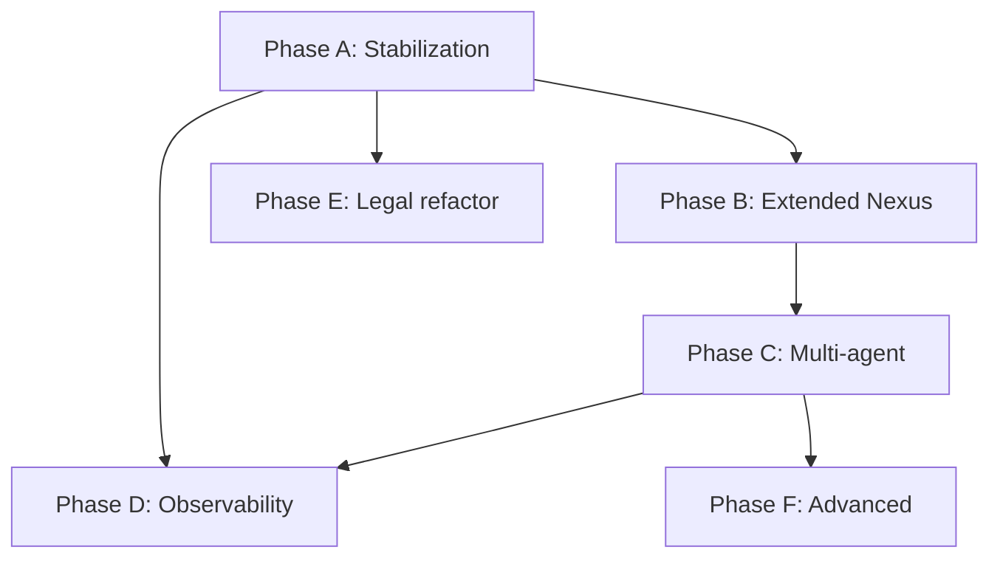

# Intergrax — Runtime Implementation Plan

Status: Working draft (2026-05-27)  
Canonical source: [`intergrax_runtime_architecture.md`](intergrax_runtime_architecture.md)  
Baseline: [`INTERGRAX_IMPLEMENTATION_GAP_ANALYSIS.md`](INTERGRAX_IMPLEMENTATION_GAP_ANALYSIS.md) §14  
Principle: **evolve, not rewrite**

---

## 1. Plan Objective

Transform Intergrax into an **internal agent experimentation laboratory** (§2, §35) aligned with the canonical architecture:

```text
hypothesis → capability → contract → registration → Nexus → trace → evaluation → decision
```

**Success metric:** time from idea to first running experiment **< 1 hour** (currently: days via copying `legal_agent`).

**Current alignment with target:** ~85–88% (Phase A + B + C complete).

---

## 2. Map: Architecture Document → Implementation Status

| Architecture section | Canonical requirement | Status | Location / notes |
|------------------------|----------------------|--------|------------------|
| §6–7 Layers | 3 layers + repo split | **Partial** | §7.4 documented; Legal split done |
| §9.1 Global Nexus Loop | Global loop, multi-step | **Minimal** | `NexusLoop.handle_task()` — single-agent, sequential |
| §9.2 Local Agent Loop | Bounded agent loop | **Exists** | Legal `legal_execution_loop`, RuntimeEngine |
| §10.1 Task Intake | Normalize to `Task` | **Partial** | `Task` + FastAPI serving; no CLI/Slack intake |
| §10.2 Classification | Task types | **Stub** | `TaskClassifier` — metadata only |
| §10.3 Planning | Step plan | **Missing** | `PlanLoopController` exists, not wired to NexusLoop |
| §10.4 Agent Selection | Registry + capabilities | **Done** | `AgentRegistry`, `AgentRouter`, `can_handle()` |
| §10.5 Execution Graph | Nodes, dependencies | **Missing** | — |
| §10.6 State Management | Global task state | **Partial** | `Task` + `TaskLifecycle`; no persistence |
| §10.7 Context Management | Context distribution | **Partial** | `context_builder` in Nexus; no formal `ContextManager` |
| §10.8 Tool/Adapter Policy | Explicit permissions | **Partial** | `AgentContract.allowed_tools`; no Nexus enforcement |
| §10.9–10.10 Validation + Response | Nexus-level validation | **Partial** | `agent.validate()`; no global validator |
| §11 Agent Responsibilities | Bounded capability | **Partial** | Legal still a “fat agent” (routing in pipeline) |
| §12 Agent Contract | Full metadata | **Done** | `intergrax/contracts/agent_contract_meta.py` |
| §13 Agent Interface | get_contract, can_handle, execute, validate | **Partial** | `execute` = `AgentEngine.run_agent`; not `AgentExecutionResult` on ABC interface |
| §14 AgentExecutionResult | Structured output | **Done** | `AgentEngine.run_with_result`, NexusLoop |
| §15 Agent Registry | Dynamic discovery | **Done** | `AgentRegistry`, bootstrap |
| §16 Capability Model | Capability-based routing | **Done** | `can_handle()`, `find_by_capability()` |
| §17 Adapters | Layer 1 integrations | **Exists** | Scattered registries (LLM, tools, RAG); no unified facade |
| §18 Slack/Teams | Interaction surfaces | **Missing** | Placeholder in §40 |
| §19 Debug UI | Observability surface | **Missing** | Trace store exists; no task list UI |
| §20 Shadow Workspace | Isolated experiments | **Missing** | — |
| §21 Sandbox | Controlled execution | **Missing** | — |
| §22 Tool Runtime | Unified tool invocation | **Partial** | `ToolRuntime`; Legal bridge; no global ToolRegistry facade |
| §23 Task Lifecycle | Explicit states + log | **Partial** | Missing `waiting_for_human`, `partially_completed`, persistence |
| §24–25 Execution Graph + Parallel | Multi-agent | **Missing** | — |
| §26 Long Running Tasks | Persistent, resumable | **Missing** | RunService exists separately |
| §27–28 Memory + Context | Bounded, explicit | **Partial** | Session/RAG/memory in Nexus; no task memory policy |
| §29 Validation Model | Multi-type validation | **Partial** | Per-agent only |
| §30–31 Failure + Retry | Controlled recovery | **Partial** | Legal failure policy; no Nexus retry engine |
| §32 Human In The Loop | Approval flow | **Missing** | — |
| §33 Observability | Full trace | **Partial** | Pipeline trace ✅; task-level trace stub (`TaskTraceEmitter`) |
| §34 Evaluation | EvalRunner + experiments | **Partial** | `EvalRunner` exists; no `AgentExecutionResult` integration |
| §35 Experiment Workflow | keep/improve/pause/delete | **Partial** | `experiment_guide.md`; no formal lifecycle |
| §40 Minimal Implementation | Skeleton | **~75%** | Missing ExecutionGraph, ResearchAgent prototype |
| §42 Anti-patterns | Guardrails | **Documentation** | Fat Legal Agent still in code |

---

## 3. Implementation Phases

### Phase A — Foundation Stabilization (P1, ~2 weeks)

**Goal:** complete the §40–§41 skeleton and make it the default path in Legal.

| # | Deliverable | Sections | Actions |
|---|-------------|----------|---------|
| A.1 | Unified run lifecycle | **Done** | `task_run_bridge`, `NexusTaskExecutionAdapter`, `UnifiedTaskRunner`, factory wiring |
| A.2 | Task trace persistence | **Done** | `PersistingTaskTraceEmitter`, NexusLoop `trace_store` |
| A.3 | NexusLoop production path | **Done** | `LEGAL_USE_NEXUS_LOOP` default `true` in dev |
| A.4 | EvalRunner integration | **Done** | `NexusEvalRunner` |
| A.5 | Test regression suite | Pending | — |
| A.6 | Shim cleanup | **Done** | `applications/legal_agent/` → shim + `host/main.py` stub only |

**Completion criteria:** Legal HTTP → NexusLoop → LegalAgent → trace in store → EvalRunner reports result.

**Risk:** Legal regression — mitigation: feature flag, parallel `AgentEngine` path for 1 sprint.

---

### Phase B — Extended Nexus (P1→P2, ~3 weeks)

**Goal:** NexusLoop closer to §9.1 pseudo-flow (without ExecutionGraph).

| # | Deliverable | Sections | Actions |
|---|-------------|----------|---------|
| B.1 | TaskClassifier v2 | **Done** | `TaskClassification`, `ClassifyingTaskClassifier` |
| B.2 | Minimal Planner | **Done** | `NexusPlan`, `TaskPlanner` |
| B.3 | TaskState extension | **Done** | extended `TaskState` + lifecycle transitions |
| B.4 | Nexus ValidationEngine | **Done** | `NexusValidationEngine` + capability plug-ins |
| B.5 | RetryEngine (basic) | **Done** | `RetryEngine`, alternate agent, trace in NexusLoop |
| B.6 | Tool access policy | **Done** | `ToolAccessPolicy`, `ToolRuntime.invoke(allowed_tools=...)` |
| B.7 | Final response composer | **Done** | `FinalResponseComposer`, multi-step execution in NexusLoop |

**Completion criteria:** EchoAgent + LegalAgent routed via classifier; retry visible in trace; validation failure → `TaskState.FAILED` with explicit reason.

---

### Phase C — Multi-Agent Readiness (P2, ~4 weeks)

**Goal:** first real multi-agent flow (§24–§25).

| # | Deliverable | Sections | Actions |
|---|-------------|----------|---------|
| C.1 | ExecutionGraph | **Done** | `ExecutionGraph`, `ExecutionNode`, `ExecutionNodeStatus` |
| C.2 | Sequential executor | **Done** | `GraphExecutor` batch iteration |
| C.3 | Parallel executor (limited) | **Done** | `asyncio.gather` per independent batch |
| C.4 | ContextManager | **Done** | `ContextManager.build_agent_context` |
| C.5 | ResearchAgent prototype | **Done** | `agents/research/` + `SummaryAgent` |
| C.6 | Second application shell | **Done** | `applications/research_application/` |

**Completion criteria:** Task “research → summarize” through 2 agents in ExecutionGraph with full trace.

**Start condition:** Phase B complete; Echo + Legal stable.

---

### Phase D — Observability and Experiments (P2, ~2 weeks)

**Goal:** §19, §35 — laboratory, not SaaS.

| # | Deliverable | Sections | Actions |
|---|-------------|----------|---------|
| D.0 | §42 P4.1 Event Bus wiring | §42.1–§42.2 | **Done** — `RuntimeEventBus` in NexusLoop, `trace_bridge`, lifecycle dual-emit |
| D.1 | Debug CLI | §19 | `intergrax debug tasks list|show|trace <task_id>` |
| D.2 | Minimal debug API | §19 | Endpoints: list runs, get trace, get AgentExecutionResult |
| D.3 | Experiment registry | §35 | Experiment metadata: hypothesis, status (keep/improve/pause/delete) |
| D.4 | Notebook templates | §35 | `notebooks/experiments/` — NexusLoop + Echo template |
| D.5 | Cost in trace | §33 | `AgentExecutionResult.cost` from runtime stats |

**Completion criteria:** New agent tested end-to-end without copying Legal; keep/delete decision recorded in experiment registry.

---

### Phase E — Legal Agent Refactoring (parallel, ~3 weeks)

**Goal:** remove §42.1 Fat Agent pattern in Legal without rewrite.

| # | Deliverable | Sections | Actions |
|---|-------------|----------|---------|
| E.1 | Routing out of agent | §42.1 | Pipeline routing → capability-based; Nexus selects profile |
| E.2 | Tool bridge → ToolRuntime | §22 | Full migration from `legal_tool_runtime_bridge` |
| E.3 | Governance ports | §29 | Validation rules in `AgentContract.validation_rules` |
| E.4 | Local loop bounds | §9.2 | Enforce `max_steps`, `max_cost` from contract |

**Completion criteria:** LegalAgent contains no global routing logic; E2E tests pass without regression.

---

### Phase F — Advanced / On-Demand (P3)

**Start only when a concrete use case appears.**

| # | Deliverable | Sections | Trigger |
|---|-------------|----------|---------|
| F.1 | Long-running tasks | §26 | Monitor agent, onboarding agent |
| F.2 | Human-in-the-loop | §32 | Legal prod, external actions |
| F.3 | ShadowWorkspace | §20 | Code/document experiments |
| F.4 | Sandbox | §21 | Script execution, browser automation |
| F.5 | Slack/Teams adapters | §18 | Organizational integration |
| F.6 | AdapterRegistry facade | §17 | >3 products with different adapter wiring |
| F.7 | Legacy cleanup | §42 | Remove ChatAgent, Supervisor, `chains/` |
| F.8 | Multi-tenancy / billing | §49 | **NOT now** |

---

## 4. Priority Order (Summary)

```text
NOW (Phase A):
  unified lifecycle → trace persistence → NexusLoop default → tests → shim cleanup

NEXT (Phase B):
  classifier → planner → validation → retry → tool policy

THEN (Phase C + D):
  ExecutionGraph → ResearchAgent → debug CLI → experiment registry

IN PARALLEL (Phase E):
  slim down Legal Agent (fat agent → thin agent)

LATER (Phase F):
  only with a real use case
```

---

## 5. Technical Dependencies



**Blockers:**
- Phase C requires B (planner + validation before graph)
- Phase D can start after A (CLI on trace store)
- Phase E does not block A/B — can run in parallel

---

## 6. Definition of Done (Global)

Each deliverable is complete when:

1. **Contract** — public API uses Pydantic / Protocol types
2. **Trace** — every state transition emits a `TraceEvent`
3. **Test** — unit + integration (deterministic, no network)
4. **Documentation** — update `experiment_guide.md` or architecture section if workflow changes
5. **No regression** — Legal + Echo pass through NexusLoop

---

## 7. Anti-Patterns to Watch During Implementation

| Anti-pattern | Section | Mitigation in plan |
|--------------|---------|-------------------|
| Fat Nexus | §42.2 | Thin NexusLoop; planner/graph as separate modules |
| Fat Agent | §42.1 | Phase E; scaffold promotes thin agent |
| Agent-Application monolith | §42.7 | New agents only via `agents/` + optionally `applications/` |
| Unobservable execution | §42.5 | TaskTrace → store mandatory from Phase A |
| Overengineering | §12 (Risks) | ExecutionGraph only in Phase C; Sandbox/Shadow on-demand |
| Product too early | §42.6 | Debug UI, not SaaS frontend |

---

## 8. Recommended Next Step

**Phase D.1:** debug CLI — list tasks/runs and inspect trace + `RuntimeEvent` history from NexusLoop.

**Phase P4.2 (parallel):** UAEP in AgentEngine — step loop, `RuntimeExecutionContext`, middleware wiring (§42.5).

Existing components to reuse (do not rewrite from scratch):

- `Task`, `TaskLifecycle`, `NexusLoop` — `intergrax/runtime/task/`, `runtime/nexus/`
- `RunService`, `DefaultRunService`, `ExecutionAdapter` — `intergrax/fastapi_core/`
- `AgentRegistry`, `AgentExecutionResult` — `intergrax/contracts/`, `runtime/registry/`
- Trace store — `intergrax/runtime/nexus/tracing/`

Estimated effort for Phase A: **8–12 working days** (1 developer, no network tests in CI).

---

*Plan based on [`intergrax_runtime_architecture.md`](intergrax_runtime_architecture.md) and codebase state after P0/P1 migration (2026-05-27).*
