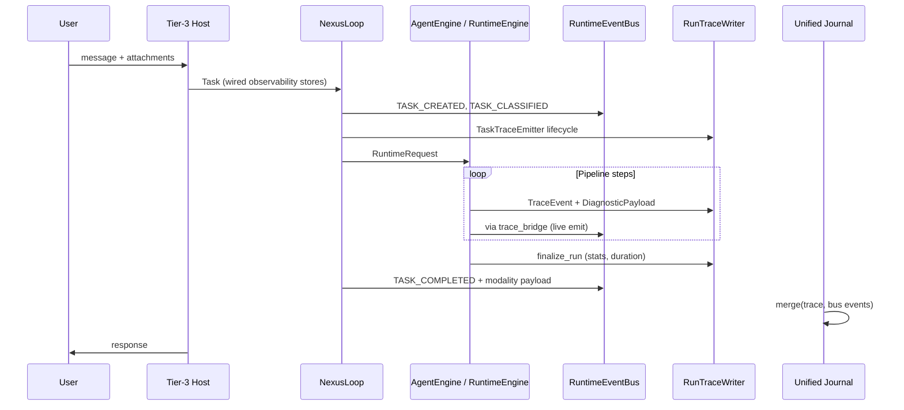

# Intergrax — Observability Architecture

**Status:** Canonical architecture (Harness platform)  
**Last updated:** 2026-06-08  
**Audience:** Harness maintainers, Tier-3 application authors, Tier-2 agent authors, operators  
**Related:** [intergrax_runtime_architecture.md](intergrax_runtime_architecture.md) §33, §42.1, §42.24 · [ADR-OBS-001](adr/ADR-OBS-001.md) · [INTERGRAX_IMPLEMENTATION_PLAN.md](INTERGRAX_IMPLEMENTATION_PLAN.md) [Phase OBS-BUS](INTERGRAX_IMPLEMENTATION_PLAN.md#phase-obs-bus--unified-observability-spine) · [AGENT_CREATION_GUIDE.md Appendix Q](AGENT_CREATION_GUIDE.md#appendix-q--observability-control-plane-closeout) · [HARNESS_ENVIRONMENT.md](HARNESS_ENVIRONMENT.md) · [INTEGRAX_HARNESS_AUDIT_MAP.md](INTEGRAX_HARNESS_AUDIT_MAP.md) §21

---

## 1. Purpose and scope

### 1.1 What this document defines

This is the **single source of truth** for how observability works across the Intergrax Harness:

- **Harness (Tier-0 / Tier-1)** — Nexus, AgentEngine, ToolRuntime, policy, critic, adaptive loops
- **Applications (Tier-3)** — composition roots that wire stores and profiles; no parallel telemetry stack
- **Agents (Tier-2)** — domain logic that **extends** platform contracts; never implements a private trace pipeline

### 1.2 What observability must answer

For every user interaction (question → answer), an operator MUST be able to reconstruct:

| Question | Required evidence |
|----------|-------------------|
| What entered the system? | Intake events, ingestion, normalized task |
| How was the agent chosen? | Agent selection record (capability, score, fallback) |
| What plan was produced? | Plan events + planner diagnostics |
| What context was assembled? | Context/RAG/memory events (metadata; content redacted in prod) |
| What did each step do? | Step start/complete/fail, tool calls, LLM calls |
| What did policy/critic decide? | Policy decisions, validation layers, verdicts |
| What failed or retried? | Error taxonomy, retry schedule/start, handoff |
| What did it cost? | Token/cost aggregation per run |
| Why did the run stop? | Terminal event + reason codes |

### 1.3 Non-goals

- Replacing external APM (Datadog, Honeycomb) as the **only** store — Intergrax owns the canonical journal; external systems are **optional sinks**
- Storing raw prompts/completions in production traces (redaction is mandatory)
- Per-agent custom SQLite trace databases
- Untyped `dict` payloads as the long-term contract (transitional; see §8)

---

## 2. Design principles

| Principle | Meaning |
|-----------|---------|
| **Harness-provided spine** | One observability mechanism ships with the platform. Applications and agents **configure and extend** it — they do not rebuild it. |
| **Event-first** | `RuntimeEvent` is the primary audit signal (canon §42.1). Traces and metrics are derived views. |
| **Typed extension** | Platform steps use `DiagnosticPayload` subclasses with stable `schema_id`. Domain extensions inherit the same contract. |
| **Emit at the boundary** | Signals are recorded where the Harness enforces policy (ToolRuntime, AgentRouter, GraphExecutor) — not inside ad-hoc agent helpers. |
| **Correlation by construction** | `task_id`, `run_id`, `correlation_id`, `parent_event_id` are set by the spine — not passed manually in business code. |
| **Redact before persist** | `DiagnosticPayload.redact()` + `production_mode` run before any store append. |
| **Pluggable persistence** | SQLite default; Cassandra/Elasticsearch/OTLP as integration profiles — same API, different backend. |
| **Read-model unification** | Operators consume **one chronological journal** per run (`build_unified_run_journal`). |
| **Modular sinks** | Metrics, logs, and external trace UIs subscribe to the bus or journal — they do not fork emission. |

---

## 3. The Harness Observability Spine (HOS)

The **Harness Observability Spine** is the universal “bus” through which all tiers publish execution signals.

```text
┌─────────────────────────────────────────────────────────────────────────┐
│                    HARNESS OBSERVABILITY SPINE (HOS)                     │
├─────────────────────────────────────────────────────────────────────────┤
│  EMIT (write)                                                            │
│    ObservabilityEmitter.emit_step()     ← single developer-facing API    │
│    RuntimeState.trace_event()           ← pipeline internal (today)      │
│    RuntimeEventBus.record() / publish() ← canonical envelope             │
├─────────────────────────────────────────────────────────────────────────┤
│  NORMALIZE                                                               │
│    trace_bridge                         TraceEvent → RuntimeEvent        │
│    payload_registry (target)            schema_id → typed payload        │
├─────────────────────────────────────────────────────────────────────────┤
│  PERSIST (write path)                                                    │
│    RunTraceWriter                       TraceEvent timeline (SQLite…)    │
│    RuntimeEventPersistence              RuntimeEvent journal (SQLite…)     │
├─────────────────────────────────────────────────────────────────────────┤
│  READ (query path)                                                       │
│    build_unified_run_journal()          merged chronological timeline      │
│    export_run_metrics()                 aggregates per run                 │
│    Debug API / CLI                      operator inspection                │
├─────────────────────────────────────────────────────────────────────────┤
│  SINKS (optional, subscribe/export)                                      │
│    OTLP / Prometheus                    LLM/RAG metrics plugins            │
│    ObservabilityBackend tools           Langfuse, Sentry, Phoenix…         │
│    Custom RuntimeEventBus handlers      alerting, webhooks               │
└─────────────────────────────────────────────────────────────────────────┘
```

**Key rule:** Harness, applications, and agents all use the **same spine**. Differences are only in **which steps emit** and **which `DiagnosticPayload` schemas** are registered — not in transport or storage mechanics.

---

## 4. Three signal planes

Intergrax observability deliberately separates three planes (pattern: event sourcing + structured logging + metrics).

### 4.1 Plane A — Canonical events (`RuntimeEvent`)

| Field | Role |
|-------|------|
| `event_type` | `RuntimeEventType` enum — stable ops vocabulary |
| `phase` | `ExecutionPhase` — where in the Nexus lifecycle |
| `severity` | `EventSeverity` — alert routing |
| `task_id` | Logical work unit (user request scope) |
| `run_id` | Single execution attempt (retries → new run or branch per policy) |
| `correlation_id` | Cross-agent/tool chain (default: `task_id`) |
| `parent_event_id` | Causal parent in the spine tree (**target:** populated by `TraceScope`) |
| `node_id` / `agent_id` / `step_id` | Graph and UAEP placement |
| `payload` | Structured facts (**today:** `dict`; **target:** typed `RuntimeEventPayload`) |
| `schema_version` | Envelope version (`runtime_event.v1`) |

**Code:** `intergrax/runtime/events/runtime_event.py`, `phase_coverage.py`, `event_bus.py`

**Catalog:** 54 `RuntimeEventType` values with `ExecutionPhase` and ops filter hints (`trace:*`, `ops:alert`, …).

### 4.2 Plane B — Diagnostic trace (`TraceEvent` + `DiagnosticPayload`)

Fine-grained, append-only timeline optimized for **reconstruction** and **evaluation**.

| Field | Role |
|-------|------|
| `seq` | Monotonic per `run_id` |
| `component` | `TraceComponent` (ENGINE, TOOLS, RAG, CRITIC, …) |
| `step` | Stable step identifier (e.g. `tool_invocation_start`, `critic.l1_judge`) |
| `payload` | `DiagnosticPayload` instance (typed, `schema_id`, `redact()`) |
| `tags` | Correlation metadata (`tenant_id`, `task_id`, `agent_id`) |

**Code:** `intergrax/runtime/nexus/tracing/trace_models.py`, `RuntimeState.trace_event()`

**Guard:** Non-`DiagnosticPayload` payloads are rejected at emission (gate: `test_runtime_state_trace_event_payload_guard.py`).

### 4.3 Plane C — Metrics and aggregates

| Source | What | When |
|--------|------|------|
| `RunStats.llm_usage` | Tokens, cost per run | Run finalize |
| `export_run_metrics()` | Behavioral ratios, modality summary | Debug `/metrics` |
| LLM metrics collector | Prometheus / OTLP JSON | `TASK_COMPLETED` plugin |
| RAG metrics | Retrieval latency, hit rate | `TASK_COMPLETED` / RAG plugin |
| Modality metrics | Vision/audio/tool modality counters | Trace payload aggregation |

Metrics are **third** in priority (canon §42.24): derived from events/trace, not a substitute for the journal.

---

## 5. Information flow — end to end

### 5.1 Request lifecycle (single-agent path)



### 5.2 Multi-agent graph path

Additional signals on top of §5.1:

| Stage | Emitter | Events |
|-------|---------|--------|
| Plan → graph | `planning_runner` | `PLAN_CREATED` |
| Node start/complete | `GraphTraceCallbacks` → `TaskTraceEmitter` | bridged `STEP_STARTED/COMPLETED` |
| Delegation | `GraphExecutor` | `HANDOFF_INITIATED/COMPLETED` |
| Retry | `RetryCoordinator`, graph callbacks | `RETRY_SCHEDULED`, `RETRY_STARTED` |
| Backpressure | `GraphExecutor` | `GRAPH_BACKPRESSURE` |
| Critic | `CriticTraceEmitter` | `critic.*` steps → validation/LLM events |
| HITL pause | `hitl_runner`, `graph_runner` | `HUMAN_APPROVAL_*`, `PAUSED/RESUMED` |

### 5.3 Extension flow (agent / application custom steps)

Developers **never** write to SQLite or invent parallel buses.

```text
1. Define DiagnosticPayload subclass:
     schema_id = "intergrax.diag.<domain>.<name>"   # or "agents.<slug>.diag.<name>"
     implement to_dict(), redact()

2. Emit through spine API (target: ObservabilityEmitter):
     emitter.emit_diagnostic(
         component=TraceComponent.STEP,
         step="my_agent.custom_check",
         payload=MyAgentCheckDiagV1(...),
         event_type=RuntimeEventType.STEP_COMPLETED,  # optional canonical mapping
     )

3. Register schema in payload registry (OBS-BUS-4):
     from intergrax.runtime.observability.extension_sdk import PayloadSchemaRegistry
     PayloadSchemaRegistry.register_agent_diagnostic(MyAgentCheckDiagV1, agent_slug="<slug>")

4. (Optional) Add trace_bridge mapping if step → RuntimeEventType is non-obvious

5. Wire nothing extra in Tier-3 factory — observability stores already injected
```

**Namespace convention:**

| Owner | `schema_id` prefix | Location |
|-------|-------------------|----------|
| Harness platform | `intergrax.diag.*` | `intergrax/runtime/nexus/tracing/` |
| Critic / adaptive | `intergrax.diag.critic.*`, `intergrax.diag.adaptive.*` | `intergrax/runtime/critic/`, `adaptive/` |
| Tier-2 agent | `agents.<slug>.diag.*` | `agents/<slug>/tracing/` |
| Tier-3 product | `applications.<slug>.diag.*` | `applications/<slug>/tracing/` |

Tier-2/3 payloads MUST subclass `DiagnosticPayload` from `trace_models.py` — **no fork of the ABC**.

---

## 6. Correlation and identity model

### 6.1 Identifiers

| ID | Scope | Rule |
|----|-------|------|
| `tenant_id` | Organization / isolation boundary | Required on persisted events |
| `task_id` | User-facing work unit | Stable across retries unless policy splits |
| `run_id` | Single execution attempt | One trace timeline per run |
| `correlation_id` | Cross-service chain | Defaults to `task_id`; propagated to children |
| `parent_event_id` | Causal tree | **Target:** set by `TraceScope` on nested calls |
| `event_id` | Unique event | `evt_*` (bus) or UUID (trace) |
| `node_id` | Graph node | Set during graph execution |
| `step_id` | UAEP / pipeline step | Middleware + UAEP |

### 6.2 TraceScope (target — Phase OBS-BUS-2)

`TraceScope` is a context manager on the spine:

```text
with TraceScope.emitter.run(run_id, task_id, tenant_id) as scope:
    with scope.step("tool.invoke", parent=scope.current):
        ...  # child events inherit parent_event_id
```

**Today:** `parent_event_id` exists on `RuntimeEvent` but is rarely populated.  
**Target:** mandatory for tool calls, LLM calls, graph delegation, and critic layers.

---

## 7. What the platform collects (inventory)

### 7.1 Harness-native steps (automatic — no agent code)

| Domain | TraceComponent | Example `step` / schema | RuntimeEventType (via bridge or direct) |
|--------|----------------|-------------------------|----------------------------------------|
| Run lifecycle | RUNTIME | `runtime_run_start/end` | TASK_* via lifecycle |
| Session / ingest | PIPELINE | `session_and_ingest_summary` | INGESTION_FAILED |
| History / context | PIPELINE | `history_summary` | CONTEXT_BUILT |
| RAG | RAG | `rag_summary` (`intergrax.diag.rag.summary`) | — (trace); CONTEXT_* (bus) |
| Web search | WEBSEARCH | `websearch_summary` | — |
| Tools | TOOLS | `tool_invocation_*` | TOOL_* |
| LLM | ENGINE | `core_llm`, `core_llm_call_recorded` | LLM_CALL |
| Plan / replan | PLANNER | `engine_plan_produced`, `plan_source_*` | PLAN_* |
| Memory | MEMORY | `user_longterm_memory_summary` | MEMORY_* |
| Budget | POLICY | budget diagnostics | — |
| Policy | POLICY | policy enforcer | POLICY_DECISION |
| Critic | CRITIC | `critic.l0_failed`, `critic.final_verdict` | VALIDATION_* / LLM_CALL |
| Graph | PLANNER | `graph node start/complete` (string today) | STEP_* |
| Adaptive L4 | RUNTIME | adaptive signals | ADAPTIVE_* |

### 7.2 UAEP executor signals

`intergrax/agents/uaep.py` emits directly to the bus: `CONTEXT_BUILT`, `DECISION_EMITTED`, `VALIDATION_PASSED/FAILED`, `POLICY_DECISION`, `INTERRUPT_REQUESTED`, `HUMAN_APPROVAL_REQUESTED`.

### 7.3 Known gaps (current → target)

| Gap | Impact | Phase |
|-----|--------|-------|
| `AGENT_SELECTED` not emitted | Cannot audit routing | **Done** (OBS-BUS-3) |
| `STEP_FAILED` not emitted on pipeline errors | Bus incomplete | **Done** (OBS-BUS-3) |
| `parent_event_id` unused | No causal tree | **Done** (OBS-BUS-2) |
| Graph nodes use string messages only | Weak typing | **Done** (OBS-BUS-3) |
| `RuntimeEvent.payload` is `dict` | Magic keys at canonical layer | **Done** (OBS-BUS-1) |
| Critic `evaluator_loop` not in bridge catalog | Journal gap | **Done** (OBS-BUS-3) |
| Parser trace separate from run journal | Ingest observability split | **Done** (OBS-BUS-6) |

---

## 8. Typing model

### 8.1 Current state (L3)

```text
TraceEvent.payload     → DiagnosticPayload (enforced)
RuntimeEvent.payload   → Dict[str, Any] (transitional)
TraceEvent.tags        → Dict[str, Any] (correlation keys)
```

`trace_bridge` flattens `DiagnosticPayload.to_dict()` into `payload["trace_payload"]` plus promoted fields (`model`, `tool_name`, …).

### 8.2 Target state (L4 — Phase OBS-BUS-1)

```text
RuntimeEvent.payload   → RuntimeEventPayload (discriminated union / registry)
PayloadSchemaRegistry  → schema_id ↔ Pydantic model
Persistence layer      → JSON serialize at store boundary only
```

Canonical payload families (canon §42.23.1):

| Schema family | Used for |
|---------------|----------|
| `decision.v1` | Agent decisions |
| `tool.v1` | Tool invocations |
| `validation.v1` | Critic / schema validation |
| `interrupt.v1` | Policy interrupts |
| `human.v1` | HITL responses |
| `handoff.v1` | Graph delegation |
| `agent_selection.v1` | Router outcomes (**new**) |
| `graph_node.v1` | Node execution (**new**) |

### 8.3 Extension rules for developers

1. **Subclass `DiagnosticPayload`** — never emit raw dicts through `RuntimeState.trace_event`.
2. **Stable `schema_id`** — never reuse for different semantics; bump `schema_version` on breaking changes.
3. **Implement `redact()`** — assume production persistence.
4. **Register** new schemas in domain `ARCHITECTURE.md` and payload registry (CI gate).
5. **Do not** import trace stores in Tier-2 — use `AgentEngine` / Nexus context only.

---

## 9. Persistence and wiring

### 9.1 Default (lab / single-tenant)

| Store | Env variable | Interface | Content |
|-------|--------------|-----------|---------|
| Run trace | `INTERGRAX_TRACE_DB` | `RunTraceWriter` | `TraceEvent` sequence + `RunMetadata` |
| Runtime events | `INTERGRAX_RUNTIME_EVENTS_DB` | `RuntimeEventPersistence` | `RuntimeEvent` journal |
| Checkpoints | `INTERGRAX_CHECKPOINTS_DB` | `TaskCheckpointReader` | Long-running state |
| Task memory | `INTERGRAX_TASK_MEMORY_DB` | `TaskMemoryPersistence` | KV memory |

### 9.2 Tier-3 wiring (zero custom observability code)

```python
from intergrax.applications._shared.observability_wiring import wire_application_observability

wiring = wire_application_observability(env_profile)
# wiring.stores.trace_store
# wiring.stores.runtime_event_store
# → passed to NexusLoop / AgentEngine via runtime_config_bridge
```

**Code path:** `observability_wiring.py` → `wire_nexus_observability()` → `open_run_trace_store()` + `resolve_runtime_event_persistence()`.

**Profiles:** `ObservabilityProfile` on `ApplicationEnvironmentProfile` controls `use_in_memory_trace`, `enable_runtime_events`.

### 9.3 Scale-out path

| Trigger | Backend | Integration | Runtime contract |
|---------|---------|-------------|------------------|
| >1M events/day/tenant | Cassandra | `document_store=cassandra` | `DocumentBackedRuntimeEventStore` via `cassandra/runtime_events.py` |
| Full-text on payloads | Elasticsearch / OpenSearch | `observability_backend=elasticsearch` | Same `RuntimeEventPersistence` protocol; search index via document-backed store |
| Centralized trace UI | Phoenix, Langfuse | Dual-write from journal export (`export_bridge.py`); parser trace for ingest | `INTERGRAX_EXPORT_JOURNAL` (default on) |
| Metrics at scale | Prometheus + OTLP | `IntegrationProfile.harness_environment()` | — |

**Profile wiring:** `open_runtime_event_store_from_profile()` resolves SQLite (default), Cassandra document store, or Elasticsearch lab index — all wrapped in `ValidatingRuntimeEventPersistence`.

**Conformance:** `assert_runtime_event_persistence_conformance()` in `intergrax/runtime/observability/persistence_conformance.py` — gate: `check_observability_persistence_conformance.py`.

**Rule (canon §33.1):** Extend `RunTraceWriter` / `RuntimeEventPersistence` — do not fork a parallel trace system.

### 9.4 Custom persistence adapter

Implement `RuntimeEventPersistence` protocol (`append`, `list_for_run`, `list_for_task`) and `RunTraceWriter` / `RunTraceReader`. Register via `IntegrationProfile` factory — same as other integration providers. Run the conformance harness before shipping a new backend.

---

## 10. Read path — inspection and monitoring

### 10.1 Unified run journal

```python
from intergrax.runtime.events.unified_run_journal import build_unified_run_journal

journal = build_unified_run_journal(persisted_run, runtime_store=event_store)
# List[RuntimeEvent] chronological — operator source of truth
```

Merge rules: persisted bus events win on `event_id`; dedupe by `trace_event_id`.

### 10.1.1 Journal export (OBS-BUS-6)

On ``TASK_COMPLETED``:

1. **Payload ref** — `journal_ref` on the terminal runtime event (`schema_version`, `run_id`, `tenant_id`, `event_count`, `parser_trace_count`).
2. **Plugin export** — `runtime.journal_export` builds `build_journal_export_snapshot()`, logs OTLP-style JSON (`render_journal_otlp_json`), and calls `export_parser_traces_from_events()` for ingest parser spans.

```python
from intergrax.runtime.observability.journal_export import build_journal_export_snapshot, render_journal_otlp_json
from intergrax.runtime.observability.export_bridge import register_journal_export_plugin
```

Disable export: `INTERGRAX_EXPORT_JOURNAL=0`. Parser vendor export remains `INTERGRAX_EXPORT_PARSER_TRACE=1`.

### 10.2 Operator surfaces

| Surface | Command / route | Returns |
|---------|-----------------|---------|
| Debug CLI | `python -m intergrax.debug trace <run_id>` | Timeline |
| Debug HTTP | `GET /debug/tasks/{run_id}/trace?include_runtime=true` | Unified journal |
| Events | `GET /debug/tasks/{run_id}/events` | Bus history |
| Metrics | `GET /debug/tasks/{run_id}/metrics` | `RunMetricsExport` |
| Progress | `GET /debug/tasks/{task_id}/progress` | Long-running % |

### 10.3 Monitoring in production

| Signal | Mechanism |
|--------|-----------|
| Error rate | Subscribe to `RuntimeEventType.*_FAILED`, `ops:alert` hints |
| Tool audit | `TOOL_*` events, `ops:tool_audit` |
| LLM cost | `TASK_COMPLETED` payload + LLM metrics plugin |
| HITL backlog | `HUMAN_APPROVAL_REQUESTED` without `RECEIVED` |
| Retry storms | `RETRY_STARTED` rate per tenant |
| Graph pressure | `GRAPH_BACKPRESSURE` |

**Ops filter hints:** `intergrax/runtime/events/phase_coverage.py` → `EVENT_OPS_FILTER_HINTS`.

External: wire `RuntimeEventBus.subscribe()` to PagerDuty/Slack via `notify` tools or custom handler.

---

## 11. Security, privacy, and retention

| Control | Implementation |
|---------|----------------|
| PII redaction | `DiagnosticPayload.redact()`, `DEFAULT_REDACTED_TEXT`, `production_mode` on messages |
| Tool I/O | `ToolInvocationStartDiagV1.redact()` strips input; end redacts output preview |
| Secrets | Never in payload; policy blocks at ToolRuntime |
| Tenant isolation | `tenant_id` on all persisted rows; queries scoped |
| Retention | Store-level policy (future); STM memory has `retention_enforcement` |

---

## 12. Tier responsibilities

| Tier | Responsibility | Must NOT |
|------|----------------|----------|
| **Tier-0** | Metrics bridges (LLM, RAG), parser trace export, observability integration providers | Own per-agent trace format |
| **Tier-1** | Spine, bus, bridge, journal, wiring, middleware, debug API | Contain business logic |
| **Tier-2** | Domain `DiagnosticPayload` extensions; consume spine via AgentEngine | Import trace DB, custom buses |
| **Tier-3** | `wire_application_observability`, profile selection, optional sinks | Reimplement RunTraceWriter |

---

## 13. Relationship to other architecture docs

| Document | Relationship |
|----------|--------------|
| [intergrax_runtime_architecture.md](intergrax_runtime_architecture.md) §33, §42.1, §42.24 | Normative summary; this doc is the deep dive |
| [NEXUS_EXECUTION_FLOW_REFERENCE.md](NEXUS_EXECUTION_FLOW_REFERENCE.md) | Execution narrative; cross-links execution phases |
| [CRITIC_VERIFICATION_LAYER_ARCHITECTURE.md](CRITIC_VERIFICATION_LAYER_ARCHITECTURE.md) | Critic trace steps on the spine |
| [ADAPTIVE_HARNESS_INTELLIGENCE_ARCHITECTURE.md](ADAPTIVE_HARNESS_INTELLIGENCE_ARCHITECTURE.md) | `ADAPTIVE_*` events |
| [HARNESS_ENVIRONMENT.md](HARNESS_ENVIRONMENT.md) | Lab OTLP, env vars, local backends |
| [LLM_ADAPTERS.md](LLM_ADAPTERS.md) | LLM metrics plane |
| [AGENT_CREATION_GUIDE.md Appendix Q](AGENT_CREATION_GUIDE.md#appendix-q--observability-control-plane-closeout) | Author wiring checklist |

---

## 14. Maturity model

| Level | Criteria |
|-------|----------|
| **L0** | Ad-hoc logging only |
| **L1** | Trace file per run, no correlation |
| **L2** | TraceEvent + SQLite, partial bus |
| **L3** | Unified journal, DiagnosticPayload guard, wiring CI |
| **L4** | Typed RuntimeEvent payloads, TraceScope tree, catalog emission, extension SDK, journal export (**current — OBS-BUS Done**) |

Audit map §21 score: **L4** (OBS-BUS-7 gate evidence).

---

## 15. Code map (implementation reference)

| Concern | Path |
|---------|------|
| Trace models | `intergrax/runtime/nexus/tracing/trace_models.py` |
| Trace payloads | `intergrax/runtime/nexus/tracing/**/*.py` |
| Runtime events | `intergrax/runtime/events/runtime_event.py` |
| Event bus | `intergrax/runtime/events/event_bus.py` |
| Trace bridge | `intergrax/runtime/events/trace_bridge.py` |
| Emitter + TraceScope | `intergrax/runtime/observability/emitter.py`, `trace_scope.py` |
| Extension SDK | `intergrax/runtime/observability/extension_sdk.py`, `intergrax/scaffold/tracing_templates.py` |
| Persistence conformance | `intergrax/runtime/observability/persistence_conformance.py`, `events/stores/document_backed_runtime_event_store.py` |
| Unified journal | `intergrax/runtime/events/unified_run_journal.py` |
| Journal export | `intergrax/runtime/observability/journal_export.py`, `export_bridge.py` |
| Nexus wiring | `intergrax/runtime/nexus/observability_wiring.py` |
| App wiring | `intergrax/applications/_shared/observability_wiring.py` |
| Pipeline emit | `intergrax/runtime/nexus/engine/runtime_state.py` |
| Task lifecycle | `intergrax/runtime/task/task_trace.py` |
| Critic trace | `intergrax/runtime/critic/trace.py` |
| Graph trace | `intergrax/runtime/nexus/orchestration/graph_trace_callbacks.py` |
| Middleware | `intergrax/runtime/middleware/trace_middleware.py` |
| Metrics export | `intergrax/runtime/metrics/export.py` |
| Debug API | `intergrax/debug/router.py`, `formatters.py` |
| SQLite stores | `intergrax/runtime/nexus/tracing/sqlite_run_trace_store.py`, `events/store.py` |
| Gates | `scripts/check_observability_gates.py`, `test_observability_layer_depth_gate.py`, emission/schema/persistence audits |

---

## 16. Verification

After harness observability changes:

```bash
uv run pytest -m gate -q
python scripts/check_harness_no_getattr.py
python scripts/check_trace_bridge_event_catalog.py
```

Phase OBS-BUS (CI umbrella):

```bash
uv run python scripts/check_observability_gates.py
```

---

*This document is the canonical observability architecture. Update it when changing spine contracts, emission rules, or persistence profiles. Implementation status: [Phase OBS-BUS](INTERGRAX_IMPLEMENTATION_PLAN.md#phase-obs-bus--unified-observability-spine).*
