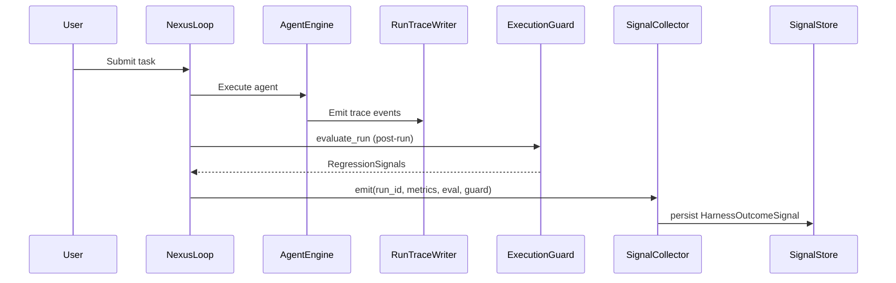
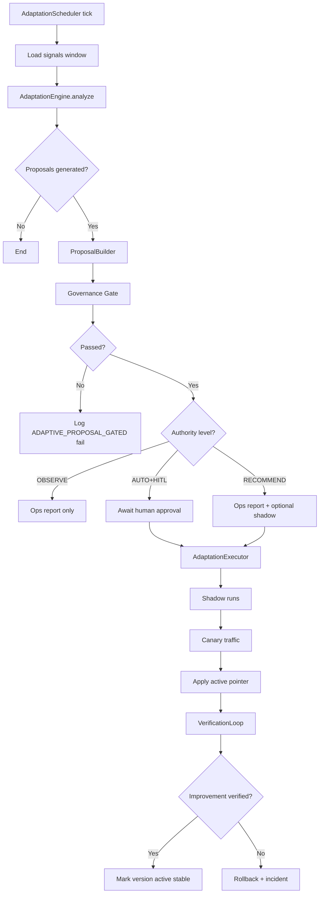
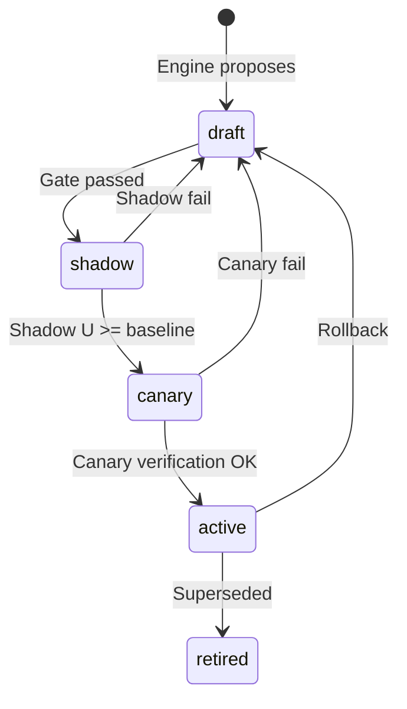
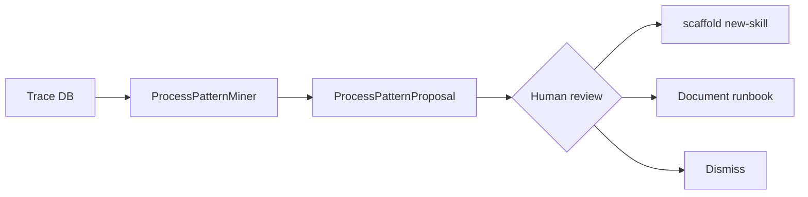

# Adaptive Harness Intelligence

**Status:** Canonical architecture (domain pair 1:1)  
**Hub:** [`intergrax_runtime_architecture.md`](../intergrax_runtime_architecture.md)  
**Plan (1:1):** [`plan/ADAPTIVE_HARNESS_INTELLIGENCE.md`](../plan/ADAPTIVE_HARNESS_INTELLIGENCE.md)  
**Target:** [`IDEAL_HARNESS_AI_ARCHITECTURE.md`](../guides/IDEAL_HARNESS_AI_ARCHITECTURE.md)  
**Audit layers:** L4 AHI  
**Audit instruction:** [`audit/ADAPTIVE_HARNESS_INTELLIGENCE.md`](../audit/ADAPTIVE_HARNESS_INTELLIGENCE.md)  
**Last updated:** 2026-06-17 — **Full Harness LC** (re-validates W-ADAPT); **70/70 Done**

### L4 Frozen cross-domain index (AHI-MAINT-04)

| Item | Owner domain | Plan row | Notes |
|------|--------------|----------|-------|
| GAP-CTX-12 adaptive context ranking | AHI (Frozen) | AHI-MAINT-04 | No CE-owned auto-ranking |
| M-RAG.58 / GAP-RAG-15 adaptive retriever selection | AHI (Frozen) | [`RAG-MAINT-04`](../plan/RAG.md#61av-harness-implementation-queue--rag-audit-maintenance-planned) | No RAG-owned implementation |
| CVL L4 adaptive critic thresholds | AHI (Frozen) | CVL-MAINT-02 | Product gate before auto-apply |

**Product gate (AHI-MAINT-01):** L4 threshold auto-apply requires explicit product decision — evidence bundle via `phase_w_adapt_report.py`.

---

## Cursor read scope (token budget)

**Do not read this entire file in one session** (ADAPTIVE_HARNESS_INTELLIGENCE canon).

- **Implement / audit default:** L4 adaptive loop contracts. Skip maturity history unless AHI task.
- **Use** table of contents below — `Read` with offset/limit per §.
- **Plan hub:** [`plan/ADAPTIVE_HARNESS_INTELLIGENCE.md`](../plan/ADAPTIVE_HARNESS_INTELLIGENCE.md) (scoped §6 only).
- **Audit slice:** [`guides/audit_slices/ADAPTIVE_HARNESS_INTELLIGENCE.md`](../guides/audit_slices/ADAPTIVE_HARNESS_INTELLIGENCE.md).
- **Max reads:** at most **one** file >5k tokens per session unless RESUME cites more.

---


## Table of contents

1. [Executive summary](#1-executive-summary)
2. [Strategic business case](#2-strategic-business-case)
3. [Problem statement and market gap](#3-problem-statement-and-market-gap)
4. [Terminology — Adaptive Harness Intelligence vs classical RL](#4-terminology--adaptive-harness-intelligence-vs-classical-rl)
5. [Audit of current Intergrax state](#5-audit-of-current-intergrax-state)
6. [Gap analysis](#6-gap-analysis)
7. [Vision and design principles](#7-vision-and-design-principles)
8. [Target architecture overview](#8-target-architecture-overview)
9. [Adaptive Control Plane — component specification](#9-adaptive-control-plane--component-specification)
10. [Signal model and utility function](#10-signal-model-and-utility-function)
11. [Adaptation loops — four canonical kinds](#11-adaptation-loops--four-canonical-kinds)
12. [Lifecycle modes — Observe through Verify](#12-lifecycle-modes--observe-through-verify)
13. [Process pattern intelligence](#13-process-pattern-intelligence)
14. [Integration with existing Intergrax subsystems](#14-integration-with-existing-intergrax-subsystems)
15. [Tier placement and dependency rules](#15-tier-placement-and-dependency-rules)
16. [Security, governance, and human-in-the-loop](#16-security-governance-and-human-in-the-loop)
17. [Data contracts (Pydantic reference)](#17-data-contracts-pydantic-reference)
18. [End-to-end flow diagrams](#18-end-to-end-flow-diagrams)
19. [Phased implementation roadmap — Phase W-ADAPT](#19-phased-implementation-roadmap--phase-w-adapt)
20. [KPIs, acceptance gates, and L4 evidence](#20-kpis-acceptance-gates-and-l4-evidence)
21. [Operational model](#21-operational-model)
22. [Risks, anti-patterns, and mitigations](#22-risks-anti-patterns-and-mitigations)
23. [Competitive differentiation summary](#23-competitive-differentiation-summary)
24. [Conclusions and recommendations](#24-conclusions-and-recommendations)
25. [Appendix A — Mapping to existing code](#appendix-a--mapping-to-existing-code)
26. [Appendix B — Proposed implementation plan task IDs](#appendix-b--proposed-implementation-plan-task-ids)
27. [Appendix C — ADR decision record](#appendix-c--adr-decision-record)

---

## 1. Executive summary

Intergrax is a **Harness AI platform** — the durable product is the runtime, not any single agent. Most industry harnesses (Cursor-class IDE agents, Codex-style coding harnesses, Viktor-style automation, Google ADK-style labs) optimize for **run → trace → manual tuning**. They do not provide a **governed, auditable, closed-loop path** from production telemetry to bounded runtime improvement.

**Adaptive Harness Intelligence (AHI)** is Intergrax's proposed answer: a Tier-1 **Adaptive Control Plane** that:

1. **Observes** execution outcomes from trace, metrics, evaluation, cost, and human-in-the-loop signals.
2. **Proposes** bounded configuration changes (routing, orchestration, RAG, policy fragments) as versioned artifacts.
3. **Validates** proposals through existing governance envelopes, capability-graph impact analysis, and regression suites.
4. **Applies** approved changes through shadow → canary → production promotion — never bypassing `PolicyEngine`.
5. **Verifies** measurable improvement over baseline before declaring L4 readiness.

This is **not classical reinforcement learning** (policy-gradient training, unconstrained reward maximization, black-box model updates). It is **evidence-driven harness adaptation**: contextual bandits, rule-based tuning, statistical regression gates, and human-governed policy learning — aligned with IDEAL §25 and the L4 maturity model.

**Strategic verdict:** AHI is **justified, feasible, and differentiated** if implemented as a governed platform capability (Phase W-ADAPT), not as an opaque "self-learning agent."

**Current state:** Intergrax has **L3 production harness** plus **L4 governance contracts** (`adaptive_governance.py`, maturity gates, evaluation registry). It does **not** yet have a runtime **AdaptationExecutor** that closes the loop with measurable improvement.

---

## 2. Strategic business case

### 2.1 Core business question

> Can Intergrax become a harness that **gets measurably better at running agents** — discovering efficient paths, reducing cost, improving quality, surfacing hidden workflow patterns — without sacrificing auditability or human control?

### 2.2 Value proposition

| Stakeholder | Value |
|-------------|-------|
| **Platform team** | Reduced manual tuning; evidence-based promotion of profile changes |
| **Agent authors** | Faster time-to-quality via recommended skill/routing profiles |
| **Operations / SRE** | Regression detection + bounded auto-remediation within policy |
| **Security / compliance** | Every adaptation is versioned, gated, rollback-ready |
| **Product leadership** | Defensible differentiator vs commodity agent runtimes |
| **Business applications (Tier-3)** | Optional business-outcome signals feed harness utility without polluting Tier-1 |

### 2.3 Alignment with Intergrax strategic lock

From [`INTERGRAX_DEVELOPMENT_STRATEGY.md`](guides/INTERGRAX_DEVELOPMENT_STRATEGY.md):

- **Harness is the durable product; agents are replaceable execution units.**
- **Laboratory** optimizes hypothesis speed; **production harness** optimizes governed repeatability.
- Evolution is **evidence-driven** (L0–L4), not declaration-driven.

AHI extends the laboratory workflow (`ExperimentSession` → KEEP/DISCARD) into **continuous production learning** with the same evidence discipline.

### 2.4 What success looks like (12-month horizon)

1. **≥ 10% improvement** in composite utility `U` (§10) on golden scenarios after adaptive routing vs static baseline.
2. **Zero unapproved policy mutations** in production (100% envelope compliance).
3. **≥ 3 process patterns** per active tenant surfaced monthly with human-reviewed skill proposals.
4. **Rollback time < 5 minutes** for any applied profile version via registry pointer swap.
5. **L4 gate evidence** satisfies Phase V criteria: closed-loop improvement documented in evaluation registry trends.

### 2.5 What AHI is not (scope boundary)

| Out of scope | Reason |
|--------------|--------|
| Training foundation models inside Intergrax | Tier-0 LLM adapters remain replaceable providers |
| Autonomous business strategy (Problem Radar product logic) | Tier-2 agent / Tier-3 application scope |
| Unsupervised policy drift | Violates policy-first architecture |
| Multi-tenant SaaS billing for "AI learning" | Future product layer |
| Deep RL GPU training pipelines | Wrong tool; governance and auditability fail |

---

## 3. Problem statement and market gap

### 3.1 Industry default harness loop

```text
Static config → Run agent → Trace/logs → Human edits config → Repeat
```

Pain points:

- **Configuration debt** accumulates across agents, skills, prompts, and RAG profiles.
- **Hidden inefficiencies** (wrong model tier, excessive tool fanout, suboptimal RAG depth) are invisible until cost incidents.
- **Process knowledge** stays in traces nobody mines.
- **No safe automation** for tuning — teams either don't tune or tune without regression gates.

### 3.2 Intergrax opportunity

Intergrax already invested in the **prerequisites** competitors often lack together:

| Capability | Intergrax artifact |
|------------|-------------------|
| Full execution trace | `RunTraceWriter`, `RuntimeEvent` |
| Policy-first execution | `PolicyEngine`, `RuntimePolicyBundle` |
| Evaluation registry | `online_evaluation_registry`, `evaluation_registry_trends` |
| Agent lifecycle promotion | `agent_promotion.py` |
| Capability graph impact | `capability_graph_*` |
| Bounded adaptive envelopes | `adaptive_governance.py` |
| Shadow evaluation hook | `RuntimeArchitectureGovernanceBridge.record_shadow_run_evaluation` |
| Cost governance | `cost_budget.py`, `cost_optimization.py` |
| Experiment lab | `ExperimentSession` |

The gap is the **missing middle layer** that turns signals into **approved, versioned, verified** harness mutations.

### 3.3 Three intelligence problems (kept separate)

AHI addresses three related but distinct problems:

| # | Problem | Primary owner | AHI component |
|---|---------|---------------|---------------|
| P1 | **Operational adaptation** — better routing, retry, RAG, cost | Tier-1 Adaptive Control Plane | `AdaptationEngine`, `AdaptationExecutor` |
| P2 | **Process pattern discovery** — recurring tool/agent/HITL sequences | Tier-1 `ProcessPatternMiner` | Emits proposals; Tier-2 implements |
| P3 | **Strategic market intelligence** — forces, pains, opportunities | Tier-2 agents (e.g. Problem Radar) | Consumes AHI outputs optionally |

**Architectural rule:** Tier-1 MUST remain domain-agnostic. P3 never lives inside Nexus core loops.

---

## 4. Terminology — Adaptive Harness Intelligence vs classical RL

### 4.1 Definitions

| Term | Definition |
|------|------------|
| **Adaptive Harness Intelligence (AHI)** | The Intergrax platform capability that improves harness behavior over time through governed closed loops |
| **Adaptive Control Plane (ACP)** | Tier-1 subsystem implementing observe → propose → gate → apply → verify |
| **Harness Outcome Signal** | Normalized post-run measurement bundle feeding adaptation decisions |
| **Utility function U** | Weighted composite score for comparing candidate vs baseline configurations |
| **Adaptive Loop** | A bounded category of harness changes (`AdaptiveLoopKind` in existing contracts) |
| **Profile Version** | Immutable snapshot of a tunable configuration artifact with rollback pointer |
| **Classical RL** | MDP-based learning with policy parameters updated via reward gradients — **not the AHI implementation model** |

### 4.2 Comparison table

| Dimension | Classical RL | Adaptive Harness Intelligence |
|-----------|--------------|-------------------------------|
| Optimization target | Expected cumulative reward | Bounded utility improvement on golden + online eval |
| Action space | Continuous / high-dimensional policy | Discrete profile versions in registries |
| Exploration | Epsilon-greedy, entropy bonus | Shadow runs + canary traffic |
| Safety | Reward shaping, constraints | `PolicyEngine` + `AdaptiveLoopEnvelope` + human gate |
| Auditability | Often opaque | Full trace + proposal ID + version lineage |
| Update frequency | Every episode / batch | Async scheduler; cooldown per envelope |
| Failure mode | Reward hacking | Regression suite block + rollback |

### 4.3 Acceptable learning algorithms inside AHI

| Algorithm class | Use case | Tier |
|-----------------|----------|------|
| **Contextual bandits (Thompson sampling, UCB)** | Model routing, RAG tier selection | Tier-1 `AdaptationEngine` |
| **Rule-based thresholds** | Step explosion, cost spike response | Tier-1 (extends `HistoryAwareEvaluator`) |
| **Statistical process control** | Anomaly-triggered recommendations | Tier-1 (extends `cost_forecast.py`) |
| **Offline policy improvement** | Batch analysis → proposal | Tier-1 scheduler job |
| **Frequent sequence mining** | Process patterns in traces | Tier-1 `ProcessPatternMiner` |
| **LLM-as-judge** | Quality signal input only | Tier-1 eval subsystem (existing) |
| **Deep RL / neural policy** | — | **Rejected for AHI v1** |

---

## 5. Audit of current Intergrax state

### 5.1 Maturity model recap

From [`INTEGRAX_HARNESS_AUDIT_MAP.md`](guides/INTEGRAX_HARNESS_AUDIT_MAP.md):

| Level | Meaning |
|-------|---------|
| L0 | Fragmented — no consistent model |
| L1 | Operational MVP |
| L2 | Scalable harness — modular, registered, testable |
| L3 | Production harness OS — policy, SLOs, runbooks, evaluation ops |
| **L4** | **Adaptive Agent OS — closed feedback loops, bounded self-tuning** |

### 5.2 Layer-by-layer readiness for AHI

| Layer | Current score | Evidence | AHI readiness |
|-------|---------------|----------|---------------|
| Observability / trace | L3 | `RunTraceWriter`, OTLP, modality metrics | ✅ Signal source ready |
| Evaluation | L3 | `evaluation_automation.py`, online registry, trends | ✅ Baseline/candidate compare ready |
| Policy / governance | L3–L4 contracts | `PolicyEngine`, `adaptive_governance.py` | ⚠️ Gate ready; executor missing |
| Cost governance | L3 | Budget, quota, forecast, optimization report | ⚠️ Recommendations only |
| Orchestration | L3–L4 | Nexus loop, graphs, coordination catalog | ⚠️ Static profiles |
| RAG routing | L2 | `QueryRouter` heuristics | ⚠️ Not learned |
| Memory | L3 | `MemoryView`, task memory | ⚠️ No org-level pattern store |
| Agent promotion | L3 | `agent_promotion.py` | ✅ Pattern reusable for profiles |
| **Adaptive Harness (IDEAL §25)** | **L1–L2** | Contracts + CI gate evidence | ❌ Runtime loop not closed |

### 5.3 Existing artifacts directly reusable

```
intergrax/runtime/architecture/
├── adaptive_governance.py          # AdaptiveLoopEnvelope, gate rules
├── maturity_gate_evidence.py       # L4 evidence aggregator
├── runtime_governance_bridge.py    # Shadow eval, trace metadata
├── online_evaluation_registry.py   # Observation persistence
├── evaluation_registry_trends.py     # Release comparisons
├── cost_optimization.py            # Recommendation generator
├── agent_promotion.py              # Promotion evidence pattern
└── capability_graph_*.py           # Impact analysis

intergrax/runtime/governance/
├── execution_guard.py              # Post-run governance
└── history_evaluator.py            # Historical regression signals

intergrax/experiments/workflow.py     # Lab session pattern
intergrax/rag/routing/query_router.py # Tunable RAG tier target
```

### 5.4 What Phase V L4 closeout actually validates today

`scripts/phase_v_closeout_gate.py --enforce-l4` confirms:

- Adaptive **proposal envelopes** pass governance rules (`build_default_adaptive_proposals()`).
- Maturity gate inputs include `adaptive_governance_passed`.

It does **not** confirm:

- Measurable quality/cost improvement over baseline in production.
- Automatic application of approved adaptations.
- Continuous signal collection driving proposals.

**Interpretation:** Intergrax achieved **L4 governance readiness** (Phase V) and **L4 adaptive runtime readiness** (Phase W-ADAPT, 70/70 Done).

---

## 6. Gap analysis

> **Historical audit (2026-06-05).** All gaps below were closed by Phase W-ADAPT (Wave 0–7). For current delivery status see [§19](#19-phased-implementation-roadmap--phase-w-adapt) and canon [§54.3](architecture/ADAPTIVE_HARNESS_INTELLIGENCE.md#543-implementation-state-phase-w-adapt--done).

### 6.1 Missing components (must build) — **Done (W-ADAPT)**

| ID | Component | Purpose |
|----|-----------|---------|
| G1 | `HarnessOutcomeSignal` + `SignalCollector` | Normalize post-run inputs to adaptation engine |
| G2 | `AdaptationEngine` | Generate `AdaptiveLoopProposal` from signals + bandit state |
| G3 | `ProfileVersionStore` | Immutable versioned profiles with rollback pointers |
| G4 | `AdaptationExecutor` | Apply approved changes to registry-bound profiles |
| G5 | `AdaptationScheduler` | Async worker — never blocks hot execution path |
| G6 | `VerificationLoop` | Post-apply regression + SLO window check |
| G7 | `ProcessPatternMiner` | Trace sequence mining → `ProcessPatternProposal` |
| G8 | Ops/report API | `phase_w_adapt_report.py` + optional HTTP debug routes |

### 6.2 Partial components (must extend) — **Done (W-ADAPT)**

| Component | Gap |
|-----------|-----|
| `RuntimeArchitectureGovernanceBridge` | Add `submit_proposal`, `apply_approved`, `rollback` |
| `cost_optimization.py` | Wire into `AdaptationEngine` as proposal source |
| `QueryRouter` | Accept bandit-weighted tier overrides from profile version |
| `ApplicationEnvironmentProfile` | Add `AdaptiveProfile` section (weights, enabled loops, authority) |
| `ExecutionGuard` | Emit structured signals into `SignalCollector` |

### 6.3 Documentation / planning gaps — **Done**

| Gap | Resolution |
|-----|------------|
| IDEAL L4 policy learning marked out of scope in plan | Add Phase W-ADAPT from this RFC |
| No single AHI architecture doc | This document |
| §34 Evaluation Model lacks closed-loop semantics | Extended in canon §54 |

---

## 7. Vision and design principles

### 7.1 Vision statement

> **Intergrax harness learns from every governed run — not by mutating opaque models, but by proposing auditable profile improvements that make agents cheaper, safer, and more effective over time.**

### 7.2 Design principles (normative)

1. **Policy-first adaptation** — no change bypasses `PolicyEngine`.
2. **Reuse Tier-0** — one trace system, one eval registry, one policy stack (canon §5.2, §8.8).
3. **Hot path stays deterministic** — adaptation runs async; per-run bandit choices read precomputed weights only.
4. **Human-governed autonomy** — authority matrix defaults conservative; `POLICY_LEARNING` requires approver.
5. **Evidence over declaration** — L4 requires measured improvement, not passing unit tests on sample proposals.
6. **Rollback by default** — every apply creates rollback pointer; auto-rollback on verification failure.
7. **Tier-1 domain-agnostic** — business semantics enter via optional Tier-3 outcome webhooks only.
8. **Capability graph before apply** — blast-radius analysis mandatory for skill/policy changes.
9. **Shadow before production** — no skip of shadow/canary except OBSERVE mode.
10. **Extend, don't duplicate** — evolve `adaptive_governance.py`, don't create parallel governance stack.

---

## 8. Target architecture overview

### 8.1 Logical placement in four-tier model

```text
Tier-0  Platform catalogs (tools, skills, LLM, integrations)
           ↑ resolved by profile versions
Tier-1  Nexus Runtime + Adaptive Control Plane (NEW)
           ↑ consumes signals from runs
Tier-2  Agents (bounded local loops; optional bandit hints via profile)
           ↑
Tier-3  Applications (AdaptiveProfile weights, business outcome hooks)
```

### 8.2 Adaptive Control Plane — box diagram

```text
┌──────────────────────────────────────────────────────────────────────────┐
│                     ADAPTIVE CONTROL PLANE (Tier-1)                       │
├──────────────────────────────────────────────────────────────────────────┤
│                                                                           │
│  ┌─────────────┐   ┌──────────────┐   ┌─────────────────┐               │
│  │ Signal      │   │ Process      │   │ Adaptation      │               │
│  │ Collector   │   │ Pattern      │   │ Engine          │               │
│  │             │   │ Miner        │   │ (bandit/rules)  │               │
│  └──────┬──────┘   └──────┬───────┘   └────────┬────────┘               │
│         │                 │                     │                         │
│         └─────────────────┴─────────────────────┘                         │
│                               │                                           │
│                               ▼                                           │
│                    ┌──────────────────────┐                               │
│                    │ Proposal Builder     │                               │
│                    │ → AdaptiveLoopProposal│                              │
│                    └──────────┬───────────┘                               │
│                               │                                           │
│                               ▼                                           │
│                    ┌──────────────────────┐                               │
│                    │ Governance Gate        │◄── adaptive_governance.py   │
│                    │ + Capability Graph     │◄── capability_graph_*       │
│                    │ + Human approval (opt) │◄── HITL / ops workflow      │
│                    └──────────┬───────────┘                               │
│                               │                                           │
│                               ▼                                           │
│                    ┌──────────────────────┐                               │
│                    │ Adaptation Executor    │                               │
│                    │ shadow → canary → apply│                              │
│                    └──────────┬───────────┘                               │
│                               │                                           │
│                               ▼                                           │
│                    ┌──────────────────────┐                               │
│                    │ Verification Loop      │◄── eval registry trends   │
│                    │ + auto-rollback          │◄── regression suites      │
│                    └──────────────────────┘                               │
│                                                                           │
└──────────────────────────────────────────────────────────────────────────┘
         ▲                                      │
         │ trace, metrics, eval, cost, HITL     │ mutates (versioned)
         │                                      ▼
    Nexus Runtime                         Profile Version Store
    AgentEngine                           ApplicationEnvironmentProfile
    ToolRuntime                           RagProfile / OrchestrationProfile
    PolicyEngine                          RuntimePolicyBundle fragments
```

### 8.3 Dual-loop integration (canon §9)

| Loop | AHI touchpoint | Sync/async |
|------|----------------|------------|
| **Global Nexus Loop** | Post-task signal emit; periodic proposal batch | Async scheduler |
| **Local Agent Loop** | Read bandit weights for RAG tier / tool order | Sync read-only |

**Rule:** `AdaptationEngine.propose()` MUST NOT run inside `NexusLoop` iteration hot path.

---

## 9. Adaptive Control Plane — component specification

### 9.1 SignalCollector

**Responsibility:** After each completed run (or batch window), assemble `HarnessOutcomeSignal`.

**Inputs:**

| Source | Fields extracted |
|--------|------------------|
| `RunTraceWriter` / persisted run | duration, step count, tool/LLM counts |
| `export_run_metrics()` | behavioral ratios, modality counters |
| `ExecutionGuard.evaluate_run()` | regression flags |
| Online/shadow evaluation | quality score, pass/fail |
| Cost subsystem | normalized cost vs budget |
| HITL subsystem | intervention count, pause duration |
| Tier-3 webhook (optional) | `business_outcome` float |

**Outputs:** `HarnessOutcomeSignal` persisted to `SignalStore` (SQLite or file-backed v1).

**Trigger:** Hook on task completion + optional cron aggregation.

**Non-goals:** Real-time streaming ML feature store (future enhancement).

---

### 9.2 AdaptationEngine

**Responsibility:** Transform signal history into ranked `AdaptiveLoopProposal` list.

**Sub-engines:**

| Sub-engine | Loop kind | Method |
|------------|-----------|--------|
| `RoutingTuningEngine` | `ROUTING_TUNING` | Contextual bandit over model/RAG tier arms |
| `ExecutionStrategyEngine` | `EXECUTION_STRATEGY_TUNING` | Rule + SPC on step/retry/parallel metrics |
| `PolicyLearningEngine` | `POLICY_LEARNING` | Eval adversarial + tool abuse signals → deny list deltas |
| `EvaluationFeedbackEngine` | `EVALUATION_FEEDBACK` | Benchmark regression → re-eval triggers (observe only) |

**State:** `BanditStateStore` per `(tenant_id, task_class, arm_id)`.

**Constraints:**

- Respect `AdaptiveLoopEnvelope.max_delta_percent`.
- Respect `cooldown_seconds` between proposals for same `loop_id`.
- Never propose changes exceeding registry compatibility (pre-check via capability graph).

---

### 9.3 ProposalBuilder

**Responsibility:** Wrap engine output in existing `AdaptiveLoopProposal` contract:

```python
# Existing contract — intergrax/runtime/architecture/adaptive_governance.py
AdaptiveLoopProposal(
    envelope=AdaptiveLoopEnvelope(...),
    proposed_change_summary="...",
    human_approver_id="...",       # required for POLICY_LEARNING
    evaluation_signal_id="...",    # links to HarnessOutcomeSignal
)
```

**Additional metadata (new):** `ProfileVersionDraft` attached as opaque payload validated by executor.

---

### 9.4 Governance Gate (existing + extensions)

**Stage 1 — Envelope validation:** `evaluate_bounded_adaptive_loop(proposal)` (existing).

**Stage 2 — Capability graph impact:** `evaluate_capability_graph_compatibility()` for affected nodes.

**Stage 3 — Authority routing:**

| `AdaptiveAuthorityLevel` | Behavior |
|--------------------------|----------|
| `OBSERVE_ONLY` | Log only; no executor invocation |
| `RECOMMEND` | Ops report + optional auto-shadow if tenant enables |
| `AUTO_WITH_HUMAN_GATE` | Block until `human_approver_id` confirms via HITL/ops API |

**Stage 4 — Regression pre-check:** Golden scenario smoke before shadow allocation.

---

### 9.5 AdaptationExecutor

**Responsibility:** Materialize approved proposals as new profile versions and shift traffic pointers.

**Stages:**

```text
SHADOW    → run candidate profile on shadow eval metadata (existing hook)
CANARY    → percentage or tenant-allowlist via ApplicationEnvironmentProfile
APPLY     → atomic pointer swap in ProfileVersionStore
ROLLBACK  → restore previous pointer on verification failure
```

**Mutatable artifacts (v1):**

| Artifact | Example change |
|----------|----------------|
| `OrchestrationProfile` | `max_parallel_nodes`, retry policy name |
| `RagProfile` | `route_mode`, `deep_query_min_words`, retriever weights |
| `LLMProfile` routing table | model selection per task class |
| `RuntimePolicyBundle` fragment | tool deny list tightening (policy learning) |

**Immutable:** Agent source code, Tier-0 catalog entries (only references change).

---

### 9.6 VerificationLoop

**Responsibility:** Post-apply monitoring over SLO window (default: 7 days or N runs).

**Checks:**

1. Evaluation registry trend — candidate utility ≥ baseline + `min_improvement_delta`.
2. No increase in `ExecutionGuard` regression rate beyond threshold.
3. Cost within budget envelope.
4. Security adversarial suite still green.

**Failure:** Auto-rollback + incident event + block further auto-apply for loop kind.

---

### 9.7 ProcessPatternMiner

**Responsibility:** Offline job on trace event sequences.

**Algorithm (v1):** PrefixSpan or simple n-gram frequency on:

```text
(task_class, agent_id, tool_id, hitl_pause, outcome=success)
```

**Output:** `ProcessPatternProposal`:

| Field | Description |
|-------|-------------|
| `pattern_id` | Stable hash of sequence |
| `support_count` | Occurrences in window |
| `avg_utility` | Mean U for runs matching pattern |
| `suggested_action` | `CREATE_SKILL_DRAFT`, `TUNE_ROUTING`, `DOCUMENT_RUNBOOK` |
| `evidence_run_ids` | Sample for human review |

**Tier handoff:** Skill creation uses `python -m intergrax.scaffold new-skill` — human/agent author completes Tier-2 work.

---

### 9.8 ProfileVersionStore

**Responsibility:** Git-like versioning for harness profiles.

```text
ProfileVersionRecord:
  version_id: str          # semver or ulid
  artifact_type: enum      # orchestration | rag | llm_routing | policy_fragment
  artifact_payload: dict   # validated Pydantic model dump
  parent_version_id: str | null
  created_by: str          # proposal_id or human operator
  rollback_of: str | null
  status: draft | shadow | canary | active | retired
```

**Storage v1:** SQLite under `build/adaptive_harness/` (gitignored) + export to ops artifacts.

---

### 9.9 AdaptationScheduler

**Responsibility:** Cron/worker triggering:

| Job | Cadence |
|-----|---------|
| `collect_signals_batch` | Every 5 min |
| `run_adaptation_engine` | Hourly (configurable) |
| `run_pattern_miner` | Daily |
| `run_verification_loop` | Continuous on active canaries |

**Integration:** Celery task via existing `wire_modality_extras()` message bus pattern OR in-process scheduler for lab.

---

## 10. Signal model and utility function

### 10.1 HarnessOutcomeSignal contract

```python
class HarnessOutcomeSignal(BaseModel):
    schema_version: str = "1.0.0"
    signal_id: str
    run_id: str
    tenant_id: str
    application_id: str
    agent_id: str
    task_class: str                    # from Nexus classifier
    timestamp: datetime

    # Quality
    quality_score: float               # 0.0–1.0 from eval registry
    validation_passed: bool
    eval_mode: str                     # offline | online | shadow | human

    # Efficiency
    cost_normalized: float             # actual / budget (1.0 = at budget)
    latency_ms: int
    total_tokens: int
    step_count: int
    tool_calls: int
    llm_calls: int

    # Governance
    hitl_interventions: int
    regression_flags: list[str]        # from ExecutionGuard

    # Optional business (Tier-3)
    business_outcome: float | None     # app-defined; nullable

    # Composite (computed)
    utility: float | None = None
```

### 10.2 Utility function U

Configured per `ApplicationEnvironmentProfile.adaptive_profile.weights`:

```text
U = w_q * quality_score
  - w_c * max(0, cost_normalized - 1.0)
  - w_l * normalize(latency_ms, latency_slo_ms)
  - w_h * min(1.0, hitl_interventions / max_hitl)
  - w_r * regression_penalty(regression_flags)
  + w_b * (business_outcome or 0)        # optional; default w_b = 0
```

**Default weights (conservative):**

| Weight | Default | Notes |
|--------|---------|-------|
| `w_q` | 0.50 | Quality dominates |
| `w_c` | 0.25 | Cost awareness |
| `w_l` | 0.10 | Latency |
| `w_h` | 0.10 | Human burden penalty |
| `w_r` | 0.05 | Regression penalty multiplier |
| `w_b` | 0.00 | Opt-in per Tier-3 app |

### 10.3 Bandit arm definition

For routing tuning, arms are **profile version candidates**:

```text
context = (tenant_id, task_class, time_of_day_bucket)
arm     = (llm_model_id, rag_tier, orchestration_profile_version)
reward  = U (delayed — attributed after run completes)
```

Use ** Thompson sampling** with Beta distribution per arm for v1 (simple, auditable).

---

## 11. Adaptation loops — four canonical kinds

Maps 1:1 to existing `AdaptiveLoopKind` enum.

### 11.1 ROUTING_TUNING

| Attribute | Value |
|-----------|-------|
| **Observes** | U by model × RAG tier × task_class |
| **Proposes** | Shift routing weights; RAG `route_mode` thresholds |
| **Default authority** | `RECOMMEND` → tenant opt-in `AUTO_WITH_HUMAN_GATE` |
| **Max delta** | 10% traffic shift per proposal |
| **Existing hook** | `LLMRoutingEvaluator` + `ModelRouter` + `FailoverLLMAdapter` — see [`LLM_ADAPTERS.md`](LLM_ADAPTERS.md) § LLM routing rules · [ADR-LLM-003](../adr/entries/2026-06-19/ADR-LLM-003.md). Persistent profile versions → **AHI-MAINT-06** / **M-LLM-X.10**. |

### 11.2 EXECUTION_STRATEGY_TUNING

| Attribute | Value |
|-----------|-------|
| **Observes** | step explosion, retry rate, parallel efficiency |
| **Proposes** | `RetryPolicy`, `max_parallel_nodes`, planner strategy name |
| **Default authority** | `RECOMMEND` |
| **Max delta** | 15% change in max steps / retries |
| **Existing hook** | `NexusLoop` construction via `build_nexus_loop_from_environment` |

### 11.3 POLICY_LEARNING

| Attribute | Value |
|-----------|-------|
| **Observes** | tool injection near-miss, adversarial eval failures |
| **Proposes** | `RuntimePolicyBundle` tool deny/allow adjustments |
| **Default authority** | `AUTO_WITH_HUMAN_GATE` (mandatory) |
| **Max delta** | 25% envelope (existing gate rule) |
| **Existing hook** | `PolicyEngine`, `tool_security.py` |

### 11.4 EVALUATION_FEEDBACK

| Attribute | Value |
|-----------|-------|
| **Observes** | benchmark regression deltas |
| **Proposes** | Trigger re-eval; block promotion — no config auto-apply |
| **Default authority** | `OBSERVE_ONLY` |
| **Max iterations** | 20 (existing gate allows higher for this kind) |
| **Existing hook** | `prompt_regression_suite.py`, `evaluation_registry_trends.py` |

---

## 12. Lifecycle modes — Observe through Verify

### 12.1 Mode definitions

| Mode | Code | Mutates runtime | User visibility |
|------|------|-----------------|-----------------|
| **Observe** | L4-O | No | Internal dashboards |
| **Recommend** | L4-R | No | Ops report + API |
| **Shadow** | L4-S | Shadow eval only | Trace tagged `shadow_profile_version` |
| **Canary** | L4-C | Partial traffic | Tenant allowlist |
| **Apply** | L4-A | Active pointer swap | Registry version bump |
| **Verify** | L4-V | Rollback if fail | Trend reports |

### 12.2 Promotion flow (profile versions)

```text
draft ──► shadow ──► canary ──► active ──► retired
                  └─ rollback ◄─┘
```

Aligns with `agent_promotion.py` evidence pattern — reuse promotion checklist adapted for profiles.

### 12.3 Relationship to laboratory workflow (§35)

| Lab phase | AHI production equivalent |
|-----------|---------------------------|
| Hypothesis | `AdaptiveLoopProposal.proposed_change_summary` |
| Run via Nexus | Shadow/canary runs |
| Validation criteria | Utility U + regression suites |
| KEEP / DISCARD | Apply / reject proposal |
| Delete | Rollback + retire version |

---

## 13. Process pattern intelligence

### 13.1 Business intent

Surface **hidden operational paths** — recurring sequences of tools, agents, and human gates that correlate with high or low utility — without claiming full business process management (BPM).

### 13.2 Example patterns

| Pattern | Interpretation | Suggested action |
|---------|----------------|------------------|
| `research → websearch.read_url → confluence.search` × 50/week, high U | Effective research workflow | Promote to SkillManifest draft |
| `legal_agent → hitl × 3` × 20/week, low U | Unclear escalation policy | Recommend policy review |
| `vendor_discovery → jira.create` × 5/week, high business_outcome | Valuable automation path | Tier-3 dashboard highlight |

### 13.3 Outputs never auto-execute in v1

`ProcessPatternProposal` creates **tickets/recommendations** only:

- Scaffold skill stub (human completes).
- Ops runbook entry.
- Adaptive routing hint (if mapped to ROUTING_TUNING).

---

## 14. Integration with existing Intergrax subsystems

### 14.1 Nexus Runtime

| Integration point | Change |
|-------------------|--------|
| Task completion hook | Call `SignalCollector.emit()` |
| `Agent.run()` | Read active profile version IDs from context |
| Metadata `harness_shadow_eval` | Extend with `candidate_profile_version_id` |

### 14.2 PolicyEngine

- Executor submits policy fragments as **new registry versions**.
- Runtime loads active version from `ProfileVersionStore` pointer.
- Deny-path tests mandatory before apply.

### 14.3 Evaluation subsystem

| Component | Role in AHI |
|-----------|-------------|
| `FileOnlineEvaluationRegistry` | Shadow run scores |
| `evaluation_registry_trends.py` | VerificationLoop baseline compare |
| `evaluation_automation.py` | Rule + LLM judge inputs to quality_score |
| `NexusEvalRunner` (V-REM-A.1) | Golden scenario execution |

### 14.4 Capability graph

Before any proposal affecting skills/tools/policy:

```text
impact = compute_blast_radius(proposal.target_nodes)
if impact.incompatible_edges: REJECT proposal
```

### 14.5 ApplicationEnvironmentProfile (Tier-3)

New section `AdaptiveProfile`:

```python
class AdaptiveProfile(BaseModel):
    enabled: bool = False
    mode: Literal["observe", "recommend", "shadow", "canary", "apply"] = "observe"
    enabled_loops: list[AdaptiveLoopKind] = Field(default_factory=list)
    utility_weights: UtilityWeights = Field(default_factory=UtilityWeights)
    canary_tenant_allowlist: list[str] = Field(default_factory=list)
    canary_traffic_percent: float = Field(default=0.0, ge=0.0, le=100.0)
    human_approver_group: str | None = None
```

Default for all apps: `enabled=False`, `mode=observe`.

### 14.6 ExperimentSession

Reuse patterns:

- `register()` → proposal registration.
- `evaluate_against_criteria()` → verification checks.
- `decide(KEEP|DISCARD)` → apply/rollback.

---

## 15. Tier placement and dependency rules

### 15.1 Strict dependencies

```text
Tier-3 AdaptiveProfile (config) ──► Tier-1 ACP (engine) ──► Tier-0 catalogs (read-only)
                                         │
                                         ▼
                                   Tier-2 agents (consume profiles; no adaptation logic)
```

### 15.2 Forbidden patterns

| Anti-pattern | Why forbidden |
|--------------|---------------|
| Agent imports `AdaptationEngine` | Agents execute; harness adapts |
| Direct SQLite writes to profile store from Tier-2 | Bypasses governance |
| Second trace system for AHI | Violates §5.2 reuse |
| Auto prompt string mutation without Prompt Registry | Violates §53.5 |
| Training PyTorch models in Nexus hot path | Latency + audit failure |

### 15.3 New module location

```
intergrax/runtime/adaptive/          # NEW package (Tier-1)
├── signal_collector.py
├── signal_store.py
├── adaptation_engine.py
├── proposal_builder.py
├── adaptation_executor.py
├── verification_loop.py
├── profile_version_store.py
├── bandit_state.py
├── process_pattern_miner.py
├── scheduler.py
└── contracts.py                     # HarnessOutcomeSignal, etc.
```

Extend (don't fork):

```
intergrax/runtime/architecture/adaptive_governance.py   # existing
intergrax/runtime/architecture/runtime_governance_bridge.py
```

---

## 16. Security, governance, and human-in-the-loop

### 16.1 Threat model

| Threat | Mitigation |
|--------|------------|
| Reward hacking (low cost, garbage output) | Multi-signal U; quality weight ≥ 0.5 default |
| Policy drift opening unsafe tools | POLICY_LEARNING human gate; max 25% delta |
| Cross-tenant leakage in bandit state | Partition stores by `tenant_id` |
| Malicious Tier-3 business_outcome injection | Validate webhook signatures; cap w_b |
| Denial of service via proposal flood | Cooldown + rate limits per loop_id |
| Rollback failure | Pre-apply snapshot mandatory |

### 16.2 Audit trail requirements

Every adaptation event emits `RuntimeEvent`:

| Event type | Payload |
|------------|---------|
| `ADAPTIVE_SIGNAL_RECORDED` | signal_id, run_id, U |
| `ADAPTIVE_PROPOSAL_CREATED` | proposal_id, loop_kind, summary |
| `ADAPTIVE_PROPOSAL_GATED` | passed, reasons |
| `ADAPTIVE_PROFILE_SHADOW` | version_id, scenario_ids |
| `ADAPTIVE_PROFILE_APPLIED` | version_id, previous_version_id |
| `ADAPTIVE_PROFILE_ROLLBACK` | reason, verification_failures |

### 16.3 Human approval workflow

For `AUTO_WITH_HUMAN_GATE`:

```text
Proposal created → Notification (Slack/Teams adapter) → Human approves via ops API
  → Executor proceeds to shadow/canary → Verify → Apply
```

Reuse existing `notification_adapter` and HITL pause infrastructure.

---

## 17. Data contracts (Pydantic reference)

### 17.1 New contracts summary

| Model | Package |
|-------|---------|
| `HarnessOutcomeSignal` | `intergrax/runtime/adaptive/contracts.py` |
| `UtilityWeights` | same |
| `ProfileVersionRecord` | same |
| `ProfileVersionDraft` | same |
| `ProcessPatternProposal` | same |
| `AdaptationExecutionResult` | same |
| `VerificationReport` | same |
| `AdaptiveProfile` | `intergrax/applications/contracts/environment_profile.py` |

### 17.2 Existing contracts (unchanged)

| Model | Location |
|-------|----------|
| `AdaptiveLoopEnvelope` | `adaptive_governance.py` |
| `AdaptiveLoopProposal` | `adaptive_governance.py` |
| `AdaptiveLoopKind` | `adaptive_governance.py` |
| `OnlineEvaluationObservation` | `online_evaluation_models.py` |

---

## 18. End-to-end flow diagrams

### 18.1 Run-time signal path (synchronous tail)



### 18.2 Adaptation batch path (async)



### 18.3 Profile version promotion



### 18.4 Process pattern mining



---

## 19. Phased implementation roadmap — Phase W-ADAPT

### 19.1 Phase overview

| Wave | ID prefix | Goal | Duration estimate |
|------|-----------|------|-------------------|
| W0 | W-ADAPT-0.* | RFC acceptance, plan sync, ADR | 1 week |
| W1 | W-ADAPT-1.* | SignalCollector + SignalStore + utility | 2–3 weeks |
| W2 | W-ADAPT-2.* | AdaptationEngine (recommend only) + ops report | 2–3 weeks |
| W3 | W-ADAPT-3.* | ProfileVersionStore + shadow executor | 3 weeks |
| W4 | W-ADAPT-4.* | Canary + apply + rollback | 3 weeks |
| W5 | W-ADAPT-5.* | VerificationLoop + L4 evidence | 2 weeks |
| W6 | W-ADAPT-6.* | ProcessPatternMiner | 2–3 weeks |
| W7 | W-ADAPT-7.* | Tier-3 AdaptiveProfile wiring + docs | 1–2 weeks |

**Total estimate:** 16–20 weeks with gate green after each wave.

### 19.2 Wave W-ADAPT-1 — Observe (L4-O)

| Task | Deliverable | Acceptance |
|------|-------------|------------|
| W-ADAPT-1.1 | `HarnessOutcomeSignal` contract + tests | Schema validated |
| W-ADAPT-1.2 | `SignalCollector` hooked to task completion | Signals in store per run |
| W-ADAPT-1.3 | Utility computation | U populated on signal |
| W-ADAPT-1.4 | `scripts/phase_w_adapt_report.py` | Report lists signals + U trends |

### 19.3 Wave W-ADAPT-2 — Recommend (L4-R)

| Task | Deliverable | Acceptance |
|------|-------------|------------|
| W-ADAPT-2.1 | `RoutingTuningEngine` (bandit skeleton) | Proposals for ROUTING_TUNING |
| W-ADAPT-2.2 | `ExecutionStrategyEngine` | Proposals from step/retry metrics |
| W-ADAPT-2.3 | Integration with `cost_optimization.py` | Cost anomalies → proposals |
| W-ADAPT-2.4 | Ops report shows gated proposals | No runtime mutation |

### 19.4 Wave W-ADAPT-3 — Shadow (L4-S)

| Task | Deliverable | Acceptance |
|------|-------------|------------|
| W-ADAPT-3.1 | `ProfileVersionStore` | CRUD + rollback pointers |
| W-ADAPT-3.2 | `AdaptationExecutor.shadow()` | Shadow runs tagged in trace |
| W-ADAPT-3.3 | Extend shadow eval metadata | Candidate version in observation |
| W-ADAPT-3.4 | Unit + integration tests | Gate green |

### 19.5 Wave W-ADAPT-4 — Apply (L4-A)

| Task | Deliverable | Acceptance |
|------|-------------|------------|
| W-ADAPT-4.1 | Canary traffic switch in Tier-3 wiring | Allowlist respected |
| W-ADAPT-4.2 | `AdaptationExecutor.apply()` | Atomic pointer swap |
| W-ADAPT-4.3 | HITL approval for POLICY_LEARNING | Cannot apply without approver |
| W-ADAPT-4.4 | ADAPTIVE_* runtime events | Events in trace export |

### 19.6 Wave W-ADAPT-5 — Verify (L4-V) — **Done**

| Task | Deliverable | Acceptance |
|------|-------------|------------|
| W-ADAPT-5.1 | `VerificationLoop` | Compares eval registry trends + utility/regression/cost/security |
| W-ADAPT-5.2 | Auto-rollback | Failed verification restores pointer + blocks loop kind |
| W-ADAPT-5.6 | `phase_w_adapt_closeout_gate.py` | `--enforce-l4-runtime` CI gate |
| W-ADAPT-5.11 | `l4_runtime_evidence.json` | 30-day golden scenario utility artifact |

### 19.7 Wave W-ADAPT-6 — Pattern intelligence — **Done**

| Task | Deliverable | Acceptance |
|------|-------------|------------|
| W-ADAPT-6.1 | `ProcessPatternMiner` | N-gram frequency over trace sequences |
| W-ADAPT-6.2 | `PersistedTraceSequenceReader` | Reuses `RunTraceReader.list_runs` |
| W-ADAPT-6.3 | Pattern report in `phase_w_adapt_report.py` | `process_patterns.json` export |
| W-ADAPT-6.5 | `AdaptationScheduler.run_pattern_miner` | Daily job entry point |

### 19.8 Wave W-ADAPT-7 — Tier-3 wiring — **Done**

| Task | Deliverable | Acceptance |
|------|-------------|------------|
| W-ADAPT-7.1 | Default `AdaptiveProfile` on lab/reference apps | `enabled=False` initially |
| W-ADAPT-7.3 | AGENT_CREATION_GUIDE Appendix V | Control plane map |
| W-ADAPT-7.6 | Acceptance E2E observe→recommend | No apply in test path |

### 19.9 Dependencies

```text
W-ADAPT-0 → W-ADAPT-1 → W-ADAPT-2 → W-ADAPT-3 → W-ADAPT-4 → W-ADAPT-5
W-ADAPT-1 → W-ADAPT-6 (parallel after W1)
Phase V Done + V-REM Done → prerequisite
```

---

## 20. KPIs, acceptance gates, and L4 evidence

### 20.1 Quantitative KPIs

| KPI | Target | Measurement |
|-----|--------|-------------|
| Signal coverage | ≥ 95% completed runs emit signal | SignalStore / completed runs |
| Proposal gate pass rate | Tracked; no target | Governance reports |
| Shadow improvement rate | ≥ 60% shadow candidates beat baseline U | Eval registry |
| Apply rollback rate | < 10% of applies | VerificationLoop |
| Mean time to rollback | < 5 minutes | Ops metrics |
| Utility improvement (golden) | ≥ 10% vs static baseline | Benchmark suite |
| Policy learning without approver | **0** | Security audit |
| Pattern proposals reviewed | ≥ 80% within 14 days | Ops queue |

### 20.2 L4 runtime readiness gate (extends Phase V)

All must pass:

1. L3 criteria stable (existing Phase V gate).
2. W-ADAPT-5 complete with CI closeout green.
3. Documented 30-day window showing `mean(U_candidate) > mean(U_baseline)` on ≥ 3 golden scenarios.
4. Zero critical incidents from auto-apply during window.
5. Rollback drill executed successfully in ops runbook.

### 20.3 Evidence artifacts

| Artifact | Path |
|----------|------|
| Signal trend report | `build/adaptive_harness/signal_trends.json` |
| Proposal log | `build/adaptive_harness/proposals.json` |
| Verification report | `build/adaptive_harness/verification_report.json` |
| L4 runtime evidence | `build/adaptive_harness/l4_runtime_evidence.json` |

---

## 21. Operational model

### 21.1 Roles

| Role | Responsibility |
|------|----------------|
| Harness architect | Owns AHI design, envelope policies |
| Platform engineer | Implements W-ADAPT waves |
| Ops / SRE | Reviews recommendations, approves canary |
| Security | Approves POLICY_LEARNING proposals |
| Agent author | Consumes recommended profiles; implements skill drafts from patterns |

### 21.2 Cadence

| Activity | Frequency |
|----------|-----------|
| Signal health review | Weekly |
| Proposal review (RECOMMEND mode) | Weekly |
| Verification report | Per apply + weekly summary |
| Pattern proposal review | Biweekly |
| L4 evidence audit | Per release candidate |

### 21.3 Runbooks (W-ADAPT-5 — Done)

- `runbook/adaptive/rollback_profile.md`
- `runbook/adaptive/approve_policy_learning.md`
- `runbook/adaptive/shadow_failure_triage.md`

---

## 22. Risks, anti-patterns, and mitigations

| Risk | Severity | Mitigation |
|------|----------|------------|
| False L4 declaration | High | Separate governance L4 vs runtime L4 gates |
| Cold start (no signals) | Medium | Heuristic defaults; min run threshold before bandit |
| Overfitting to golden sets | Medium | Online eval + shadow on diverse tasks |
| Tenant config explosion | Medium | Limit active profile versions per artifact type |
| Engineer bypass via manual config | Medium | Registry pointers as source of truth in strict mode |
| Marketing as "RL" misleading buyers | Medium | Use AHI terminology consistently |

### 22.1 Anti-patterns (forbidden)

1. **Autonomous agent that edits its own prompts in production.**
2. **Second PolicyEngine for experiments.**
3. **Applying adaptations without ProfileVersionStore lineage.**
4. **Skipping capability graph check for skill/policy changes.**
5. **Embedding domain business rules in AdaptationEngine.**

---

## 23. Competitive differentiation summary

| Capability | Typical harness | Intergrax + AHI |
|------------|-----------------|-----------------|
| Trace | ✅ | ✅ |
| Eval benchmarks | Partial | ✅ First-class registry |
| Cost budgets | Rare | ✅ Enforced |
| Policy engine | Partial | ✅ Unified |
| Closed-loop tuning | ❌ Manual | ✅ Governed ACP |
| Rollback of config changes | Manual git revert | ✅ ProfileVersionStore |
| Process pattern mining | ❌ | ✅ Trace-native |
| Human-gated policy learning | ❌ | ✅ Envelope enforced |
| Capability graph impact | ❌ | ✅ Pre-apply validation |

**Positioning statement:**

> Intergrax is the Harness AI platform that **operationalizes improvement** — every run makes the runtime smarter within auditable bounds, not the agent autonomously rewriting itself.

---

## 24. Conclusions and recommendations

### 24.1 Conclusions

1. **Adaptive Harness Intelligence is strategically aligned** with Intergrax's harness-first mission and L4 maturity vision.
2. **Implementation is complete** — Phase W-ADAPT **70/70 Done** (Wave 0–7); runtime package `intergrax/runtime/adaptive/`.
3. **Classical RL is the wrong implementation model**; contextual bandits + governed proposals + verification loops are the right fit.
4. **L4 runtime readiness is achieved in code** — governance L4 (Phase V) + runtime L4 (W-ADAPT-5 closeout gate); production utility evidence accumulates when lab observe mode is active.
5. **Process pattern discovery belongs in Tier-1 mining + Tier-2 authoring**, keeping Nexus domain-agnostic.
6. **Differentiation is real** — policy gates, rollback, VerificationLoop, and measurable utility improvement are shipped.

### 24.2 Recommendations

| # | Recommendation | Priority | Status |
|---|----------------|----------|--------|
| R1 | Accept this RFC and add **Phase W-ADAPT** to implementation plan | P0 | **Done** (2026-06-05) |
| R2 | Default reference apps to safe posture; **lab** enables observe (`enabled=True`, `mode=observe`) | P0 | **Done** — `LAB_ADAPTIVE_OBSERVE`; product hosts remain `enabled=False` |
| R3 | Implement W-ADAPT-1 before any auto-apply code | P0 | **Done** |
| R4 | Rename outward-facing term: **Adaptive Harness Intelligence**, not "RL" | P1 | **Done** |
| R5 | Extend `phase_v_closeout_gate.py` to distinguish governance-L4 vs runtime-L4 | P1 | **Done** (W-ADAPT-5.8) |
| R6 | Author ADR-ADAPT-001 from Appendix C | P1 | **Done** — [`docs/adr/entries/2026-06-05/ADR-ADAPT-001.md`](adr/entries/2026-06-05/ADR-ADAPT-001.md) |
| R7 | Defer ProcessPatternMiner until W-ADAPT-5 verifies core loop | P2 | **Done** (W-ADAPT-6 after W-ADAPT-5) |
| R8 | Enforce `--enforce-l4-runtime` in CI and release pipeline | P1 | **Done** — `unit-tests.yml` + `harness-release.yml` |

### 24.3 Decision requested — **Closed**

Phase W-ADAPT Wave 0–7 **Done** (2026-06-02). Ongoing work: §6.1 harness maintenance, lab signal collection, production 30-day L4 evidence when sufficient run volume exists.

---

## Appendix A — Mapping to existing code

| AHIA component | Existing module | Action |
|----------------|-----------------|--------|
| Governance gate | `adaptive_governance.py` | Reuse |
| Shadow eval | `runtime_governance_bridge.py` | Extend |
| Regression signals | `history_evaluator.py` | Feed SignalCollector |
| Post-run governance | `execution_guard.py` | Feed SignalCollector |
| Metrics export | `metrics/export.py` | Feed SignalCollector |
| Cost recommendations | `cost_optimization.py` | Feed AdaptationEngine |
| Online eval | `online_evaluation_registry.py` | VerificationLoop |
| Trends | `evaluation_registry_trends.py` | VerificationLoop |
| Promotion pattern | `agent_promotion.py` | Mirror for profiles |
| Graph impact | `capability_graph_compatibility.py` | Pre-apply gate |
| Lab workflow | `experiments/workflow.py` | Pattern reference |
| RAG tuning target | `rag/routing/query_router.py` | Accept profile overrides |
| Nexus wiring | `applications/_shared/nexus_factory.py` | Load profile versions |
| Maturity evidence | `maturity_gate_evidence.py` | Add runtime L4 inputs |

---

## Appendix B — Proposed implementation plan task IDs

Insert into [`plan/ADAPTIVE_HARNESS_INTELLIGENCE.md) as **Phase W-ADAPT** — **synced 2026-06-05** (70 tasks, Band 2y):

```text
Phase W-ADAPT — Adaptive Harness Intelligence (AHI)
Prerequisite: Phase V Done, Phase V-REM Done, W-OPS Done, EVAL/COST/CG closeouts Done
Band: 2y (§4.0) — default implementation queue after §6.1 maintenance
Scope: Tier-1 intergrax/runtime/adaptive/ + Tier-3 AdaptiveProfile + scripts + tests
Out of scope: K.1/K.2, deep RL, foundation model training

See plan: Phase W-ADAPT master register (W-ADAPT-0.1 … W-ADAPT-7.7) · Appendix K · §6.1t · §6.2ac
```

---

## Appendix C — ADR decision record

**Canonical ADR:** [`docs/adr/entries/2026-06-05/ADR-ADAPT-001.md`](adr/entries/2026-06-05/ADR-ADAPT-001.md)

**ADR-ADAPT-001: Adaptive Harness Intelligence over classical RL**

| Field | Value |
|-------|-------|
| Status | Accepted (via this RFC) |
| Context | Need L4 differentiated harness capability |
| Decision | Implement governed Adaptive Control Plane with bandit/rule engines, not deep RL |
| Consequences | (+) Auditability, reuse of Phase V; (−) No neural policy optimality claims |
| Alternatives rejected | End-to-end RL fine-tuning; per-agent self-modifying code; external AutoML SaaS |

---

*End of document — Intergrax Adaptive Harness Intelligence Architecture v1.0.0*
