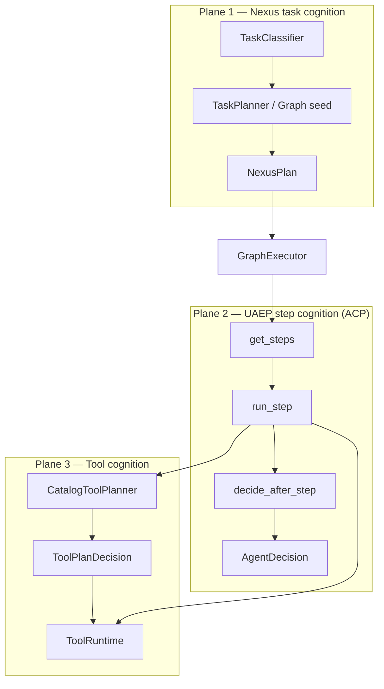
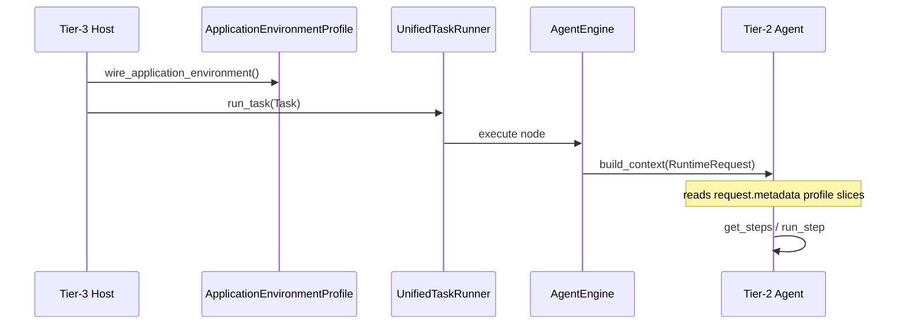
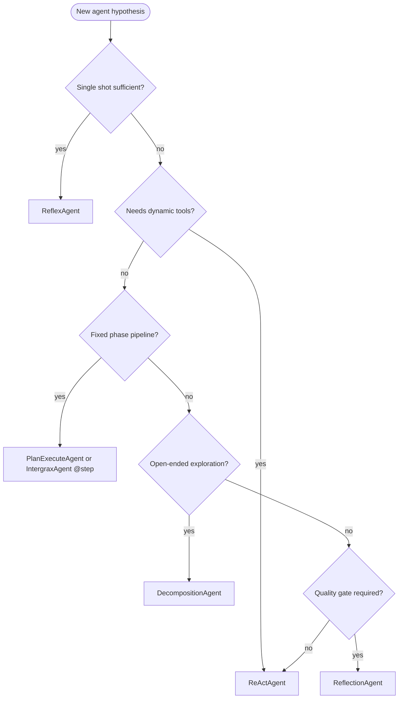
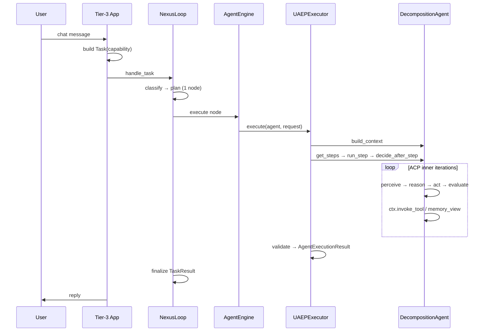
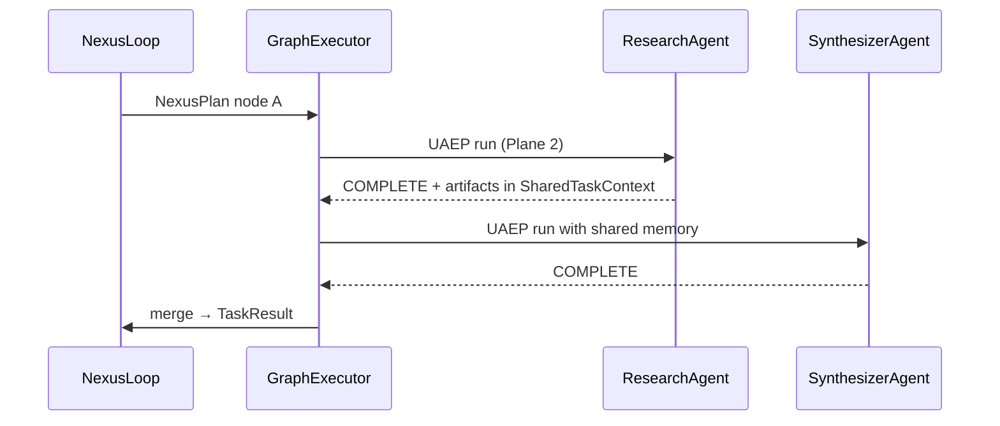
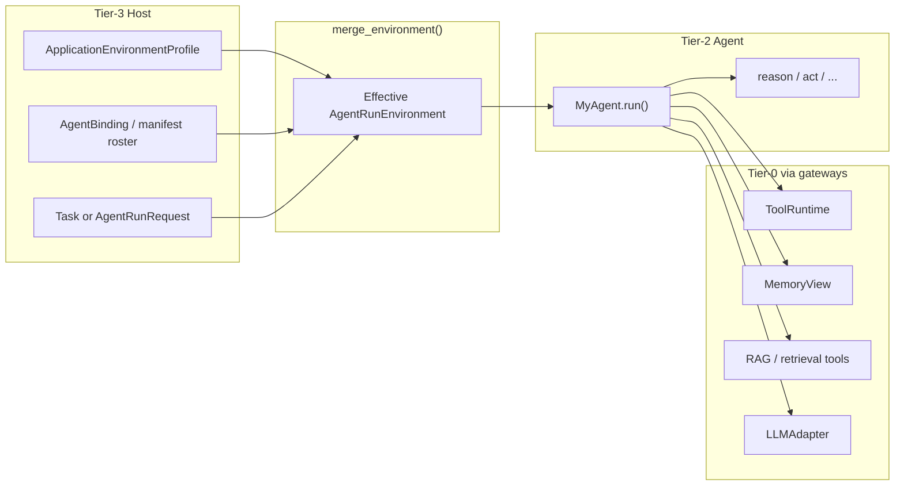

# Agent Contracts, Registry, and Capability Model

**Status:** Canonical architecture (domain pair 1:1) · **Production coding gate:** §40 + ACP-PROD-* (mutating agents)  
**Hub:** [`intergrax_runtime_architecture.md`](../intergrax_runtime_architecture.md)  
**Plan (1:1):** [`plan/AGENT_CONTRACTS_AND_ASSEMBLY.md`](../plan/AGENT_CONTRACTS_AND_ASSEMBLY.md)  
**Target:** [`IDEAL_HARNESS_AI_ARCHITECTURE.md`](../guides/IDEAL_HARNESS_AI_ARCHITECTURE.md)  
**Audit layers:** 17–20, 31 (+ ACP cognitive patterns §21)  
**Audit instruction:** [`guides/audit/AGENT_CONTRACTS_AND_ASSEMBLY.md`](../guides/audit/AGENT_CONTRACTS_AND_ASSEMBLY.md)  
**ADR:** [`adr/ADR-AGENT-001.md`](../adr/ADR-AGENT-001.md) · [`adr/ADR-AGENT-002.md`](../adr/ADR-AGENT-002.md) · [`adr/ADR-AGENT-003.md`](../adr/ADR-AGENT-003.md) — ACP · `run()` · `on_next_step` · dual observability  

---

## Table of contents

| § | Topic |
|---|--------|
| [§12](#12-agent-contract) | Agent contract |
| [§13](#13-agent-interface-run-facade-step-loop-and-uaep) | Agent interface: `run()`, step loop, UAEP |
| [§14](#14-agent-execution-result) | Agent execution result |
| [§15](#15-agent-registry) | Agent registry |
| [§16](#16-capability-model) | Capability model |
| [§17](#17-prompt-registry-architecture) | Prompt registry |
| [§18](#18-registry-architecture) | Registry architecture |
| [§19](#19-capability-graph-architecture) | Capability graph |
| [§20](#20-agent-lifecycle-governance) | Agent lifecycle governance |
| [§21](#21-agent-cognitive-architecture-acp) | **Agent Cognitive Architecture (ACP)** |
| [§22](#22-tier-and-terminology-canon) | Tier and terminology canon |
| [§23](#23-three-cognition-planes) | Three cognition planes |
| [§24](#24-agent-class-hierarchy) | Agent class hierarchy |
| [§25](#25-runtime-execution-context-state-model) | Runtime execution context / state |
| [§26](#26-cognitive-pattern-catalog) | Cognitive pattern catalog |
| [§27](#27-end-to-end-execution-flows) | End-to-end execution flows |
| [§28](#28-acp-code-map-maturity-and-gaps) | ACP code map, maturity, gaps |
| [§29](#29-author-facing-run-facade) | **Author-facing `run()` facade** |
| [§30](#30-per-agent-environment-and-resource-binding) | **Per-agent environment & resources** |
| [§30.9](#309-identity-tenantuser-and-memory-scope) | **Identity, tenant/user, memory scope** |
| [§31](#31-dual-observability-application-and-agent-planes) | **Dual observability planes** |
| [§32](#32-agent-step-loop-on_next_step) | **Agent step loop (`on_next_step`)** |
| [§32.0](#320-author-readability-and-typed-contracts-normative) | **Author readability & typed contracts (normative)** |
| [§33](#33-per-step-llm-routing) | **Per-step LLM routing** |
| [§34](#34-shared-state-and-cross-agent-visibility) | **Shared state & cross-agent visibility** |
| [§35](#35-use-case-catalog-agent--environment) | **Use-case catalog** |
| [§36](#36-final-architecture-agent--environment-cooperation) | **Final architecture synthesis** |
| [§37](#37-pre-implementation-operational-contracts) | **Pre-implementation operational contracts** |
| [§38](#38-execution-responsibility-stack-nexusloop-vs-step-kernel) | **Execution stack: NexusLoop vs step kernel** |
| [§39](#39-organizational-policy-envelope-virtual-workforce) | **Organizational policy envelope & virtual workforce** |
| [§40](#40-production-reliability-safety-persistence-and-release-gates) | **Production reliability, safety, persistence, release gates** |
| [§45](#45-checklist-for-new-agent-implementation) | New agent checklist |

---

# 12. Agent Contract

Every agent MUST implement a clear contract.

The contract should be easy for humans and LLMs to understand.

Minimum required fields:

```text
AgentContract:
    id
    name
    description
    version
    capabilities
    input_schema
    output_schema
    allowed_tools
    required_adapters
    execution_mode
    max_steps
    max_duration
    max_cost
    risk_level
    validation_rules
    failure_modes
```

---


---

# 13. Agent Interface: `run()` Facade, Step Loop, and UAEP

**ADR:** [ADR-AGENT-002](../adr/ADR-AGENT-002.md) · [ADR-AGENT-003](../adr/ADR-AGENT-003.md)

## 13.1 Primary author API — session `run()` (ADR-AGENT-002)

**Authors SHOULD use one session entry point:**

```text
result = await my_agent.run(request: AgentRunRequest) -> AgentRunResult
```

`Agent.run()` on the base class orchestrates harness services; subclasses implement **domain logic only** via **`on_next_step`** (§32), ACP hooks, or `@step` methods. See §29 for full contract and §31 for **`AgentRunTrace`** on the result.

**Internal engine:** `run()` → merge environment §30 → **step loop** (`execute_next_step` → `on_next_step`) → UAEP/policy/trace. Authors MUST NOT reimplement this stack.

## 13.2 Primary author API — step `on_next_step()` (ADR-AGENT-003)

**Authors SHOULD override one step hook for non-linear / cognitive agents:**

```text
async def on_next_step(self, step_ctx: AgentStepContext) -> StepOutcome
```

**Readability rule (normative — §32.0):** every author MUST be able to answer, from code alone and without running the app: (1) what state was read, (2) what state changed, (3) whether the session continues, pauses, or terminates — via **typed** `AcpSessionState` + `StepOutcome` factories only. Untyped `dict` on the author surface is **not supported**.

| Responsibility | Owner |
|----------------|-------|
| Domain reasoning, tool intent, RAG query, LLM model choice (within profile) | **Author** (`on_next_step`) |
| Whether plan is needed / still valid / terminal / replan / HITL | **Author** (`on_next_step`) |
| Policy, trace events, tool gateway, memory view, budgets, state merge | **Harness kernel** (`HarnessKernel.execute_step`) §38 |
| One agent iteration glue (domain hook + kernel) | **Agent runtime** (`AgentRuntime.advance_step`) §38 |
| Multi-agent graph, task routing, application governance | **NexusLoop** (Tier-1) §38 |

One **`run()`** invocation executes **many** iterations of **`advance_step`** until `StepOutcome.is_terminal`. See §32 · §38.

## 13.3 Framework surface (Tier-2 vs author visibility)

| Surface | Who implements | Author visibility |
|---------|----------------|-------------------|
| `run(AgentRunRequest)` | Base `IntergraxAgent` / `CognitiveAgent` | **Public — agent decision loop** |
| `on_next_step(AgentStepContext)` | Subclass | **Public — domain step** |
| `AgentRuntime.advance_step` | Framework only | **Internal — one iteration; alias `execute_next_step`** |
| `HarnessKernel.execute_step` | Tier-0/1 kernel | **Internal — deterministic harness cycle** |
| `perceive` / `reason` / `act` / `evaluate` | Subclass / pattern base | **Public — may delegate to `on_next_step`** |
| `@step` methods | Subclass | **Public — linear pipelines** |
| `get_contract`, `can_handle` | Subclass | **Public — registration** |
| `configure_run` / `merge_environment` | Subclass optional hooks | **Public — per-agent tuning** §30 |
| `NexusLoop.handle_task` | Tier-1 | **Internal — application orchestration only** |
| `get_steps`, `run_step`, `decide_after_step` | Framework (UAEP bridge) | **Internal — legacy map to §32/§38** |
| `build_context` | Subclass or harness injection | **Advanced** §30 |

## 13.4 UAEP (internal protocol — implementation of step loop)

Every production agent MUST satisfy **`UAEPAgent`** via the framework base class. Nexus graph nodes invoke the same path whether the caller used `agent.run()` or `Task → NexusLoop`.

```text
UAEPAgent (framework-wired, not author boilerplate):
    get_steps(context) -> list[AgentStep]
    async run_step(step, ctx: RuntimeExecutionContext) -> StepOutput
    decide_after_step(step, output, ctx) -> AgentDecision   # optional; prefer on_next_step
```

**Mapping (normative — §38):**

```text
Agent.run()                    = agent decision loop (many iterations)
Agent.on_next_step()           = agent decides: plan? tool? model? terminal? HITL?
AgentRuntime.advance_step()    = one iteration glue (calls on_next_step + kernel)
HarnessKernel.execute_step()   = deterministic harness cycle (NO domain planning)
NexusLoop.handle_task()        = application / multi-agent orchestration ONLY

Legacy UAEP names (implementation today):
  run_step / UAEPExecutor  →  advance_step + execute_step bridge (ACP-STEP-3)
  planning/StepExecutor    →  ExecutionPlan runner — NOT agent cognitive step
```

**Rules:**

- Agents MUST NOT implement private OS lifecycles (HTTP servers, global schedulers, direct vendor SDK calls).
- Agents MUST NOT call `RuntimeEngine.run()` directly — **deprecated** author path (ACP-LEG).
- Control flow via **`StepOutcome`** / **`AgentDecision`** (§42.7).
- Optional: `UAEPAgentWithResume.resume_step` for checkpointed long steps.

## 13.5 Legacy paths (deprecated for authors)

| Path | Status |
|------|--------|
| `execute()` pseudocode | Replaced by `run()` + `on_next_step` |
| `RuntimeEngine.run` from Tier-2 | **Deprecated** — ACP-LEG |
| `run_pipeline_step` → `RuntimeEngine` | **Deprecated** — migrate to `on_next_step` + `ctx.invoke_tool` |
| Override `execute_next_step` / `advance_step` | **Forbidden** — bypasses policy/trace |
| `nexus.run()` as agent session API | **Forbidden** — use `Agent.run()`; NexusLoop for Task only §38 |

`RuntimePipeline` / `RuntimeStep` remain **Tier-1 internal** building blocks — not the author mental model.

## 13.6 Authoring facades

| Facade | Module | Use when |
|--------|--------|----------|
| `IntergraxAgent` | `intergrax/agents/authoring/base.py` | `@step` linear agents; inherits `run()` + default `on_next_step` |
| `CognitiveAgent` + patterns §26 | `intergrax/agents/authoring/patterns/` | ReAct, decomposition, reflection — patterns implement `on_next_step` |
| `HarnessReferenceAgent` | `harness_reference_agent.py` | Low-level UAEP ABC (framework/tests) |

**Guide:** [`guides/AGENT_CREATION_GUIDE.md`](../guides/AGENT_CREATION_GUIDE.md) Appendix AC · **Plan:** Phase **ACP** + **ACP-DX** + **ACP-STEP** rows.

---


---

# 14. Agent Execution Result

Every agent should return a structured result.

Recommended structure:

```text
AgentExecutionResult:
    agent_id
    run_id
    status
    summary
    artifacts
    structured_data
    evidence
    confidence
    warnings
    errors
    used_tools
    cost
    duration
    next_recommendations
```

The result must be inspectable by Nexus and by humans.

---


---

# 15. Agent Registry

Nexus discovers agents through the Agent Registry.

The registry stores:

- agent id
- name
- description
- version
- capabilities
- required adapters
- allowed tools
- execution modes
- cost profile
- risk profile
- status

Nexus MUST use the registry for agent selection.

Agents MUST NOT be hardcoded into Nexus logic unless explicitly needed for a minimal prototype.

Even in prototypes, hardcoded agents should be treated as temporary.

---


---

# 16. Capability Model

A capability describes what an agent can do.

Examples:

```text
capability: vendor.discovery
capability: vendor.scoring
capability: legal.contract_review
capability: research.web_search
capability: problem_radar.source_monitoring
capability: problem_radar.clustering
capability: onboarding.daily_guidance
```

Nexus should route tasks to capabilities, not only to specific class names.

This allows agents to be replaced later.

**Routing invariant (normative — §37.6):** production Nexus agent selection MUST resolve **`required_capability`** (or task capability token) → registry entries by **`capabilities[]`** match — **not** by Python class name, module path, or hardcoded agent id. Class name MAY appear only in Tier-3 manifest **`AgentBinding`** for wiring a chosen capability to a concrete implementation. CI: `check_capability_routing.py` (ACP-CON-6).

---


---

# 45. Checklist For New Agent Implementation

Before implementing a new agent, answer:

```text
1. What hypothesis does this agent test?
2. What capability does it provide?
3. What input does it require?
4. What structured output does it produce?
5. What tools/adapters does it need?
6. What is the validation rule?
7. What are failure modes?
8. What is the maximum acceptable cost/time?
9. How will success be evaluated?
10. How will Nexus route tasks to this agent?
11. Which AgentSteps does the agent declare (§42.6)?
12. Which AgentDecision types can the agent emit (§42.7)?
13. Does the agent conform to UAEP via AgentEngine (§42.5)?
14. Are all tool calls routed through ToolRuntime (§42.12)?
15. Are forbidden runtime patterns avoided (§42.41)?
16. Which **cognitive pattern** applies (§26.1): reflex, react, plan_execute, decomposition, reflection?
17. Does the agent respect **three cognition planes** (§23) — no private multi-agent graph in `run_step`?
18. Is incremental state stored in `RuntimeExecutionContext.metadata` / `acp.state.v1` — not globals?
19. Is author entry **`run(AgentRunRequest)`** — not private `RuntimeEngine.run` (§29)?
20. Are per-agent memory/tools/RAG declared on contract + binding, with host overrides via `metadata` (§30)?
21. Is domain logic in **`on_next_step`** — not in `HarnessKernel` or `NexusLoop` (§32 · §38)?
22. Does `AgentRunResult.trace` capture steps, tools, RAG, LLM, decisions (§31)?
23. Is per-step LLM choice within host `LLMProfile` via `StepLLMRouter` (§33)?
24. Is cross-agent state only via `SharedContextView` — not raw Nexus globals (§34)?
25. Which **use case** from §35 applies (chat, multi-agent, super-agent, HITL)?
26. Are `terminal_reason` and errors from controlled enums §37.4–§37.5?
27. Is `state_delta` merge-patch only — not full state rewrite §37.2?
28. Is side-effect mode explicit (immediate vs declarative) per step §32.8?
29. Does Nexus route by **capability token**, not class name §37.6?
30. Is **`NexusLoop` orchestration** separate from **`HarnessKernel.execute_step`** §38?
31. Are org rules in **environment envelope** — not hardcoded in agent §39?
32. Will compliance produce **`PolicyVerdictRecord`** per step for measurement §39.5?
33. Is **§40 production readiness** satisfied before prod promotion (checkpoint, idempotency, gates)?
34. Are **artifacts** typed `ArtifactRef` — not loose strings §40.6?
35. Does agent pass **CI conformance matrix** §40.10 before roster promotion?
36. Is **`RequestIdentity`** (`tenant_id` + `user_id` when scope=user) set by host intake §30.9?
37. Is **`memory_scope`** explicit (user vs org vs task) — org agents not user-partitioned by mistake?
38. Does every step **read state** via typed `AcpSessionState` (or agent subclass) — not raw `dict` keys §32.0?
39. Does every step **update state** only via `StepOutcome.state_delta` from typed `model_dump` — not in-place mutation §32.0?
40. Does every step **decide control flow** via one explicit `StepOutcome` factory (`continue_with`, `complete`, `fail`, `pause_hitl`, `replan`) §32.0?
41. Is `on_next_step` short enough to review — domain work delegated to `_step_*` helpers §32.0.4?
42. Can a reviewer understand terminal vs continue from the **final `return` only** — without tracing harness internals §32.0?
```

If these questions cannot be answered, do not implement the agent yet. **Author guide:** §29–§36 · **ADR:** [ADR-AGENT-001](../adr/ADR-AGENT-001.md) · [ADR-AGENT-002](../adr/ADR-AGENT-002.md) · [ADR-AGENT-003](../adr/ADR-AGENT-003.md).

---

---

# 17. Prompt Registry Architecture

Prompt artifacts are **governed platform assets**, not ad-hoc strings in agents.

## 17.1 Requirements

- ownership and versioning on every prompt id (`PromptMeta`),
- composable layers: system / task / policy / context,
- deterministic policy injection overlays,
- regression suites on golden prompt catalogs,
- Tier-3 `PromptProfile` selects YAML catalog path per host.

## 17.2 Code map

| Module | Role |
|--------|------|
| `intergrax/prompts/registry/` | YamlPromptRegistry, governance validation |
| `intergrax/runtime/architecture/prompt_registry_governance.py` | Ownership / risk tier gates |
| `intergrax/runtime/architecture/prompt_composition.py` | Layer composition |
| `intergrax/runtime/architecture/prompt_policy_overlay.py` | Policy overlays |
| `intergrax/runtime/architecture/prompt_regression_suite.py` | Golden regression |
| `intergrax/applications/_shared/prompt_wiring.py` | Environment → Nexus prompt registry |

**Authoring:** [`guides/AGENT_CREATION_GUIDE.md` Appendix M](../guides/AGENT_CREATION_GUIDE.md) · **Plan:** [`plan/AGENT_CONTRACTS_AND_ASSEMBLY.md`](../plan/AGENT_CONTRACTS_AND_ASSEMBLY.md) Phase PE.

---

# 18. Registry Architecture

Registries are versioned, snapshot-capable catalogs — not mutable globals.

## 18.1 Registry types

| Registry | Tier | Consumed by |
|----------|------|-------------|
| Agent registry | 1 | Nexus agent selection |
| Tool registry | 0 | `ToolRuntime` |
| Skill registry | 0 | Skill resolver |
| Integration registry | 0 | Provider hosts |
| Prompt registry | 0/1 | Nexus steps, eval |
| Evaluation registry | 1 | EvalRunner, release gates |

## 18.2 Assembly pattern

Tier-3 `wire_application_environment()` materializes registries from `ApplicationEnvironmentProfile` tool/skill/integration/prompt profiles → `RuntimeConfig` via `runtime_config_bridge.py` and domain `*_assembly_resolver.py` modules.

Snapshots and conformance CI validate registry shape before release (`scripts/check_agents_lifecycle_metadata.py`, harness registry guards).

**Plan:** [`plan/AGENT_CONTRACTS_AND_ASSEMBLY.md`](../plan/AGENT_CONTRACTS_AND_ASSEMBLY.md) Phase REG.

---

# 19. Capability Graph Architecture

Registries and capability layers MUST be represented as a typed dependency graph:

```text
Integration -> Tool -> Skill -> Policy -> Agent -> Application -> Product
```

## 19.1 Minimum requirements

- typed node and edge taxonomy,
- dependency lineage and provenance,
- blast-radius impact analysis for version/policy/runtime changes,
- compatibility validation on graph edges before release.

## 19.2 Code map

| Module | Role |
|--------|------|
| `runtime/architecture/capability_graph.py` | Core graph model |
| `capability_graph_lineage.py` | Lineage / provenance |
| `capability_graph_compatibility.py` | Edge compatibility |
| `capability_graph_applications.py` | Application slice |
| `scripts/phase_v_capability_graph_guard.py` | CI guard |

Nexus routes to **capabilities** (§16), not hardcoded class names. Graph edges MUST reflect manifest roster per application — not global cross-product shortcuts.

**Plan:** [`plan/AGENT_CONTRACTS_AND_ASSEMBLY.md`](../plan/AGENT_CONTRACTS_AND_ASSEMBLY.md) Phase CG.

---

# 20. Agent Lifecycle Governance

Beyond contract shape (§12) and registry metadata (§15):

| Stage | Requirement |
|-------|-------------|
| Certification | quality + policy + security gates before production |
| Promotion | dev → staging → production with evidence |
| Deprecation | migration windows, runtime filters for retired agents |
| Retirement | rollback/archive semantics |
| Ownership | explicit owner + escalation path |

**Code:** `runtime/architecture/agent_lifecycle_governance.py`, `agent_certification.py`, `agent_promotion.py`, `production_ownership.py`.

Runtime MUST reject or reroute retired/deprecated agents in production mode (V-REM-ALG.*). **Plan:** Phase AS + V-REM in [`plan/AGENT_CONTRACTS_AND_ASSEMBLY.md`](../plan/AGENT_CONTRACTS_AND_ASSEMBLY.md).

---

# 21. Agent Cognitive Architecture (ACP)

**Status:** Canonical architecture — **platform delivered** (Phase ACP Done); **closeout** Phase **ACP-CLOSE** active  
**ADR:** [ADR-AGENT-001](../adr/ADR-AGENT-001.md)  
**Plan:** [`plan/AGENT_CONTRACTS_AND_ASSEMBLY.md`](../plan/AGENT_CONTRACTS_AND_ASSEMBLY.md) — ACP Done · **ACP-CLOSE** §6.1bb  
**Cross-domain:** [`REASONING_AND_COGNITION.md`](REASONING_AND_COGNITION.md) (planes 1–3) · [`NEXUS_EXECUTION_FLOW.md`](NEXUS_EXECUTION_FLOW.md) (narrative) · [`TOOLS.md`](TOOLS.md) TOOL-ENG-6 (tool loop) · [`CRITIC_VERIFICATION.md`](CRITIC_VERIFICATION.md) (reflection)

## 21.1 Purpose

Define the **Agent Cognitive Architecture (ACP)** — how Tier-2 agents are authored, how they interact with Tier-1 Nexus, and how **cognitive patterns** (reflex, ReAct, plan-execute, decomposition, reflection) are implemented **without** collapsing the Harness into agent classes.

ACP answers:

> **How does a developer build a production-grade agent quickly, with the right reasoning pattern, while staying inside UAEP and platform governance?**

ACP does **not** replace Nexus, redefine tiers, or introduce a second execution engine.

## 21.2 Design invariants

| ID | Invariant |
|----|-----------|
| **ACP-INV-01** | Nexus remains Agent OS — global orchestration, policy, HITL, multi-agent graph |
| **ACP-INV-02** | All agent runs use UAEP step loop (or approved legacy path until ACP-LEG) |
| **ACP-INV-03** | Cognitive patterns are **Tier-2 libraries** — no imports from `applications/` |
| **ACP-INV-04** | Side effects only through `RuntimeExecutionContext.tool_gateway` → `ToolRuntime` |
| **ACP-INV-05** | Control flow via `AgentDecision` — never `sleep()` for HITL, never direct Slack/webhooks |
| **ACP-INV-06** | Configuration: **contract + pattern in agent**; **governance profile in Tier-3** |
| **ACP-INV-07** | Three cognition planes MUST NOT be collapsed into one opaque agent loop (§23) |
| **ACP-INV-08** | Every step emits `STEP_*` and `DECISION_EMITTED` events (§42.1) |
| **ACP-INV-09** | **`run()` is the author entry**; UAEP is internal; Nexus is application entry for `Task` (ADR-AGENT-002) |
| **ACP-INV-10** | Per-agent resources (memory, tools, RAG) bound via contract + environment — not hardcoded SDK clients |
| **ACP-INV-11** | **`NexusLoop` orchestrates tasks/graphs**; **`HarnessKernel.execute_step`** runs one deterministic agent runtime cycle — kernel MUST NOT plan agent reasoning (§38) |
| **ACP-INV-12** | **Organizational policy** is Tier-3 environment data — agents consume `OrganizationalPolicyContext`; harness enforces; agents MUST NOT embed org-specific regulations in source (§39) |
| **ACP-INV-13** | **Authenticated runs default to user-scoped memory** (`tenant_id` + `user_id`) — org-wide memory only when contract/binding/env declare `memory_scope=org` §30.9 |

## 21.3 Rejected architecture (audit outcome)

The following proposals were audited and **rejected** — documented here to prevent regression:

```text
REJECTED: Move NexusLoop responsibilities into IntergraxAgent base class
REJECTED: Agent owns PolicyEngine, GraphExecutor, or AgentRegistry
REJECTED: All RuntimeConfig / ApplicationEnvironmentProfile fields hardcoded in agent source
REJECTED: Private while-True agent loops without UAEP step boundaries
REJECTED: nexus.run() / NexusLoop as agent plan brain — planning lives in Agent.on_next_step (§38)
REJECTED: Nexus "run" naming for agent session step executor — blurs Agent OS vs step kernel
```

**Rationale:** Harness-first strategy ([`IDEAL_HARNESS_AI_ARCHITECTURE.md`](../guides/IDEAL_HARNESS_AI_ARCHITECTURE.md) §0.2) — the runtime is the durable product; agents are replaceable workers.

---

# 22. Tier and Terminology Canon

## 22.1 Four tiers — operational definitions

```text
┌─────────────────────────────────────────────────────────────────────────┐
│ Tier-3  APPLICATION     Product host: intake, profiles, roster, deploy │
│ Tier-2  AGENT           Domain worker: contract, pattern, UAEP steps   │
│ Tier-1  NEXUS           Agent OS: graph, policy, lifecycle, trace      │
│ Tier-0  PLATFORM          Catalogs: LLM, tools, skills, RAG, memory    │
└─────────────────────────────────────────────────────────────────────────┘
```

| Term | Tier | One-sentence definition |
|------|------|-------------------------|
| **Harness (practical)** | 0+1+3 | Nexus + platform catalogs + application wiring — the governed execution environment |
| **Nexus** | 1 | Agent Operating System: **`NexusLoop`** — one `Task` lifecycle, multi-agent graphs, governance |
| **Nexus planning executor** | 1 | `planning/StepExecutor` — runs **ExecutionPlan** steps (orchestration plane); **not** agent cognitive steps §38 |
| **Harness step kernel** | 0+1 | **`HarnessKernel.execute_step`** — deterministic one agent-runtime cycle (policy, trace, gateways) §38 |
| **Agent** | 2 | Python class: `AgentContract` + **`on_next_step`** domain logic + optional cognitive pattern |
| **Agent session loop** | 2 | **`Agent.run()`** — agent decision loop until terminal; **not** NexusLoop |
| **Application** | 3 | Deployable shell: normalizes user input → `Task` → returns product output |
| **Product** | — | Business offering built from Tier-3 app + selected Tier-2 agents |

## 22.2 Runnable agent instance

A **single run** materializes:

```text
ApplicationEnvironmentProfile (Tier-3)
    + AgentRegistry entry (Tier-2 class + contract)
    + Resolved LLMProfile, ToolProfile, MemoryProfile, PolicyRules
    + Task (capability, metadata, tenant_id)
        → UnifiedTaskRunner → NexusLoop → AgentEngine → UAEPExecutor
            → agent.run_step(step, RuntimeExecutionContext)
```

The agent **class** is registered at bootstrap; it is **invoked per graph node**, not a long-lived OS process.

## 22.3 Responsibility matrix (detailed)

| Concern | Tier-0 | Tier-1 Nexus | Tier-2 Agent (ACP) | Tier-3 Application |
|---------|--------|--------------|--------------------|--------------------|
| User intake / chat API | adapters | — | — | **owner** |
| `Task` construction | — | consumes | — | **owner** |
| Capability routing | — | **owner** (`AgentRouter`) | declares capabilities | roster + hints |
| Multi-agent topology | — | **owner** (`GraphExecutor`) | — | `ApplicationGraphSpec` |
| UAEP step loop | — | **owner** (`UAEPExecutor`) | step content | — |
| Tool invocation policy | `ToolRegistry` | `ToolRuntime` | via `ctx.invoke_tool` | `ToolProfile` |
| LLM calls | `LLMAdapter` | tenant scope, budgets | inside `run_step` / pattern | `LLMProfile` |
| Memory read/write | stores | `MemoryView` policy | via `ctx.memory_view` | `MemoryProfile` |
| Prompt assets | `YamlPromptRegistry` | injection | prompt ids in agent | `PromptProfile` |
| HITL / interrupt | — | **owner** | `REQUEST_HUMAN` decision | flags on profile |
| Trace / metrics | backends | event bus, hooks | emits via runtime | `ObservabilityProfile` |
| Cognitive pattern (ReAct, etc.) | — | — | **owner** (ACP library) | — |
| Domain business rules | — | — | **owner** | — |

**Rule:** If a row says Nexus **owner**, Tier-2 agents MUST NOT reimplement it privately.

---

# 23. Three Cognition Planes

Intergrax deliberately separates three planning scopes. ACP operates primarily on **Plane 2**; agents MUST understand all three.



| Plane | Question | Primary types | ACP role |
|-------|----------|---------------|----------|
| **1 — Nexus** | Which agents, what order, parallelism? | `NexusPlan`, `PlanStep` | Agent emits `MODIFY_PLAN` / `DELEGATE` only via contract |
| **2 — UAEP** | What does this agent do in one node? | `AgentStep`, `StepOutput`, `AgentDecision` | **Primary ACP surface** |
| **3 — Tool** | Which tools this LLM iteration? | `ToolPlanDecision` | `ReActAgent` triggers via `ctx.invoke_tool` or tool loop service |

**Anti-pattern ACP-AP-01:** Implementing multi-agent sequential workflows entirely inside one agent's `run_step` without Nexus graph — bypasses merge policy, parallel caps, and per-node trace.

**Anti-pattern ACP-AP-02:** Nexus micromanaging tool-level ReAct loops inside `GraphExecutor` — belongs to Plane 3 or `ReActAgent` inside Plane 2.

**Canon:** [`REASONING_AND_COGNITION.md`](REASONING_AND_COGNITION.md) §5.

---

# 24. Agent Class Hierarchy

## 24.1 Target hierarchy (post-ACP)

```text
Agent (ABC)                          intergrax/agents/agent_contract.py
├── HarnessReferenceAgent (ABC)      intergrax/agents/harness_reference_agent.py
│   ├── IntergraxAgent (ABC)         intergrax/agents/authoring/base.py
│   │   └── @step linear agents
│   └── CognitiveAgent (ABC)         intergrax/agents/authoring/patterns/base.py  [ACP-1]
│       ├── ReflexAgent              patterns/reflex.py                         [ACP-2]
│       ├── ReActAgent               patterns/react.py                          [ACP-3]
│       ├── PlanExecuteAgent         patterns/plan_execute.py                   [ACP-4]
│       ├── DecompositionAgent       patterns/decomposition.py                [ACP-5]
│       └── ReflectionAgent          patterns/reflection.py                     [ACP-6]
└── (legacy non-UAEP Agent)          deprecated — RuntimeEngine fallback        [ACP-LEG]
```

## 24.2 Class responsibilities

| Class | Author implements | Framework provides |
|-------|-------------------|-------------------|
| `Agent` | contract, routing, validation | registry contract |
| `HarnessReferenceAgent` | `get_steps`, `run_step` | UAEP type enforcement |
| `IntergraxAgent` | `@step` methods, `build_context` | step discovery, default `decide_after_step` chain |
| `CognitiveAgent` | `perceive`, `reason`, `act`, `evaluate` | loop wiring, budget, metadata schema |
| `*PatternAgent` | domain hooks + prompts | pattern-specific state machine |

## 24.3 CognitiveAgent protocol (normative spec)

```text
class CognitiveAgent(HarnessReferenceAgent):

    # --- metadata ---
    cognitive_pattern: ClassVar[str]   # reflex | react | plan_execute | decomposition | reflection
    pattern_version: ClassVar[str]     # e.g. acp.v1

    # --- domain hooks (subclass MUST implement) ---
    async def perceive(self, ctx: RuntimeExecutionContext) -> Observation
    async def reason(self, ctx: RuntimeExecutionContext, observation: Observation) -> ReasoningResult
    async def act(self, ctx: RuntimeExecutionContext, reasoning: ReasoningResult) -> StepOutput
    def evaluate(
        self,
        ctx: RuntimeExecutionContext,
        output: StepOutput,
    ) -> AgentEvaluation                          # continue | complete | fail | replan | human

    # --- framework wired (subclass MUST NOT override without super) ---
    def get_steps(self, context: RuntimeContext) -> list[AgentStep]
    async def run_step(self, step: AgentStep, ctx: RuntimeExecutionContext) -> StepOutput
    def decide_after_step(...) -> AgentDecision
```

### 24.3.1 Mapping operator mental model → UAEP

| Operator concept | ACP implementation |
|------------------|-------------------|
| `should_generate_next_step(state)` | `evaluate()` returns `CONTINUE` or pattern loop continues inside `run_step` |
| `is_final_answer(state)` | `evaluate()` returns `COMPLETE` → `decide_after_step` → `AgentDecisionType.COMPLETE` |
| `should_replan(state)` | `evaluate()` → `MODIFY_PLAN` with `suggested_plan_delta` |
| `should_request_human(state)` | `evaluate()` → `REQUEST_HUMAN` with `human_request` payload |
| Incremental state | `ctx.metadata["acp.state.v1"]` (see §25) |

**Decision helpers (ACP-7):** `intergrax/agents/authoring/decisions.py` — primary `finish()`, `continue_with()`, `pause_for_human()`, `request_replan()`, `delegate_handoff()` → `StepOutcome` factories §32.0.4; legacy UAEP `complete()` / `continue_to()` / `delegate_to()` deprecated; `to_step_outcome()` bridges `AgentDecision` for UAEP shim only.

## 24.4 Single UAEP step vs internal micro-loop

Patterns differ in **where the loop lives**:

| Pattern | UAEP `get_steps` | Loop location | Typical `max_steps` (contract) |
|---------|------------------|---------------|-------------------------------|
| **Reflex** | 1 step | none | 1 |
| **ReAct** | 1 step | inside `run_step` (reason→act iterations) | 1 UAEP step; `max_react_iterations` in pattern |
| **Plan-execute** | 2+ steps OR 1 step with internal phases | `get_steps` chain or phased `act` | 2–10 |
| **Decomposition** | 1 step | inside `run_step` (question queue) | 1 UAEP step; `max_sub_questions` |
| **Reflection** | 1–2 steps | act → critic → revise inside `run_step` | 1–2 |

**Invariant:** Even with internal micro-loops, the agent MUST respect `ctx.should_cancel()`, budget hooks, and emit trace labels per iteration (`trace.write`).

---

# 25. Runtime Execution Context / State Model

## 25.1 RuntimeExecutionContext fields

Canonical type: `intergrax/contracts/runtime_execution_context.py`

| Field | Purpose |
|-------|---------|
| `task_id`, `run_id`, `node_id` | Correlation for trace and graph |
| `agent_id` | Contract id |
| `contract` | Resolved `AgentContract` for step |
| `metadata` | **Incremental run state** (checkpoints, ACP state, governance) |
| `tool_gateway` | Bound `ToolRuntime` facade |
| `memory_view` | Policy-scoped memory read/write |
| `trace` | `TraceWriter` for structured diagnostics |
| `request` | `RuntimeRequest` carrier (metadata bridge) |
| `domain_context` | Optional typed domain object (agent-local) |

## 25.2 ACP state envelope (`acp.state.v1`)

Stored in `ctx.metadata["acp.state.v1"]` — JSON-serializable dict for checkpoint resume.

```json
{
  "schema_version": "acp.state.v1",
  "pattern": "decomposition",
  "pattern_version": "1.0.0",
  "iteration": 3,
  "phase": "reason",
  "observation_digest": "…",
  "reasoning_trace": [
    {"step": 1, "question": "…", "answer": "…", "tools_used": ["rag.retrieve"]}
  ],
  "pending_sub_questions": ["…"],
  "final_answer_candidate": null,
  "budget": {
    "react_iterations_used": 2,
    "react_iterations_max": 8,
    "tokens_used": 1200
  }
}
```

**Rules:**

- Agents MUST NOT store secrets in `acp.state.v1`.
- Checkpoint resume: `UAEPAgentWithResume` + `RUNTIME_CHECKPOINT_KEY` in metadata ([`UNIFIED_EXECUTION_RUNTIME.md`](UNIFIED_EXECUTION_RUNTIME.md) §42.8).
- Nexus-owned checkpoint cursor: `UAEP_STEP_CURSOR_KEY` — do not conflate with ACP inner iteration.
- **Author code (normative — §32.0):** MUST NOT read or write `acp.state.v1` via ad-hoc `dict` keys. Use **`AcpSessionState`** (platform envelope) plus optional **agent-specific Pydantic subclass** with `extra=forbid`. Harness serializes to/from JSON at checkpoint boundaries only.

## 25.3 Configuration injection path



| Config slice | Set by | Consumed in agent |
|--------------|--------|-------------------|
| `LLMProfile` | Tier-3 | `build_context` → `RuntimeContext.config` |
| `ToolProfile` / skills | Tier-3 | contract `allowed_tools` + gateway policy |
| `OrchestrationProfile` | Tier-3 | Nexus only — agent reads via metadata if needed |
| `cognitive_pattern` | Tier-2 class | `AgentContract` extension field (ACP-0) |
| `max_steps`, `risk_level` | Tier-2 contract | enforced by UAEP + policy |

**Anti-pattern ACP-AP-03:** Hardcoding `tenant_id`, API keys, or model names in agent source — use profile injection.

---

# 26. Cognitive Pattern Catalog

## 26.1 Pattern selection guide

| Pattern | When to use | User-visible behavior | Risk |
|---------|-------------|----------------------|------|
| **Reflex** | Single LLM call or deterministic transform | Immediate answer | Low |
| **ReAct** | Tool-heavy tasks, dynamic tool choice | Think → act → observe loop | Medium |
| **Plan-execute** | Known phase sequence (gather→analyze→report) | Distinct phases | Medium |
| **Decomposition** | Open-ended research, Cursor-style task breakdown | Sub-questions until confidence | Medium–High |
| **Reflection** | High-stakes outputs needing verification | Draft → critic → revise | High |



## 26.2 ReflexAgent

**Intent:** One perception → one action → complete.

```text
get_steps: [AgentStep(id="reflex_main")]
run_step:
    obs = await perceive(ctx)
    reasoning = await reason(ctx, obs)      # may be trivial passthrough
    output = await act(ctx, reasoning)
    return output
decide_after_step: COMPLETE
```

**Use cases:** echo probes, classifiers, single-shot summarization, deterministic ETL.

**Limits:** `max_react_iterations = 0`; no tool loop unless `act` calls one tool explicitly.

## 26.3 ReActAgent

**Intent:** Reason about next action, invoke tools, observe results, repeat until stop condition.

```text
run_step (single UAEP step):
    state = load_acp_state(ctx)
  WHILE iterations < max_react_iterations AND NOT should_stop(state):
        obs = await perceive(ctx)              # includes tool results from prior iter
        reasoning = await reason(ctx, obs)     # LLM: thought + planned tool calls
        output = await act(ctx, reasoning)     # ctx.invoke_tool(...) per ToolRequest
        eval = evaluate(ctx, output)
        if eval.terminal: break
        persist_acp_state(ctx, state)
    return final StepOutput
decide_after_step: COMPLETE | FAIL | REQUEST_HUMAN per evaluate
```

**Integration:** Plane 3 `CatalogToolPlanner` may assist tool selection; `ReActAgent` MAY call `ctx.invoke_tool` directly with schemas from `contract.allowed_tools`.

**Cross-plan:** [`plan/TOOLS.md`](../plan/TOOLS.md) **TOOL-ENG-6** (bounded ReAct tool loop) — `ReActAgent` MUST use shared budget keys in `acp.state.v1.budget`.

**Stop conditions:**

- LLM returns no tool calls and `evaluate` marks answer sufficient
- `max_react_iterations` exhausted → `FAIL` or `REQUEST_HUMAN`
- Policy denial on tool → `INTERRUPT` or `FAIL` per severity
- `ctx.should_cancel()` → cooperative exit

## 26.4 PlanExecuteAgent

**Intent:** Explicit plan phases — either multiple UAEP steps or labeled phases inside one step.

**Mode A — multi UAEP step (preferred for trace clarity):**

```text
get_steps: [plan, execute_phase_1, execute_phase_2, ..., synthesize]
decide_after_step: CONTINUE chain until last → COMPLETE
```

**Mode B — internal phase machine** (long plans with dynamic branch):

```text
get_steps: [AgentStep(id="plan_execute_main")]
run_step: switch state.phase: plan | execute | synthesize
```

**Use cases:** legal review pipelines, research gather→synthesize, multi-document workflows.

**Nexus interaction:** Global replan → `MODIFY_PLAN` when execute phase discovers new agents needed (e.g. escalate to specialist node).

## 26.5 DecompositionAgent

**Intent:** Iteratively decompose task into sub-questions (Cursor-style), answer each with tools/knowledge, converge to final answer.

```text
run_step:
    state = init with root_question from request
    WHILE NOT converged(state) AND sub_questions < max:
        q = next_open_question(state)
        obs = await perceive(ctx)           # context for q
        reasoning = await reason(ctx, obs)  # answer q + spawn child questions
        output = await act(ctx, reasoning)  # tools, memory writes
        merge_into_state(state, output)
        eval = evaluate(ctx, output)        # converged? need more tools?
    return synthesize_final_answer(state)
```

**State keys:** `pending_sub_questions`, `answered`, `reasoning_trace`, `confidence`.

**Convergence criteria (subclass):**

- `evaluate` confidence ≥ threshold
- no open questions
- budget exhausted → `REQUEST_HUMAN` or best-effort `COMPLETE` with warning

## 26.6 ReflectionAgent

**Intent:** ReAct + critic verification loop ([`CRITIC_VERIFICATION.md`](CRITIC_VERIFICATION.md)).

```text
run_step:
    draft = await act_after_reasoning(...)     # ReAct or PlanExecute inner
    verdict = await critic_verify(draft, ctx)  # CVL hooks / CriticProfile
    if verdict.pass: return draft
    if verdict.revise: revise and loop (max_reflection_rounds)
    if verdict.escalate: REQUEST_HUMAN / INTERRUPT
```

**Integration:** `UAEPExecutor.set_critic_hooks` — ReflectionAgent MUST NOT call critic SDKs directly; use harness critic hooks.

**Use cases:** legal/clinical/financial outputs, contract generation, compliance summaries.

## 26.7 Pattern conformance metadata

`AgentContract` extension (ACP-0):

```text
cognitive_pattern: reflex | react | plan_execute | decomposition | reflection | custom
pattern_config: dict   # max_iterations, confidence_threshold, etc.
```

CI script `check_agent_pattern_conformance.py` (ACP-13) validates pattern class matches contract field.

---

# 27. End-to-End Execution Flows

## 27.1 Flow A — Single agent chat (S1)



## 27.2 Flow B — Multi-agent sequential (S3)



**Rule:** Agents A and B each use own ACP pattern; **topology** is Plane 1 only.

## 27.3 Flow C — Agent requests human (S7)

```text
evaluate() → REQUEST_HUMAN
decide_after_step → AgentDecision(REQUEST_HUMAN)
UAEPExecutor → INTERRUPT / HITL queue
Task → WAITING_FOR_HUMAN
(resume token) → same UAEP path with human_approved metadata
```

Agent MUST NOT block the event loop waiting for operator input.

## 27.4 Flow D — MODIFY_PLAN (cross-plane)

```text
DecompositionAgent.evaluate → insufficient capability
AgentDecision(MODIFY_PLAN, suggested_plan_delta)
Nexus PolicyEngine → allow/deny
NexusPlanningRunner → replan → new graph nodes
```

Use when decomposition discovers need for **another registered agent**, not internal sub-step.

## 27.5 Registration and bootstrap

```text
ApplicationManifest
    → wire_application_environment(profile)
    → build_application_registry() → AgentRegistry.register(MyAgent())
    → build_nexus_loop_from_environment()
    → UnifiedTaskRunner

Developer code path:
    python -m intergrax.scaffold new-agent analyst --capability research.deep --pattern decomposition
    → implement perceive/reason/act/evaluate in agents/analyst/
    → register in applications/*/host/wiring.py
```

---

# 28. ACP Code Map, Maturity, and Gaps

## 28.1 Code map

| Component | Status | Path |
|-----------|--------|------|
| `Agent` ABC | **Done** | `intergrax/agents/agent_contract.py` |
| `UAEPAgent` protocol | **Done** | `intergrax/agents/uaep_protocol.py` |
| `UAEPExecutor` | **Done** | `intergrax/agents/uaep.py` |
| `AgentEngine` | **Done** | `intergrax/agents/agent_engine.py` |
| `IntergraxAgent` + `@step` | **Done** | `intergrax/agents/authoring/` |
| `HarnessReferenceAgent` | **Done** | `intergrax/agents/harness_reference_agent.py` |
| `CognitiveAgent` base | **Done** ACP-1 | `intergrax/agents/authoring/patterns/base.py` |
| Pattern classes | **Done** ACP-2–6 | `intergrax/agents/authoring/patterns/*.py` |
| Reference pattern probes | **Done** ACP-9 | `intergrax/agents/authoring/patterns/reference.py` |
| Legacy `RuntimeEngine` author fallback | **Removed** from `AgentEngine` (LEG-1 Done) | `uaep_pipeline_bridge.py` internal-only (LEG-3 Done) |
| `AgentRunRequest` / `Result` | **Done** ACP-DX-1 | `intergrax/contracts/agent_run.py` |
| `merge_environment` | **Done** ACP-DX-2 | `intergrax/agents/run_environment.py` |
| Scaffold `--pattern` | **Done** ACP-8 | `intergrax/scaffold/new_agent.py` |

## 28.2 Maturity scorecard (ACP)

| Capability | Before ACP | After ACP (2026-06-11) | Target |
|------------|------------|------------------------|--------|
| UAEP-first authoring | L3 | L3 (bridge internal) | L3 internal-only |
| Pattern library | L0 (ad hoc) | **L3** | L3 |
| Mental model clarity | L1–L2 | **L3** | L3 |
| Legacy path removal | L2 (dual path) | **L2.5** (AgentEngine clean; pipeline agents open) | L3 — ACP-CLOSE-LEG-3 |
| ReAct + tool loop unity | L1 | **L1** (TOOL-ENG-6 open) | L3 — ACP-CLOSE-PAT-1 |
| Decomposition agent DX | L0 | **L3** | L3 |
| Reflection + CVL wiring | L2 | **L2** (no CVL hook) | L3 — ACP-CLOSE-PAT-2 |

## 28.3 Gap register (ACP)

**Audit sync (2026-06-11):** **32 Closed** · **3 Open** · depth follow-ups tracked in plan **ACP-CLOSE-PROD-*** (not separate GAP IDs).

| ID | Gap | Priority | Plan row | Status |
|----|-----|----------|----------|--------|
| GAP-ACP-01 | No `CognitiveAgent` base | P0 | ACP-1 | **Closed** |
| GAP-ACP-02 | No pattern classes | P0 | ACP-2–6 | **Closed** |
| GAP-ACP-03 | Dual UAEP / RuntimeEngine path | P0 | ACP-CLOSE-LEG-1..3 | **Closed** |
| GAP-ACP-04 | ReAct at tool layer only | P1 | ACP-CLOSE-PAT-1 · TOOL-ENG-6 | **Open** |
| GAP-ACP-05 | `build_context` duplicates profile | P1 | ACP-CFG | **Closed** |
| GAP-ACP-06 | No scaffold `--pattern` | P1 | ACP-8 | **Closed** |
| GAP-ACP-07 | Terminology docs scattered | P1 | ACP-CLOSE-PAT-3 | **Open** |
| GAP-ACP-08 | `acp.state.v1` / `AcpSessionState` not in contracts | **P0** | ACP-0 + ACP-DX-6 | **Closed** |
| GAP-ACP-35 | No `StepOutcome` factories | **P0** | ACP-DX-6 | **Closed** |
| GAP-ACP-09 | No typed `AgentRunRequest`/`Result` | P0 | ACP-DX-1 | **Closed** |
| GAP-ACP-10 | No `merge_environment` / per-agent binding | P0 | ACP-DX-2 | **Closed** |
| GAP-ACP-11 | Author docs still expose UAEP first | P1 | ACP-DOC.4 | **Closed** (Appendix AC); PAT-3 for residual |
| GAP-ACP-12 | No typed `on_next_step` / `StepOutcome` | P0 | ACP-STEP-1 | **Closed** |
| GAP-ACP-13 | No `AgentRunTrace` on `AgentRunResult` | P0 | ACP-OBS-1 | **Closed** |
| GAP-ACP-14 | No `ApplicationRunSummary` orchestration journal | P1 | ACP-OBS-2 | **Closed** |
| GAP-ACP-15 | No per-step LLM router on step context | P1 | ACP-LLM-1 | **Closed** |
| GAP-ACP-16 | Shared state visibility not typed (`SharedContextView`) | P2 | ACP-STATE-1 | **Closed** |
| GAP-ACP-17 | §31–§36 canon not in implementation | P0 | ACP-DOC.5 | **Closed** |
| GAP-ACP-18 | No hard AgentRunError / TerminalReason enums | P0 | ACP-CON-1 | **Closed** |
| GAP-ACP-19 | state_delta merge semantics not in contracts | P0 | ACP-CON-2 | **Closed** |
| GAP-ACP-20 | Side-effect mode unspecified in code | P1 | ACP-CON-3 | **Closed** |
| GAP-ACP-21 | Capability routing by class name in some paths | P1 | ACP-CON-6 | **Closed** |
| GAP-ACP-22 | Security guards not CI-enforced for agent gateways | P1 | ACP-CON-7 | **Closed** |
| GAP-ACP-23 | No organizational policy envelope on agent merge | P1 | ACP-ORG-1..3 | **Closed** |
| GAP-ACP-24 | No compliance metrics on policy verdicts in trace | P2 | ACP-ORG-4 | **Closed** |
| GAP-ACP-25 | No checkpoint/resume/replay beyond sketch | P0 | ACP-PROD-1 · ACP-CLOSE-PROD-1..2 | **Closed** |
| GAP-ACP-26 | No side-effect idempotency / dedupe model | P0 | ACP-PROD-2 · ACP-CLOSE-PROD-6 | **Closed** (ledger) · store depth open |
| GAP-ACP-27 | No tool transaction / compensation contract | P0 | ACP-PROD-3 · ACP-CLOSE-PROD-5 | **Closed** |
| GAP-ACP-28 | No formal agent threat model section | P1 | ACP-PROD-7 | **Closed** |
| GAP-ACP-29 | No data governance / privacy contract for trace/memory | P1 | ACP-PROD-8 | **Closed** |
| GAP-ACP-30 | No schema migration policy for run/trace contracts | P1 | ACP-PROD-11 | **Closed** |
| GAP-ACP-31 | SharedContextView concurrency rules unspecified | P1 | ACP-PROD-5 | **Closed** |
| GAP-ACP-32 | Artifact contract missing (loose string list) | P1 | ACP-PROD-6 | **Closed** |
| GAP-ACP-33 | Release gates / CI matrix not normative for agents | P1 | ACP-PROD-9..10 | **Closed** |
| GAP-ACP-34 | `RequestIdentity` + memory_scope not in contracts | P0 | ACP-DX-1 + ACP-DX-2 §30.9 | **Closed** |

## 28.4 Anti-patterns (ACP)

| ID | Anti-pattern | Correct approach |
|----|--------------|------------------|
| ACP-AP-01 | Multi-agent workflow inside one `run_step` | `ApplicationGraphSpec` + Nexus graph |
| ACP-AP-02 | Nexus schedules individual tool iterations | `ReActAgent` or `CatalogToolPlanner` |
| ACP-AP-03 | Secrets/model in agent source | Tier-3 profile injection |
| ACP-AP-04 | Direct vendor SDK in Tier-2 | `ctx.invoke_tool` + Tier-0 adapters |
| ACP-AP-05 | Custom event bus from agent | `ctx.emit_event` / runtime bus only |
| ACP-AP-06 | New agent without UAEP | Scaffold + `HarnessReferenceAgent` minimum |
| ACP-AP-07 | Fat agent base with GraphExecutor | ADR-AGENT-001 rejected option |
| ACP-AP-08 | Super-agent hides multi-agent graph in opaque state | Use Nexus graph + `SharedContextView` §34; UC-3 only for single cognitive process |
| ACP-AP-09 | Ad-hoc `terminal_reason` strings | Use `TerminalReason` enum §37.5 |
| ACP-AP-10 | Mixed immediate + declarative side effects in one step | Pick one mode per step §32.8 |
| ACP-AP-11 | Raw `dict` state access (`state["plan_cursor"]`) in `on_next_step` | Typed `AcpSessionState` / agent subclass §32.0 |
| ACP-AP-12 | In-place mutation of `step_ctx.state` | Return `StepOutcome.continue_with(state_delta=…)` only §32.0.2 |
| ACP-AP-13 | Implicit continue — empty outcome or missing `next_action` | Explicit `StepOutcome.continue_with()` or terminal factory §32.0.3 |
| ACP-AP-14 | God-method `on_next_step` (> ~40 lines without delegation) | Phase helpers `_step_plan`, `_step_execute` §32.0.4 |
| ACP-AP-15 | Free-text `terminal_reason` or ad-hoc error strings | `TerminalReason` + `AgentRunError` enums §37.4–§37.5 |

## 28.5 Related documents

| Document | Relationship |
|----------|--------------|
| [`adr/ADR-AGENT-002.md`](../adr/ADR-AGENT-002.md) | Author `run()` facade decision |
| [`adr/ADR-AGENT-003.md`](../adr/ADR-AGENT-003.md) | Step loop + dual observability |
| [`UNIFIED_EXECUTION_RUNTIME.md`](UNIFIED_EXECUTION_RUNTIME.md) §42.4–§42.7 | UAEP lifecycle, decisions |
| [`NEXUS_EXECUTION_FLOW.md`](NEXUS_EXECUTION_FLOW.md) | End-to-end narrative S1–S7 |
| [`TIER3_APPLICATION_ENVIRONMENT.md`](TIER3_APPLICATION_ENVIRONMENT.md) §22–§23 | Application shell + profile injection §30 |
| [`MEMORY.md`](MEMORY.md) · [`RAG.md`](RAG.md) · [`TOOLS.md`](TOOLS.md) | Per-agent resource planes §30 |
| [`guides/AGENT_CREATION_GUIDE.md`](../guides/AGENT_CREATION_GUIDE.md) | **Appendix AC** — author `run()` + patterns |
| [`plan/TOOLS.md`](../plan/TOOLS.md) TOOL-ENG-6 | Tool loop for ReActAgent |
| [`plan/CRITIC_VERIFICATION.md`](../plan/CRITIC_VERIFICATION.md) | ReflectionAgent critic hooks |

**Implementation:** Phase **ACP** **Done** (2026-06-11). Active closeout: plan **ACP-CLOSE** §6.1bb. ADR-AGENT-001/002/003 accepted.

---

# 29. Author-Facing `run()` Facade

**ADR:** [ADR-AGENT-002](../adr/ADR-AGENT-002.md) · [ADR-AGENT-003](../adr/ADR-AGENT-003.md)  
**Goal:** One obvious session API for Tier-2 authors; **`on_next_step`** for domain iterations; Nexus + UAEP remain implementation details.

## 29.1 Design principle — one agent, two entries, one engine

```text
┌──────────────────────────────────────────────────────────────────┐
│  AUTHOR                                                           │
│  class MyAgent(DecompositionAgent):                               │
│      async def reason(self, ctx, obs): ...  # domain only         │
│  result = await agent.run(AgentRunRequest(...))                   │
└────────────────────────────┬─────────────────────────────────────┘
                             │
┌────────────────────────────▼─────────────────────────────────────┐
│  FRAMEWORK (intergrax/agents/)                                    │
│  run()  = agent decision loop §38                                 │
│    loop: AgentRuntime.advance_step()                              │
│            → on_next_step()        # agent decides                │
│            → HarnessKernel.execute_step()  # harness executes     │
│        → AgentRunTrace §31 on result                              │
└────────────────────────────┬─────────────────────────────────────┘
              ┌──────────────┴──────────────┐
              │                             │
┌─────────────▼────────────┐   ┌────────────▼─────────────────────┐
│ Direct run (lab, pytest)  │   │ Task → NexusLoop → graph node     │
│ agent.run(request)        │   │ → same run/UAEP for that agent    │
└──────────────────────────┘   └──────────────────────────────────┘
```

## 29.2 `AgentRunRequest` contract (normative target)

**Shipped** (`intergrax/contracts/agent_run.py` — **ACP-DX-1 Done**). Nexus bridge maps legacy `RuntimeRequest` when needed.

```text
AgentRunRequest:
    schema_version: str = "agent_run.v1"
    input: str | dict                    # user/domain payload
    identity: RequestIdentity            # §30.9 — tenant + authenticated principal
    session_id: str | null
    correlation_id: str | null
    agent_id: str | null                 # usually from registry binding
    metadata: dict                       # host + user external parameters
    state: dict | null                   # prior acp.state.v1 or opaque resume blob
    environment_overrides: AgentEnvironmentOverrides | null   # §30.3
    execution_options: dict | null       # budgets, autonomy hints (policy-bound)

RequestIdentity:
    tenant_id: str                        # mandatory isolation boundary
    user_id: str | null                   # authenticated end-user; see §30.9 memory_scope
    principal_type: user | service | org_system   # who acts in this run
    auth_subject: str | null              # stable subject from IdentityProfile / token (sub)

AgentRunResult:
    schema_version: str = "agent_run.v1"
    status: succeeded | failed | paused | cancelled
    output: str | dict
    state: dict                          # updated incremental state (acp.state.v1)
    artifacts: list[ArtifactRef]         # §40.6 — typed refs
    structured_data: dict
    confidence: float | null
    errors: list[str]
    warnings: list[str]
    trace_id: str
    run_id: str
    trace: AgentRunTrace                 # §31 — full agent execution journal
    used_tools: list[str]                # summary rollup from trace
    cost: dict | null
    duration_ms: int
    terminal_reason: str | null          # e.g. goal_met, budget_exceeded, hitl_pause
    governance: dict | null              # HITL / interrupt resolution when paused
```

**Rules:**

- `metadata` carries **external parameters** from application/intake (Slack thread, job id, locale, feature flags) — agents read via `ctx` / hooks, not global env vars.
- **`identity` MUST be set by Tier-3 intake** from authenticated context (`IdentityProfile`) — agents MUST NOT invent `user_id` or `tenant_id`.
- When `memory_scope=user` (default §30.9), `user_id` MUST be present or harness returns `VALIDATION_FAILED`.
- `state` is **authoritative for resume** within one agent run series; Nexus checkpoint holds task-level cursor separately.
- Secrets MUST NOT appear in `state` or `metadata` without redaction at intake.
- All result fields MUST be populated per §37.1 — no ad-hoc extra top-level keys on `AgentRunResult`.
- `errors` entries MUST use **`AgentRunError`** with controlled `code` §37.4.
- `terminal_reason` MUST be from controlled vocabulary §37.5 when `status` is terminal or paused.

### 29.2.1 Field semantics (hard contract — ACP-DX-1)

| Field | Type | Semantics |
|-------|------|-----------|
| `identity` | `RequestIdentity` | **`tenant_id` + optional `user_id`** — from authenticated intake §30.9; propagated to memory namespace |
| `identity.tenant_id` | `str` | Hard boundary — all memory/RAG/trace labels |
| `identity.user_id` | `str \| null` | End-user when `principal_type=user`; required for default user-scoped memory |
| `identity.principal_type` | enum | `user` (interactive), `service` (daemon), `org_system` (org-wide background agent) |
| `input` | `str \| dict` | Domain payload after application normalization; immutable for session |
| `metadata` | `dict[str, JSONValue]` | External params; read-only for agent; host-owned schema per product |
| `state` | `dict \| null` | Wire/checkpoint blob of `acp.state.v1` on resume; authors use `AcpSessionState` §32.0 — not raw dict in Tier-2 |
| `environment_overrides` | `AgentEnvironmentOverrides \| null` | Per-run narrow of tools/memory/RAG/LLM slices §30; policy-bound |
| `execution_options` | `AgentExecutionOptions \| null` | See below |
| `trace` | `AgentRunTrace` | Authoritative Plane B journal §31 |
| `terminal_reason` | `TerminalReason \| null` | Required when `status ∈ {succeeded, failed, paused, cancelled}` |
| `governance` | `GovernanceSnapshot \| null` | HITL ticket id, pause cause, approver, resume token when paused |
| `cost` | `AgentRunCost` | Rollup: `{tokens_in, tokens_out, llm_usd, tool_units, total_usd}` |
| `duration_ms` | `int` | Wall clock session duration |
| `warnings` / `errors` | `list[AgentRunError]` | Structured; `errors` non-empty ⇒ `status=failed` unless recovered |

```text
AgentExecutionOptions:
    max_steps: int | null
    max_cost_usd: float | null
    max_wall_ms: int | null
    autonomy_level: strict | balanced | exploratory   # maps to policy profile
    side_effect_mode: immediate | declarative         # §32.8; default immediate
    checkpoint_every_step: bool = true                 # §37.2
```

```text
AgentRunError:
    code: AgentRunErrorCode              # §37.4
    message: str
    step_index: int | null
    retriable: bool
    details: dict | null                 # no secrets
```

## 29.3 Two entry postures (explicit)

| Posture | Caller | When |
|---------|--------|------|
| **Direct `run`** | Test, notebook, simple 1-agent host | Fast iteration; no graph |
| **`Task` → Nexus** | Production host, multi-agent, HITL | Same agent class; graph + governance |

**Invariant:** Changing posture MUST NOT require rewriting domain hooks — only wiring in Tier-3.

## 29.4 What `run()` does internally (author MUST NOT duplicate)

```text
async def run(request: AgentRunRequest) -> AgentRunResult:
    1. validate request + contract
    2. merged = merge_environment(host_profile, agent_binding, request)   # §30
    3. runtime_request = to_runtime_request(request, merged)
    4. hooks: on_run_start(merged) optional subclass
    5. trace = AgentRunTrace(run_id=...)
    6. loop until terminal:
         step_ctx = build_step_context(merged, state, trace)
         outcome = await AgentRuntime.advance_step(self, step_ctx)
           # internally: on_next_step → HarnessKernel.execute_step
         trace.append_step(outcome.record)
         if outcome.is_terminal: break
         state = outcome.state_delta
    7. hooks: on_run_end(result) optional subclass
    8. return AgentRunResult(..., trace=trace, terminal_reason=outcome.reason)
```

Implementation note: **`AgentRuntime.advance_step`** is the stable name; **`execute_next_step`** remains a deprecated alias until ACP-STEP-2. Kernel maps to **`UAEPExecutor`** step path today.

## 29.5 Subclass extension points (flexibility)

Authors MAY override **only** these for customization without forking harness:

| Hook | Purpose | Default |
|------|---------|---------|
| **`on_next_step`** | One domain iteration — primary cognitive hook | pattern base / `@step` driver |
| `perceive` / `reason` / `act` / `evaluate` | Cognitive pattern decomposition | Pattern base → may call `on_next_step` |
| `@step` methods | Linear pipelines | `IntergraxAgent` sequential `on_next_step` |
| `configure_run(merged_env) -> dict` | Per-run tweaks (prompt ids, thresholds) | no-op |
| `merge_environment(profile, request)` | Agent-specific overlay on host profile | contract defaults |
| `on_run_start` / `on_run_end` | Telemetry side effects (no I/O bypass) | no-op |
| `validate_output(result)` | Domain validation beyond base | contract rules |

Authors MUST NOT override `run()`, **`AgentRuntime.advance_step`**, or **`HarnessKernel.execute_step`** to skip policy/trace unless in gated test doubles.

## 29.6 Mapping author mental model ↔ rejected alternatives

| User concept | Intergrax mapping |
|--------------|-------------------|
| „`run` jak Nexus” | `Agent.run()` — harness inside base |
| „pipeline agenta” | Many `on_next_step` inside one `run()` |
| „run po każdym kroku” | **`AgentRuntime.advance_step`** inside `run()` — not many external `run()` calls |
| „Nexus wykonuje plan agenta” | **No** — agent planuje w `on_next_step`; kernel wykonuje jeden cykl §38 |
| „Nexus usunięty” | **No** — Nexus orchestrates `Task`; `run` executes one agent node |
| „konfiguracja w klasie” | **Defaults on contract** + **runtime merge** from environment §30 |
| „pełny trace w run” | `AgentRunResult.trace` §31 |
| „aplikacja loguje orkiestrację” | `ApplicationRunSummary` §31 — separate plane |

---

# 30. Per-Agent Environment and Resource Binding

**Goal:** Each agent can have **its own** memory namespaces, tool allowlists, skills, RAG/knowledge backends, and LLM posture — while the **application/environment** injects external parameters per deployment and per request.

## 30.1 Three configuration layers (merge order)

```text
Layer 1 — Platform catalog (Tier-0)
    ToolRegistry, SkillRegistry, IntegrationRegistry, RAG engines, memory stores

Layer 2 — Application environment (Tier-3)
    ApplicationEnvironmentProfile: LLMProfile, ToolProfile, MemoryProfile,
    IntegrationProfile, PromptProfile, OrchestrationProfile,
    PolicyRulesProfile, GuardrailProfile, ExecutionMode,
    OrganizationalPolicyEnvelope (optional) §39, ...

Layer 3 — Agent binding (Tier-3 roster + Tier-2 contract)
    AgentContract + AgentBinding: agent_id, skill_ids, extra_tools,
    cognitive_pattern, memory_namespace, rag_collection_id, risk,
    org_role_id (optional) §39, ...

MERGE (lowest priority → wins last):
    platform defaults
    → application profile
    → organizational policy envelope §39          # org-wide rules (simulated company)
    → agent contract/binding (+ org role slice)   # virtual employee posture
    → request.environment_overrides
    → subclass configure_run()  (domain tuning only; cannot widen tools or override org rules in STRICT)
```



## 30.2 `AgentEnvironmentOverrides` (per-run, from application)

```text
AgentEnvironmentOverrides:
    tool_allowlist_extra: list[str] | null      # intersection only in STRICT
    tool_denylist: list[str] | null
    skill_ids_override: list[str] | null
    memory_namespace: str | null                # explicit namespace override
    memory_scope: user | org | task | custom | null   # override contract scope §30.9
    rag_collection: str | null                   # vector store / knowledge scope
    llm_profile_slug: str | null                # must exist in host LLMProfile
    prompt_catalog_overlay: str | null
    metadata_patch: dict | null                # merged into request.metadata
```

**Application responsibilities:**

- Map HTTP/Slack/queue payload → `metadata` + optional `environment_overrides`.
- Never pass raw credentials — pass **integration slugs** resolved by Tier-3 wiring.
- Multi-agent apps set **per-node** overrides on `Task` metadata when graph nodes need different RAG scope.

## 30.3 Per-agent resource binding on contract

Extend `AgentContract` / `AgentBinding` (see ACP-0b, ACP-DX-2):

```text
AgentContract (per agent defaults):
    allowed_tools / skill_ids / extra_tools
    cognitive_pattern, pattern_config
    memory_scope: user | org | task | custom     # default user for interactive agents §30.9
    memory_namespace_template: str | null     # used when scope=custom; placeholders §30.9
    default_rag_collection: str | null
    required_integration_slugs: list[str]     # e.g. postgres, qdrant, slack
    modality_requirements: list[str] | null

AgentBinding (manifest roster entry):
    agent_id, factory, mount policy
    org_role_id: str | null                    # §39 virtual employee role
    memory_scope_override: user | org | task | custom | null   # §30.9
    tool_profile_slice: ToolProfile | null    # optional narrowing per agent
    memory_profile_slice: MemoryProfile | null
    integration_profile_slice: IntegrationProfile | null
    environment_preset: str | null           # named preset from host
```

**Examples:**

| Agent | Own memory | Own tools | Own knowledge base |
|-------|------------|-----------|-------------------|
| Legal | scope **user** + matter: `legal/{tenant}/{user}/{matter_id}` | `rag.retrieve`, `doc.parse` | collection `legal_clauses` |
| Research | scope **user**: `research/{tenant}/{user}` | `websearch.query`, `rag.retrieve` | collection `web_cache` |
| Org batch analyst | scope **org**: `org/{tenant}/analytics` — no `user_id` segment | internal tools | org knowledge base |
| Echo lab | scope **task** | none | none |

Implementation: at `run()` merge → `RuntimeExecutionContext.memory_view` scoped to namespace; `tool_gateway` filtered to effective allowlist; RAG via **tool** `rag.retrieve` with collection in tool args or metadata — not direct Qdrant client in agent.

## 30.4 `EffectiveAgentRunEnvironment` (runtime materialized)

Single object built once per `run()` and passed through `RuntimeExecutionContext.domain_context` or metadata key `agent_run_env.v1`:

```text
EffectiveAgentRunEnvironment:
    agent_id, tenant_id, user_id, run_id      # user_id null only when memory_scope≠user
    memory_scope: user | org | task | custom   # resolved effective scope §30.9
    resolved_memory_namespace: str             # materialized from template + identity
    llm: resolved LLM adapter + model params
    tools: effective allowlist + ToolRuntime gateway
    skills: resolved skill manifests
    memory: MemoryView + namespace + retention policy
    rag: collection ids, RetrievalService bridge config
    prompts: catalog path + agent prompt ids + org SOP overlays §39
    policy: RuntimePolicyBundle slice for this agent risk tier
    organizational: OrganizationalPolicyContext | null   # §39 — merged envelope + role
    observability: trace labels prefix "{agent_id}." + org compliance labels §39.5
```

Subclass hooks receive `merged: EffectiveAgentRunEnvironment` (ACP-DX-3). Authors read **`merged.organizational`** for active playbooks and channel rules — never hardcode org policy in agent source.

## 30.5 Flexibility patterns for derived classes

### Pattern A — Environment-driven, zero hardcoding

```text
# Subclass only implements reasoning; all backends from host:
class AnalystAgent(DecompositionAgent):
    contract_id = "analyst"
    capabilities = ("research.deep",)
    # memory_namespace_template on contract; host wires Qdrant slug
```

### Pattern B — Agent defaults + request overrides

```text
def merge_environment(self, base, request):
    ns = base.memory_namespace
    if matter_id := request.metadata.get("matter_id"):
        ns = f"{ns}/{matter_id}"
    return base.model_copy(update={"memory_namespace": ns})
```

### Pattern C — Factory injection (Tier-3)

```text
# manifest AgentBinding factory receives LabHarnessContext:
def build_analyst(ctx: LabHarnessContext) -> AnalystAgent:
    return AnalystAgent(harness=ctx, tool_profile=ctx.tool_profile)
```

Factory MUST NOT import `applications.*` from `agents/` package.

### Pattern D — Multi-database / multi-knowledge

Agent uses **multiple tools** bound to different integration slugs (`postgres.legal`, `qdrant.research`) — all via `ctx.invoke_tool`; contract declares `required_integration_slugs`; host `IntegrationProfile` maps slugs to backends.

## 30.6 STRICT vs BALANCED enforcement

| Mode | Tool widening from `configure_run` | Extra tools from request |
|------|-----------------------------------|--------------------------|
| **STRICT** | Denied | Intersection with contract only | **Organizational rules mandatory** — agent cannot override §39 |
| **BALANCED** | Allowed if in host ToolProfile | Policy engine decides | Org rules enforced; limited agent-local exceptions via policy |
| **EXPLORATORY** | Lab only | Widest within host profile | Org envelope optional (lab may omit) |

## 30.7 Anti-patterns (environment)

| ID | Anti-pattern | Correct |
|----|--------------|---------|
| ENV-AP-01 | `os.environ` / `.env` read in agent hooks | Profile + `request.metadata` |
| ENV-AP-02 | Direct `QdrantClient` / `psycopg` in Tier-2 | `rag.retrieve` / integration tools |
| ENV-AP-03 | Global singleton memory for all agents | Per-agent namespace §30.3 |
| ENV-AP-04 | Application passes secrets in metadata | Secret store + integration slug |
| ENV-AP-05 | Each agent duplicates `build_context` RuntimeConfig | `merge_environment` + harness injection ACP-CFG |
| ENV-AP-06 | Org rules encoded in agent `if` statements | `OrganizationalPolicyEnvelope` + policy rules §39 |
| ENV-AP-07 | Compliance checked only post-hoc in app code | `PolicyVerdictRecord` on every step §39.5 |

## 30.8 Code map (target)

| Component | Status | Path |
|-----------|--------|------|
| `Agent.run` delegate | **Done** | `intergrax/agents/agent_contract.py` |
| `AgentRunRequest` / `Result` | **Done** ACP-DX-1 | `intergrax/contracts/agent_run.py` |
| `AgentEnvironmentOverrides` | **Done** ACP-DX-1 | `intergrax/contracts/agent_run.py` |
| `merge_environment` | **Done** ACP-DX-2 | `intergrax/agents/run_environment.py` |
| `EffectiveAgentRunEnvironment` | **Done** ACP-DX-2 | `intergrax/agents/run_environment.py` |
| `on_next_step` / `StepOutcome` | **Done** ACP-STEP-1 | `intergrax/agents/authoring/step_loop.py` |
| `AgentRuntime.advance_step` | **Done** ACP-STEP-2 | `intergrax/agents/authoring/step_loop.py` |
| `HarnessKernel.execute_step` | **Done** ACP-STEP-2b | `intergrax/runtime/kernel/step_kernel.py` |
| `execute_next_step` (alias) | Deprecated | same as `advance_step` |
| `AgentRunTrace` | **Done** ACP-OBS-1 | `intergrax/contracts/agent_run_trace.py` |
| `StepLLMRouter` | **Done** ACP-LLM-1 | `intergrax/agents/authoring/llm_router.py` |
| `SharedContextView` | **Done** ACP-STATE-1 | `intergrax/contracts/shared_context.py` |
| `OrganizationalPolicyEnvelope` | **Done** ACP-ORG-1 | `intergrax/applications/contracts/org_policy.py` |
| `OrganizationalPolicyContext` | **Done** ACP-ORG-2 | `intergrax/agents/run_environment.py` |
| Per-agent binding on manifest | **Done** ACP-DX-5 | `intergrax/applications/contracts/` |
| Reference merge in lab | **Done** ACP-CFG | `intergrax/agents/reference_harness.py` |

**Cross-domain:** [`MEMORY.md`](MEMORY.md) §5 user LTM + org profile · [`TIER3_APPLICATION_ENVIRONMENT.md`](TIER3_APPLICATION_ENVIRONMENT.md) `IdentityProfile` · [`UNIFIED_EXECUTION_RUNTIME.md`](UNIFIED_EXECUTION_RUNTIME.md) identity.

---

## 30.9 Identity, tenant/user, and memory scope

**Goal:** Every authenticated caller is bound to **`tenant_id`** and, by default, **`user_id`** for memory read/write. **Org-wide agents** (background, not acting on behalf of a single user) MAY use **`memory_scope=org`** when contract, binding, or environment explicitly allows — without per-user partitioning.

**Cross-domain:** [`MEMORY.md`](MEMORY.md) — User LTM (`tenant_id` + `user_id`), Org profile (`org_id`), Task KV.

### 30.9.1 Request identity (normative)

Tier-3 intake maps authenticated session → `RequestIdentity`:

```text
Interactive chat / HITL / user-triggered Task:
    principal_type = user
    tenant_id      = from auth / tenant resolver
    user_id        = from IdentityProfile / JWT sub (REQUIRED)
    auth_subject   = stable provider subject

Background org job / scheduler / virtual employee (org-wide):
    principal_type = org_system | service
    tenant_id      = org tenant
    user_id        = null
    memory_scope   = org (from contract/binding — REQUIRED)

Service-to-service (no end-user):
    principal_type = service
    user_id        = null unless impersonation flag in governance metadata
```

**Rules:**

- Harness MUST reject `memory_scope=user` without `user_id` → `VALIDATION_FAILED`.
- Agents MUST NOT read/write memory outside `resolved_memory_namespace` on `memory_view`.
- Cross-user reads within same tenant are **forbidden** unless `memory_scope=org` and policy allows.

### 30.9.2 Memory scope modes

| `memory_scope` | Namespace pattern (default template) | When to use |
|----------------|----------------------------------------|-------------|
| **`user`** (default) | `{agent_id}/{tenant_id}/{user_id}` or contract template | Interactive agents, per-user LTM/STM |
| **`org`** | `org/{tenant_id}/{agent_id}` or `org/{tenant_id}/shared` | Org batch jobs, virtual employees acting for company, shared playbooks |
| **`task`** | `task/{tenant_id}/{task_id}/{agent_id}` | Ephemeral task KV; optional `user_id` in metadata for audit only |
| **`custom`** | `memory_namespace_template` with placeholders | Legal matter, case id, team workspace |

**Template placeholders:** `{tenant_id}`, `{user_id}`, `{agent_id}`, `{org_id}`, `{session_id}`, `{task_id}`, plus keys from `request.metadata` (e.g. `{matter_id}`).

**Merge resolution:**

```text
effective_scope =
    request.environment_overrides.memory_scope
    ?? AgentBinding.memory_scope_override
    ?? AgentContract.memory_scope
    ?? host MemoryProfile.default_scope
    ?? user

resolved_memory_namespace = render(template, identity, metadata)
```

### 30.9.3 Write and read semantics

| Operation | user scope | org scope |
|-----------|------------|-----------|
| **Read** | Only keys under user's namespace | Org namespace; no user sub-partition |
| **Write** | Persist with `user_id` in scope key | Persist at org level; trace records `principal_type=org_system` |
| **Resume** | Prior state must match same `user_id` | Prior state matched by `tenant_id` + org namespace |
| **STRICT** | Deny if `user_id` mismatch on resume | Deny cross-tenant always |

Session/STM (chat history): tied to `session_id` **and** `user_id` when interactive — see [`MEMORY.md`](MEMORY.md) Session store.

### 30.9.4 Examples

```text
# Support agent — per authenticated customer
memory_scope: user
template: "support/{tenant_id}/{user_id}"
→ User A never sees User B's thread memory

# Nightly compliance scanner — org agent, no end-user
memory_scope: org
principal_type: org_system
user_id: null
template: "org/{tenant_id}/compliance"
→ Reads org-wide findings store; not user-partitioned

# Legal analyst with matter override
memory_scope: custom
template: "legal/{tenant_id}/{user_id}/{matter_id}"
metadata.matter_id from intake
```

### 30.9.5 Anti-patterns

| ID | Anti-pattern | Correct |
|----|--------------|---------|
| ID-AP-01 | Global memory key without tenant/user | `resolved_memory_namespace` §30.9 |
| ID-AP-02 | Agent picks `user_id` from untrusted metadata | Tier-3 sets `RequestIdentity` from auth only |
| ID-AP-03 | Org agent with `memory_scope=user` and null user | `memory_scope=org` on contract |
| ID-AP-04 | Shared org memory readable by wrong tenant | `tenant_id` on every store operation |

**Plan:** **ACP-DX-1** includes `RequestIdentity`; **ACP-DX-2** resolves scope in `merge_environment`; test: user isolation + org agent without user_id.

---

# 31. Dual Observability: Application and Agent Planes

**ADR:** [ADR-AGENT-003](../adr/ADR-AGENT-003.md)  
**Observability spine:** [`OBSERVABILITY.md`](OBSERVABILITY.md) §1.2  
**Goal:** Application logs **orchestration**; agent `run()` returns **execution journal** — complementary, not duplicated.

## 31.1 Two planes (normative)

```text
┌─────────────────────────────────────────────────────────────────────────┐
│ PLANE A — Application orchestration (Tier-3 + Nexus)                     │
│ ApplicationRunSummary / Task trace                                       │
│  • which agents selected, graph edges, handoffs                          │
│  • request intake metadata, session/tenant                               │
│  • per-node AgentRunResult.status + terminal_reason (rollup)             │
│  • orchestration errors, HITL gates, task-level pause/resume             │
│  • NOT: internal tool args, per-step LLM prompts inside one agent        │
└─────────────────────────────────────────────────────────────────────────┘
                                    │
                    each graph node  │  agent.run(request)
                                    ▼
┌─────────────────────────────────────────────────────────────────────────┐
│ PLANE B — Agent execution (Tier-2 session)                               │
│ AgentRunTrace on AgentRunResult.trace                                    │
│  • step_index, step_id, cognitive_phase (optional)                       │
│  • decisions, state deltas (redacted acp.state.v1 snapshot)            │
│  • tool invocations: tool_id, latency, status, policy verdict            │
│  • RAG: collection, query hash, hit count, citation ids                  │
│  • LLM: model_id, adapter, tokens, latency (no raw secrets)            │
│  • errors/warnings per step, budget counters                             │
└─────────────────────────────────────────────────────────────────────────┘
```

## 31.2 `AgentRunTrace` contract (target — ACP-OBS-1)

**Shipped:** `intergrax/contracts/agent_run_trace.py` (**ACP-OBS-1 Done**).

```text
AgentRunTrace:
    schema_version: str = "agent_run_trace.v1"
    run_id: str
    agent_id: str
    correlation_id: str | null
    started_at: datetime
    ended_at: datetime | null
    steps: list[AgentStepRecord]

AgentStepRecord:
    step_index: int
    step_id: str
    started_at / ended_at
    status: succeeded | failed | skipped | paused
    decision: str | null                    # human-readable decision label
    state_snapshot: dict | null             # redacted incremental state
    tool_calls: list[ToolCallRecord]
    rag_calls: list[RagCallRecord]
    llm_calls: list[LlmCallRecord]
    events: list[str]                       # RuntimeEvent ids or compact refs
    policy_verdicts: list[PolicyVerdictRecord]   # §39.5 org + platform rules
    error: str | null
```

**Rules:**

- Harness **`HarnessKernel.execute_step`** MUST append one `AgentStepRecord` per iteration (via `AgentRuntime.advance_step`).
- Authors MUST NOT write directly to external sinks — use `step_ctx.emit_diagnostic` (policy-bound).
- Plane A consumes **`AgentRunResult`** summary fields + optional trace pointer; Plane B is authoritative for step detail.
- Aligns with [`OBSERVABILITY.md`](OBSERVABILITY.md): same `trace_id` links planes when Nexus invokes `run`.

## 31.3 `ApplicationRunSummary` (target — ACP-OBS-2)

Tier-3 host or Nexus `Task` completion emits orchestration journal:

```text
ApplicationRunSummary:
    task_id: str
    application_id: str
    graph_spec_id: str | null
    agent_invocations: list[AgentInvocationSummary]
    terminal_status: succeeded | failed | paused | cancelled
    terminal_reason: str
    duration_ms: int

AgentInvocationSummary:
    agent_id: str
    run_id: str
    node_id: str | null
    input_summary: str                      # redacted
    output_summary: str
    status: str
    terminal_reason: str | null
    trace_id: str                           # join to Plane B
```

**Rules:**

- Multi-agent prod flows MUST use **`Task → NexusLoop`** so Plane A is automatic.
- Direct `agent.run()` in lab/notebook: Plane B only; Plane A optional via host wrapper.

## 31.4 Developer experience

| Need | API |
|------|-----|
| Debug one agent quickly | `result = await agent.run(...); result.trace.steps` |
| Eval / regression on steps | Parse `AgentStepRecord.tool_calls` / `llm_calls` |
| Prod ops dashboard | Plane A `ApplicationRunSummary` + trace_id drill-down |
| HITL resume | Plane A task pause; Plane B `status=paused` on last step |

---

# 32. Agent Step Loop (`on_next_step`)

**ADR:** [ADR-AGENT-003](../adr/ADR-AGENT-003.md)  
**Execution stack:** §38 · **UAEP map:** `AgentRuntime.advance_step` + `HarnessKernel.execute_step` (ACP-STEP-2).

## 32.0 Author readability and typed contracts (normative)

**Foundation:** Agent authoring DX treats **readability at code-review time** as a **first-class requirement**, equal to correctness and policy safety. A reviewer MUST understand what happened in a step — success, continue, pause, policy block, validation failure — **from the author's `on_next_step` (or `@step`) source alone**, without running the application or reading harness internals.

**Hard rule — typed contracts only:** The **author-facing** step loop API accepts and returns **only strongly typed Pydantic models and enums** (`extra=forbid`). The harness MAY serialize to JSON at persistence/checkpoint boundaries; authors MUST NOT depend on untyped `dict`, `Any`, or stringly-typed control flags in domain code.

| Surface | Typed contract | Author `dict` access |
|---------|----------------|----------------------|
| Run I/O | `AgentRunRequest`, `AgentRunResult` | **Forbidden** on public fields |
| Step context | `AgentStepContext` | **Forbidden** for `state` — use `AcpSessionState` |
| Step decision | `StepOutcome` + factories | **Forbidden** — no bare dict return |
| Errors / terminal | `AgentRunError`, `AgentRunErrorCode`, `TerminalReason`, `StepNextAction` | **Forbidden** — no free-text reasons |
| State delta | `StateDelta` (typed merge patch) | Built from model `model_dump` — not hand-rolled keys |
| Environment | `EffectiveAgentRunEnvironment` | Read-only view — not `metadata` scraping |

**Rejected author surfaces (implementation MUST NOT expose):**

- `step_ctx.state: dict` without typed accessor
- `return {"is_terminal": True, ...}` or mutating `step_ctx.state[...] = ...`
- `terminal_reason: str` or `errors: list[str]` on production paths
- Implicit continue (missing outcome / default empty delta)

Legacy UAEP (`run_step`, `decide_after_step`) bridges to the same typed loop internally (ACP-STEP-3) — authors migrating SHOULD move to `on_next_step` + typed state.

### 32.0.1 Three operations every author performs every step

Every `on_next_step` iteration is **exactly three operations**. Authors MUST make each visible in source:

```text
┌─────────────────────────────────────────────────────────────────────────┐
│ 1. READ   — load current session state (typed)                          │
│ 2. UPDATE — declare state changes (typed delta only)                    │
│ 3. DECIDE — tell harness: continue | complete | fail | pause | replan   │
└─────────────────────────────────────────────────────────────────────────┘
```

| Operation | Author API | Harness applies |
|-----------|------------|-----------------|
| **READ** | `state = self.load_session_state(step_ctx)` → `AcpSessionState` or agent subclass | `step_ctx.state` is deserialized snapshot of `acp.state.v1` |
| **UPDATE** | `state_delta = self.session_state_delta(partial_model)` or `StepOutcome.continue_with(state_delta=…)` | JSON merge patch §37.2; `_version` bump |
| **DECIDE** | **One** `StepOutcome` factory as final `return` | Loop, trace, HITL, Nexus handoff per `next_action` / `is_terminal` |

**Invariant:** The **last statement** of `on_next_step` (or each `@step` shim) MUST be `return StepOutcome.<factory>(...)`. Reviewers use that line as the **contract with the environment**.

### 32.0.2 READ — typed session state

```text
AcpSessionState:                          # platform envelope — ACP-0
    schema_version: Literal["acp.state.v1"]
    _version: int                           # harness-owned; authors read, do not set manually
    pattern: CognitivePattern | null
    phase: str | null                       # author-defined phase id (enum in subclass preferred)
    iteration: int = 0
    budget: AcpBudgetState | null
    # … pattern-specific fields in agent subclass only

Agent-specific (recommended):
    class ResearchAgentState(AcpSessionState):
        plan_steps: list[PlanStep]
        plan_cursor: int = 0
        root_question: str | null = null
        model_config = ConfigDict(extra="forbid")
```

**Rules:**

- Authors define **one Pydantic state model per agent** (subclass of `AcpSessionState`) with `extra=forbid`.
- **READ** via `Agent.load_session_state(step_ctx) -> AcpSessionState` (framework helper — ACP-DX-6) or `ResearchAgentState.model_validate(step_ctx.state_snapshot)`.
- Authors MUST NOT use `state.get("plan_cursor")` or similar in production agent code — CI: `check_agent_typed_state.py` (ACP-DX-6).
- Optional `domain_context` on internal bridge types remains agent-local typed object — not a substitute for session state.

### 32.0.3 UPDATE — state_delta only, never in-place

Authors MUST NOT mutate `step_ctx.state`, `ctx.metadata`, or loaded Pydantic models in place and pass them back.

**Correct:**

```python
async def on_next_step(self, step_ctx: AgentStepContext) -> StepOutcome:
    state = ResearchAgentState.model_validate(step_ctx.state_snapshot)
    next_cursor = state.plan_cursor + 1
    return StepOutcome.continue_with(
        state_delta={"plan_cursor": next_cursor, "phase": "execute"},
    )
```

**Forbidden:**

```python
step_ctx.state["plan_cursor"] += 1          # ACP-AP-12
state.plan_cursor += 1; return StepOutcome()  # in-place + implicit continue — ACP-AP-12/13
```

Delta keys MUST correspond to fields on the agent state model. Harness validates unknown keys against registered state schema when `AgentContract.state_schema` is set (ACP-0).

### 32.0.4 DECIDE — StepOutcome factories (control flow vocabulary)

Authors express **all** control flow through named factories on `StepOutcome` (ACP-DX-6). Each factory sets `is_terminal`, `next_action`, and `terminal_reason` consistently — authors MUST NOT set conflicting combinations manually.

```text
StepOutcome.continue_with(state_delta, *, diagnostics=None)
    → is_terminal=false, next_action=continue
    Meaning: "step succeeded; apply delta; run another iteration"

StepOutcome.complete(output, *, terminal_reason=goal_met, state_delta=None, …)
    → is_terminal=true, next_action implicit terminal
    Meaning: "goal met; return output to environment"

StepOutcome.fail(errors, *, terminal_reason=policy_denied|validation_failed|error, …)
    → is_terminal=true or next_action=fail
    Meaning: "unrecoverable or policy block; environment receives structured errors"

StepOutcome.pause_hitl(reason, *, governance_snapshot=None, state_delta=None)
    → is_terminal=false, next_action=pause_hitl, terminal_reason=human_required
    Meaning: "pause session; Nexus HITL runner resumes later"

StepOutcome.replan(state_delta, *, diagnostics=None)
    → is_terminal=true, terminal_reason=replanned, next_action=replan
    Meaning: "end this agent run; Nexus may schedule new run with updated plan"
```

**Reviewer checklist per step:** read the final `return StepOutcome.*` — it MUST answer:

1. **Continue?** → `continue_with` or non-terminal `pause_hitl`
2. **Done with answer?** → `complete` + `terminal_reason`
3. **Blocked / error?** → `fail` + `AgentRunError` list + `terminal_reason`
4. **Need human?** → `pause_hitl`
5. **Need external replan?** → `replan`

### 32.0.5 Code structure — readable `on_next_step`

| Rule | Limit / pattern |
|------|-----------------|
| `on_next_step` body | **≤ ~40 lines** of control flow; delegate domain work to `_step_<phase>` or pattern hooks |
| Phase routing | `match state.phase:` or early guard returns — visible at top of method |
| Preconditions | First lines: validation → `return StepOutcome.fail(...)` |
| Side effects | One mode per step §32.8 — gateways inside helpers, not scattered |
| `@step` linear agents | Framework maps each method to one `StepOutcome` — same READ/UPDATE/DECIDE rules |

Scaffold (`new-agent`) MUST emit: typed state subclass stub, `on_next_step` skeleton with phase `match`, and `return StepOutcome.*` examples (ACP-8).

### 32.0.6 What the environment learns (without reading harness)

| Author return | Environment / Nexus sees |
|---------------|--------------------------|
| `StepOutcome.complete(...)` | `AgentRunResult.status=succeeded`, `output`, `terminal_reason=goal_met` (or explicit) |
| `StepOutcome.fail(..., terminal_reason=policy_denied)` | `status=failed`, `errors[]` with `POLICY_DENIED`, trace step record |
| `StepOutcome.pause_hitl(...)` | `status=paused`, `governance` snapshot, Plane A task pause |
| `StepOutcome.continue_with(...)` | Next iteration; updated `acp.state.v1` in checkpoint |
| `StepOutcome.replan(...)` | Session ends `terminal_reason=replanned`; graph may MODIFY_PLAN |

Domain narrative belongs in `diagnostics` (typed `StepDiagnostics` model) — optional, redacted in prod traces.

### 32.0.7 Implementation modules (target)

| Module | Responsibility |
|--------|----------------|
| `intergrax/contracts/acp_state.py` | `AcpSessionState`, `AcpBudgetState` (ACP-0) |
| `intergrax/contracts/agent_run.py` | `StepOutcome`, enums, `AgentStepContext` (ACP-DX-1, ACP-STEP-1) |
| `intergrax/agents/authoring/step_outcome.py` | Factories + validation (ACP-DX-6) |
| `intergrax/agents/authoring/state_access.py` | `load_session_state`, `session_state_delta` (ACP-DX-6) |
| `scripts/check_agent_typed_state.py` | CI: forbid raw dict state in `agents/` (ACP-DX-6) |

**Plan rows:** ACP-0, ACP-DX-1, ACP-DX-6, ACP-STEP-1, ACP-CON-1.

---

## 32.1 Session vs step (invariants)

| Level | API | Count per user request |
|-------|-----|------------------------|
| **Session** | `agent.run(AgentRunRequest)` | **1** per graph node (or 1 in direct mode) |
| **Step** | `on_next_step(AgentStepContext)` | **0..N** until terminal |

**Rejected:** application calling `agent.run()` repeatedly for each internal reasoning iteration.

## 32.2 `AgentStepContext` (target — ACP-STEP-1)

```text
AgentStepContext:
    run_id: str
    step_index: int
    input: str | dict                       # original run input + accumulated context
    state_snapshot: dict                      # internal serialization of acp.state.v1 — authors use load_session_state() §32.0
    merged_environment: EffectiveAgentRunEnvironment   # §30
    memory_view: AgentMemoryView              # namespace-scoped §30.3
    tool_gateway: ToolGateway                 # policy-bound invoke
    rag_gateway: RagGateway | null
    llm_router: StepLLMRouter                 # §33
    shared_context: SharedContextView | null  # §34 — multi-agent only
    metadata: dict                            # request.metadata passthrough
    trace_sink: StepTraceSink                 # harness-only append helpers
```

Authors receive **views and gateways** — not raw `RuntimeExecutionContext` in public API (advanced tests may use internal types).

**Author state access (normative — §32.0):** use `Agent.load_session_state(step_ctx) -> AcpSessionState` (or agent subclass). Do **not** treat `state_snapshot` as the authoring API — it exists for harness checkpoint serialization only.

## 32.3 `StepOutcome` (target — ACP-STEP-1)

```text
StepOutcome:
    is_terminal: bool
    terminal_reason: TerminalReason | null    # required when is_terminal §37.5
    output: str | dict | null                 # final when terminal
    state_delta: StateDelta                   # §37.2 — merge patch into acp.state.v1
    next_action: continue | pause_hitl | fail | replan
    artifacts: list[ArtifactRef]              # §40.6
    confidence: float | null
    errors: list[AgentRunError]              # step-level structured errors §37.4
    diagnostics: dict | null
    requested_actions: list[StepActionRequest] | null   # declarative mode only §32.8
```

Remove ambiguous `requested_tools` hint — use **`requested_actions`** in declarative mode or **`tool_gateway.invoke`** in immediate mode.

**Harness behavior after `on_next_step` returns:**

1. Validate and apply `state_delta` per §37.2 (merge patch, version bump).
2. Execute side effects per **`side_effect_mode`** §32.8 (immediate already done in step, or run `requested_actions`).
3. Emit `RuntimeEvent`s → `AgentStepRecord` (include error codes §37.4).
4. Optional checkpoint when `checkpoint_every_step` (default true).
5. If `is_terminal`: finalize `AgentRunResult` with `terminal_reason`.
6. If `pause_hitl`: stop loop; `status=paused`; `terminal_reason=human_required`.
7. Else: increment `step_index`; enforce budgets; continue until terminal or guard §32.6.

## 32.4 `AgentRuntime.advance_step` (framework — not overridable)

One **agent iteration** — **glue only** between domain hook and harness kernel. Alias: `execute_next_step` (deprecated).

**Invariant:** `advance_step` MUST NOT contain policy engine calls, trace append, budget accounting, or state-merge logic — those belong to **`HarnessKernel.execute_step`** (§38.1 L1 · §38.3).

```text
async def AgentRuntime.advance_step(agent, step_ctx) -> StepOutcome:
    1. outcome = await agent.on_next_step(step_ctx)           # L2 — AGENT DECIDES
    2. await HarnessKernel.execute_step(outcome, step_ctx)    # L1 — HARNESS EXECUTES (policy, trace, state, budgets)
    3. return outcome
```

## 32.4b `HarnessKernel.execute_step` (deterministic primitive)

**Not** NexusLoop. **Not** agent planning. Single **harness cycle** — central deterministic primitive for one agent step (§38):

```text
async def HarnessKernel.execute_step(outcome, step_ctx) -> StepExecutionRecord:
    input:  acp.state.v1 + EffectiveAgentRunEnvironment + StepOutcome intent
    do:     policy pre-check (tools, budget, autonomy, org overlays §39 when wired)
            validate + apply state_delta (§37.2)
            run declarative requested_actions if mode=declarative (§32.8)
            policy post-check on outcome + side effects
            enforce step/session budgets (§32.6)
            record tool/RAG/LLM/memory events (immediate mode: via gateways during on_next_step)
            emit RuntimeEvents; append AgentStepRecord to run trace (Plane B)
            optional checkpoint when checkpoint_every_step
    output: StepExecutionRecord + updated state snapshot + decision metadata
```

**Target module:** `intergrax/runtime/kernel/step_kernel.py` (ACP-STEP-2b).  
**Disambiguation:** `intergrax/runtime/nexus/planning/step_executor.py` runs **ExecutionPlan** steps — different plane (§38).

## 32.5 Cognitive patterns and `@step`

| Author style | How steps are produced |
|--------------|------------------------|
| **`on_next_step` override** | Full control — super-agent, custom loops |
| **`CognitiveAgent` pattern** | Base implements `on_next_step` calling perceive→reason→act→evaluate |
| **`@step` linear** | Framework maps each `@step` to sequential `on_next_step` calls |
| **Legacy UAEP** | `run_step`/`decide_after_step` bridged to same loop (ACP-STEP-3) |

## 32.6 Budgets and termination

| Guard | Source |
|-------|--------|
| `max_steps` | contract + `execution_options` |
| token/cost budget | policy + `StepLLMRouter` |
| time budget | harness timer on `run()` |
| HITL | `StepOutcome.next_action=pause_hitl` → Nexus HITL runner |

## 32.7 Super-agent vs multi-agent graph (risk guard)

| Pattern | When OK | When anti-pattern |
|---------|---------|-------------------|
| **Super-agent (UC-3)** | One coherent cognitive process; sub-tasks are phases of same agent contract | Agent replaces graph: hidden planner+critic+executor roles that should be separate capabilities |
| **Multi-agent graph (UC-2)** | Distinct capabilities, handoffs via `SharedContextView` | — |

**Rule:** if another agent contract would be a better fit for a sub-task, add a Nexus graph node — do not embed a private agent roster in `acp.state.v1`. See ACP-AP-08.

## 32.8 Side-effect execution modes (normative)

Authors MUST use **one mode per step** — never mix for the same tool/RAG/LLM call.

| Mode | Author API | Harness timing |
|------|------------|------------------|
| **`immediate`** (default) | Call `tool_gateway.invoke`, `rag_gateway.retrieve`, `llm_router.complete` **inside** `on_next_step` | Trace records calls as they occur; policy enforced at invoke |
| **`declarative`** | Return `StepOutcome.requested_actions: list[StepActionRequest]` | Harness executes actions **after** `on_next_step` returns, before next step |

```text
StepActionRequest:
    kind: tool | rag | llm
    tool_id: str | null
    args: dict
    model_hint: str | null              # llm kind only
    idempotency_key: str                 # REQUIRED when kind is mutating tool §40.2
    side_effect_id: str | null           # harness-assigned if omitted
```

**Rules:**

- Default for new agents and scaffold: **`immediate`** until author opts into `execution_options.side_effect_mode=declarative`.
- Declarative mode: author MUST NOT also invoke the same gateway for the same logical action in the same step (ACP-AP-10).
- Cognitive pattern bases document which mode they use (`ReActAgent`: immediate in `act`; optional declarative for batch tool plans).

---

# 33. Per-Step LLM Routing

**Goal:** Author picks **model per step** (local vs frontier) within host allowlist; harness enforces policy.

## 33.1 `StepLLMRouter` (target — ACP-LLM-1)

```text
StepLLMRouter:
    async def complete(prompt_bundle, *, model_hint: str | null) -> LlmStepResult
    def list_allowed_models() -> list[str]
    @property effective_model: str              # after policy resolution
```

**Rules:**

- `model_hint` from author MUST be in merged `LLMProfile.allowed_models` unless BALANCED/EXPLORATORY policy widens.
- STRICT production hosts: unknown hint → policy deny or default model + warning in trace.
- All LLM calls recorded in `AgentStepRecord.llm_calls`.
- No direct `openai` / vendor imports in Tier-2 — router uses Tier-0 adapters via Nexus policy.

## 33.2 Typical author pattern

```text
async def on_next_step(self, ctx):
    if ctx.step_index == 0:
        ctx.llm_router.set_hint("local.fast")      # classify / extract
    else:
        ctx.llm_router.set_hint("frontier.reasoning")
    ...
```

## 33.3 Environment merge interaction §30

Merge order resolves default model; per-step hint overrides for **that step only**:

```text
host LLMProfile → AgentBinding.llm_slice → configure_run → StepLLMRouter.set_hint
```

---

# 34. Shared State and Cross-Agent Visibility

**Goal:** Multi-agent graphs share **explicit** facts without agents reading Nexus internals.

## 34.1 Visibility matrix

| Data | Agent private | Shared (graph) | Nexus / application |
|------|---------------|----------------|---------------------|
| `acp.state.v1` | **Yes** — per run | No | Checkpoint blob only |
| Tool results in step | Yes until published | Optional via `shared_context.publish` | Audit rollup |
| User intake metadata | Read-only via ctx | Read-only | **Owner** |
| Agent selection / routing | No | No | **Owner** |
| Secrets | No direct access | No | Integration profile |
| Prior agent output | Via `shared_context` handoff | **Yes** | Summarized in Plane A |

## 34.2 `SharedContextView` (target — ACP-STATE-1)

Full concurrency rules: §40.5.

```text
SharedContextView:
    get(key, default) -> (value, version)
    publish(key, value, *, visibility: node | subgraph | task, expected_version: int | null) -> PublishResult
    compare_and_swap(key, expected_version, new_value) -> bool
    keys() -> list[str]
```

**Rules:**

- Available when `run()` invoked from Nexus graph node with task shared store.
- Direct lab `run()`: `shared_context=None` — agent MUST tolerate absence.
- Agents MUST NOT import `intergrax/runtime/nexus/` for graph state.

## 34.4 Handoff pattern (multi-agent)

```text
Agent A run → publishes structured_data to shared_context
Graph edge → Agent B run request.metadata["handoff_from"] = A.run_id
Agent B on_next_step → reads shared_context.get("finding.summary")
```

---

# 35. Use-Case Catalog (Agent + Environment)

Canonical scenarios — all supported by **same** agent class + environment merge §30.

| ID | Scenario | Entry | Agent pattern | Environment |
|----|----------|-------|---------------|-------------|
| **UC-1** | Simple chat (1 agent) | Direct `agent.run()` | `on_next_step` or `@step` | Host profile + optional metadata |
| **UC-2** | Multi-agent pipeline | `Task → Nexus` graph | One class per role; `shared_context` handoffs | `ApplicationGraphSpec` + per-node `AgentBinding` |
| **UC-3** | Super-agent (plan in one class) | Direct or Nexus single node | `on_next_step` with internal plan queue in `acp.state.v1` | Wide tool/RAG binding on one agent |
| **UC-4** | Notebook / pytest iteration | Direct `run()` | Any | `LabHarnessContext` merge |
| **UC-5** | HITL approval mid-run | `Task` + HITL runner | `StepOutcome.pause_hitl` | Policy profile STRICT |
| **UC-6** | Per-step local vs frontier LLM | Direct or Nexus | `StepLLMRouter` hints §33 | `LLMProfile` with multiple allowed models |
| **UC-7** | Per-agent memory + RAG isolation | Any | Namespace in `memory_view` / `rag_gateway` | `AgentBinding` slices §30 |
| **UC-8** | Resume after checkpoint | Nexus checkpoint | Same agent; `request.state` blob | Task store + agent state |
| **UC-9** | Legal / research prod host | `Task` | Contract-declared capabilities | Tier-3 manifest roster |
| **UC-10** | Eval harness on traces | Batch direct `run()` | Any | Fixture profiles; assert on `result.trace` |
| **UC-11** | Simulated organization / virtual workforce | `Task` + org profile | Agents as **org roles**; envelope constrains all | `OrganizationalPolicyEnvelope` + role `AgentBinding` §39 |

**Flexibility rule:** UC-2 and UC-3 are **not** mutually exclusive — choose graph vs super-agent per product scale, not per framework fork. **UC-11** stacks on UC-1/2/9 — same agent classes, different org envelopes per deployment.

---

# 36. Final Architecture: Agent + Environment Cooperation

**Synthesis** of §13, §29–§35 and ADR-AGENT-001..003.

## 36.1 Responsibility split (final)

| Layer | Delivers to author | Delivers to ops |
|-------|-------------------|-----------------|
| **Tier-3 Application** | Profiles, roster, `AgentBinding`, external params in `metadata` | `ApplicationRunSummary`, graph, HITL |
| **Tier-2 Agent class** | Override `on_next_step`; optional `configure_run` | `AgentRunResult` + `AgentRunTrace` |
| **Tier-1 Nexus** | Transparent when using `Task` | Task orchestration, checkpoints |
| **Tier-0 Harness** | Tools, memory, RAG, LLM adapters via gateways | Policy, observability spine |

## 36.2 Author workflow (target DX)

```text
1. Scaffold agent (--pattern optional) — emits typed state subclass + StepOutcome skeleton §32.0
2. Declare contract: capabilities, tools, memory, RAG, cognitive_pattern, state_schema
3. Implement on_next_step: READ (typed state) → domain work → UPDATE (state_delta) → DECIDE (StepOutcome factory)
4. Wire AgentBinding in application manifest
5. Test: await agent.run(AgentRunRequest(...)) in pytest — assert terminal_reason + trace steps
6. Prod: same agent class on Nexus graph node — zero rewrite
```

## 36.3 Speed + flexibility guarantees

| Guarantee | Mechanism |
|-----------|-----------|
| Fast local iteration | Direct `run()` without Nexus |
| No config in agent source | `merge_environment` §30 |
| Per-agent resources | Binding slices + gateways |
| Full session observability | `AgentRunTrace` §31 |
| Prod multi-agent | Nexus unchanged (ADR-AGENT-001) |
| Per-step model/tool changes | `on_next_step` + routers §32–§33 |
| Subclass freedom | Any hierarchy under `IntergraxAgent` / `CognitiveAgent` |
| **Org policy without agent forks** | `OrganizationalPolicyEnvelope` on host §39 |
| **Virtual employees** | `AgentBinding.org_role_id` + shared envelope |
| **Compliance measurable** | `PolicyVerdictRecord` + eval suites §39.5 |

## 36.4 Implementation alignment (2026-06-11 audit)

| Component | Status | Remaining (ACP-CLOSE) |
|-----------|--------|------------------------|
| Session entry | **Done** — `AgentRunRequest`/`Result` via `acp_run.py` | — |
| Step loop | **Done** — `on_next_step` → `advance_step` → `HarnessKernel` | Remove UAEP author surface (LEG-2) |
| Trace on result | **Done** — `AgentRunTrace` on `AgentRunResult` | — |
| App orchestration log | **Done** — `ApplicationRunSummary` | — |
| Per-step LLM | **Done** — `StepLLMRouter` | — |
| Environment merge | **Done** — `merge_environment` + binding slices | — |
| Production reliability | **Done** (platform modules ACP-PROD-1..12) | Host depth §40.1–§40.3 · §40.12 evidence |
| Legacy paths | **Partial** — RuntimeEngine fallback + UAEP on base | ACP-CLOSE-LEG-1..3 |
| ReAct + tools | **Partial** — pattern loop in agent | TOOL-ENG-6 · ACP-CLOSE-PAT-1 |

## 36.5 Related ADRs and plan

| Artifact | Role |
|----------|------|
| [ADR-AGENT-001](../adr/ADR-AGENT-001.md) | ACP patterns; Nexus stays |
| [ADR-AGENT-002](../adr/ADR-AGENT-002.md) | `run()` facade |
| [ADR-AGENT-003](../adr/ADR-AGENT-003.md) | Step loop + dual observability |
| [`plan/AGENT_CONTRACTS_AND_ASSEMBLY.md`](../plan/AGENT_CONTRACTS_AND_ASSEMBLY.md) | ACP-DX, ACP-STEP, ACP-OBS, ACP-LLM, ACP-STATE, ACP-CON |

---

# 37. Pre-Implementation Operational Contracts

**Purpose:** Close audit gaps **before** code lands (ACP-CON-*). Normative for `intergrax/contracts/agent_run.py` and step loop implementation.

## 37.1 Hard session contract (summary)

Full field matrix: §29.2.1. Implementation MUST use **Pydantic models** with `extra=forbid` on `AgentRunRequest`, `AgentRunResult`, `AgentStepContext`, `StepOutcome`, `AgentRunError`, `AcpSessionState`, and agent-specific state subclasses.

**Typed-only author surface (normative — §32.0):**

- Harness MUST reject (validation error / CI failure) author code paths that return untyped dicts from `on_next_step`, mutate session state in place, or emit free-text `terminal_reason` / `errors: list[str]` on `AgentRunResult`.
- `AgentRunRequest.state` and `AgentRunResult.state` are **JSON transport** for checkpoint/resume — authors interact via **`AcpSessionState`** helpers, not raw dict keys in Tier-2 agents.
- Round-trip tests required (ACP-DX-1). State factory + merge tests (ACP-DX-6, ACP-CON-2).

## 37.2 `state_delta` semantics

`acp.state.v1` is the agent-private incremental state blob inside `AgentRunRequest.state` / result `state`.

| Rule | Semantics |
|------|-----------|
| **Merge model** | `state_delta` is a **JSON Merge Patch** (RFC 7396): shallow merge into current `acp.state.v1` |
| **Delete** | Key present with JSON `null` in delta ⇒ remove key from state |
| **Replace subtree** | Replace entire sub-object by supplying new object at key (no deep merge below first level unless `state_patch_depth=deep` in options — default **shallow**) |
| **No full replace via delta** | `state_delta` MUST NOT replace entire state root in one step unless `is_terminal` and explicit migration hook |
| **Version** | Harness maintains `acp.state.v1._version: int`, incremented after each successful apply |
| **Checkpoint** | When `checkpoint_every_step=true` (default), persist `{state, step_index, run_id}` after each step for resume |
| **Resume conflict** | If incoming `request.state._version` < checkpoint version ⇒ `VALIDATION_FAILED` unless `force_resume` governance flag |
| **Full persistence spec** | Checkpoint transaction boundaries, replay, crash recovery — **§40.1** |
| **Author read** | `load_session_state(step_ctx)` → typed `AcpSessionState` §32.0 — not ad-hoc dict |
| **Author write** | `StepOutcome.*(state_delta=…)` only — merge patch keys from typed `model_dump` subset |

```text
StateDelta = dict[str, JSONValue]   # wire format for merge engine — authors build via session_state_delta() §32.0
```

## 37.3 Side-effect boundary

See §32.8. Implementation enforces mutual exclusion per step via runtime check (ACP-CON-3).

## 37.4 `AgentRunErrorCode` (controlled taxonomy)

All failures in trace, result `errors`, and step records MUST use these codes (extensible only via ADR):

| Code | Meaning | Typical `retriable` |
|------|---------|---------------------|
| `POLICY_DENIED` | Policy engine blocked tool/LLM/RAG/memory | false |
| `TOOL_FAILED` | Tool gateway error | true |
| `LLM_FAILED` | LLM adapter error | true |
| `RAG_FAILED` | Retrieval error | true |
| `BUDGET_EXCEEDED` | Cost/token/step/time budget hit | false |
| `MAX_STEPS_EXCEEDED` | Step loop guard | false |
| `VALIDATION_FAILED` | Output/state validation | false |
| `HITL_REQUIRED` | Human approval needed | false |
| `CANCELLED` | User/task cancellation | false |
| `INTERNAL_ERROR` | Unexpected harness bug | false |

## 37.5 `TerminalReason` (controlled vocabulary)

Used on `AgentRunResult.terminal_reason`, `StepOutcome.terminal_reason`, and Plane A rollup:

| Value | When |
|-------|------|
| `goal_met` | Success — domain goal satisfied |
| `best_effort` | Terminal success with degraded quality (warnings) |
| `budget_exceeded` | Cost/token budget |
| `max_steps_exceeded` | Step limit |
| `human_required` | HITL pause |
| `policy_denied` | Terminal policy block |
| `validation_failed` | Domain or contract validation failed |
| `cancelled` | Operator/user cancel |
| `error` | Unrecoverable error (`INTERNAL_ERROR` or exhausted retries) |
| `replanned` | Agent chose replan — session ends; Nexus may start new run |
| `delegated` | Agent requests delegation to another capability (Nexus graph edge) |

Free-text reasons MUST NOT appear in production paths — map to enum + put detail in `diagnostics` / `AgentRunError.message`.

## 37.6 Capability-based routing (enforcement)

```text
Task.required_capability  →  AgentRegistry.query(capabilities contains token)
                         →  AgentBinding in manifest selects implementation class
                         →  NOT: import agents.foo.BarAgent in NexusLoop
```

Acceptance: integration test routes by `research.web_search` with two implementations registered — correct agent selected without class name in task payload (ACP-CON-6).

## 37.7 Security model (memory / RAG / tools)

| Guard | STRICT mode behavior | Verification |
|-------|----------------------|--------------|
| Tool widening | Deny tools not in merged allowlist §30.6 | Policy unit tests |
| Memory namespace | Agent reads/writes only bound namespace | `memory_view` scope tests |
| RAG collection | Collection must be in binding | gateway pre-check |
| Secrets | Never in state/metadata/trace | redaction at intake + lint |
| Vendor SDK in Tier-2 | Forbidden | `check_agents_vendor_imports.py` |
| External sinks | Only via gateways / `emit_diagnostic` | static check ACP-CON-7 |
| STRICT tool invoke | `configure_run` cannot widen tools | §30.6 |

## 37.8 Maturity note (external audit alignment)

| Dimension | Canon | Code (2026-06-11) |
|-----------|-------|-------------------|
| Mental model clarity | 9/10 | **9/10** — typed loop shipped |
| Agent flexibility | 9/10 | **9/10** — patterns + scaffold |
| Observability spec | 9/10 | **9/10** — dual planes on result |
| Production readiness | 9/10 target | **7.5/10** — platform Done; mutating prod blocked until ACP-CLOSE-PROD-* |
| DX / readability | 9/10 (§32.0) | **9/10** — factories + typed-state CI |
| Typed author surface | Required §32.0 | **Done** — UAEP internal bridge only (LEG closeout open) |

**Audit gate (2026-06-11):** conceptual architecture **9/10**; implementation **8.5/10**; **mutating production_mode** — §40.12 reference checklist green (ACP-CLOSE-PROD-7); scoreboard mutating checkpoint/idempotency **100%** (ACP-CLOSE-PROD-8); remaining blockers: policy/security STRICT per-agent · compensation queue depth.

**Recommended decision (accepted):** keep Nexus as Agent OS; implement `run()` + `on_next_step()` + typed contracts — do **not** merge Nexus into agent class (ADR-AGENT-001..003). **`NexusLoop` MUST NOT become the agent plan brain** — see §38.

---

# 38. Execution Responsibility Stack: NexusLoop vs Step Kernel

**Purpose:** Remove ambiguity between **application orchestration** (NexusLoop) and **deterministic agent step execution** (HarnessKernel). Prevents `nexus.run()` from sounding like the agent's reasoning engine.

## 38.1 Four layers (normative)

```text
┌─────────────────────────────────────────────────────────────────────────┐
│ L4  Application + NexusLoop.handle_task()                               │
│     • intake → Task • agent graph • capability routing • HITL • checkpoints │
│     • ApplicationRunSummary (Plane A)                                   │
│     DOES NOT: plan inside one agent's reasoning loop                    │
└───────────────────────────────┬─────────────────────────────────────────┘
                                │ graph node invokes once per agent role
                                ▼
┌─────────────────────────────────────────────────────────────────────────┐
│ L3  Agent.run()  — agent decision loop                                  │
│     • merge environment §30 • loop until terminal                       │
│     • owns: "do I need a plan?", "is plan stale?", "next move?", "done?" │
└───────────────────────────────┬─────────────────────────────────────────┘
                                │ each iteration
                                ▼
┌─────────────────────────────────────────────────────────────────────────┐
│ L2  Agent.on_next_step()  — author domain hook                          │
│     • READ typed state • UPDATE state_delta • DECIDE StepOutcome §32.0  │
│     DOES NOT: bypass policy, mutate state in-place, return untyped dict │
└───────────────────────────────┬─────────────────────────────────────────┘
                                │ StepOutcome
                                ▼
┌─────────────────────────────────────────────────────────────────────────┐
│ L1  HarnessKernel.execute_step()  — deterministic runtime primitive     │
│     input: state + effective config + StepOutcome                       │
│     • policy pre/post • gateways • trace • budgets • state merge §37.2  │
│     output: StepExecutionRecord + events                                │
│     DOES NOT: choose next agent • replan domain • analyze full agent plan│
└─────────────────────────────────────────────────────────────────────────┘
         ▲
         │ AgentRuntime.advance_step() = L2 call + L1 call (glue only — no harness logic)
```

## 38.2 Canonical names and aliases

| Canonical | Layer | Role | Avoid confusing with |
|-----------|-------|------|---------------------|
| **`NexusLoop.handle_task`** | L4 | Multi-agent Task OS | — |
| **`Agent.run`** | L3 | Agent session decision loop | `nexus.run()`, repeated `run()` per micro-step |
| **`Agent.on_next_step`** | L2 | Domain decision hook | `run_step` author override |
| **`AgentRuntime.advance_step`** | L3 glue | One iteration orchestration | Nexus planning |
| **`HarnessKernel.execute_step`** | L1 | Deterministic harness cycle | **`planning/StepExecutor`** (ExecutionPlan) |
| `execute_next_step` | — | **Deprecated alias** of `advance_step` | — |
| `UAEPExecutor` / `run_step` | — | **Legacy implementation** of L1+L2 bridge | — |

**Rejected public names:** `nexus.run()`, `NexusRuntime.run()` as author-facing agent session API.

## 38.3 Decision ownership matrix

| Question | Owner |
|----------|-------|
| Which agents run in this Task? | **NexusLoop** + registry capability routing §37.6 |
| Do I need an internal plan? | **`on_next_step`** / cognitive pattern |
| Is my plan still valid? | **`on_next_step`** |
| Execute next cognitive iteration? | **`Agent.run`** loop (via `advance_step`) |
| Change LLM model this step? | **`on_next_step`** + `StepLLMRouter` §33 |
| Invoke tool / RAG / skill? | **`on_next_step`** (immediate) or **`StepOutcome.requested_actions`** (declarative) |
| Is output final? | **`on_next_step`** → `StepOutcome.is_terminal` |
| Critic / replan / HITL? | **`on_next_step`** → `next_action` / `TerminalReason` |
| Enforce policy on I/O? | **`HarnessKernel.execute_step`** |
| Record trace events? | **`HarnessKernel.execute_step`** |
| Merge state safely? | **`HarnessKernel.execute_step`** §37.2 |

## 38.4 `planning/StepExecutor` disambiguation

| Component | Path | Executes |
|-----------|------|----------|
| **HarnessKernel** | `runtime/kernel/step_kernel.py` *(target)* | One **agent runtime** cycle (ACP cognitive step) |
| **Planning StepExecutor** | `runtime/nexus/planning/step_executor.py` | **ExecutionPlan** steps (orchestration / tool-plan plane) |

Documentation and code reviews MUST NOT conflate these two "step executors".

## 38.5 End-to-end flow (correct mental model)

```text
Application normalizes input → Task
NexusLoop selects graph → node "analyst"
  → Agent.run(request)                         # once per node
       loop:
         on_next_step: "decompose question"    # agent decides
         HarnessKernel.execute_step: trace+policy+gateways
         on_next_step: "call rag.retrieve"      # agent decides
         HarnessKernel.execute_step: ...
         on_next_step: is_terminal, goal_met
       → AgentRunResult + AgentRunTrace
NexusLoop merges node output → next graph edge or Task complete
```

**Not:** NexusLoop or `nexus.run()` decomposes the question internally. **Agent** decomposes; **kernel** executes safely; **NexusLoop** orchestrates agents.

## 38.6 Implementation plan rows

| ID | Deliverable |
|----|-------------|
| ACP-STEP-2 | `AgentRuntime.advance_step` |
| ACP-STEP-2b | `HarnessKernel.execute_step` |
| ACP-STEP-3 | UAEP `run_step` bridge → advance_step + kernel |
| ACP-DOC.7 | This section §38 |

---

# 39. Organizational Policy Envelope & Virtual Workforce

**Goal:** Tier-3 **environment** can simulate an **organization** with its own procedures, regulations, and channel rules — constraining **virtual employee agents** without forking agent code. Rules must be **easy to configure**, **enforced at harness boundaries**, and **measured** in trace and ops dashboards.

**Cross-domain:** [`TIER3_APPLICATION_ENVIRONMENT.md`](TIER3_APPLICATION_ENVIRONMENT.md) §22 · [`UNIFIED_EXECUTION_RUNTIME.md`](UNIFIED_EXECUTION_RUNTIME.md) §42.11 · [`OBSERVABILITY.md`](OBSERVABILITY.md) §1.2

## 39.1 Concept — organization as environment, agents as roles

```text
┌─────────────────────────────────────────────────────────────────────────┐
│  OrganizationalPolicyEnvelope (Tier-3 — one per simulated org / tenant) │
│  • code of conduct • channel policy • SOP/playbooks • scenario bindings │
│  • PolicyRulesProfile + GuardrailProfile + PromptProfile overlays       │
└───────────────────────────────┬─────────────────────────────────────────┘
                                │ applies to ALL agents in this host
                                ▼
┌─────────────────────────────────────────────────────────────────────────┐
│  AgentBinding.org_role_id  — virtual employee posture                   │
│  "customer_service_rep" | "legal_analyst" | "sales_assistant"         │
│  narrows: tools, prompts, RAG collections, escalation paths           │
└───────────────────────────────┬─────────────────────────────────────────┘
                                ▼
┌─────────────────────────────────────────────────────────────────────────┐
│  Agent (Tier-2) — domain worker                                         │
│  on_next_step: job logic ONLY — org rules come from merged env §30     │
└─────────────────────────────────────────────────────────────────────────┘
```

**Examples of org-imposed rules (data, not agent code):**

| Rule type | Configuration surface | Enforcement point |
|-----------|----------------------|-------------------|
| Never insult customers | `GuardrailProfile` + org `inline_rules` | pre/post LLM, output scan |
| Always follow scenario X | `PromptProfile` + RAG playbook collection | prompt overlay + critic eval |
| Never call — email only | `ToolProfile` deny `phone.*`, allow `email.send` | tool gateway pre-invoke |
| Always log case id in reply | `PolicyRulesProfile` + prompt overlay | validation post-step |
| Escalate above €10k | org rule → HITL trigger | policy engine → `pause_hitl` |

## 39.2 `OrganizationalPolicyEnvelope` (Tier-3 contract — ACP-ORG-1)

`intergrax/applications/contracts/org_policy.py`. Attached to `ApplicationEnvironmentProfile.organizational_policy`.

```text
OrganizationalPolicyEnvelope:
    schema_version: str = "org_policy_envelope.v1"
    organization_id: str
    display_name: str
    execution_mode: strict | balanced | exploratory     # org default; may inherit host ExecutionMode

    # Declarative rules (machine-evaluated)
    policy_rules: PolicyRulesProfile                    # rules_path → host/policy/rules/*.yaml
    guardrails: GuardrailProfile                        # tone, PII, respect, vendor scanners

    # Procedures & scenarios (human-authored, machine-injected)
    sop_catalog_path: Path | null                       # prompt catalog / playbook ids
    scenario_bindings: list[ScenarioBinding]            # intent → required playbook
    rag_playbook_collection: str | null                 # regulated knowledge base

    # Channel & action constraints
    channel_policy: ChannelPolicy
    tool_policy_overlay: ToolPolicyOverlay | null       # deny/allow patterns on top of ToolProfile
    communication_rules: CommunicationRules

    # Measurement
    compliance_profile_id: str | null                   # eval suite + dashboard template
    observability_labels: dict[str, str]               # e.g. org=acme, sector=finance

ScenarioBinding:
    scenario_id: str
    trigger: str | list[str]           # capability, metadata key, or classifier label
    required_playbook_id: str
    mandatory: bool

ChannelPolicy:
    allowed_channels: list[str]         # e.g. email, chat, ticket
    denied_channels: list[str]         # e.g. phone, sms
    default_channel: str | null

CommunicationRules:
    required_disclosures: list[str]     # prompt overlay ids
    forbidden_topics: list[str]         # policy rule refs
    tone: str | null                    # e.g. formal, empathetic
    locale_default: str | null
```

**Flexibility:** swap envelope per deployment — same `CustomerServiceAgent` class runs under **strict bank** or **exploratory lab** envelope via host profile only.

## 39.3 `OrganizationalPolicyContext` (runtime — ACP-ORG-2)

Materialized in `merge_environment()` → `EffectiveAgentRunEnvironment.organizational`:

```text
OrganizationalPolicyContext:
    organization_id: str
    org_role_id: str | null
    active_scenario_id: str | null
    active_playbook_ids: list[str]
    channel_policy: ChannelPolicy              # resolved effective
    effective_tool_denies: list[str]            # merged org + role + STRICT
    prompt_overlay_ids: list[str]               # SOP layers injected this run
    policy_bundle_slice: RuntimePolicyBundle    # org + role fragments §42.11.4
```

Authors MAY read `step_ctx.merged_environment.organizational` to **select playbook-consistent behavior** — MUST NOT reimplement policy checks that harness already enforces.

## 39.4 Enforcement stack (where org rules apply)

Org rules MUST NOT live only in documentation — they bind at **harness hook points**:

```text
Intake (Tier-3)
  → normalize metadata, attach org_id, scenario hints

merge_environment (ACP-DX-2)
  → merge envelope + role → OrganizationalPolicyContext

Agent.on_next_step (Tier-2)
  → domain intent only; optional playbook-aware reasoning

HarnessKernel.execute_step (Tier-0/1) — §38
  1. policy pre-check  — tool/channel/scenario allowlist
  2. prompt compose    — org SOP overlays + communication_rules
  3. gateway invoke    — tool deny (e.g. phone.*) → POLICY_DENIED
  4. guardrail scan    — input/output respect rules
  5. policy post-check — scenario completion, required disclosures
  6. PolicyVerdictRecord → AgentStepRecord §39.5
```

| Enforcement mode | Agent can override org rule? |
|------------------|------------------------------|
| **STRICT** | **No** — `configure_run` and `environment_overrides` cannot widen denied tools/channels |
| **BALANCED** | Only where `RuntimePolicyBundle` explicitly allows exception + logs verdict |
| **EXPLORATORY** | Lab — envelope optional |

**Agent remains decision owner** (what to do next); **organization remains constraint owner** (what is allowed).

## 39.5 Measurement & compliance observability (ACP-ORG-4)

Every evaluated rule produces a **`PolicyVerdictRecord`** on the step trace:

```text
PolicyVerdictRecord:
    rule_id: str
    rule_source: org_envelope | org_role | platform | guardrail
    phase: pre_step | pre_tool | post_llm | post_step
    verdict: allow | deny | warn
    code: AgentRunErrorCode | null       # POLICY_DENIED when deny
    message: str                          # redacted
    scenario_id: str | null
    playbook_id: str | null
```

**Rollups:**

| Plane | Metrics |
|-------|---------|
| **AgentRunTrace** (Plane B) | `policy_verdicts[]` per step; denial counts by `rule_id` |
| **AgentRunResult** | `compliance_summary: {deny_count, warn_count, rules_triggered[]}` |
| **ApplicationRunSummary** (Plane A) | Org-level compliance score per Task; agent role breakdown |
| **Eval / CI** | Golden scenarios per `compliance_profile_id` — assert zero `POLICY_DENIED` on happy path |

**Ops dashboards (target):** policy denial rate by org, by role, by rule_id; scenario adherence; channel violation attempts (e.g. blocked `phone.dial`).

See [`OBSERVABILITY.md`](OBSERVABILITY.md) — extend spine with `policy.verdict` event type (ACP-ORG-4).

## 39.6 Authoring workflow — virtual workforce

```text
1. Define OrganizationalPolicyEnvelope on ApplicationEnvironmentProfile
2. Add policy YAML under host/policy/rules/ (code of conduct, channel rules)
3. Register playbooks in PromptProfile / RAG collection
4. Map agents in manifest:
     AgentBinding(agent_id="cs_agent", org_role_id="customer_service_rep")
5. Agent implements on_next_step — reads merged.organizational for active playbook
6. Test: pytest with strict envelope fixture — assert trace policy_verdicts
7. Prod: same agent class, different envelope per customer org (multi-tenant)
```

**Same agent, three orgs:**

| Deployment | Envelope change | Agent code |
|------------|-----------------|------------|
| Bank STRICT | deny phone, formal tone, finance SOP | unchanged |
| Retail BALANCED | allow chat, promotional playbook | unchanged |
| Internal lab | no envelope | unchanged |

## 39.7 Anti-patterns (organizational)

| ID | Anti-pattern | Correct |
|----|--------------|---------|
| ORG-AP-01 | `if org == "acme": don't call` in agent | envelope `ChannelPolicy` |
| ORG-AP-02 | Org rules only in system prompt prose | `PolicyRulesProfile` + measurable verdicts |
| ORG-AP-03 | Per-agent duplicate compliance logic | shared envelope + role slice |
| ORG-AP-04 | Compliance audit by reading chat logs manually | `PolicyVerdictRecord` + eval suites |
| ORG-AP-05 | Agent bypasses denied tool via raw HTTP in hook | gateways only §37.7 |

## 39.8 Related documents & plan

| Document | Relationship |
|----------|--------------|
| [`TIER3_APPLICATION_ENVIRONMENT.md`](TIER3_APPLICATION_ENVIRONMENT.md) §22 | `PolicyRulesProfile`, `GuardrailProfile`, profile wiring |
| [`UNIFIED_EXECUTION_RUNTIME.md`](UNIFIED_EXECUTION_RUNTIME.md) §42.11 | `RuntimePolicyBundle`, guardrails |
| [`OBSERVABILITY.md`](OBSERVABILITY.md) | Trace spine + compliance metrics |
| [`CRITIC_VERIFICATION.md`](CRITIC_VERIFICATION.md) | Scenario/playbook validation via critic |

| Plan ID | Deliverable |
|---------|-------------|
| ACP-ORG-1 | `OrganizationalPolicyEnvelope` Pydantic model on profile |
| ACP-ORG-2 | `merge_environment` → `OrganizationalPolicyContext` |
| ACP-ORG-3 | HarnessKernel policy phases + channel/tool overlays |
| ACP-ORG-4 | `PolicyVerdictRecord` + compliance_summary on result |
| ACP-ORG-5 | Reference host fixture + eval golden scenarios |
| ACP-DOC.8 | This section §39 |

---

# 40. Production Reliability, Safety, Persistence, and Release Gates

**Purpose:** Close the gap between **canonical architecture** (§13–§39) and **safe production coding**. Implementation of Tier-2 agents for mutating workloads MUST NOT proceed until corresponding **ACP-PROD-*** rows are **Done** or explicitly waived with ADR.

**Cross-domain:** [`RELIABILITY_FAILURE_AND_HITL.md`](RELIABILITY_FAILURE_AND_HITL.md) · [`OBSERVABILITY.md`](OBSERVABILITY.md) · [`UNIFIED_EXECUTION_RUNTIME.md`](UNIFIED_EXECUTION_RUNTIME.md) §42.12 tools · [`EXPERIMENTATION_AND_DEVELOPER_EXPERIENCE.md`](EXPERIMENTATION_AND_DEVELOPER_EXPERIENCE.md) eval gates · §20 lifecycle governance

**Status:** Normative spec — **platform implemented** (ACP-PROD-1..12 **Done**); **host depth + prod evidence** = plan **ACP-CLOSE-PROD-***.

---

## 40.1 Checkpoint, resume, and replay

Builds on §37.2 `state_delta` and Nexus task checkpoints.

### 40.1.1 Checkpoint scopes

| Scope | Store | Contents | Owner |
|-------|-------|----------|-------|
| **Step checkpoint** | Agent run store | `{run_id, step_index, acp.state.v1, side_effect_ledger[], trace_cursor}` | Harness after successful kernel cycle |
| **Task checkpoint** | Nexus checkpoint DB | Graph cursor, `SharedContextView` snapshot ref, node run_ids | NexusLoop on pause/HITL/node complete |
| **Session checkpoint** | Optional host store | User thread metadata | Tier-3 |

### 40.1.2 When checkpoint is written

```text
After HarnessKernel.execute_step completes successfully AND:
  - state_delta applied + _version bumped
  - all tool/RAG/LLM calls for step recorded in side_effect_ledger
  - policy post-check passed (or step marked failed with no partial commit — see 40.1.3)

Default: checkpoint_every_step = true (§29.2.1 AgentExecutionOptions)
Override: long steps may set checkpoint_every_step=false only for read-only steps declared on tool contract
```

### 40.1.3 Transaction boundary (step vs side effects)

**Normative rule — step checkpoint is transactional with respect to agent state, not always with external systems:**

| Phase | On failure | State | External side effect |
|-------|------------|-------|----------------------|
| Pre-tool policy deny | Roll back step intent | No `_version` bump | None executed |
| Tool in flight | See §40.2 idempotency | Step not checkpointed | At-least-once + idempotency key |
| Tool succeeded, state merge fails | **Critical** — mark step `INTERNAL_ERROR`; do not advance `step_index` | Replay from last checkpoint | Rely on tool idempotency §40.2 |
| Tool succeeded, checkpoint write fails | Retry checkpoint write; if exhausted → HITL + alert | Same | Side effect may exist — ledger records `committed_externally=true` |

**Anti-pattern:** advancing `step_index` without durable checkpoint when `checkpoint_every_step=true`.

### 40.1.4 Resume after crash

```text
1. Load last step checkpoint for run_id (or request.state if client-supplied and version valid)
2. If request.state._version < checkpoint._version → VALIDATION_FAILED unless force_resume governance flag
3. Rebuild EffectiveAgentRunEnvironment from host profile (not from stale in-memory)
4. Replay side_effect_ledger: skip tools with status=committed matching idempotency_key
5. Continue Agent.run() loop from step_index (not from zero)
```

### 40.1.5 Replay (debug / eval)

| Mode | Behavior |
|------|----------|
| **Trace replay** | Read-only reconstruction from `AgentRunTrace` — no tool re-invoke |
| **Deterministic replay** | Lab only; mock gateways; same inputs → compare StepOutcome |
| **Production replay** | **Forbidden** for mutating tools without explicit `dry_run` + new run_id |

**Plan:** ACP-PROD-1 + ACP-CLOSE-PROD-1..2 — `checkpoint_store.py` + `acp_checkpoint_host_wiring.py` + harness task enricher (**Done** on all Tier-3 harness hosts).

---

## 40.2 Idempotency for side effects

Required for **mutating** tools in both immediate and declarative modes (§32.8).

### 40.2.1 Identifiers

```text
SideEffectRecord:
    side_effect_id: str              # uuid — unique per attempted effect
    idempotency_key: str             # stable business key — dedupe scope
    run_id: str
    step_index: int
    kind: tool | rag_write | llm_cache_write | artifact_publish
    target: str                      # tool_id or resource
    status: pending | committed | failed | compensated
    committed_at: datetime | null
    external_ref: str | null         # provider message id, ticket id, etc.

StepActionRequest (declarative — §32.8):
    ... existing fields ...
    idempotency_key: str             # REQUIRED for mutating kind
    side_effect_id: str | null        # assigned by harness if omitted
```

**Key generation (normative default):**

```text
idempotency_key = hash(run_id, step_index, kind, target, canonical_args)
```

Authors MAY supply explicit keys for business-level dedupe (e.g. `email:{case_id}:{template_id}`).

### 40.2.2 Delivery semantics

| Tool class | Semantics | Harness behavior |
|------------|-----------|------------------|
| **Read-only** | At-most-once (retry safe) | Retry on transient failure |
| **Mutating idempotent** | **Effective exactly-once** via key + store | Dedupe on retry/resume |
| **Mutating non-idempotent** | **Blocked in STRICT prod** unless tool declares idempotency support | Register gate ACP-PROD-2 |

**Dedupe policy:** `ReliabilityProfile.idempotency_store` (see [`RELIABILITY_FAILURE_AND_HITL.md`](RELIABILITY_FAILURE_AND_HITL.md)) — TTL ≥ max task duration.

### 40.2.3 Retry policy (side effects)

```text
SideEffectRetryPolicy:
    max_attempts: int
    backoff_ms: list[int]
    retriable_codes: list[AgentRunErrorCode]   # TOOL_FAILED, LLM_FAILED
    non_retriable: POLICY_DENIED, VALIDATION_FAILED
```

Retries MUST reuse same `idempotency_key`. **Plan:** ACP-PROD-2 (**Done** — `SideEffectLedger`).

---

## 40.3 Tool transaction and compensation model

Extends tool allowlists §30 with **tool capability metadata** on `ToolRegistry` entries.

### 40.3.1 Tool classification (required metadata)

```text
ToolExecutionProfile:
    tool_id: str
    mutability: read_only | mutating
    reversibility: none | compensatable | manual
    requires_approval: bool              # HITL pre-invoke when true
    supports_dry_run: bool
    requires_idempotency_key: bool       # mandatory for mutating in STRICT
    compensation_tool_id: str | null     # e.g. email.send → email.recall (if exists)
    max_retry: int
    timeout_ms: int
```

### 40.3.2 Execution phases

```text
1. classify tool via ToolExecutionProfile
2. if requires_approval → pause_hitl before invoke
3. if supports_dry_run and execution_options.dry_run → simulate, no commit
4. invoke with idempotency_key
5. on step failure after commit → compensation policy:
     - compensatable + handler registered → enqueue compensation_tool
     - manual → HITL ticket + SideEffectRecord.status=failed
     - read_only → no compensation
```

### 40.3.3 Compensation

```text
CompensationRequest:
    original_side_effect_id: str
    compensation_tool_id: str
    args: dict
    idempotency_key: str                # distinct key derived from original
```

Compensation runs through same gateways; recorded in trace. **Plan:** ACP-PROD-3 + ACP-CLOSE-PROD-5 (**Done** — enqueue, durable `CompensationQueueStore`, `drain_pending_compensation_jobs`).

---

## 40.4 Retry, timeout, and circuit breaker policy

Agent session inherits **`ReliabilityProfile`** from host (circuit breaker, timeouts).

| Layer | Policy source | Applies to |
|-------|---------------|------------|
| Step loop | `AgentExecutionOptions.max_steps`, budgets §32.6 | Whole `run()` |
| Tool invoke | `ToolExecutionProfile.timeout_ms`, retry | Per tool call |
| LLM | `LLMProfile` adapter timeouts | Per `llm_calls` record |
| Circuit breaker | `ReliabilityProfile` | Integration slugs |
| Nexus task | `OrchestrationProfile.max_run_retries` | Task-level only |

**Rule:** agent MUST NOT implement private retry loops for tools — use harness retry + idempotency.

**Plan:** ACP-PROD-4 — `AgentSessionReliability` in `HarnessKernel.execute_step` (**Done**).

---

## 40.5 Concurrency model for shared context

Extends §34 `SharedContextView`.

### 40.5.1 Parallelism rules

| Context | Parallel agents allowed? | Rule |
|---------|-------------------------|------|
| Same `run()` session | **No** | Single-threaded step loop |
| Same Task, different graph nodes | **Yes** if graph spec declares parallel edges | Nexus scheduler |
| Same shared key | **Controlled** | optimistic locking §40.5.2 |

### 40.5.2 SharedContextView concurrency

```text
SharedContextEntry:
    key: str
    value: JSONValue
    version: int                       # monotonic per key
    updated_by: str                   # run_id or node_id
    visibility: node | subgraph | task

SharedContextView:
    get(key) -> (value, version)
    publish(key, value, *, expected_version: int | null) -> PublishResult
        # expected_version match → atomic write, version++
        # mismatch → CONFLICT — caller replan or HITL
    compare_and_swap(key, expected_version, new_value) -> bool
```

**Defaults:**

- `publish` without `expected_version` allowed only in **BALANCED/EXPLORATORY**; **STRICT** requires CAS for mutating keys.
- Artifact keys use content-addressed ids to reduce collision.

### 40.5.3 Conflict resolution

| Strategy | When |
|----------|------|
| **Last-write-wins** | EXPLORATORY lab only |
| **Optimistic lock + replan** | Default BALANCED |
| **HITL on conflict** | STRICT prod shared mutable keys |

**Plan:** ACP-PROD-5 (**Done** — per-key `publish` / `compare_and_swap` on `SharedContextView`).

---

## 40.6 Artifact contract

Replace loose `artifacts: list[str]` on `AgentRunResult` with typed refs.

```text
ArtifactRef:
    schema_version: str = "artifact_ref.v1"
    artifact_id: str
    type: str                           # report, attachment, structured_json, ...
    uri: str                            # s3, file, memory blob ref — no secrets in uri query
    mime_type: str | null
    provenance: ArtifactProvenance
    retention_class: str                # maps to host retention policy §40.8
    sensitivity: public | internal | confidential | pii
    checksum: str | null                 # sha256
    size_bytes: int | null
    created_at: datetime
    trace_id: str
    run_id: str
    step_index: int | null

ArtifactProvenance:
    created_by_agent_id: str
    created_by_tool_id: str | null
    source_side_effect_id: str | null
```

**Rules:**

- Harness registers artifacts when tools return artifact payloads or `StepOutcome.artifacts` lists ids.
- Two agents publishing same logical artifact → distinct `artifact_id`; dedupe via `checksum` optional at app layer.
- **Plan:** ACP-PROD-6 (**Done** — `intergrax/contracts/artifact_ref.py`, `AgentRunResult.artifact_refs`).

---

## 40.7 Threat model (agent layer)

Formal requirements — enforcement via policy, gateways, CI (§40.10).

| Threat | Vector | Mitigation | Verify |
|--------|--------|------------|--------|
| **Prompt injection** | User/metadata in `input` | `prompt_security`, guardrails §39, org envelope | pre-LLM scan |
| **Tool injection** | Adversarial tool args / skill payloads | `tool_injection_defense`, schema validation | TOOL_FAILED + policy |
| **RAG poisoning** | Malicious corpus docs | retrieval poisoning defense, collection ACL | RAG trust tier |
| **Memory poisoning** | Cross-session write | namespace isolation §30.3, tenant scope | memory namespace test |
| **Cross-tenant leakage** | Wrong namespace / shared key | tenant_id on all stores, STRICT isolation | integration test |
| **Secret exfiltration** | Prompt/trace/tool args | redaction §40.8, no secrets in state | lint + trace audit |
| **Unsafe tool chaining** | agent chains mutating tools without review | policy rules, HITL on risky profiles | policy test |
| **Malicious document content** | RAG/intake files | sandbox parse, modality scanners | ingest pipeline |
| **Agent-to-agent data leak** | Over-broad `shared_context.publish` | visibility + CAS §40.5 | graph test |
| **SDK bypass** | Direct vendor import in Tier-2 | tier boundary, `check_agents_vendor_imports.py` | CI |
| **Org rule bypass** | configure_run widen in STRICT | §39.4 STRICT deny | ACP-ORG-3 |

**Plan:** ACP-PROD-7 (**Done** — `scripts/check_agent_threat_model.py`).

---

## 40.8 Privacy, retention, and redaction

Data governance for memory, RAG, trace, prompts.

### 40.8.1 Classification

```text
DataClassification:
    level: public | internal | confidential | pii | secret
    fields: list[str]                   # optional path patterns in metadata/state
```

Host **`ObservabilityProfile`** + **`MemoryProfile`** declare default classification per tenant.

### 40.8.2 Rules (normative)

| Data plane | Requirement |
|------------|-------------|
| **Trace (Plane B)** | PII fields hashed or truncated; raw prompts optional per `store_raw_prompts` flag (default **false** prod) |
| **Trace (Plane A)** | Summaries only; join via `trace_id` |
| **Memory** | Tenant namespace; retention TTL; right-to-delete API on host |
| **RAG** | Collection ACL; no cross-tenant retrieval |
| **Artifacts** | `sensitivity` on `ArtifactRef`; retention_class enforced at store |
| **Export/audit** | Sanitized export bundle; secrets never included |

### 40.8.3 Redaction

- Intake redaction before `AgentRunRequest.metadata` persisted.
- `AgentStepRecord.state_snapshot` — redacted view of `acp.state.v1`.
- `PolicyVerdictRecord.message` — no raw user content.

**Plan:** ACP-PROD-8 (**Done** — `privacy_redaction.py` on policy verdict reasons).

---

## 40.9 Evaluation and release gates

Mandatory before **production_mode** promotion (extends §20 lifecycle).

### 40.9.1 Required suites per agent

| Suite | Purpose | Gate |
|-------|---------|------|
| **Golden** | Expected output on fixed inputs | Block promotion on diff |
| **Regression** | Prior release corpus | No capability regression |
| **Scenario** | Org playbook / UC-* flows §35 | Scenario pass rate |
| **Tool failure** | Injected TOOL_FAILED / timeout | Graceful terminal_reason |
| **Policy violation** | Org envelope STRICT §39 | Expected POLICY_DENIED paths |
| **Cost regression** | Token/$ budget vs baseline | Block if > threshold |
| **Latency regression** | p95 step duration | Warn/block per profile |
| **Trace completeness** | All steps have tool/LLM records when used | §40.10 |
| **Evidence / hallucination** | RAG citations required when configured | CVL hooks §CRITIC |

Register in **Evaluation registry**; wired via Tier-3 host before roster `production_mode`.

### 40.9.2 Release gate workflow

```text
dev → eval suites green → staging shadow → certification §20 → production_mode
```

**Plan:** ACP-PROD-9 (**Done** — `scripts/check_agent_release_gates.py`).

---

## 40.10 CI conformance matrix

Normative CI checks before merge to agent roster (extends §45).

| ID | Check | Script / test |
|----|-------|---------------|
| CI-01 | Agent contract fields complete | `check_agents_lifecycle_metadata.py` |
| CI-02 | No vendor SDK in Tier-2 | `check_agents_vendor_imports.py` |
| CI-03 | No `os.environ` in agents | lint / dedicated script |
| CI-04 | UAEP / run path | `pytest agents/<slug>/` |
| CI-05 | Capability declared matches class | `check_agent_pattern_conformance.py` (ACP-13) |
| CI-06 | Capability routing integration | ACP-CON-6 test |
| CI-07 | state_delta merge unit | ACP-CON-2 test |
| CI-08 | Policy denial paths | org fixture test |
| CI-09 | Side-effect mode exclusivity | ACP-CON-3 test |
| CI-10 | LLM routing within profile | ACP-LLM-1 test |
| CI-11 | Memory namespace isolation | MEM + agent integration |
| CI-12 | Trace completeness schema | ACP-OBS-1 test |
| CI-13 | Idempotency key on mutating tool fixtures | ACP-PROD-2 test |
| CI-14 | Checkpoint resume smoke | ACP-PROD-1 test |
| CI-15 | Release eval suites | ACP-PROD-9 |

**Rule:** new agent PR MUST declare which CI rows apply; all applicable rows green.

**Plan:** ACP-PROD-10 (**Done** — `scripts/check_acp_ci_conformance_matrix.py`).

---

## 40.11 Versioning and migration policy

All runtime contracts carry **`schema_version`**. Breaking changes require ADR + migration window.

| Contract | Current | Compatibility rule |
|----------|---------|-------------------|
| `AgentRunRequest` | `agent_run.v1` | Readers accept v1; writers emit latest |
| `AgentRunResult` | `agent_run.v1` | Same |
| `AgentRunTrace` | `agent_run_trace.v1` | Trace consumers ignore unknown step fields |
| `acp.state.v1` | embedded in state | `_version` int; merge patch only §37.2 |
| `StateDelta` | merge patch | No schema field — keys only |
| `ArtifactRef` | `artifact_ref.v1` | — |
| `SideEffectRecord` | `side_effect.v1` | Required for resume |
| `OrganizationalPolicyEnvelope` | `org_policy_envelope.v1` | Host reload on change |

**Migration strategy:**

1. Additive fields — minor bump, old readers ignore.
2. Semantic change — new schema_version; adapter layer for one release (`intergrax/contracts/migrations/agent_run_v1_to_v2.py`).
3. Deprecation — `DeprecationWarning` in harness one release; remove with ADR.

**Plan:** ACP-PROD-11 (**Done** — `intergrax/contracts/migrations/registry.py` + `check_contract_schema_versions.py`).

---

## 40.12 Production readiness checklist

Before **`production_mode`** on roster entry — all MUST be true:

```text
□ §29–§32 run/on_next_step/advance_step/kernel path used — not legacy RuntimeEngine-only
□ §37 enums for errors and terminal_reason
□ §40.1 checkpoint + resume tested for mutating agent
□ §40.2 idempotency keys on all mutating tools in agent tests
□ §40.3 ToolExecutionProfile declared for each used mutating tool
□ §40.6 ArtifactRef populated — not raw paths only
□ §40.7 threat mitigations verified for agent's data classes
□ §40.8 retention/redaction profile wired on host
□ §40.9 eval suites registered and green on staging
□ §40.10 applicable CI rows green
□ §40.11 schema_version declared on contract payloads
□ §39 org envelope tested if UC-11 applies
□ §20 lifecycle certification recorded
```

Waivers require ADR + operator sign-off — not silent skip.

**Aggregated view:** use **Agent Production Readiness Scoreboard** §40.15 (`ACP-PROD-12`) — single report per agent instead of manual checklist hunting.

---

## 40.15 Agent Production Readiness Scoreboard

**Purpose:** One typed **`AgentProductionReadinessReport`** per agent — 10 dimensions scored **0–100%**, rolling up to `overall_pct` and `production_eligible_recommendation`. Replaces scattered gate knowledge for roster promotion decisions.

**Plan:** [`plan/AGENT_CONTRACTS_AND_ASSEMBLY.md`](../plan/AGENT_CONTRACTS_AND_ASSEMBLY.md) §6.1az · implementation **ACP-PROD-12**.

| Dimension | Canon |
|-----------|--------|
| Contract | §12 · ACP-CON-4 |
| Runtime | §13 · §32 · §32.0 · fleet migration Wave 8 |
| Policy | §37.7 · §39 |
| Observability | §31 |
| Checkpointing | §40.1 |
| Idempotency | §40.2 |
| Security | §40.7 |
| Evaluation | §40.9 |
| Lifecycle | §20 |
| Capability routing | §37.6 |

**Production roster (mutating / customer-facing):** `overall_pct ≥ 90` and no scored dimension below **80%** (unless `not_applicable`) — plus ACP-PROD-1..3 and ACP-PROD-9..10 **Done** in code. Thresholds are **not negotiable** without ADR.

**Fleet migration:** Wave **8** (`ACP-MIG-*`) must reach Runtime **100%** roster-wide before declaring ACP-LEG-2 Done — see plan fleet tracker.

---

## 40.13 Maturity gate summary

| Milestone | Spec completeness | Allowed work |
|-----------|-------------------|--------------|
| **Architecture canon** | §13–§36 | Design, scaffold, read-only agents |
| **Pre-implementation contracts** | + §37–§39, §32.0 | Typed contracts + READ/UPDATE/DECIDE author kit, lab agents |
| **Production coding** | + §40 implemented (ACP-PROD) | Mutating prod agents, org simulation prod |
| **Roster production_mode** | + §40.9 gates green | Customer-facing deployment |

**Audit scores (2026-06-11 — post ACP waves):**

| Dimension | Score |
|-----------|--------|
| Conceptual architecture | **9/10** ✓ |
| Platform implementation (ACP waves 0–8) | **8.5/10** ✓ |
| Architecture ↔ code doc sync | **9/10** ✓ (after ACP-CLOSE-DOC-2/3) |
| Mutating agents production-ready | **Partial** — §40.12 reference + mutating checkpoint/idempotency scoreboard **Done**; policy/security STRICT depth + compensation queue open |

### 40.13.1 Audit acceptance (2026-06)

**Accepted as target canon** — architecture §13–§40 and plan register ACP-* are **decision-complete**. Further architecture iteration MUST be driven by **implementation gaps** (ADR + plan row), not open-ended doc expansion.

| Decision | Verdict |
|----------|---------|
| Adopt §13–§39 execution model (`run` / `on_next_step` / `advance_step` / `HarnessKernel` / `NexusLoop`) | **Yes** — **delivered** |
| Adopt §40 production gate for mutating / customer-facing agents | **Yes** |
| Update implementation plan from this canon | **Yes** — Phase ACP **Done**; **ACP-CLOSE** active |
| Platform ACP modules (ACP-DX through ACP-PROD-12) | **Done** (2026-06-11) |
| Declare mutating agents **production-ready** | **No** — until **ACP-CLOSE-PROD-*** + §40.12 checklist |

**Clarification (2026-06):** §32.0 readability; §38 runtime glue vs kernel split. **Plan:** [`plan/AGENT_CONTRACTS_AND_ASSEMBLY.md`](../plan/AGENT_CONTRACTS_AND_ASSEMBLY.md) §6.1bb **ACP-CLOSE** · DEBT register 3 open items.

**Next work (2026-06-11):** Phase **ACP-CLOSE** — LEG-1/2 · PROD host depth · architecture doc maintenance via ADR only for new gaps.

---

## 40.14 Plan register (ACP-PROD)

| ID | Deliverable |
|----|-------------|
| ACP-PROD-1 | Checkpoint store + resume/replay semantics |
| ACP-PROD-2 | Side-effect idempotency ledger + dedupe |
| ACP-PROD-3 | ToolExecutionProfile + compensation |
| ACP-PROD-4 | ReliabilityProfile in kernel (retry/CB/timeout) |
| ACP-PROD-5 | SharedContextView CAS + conflict policy |
| ACP-PROD-6 | `ArtifactRef` contract |
| ACP-PROD-7 | Threat model CI + doc cross-refs |
| ACP-PROD-8 | Privacy/redaction on trace/memory |
| ACP-PROD-9 | Release eval gates + certification script |
| ACP-PROD-10 | CI conformance matrix automation |
| ACP-PROD-11 | Schema version registry + migration adapters |
| ACP-PROD-12 | Agent Production Readiness Scoreboard — §40.15 |
| ACP-MIG-1..7 | Fleet migration program — plan Wave 8 |
| ACP-DOC.9 | This section §40 |
| ACP-DOC.13 | Wave 8 + scoreboard plan — §6.1az |

---
