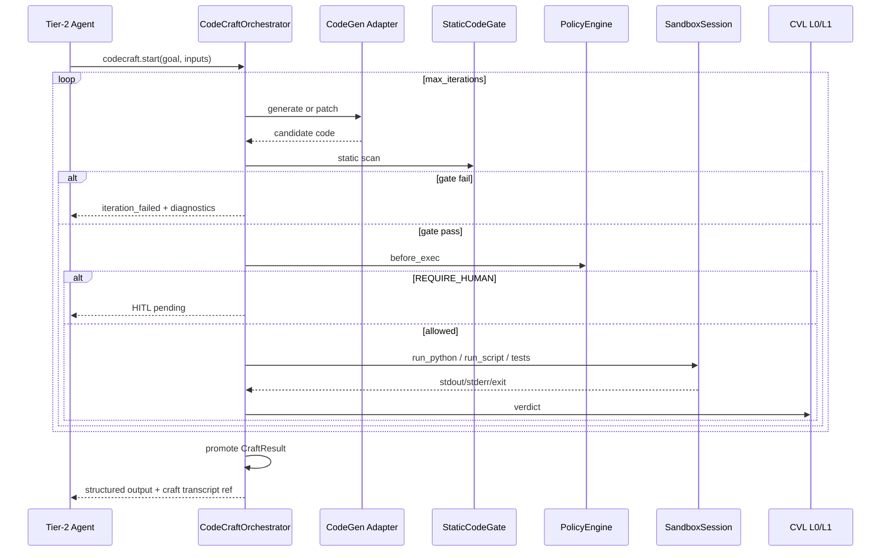

# Ephemeral Code Craft (ECC)

**Status:** Canonical architecture (domain pair 1:1)  
**Hub:** [`intergrax_runtime_architecture.md`](../intergrax_runtime_architecture.md)  
**Plan (1:1):** [`plan/CODE_CRAFT.md`](../plan/CODE_CRAFT.md)  
**Target:** [`IDEAL_HARNESS_AI_ARCHITECTURE.md`](../guides/IDEAL_HARNESS_AI_ARCHITECTURE.md) §3.6  
**ADR:** [`adr/entries/2026-06-10/ADR-CODECRAFT-001.md`](../adr/entries/2026-06-10/ADR-CODECRAFT-001.md)  
**Audit layer:** 11b (Ephemeral Code Craft)  
**Audit instruction:** [`guides/audit/CODE_CRAFT.md`](../guides/audit/CODE_CRAFT.md)  
**Implementation:** `intergrax/codecraft/` · `intergrax/runtime/codecraft/` · `intergrax/tools/providers/codecraft/`  
**Last updated:** 2026-06-13 — layer completion audit; **ECC-0…ECC-6 Done**

---

## 1. Purpose

**Ephemeral Code Craft (ECC)** is the Harness AI subsystem that lets agents **synthesize, execute, test, iteratively refine, and promote** short-lived executable helpers when catalog tools are insufficient.

> **Like a developer writing a helper function not in the spec** — use the result, discard the code.

ECC answers:

- **When** may an agent generate and run code? (profile + policy)
- **How** is code generated, gated, executed, and verified? (orchestrator + CVL)
- **What** returns to the main pipeline? (typed `CraftResult` promotion)
- **Where** does execution run? (sandbox substrate — local, container, or cloud)
- **Who** audits the path? (trace spine + sandbox audit + optional HITL)

**Strategic positioning:** The Harness owns **how** ephemeral code runs; agents own **what goal** to achieve and **when** to invoke `codecraft.*`.

**Not ECC:** permanent tool catalog expansion, Tier-2 agent-local subprocess loops, or a second sandbox runtime.

---

## 2. Problem statement

| Gap (pre-ECC) | Impact |
|---------------|--------|
| No harness-level generate→test→fix loop | Each agent reimplements iteration in UAEP steps |
| `sandbox.refactor_loop` skill is composition only | No `CodeCraftOrchestrator` executor |
| `AUDIT-IDEAL-11.1` covers single-shot sandbox | False sense of completeness for autonomous code synthesis |
| Ephemeral helpers could pollute ToolRegistry | No task-scoped ephemeral tool semantics |
| Local `SandboxSession` is workspace isolation, not OS sandbox | Production risk if treated as full security boundary |
| Weak promotion contract | stdout-only; no typed handoff to `structured_data` / ArtifactStore |

ECC closes these gaps **without** violating tier boundaries or duplicating CVL / sandbox.

---

## 3. Terminology

| Term | Meaning in Intergrax |
|------|----------------------|
| **ECC** | Ephemeral Code Craft — this domain |
| **Code craft session** | `craft_id`-scoped mission: goal, iterations, files, verdict, promotion |
| **Ephemeral tool** | Task-scoped capability visible only inside `craft_id` — not in global catalog |
| **Promotion** | Typed export of craft output to agent pipeline (`CraftResult`) |
| **Substrate** | `SandboxSession` / `HostedSandboxSession` — execution isolation primitive |
| **Static gate (L0)** | AST/import/size/forbidden-pattern scan before execution |
| **Craft mode** | `disabled` \| `dry_run` \| `assist_only` \| `supervised` \| `autonomous` |
| **Isolation tier** | `local` \| `container` \| `cloud` — backend strength for exec |

**Distinction from Application Environment vs Runtime Sandbox:** see [`PLATFORM_FOUNDATION.md`](PLATFORM_FOUNDATION.md) §7.4.9. ECC runs **inside** a Tier-3 host on Tier-1 runtime sandbox — it does not create a new application directory.

---

## 4. Design principles

1. **Reuse before create** — compose `runtime/sandbox/`, `ToolRuntime`, CVL L0/L1, `security.scan`, `sandbox_host` integrations.
2. **Harness orchestrates, agents declare goals** — Tier-2 invokes `codecraft.*`; no craft loops in agent modules.
3. **Ephemeral by default** — generated code and virtual tools die with `craft_id` unless explicitly promoted as artifacts.
4. **L0 before exec** — static gate always runs before `run_python` / `run_script` in autonomous modes.
5. **Judge separation** — code-generation LLM profile MUST differ from producer agent profile (same rule as CVL).
6. **Fail closed** — missing profile, missing sandbox session, or policy deny → `DENIED`, never host subprocess fallback.
7. **Trace everything** — `CODECRAFT_*` events correlated with `sandbox_session_id`, `task_id`, `run_id`.
8. **Tier discipline** — Nexus/UAEP orchestrates; Tier-3 selects `CodeCraftProfile`; Tier-2 supplies goals only.

---

## 5. Position in the four-tier model

```text
Tier-3  ApplicationEnvironmentProfile.codecraft_profile
        IntegrationProfile.sandbox_host (optional cloud)
        ToolProfile + SkillProfile (codecraft.* enabled)
        │
Tier-1  CodeCraftOrchestrator          intergrax/runtime/codecraft/
        UAEP BoundToolGateway · PolicyEngine · HitlRunner · CVL hooks
        │
Tier-0  intergrax/codecraft/           engine + codecraft.* tool providers
        intergrax/tools/providers/codecraft/
        │
        ▼ substrate (existing — not ECC-owned)
Tier-1  intergrax/runtime/sandbox/     SandboxSession · SandboxSessionManager
Tier-0  intergrax/tools/providers/sandbox/   code.exec · sandbox.exec
```

**Stack relation:**

```text
Integration (sandbox_host)  →  Sandbox substrate  →  ECC engine  →  codecraft.* tools  →  Agent (UAEP)
```

Skills may bundle `codecraft.*` (e.g. `codecraft.ephemeral_builder`) — skills **compose**, ECC **orchestrates**.

---

## 6. Component architecture

```text
Tier-3  ApplicationEnvironmentProfile
           └── codecraft_profile          CodeCraftProfile (mode, limits, isolation, HITL)

Tier-1  Ephemeral Code Craft Layer
           ├── CodeCraftOrchestrator      ← single entry: start / iterate / run / promote / dispose
           ├── CodeCraftSessionManager    ← craft_id lifecycle per tenant/task
           ├── CodeCraftPolicyBridge      ← profile + PolicyEngine → allow/deny/HITL
           ├── CraftTestRunner            ← pytest or custom command in sandbox
           ├── CraftResultPromoter        ← CraftResult → structured_data / ArtifactStore
           ├── EphemeralToolRegistry      ← task-scoped virtual tools (not global catalog)
           └── CodeCraftTraceEmitter      ← CODECRAFT_* events

Tier-0  Primitives
           ├── StaticCodeGate             ← AST, imports, size, secrets patterns
           ├── CodeGenerationAdapter      ← LLM code gen (separate profile ref)
           ├── tools: codecraft.*         ← LLM-invokable facade
           └── contracts                  ← CodeCraftSession, CraftResult, IterationRecord

Substrate (reuse)
           ├── SandboxSession / HostedSandboxSession
           ├── code.exec / script.run (low-level escape hatch)
           └── security.scan (optional pre-exec)
```

### 6.1 CodeCraftOrchestrator (Tier-1)

**Module:** `intergrax/runtime/codecraft/orchestrator.py` **Done** (ECC-2)

**Responsibilities:**

- Open `craft_id` with goal, input artifacts, constraints.
- Run iteration loop: generate/patch → static gate → policy → optional HITL → sandbox exec → tests → CVL verdict.
- Promote `CraftResult` or return partial diagnostics.
- Dispose session and ephemeral registry entries.

**Non-responsibilities:** Domain business rubrics (Tier-2), permanent tool registration, raw vendor SDK access.

### 6.2 CodeCraftProfile (Tier-3)

Typed profile on `ApplicationEnvironmentProfile`:

| Field | Purpose |
|-------|---------|
| `mode` | `disabled` \| `dry_run` \| `assist_only` \| `supervised` \| `autonomous` |
| `isolation_tier` | `local` \| `container` \| `cloud` |
| `sandbox_host_slug` | `e2b` \| `modal` \| `daytona` when `cloud` |
| `allowed_languages` | Default `["python"]` |
| `forbidden_imports` | Extendable deny list (`os`, `subprocess`, `socket`, …) |
| `max_code_bytes` | Per-iteration size cap |
| `max_iterations` | Loop budget |
| `max_total_exec_time_s` | Cumulative sandbox CPU time |
| `require_tests` | Mandate test command before promotion |
| `test_command_template` | e.g. `pytest {path}` |
| `network_egress` | `deny` \| `allowlist` |
| `promotion_schema_ref` | Pydantic model id for L0 output validation |
| `codegen_llm_profile_ref` | Separate LLM for generation |
| `require_hitl_before_exec` | Force human gate (supervised default) |
| `security_scan_before_exec` | Invoke `security.scan` when true |

Wiring **Done** (ECC-3): `wire_application_codecraft()` → `RuntimeConfig` → `RuntimePolicyBundle` fragment `codecraft_governance` (`applications/_shared/codecraft_wiring.py`).

### 6.3 Craft modes

| Mode | Generate | Execute | Tests | Promote | HITL |
|------|----------|---------|-------|---------|------|
| `disabled` | — | — | — | — | — |
| `dry_run` | yes | no | simulated | no | optional |
| `assist_only` | yes | no | no | returns code to agent | — |
| `supervised` | yes | after approval | yes | after approval | **required** before exec |
| `autonomous` | yes | auto | auto | auto if gates pass | on policy violation only |

Override per task: `Task.metadata.codecraft_mode` (analogous to `metadata.sandbox`).

---

## 7. Tool surface (`codecraft.*`)

Catalog tools **Done** (ECC-1…ECC-5) — all route through `ToolRuntime`:

| tool_id | Role |
|---------|------|
| `codecraft.start` | Open session: `goal`, `input_artifacts`, `constraints` |
| `codecraft.run` | Single-shot: generate + gate + exec (lightweight) |
| `codecraft.iterate` | One loop iteration: optional patch + exec + test |
| `codecraft.get_state` | Session state, logs, files, iteration metrics |
| `codecraft.promote` | Explicit promotion (`supervised` mode) |
| `codecraft.dispose` | Release resources |
| `codecraft.list_ephemeral_tools` | Introspection for active craft session |

**Low-level primitives remain:** `code.exec`, `sandbox.exec`, `script.run` — for direct agent use when full ECC loop is not needed. ECC is the **governed orchestration path**; primitives are **substrate escape hatches**.

---

## 8. Iteration flow



**CVL integration:** ECC uses `CriticOrchestrator` / L0Gateway for structural verdicts — not a parallel critic stack. Semantic pass optional via `eval.judge` when profile enables L1.

---

## 9. Security and isolation

### 9.1 Defense in depth

```text
[1] ToolAccessPolicy + AgentContract.allowed_tools
[2] CodeCraftProfile.mode and limits
[3] StaticCodeGate (L0)
[4] security.scan (optional)
[5] Isolation tier (local < container < cloud)
[6] Runtime caps (timeout, memory, iterations)
[7] Network egress policy
[8] HITL gate (supervised / high-risk)
[9] Promotion filter (typed output only)
[10] Session cleanup (dispose + sandbox cleanup)
```

### 9.2 Isolation tier guidance

| Tier | Backend | Use when |
|------|---------|----------|
| `local` | `SandboxSession` subprocess in workspace root | Lab, dev, low-trust data only |
| `container` | Future: OCI-isolated runner | Staging |
| `cloud` | `HostedSandboxSession` via `sandbox_host` | Production, regulated, untrusted codegen |

**Audit note:** Local sandbox is **workspace isolation**, not OS-level containment. Production regulated profiles MUST use `cloud` or `container`.

---

## 10. Observability

### 10.1 Event taxonomy

| Event | Payload highlights |
|-------|-------------------|
| `CODECRAFT_SESSION_OPENED` | `craft_id`, `mode`, `isolation_tier`, goal hash |
| `CODECRAFT_GENERATION` | iteration, `model_id`, token usage |
| `CODECRAFT_STATIC_GATE` | pass/fail, `rule_ids` |
| `CODECRAFT_EXEC` | `sandbox_session_id`, duration, exit_code |
| `CODECRAFT_TEST` | command, pass/fail |
| `CODECRAFT_ITERATION_VERDICT` | continue / revise / promote / abort |
| `CODECRAFT_HITL_REQUESTED` | reason |
| `CODECRAFT_PROMOTED` | schema id, artifact refs |
| `CODECRAFT_DISPOSED` | cleanup status |

Correlation: `craft_id` ↔ `sandbox_session_id` ↔ `task_id` ↔ `run_id` ↔ `correlation_id`.

### 10.2 Metrics (planned)

- Iterations to success, static gate failure rate, exec vs generation time ratio, token cost per craft, HITL rate in supervised mode.

Canon cross-ref: [`OBSERVABILITY.md`](OBSERVABILITY.md) · [`TOOLS.md`](TOOLS.md) §Tool execution pipeline.

---

## 11. Cross-domain integration matrix

| Domain | Relationship |
|--------|--------------|
| **TOOLS** | Registers `codecraft.*`; retains `code.exec` as substrate |
| **SKILLS** | `codecraft.ephemeral_builder` bundle composes tool_ids |
| **INTEGRATIONS** | `sandbox_host`, `security_scanner` |
| **LLM_ADAPTERS** | Separate codegen profile |
| **UNIFIED_EXECUTION_RUNTIME** | Policy bundle, UAEP hooks, §42.12 ToolRuntime |
| **CRITIC_VERIFICATION** | L0/L1 verdicts, evaluator-loop pattern reuse |
| **RELIABILITY_FAILURE_AND_HITL** | Sandbox/shadow substrate, cleanup, HITL |
| **OBSERVABILITY** | Event spine |
| **NEXUS_EXECUTION_FLOW** | Optional `CodeCraftNode` in graph specs |
| **ORCHESTRATION** | Subtask / branch delegation |
| **TIER3_APPLICATION_ENVIRONMENT** | `CodeCraftProfile` wiring |
| **ADAPTIVE_HARNESS_INTELLIGENCE** | L4 trigger: when to invoke craft (ECC-6) |

---

## 12. Current state vs target (summary)

| Capability | Status (2026-06-13) | Notes |
|------------|----------------------|-------|
| Isolated exec | **Done** — `runtime/sandbox/`, `code.exec` | Substrate reused |
| Cloud sandbox | **Done** — `HostedSandboxSession`, e2b/modal/daytona | ECC-4 default for regulated hosts |
| Tool policy | **Done** — `SANDBOX_REQUIRED_TOOLS`, UAEP gateway | Extended for `codecraft.*` |
| Harness craft loop | **Done** — `CodeCraftOrchestrator` | ECC-2 |
| Ephemeral tool registry | **Done** — task-scoped registry | ECC-5 |
| CodeCraftProfile | **Done** — Tier-3 profile | ECC-3 |
| Static code gate | **Done** — `StaticCodeGate` | ECC-1 |
| Promotion contract | **Done** — `CraftResult` | ECC-3 |
| CODECRAFT trace events | **Done** — `CodeCraftTraceEmitter` | ECC-1+; full `RuntimeEventType` enum extension deferred |
| Graph node | **Done** — optional `CodeCraftNode` | ECC-5 |
| AHI adaptive trigger | **Done** — `adaptive_trigger.py` | ECC-6 |
| Metrics dashboards | **Planned** | Iteration success rate, gate failure rate — §10.2 |

**Maturity:** **L3** — ECC-0…ECC-6 closed (2026-06-13). Depth work = metrics spine + container isolation tier.

---

## 13. Anti-patterns

| Anti-pattern | Why forbidden |
|--------------|---------------|
| Craft loop in Tier-2 agent | Bypasses policy, untestable, duplicates Harness |
| Register ephemeral tools in global ToolRegistry | Catalog pollution |
| New parallel sandbox runtime | Violates §5.2 reuse |
| Direct `subprocess` in agents | Violates UAEP §42.12 |
| ECC without sandbox session | Fail-closed — no host exec fallback |
| Treating local sandbox as production security | Misleading isolation guarantee |

---

## 14. Related documentation

| Document | Role |
|----------|------|
| [`plan/CODE_CRAFT.md`](../plan/CODE_CRAFT.md) | Full audit register + ECC-0…ECC-6 implementation phases |
| [`TOOLS.md`](TOOLS.md) | Catalog primitives `code.exec`, `sandbox.exec` |
| [`SKILLS.md`](SKILLS.md) | `sandbox.code_exec`, `sandbox.refactor_loop` compositions |
| [`RELIABILITY_FAILURE_AND_HITL.md`](RELIABILITY_FAILURE_AND_HITL.md) | Sandbox/shadow isolation |
| [`CRITIC_VERIFICATION.md`](CRITIC_VERIFICATION.md) | Verification loop reuse |
| [`guides/AGENT_CREATION_GUIDE.md`](../guides/AGENT_CREATION_GUIDE.md) Appendix B | Shadow workspace + sandbox task flags |

---

## 15. Implementation status

| Phase | Scope | Status |
|-------|-------|--------|
| ECC-0 | ADR + domain pair docs | **Done** (2026-06-10) |
| ECC-1 | `codecraft.run` + static gate + trace | **Done** (2026-06-13) |
| ECC-2 | Session loop `start/iterate/dispose` | **Done** (2026-06-13) |
| ECC-3 | Modes + HITL + promotion | **Done** (2026-06-13) |
| ECC-4 | Cloud sandbox default + security.scan | **Done** (2026-06-13) |
| ECC-5 | Ephemeral tool registry + graph node | **Done** (2026-06-13) |
| ECC-6 | AHI adaptive trigger | **Done** (2026-06-13) |

Detail: [`plan/CODE_CRAFT.md`](../plan/CODE_CRAFT.md).

---

## 16. Implementation module map

Tier-0 contracts and gate (ECC-1+):

| Module | Responsibility |
|--------|----------------|
| `intergrax/codecraft/contracts.py` | `CraftResult`, `StaticGateResult`, session I/O models |
| `intergrax/codecraft/profile.py` | `CodeCraftProfile`, `CraftMode` |
| `intergrax/codecraft/static_gate.py` | `StaticCodeGate` — AST, imports, size, forbidden patterns |
| `intergrax/codecraft/codegen_adapter.py` | LLM code generation (ECC-2) |
| `intergrax/codecraft/test_runner.py` | `CraftTestRunner` (ECC-2) |
| `intergrax/codecraft/promoter.py` | `CraftResultPromoter` (ECC-3) |

Tier-1 runtime orchestration:

| Module | Responsibility |
|--------|----------------|
| `intergrax/runtime/codecraft/orchestrator.py` | `CodeCraftOrchestrator` (ECC-2) |
| `intergrax/runtime/codecraft/session_manager.py` | `craft_id` lifecycle (ECC-2) |
| `intergrax/runtime/codecraft/trace.py` | `CodeCraftTraceEmitter`, `CODECRAFT_*` diagnostic steps |
| `intergrax/runtime/codecraft/ephemeral_registry.py` | Task-scoped tools (ECC-5) |

Tool surface (`ToolRuntime`):

| Module | Responsibility |
|--------|----------------|
| `intergrax/tools/providers/codecraft/bundle.py` | Register `codecraft.*` catalog tools |
| `intergrax/tools/providers/codecraft/service.py` | Handler services — gate + sandbox delegate |

Tier-3 wiring (ECC-3):

| Module | Responsibility |
|--------|----------------|
| `intergrax/applications/_shared/codecraft_wiring.py` | `wire_application_codecraft()` |
| `ApplicationEnvironmentProfile.codecraft_profile` | Host profile field |

**Trace integration:** `TraceComponent.CODECRAFT` diagnostic steps (`codecraft.session_opened`, `codecraft.static_gate`, …) — correlated via `craft_id`, `sandbox_session_id`, `run_id`. Full `RuntimeEventType` enum extension deferred until observability spine unifies tool-domain events.

**Policy:** `codecraft.*` tools added to `SANDBOX_REQUIRED_TOOLS` (same routing as `code.exec`). Fail-closed when `codecraft_profile` missing, `mode=disabled`, or sandbox session absent.
