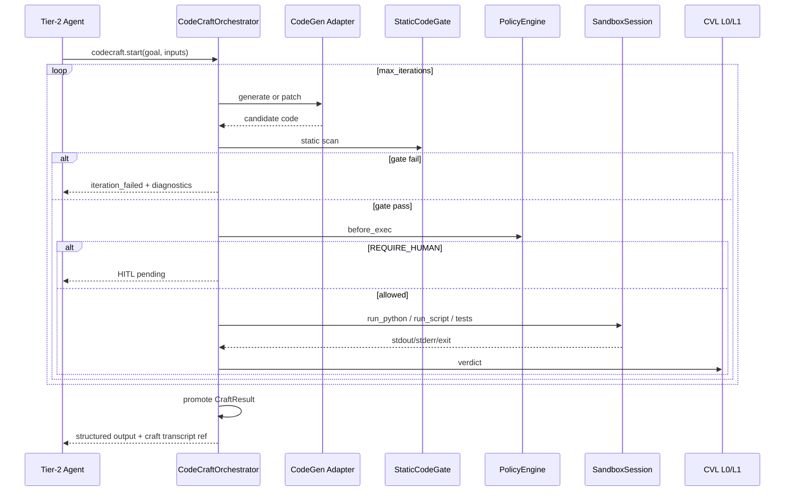

# Ephemeral Code Craft (ECC)

**Status:** Canonical architecture (domain pair 1:1)  
**Hub:** [`intergrax_runtime_architecture.md`](../intergrax_runtime_architecture.md)  
**Plan (1:1):** [`plan/CODE_CRAFT.md`](../plan/CODE_CRAFT.md)  
**Target:** [`IDEAL_HARNESS_AI_ARCHITECTURE.md`](../guides/IDEAL_HARNESS_AI_ARCHITECTURE.md) §3.6  
**ADR:** [`adr/entries/2026-06-10/ADR-CODECRAFT-001.md`](../adr/entries/2026-06-10/ADR-CODECRAFT-001.md)  
**Audit layer:** 11b (Ephemeral Code Craft)  
**Audit instruction:** [`audit/CODE_CRAFT.md`](../audit/CODE_CRAFT.md)  
**Implementation:** `intergrax/codecraft/` · `intergrax/runtime/codecraft/` · `intergrax/tools/providers/codecraft/`  
**Last updated:** 2026-06-20 — **P2-ARCH-12** CodeCraft safety boundary; ECC-0…ECC-6 + S7–S11 + §6.1av Done (L3+)

---

## Cursor read scope (token budget)

**Do not read this entire file in one session** (CODE_CRAFT canon).

- **Implement / audit default:** ephemeral codegen loop contracts. Skip LC closeout unless ECC task.
- **Use** table of contents below — `Read` with offset/limit per §.
- **Plan hub:** [`plan/CODE_CRAFT.md`](../plan/CODE_CRAFT.md) (scoped §6 only).
- **Audit slice:** [`guides/audit_slices/CODE_CRAFT.md`](../guides/audit_slices/CODE_CRAFT.md).
- **Max reads:** at most **one** file >5k tokens per session unless RESUME cites more.

---


## Architecture satellites (read on demand)

Large § blocks moved out of the architecture hub to reduce Cursor context use.
Load **only** the satellite matching your task or cited §.

| Satellite | Contents |
|-----------|----------|
| [`arch/CODE_CRAFT_scenario_catalog.md`](arch/CODE_CRAFT_scenario_catalog.md) | scenario catalog |

> **Cursor context budget:** read hub read-scope block + **at most one** satellite per session.

## 1. Purpose

**Ephemeral Code Craft (ECC)** is the Harness AI subsystem that lets agents **synthesize, execute, test, iteratively refine, and promote** short-lived executable helpers when catalog tools are insufficient.

> **Like a developer writing a helper function not in the spec** — use the result, discard the code.

ECC answers:

- **When** may an agent generate and run code? (profile + policy)
- **How** is code generated, gated, executed, and verified? (orchestrator + CVL)
- **What** returns to the main pipeline? (typed `CraftResult` promotion)
- **Where** does execution run? (sandbox substrate — local, container, or cloud)
- **Who** audits the path? (trace spine + sandbox audit + optional HITL)

**Strategic positioning:** The Harness owns **how** ephemeral code runs; agents own **what goal** to achieve and **when** to invoke `codecraft.*`.

**Not ECC:** permanent tool catalog expansion, Tier-2 agent-local subprocess loops, or a second sandbox runtime.

---

## 2. Problem statement

| Gap (pre-ECC) | Impact |
|---------------|--------|
| No harness-level generate→test→fix loop | Each agent reimplements iteration in UAEP steps |
| `sandbox.refactor_loop` skill is composition only | No `CodeCraftOrchestrator` executor |
| `AUDIT-IDEAL-11.1` covers single-shot sandbox | False sense of completeness for autonomous code synthesis |
| Ephemeral helpers could pollute ToolRegistry | No task-scoped ephemeral tool semantics |
| Local `SandboxSession` is workspace isolation, not OS sandbox | Production risk if treated as full security boundary |
| Weak promotion contract | stdout-only; no typed handoff to `structured_data` / ArtifactStore |

ECC closes these gaps **without** violating tier boundaries or duplicating CVL / sandbox.

---

## 3. Terminology

| Term | Meaning in Intergrax |
|------|----------------------|
| **ECC** | Ephemeral Code Craft — this domain |
| **Code craft session** | `craft_id`-scoped mission: goal, iterations, files, verdict, promotion |
| **Ephemeral tool** | Task-scoped capability visible only inside `craft_id` — not in global catalog |
| **Promotion** | Typed export of craft output to agent pipeline (`CraftResult`) |
| **Substrate** | `SandboxSession` / `HostedSandboxSession` — execution isolation primitive |
| **Static gate (L0)** | AST/import/size/forbidden-pattern scan before execution |
| **Craft mode** | `disabled` \| `dry_run` \| `assist_only` \| `supervised` \| `autonomous` |
| **Isolation tier** | `local` \| `container` \| `cloud` — backend strength for exec |

**Distinction from Application Environment vs Runtime Sandbox:** see [`PLATFORM_FOUNDATION.md`](PLATFORM_FOUNDATION.md) §7.4.9. ECC runs **inside** a Tier-3 host on Tier-1 runtime sandbox — it does not create a new application directory.

---

## 4. Design principles

1. **Reuse before create** — compose `runtime/sandbox/`, `ToolRuntime`, CVL L0/L1, `security.scan`, `sandbox_host` integrations.
2. **Harness orchestrates, agents declare goals** — Tier-2 invokes `codecraft.*`; no craft loops in agent modules.
3. **Ephemeral by default** — generated code and virtual tools die with `craft_id` unless explicitly promoted as artifacts.
4. **L0 before exec** — static gate always runs before `run_python` / `run_script` in autonomous modes.
5. **Judge separation** — code-generation LLM profile MUST differ from producer agent profile (same rule as CVL).
6. **Fail closed** — missing profile, missing sandbox session, or policy deny → `DENIED`, never host subprocess fallback.
7. **Trace everything** — `CODECRAFT_*` events correlated with `sandbox_session_id`, `task_id`, `run_id`.
8. **Tier discipline** — Nexus/UAEP orchestrates; Tier-3 selects `CodeCraftProfile`; Tier-2 supplies goals only.

---

## 5. Position in the four-tier model

```text
Tier-3  ApplicationEnvironmentProfile.codecraft_profile
        IntegrationProfile.sandbox_host (optional cloud)
        ToolProfile + SkillProfile (codecraft.* enabled)
        │
Tier-1  CodeCraftOrchestrator          intergrax/runtime/codecraft/
        UAEP BoundToolGateway · PolicyEngine · HitlRunner · CVL hooks
        │
Tier-0  intergrax/codecraft/           engine + codecraft.* tool providers
        intergrax/tools/providers/codecraft/
        │
        ▼ substrate (existing — not ECC-owned)
Tier-1  intergrax/runtime/sandbox/     SandboxSession · SandboxSessionManager
Tier-0  intergrax/tools/providers/sandbox/   code.exec · sandbox.exec
```

**Stack relation:**

```text
Integration (sandbox_host)  →  Sandbox substrate  →  ECC engine  →  codecraft.* tools  →  Agent (UAEP)
```

Skills may bundle `codecraft.*` (e.g. `codecraft.ephemeral_builder`) — skills **compose**, ECC **orchestrates**.

---

## 6. Component architecture

```text
Tier-3  ApplicationEnvironmentProfile
           └── codecraft_profile          CodeCraftProfile (mode, limits, isolation, HITL)

Tier-1  Ephemeral Code Craft Layer
           ├── CodeCraftOrchestrator      ← single entry: start / iterate / run / promote / dispose
           ├── CodeCraftSessionManager    ← craft_id lifecycle per tenant/task
           ├── CodeCraftPolicyBridge      ← profile + PolicyEngine → allow/deny/HITL (inlined: orchestrator + `codecraft_governance` fragment — no standalone module)
           ├── CraftTestRunner            ← pytest or custom command in sandbox
           ├── CraftResultPromoter        ← CraftResult → structured_data / ArtifactStore
           ├── EphemeralToolRegistry      ← task-scoped virtual tools (not global catalog)
           └── CodeCraftTraceEmitter      ← CODECRAFT_* events

Tier-0  Primitives
           ├── StaticCodeGate             ← AST, imports, size, secrets patterns
           ├── CodeGenerationAdapter      ← LLM code gen (separate profile ref)
           ├── tools: codecraft.*         ← LLM-invokable facade
           └── contracts                  ← CodeCraftSession, CraftResult, IterationRecord

Substrate (reuse)
           ├── SandboxSession / HostedSandboxSession
           ├── code.exec / script.run (low-level escape hatch)
           └── security.scan (optional pre-exec)
```

### 6.1 CodeCraftOrchestrator (Tier-1)

**Module:** `intergrax/runtime/codecraft/orchestrator.py` **Done** (ECC-2)

**Responsibilities:**

- Open `craft_id` with goal, input artifacts, constraints.
- Run iteration loop: generate/patch → static gate → policy → optional HITL → sandbox exec → tests → CVL verdict.
- Promote `CraftResult` or return partial diagnostics.
- Dispose session and ephemeral registry entries.

**Non-responsibilities:** Domain business rubrics (Tier-2), permanent tool registration, raw vendor SDK access.

### 6.2 CodeCraftProfile (Tier-3)

Typed profile on `ApplicationEnvironmentProfile`:

| Field | Purpose |
|-------|---------|
| `mode` | `disabled` \| `dry_run` \| `assist_only` \| `supervised` \| `autonomous` |
| `isolation_tier` | `local` \| `container` \| `cloud` |
| `sandbox_host_slug` | `e2b` \| `modal` \| `daytona` when `cloud` |
| `allowed_languages` | Default `["python"]` |
| `forbidden_imports` | Extendable deny list (`os`, `subprocess`, `socket`, …) |
| `max_code_bytes` | Per-iteration size cap |
| `max_iterations` | Loop budget |
| `max_total_exec_time_s` | Cumulative sandbox CPU time |
| `require_tests` | Mandate test command before promotion |
| `test_command_template` | e.g. `pytest {path}` |
| `network_egress` | `deny` \| `allowlist` |
| `promotion_schema_ref` | Pydantic model id for L0 output validation |
| `codegen_llm_profile_ref` | Separate LLM for generation |
| `require_hitl_before_exec` | Force human gate (supervised default) |
| `security_scan_before_exec` | Invoke `security.scan` when true |

Wiring **Done** (ECC-3): `wire_application_codecraft()` → `RuntimeConfig` → `RuntimePolicyBundle` fragment `codecraft_governance` (`applications/_shared/codecraft_wiring.py`).

### 6.3 Craft modes

| Mode | Generate | Execute | Tests | Promote | HITL |
|------|----------|---------|-------|---------|------|
| `disabled` | — | — | — | — | — |
| `dry_run` | yes | no | simulated | no | optional |
| `assist_only` | yes | no | no | returns code to agent | — |
| `supervised` | yes | after approval | yes | after approval | **required** before exec |
| `autonomous` | yes | auto | auto | auto if gates pass | on policy violation only |

Override per task: `Task.metadata.codecraft_mode` (analogous to `metadata.sandbox`) — **Done** (ECC-MAINT-01); host profile remains default when metadata absent.

---

## 7. Tool surface (`codecraft.*`)

Catalog tools **Done** (ECC-1…ECC-5) — all route through `ToolRuntime`:

| tool_id | Role |
|---------|------|
| `codecraft.start` | Open session: `goal`, `input_artifacts`, `constraints` |
| `codecraft.run` | Single-shot: generate + gate + exec (lightweight) |
| `codecraft.iterate` | One loop iteration: optional patch + exec + test |
| `codecraft.get_state` | Session state, logs, files, iteration metrics |
| `codecraft.promote` | Explicit promotion (`supervised` mode) |
| `codecraft.dispose` | Release resources |
| `codecraft.list_ephemeral_tools` | Introspection for active craft session |

**Low-level primitives remain:** `code.exec`, `sandbox.exec`, `script.run` — for direct agent use when full ECC loop is not needed. ECC is the **governed orchestration path**; primitives are **substrate escape hatches**.

---

## 8. Iteration flow



**CVL integration:** ECC uses `CriticOrchestrator` / L0Gateway for structural verdicts — not a parallel critic stack. Semantic pass optional via `eval.judge` when profile enables L1.

---

## 9. Security and isolation

### 9.1 Defense in depth

```text
[1] ToolAccessPolicy + AgentContract.allowed_tools
[2] CodeCraftProfile.mode and limits
[3] StaticCodeGate (L0)
[4] security.scan (optional)
[5] Isolation tier (local < container < cloud)
[6] Runtime caps (timeout, memory, iterations)
[7] Network egress policy
[8] HITL gate (supervised / high-risk)
[9] Promotion filter (typed output only)
[10] Session cleanup (dispose + sandbox cleanup)
```

### 9.2 Isolation tier guidance

| Tier | Backend | Use when |
|------|---------|----------|
| `local` | `SandboxSession` subprocess in workspace root | Lab, dev, low-trust data only |
| `container` | Future: OCI-isolated runner | Staging |
| `cloud` | `HostedSandboxSession` via `sandbox_host` | Production, regulated, untrusted codegen |

**Audit note:** Local sandbox is **workspace isolation**, not OS-level containment. Production regulated profiles MUST use `cloud` or `container`.

---

## 10. Observability

### 10.1 Event taxonomy

| Event | Payload highlights | Trace step (shipped) |
|-------|-------------------|----------------------|
| `CODECRAFT_SESSION_OPENED` | `craft_id`, `mode`, `isolation_tier`, goal hash | `codecraft.session_opened` **Done** |
| `CODECRAFT_GENERATION` | iteration, `model_id`, token usage | `codecraft.generation` **Done** |
| `CODECRAFT_STATIC_GATE` | pass/fail, `rule_ids` | `codecraft.static_gate` **Done** |
| `CODECRAFT_EXEC` | `sandbox_session_id`, duration, exit_code | `codecraft.exec` **Done** |
| `CODECRAFT_TEST` | command, pass/fail | `codecraft.test` **Done** |
| `CODECRAFT_ITERATION_VERDICT` | continue / revise / promote / abort | `codecraft.iteration_verdict` **Done** |
| `CODECRAFT_HITL_REQUESTED` | reason | `codecraft.hitl_requested` **Done** |
| `CODECRAFT_PROMOTED` | schema id, artifact refs | `codecraft.promoted` **Done** |
| `CODECRAFT_DISPOSED` | cleanup status | `codecraft.disposed` **Done** |

Correlation: `craft_id` ↔ `sandbox_session_id` ↔ `task_id` ↔ `run_id` ↔ `correlation_id`.

### 10.2 Metrics (shipped — ECC-MAINT-04)

- Iterations to success, static gate failure rate, exec vs generation time ratio, token cost per craft, HITL rate in supervised mode.
- Emitted via ``codecraft.metrics_snapshot`` trace step and ``CodeCraftMetricsSnapshot.to_panel()`` (`runtime/codecraft/trace.py`).

Canon cross-ref: [`OBSERVABILITY.md`](OBSERVABILITY.md#observability-event-spine) · [`TOOLS.md`](TOOLS.md) §Tool execution pipeline · [`CRITIC_VERIFICATION.md`](CRITIC_VERIFICATION.md#verification-safety-boundaries) · [`SYSTEM_INVARIANTS.md`](../guides/SYSTEM_INVARIANTS.md) §10 · [`MATURITY_TAXONOMY.md`](../guides/MATURITY_TAXONOMY.md).

---

## CodeCraft Safety Boundary

CodeCraft may synthesize, test and execute short-lived helper code **only** through approved sandbox, policy, observability and verification mechanisms.

CodeCraft **MUST NOT** become a second autonomous runtime, private tool system or unrestricted code execution channel.

ECC is a **controlled, auditable, sandboxed auxiliary mechanism** — not an alternate AgentEngine, Nexus loop, or agent-local subprocess runtime. Agents declare goals and invoke `codecraft.*` through `ToolRuntime`; the Harness owns orchestration, gating, execution substrate, verification and promotion boundaries.

**Cross-refs:** [`SYSTEM_INVARIANTS.md`](../guides/SYSTEM_INVARIANTS.md) §10 · [`MATURITY_TAXONOMY.md`](../guides/MATURITY_TAXONOMY.md) · [`TOOLS.md`](TOOLS.md) · [`SKILLS.md`](SKILLS.md) · [`UNIFIED_EXECUTION_RUNTIME.md`](UNIFIED_EXECUTION_RUNTIME.md) · [`OBSERVABILITY.md`](OBSERVABILITY.md#observability-event-spine) · [`CRITIC_VERIFICATION.md`](CRITIC_VERIFICATION.md#verification-safety-boundaries) · [`RELIABILITY_FAILURE_AND_HITL.md`](RELIABILITY_FAILURE_AND_HITL.md#attempt-ledger) · [`INTEGRATIONS.md`](INTEGRATIONS.md) · [`AGENT_CONTRACTS_AND_ASSEMBLY.md`](AGENT_CONTRACTS_AND_ASSEMBLY.md) §21

Implementation profile modes (`disabled`, `dry_run`, `assist_only`, `supervised`, `autonomous`) — §6.3 — map onto the governance-facing [execution modes](#execution-modes) below. When in doubt, treat **Lab** or **Supervised** as the safe default; **Governed production** is never implicit.

---

## Allowed CodeCraft actions

CodeCraft **MAY**:

- synthesize short-lived helper code for a bounded task,
- execute helper code only in an approved sandbox or explicitly marked lab environment,
- run deterministic tests for generated helpers,
- refine helper code based on test failures,
- return computed results to the runtime,
- preserve trace evidence of generation, execution and validation,
- request human review before risky execution or promotion,
- propose promotion of a helper into a durable tool,
- use CVL / validation before result consumption,
- use security scanning where available,
- operate in lab/test mode when clearly marked as non-production.

---

## Disallowed CodeCraft actions

CodeCraft **MUST NOT**:

- execute arbitrary code outside approved sandbox boundaries,
- access secrets unless explicitly allowed by policy and never expose them in traces/prompts,
- mutate repository files unless the task explicitly allows code modification through approved development workflow,
- perform production side effects directly,
- bypass ToolRuntime for agent-invokable side effects,
- bypass PolicyEngine,
- bypass RuntimeEvent / observability spine,
- bypass CVL / validation where required,
- create long-running background processes,
- create private schedulers, queues or HTTP servers,
- install dependencies without explicit approval/profile support,
- promote generated code into durable tools automatically,
- become a second agent runtime or orchestration engine,
- use local subprocess execution as production sandbox,
- describe CodeCraft as production-safe without maturity/evidence statement.

---

## Execution modes

Governance-facing modes for operators, reviewers and Cursor. Map to `CodeCraftProfile.mode` and isolation settings — §6.2–§6.3.

### Disabled

CodeCraft is not available.

### Lab

CodeCraft may generate and execute helper code in a developer-controlled environment.
No production workloads.
No production secrets.
No irreversible side effects.

Typical profile mapping: `dry_run`, `assist_only`, or `supervised` with `isolation_tier=local` and non-production host profile.

### Supervised

CodeCraft may propose and test helper code, but risky execution or promotion requires human approval.

Typical profile mapping: `supervised` with `require_hitl_before_exec=true`; promotion via explicit `codecraft.promote` only.

### Governed production

CodeCraft may run in production **only** when **all** conditions are met:

- approved sandbox,
- explicit CodeCraft profile,
- policy approval,
- observability coverage,
- secret isolation,
- filesystem/network limits,
- CVL / validation,
- rollback/kill behavior,
- maturity statement using [`MATURITY_TAXONOMY.md`](../guides/MATURITY_TAXONOMY.md).

**Governed production is not the default.**

Typical profile mapping: `autonomous` or `supervised` with `isolation_tier=container` or `cloud`, production `CodeCraftProfile`, and documented four-axis maturity — not `local` subprocess isolation alone.

---

## Sandbox requirements

An approved CodeCraft sandbox **SHOULD** define:

- filesystem boundaries,
- network boundaries,
- process/time limits,
- memory/CPU limits,
- dependency installation policy,
- secret access policy,
- allowed input/output channels,
- artifact retention policy,
- logging/redaction rules,
- kill/timeout behavior,
- reproducibility expectations,
- audit evidence emitted through observability spine.

A local subprocess is **not** sufficient as a production sandbox unless explicitly wrapped, constrained, audited and approved.

See also §9 (Security and isolation) and [`INTEGRATIONS.md`](INTEGRATIONS.md) (`sandbox_host` substrate).

---

## Promotion boundary

Generated helper code is **ephemeral by default** — scoped to `craft_id` and disposed unless explicitly promoted.

Promotion into durable tool/catalog code requires:

- explicit human or governance approval,
- code review,
- tests,
- security review where applicable,
- contract definition,
- ToolRuntime compatibility,
- documentation,
- maturity/evidence statement,
- traceability from generated helper to promoted artifact.

CodeCraft **MUST NOT** silently expand the durable tool catalog. `EphemeralToolRegistry` entries remain task-scoped; global catalog changes follow the Tool Library process ([`TOOLS.md`](TOOLS.md)).

---

## Cursor review checklist

Before adding or modifying CodeCraft behavior, Cursor must verify:

- [ ] Is CodeCraft disabled, lab, supervised or governed production?
- [ ] Is execution sandboxed?
- [ ] Are filesystem, network, process and secret boundaries explicit?
- [ ] Are generated artifacts ephemeral or proposed for promotion?
- [ ] If promotion is involved, is human/governance approval required?
- [ ] Are tests and validation required before result consumption?
- [ ] Are RuntimeEvent / observability records preserved?
- [ ] Are side effects routed through ToolRuntime where agent-invokable?
- [ ] Does this avoid creating a second runtime, scheduler or tool system?
- [ ] Is maturity stated using [`MATURITY_TAXONOMY.md`](../guides/MATURITY_TAXONOMY.md)?
- [ ] Does this avoid claiming production safety without evidence?

---
