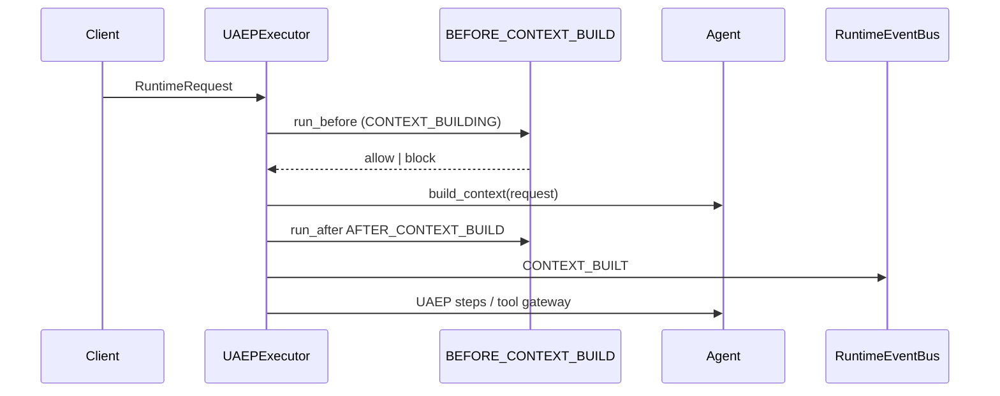
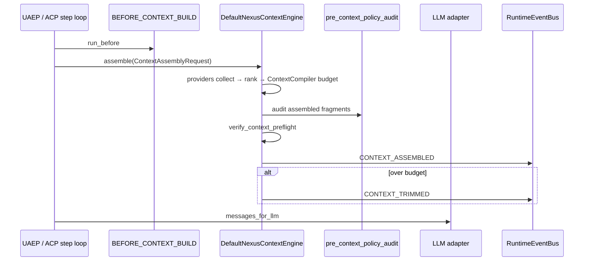
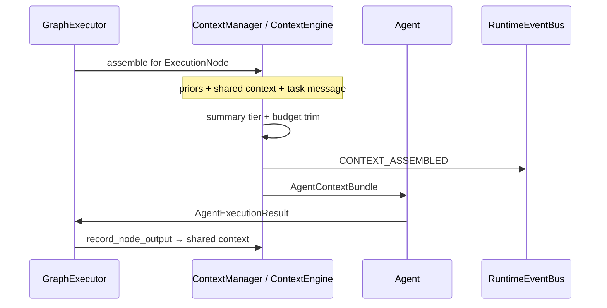

# Context Engineering

**Status:** Canonical architecture (domain pair 1:1)  
**Hub:** [`intergrax_runtime_architecture.md`](../intergrax_runtime_architecture.md)  
**Plan (1:1):** [`plan/CONTEXT_ENGINEERING.md`](../plan/CONTEXT_ENGINEERING.md)  
**Target:** [`IDEAL_HARNESS_AI_ARCHITECTURE.md`](../guides/IDEAL_HARNESS_AI_ARCHITECTURE.md) §16  
**Audit layer:** 16 (Context Engineering)  
**Audit instruction:** [`guides/audit/CONTEXT_ENGINEERING.md`](../guides/audit/CONTEXT_ENGINEERING.md)  
**ADR:** [`ADR-CTX-001`](../adr/entries/2026-06-12/ADR-CTX-001.md) · [`ADR-MEM-001`](../adr/entries/2026-06-08/ADR-MEM-001.md) (Context Compiler budget semantics)  
**Related:** [`architecture/MEMORY.md`](MEMORY.md) (stores + lifecycle) · [`architecture/RAG.md`](RAG.md) (retrieval) · [`architecture/TOOLS.md`](TOOLS.md) (tool outputs) · [`architecture/NEXUS_EXECUTION_FLOW.md`](NEXUS_EXECUTION_FLOW.md) (turn narrative) · [`architecture/OBSERVABILITY.md`](OBSERVABILITY.md) (event spine) · [`guides/AGENT_CREATION_GUIDE.md`](../guides/AGENT_CREATION_GUIDE.md) Appendix L  
**Implementation (as-built):** `intergrax/runtime/nexus/context/` · `intergrax/runtime/architecture/context_engineering.py` · `intergrax/contracts/context_assembly.py` · `applications/_shared/context_*`  
**Last architecture pass:** 2026-06-12 (domain split + FAUDIT layer 16 refresh post-ACP-CLOSE)

---

## 1. Purpose

Context Engineering (CE) is the **Tier-1 Harness engine** that decides **what information reaches the LLM** at a given execution step: which fragments to include, in what order, under what token budget, with full provenance and observability.

CE is **not** a memory store. It **consumes** outputs from:

| Source domain | What CE receives |
|---------------|------------------|
| [`MEMORY`](MEMORY.md) | Session history, LTM search hits, task KV reads (via providers) |
| [`RAG`](RAG.md) | Retrieved chunks + citations |
| [`TOOLS`](TOOLS.md) | Tool result blocks, workspace reads |
| [`ORCHESTRATION`](ORCHESTRATION.md) | Graph prior outputs, shared task context, delegation summaries |
| [`UNIFIED_EXECUTION_RUNTIME`](UNIFIED_EXECUTION_RUNTIME.md) | Policy overlays, system instructions, guardrail context |
| [`REASONING_AND_COGNITION`](REASONING_AND_COGNITION.md) | Optional `objective` / plan slice for step-aware ranking |
| [`MODALITY`](MODALITY.md) | Attachment / media summaries within budget |

**Rules:**

- Tier-2 agents MUST NOT hand-assemble production prompts from unbounded history.
- Tier-3 configures CE via `ContextProfile` and optional **plugin registration** — not agent imports of Nexus internals.
- Vendor-specific retrieval stays in Tier-0 (RAG); CE orchestrates **injection into the LLM window**.

```text
Tier-3 ContextProfile + ContextEnginePreset + context_plugins[]
  → context_runtime_bridge / context_wiring
  → ContextEngine.assemble(ContextAssemblyRequest)
  → messages_for_llm + AssembledContext (provenance, budget diag)
  → CoreLLMStep / Agent.run step
```

---

## 2. Production readiness verdict (2026-06-12)

| Question | Answer |
|----------|--------|
| Is CE **production-ready** as a **budgeted assembly spine**? | **Partial — L3 control plane / L2 engine depth** |
| Is **`ContextCompiler` on the production hot path**? | **No** — library + acceptance tests only; ACP-CLOSE removed legacy `runtime_steps` pipeline (**GAP-CTX-13** → CE-3.9) |
| Is there a **unified plugin catalog**? | **No** — target CE-1/CE-2 ([`plan/CONTEXT_ENGINEERING.md`](../plan/CONTEXT_ENGINEERING.md)) |
| Is **step-aware** assembly implemented? | **No** — graph-node trim only; ACP/UAEP lack `step_kind` (**CE-4**) |
| Is **workspace/codebase** context production-grade? | **No** — RFC spike only (`memory/workspace_index_spike.py`) |
| Observability on assembly path? | **Partial** — graph: `CONTEXT_ASSEMBLED` / `CONTEXT_TRIMMED`; UAEP: `CONTEXT_BUILT` only (**GAP-CTX-14** → CE-3.11); OTel spans CE-9 |
| Can authors register custom providers without forking Nexus? | **No** — inject `ContextManager` only; no `register_context_plugin()` |

**Remediation:** every gap maps to **GAP-CTX-\*** → **CE-\*** in the implementation plan.

---

## 3. Maturity score (audit map L0–L4)

| Dimension | Score | Notes |
|-----------|-------|-------|
| Control plane (`ContextProfile`, bridges, wiring) | **L3** | Phase CTX Done |
| Global budget / never-overflow | **L1.5** | `ContextCompiler` + `DegradationLadder` shipped; **not wired** to ACP/UAEP/graph LLM paths (CE-3.9) |
| Provenance + assembly events | **L2** | Graph: `AgentContextBundle` + `CONTEXT_ASSEMBLED`; UAEP: `CONTEXT_BUILT` without fragment lineage (CE-3.11) |
| Quality scoring (relevance/freshness/confidence) | **L2** | `context_engineering.py`; not wired in hot path |
| Plugin extensibility | **L1** | Profiles + hooks; no catalog |
| Step-aware selection | **L1** | No `ContextAssemblyRequest.step_kind` |
| Codebase-scale preset | **L1** | Spike only |
| Interactive multi-hop context loop | **L1** | Tools/RAG/delegation partial |
| OTel on compile hot path | **L1.5** | Events yes; spans CE-9 |
| Regression / drift gates | **L2.5** | `context_regression_benchmark.py` |

**Overall:** **L2 implementation / L3 control plane** — control plane and graph trim are production-usable; unified compiler spine and plugin catalog require Phase CE-EXT closeout.

**Target after CE-EXT:** **L3+ engine** · **L4** with AHI adaptive ranking (deferred to [`ADAPTIVE_HARNESS_INTELLIGENCE.md`](ADAPTIVE_HARNESS_INTELLIGENCE.md)).

---

## 4. Design principles

| Principle | Meaning in Intergrax |
|-----------|----------------------|
| **Compiler, not concatenation** | CE runs a deterministic pipeline with recorded stages — not string joins in agent code |
| **Budget-first** | Global input token budget derived from `llm_adapter.context_window_tokens` minus output reserve |
| **Step-scoped** | Assembly is keyed by **execution step** (UAEP step index or graph node + phase) — target CE-4 |
| **Source-agnostic plugins** | Each fragment has a `ContextSourceProvider`; Memory is one provider among many |
| **Provenance everywhere** | Every included/excluded fragment traceable to `source_id`, `source_type`, `degradation_step` |
| **Policy-governed** | `BEFORE_CONTEXT_BUILD` hooks + `pre_context_policy_audit` — no silent policy bypass |
| **Observable by default** | Events, structured logs, spans on collect/rank/budget/format — not optional debug |
| **Environment-driven** | `ContextProfile` on `ApplicationEnvironmentProfile` — Tier-3 owns presets |
| **Fail-safe degradation** | [`DegradationLadder`](MEMORY.md) order normative — never silent overflow |
| **Agents stay dumb about window** | Agents declare *needs* (`required_context_sources` on contract — future); CE satisfies |

---

## 5. Domain boundaries

| Concern | Owner | CE role |
|---------|-------|---------|
| Persist facts | MEMORY | Read via `MemoryContextProvider` |
| Retrieve documents | RAG | Read via `RagContextProvider` |
| Execute actions | TOOLS | Read tool output blocks via `ToolOutputContextProvider` |
| Graph priors | ORCHESTRATION | `ContextManager` / `GraphPriorContextProvider` |
| Prompt assets | AGENT_CONTRACTS (Prompt Registry) | `SystemInstructionsProvider` |
| Policy text | UAEP | `PolicyOverlayProvider` |
| **Compose LLM window** | **CONTEXT_ENGINEERING** | **Owns entire read-path orchestration** |

**Anti-pattern:** documenting CE inside MEMORY Layer C long-term — Layer C spec lives **here**; MEMORY links to this doc for read-path.

---

## 6. Tier placement

```text
Tier-0  intergrax/context/              (target CE-1) shared contracts + scoring utils — importable without Nexus
Tier-1  intergrax/runtime/nexus/context/  execution engine, ContextManager, ContextCompiler (library)
Tier-3  applications/_shared/context_*      profile bridges and wiring
```

| Component | Tier | Rationale |
|-----------|------|-----------|
| `ContextEngine`, `DefaultNexusContextEngine` | 1 | Nexus turn-critical (target CE-3) |
| `ContextCompiler`, `DegradationLadder` | 1 | Budget allocator (shipped; hot-path wiring CE-3.9) |
| `ContextSourceProvider` Protocol | 0 contracts / 1 runtime | Plugins may ship in apps or `intergrax/context/providers/` |
| `context_engineering.py` (scoring) | 1 architecture helpers | Move shared types to Tier-0 in CE-1 |
| `ContextProfile` | 3 contract | Environment composition root |

---

## 7. Core domain model

### 7.1 Context fragment lifecycle

```text
ContextAssemblyRequest
  → COLLECT   (providers emit ContextFragment candidates)
  → NORMALIZE (schema_version, dedup keys, content_hash)
  → SCORE     (relevance, freshness, confidence → composite)
  → FILTER    (thresholds, policy, poisoning rules)
  → RANK      (mandatory first, then score desc)
  → BUDGET    (token allocation + degradation ladder)
  → COMPRESS  (summarize tiers, semantic compression flag)
  → FORMAT    (ChatMessage[] or AgentContextBundle.message)
  → VALIDATE  (preflight never-overflow + citation requirements)
  → EMIT      (events, spans, trace records)
```

### 7.2 Primary types (target contracts — CE-1)

```python
# intergrax/context/contracts.py (target Tier-0)

class ContextFragmentSource(str, Enum):
    TASK_MESSAGE = "task_message"
    SYSTEM_INSTRUCTIONS = "system_instructions"
    SESSION_HISTORY = "session_history"
    SESSION_HISTORY_SEMANTIC = "session_history_semantic"  # MEM-VEC-2.4 — episodic vector recall hits
    LONGTERM_MEMORY = "longterm_memory"
    RAG = "rag"
    WEBSEARCH = "websearch"
    TOOL_OUTPUT = "tool_output"
    GRAPH_PRIOR = "graph_prior"
    SHARED_CONTEXT = "shared_context"
    ATTACHMENT = "attachment"
    POLICY_OVERLAY = "policy_overlay"
    WORKSPACE = "workspace"
    CUSTOM = "custom"

@dataclass(frozen=True)
class ContextFragment:
    fragment_id: str
    source: ContextFragmentSource
    source_id: str              # stable id for provenance
    content: str
    token_estimate: int
    relevance_score: float      # 0..1
    freshness_score: float
    confidence_score: float
    mandatory: bool             # never drop unless hard trim
    metadata: dict[str, Any]    # citations, path, line_range, tool_call_id
    content_hash: str           # dedup

@dataclass(frozen=True)
class ContextAssemblyRequest:
  """What CE needs to assemble context for ONE model call."""
    trace_id: str
    run_id: str
    task_id: str
    tenant_id: str
    # Step identity (CE-4)
    assembly_scope: Literal["uaep_turn", "graph_node", "delegation_child", "acp_step"]
    step_index: int | None
    graph_node_id: str | None
    step_kind: str | None         # e.g. plan | tool_call | synthesize | explore
    objective: str                # current sub-goal (may differ from full task message)
    # Policy
    decision_profile: ContextDecisionProfile
    budget_policy: ContextBudgetPolicy
    assembly_options: TaskContextAssemblyOptions
    # Capability hints
    required_sources: frozenset[ContextFragmentSource]
    excluded_sources: frozenset[ContextFragmentSource]
    # Runtime handles (injected by Nexus — not serialized)
    runtime_config: RuntimeConfig  # via context var / engine ctx — not in logs

@dataclass(frozen=True)
class AssembledContext:
    messages: list[ChatMessage]
    fragments_included: list[ContextFragment]
    fragments_excluded: list[tuple[ContextFragment, str]]  # reason
    provenance: list[ContextProvenance]
    total_tokens: int
    budget_tokens: int
    degradation_steps: tuple[str, ...]
    schema_version: str = "assembled_context.v1"
```

### 7.3 As-built types (today)

| Type | Module | Status |
|------|--------|--------|
| `ContextCandidate` | `context_compiler_models.py` | **Shipped** — message-index based |
| `AgentContextBundle` | `context_manager.py` | **Shipped** — graph path |
| `ContextProvenance` | `context_models.py` | **Shipped** |
| `ContextChunkSignal` | `context_engineering.py` | **Shipped** — quality eval only |
| `ContextAssemblyRequest` | `intergrax/context/contracts.py` | **Shipped** (CE-1.2) — step fields populated in CE-4 |
| `ContextFragment` | `intergrax/context/contracts.py` | **Shipped** (CE-1.1) |
| `ContextPluginRegistry` | `intergrax/context/registry.py` | **Shipped** (CE-1.4) |

---

## 8. Plugin system architecture

CE follows the same **catalog pattern** as Integration / Tool / Skill libraries ([`EXTENSION_AUTHOR_GUIDE.md`](../guides/EXTENSION_AUTHOR_GUIDE.md)).

### 8.1 Catalog surface (target)

| Layer | Entry point group | Protocol | Register |
|-------|-------------------|----------|----------|
| Context | `intergrax.context` | `ContextPlugin` | `register_context_plugin()` |

```python
class ContextSourceProvider(Protocol):
    provider_id: str
    supported_sources: frozenset[ContextFragmentSource]
    async def collect(
        self,
        request: ContextAssemblyRequest,
        ctx: ContextProviderContext,
    ) -> list[ContextFragment]: ...

class ContextRanker(Protocol):
    ranker_id: str
    def rank(
        self,
        fragments: list[ContextFragment],
        request: ContextAssemblyRequest,
    ) -> list[ContextFragment]: ...

class ContextBudgetAllocator(Protocol):
    """Default: ContextCompiler + DegradationLadder."""
    def allocate(
        self,
        fragments: list[ContextFragment],
        budget_tokens: int,
        request: ContextAssemblyRequest,
    ) -> BudgetAllocationResult: ...

class ContextFormatter(Protocol):
    def format(
        self,
        fragments: list[ContextFragment],
        request: ContextAssemblyRequest,
    ) -> list[ChatMessage]: ...

class ContextValidator(Protocol):
    def validate(
        self,
        assembled: AssembledContext,
        request: ContextAssemblyRequest,
    ) -> ContextValidationResult: ...

class ContextEngine(Protocol):
    engine_id: str
    async def assemble(self, request: ContextAssemblyRequest) -> AssembledContext: ...
```

### 8.2 ContextPlugin bundle

```python
@dataclass
class ContextPlugin:
    plugin_id: str
    version: str
    providers: tuple[ContextSourceProvider, ...] = ()
    ranker: ContextRanker | None = None
    allocator: ContextBudgetAllocator | None = None
    formatter: ContextFormatter | None = None
    validator: ContextValidator | None = None
    engine: type[ContextEngine] | None = None  # optional full override
```

Bootstrap (mirror `bootstrap_catalogs`):

```python
bootstrap_context_catalog(
    register_shipped=True,
    context_plugins=(MyCodebasePlugin,),
    discover_entry_points=True,  # INTERGRAX_DISCOVER_CONTEXT_PLUGINS
)
```

### 8.3 Default engine — as-built vs target

**As-built (post ACP-CLOSE, 2026-06):**

| Path | Collect | Budget | Format | Validate | Events |
|------|---------|--------|--------|----------|--------|
| **Graph** | `ContextManager.build_agent_context()` | `trim_message_to_budget` | `compose_agent_message()` | — | `CONTEXT_ASSEMBLED` |
| **UAEP** | `agent.build_context(request)` | agent-owned | agent-owned | — | `CONTEXT_BUILT` |
| **ACP** | catalog context tools in `on_next_step` (`rag.retrieve`, …) | agent/step-owned | pattern `act` | — | step trace only |
| **Library (tests)** | `classify_candidates` | `ContextCompiler.compile()` | message list | `verify_context_preflight()` | — |

Legacy `runtime_steps` pipeline (`HistoryLayer` → `CompileContextStep`) was **removed** by ACP-CLOSE-LEG; `HistoryLayer.build_base_history` remains as orphan helper.

**Target (`DefaultNexusContextEngine`, CE-3):** all paths call `ContextEngine.assemble()` — collect via providers → `ContextCompiler` budget → `verify_context_preflight()` → unified `CONTEXT_ASSEMBLED` / `CONTEXT_TRIMMED` (CE-3.9–CE-3.11).

### 8.4 Built-in provider registry (normative)

| provider_id | Source(s) | Module (target) |
|-------------|-----------|-----------------|
| `builtin.task_message` | TASK_MESSAGE | graph + intake |
| `builtin.system_instructions` | SYSTEM_INSTRUCTIONS | user/org profile |
| `builtin.session_history` | SESSION_HISTORY | `HistoryLayer` |
| `builtin.longterm_memory` | LONGTERM_MEMORY | `UserLongtermMemoryStep` |
| `builtin.rag` | RAG | `rag.retrieve` (catalog) / `RagContextProvider` |
| `builtin.websearch` | WEBSEARCH | websearch step |
| `builtin.tool_output` | TOOL_OUTPUT | tool injection blocks |
| `builtin.graph_prior` | GRAPH_PRIOR | `ContextManager` |
| `builtin.shared_context` | SHARED_CONTEXT | `SharedTaskContext` |
| `builtin.attachments` | ATTACHMENT | modality attachments |
| `builtin.policy_overlay` | POLICY_OVERLAY | policy bundles |
| `builtin.workspace` | WORKSPACE | CE-7 (from spike) |

### 8.5 Engine presets (Tier-3)

| Preset ID | Use case | Engine / plugins |
|-----------|----------|------------------|
| `default` | General Nexus hosts | `DefaultNexusContextEngine` |
| `codebase` | Repo-scale dev agents | `CodebaseContextEngine` + workspace providers |
| `regulated_minimal` | Legal / compliance | high confidence threshold, MINIMAL summary tier |
| `explore_child` | Delegation explore | isolated namespace providers, tight budget |
| `custom` | `ContextProfile.engine_ref` | author-registered `ContextEngine` subclass |

```python
# ApplicationEnvironmentProfile (existing + target fields)
class ContextProfile(BaseModel):
    assembly_options: TaskContextAssemblyOptions
    budget_policy: ContextBudgetPolicy | None
    decision: ContextDecisionProfile
    engine_preset: Literal["default", "codebase", "regulated_minimal", "explore_child", "custom"] = "default"
    engine_ref: str | None = None          # CE-3: dotted path to ContextEngine class
    context_plugin_ids: list[str] = []     # CE-2: enabled plugin ids
    enable_rag: bool = True
    enable_websearch: bool = True
    # ... existing drift / semantic compression flags
```

---

## 9. Execution paths

### 9.1 As-built — UAEP session turn



No `ContextCompiler` or `ContextEngine` on this path today (**GAP-CTX-13**).

### 9.1.1 Target — UAEP / ACP unified assembly (CE-3 + CE-3.9)



ACP path: `ContextAssemblyRequest.step_kind` from `AgentStepContext` / `StepOutcome` (CE-4).

### 9.2 Nexus graph node (multi-agent)



**Unification target (CE-3):** both paths call **`ContextEngine.assemble()`** with different `assembly_scope`.

### 9.3 Delegation / explore child

| Aspect | Rule |
|--------|------|
| Budget | Child `RunBudget` capped; parent receives synthesis only |
| Namespace | Providers read delegation-scoped memory only |
| Preset | `explore_child` disables websearch by default |
| Return | `DelegationResult.context_summary` — not full child window |

### 9.4 ACP direct run (Tier-2)

ACP agents assemble context inside `on_next_step` via catalog context tools (`rag.retrieve`, memory skills) — not via `ContextEngine` today. CE-3.9 wires `DefaultNexusContextEngine` before each LLM call in the step loop; CE-4 populates `step_kind` from `AgentStepContext` / contract `context_hints` (CE-5.1).

---

## 10. Degradation ladder (normative)

Apply until `assembled_tokens <= budget_tokens` ([`ADR-MEM-001`](../adr/entries/2026-06-08/ADR-MEM-001.md)):

```text
1. FULL fidelity
2. Lower graph summary tier (FULL → SUMMARY_ONLY → MINIMAL)
3. Reduce LTM / RAG top_k
4. SUMMARIZE_OLDEST (session)
5. TRUNCATE_OLDEST (session)
6. DROP lowest-scored optional fragments (by ranker composite)
7. DROP optional injection blocks
8. Tokenizer-aware hard trim (last resort — emit explicit CONTEXT_TRIMMED)
```

Each step **MUST** emit diagnostics: `degradation_step`, `bytes_removed`, `fragments_dropped[]`.

---

## 11. Quality controls

| Control | Mechanism | Status |
|---------|-----------|--------|
| Relevance / freshness / confidence | `ContextChunkSignal` + thresholds | **Partial** — not in compile hot path |
| Dedup | `content_hash` / `deduplicate_context_chunks()` | **Partial** |
| Drift monitoring | `ContextProfile.drift_monitoring_enabled` | **Done** |
| Semantic compression | `semantic_compression_enabled` | **Done** (profile flag) |
| Regression benchmark | `context_regression_benchmark.py` | **Done** |
| Retrieval effectiveness | `retrieval_effectiveness.py` | **Done** (RAG boundary) |

**CE-10** wires quality scoring into `ContextRanker` default implementation.

---

## 12. Harness integration

### 12.1 Control plane (Tier-3)

```text
ApplicationEnvironmentProfile
  └── context_profile
        ├── assembly_options → TaskContextAssemblyOptions
        ├── budget_policy → ContextBudgetPolicy
        ├── decision → ContextDecisionProfile
        ├── engine_preset / engine_ref / context_plugin_ids
        └── enable_rag / enable_websearch / compression flags

materialize_runtime_config()
  └── context_runtime_bridge.py
        → RuntimeConfig.context_budget_policy
        → task_context_assembly_options
        → context_decision_profile

wire_application_environment()
  └── context_wiring.py
        → resolve_context_manager_from_environment()
        → (target) resolve_context_engine_from_environment()

build_nexus_loop_from_environment()
  └── NexusLoop(context_manager=..., context_engine=...)
```

### 12.2 Hooks

| HookPoint | When | CE behaviour |
|-----------|------|--------------|
| `BEFORE_CONTEXT_BUILD` | Before `assemble()` | Middleware may MODIFY runtime_state; BLOCK stops assembly |
| `AFTER_CONTEXT_BUILD` | After `assemble()` | Audit / enrich diagnostics |

Registered in `hook_registry.py` parity map · UAEP `run_before` / `run_after`.

### 12.3 Policy

| Check | Module |
|-------|--------|
| Pre-context policy audit | `pre_context_policy_audit.py` |
| Retrieval poisoning | RAG security profile — fragments filtered before inject |
| Secret redaction | `ApplicationSecurityProfile` on trace payloads |

### 12.4 Runtime events

| Event | Phase | Payload schema | Storage | Path |
|-------|-------|----------------|---------|------|
| `CONTEXT_ASSEMBLED` | `CONTEXT_BUILDING` | `context_assembly.v1` (v2 CE-4.5) | TraceStore | Graph (`ContextManager`) |
| `CONTEXT_TRIMMED` | `CONTEXT_BUILDING` | `context_assembly.v1` | TraceStore | Graph |
| `CONTEXT_BUILT` | `CONTEXT_BUILDING` | minimal `{agent_id}` | TraceStore | UAEP only — **unify CE-3.11** |
| `CONTEXT_CANDIDATE_COLLECTED` | `CONTEXT_BUILDING` | `context_candidate.v1` (CE-9) | TraceStore |
| `CONTEXT_CANDIDATE_DROPPED` | `CONTEXT_BUILDING` | `context_candidate.v1` (CE-9) | TraceStore |
| `CONTEXT_VALIDATION_FAILED` | `CONTEXT_BUILDING` | `context_validation.v1` (CE-9) | TraceStore |

Payload fields (assembled):

```yaml
trace_id, run_id, task_id, tenant_id
assembly_scope, step_index, graph_node_id, step_kind
total_tokens, budget_tokens, degradation_steps[]
fragments_included_count, fragments_excluded_count
provenance_summary: [{source_type, source_id, token_estimate}]
engine_id, plugin_ids[]
```

### 12.5 Logging

Structured logger namespace: `intergrax.context.engine`

| Level | When |
|-------|------|
| DEBUG | Per-provider collect counts, timing |
| INFO | Assembly complete — tokens, degradation |
| WARNING | Validation near-limit, quality threshold suppressions |
| ERROR | Validation failed, provider exception (fail closed or degrade per profile) |

**Never log** raw fragment content at INFO in production profiles — use `trace_id` + `fragment_id` only.

### 12.6 Observability / tracing

| Signal | Target |
|--------|--------|
| OTel spans | `context.engine.assemble`, `context.provider.collect`, `context.budget.allocate` (CE-9) |
| Metrics | `context_assembly_duration_ms`, `context_fragments_included`, `context_tokens_used`, `context_degradation_step` |
| Gate script | `check_observability_gates.py` registry rows (CE-9) |
| Dashboards | Link from OBS product dashboard — assembly SLO panel (CE-9) |

### 12.7 Cost attribution

Context assembly CPU time and optional LLM summarization calls **MUST** attribute to `run_id` / `task_id` via V-COST hooks when semantic compression invokes LLM (CE-9).

---

## 13. Interactive / multi-hop assembly (codebase-scale)

For Cursor-class behaviour, CE supports an **optional orchestration loop** inside the engine (CE-8):

```text
ContextOrchestrator (max_hops=3, latency_budget_ms)
  hop 1: coarse workspace index search → candidate paths
  hop 2: read symbols / chunks via ToolOutputProvider
  hop 3: re-rank + assemble
```

| Component | Role |
|-----------|------|
| `WorkspaceIndexProvider` | Merkle + AST chunks (from `workspace_index_spike.py`) |
| `rag.retrieve` | Semantic fallback |
| `explore` delegation | Wide search child agent |
| `ContextOrchestrator` | Bounded loop — not unbounded agent while-true |

**Guardrails:** `max_hops`, `max_collect_latency_ms`, policy on total tool reads per assembly.

---

## 14. Use cases

### 14.1 Short chat Q&A

- Preset: `default`
- Sources: session + LTM (if prefer) + optional RAG
- Degradation: unlikely; `OFF` compression

### 14.2 Long session support

- **Episodic semantic recall** (when `MemoryProfile.enable_session_vector_index`) — retrieve relevant past turns from the session turn vector index before assembling chronological history; see [`MEMORY.md`](MEMORY.md) §7.1.1 (MEM-VEC-2.*)
- `HistoryLayer` SUMMARIZE_OLDEST on the **remaining** chronological tail when episodic + budget still overflow
- CE drops lowest-scored optional fragments (`SESSION_HISTORY_SEMANTIC` before mandatory user turn) per degradation ladder

### 14.3 Document Q&A

- RAG provider dominant; history minimal
- Citations in fragment metadata → output grounding

### 14.4 Multi-agent legal workflow

- Graph priors with `SUMMARY_ONLY` tier
- Preset `regulated_minimal`

### 14.5 Codebase feature implementation (target)

- Preset `codebase`
- Plugins: workspace + graph_prior + tool_output
- Orchestrator 2–3 hops
- Budget: 128k window — never full repo dump

### 14.6 Delegated research child

- Preset `explore_child`
- Parent sees synthesis fragment only via `DelegationResult`

---

## 15. Author extension guide (summary)

Full detail: [`EXTENSION_AUTHOR_GUIDE.md`](../guides/EXTENSION_AUTHOR_GUIDE.md) §Context (CE-11) · Appendix L.

```python
class MyCodebaseContextPlugin:
    plugin_id = "acme.codebase"

    def register(self, registry: ContextPluginRegistry) -> None:
        registry.add_provider(WorkspaceIndexProvider(...))
        registry.set_ranker(CodeProximityRanker(...))

# applications/myapp/host/environment_profile.py
profile = ApplicationEnvironmentProfile(
    context_profile=ContextProfile(
        engine_preset="custom",
        engine_ref="myapp.context.CodebaseContextEngine",
        context_plugin_ids=["acme.codebase"],
    ),
)
```

**Forbidden:**

- Subclassing agents to concatenate prompts
- Importing `ContextCompiler` from Tier-2 agents
- Bypassing `BEFORE_CONTEXT_BUILD` for production hosts

---

## 16. Engine depth audit register (2026-06-12)

| ID | Category | Finding | Severity | Plan |
|----|----------|---------|----------|------|
| GAP-CTX-01 | niegotowość | No `ContextSourceProvider` Protocol + registry | **P0** | CE-1, CE-2 |
| GAP-CTX-02 | niegotowość | No unified `ContextEngine.assemble()` — dual paths | **P0** | CE-3 |
| GAP-CTX-03 | niegotowość | No injectable `ContextEngine` / budget allocator on assembly path | **P1** | CE-3.4 |
| GAP-CTX-13 | niegotowość | `ContextCompiler` + `verify_context_preflight` not on ACP/UAEP/graph LLM hot path (post ACP-CLOSE) | **P0** | CE-3.9, CE-3.10 |
| GAP-CTX-14 | niedoróbka | UAEP emits `CONTEXT_BUILT`; graph emits `CONTEXT_ASSEMBLED` — split event spine | **P1** | CE-3.11 |
| GAP-CTX-04 | niegotowość | No `ContextAssemblyRequest` step-aware fields | **P1** | CE-4 |
| GAP-CTX-05 | niegotowość | Quality scoring not in compile hot path | **P1** | CE-10 |
| GAP-CTX-06 | niegotowość | Workspace index spike not production provider | **P1** | CE-7 |
| GAP-CTX-07 | niegotowość | No interactive `ContextOrchestrator` | **P2** | CE-8 |
| GAP-CTX-08 | niedoróbka | `classify_candidates` uses string heuristics | **P2** | CE-10 |
| GAP-CTX-09 | niedoróbka | No OTel spans on context hot path | **P2** | CE-9 |
| GAP-CTX-10 | niedoróbka | No `CONTEXT_CANDIDATE_*` events | **P2** | CE-9 |
| GAP-CTX-11 | niska jakość | `ContextBuilder` name collides with CE engine | **P3** | CE-3 (rename doc) |
| GAP-CTX-12 | ograniczenie | L4 adaptive ranking deferred to AHI | — | AHI plan |

**Traceability:** 100% mapped in [`plan/CONTEXT_ENGINEERING.md`](../plan/CONTEXT_ENGINEERING.md).

---

## 17. Module inventory

| Module | Tier | Role |
|--------|------|------|
| `intergrax/runtime/nexus/context/context_engine.py` | 1 | **Target** — `DefaultNexusContextEngine` (CE-3.1) |
| `intergrax/runtime/nexus/context/context_compiler.py` | 1 | Budget allocator — **library + tests**; hot path CE-3.9 |
| `intergrax/runtime/nexus/context/degradation_ladder.py` | 1 | Ordered degradation steps (MEM-DEPTH-1.2) |
| `intergrax/runtime/nexus/context/context_preflight.py` | 1 | Never-overflow preflight — **tests only** until CE-3.10 |
| `intergrax/runtime/nexus/context/context_manager.py` | 1 | Graph assembly (shipped) |
| `intergrax/runtime/nexus/context/context_assembler.py` | 1 | Graph message compose + provenance helpers |
| `intergrax/runtime/nexus/context/context_builder.py` | 1 | Session RAG helper (rename → CE-3.6) |
| `intergrax/runtime/nexus/context/engine_history_layer.py` | 1 | History compression helper — **no production caller** post-ACP-CLOSE |
| `intergrax/runtime/nexus/tools/plan_context_invocation.py` | 1 | ACP catalog context injection (`rag.retrieve`, …) |
| `intergrax/runtime/architecture/context_engineering.py` | 1 | Quality scoring (eval path) |
| `intergrax/runtime/architecture/context_regression_benchmark.py` | 1 | Regression harness |
| `intergrax/memory/workspace_index_spike.py` | 0 | Workspace index RFC — promote CE-7.1 |
| `intergrax/contracts/context_assembly.py` | 0 | `TaskContextAssemblyOptions` |
| `intergrax/applications/_shared/context_runtime_bridge.py` | 3 | Profile → RuntimeConfig |
| `intergrax/applications/_shared/context_wiring.py` | 3 | Profile → Nexus |
| `intergrax/agents/uaep.py` | 2 bridge | UAEP `BEFORE_CONTEXT_BUILD` + `CONTEXT_BUILT` |
| `intergrax/context/contracts.py` | 0 | Tier-0 contracts (CE-1.1–1.2) **Shipped** |
| `intergrax/context/protocols.py` | 0 | Plugin protocols (CE-1.3) **Shipped** |
| `intergrax/context/registry.py` | 0 | Plugin catalog (CE-1.4) **Shipped** |
| `intergrax/context/plugin.py` | 0 | `register_context_plugin()` (CE-1.4) **Shipped** |

---

## 18. Anti-patterns

| Anti-pattern | Correct approach |
|--------------|------------------|
| Agent builds `prompt = history + rag + tools` | `ContextEngine.assemble()` |
| Full session dump to LLM | HistoryLayer + CE budget |
| Silent fragment drop | Emit `CONTEXT_CANDIDATE_DROPPED` with reason |
| RAG chunks without citation metadata | `ContextFragment.metadata.citations` |
| Custom CE fork in `agents/` | `ContextPlugin` in application package |
| Storing CE diagnostics in task KV | Trace + RuntimeEvent only |

---

## 19. Related documents

| Document | Relationship |
|----------|--------------|
| [`architecture/MEMORY.md`](MEMORY.md) | Stores + lifecycle — CE consumes via providers |
| [`architecture/RAG.md`](RAG.md) | Retrieval — CE consumes chunks |
| [`plan/CONTEXT_ENGINEERING.md`](../plan/CONTEXT_ENGINEERING.md) | Implementation register |
| [`guides/AGENT_CREATION_GUIDE.md`](../guides/AGENT_CREATION_GUIDE.md) Appendix L | Author control plane |
| [`IDEAL_HARNESS_AI_ARCHITECTURE.md`](../guides/IDEAL_HARNESS_AI_ARCHITECTURE.md) §16 | Target vision |
| [`ADR-CTX-001`](../adr/entries/2026-06-12/ADR-CTX-001.md) | Domain split decision |

---

*End of Context Engineering architecture canon.*
