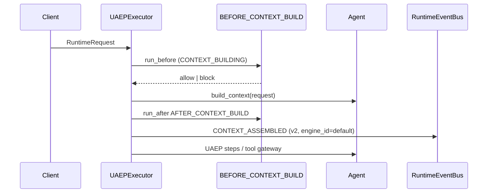
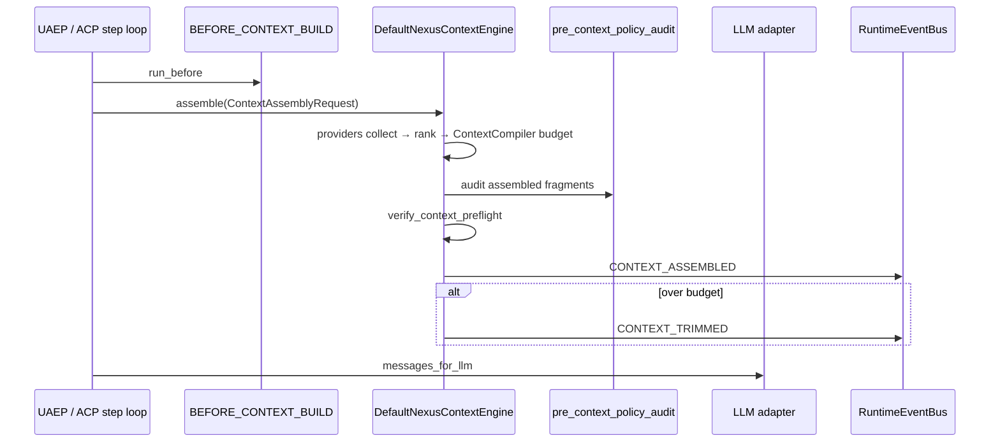
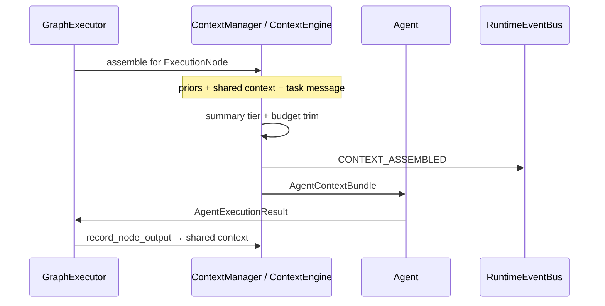

# Context Engineering

**Status:** Canonical architecture (domain pair 1:1)  
**Hub:** [`intergrax_runtime_architecture.md`](../intergrax_runtime_architecture.md)  
**Plan (1:1):** [`plan/CONTEXT_ENGINEERING.md`](../plan/CONTEXT_ENGINEERING.md)  
**Target:** [`IDEAL_HARNESS_AI_ARCHITECTURE.md`](../guides/IDEAL_HARNESS_AI_ARCHITECTURE.md) §16  
**Audit layer:** 16 (Context Engineering)  
**Audit instruction:** [`audit/CONTEXT_ENGINEERING.md`](../audit/CONTEXT_ENGINEERING.md)  
**ADR:** [`ADR-CTX-001`](../adr/entries/2026-06-12/ADR-CTX-001.md) · [`ADR-MEM-001`](../adr/entries/2026-06-08/ADR-MEM-001.md) (Context Compiler budget semantics)  
**Related:** [`architecture/MEMORY.md`](MEMORY.md) (stores + lifecycle) · [`architecture/RAG.md`](RAG.md) (retrieval) · [`architecture/TOOLS.md`](TOOLS.md) (tool outputs) · [`architecture/NEXUS_EXECUTION_FLOW.md`](NEXUS_EXECUTION_FLOW.md) (turn narrative) · [`architecture/OBSERVABILITY.md`](OBSERVABILITY.md) (event spine) · [`guides/AGENT_CREATION_GUIDE.md`](../guides/AGENT_CREATION_GUIDE.md) Appendix L  
**Implementation (as-built):** `intergrax/context/` · `intergrax/runtime/nexus/context/` · `intergrax/runtime/architecture/context_engineering.py` · `intergrax/contracts/context_assembly.py` · `applications/_shared/context_*`  
**Last architecture pass:** 2026-06-17 — **Full Harness LC** (re-validates iteration III); CE-LLM-X doc sync

---

## Cursor read scope (token budget)

**Do not read this entire file in one session** (CONTEXT_ENGINEERING canon).

- **Implement / audit default:** context assembly engine + scoring. Skip historical gap logs unless cited.
- **Use** table of contents below — `Read` with offset/limit per §.
- **Plan hub:** [`plan/CONTEXT_ENGINEERING.md`](../plan/CONTEXT_ENGINEERING.md) (scoped §6 only).
- **Audit slice:** [`guides/audit_slices/CONTEXT_ENGINEERING.md`](../guides/audit_slices/CONTEXT_ENGINEERING.md).
- **Max reads:** at most **one** file >5k tokens per session unless RESUME cites more.

---


## Architecture satellites (read on demand)

Large § blocks moved out of the architecture hub to reduce Cursor context use.
Load **only** the satellite matching your task or cited §.

| Satellite | Contents |
|-----------|----------|
| [`arch/CONTEXT_ENGINEERING_scenario_catalog.md`](arch/CONTEXT_ENGINEERING_scenario_catalog.md) | scenario catalog |

> **Cursor context budget:** read hub read-scope block + **at most one** satellite per session.

## 1. Purpose

Context Engineering (CE) is the **Tier-1 Harness engine** that decides **what information reaches the LLM** at a given execution step: which fragments to include, in what order, under what token budget, with full provenance and observability.

CE is **not** a memory store. It **consumes** outputs from:

| Source domain | What CE receives |
|---------------|------------------|
| [`MEMORY`](MEMORY.md) | Session history, LTM search hits, task KV reads (via providers) |
| [`RAG`](RAG.md) | Retrieved chunks + citations |
| [`TOOLS`](TOOLS.md) | Tool result blocks, workspace reads |
| [`ORCHESTRATION`](ORCHESTRATION.md) | Graph prior outputs, shared task context, delegation summaries |
| [`UNIFIED_EXECUTION_RUNTIME`](UNIFIED_EXECUTION_RUNTIME.md) | Policy overlays, system instructions, guardrail context |
| [`REASONING_AND_COGNITION`](REASONING_AND_COGNITION.md) | Optional `objective` / plan slice for step-aware ranking |
| [`MODALITY`](MODALITY.md) | Attachment / media summaries within budget |

**Rules:**

- Tier-2 agents MUST NOT hand-assemble production prompts from unbounded history.
- Tier-3 configures CE via `ContextProfile` and optional **plugin registration** — not agent imports of Nexus internals.
- Vendor-specific retrieval stays in Tier-0 (RAG); CE orchestrates **injection into the LLM window**.

```text
Tier-3 ContextProfile + ContextEnginePreset + context_plugins[]
  → context_runtime_bridge / context_wiring
  → ContextEngine.assemble(ContextAssemblyRequest)
  → messages_for_llm + AssembledContext (provenance, budget diag)
  → CoreLLMStep / Agent.run step
```

---

## 2. Production readiness verdict (2026-06-12, post CE-EXT)

| Question | Answer |
|----------|--------|
| Is CE **production-ready** as a **budgeted assembly spine**? | **Yes — L3+ engine / L3 control plane** (UAEP/ACP hybrid compile paths remain; see §8.3) |
| Is **`ContextCompiler` on the production hot path**? | **Yes (ACP)** — `StepLLMRouter` + `compile_service` before LLM; **Yes (graph)** when `ContextEngine` + `llm_adapter` wired; **Partial (UAEP)** — session `build_context` not yet full `assemble()` |
| Is there a **unified plugin catalog**? | **Yes** — `intergrax/context/` + `bootstrap_context_catalog()` + `BuiltinContextPlugin` (13 providers) |
| Is **step-aware** assembly implemented? | **Yes (ACP/graph events)** — `step_kind` / `step_index` on `ContextAssemblyRequest` + `context_assembly.v2`; ranker boosts by step |
| Is **workspace/codebase** context production-grade? | **Yes (MVP)** — workspace provider + FORMAT merge + orchestrator on graph codebase preset |
| Observability on assembly path? | **L3** — unified `CONTEXT_ASSEMBLED` v2 (CE-3.11); `CONTEXT_CANDIDATE_*` on engine assemble when `event_bus` wired (CE-9.1); OTel span shim + `check_context_otel_span_registry.py` |
| Can authors register custom providers without forking Nexus? | **Yes** — `register_context_plugin()` + `context_plugin_ids` on `ContextProfile` |

**Remaining:** deferred CE-9.5/9.6, CE-10.4–10.5, CE-12.1–12.3 — see §16.

---

## 3. Maturity score (audit map L0–L4)

| Dimension | Score | Notes |
|-----------|-------|-------|
| Control plane (`ContextProfile`, bridges, wiring) | **L3** | CTX + `context_presets.py` + `check_context_engine_wiring.py` |
| Global budget / never-overflow | **L3** | `ContextCompiler` on ACP LLM path + graph engine assemble; UAEP session path hybrid; preflight uses `adapter.count_messages_tokens` (M-LLM-X.3 / CE-LLM-X) |
| Provenance + assembly events | **L3** | `CONTEXT_ASSEMBLED` v2 with `engine_id` + `step_kind`; graph + UAEP aligned (CE-3.11) |
| Quality scoring (relevance/freshness/confidence) | **L3** | `DefaultContextRanker` + `evaluate_context_engineering()` gate (CE-10.1) |
| Plugin extensibility | **L3** | Catalog + FORMAT merge + **CE-PROV-WIRE** live collect for all §8.4 builtins (handle-gated where noted) |
| Step-aware selection | **L3** | ACP `AgentStepContext` + ranker table; graph uses `node.capability` as `step_kind` |
| Codebase-scale preset | **L3** | `CodebaseContextEngine` + workspace provider; 1k-file gate test |
| Interactive multi-hop context loop | **L2** | `ContextOrchestrator` on codebase preset only (CE-8) |
| OTel on compile hot path | **L2.5** | Span registry + engine shim; full OTel SDK wiring optional |
| Regression / drift gates | **L2.5** | `context_regression_benchmark.py`; preset baselines deferred (CE-10.4) |

**Overall:** **L3+ engine / L3 control plane** — CE-EXT S0–S12 complete; **L4** adaptive ranking deferred to [`ADAPTIVE_HARNESS_INTELLIGENCE.md`](ADAPTIVE_HARNESS_INTELLIGENCE.md).

---

## 4. Design principles

| Principle | Meaning in Intergrax |
|-----------|----------------------|
| **Compiler, not concatenation** | CE runs a deterministic pipeline with recorded stages — not string joins in agent code |
| **Budget-first** | Global input token budget derived from `llm_adapter.context_window_tokens` minus output reserve |
| **Step-scoped** | Assembly is keyed by **execution step** (UAEP step index or graph node + phase) — **Done** (CE-4) |
| **Source-agnostic plugins** | Each fragment has a `ContextSourceProvider`; Memory is one provider among many |
| **Provenance everywhere** | Every included/excluded fragment traceable to `source_id`, `source_type`, `degradation_step` |
| **Policy-governed** | `BEFORE_CONTEXT_BUILD` hooks + `pre_context_policy_audit` — no silent policy bypass |
| **Observable by default** | Events, structured logs, spans on collect/rank/budget/format — not optional debug |
| **Environment-driven** | `ContextProfile` on `ApplicationEnvironmentProfile` — Tier-3 owns presets |
| **Fail-safe degradation** | [`DegradationLadder`](MEMORY.md) order normative — never silent overflow |
| **Agents stay dumb about window** | Agents declare *needs* (`required_context_sources` on contract — future); CE satisfies |

---

## 5. Domain boundaries

| Concern | Owner | CE role |
|---------|-------|---------|
| Persist facts | MEMORY | Read via `MemoryContextProvider` |
| Retrieve documents | RAG | Read via `RagContextProvider` |
| Execute actions | TOOLS | Read tool output blocks via `ToolOutputContextProvider` |
| Graph priors | ORCHESTRATION | `ContextManager` / `GraphPriorContextProvider` |
| Prompt assets | AGENT_CONTRACTS (Prompt Registry) | `SystemInstructionsProvider` |
| Policy text | UAEP | `PolicyOverlayProvider` |
| **Compose LLM window** | **CONTEXT_ENGINEERING** | **Owns entire read-path orchestration** |

**Anti-pattern:** documenting CE inside MEMORY Layer C long-term — Layer C spec lives **here**; MEMORY links to this doc for read-path.

---

## 6. Tier placement

```text
Tier-0  intergrax/context/              contracts, plugins, ranker, dedup, orchestrator (CE-1 — shipped)
Tier-1  intergrax/runtime/nexus/context/  DefaultNexusContextEngine, ContextManager, ContextCompiler
Tier-3  applications/_shared/context_*      profile bridges, presets, wiring
```

| Component | Tier | Rationale |
|-----------|------|-----------|
| `ContextEngine`, `DefaultNexusContextEngine`, `CodebaseContextEngine` | 1 | Nexus turn-critical (CE-3 — shipped) |
| `ContextCompiler`, `DegradationLadder` | 1 | Budget allocator on ACP + engine assemble paths |
| `ContextSourceProvider` Protocol | 0 / providers | `intergrax/context/providers/` + app entry points |
| `context/quality.py` (scoring) | 0 | Shared types; shim in `context_engineering.py` |
| `ContextProfile` | 3 contract | Environment composition root |

---

## 7. Core domain model

### 7.1 Context fragment lifecycle

```text
ContextAssemblyRequest
  → COLLECT   (providers emit ContextFragment candidates)
  → NORMALIZE (schema_version, dedup keys, content_hash)
  → SCORE     (relevance, freshness, confidence → composite)
  → FILTER    (thresholds, policy, poisoning rules)
  → RANK      (mandatory first, then score desc)
  → BUDGET    (token allocation + degradation ladder)
  → COMPRESS  (summarize tiers, semantic compression flag)
  → FORMAT    (ChatMessage[] or AgentContextBundle.message)
  → VALIDATE  (preflight never-overflow + citation requirements)
  → EMIT      (events, spans, trace records)
```

### 7.2 Primary types (Tier-0 contracts — CE-1 shipped)

```python
# intergrax/context/contracts.py

class ContextFragmentSource(str, Enum):
    TASK_MESSAGE = "task_message"
    SYSTEM_INSTRUCTIONS = "system_instructions"
    SESSION_HISTORY = "session_history"
    SESSION_HISTORY_SEMANTIC = "session_history_semantic"  # MEM-VEC-2.4 — episodic vector recall hits
    LONGTERM_MEMORY = "longterm_memory"
    RAG = "rag"
    WEBSEARCH = "websearch"
    TOOL_OUTPUT = "tool_output"
    GRAPH_PRIOR = "graph_prior"
    SHARED_CONTEXT = "shared_context"
    ATTACHMENT = "attachment"
    POLICY_OVERLAY = "policy_overlay"
    WORKSPACE = "workspace"
    CUSTOM = "custom"

@dataclass(frozen=True)
class ContextFragment:
    fragment_id: str
    source: ContextFragmentSource
    source_id: str              # stable id for provenance
    content: str
    token_estimate: int
    relevance_score: float      # 0..1
    freshness_score: float
    confidence_score: float
    mandatory: bool             # never drop unless hard trim
    metadata: dict[str, Any]    # citations, path, line_range, tool_call_id
    content_hash: str           # dedup

@dataclass(frozen=True)
class ContextAssemblyRequest:
  """What CE needs to assemble context for ONE model call."""
    trace_id: str
    run_id: str
    task_id: str
    tenant_id: str
    # Step identity (CE-4)
    assembly_scope: Literal["uaep_turn", "graph_node", "delegation_child", "acp_step"]
    step_index: int | None
    graph_node_id: str | None
    step_kind: str | None         # e.g. plan | tool_call | synthesize | explore
    objective: str                # current sub-goal (may differ from full task message)
    # Policy
    decision_profile: ContextDecisionProfile
    budget_policy: ContextBudgetPolicy
    assembly_options: TaskContextAssemblyOptions
    # Capability hints
    required_sources: frozenset[ContextFragmentSource]
    excluded_sources: frozenset[ContextFragmentSource]
    # Runtime handles (injected by Nexus — not serialized)
    runtime_config: RuntimeConfig  # via context var / engine ctx — not in logs

@dataclass(frozen=True)
class AssembledContext:
    messages: list[ChatMessage]
    fragments_included: list[ContextFragment]
    fragments_excluded: list[tuple[ContextFragment, str]]  # reason
    provenance: list[ContextProvenance]
    total_tokens: int
    budget_tokens: int
    degradation_steps: tuple[str, ...]
    schema_version: str = "assembled_context.v1"
```

### 7.3 As-built types (today)

| Type | Module | Status |
|------|--------|--------|
| `ContextCandidate` | `context_compiler_models.py` | **Shipped** — message-index based |
| `AgentContextBundle` | `context_manager.py` | **Shipped** — graph path |
| `ContextProvenance` | `context_models.py` | **Shipped** |
| `ContextChunkSignal` | `context_engineering.py` | **Shipped** — quality eval only |
| `ContextAssemblyRequest` | `intergrax/context/contracts.py` | **Shipped** — step fields populated on ACP/graph (CE-4) |
| `ContextFragment` | `intergrax/context/contracts.py` | **Shipped** |
| `ContextPluginRegistry` | `intergrax/context/registry.py` | **Shipped** |
| `AgentContextHints` | `intergrax/contracts/agent_context_hints.py` | **Shipped** (CE-5.1) |

---

## 8. Plugin system architecture

CE follows the same **catalog pattern** as Integration / Tool / Skill libraries ([`EXTENSION_AUTHOR_GUIDE.md`](../guides/EXTENSION_AUTHOR_GUIDE.md)).

### 8.1 Catalog surface (shipped)

| Layer | Entry point group | Protocol | Register |
|-------|-------------------|----------|----------|
| Context | `intergrax.context` | `ContextPlugin` | `register_context_plugin()` |

```python
class ContextSourceProvider(Protocol):
    provider_id: str
    supported_sources: frozenset[ContextFragmentSource]
    async def collect(
        self,
        request: ContextAssemblyRequest,
        ctx: ContextProviderContext,
    ) -> list[ContextFragment]: ...

class ContextRanker(Protocol):
    ranker_id: str
    def rank(
        self,
        fragments: list[ContextFragment],
        request: ContextAssemblyRequest,
    ) -> list[ContextFragment]: ...

class ContextBudgetAllocator(Protocol):
    """Default: ContextCompiler + DegradationLadder."""
    def allocate(
        self,
        fragments: list[ContextFragment],
        budget_tokens: int,
        request: ContextAssemblyRequest,
    ) -> BudgetAllocationResult: ...

class ContextFormatter(Protocol):
    def format(
        self,
        fragments: list[ContextFragment],
        request: ContextAssemblyRequest,
    ) -> list[ChatMessage]: ...

class ContextValidator(Protocol):
    def validate(
        self,
        assembled: AssembledContext,
        request: ContextAssemblyRequest,
    ) -> ContextValidationResult: ...

class ContextEngine(Protocol):
    engine_id: str
    async def assemble(self, request: ContextAssemblyRequest) -> AssembledContext: ...
```

### 8.2 ContextPlugin bundle

```python
@dataclass
class ContextPlugin:
    plugin_id: str
    version: str
    providers: tuple[ContextSourceProvider, ...] = ()
    ranker: ContextRanker | None = None
    allocator: ContextBudgetAllocator | None = None
    formatter: ContextFormatter | None = None
    validator: ContextValidator | None = None
    engine: type[ContextEngine] | None = None  # optional full override
```

Bootstrap (mirror `bootstrap_catalogs`):

```python
bootstrap_context_catalog(
    register_shipped=True,
    context_plugins=(MyCodebasePlugin,),
    discover_entry_points=True,  # INTERGRAX_DISCOVER_CONTEXT_PLUGINS
)
```

### 8.3 Default engine — as-built (post CE-EXT S12, 2026-06-12)

Legacy `runtime_steps` pipeline (`HistoryLayer` → `CompileContextStep`) was **removed** by ACP-CLOSE-LEG.

| Path | Collect | Budget / validate | Format | Events | Engine integration |
|------|---------|-------------------|--------|--------|-------------------|
| **Graph** | `compose_agent_message()` + optional provider `collect()` | `ContextEngine.assemble()` when `llm_adapter` wired; else `trim_message_to_budget` | bundle message | `CONTEXT_ASSEMBLED` v2 + `engine_id` | **Hybrid** — CE-3.7 |
| **UAEP** | `build_context` + optional `assemble_uaep_session_prompt` | engine merge when wired | `ContextCompiler` when engine wired | `CONTEXT_ASSEMBLED` v2 | **Hybrid** — assemble wired (CE-UAEP-ASM); provider collect via legacy bridge handles |
| **ACP** | catalog tools in `on_next_step` + provider stubs in engine | `compile_prompt_text()` / `ContextCompiler` before each LLM call | step prompt | step trace + assembly v2 when graph-wired | **Hybrid** — CE-3.9 compiler hot path |
| **Engine unit/integration** | `DefaultNexusContextEngine.assemble()` | collect → dedup → rank → `ContextCompiler` → `verify_context_preflight()` | `ChatMessage[]` | via `ContextManager` when wired | **Reference spine** |

**Unification status:** graph + UAEP use `assemble()` when engine wired (**CE-ALIGN**). **CE-PROV-WIRE** closes §7.1 provider collect for all §8.4 builtins (GAP-CTX-20). ACP step path remains hybrid (catalog tools + compiler) until optional per-step `assemble()` follow-up.

### 8.4 Built-in provider registry (normative)

| provider_id | Source(s) | Module | collect status | CE-PROV-WIRE |
|-------------|-----------|--------|----------------|--------------|
| `builtin.task_message` | TASK_MESSAGE | `builtin.py` + `legacy_bridge.py` | **live** (objective / messages handle) | CE-PROV-01 **Done** |
| `builtin.system_instructions` | SYSTEM_INSTRUCTIONS | `builtin.py` + `legacy_bridge.py` | **live (handle-gated)** | CE-PROV-02 **Done** |
| `builtin.session_history` | SESSION_HISTORY | `builtin.py` + `legacy_bridge.py` | **live** (`session_history_messages` handle) | CE-PROV-03 **Done** |
| `builtin.session_history_semantic` | SESSION_HISTORY_SEMANTIC | `session_semantic_recall.py` | **live** (vector index + hits handle) | — (CE-VEC-1) |
| `builtin.longterm_memory` | LONGTERM_MEMORY | `builtin.py` + `legacy_bridge.py` | **live (handle-gated)** | CE-PROV-04 **Done** |
| `builtin.rag` | RAG | `builtin.py` + `legacy_bridge.py` | **live (handle-gated)** | CE-PROV-05 **Done** |
| `builtin.websearch` | WEBSEARCH | `builtin.py` + `legacy_bridge.py` | **live (handle-gated)** | CE-PROV-06 **Done** |
| `builtin.tool_output` | TOOL_OUTPUT | `builtin.py` + `legacy_bridge.py` | **live (handle-gated)** | CE-PROV-07 **Done** |
| `builtin.graph_prior` | GRAPH_PRIOR | `builtin.py` + `legacy_bridge.py` | **live** (`prior_output_records` handle) | CE-PROV-08 **Done** |
| `builtin.shared_context` | SHARED_CONTEXT | `builtin.py` + `legacy_bridge.py` | **live (handle-gated)** | CE-PROV-09 **Done** |
| `builtin.attachments` | ATTACHMENT | `builtin.py` + `legacy_bridge.py` | **live (handle-gated)** | CE-PROV-10 **Done** |
| `builtin.policy_overlay` | POLICY_OVERLAY | `builtin.py` + `legacy_bridge.py` | **live (handle-gated)** | CE-PROV-11 **Done** |
| `builtin.workspace` | WORKSPACE | `workspace.py` | **live** (`workspace_files` handle) | — (CE-7.2) |

**Plan:** [`plan/CONTEXT_ENGINEERING.md`](../plan/CONTEXT_ENGINEERING.md) phase **CE-PROV-WIRE** · sprints B1–B4. Handle key contract documented in plan §CE-PROV-WIRE (2026-06-14).

### 8.5 Engine presets (Tier-3)

| Preset ID | Use case | Engine / plugins |
|-----------|----------|------------------|
| `default` | General Nexus hosts | `DefaultNexusContextEngine` |
| `codebase` | Repo-scale dev agents | `CodebaseContextEngine` + workspace providers |
| `regulated_minimal` | Legal / compliance | high confidence threshold, MINIMAL summary tier |
| `explore_child` | Delegation explore | isolated namespace providers, tight budget |
| `custom` | `ContextProfile.engine_ref` | author-registered `ContextEngine` subclass |

```python
# ApplicationEnvironmentProfile — as-built ContextProfile fields (CTX + CE-EXT)
class ContextProfile(BaseModel):
    assembly_options: TaskContextAssemblyOptions
    budget_policy: ContextBudgetPolicy | None
    decision: ContextDecisionProfile
    engine_preset: Literal["default", "codebase", "regulated_minimal", "explore_child", "custom"] = "default"
    engine_ref: str | None = None          # CE-3: dotted path to ContextEngine class
    context_plugin_ids: list[str] = []     # CE-2: enabled plugin ids
    enable_rag: bool = True
    enable_websearch: bool = True
    # ... existing drift / semantic compression flags
```

---

## 9. Execution paths

### 9.1 As-built — UAEP session turn



When `context_engine` + `llm_adapter` are wired on `UAEPExecutor`, **`assemble_uaep_session_prompt`** runs after `build_context` (**CE-UAEP-ASM**). Provider collect uses task/request metadata handles populated by upstream steps (**CE-PROV-WIRE**).

### 9.1.1 Engine assembly spine (CE-3 + CE-3.9 — shipped on ACP/graph)



ACP path: `ContextAssemblyRequest.step_kind` from `AgentStepContext` / `StepOutcome` (CE-4).

### 9.2 Nexus graph node (multi-agent)



**Graph path (CE-3.7):** `ContextManager.build_agent_context_async()` calls **`ContextEngine.assemble(scope=graph_node)`** when engine + `llm_adapter` are wired.

### 9.3 Delegation / explore child

| Aspect | Rule |
|--------|------|
| Budget | Child `RunBudget` capped; parent receives synthesis only |
| Namespace | Providers read delegation-scoped memory only |
| Preset | `explore_child` disables websearch by default |
| Return | `DelegationResult.context_summary` — not full child window |

### 9.4 ACP direct run (Tier-2)

ACP agents still collect context inside `on_next_step` via catalog context tools (`rag.retrieve`, memory skills). **CE-3.9** wires `ContextCompiler` before each LLM call via `StepLLMRouter` + `compile_service`. **CE-4** populates `step_kind` from `AgentStepContext` / `AgentContract.context_hints` (CE-5.1). Optional full `assemble()` per step is follow-up.

---

## 10. Degradation ladder (normative)

Apply until `assembled_tokens <= budget_tokens` ([`ADR-MEM-001`](../adr/entries/2026-06-08/ADR-MEM-001.md)):

```text
1. FULL fidelity
2. Lower graph summary tier (FULL → SUMMARY_ONLY → MINIMAL)
3. Reduce LTM / RAG top_k
4. SUMMARIZE_OLDEST (session)
5. TRUNCATE_OLDEST (session)
6. DROP lowest-scored optional fragments (by ranker composite)
7. DROP optional injection blocks
8. Tokenizer-aware hard trim (last resort — emit explicit CONTEXT_TRIMMED)
```

Each step **MUST** emit diagnostics: `degradation_step`, `bytes_removed`, `fragments_dropped[]`.

---

## 11. Quality controls

| Control | Mechanism | Status |
|---------|-----------|--------|
| Relevance / freshness / confidence | `ContextChunkSignal` + thresholds | **Done** — `DefaultContextRanker._apply_quality_gate()` (CE-10.1) |
| Dedup | `content_hash` / `dedup_fragments_by_hash()` | **Done** — engine collect merge (CE-10.2) |
| Drift monitoring | `ContextProfile.drift_monitoring_enabled` | **Done** |
| Semantic compression | `semantic_compression_enabled` | **Done** (profile flag) |
| Regression benchmark | `context_regression_benchmark.py` | **Done** |
| Retrieval effectiveness | `retrieval_effectiveness.py` | **Done** (RAG boundary) |

**CE-10.3** (CE-FMT-1 tag classification in `classify_candidates`) **Done** — legacy string heuristics remain fallback for non-tagged injections.

---

## 12. Context Path Unification

**Normative rule (production):** For production execution, all LLM-facing context **SHOULD** be assembled through `ContextCompiler` / `ContextEngine` or an explicitly approved equivalent context assembly path.

**Normative rule (new code):** New production code **MUST NOT** introduce a new ad-hoc prompt/context assembly path unless this architecture document explicitly approves it and defines its relationship to `ContextCompiler` / `ContextEngine`.

Parallel ad-hoc paths — agent-local prompt building, UAEP/session prompt assembly without compiler, direct history concatenation, raw messages passed directly to `LLMAdapter`, test/lab shortcuts, tool/agent-specific prompt fragments — create drift risk: production LLM calls may bypass `MemoryView`, RAG provenance, policy, budget and observability.

**Cross-refs:** [`SYSTEM_INVARIANTS.md`](../guides/SYSTEM_INVARIANTS.md) §5 · [`AGENT_AUTHOR_MINIMAL_PATH.md`](../guides/AGENT_AUTHOR_MINIMAL_PATH.md) · [`AGENT_CONTRACTS_AND_ASSEMBLY.md`](AGENT_CONTRACTS_AND_ASSEMBLY.md) §17 · [`LLM_ADAPTERS.md`](LLM_ADAPTERS.md) · [`MEMORY.md`](MEMORY.md) · [`RAG.md`](RAG.md) · [`ADAPTIVE_HARNESS_INTELLIGENCE.md`](ADAPTIVE_HARNESS_INTELLIGENCE.md#governance-boundary) (L4 adaptive ranking — observe/propose only by default)

### 12.1 Approved context paths

| Path | Role | Notes |
|------|------|-------|
| **`ContextCompiler` / `ContextEngine`** | **Canonical production path** | Collect → rank → budget → format → validate → emit; see §7–§11 |
| **Prompt Registry / approved prompt mechanism** | Source of reusable prompt **fragments** | `SystemInstructionsProvider`; **not** a full replacement for context compilation |
| **`MemoryView` / approved memory services** | Memory **access** path | Session, LTM, task KV reads; CE consumes via `MemoryContextProvider` |
| **RAG service / catalog tools** | Knowledge **retrieval** path | `rag.retrieve` and Nexus retrieval steps; CE consumes via `RagContextProvider` |
| **Test fixtures / lab shortcuts** | Non-production only | Allowed when explicitly marked **test** or **lab**; **MUST NOT** become production paths |

### 12.2 Disallowed context paths

Production agents and runtime components **MUST NOT**:

- concatenate unbounded conversation history directly into LLM messages,
- query vector stores directly from agents,
- read arbitrary memory stores directly from agents,
- bypass `ContextCompiler` for production LLM context,
- bypass policy / budget / redaction / provenance controls,
- build private prompt pipelines inside agents,
- send raw tool outputs to LLM without approved filtering / formatting,
- treat Prompt Registry as a full context engine,
- treat RAG retrieval as memory,
- treat trace logs as memory or user context.

### 12.3 Transitional / legacy paths

Some older or lab paths may still assemble prompts directly (e.g. UAEP `build_context` hybrid, ACP catalog-tool collect before per-step `assemble()`, direct `messages` to `LLMAdapter` in tests).

They are allowed **only** when explicitly marked as:

- **lab**, **test**, **migration**, **compatibility**, or **non-production**.

Any such path **SHOULD** have:

| Field | Requirement |
|-------|-------------|
| **Owner** | Team or domain responsible |
| **Reason** | Why the path exists |
| **Maturity status** | Per [`MATURITY_TAXONOMY.md`](../guides/MATURITY_TAXONOMY.md) |
| **Migration target** | Canonical CE path or approved equivalent |
| **Known risks** | Budget, provenance, policy bypass, etc. |

Do **not** remove legacy paths in this document — register and constrain them until migration completes.

### 12.4 Cursor review checklist

Before adding or modifying any LLM call, Cursor must verify:

- [ ] Is the context assembled by `ContextCompiler` / `ContextEngine` or an approved equivalent?
- [ ] Are prompt fragments coming from Prompt Registry or an approved prompt source?
- [ ] Is memory accessed through `MemoryView` / approved memory services?
- [ ] Is RAG accessed through approved RAG services / tools?
- [ ] Is provenance preserved for retrieved fragments?
- [ ] Are budgets applied before model invocation?
- [ ] Are secrets and protected data redacted before persistence and model calls where required?
- [ ] Is this path **production**, **lab**, **test**, or **compatibility**?
- [ ] If not canonical, is the path explicitly documented as transitional (§12.3)?

---
