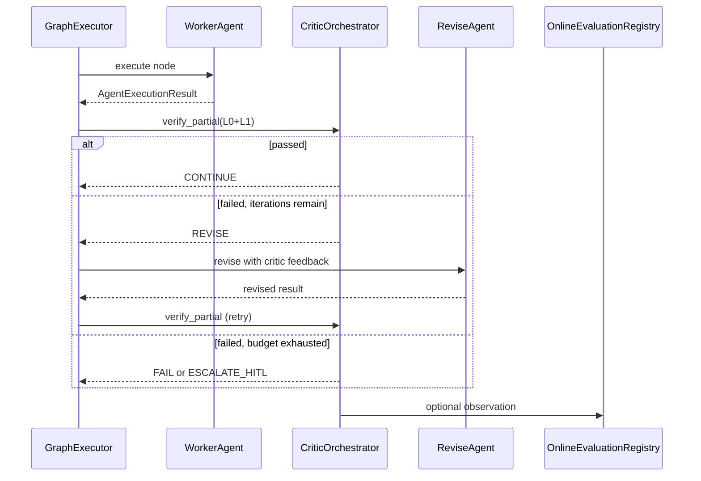

# Critic Verification

**Status:** Canonical architecture (domain pair 1:1)  
**Hub:** [`intergrax_runtime_architecture.md`](../intergrax_runtime_architecture.md)  
**Plan (1:1):** [`plan/CRITIC_VERIFICATION.md`](../plan/CRITIC_VERIFICATION.md)  
**Target:** [`IDEAL_HARNESS_AI_ARCHITECTURE.md`](../guides/IDEAL_HARNESS_AI_ARCHITECTURE.md)  
**Audit layers:** 25 (verify depth)  
**Audit instruction:** [`audit/CRITIC_VERIFICATION.md`](../audit/CRITIC_VERIFICATION.md)  
**Last updated:** 2026-06-20 — **P2-ARCH-08** Verification Safety Boundaries; **CRIT-V-0…7 + CVL-LC-1…4 Done (L3+)**
---

## Cursor read scope (token budget)

**Do not read this entire file in one session** (CRITIC_VERIFICATION canon).

- **Implement / audit default:** [Verification Safety Boundaries](#verification-safety-boundaries) + CVL contracts + orchestrator + wiring. Skip historical LC narrative unless cited.
- **Use** table of contents below — `Read` with offset/limit per §.
- **Plan hub:** [`plan/CRITIC_VERIFICATION.md`](../plan/CRITIC_VERIFICATION.md) (scoped §6 only).
- **Audit slice:** [`guides/audit_slices/CRITIC_VERIFICATION.md`](../guides/audit_slices/CRITIC_VERIFICATION.md).
- **Max reads:** at most **one** file >5k tokens per session unless RESUME cites more.

---


## Architecture satellites (read on demand)

Large § blocks moved out of the architecture hub to reduce Cursor context use.
Load **only** the satellite matching your task or cited §.

| Satellite | Contents |
|-----------|----------|
| [`arch/CRITIC_VERIFICATION_scenario_catalog.md`](arch/CRITIC_VERIFICATION_scenario_catalog.md) | scenario catalog |

> **Cursor context budget:** read hub read-scope block + **at most one** satellite per session.

## 1. Purpose

Define the **Critic & Verification Layer (CVL)** — the Harness AI subsystem that answers:

> **Is this partial or final agent output actually correct — structurally, procedurally, and (when configured) semantically?**

CVL completes the **Plan → Execute → Verify (PEV)** loop that leading Harness AI systems use in production. It **does not** embed domain business rules in Nexus. It provides **typed primitives, orchestration hooks, telemetry, and policy gates** so agents and applications can compose domain-specific critics safely.

**Strategic positioning:** The Harness owns **how** verification runs; agents and applications own **what** is verified.

---

## 2. Problem statement

Intergrax already had strong **structural validation** (`NexusValidationEngine`), **evaluation infrastructure** (registry, shadow eval, offline runner contracts), and **adaptive verification** (`VerificationLoop` for profile promotion). Before Phase CRIT-V (2026-06-07…2026-06-08), production-grade PEV **Verify** depth was missing:

| Gap (pre-CRIT-V) | Impact | Status |
|------------------|--------|--------|
| No universal **semantic judge primitive** (`eval.judge`) | LLM-as-judge scores supplied ad hoc | **Done** — `tools/providers/eval/judge.py` + `L1Gateway` |
| No **trajectory evaluation** contract | Process quality invisible to gates | **Done** — `eval.trajectory` (heuristic process scoring) |
| **Evaluator-loop** catalog pattern only | No critique→revise→re-evaluate executor | **Done** — `EvaluatorLoopExecutor` + graph wiring |
| **NexusEvalRunner** exact-match only | Offline benchmarks miss semantic equivalence | **Done** — optional `semantic_match_enabled` + `eval.judge` |
| **L0→L1→L2 stack** not explicit | Authors unclear where to put rubrics vs hooks | **Done** — §6 stack + `CriticOrchestrator` |
| Evaluation layer maturity **L2** (FAUDIT-32) | Closeout wiring ≠ execution depth | **Done** — CRIT-V uplift to **L3** |

CVL closed these gaps **without** violating tier boundaries or creating a second evaluation system parallel to `OnlineEvaluationRegistry`.

**Remaining depth (not blocking L3):** L4 adaptive critic thresholds (AHIA), LLM-based trajectory judge (`eval.trajectory_judge` skill), FLOW-8 product reference host — see plan backlog §CVL-Backlog.

---

## 3. Terminology

| Term | Meaning in Intergrax |
|------|----------------------|
| **Critic** | Any component that produces a scored verdict on output or trajectory |
| **Verification** | Harness-orchestrated application of critics with policy consequences (retry, revise, HITL, fail) |
| **L0 critic** | Deterministic — schema, rules, contract, executable tests |
| **L1 critic** | Probabilistic semantic — LLM-as-judge, secondary model, self-consistency |
| **L2 critic** | Authoritative — human expert, compliance sign-off, audit gate |
| **Partial verification** | After a graph node, subtask, or UAEP step milestone |
| **Final verification** | Before task terminal state (`COMPLETED`, `PARTIALLY_COMPLETED`) |
| **Evaluator-loop** | Multi-iteration critique→revise pattern until pass or budget exhausted |
| **CVL** | Critic & Verification Layer — platform subsystem (this document) |

**Not CVL:** Adaptive profile promotion (`VerificationLoop` in `runtime/adaptive/`) — complementary; consumes CVL/registry signals but serves L4 adaptation, not per-run correctness.

---

## 4. Design principles

1. **Reuse before create** — extend `NexusValidationEngine`, `ValidationResult`, `OnlineEvaluationRegistry`, `EvaluationProfile`, `ReplayEngine`; no parallel eval store.
2. **L0 before L1** — semantic judges run only after deterministic gates pass (cost + safety). Vendor **llm_guardrail** scans compose into L0 via `merge_guardrail_l0` when `guardrail_scan` is present in critic context ([`INTEGRATIONS.md`](INTEGRATIONS.md) §47).
3. **Judge separation** — critic LLM profile MUST differ from producer agent profile (model, temperature, prompt registry id).
4. **Opt-in by policy** — LLM-judge never mandatory on every run; `CriticProfile` + `EvaluationProfile` control activation.
5. **Trace everything** — every critic invocation emits trace + optional `OnlineEvaluationObservation`.
6. **Tier discipline** — Nexus orchestrates; Tier-2 supplies rubrics and ValidatorAgents; Tier-3 selects profiles and datasets.
7. **Fail closed on high risk** — when `require_critic_on_completion` is set and critic unavailable → `FAILED` or HITL, not silent pass.

---

## 5. Separated competencies (tier model)

### 5.1 Responsibility matrix

| Concern | Tier-0 Platform | Tier-1 Nexus / CVL | Tier-2 Agent | Tier-3 Application |
|---------|-----------------|-------------------|--------------|-------------------|
| `ValidationResult` contract | defines | consumes | extends via `validate()` | — |
| Structural validation (L0) | rules engine | `NexusValidationEngine` per node | `AgentContract.validation_rules` | `NexusPlan.validation_criteria` |
| Semantic judge primitive (L1) | `eval.judge` tool, rubric schema | `CriticOrchestrator` hook | rubric content, ValidatorAgent | enable + thresholds |
| Trajectory evaluation (L1) | `eval.trajectory` tool | hook after step/graph | domain step expectations | scenario definitions |
| Evaluator-loop execution | pattern + budget types | `EvaluatorLoopExecutor` | revise logic in worker agent | graph_spec nodes |
| Registry & trends | `OnlineEvaluationRegistry` | post-run bridge | — | `EvaluationProfile`, CI baselines |
| Release / adaptive gates | closeout scripts | `VerificationLoop` (L4) | — | `require_baseline_for_release` |
| HITL escalation (L2) | policy primitives | `HitlRunner` | interrupt reasons | approval policy |
| Golden datasets | runner contracts | `NexusEvalRunner` | eval cases | asset paths |
| Domain correctness | — | — | **primary owner** | orchestration + policy |

### 5.2 What Harness MUST NOT do

- Encode domain rubrics (“is this legal clause acceptable?”) in Tier-1.
- Force LLM-judge on every run regardless of `CriticProfile`.
- Replace ValidatorAgents with a monolithic platform critic.
- Bypass `NexusValidationEngine` for graph nodes.

### 5.3 What agents/applications MUST NOT do

- Implement parallel verification stores outside `OnlineEvaluationRegistry`.
- Call vendor LLM SDKs directly for judging (use `eval.judge` / `ToolRuntime`).
- Skip L0 validation and rely solely on LLM self-assessment.

---

## 6. Three-layer critic stack (L0 / L1 / L2)

```text
┌─────────────────────────────────────────────────────────────────┐
│ L2 — Authoritative                                              │
│ Human review · compliance sign-off · policy INTERRUPT → HITL    │
├─────────────────────────────────────────────────────────────────┤
│ L1 — Semantic (probabilistic)                                   │
│ eval.judge · eval.trajectory · ValidatorAgent · secondary model │
├─────────────────────────────────────────────────────────────────┤
│ L0 — Deterministic (always cheap, always first)                 │
│ schema · NexusValidationEngine · Agent.validate() · exec tests  │
└─────────────────────────────────────────────────────────────────┘
     fail fast ──► retry / revise          fail ──► HITL or FAILED
```

| Layer | Typical latency | Typical cost | When required |
|-------|-----------------|--------------|---------------|
| L0 | ms | negligible | Every graph node (default) |
| L1 | seconds | LLM tokens | When `CriticProfile.semantic_judge_enabled` |
| L2 | minutes–hours | human | High-risk policy or L1 borderline |

**Combined verdict:** `CriticVerdict.passed = L0.passed ∧ (L1.passed if enabled) ∧ (L2.passed if required)`.

---

## 7. Component architecture

```text
Tier-3  ApplicationEnvironmentProfile
           ├── evaluation_profile      (existing — registry, shadow, trends)
           └── critic_profile          (new — L1/L2 toggles, thresholds, rubric refs)

Tier-1  Critic & Verification Layer (CVL)
           ├── CriticOrchestrator           ← single entry: verify_partial / verify_final
           ├── L0Gateway                    ← wraps NexusValidationEngine + schema validators
           ├── L1Gateway                    ← invokes eval.judge / eval.trajectory via ToolRuntime
           ├── EvaluatorLoopExecutor        ← critique→revise routing in GraphExecutor
           ├── CriticTraceEmitter           ← trace steps + registry observations
           └── CriticPolicyBridge           ← maps verdict → retry / HITL / fail / continue (**Done** — `policy_bridge.py`)

Tier-0  Primitives
           ├── NexusValidationEngine        (existing)
           ├── eval.judge                     (new tool)
           ├── eval.trajectory                (new tool)
           ├── eval.record_observation        (existing)
           ├── OnlineEvaluationRegistry       (existing)
           ├── ReplayEngine / metrics         (existing — trajectory input)
           └── evaluation_automation          (existing — aggregate rule + judge scores)

Tier-2  Domain
           ├── ValidatorAgent / EvaluatorAgent graph nodes
           ├── Agent.validate() overrides
           ├── Rubric packs (YAML/JSON via Prompt Registry)
           └── Domain executable tests (tools, skills)
```

### 7.1 CriticOrchestrator (Tier-1)

**Module:** `intergrax/runtime/critic/critic_orchestrator.py` (**Done** — CRIT-V-3.1)

**Responsibilities:**

- Accept `CriticRequest` (scope, artifact, context, enabled layers).
- Run L0 → L1 → L2 in order; short-circuit on hard fail.
- Return `CriticVerdict` with per-layer results and combined action.
- Never call LLM directly — delegate L1 to Tier-0 tools via `ToolRuntime`.

**Non-responsibilities:** Rubric authoring, domain revise logic, graph scheduling.

### 7.2 L0Gateway

Wraps existing validation path:

- `NexusValidationEngine.validate()`
- Optional JSON/schema validators on `AgentExecutionResult.structured_data`
- Agent-local `validate()` when invoked from UAEP completion path

### 7.3 L1Gateway

Invokes:

- `eval.judge` — semantic scoring against `RubricSpec` (LLM-as-judge via separate critic profile)
- `eval.trajectory` — **deterministic** process scoring from replayed trace slice (tool errors, duplicates, denied calls)

For **LLM-based trajectory regression** in offline eval harnesses, compose the `eval.trajectory_judge` skill (`eval.judge` + `eval.trajectory` + `eval.record_observation`) — not a separate Tier-1 gateway path.

Uses **separate** `LLMProfile` (critic profile) from producer agent for `eval.judge` only.

### 7.4 EvaluatorLoopExecutor (Tier-1)

Extends graph execution for `CoordinationPattern.EVALUATOR_LOOP`:

```text
Worker node → CriticOrchestrator.verify_partial
    → pass: continue
    → fail + budget: route to Revise node (same or dedicated agent)
    → fail + exhausted: FAILED or HITL per policy
```

Configuration: `EvaluatorLoopSpec` (max_iterations, min_score, revise_node_id).

### 7.5 CriticProfile (Tier-3 extension)

New typed profile on `ApplicationEnvironmentProfile` (alongside `EvaluationProfile`):

| Field | Purpose |
|-------|---------|
| `semantic_judge_enabled` | Enable L1 on configured scopes |
| `trajectory_eval_enabled` | Enable trajectory critic |
| `judge_threshold` | Minimum score (default 0.75) |
| `require_critic_on_completion` | Fail if L1 unavailable when enabled |
| `evaluator_loop_max_iterations` | Cap for critique-revise |
| `critic_llm_profile_ref` | Separate model for judges |
| `default_rubric_ref` | Prompt registry id for generic rubric |
| `scopes` | `node`, `graph_final`, `uaep_step` flags |

Wiring mirrors EVAL phase: `wire_application_critic()` → `RuntimeConfig` → policy bundle fragment `critic_governance`.

---

## 8. Core contracts

**Package:** `intergrax/runtime/critic/contracts.py` — **Done** (CRIT-V-1)

```python
# Conceptual — implement in CRIT-V-1

class CriticScope(str, Enum):
    NODE_PARTIAL = "node_partial"
    GRAPH_FINAL = "graph_final"
    UAEP_STEP = "uaep_step"
    OFFLINE_CASE = "offline_case"

class CriticLayer(str, Enum):
    L0_DETERMINISTIC = "l0_deterministic"
    L1_SEMANTIC = "l1_semantic"
    L1_TRAJECTORY = "l1_trajectory"
    L2_HUMAN = "l2_human"

class LayerVerdict(BaseModel):
    layer: CriticLayer
    passed: bool
    score: float | None
    errors: list[str]
    warnings: list[str]

class CriticVerdict(BaseModel):
    scope: CriticScope
    passed: bool
    layers: list[LayerVerdict]
    recommended_action: CriticAction  # CONTINUE | RETRY | REVISE | ESCALATE_HITL | FAIL

class CriticRequest(BaseModel):
    scope: CriticScope
    run_id: str
    agent_id: str
    execution: AgentExecutionResult | None
    answer: RuntimeAnswer | None
    rubric_ref: str | None
    enabled_layers: tuple[CriticLayer, ...]
    context: dict[str, Any]  # task_class, capability, plan_criteria
```

**Tool contracts (Tier-0):**

| Tool ID | Input | Output |
|---------|-------|--------|
| `eval.judge` | output text, rubric, reference context, optional golden | score 0–1, reasons, passed |
| `eval.trajectory` | run_id or trace slice, min_score threshold | score, process anomaly flags, reasons (heuristic — not LLM rubric) |

Both tools append optional `OnlineEvaluationObservation` when registry bound.

---

## 9. Execution flows

### 9.1 Partial verification (graph node)

Already partially implemented via `NexusValidationEngine` + retry. CVL extends:

```text
GraphExecutor._execute_node
  → AgentEngine.run_agent_with_result
  → CriticOrchestrator.verify_partial(scope=NODE_PARTIAL)
       → L0Gateway (existing validation_engine path)
       → L1Gateway (if critic_profile.semantic_judge_enabled)
  → on fail: RetryEngine OR EvaluatorLoopExecutor.revise route
  → CriticTraceEmitter
```

### 9.2 Final verification (graph completion)

```text
GraphRunner (post graph success)
  → lifecycle VALIDATING
  → CriticOrchestrator.verify_final(scope=GRAPH_FINAL)
  → existing final_validation merge
  → terminal state COMPLETED | PARTIALLY_COMPLETED | FAILED | WAITING_FOR_HUMAN
  → OnlineEvaluationRegistry observation (if profile enabled)
```

### 9.3 Offline verification (benchmarks)

```text
NexusEvalRunner.run_case
  → execute case
  → CriticOrchestrator.verify_final(scope=OFFLINE_CASE)
       → L0: exact match OR schema
       → L1: optional semantic equivalence via eval.judge
  → EvalResult with layer breakdown
```

### 9.4 Integration with existing evaluation hooks

CVL **feeds** existing infrastructure; does not replace it:

| Existing hook | CVL relationship |
|---------------|------------------|
| `NexusValidationEngine` | L0Gateway delegates here |
| `evaluation_automation.evaluate_automated_results` | Consumes L1 scores from registry |
| `RuntimeArchitectureGovernanceBridge.record_shadow_run_evaluation` | Shadow runs use CVL verdict |
| `VerificationLoop.check_eval_registry_trend` | Adaptive L4 consumes CVL observations |
| `NEXUS_EXECUTION_FLOW` §18 | Update hook table when CRIT-V ships |

---

## 10. Evaluator-loop pattern (critique–revise)

Aligns with [`IDEAL_HARNESS_AI_ARCHITECTURE.md`](guides/IDEAL_HARNESS_AI_ARCHITECTURE.md) §6.4 and canon §53.10.



**Selection:** `select_coordination_pattern()` may recommend `EVALUATOR_LOOP` when complexity/risk high and latency budget allows — existing V-MA catalog.

---

## Verification Safety Boundaries

CVL answers correctness questions; it does **not** silently grant authority for high-risk irreversible side effects.

**Normative rule:** Verification may block, escalate, request more evidence, request HITL, or mark a result as insufficient. Verification **MUST NOT** silently authorize high-risk irreversible side effects based only on probabilistic or LLM-based judgment.

Verification is a **Harness/runtime concern** — orchestrated through `CriticOrchestrator`, policy bridges, and HITL gates — not a private agent decision buried in narrative output.

**Cross-refs:** [`SYSTEM_INVARIANTS.md`](../guides/SYSTEM_INVARIANTS.md) §8 · [`RELIABILITY_FAILURE_AND_HITL.md`](RELIABILITY_FAILURE_AND_HITL.md#attempt-ledger) · [`NEXUS_EXECUTION_FLOW.md`](NEXUS_EXECUTION_FLOW.md) · [`UNIFIED_EXECUTION_RUNTIME.md`](UNIFIED_EXECUTION_RUNTIME.md) · [`OBSERVABILITY.md`](OBSERVABILITY.md#observability-event-spine) · [`AGENT_CONTRACTS_AND_ASSEMBLY.md`](AGENT_CONTRACTS_AND_ASSEMBLY.md) · [`TOOLS.md`](TOOLS.md) · [`MATURITY_TAXONOMY.md`](../guides/MATURITY_TAXONOMY.md)

---

## Verification levels and authority

Normative authority model for the L0 / L1 / L2 stack (§6). Layers compose; they do not substitute for one another on high-risk paths.

### L0 — Deterministic verification

- schema validation
- contract validation
- type checks
- required fields
- policy constraints
- deterministic safety rules
- idempotency requirements
- tool result shape validation

L0 **MAY** block execution. L0 **SHOULD** run before L1 whenever possible.

### L1 — Semantic / probabilistic verification

- LLM-as-judge
- rubric-based semantic evaluation
- trajectory critique
- confidence scoring
- consistency checks
- factuality checks when evidence is available

L1 **MAY** recommend pass / fail / escalate. L1 **MUST NOT** be the only approval mechanism for irreversible high-risk side effects.

### L2 — Human / authoritative verification

- human approval
- business owner approval
- domain expert review
- external authoritative system confirmation
- legal / compliance review where required

L2 is required when policy, risk tier, or missing evidence demands human or authoritative approval.

**Combined verdict (unchanged):** `CriticVerdict.passed = L0.passed ∧ (L1.passed if enabled) ∧ (L2.passed if required)`.

---

## High-risk side effect rule

Hard rules for side effects that are irreversible, externally visible, or policy-classified as high risk:

- High-risk or irreversible side effects require policy approval and traceable verification evidence.
- LLM-as-judge alone **MUST NOT** authorize high-risk irreversible side effects.
- Semantic confidence alone **MUST NOT** override deterministic validation failure.
- Human approval boundaries must be managed by Nexus / HITL mechanisms, not ad-hoc agent messages.
- If verification cannot establish sufficient confidence, the runtime should escalate, degrade, request human review, or stop.
- Verification results must be traceable through the observability spine (`RuntimeEvent` / `CriticTraceEmitter` — [`OBSERVABILITY.md`](OBSERVABILITY.md#observability-event-spine)).

---

## Verification ownership

| Concern | Owner |
|---------|-------|
| Verification architecture and execution gateway | Harness / runtime |
| Domain rubric | Tier-2 agent / domain package |
| Product risk threshold | Tier-3 application profile / policy |
| Deterministic schema validation | Contract / runtime validators |
| Semantic judge execution | CVL / approved evaluator mechanism |
| HITL escalation | Nexus / HITL runtime |
| Final side-effect authorization | Policy + runtime + required verification level |
| Audit evidence | `RuntimeEvent` / observability spine |

---

## Disallowed verification patterns

Agents, tools, and applications **MUST NOT**:

- treat LLM judge output as unconditional truth
- bypass L0 deterministic validation when L0 is available
- perform high-risk side effects after L1-only approval
- hide verification failures inside final narrative output
- implement private human approval flows inside agents
- store verification decisions only in local logs
- bypass `RuntimeEvent` / observability spine for verification outcomes
- use semantic evaluator results without preserving evidence / provenance
- silently downgrade risk tier to avoid HITL
- describe a verification path as production-ready without maturity / evidence statement ([`MATURITY_TAXONOMY.md`](../guides/MATURITY_TAXONOMY.md))

---

## Cursor review checklist

Before adding or modifying verification behavior, Cursor must verify:

- [ ] Is there an L0 deterministic check where possible?
- [ ] Is L1 semantic evaluation clearly separated from L0 deterministic validation?
- [ ] Can L1 block / escalate without being treated as absolute truth?
- [ ] Does this path involve high-risk or irreversible side effects?
- [ ] If high-risk, is L2 / HITL or authoritative verification required?
- [ ] Are verification results traced through `RuntimeEvent` / observability spine?
- [ ] Are rubrics domain-owned and policies application / runtime-owned?
- [ ] Is the production readiness claim expressed through [`MATURITY_TAXONOMY.md`](../guides/MATURITY_TAXONOMY.md)?
- [ ] Does the change avoid private agent-local approval systems?

---
