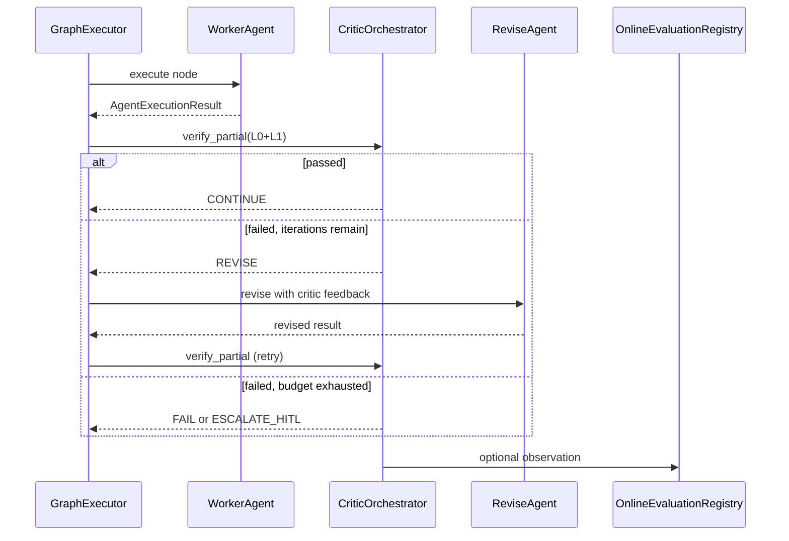

# Critic Verification

**Status:** Canonical architecture (domain pair 1:1)  
**Hub:** [`intergrax_runtime_architecture.md`](../intergrax_runtime_architecture.md)  
**Plan (1:1):** [`plan/CRITIC_VERIFICATION.md`](../plan/CRITIC_VERIFICATION.md)  
**Target:** [`IDEAL_HARNESS_AI_ARCHITECTURE.md`](../guides/IDEAL_HARNESS_AI_ARCHITECTURE.md)  
**Audit layers:** 25 (verify depth)  
---

## 1. Purpose

Define the **Critic & Verification Layer (CVL)** — the Harness AI subsystem that answers:

> **Is this partial or final agent output actually correct — structurally, procedurally, and (when configured) semantically?**

CVL completes the **Plan → Execute → Verify (PEV)** loop that leading Harness AI systems use in production. It **does not** embed domain business rules in Nexus. It provides **typed primitives, orchestration hooks, telemetry, and policy gates** so agents and applications can compose domain-specific critics safely.

**Strategic positioning:** The Harness owns **how** verification runs; agents and applications own **what** is verified.

---

## 2. Problem statement

Today Intergrax has strong **structural validation** (`NexusValidationEngine`), **evaluation infrastructure** (registry, shadow eval, offline runner contracts), and **adaptive verification** (`VerificationLoop` for profile promotion). Gaps vs production-grade Harness AI:

| Gap | Impact |
|-----|--------|
| No universal **semantic judge primitive** (`eval.judge`) | LLM-as-judge scores must be supplied ad hoc |
| No **trajectory evaluation** contract | Process quality (tool path, loops, waste) invisible to gates |
| **Evaluator-loop** is a catalog pattern only | No runtime critique→revise→re-evaluate executor |
| **NexusEvalRunner** uses exact-match only | Offline benchmarks miss semantic equivalence |
| **L0→L1→L2 stack** not explicit in one model | Authors unclear where to put rubrics vs hooks |
| Evaluation layer maturity **L2** (FAUDIT-32) | Closeout wiring ≠ execution depth |

CVL closes these gaps **without** violating tier boundaries or creating a second evaluation system parallel to `OnlineEvaluationRegistry`.

---

## 3. Terminology

| Term | Meaning in Intergrax |
|------|----------------------|
| **Critic** | Any component that produces a scored verdict on output or trajectory |
| **Verification** | Harness-orchestrated application of critics with policy consequences (retry, revise, HITL, fail) |
| **L0 critic** | Deterministic — schema, rules, contract, executable tests |
| **L1 critic** | Probabilistic semantic — LLM-as-judge, secondary model, self-consistency |
| **L2 critic** | Authoritative — human expert, compliance sign-off, audit gate |
| **Partial verification** | After a graph node, subtask, or UAEP step milestone |
| **Final verification** | Before task terminal state (`COMPLETED`, `PARTIALLY_COMPLETED`) |
| **Evaluator-loop** | Multi-iteration critique→revise pattern until pass or budget exhausted |
| **CVL** | Critic & Verification Layer — platform subsystem (this document) |

**Not CVL:** Adaptive profile promotion (`VerificationLoop` in `runtime/adaptive/`) — complementary; consumes CVL/registry signals but serves L4 adaptation, not per-run correctness.

---

## 4. Design principles

1. **Reuse before create** — extend `NexusValidationEngine`, `ValidationResult`, `OnlineEvaluationRegistry`, `EvaluationProfile`, `ReplayEngine`; no parallel eval store.
2. **L0 before L1** — semantic judges run only after deterministic gates pass (cost + safety).
3. **Judge separation** — critic LLM profile MUST differ from producer agent profile (model, temperature, prompt registry id).
4. **Opt-in by policy** — LLM-judge never mandatory on every run; `CriticProfile` + `EvaluationProfile` control activation.
5. **Trace everything** — every critic invocation emits trace + optional `OnlineEvaluationObservation`.
6. **Tier discipline** — Nexus orchestrates; Tier-2 supplies rubrics and ValidatorAgents; Tier-3 selects profiles and datasets.
7. **Fail closed on high risk** — when `require_critic_on_completion` is set and critic unavailable → `FAILED` or HITL, not silent pass.

---

## 5. Separated competencies (tier model)

### 5.1 Responsibility matrix

| Concern | Tier-0 Platform | Tier-1 Nexus / CVL | Tier-2 Agent | Tier-3 Application |
|---------|-----------------|-------------------|--------------|-------------------|
| `ValidationResult` contract | defines | consumes | extends via `validate()` | — |
| Structural validation (L0) | rules engine | `NexusValidationEngine` per node | `AgentContract.validation_rules` | `NexusPlan.validation_criteria` |
| Semantic judge primitive (L1) | `eval.judge` tool, rubric schema | `CriticOrchestrator` hook | rubric content, ValidatorAgent | enable + thresholds |
| Trajectory evaluation (L1) | `eval.trajectory` tool | hook after step/graph | domain step expectations | scenario definitions |
| Evaluator-loop execution | pattern + budget types | `EvaluatorLoopExecutor` | revise logic in worker agent | graph_spec nodes |
| Registry & trends | `OnlineEvaluationRegistry` | post-run bridge | — | `EvaluationProfile`, CI baselines |
| Release / adaptive gates | closeout scripts | `VerificationLoop` (L4) | — | `require_baseline_for_release` |
| HITL escalation (L2) | policy primitives | `HitlRunner` | interrupt reasons | approval policy |
| Golden datasets | runner contracts | `NexusEvalRunner` | eval cases | asset paths |
| Domain correctness | — | — | **primary owner** | orchestration + policy |

### 5.2 What Harness MUST NOT do

- Encode domain rubrics (“is this legal clause acceptable?”) in Tier-1.
- Force LLM-judge on every run regardless of `CriticProfile`.
- Replace ValidatorAgents with a monolithic platform critic.
- Bypass `NexusValidationEngine` for graph nodes.

### 5.3 What agents/applications MUST NOT do

- Implement parallel verification stores outside `OnlineEvaluationRegistry`.
- Call vendor LLM SDKs directly for judging (use `eval.judge` / `ToolRuntime`).
- Skip L0 validation and rely solely on LLM self-assessment.

---

## 6. Three-layer critic stack (L0 / L1 / L2)

```text
┌─────────────────────────────────────────────────────────────────┐
│ L2 — Authoritative                                              │
│ Human review · compliance sign-off · policy INTERRUPT → HITL    │
├─────────────────────────────────────────────────────────────────┤
│ L1 — Semantic (probabilistic)                                   │
│ eval.judge · eval.trajectory · ValidatorAgent · secondary model │
├─────────────────────────────────────────────────────────────────┤
│ L0 — Deterministic (always cheap, always first)                 │
│ schema · NexusValidationEngine · Agent.validate() · exec tests  │
└─────────────────────────────────────────────────────────────────┘
     fail fast ──► retry / revise          fail ──► HITL or FAILED
```

| Layer | Typical latency | Typical cost | When required |
|-------|-----------------|--------------|---------------|
| L0 | ms | negligible | Every graph node (default) |
| L1 | seconds | LLM tokens | When `CriticProfile.semantic_judge_enabled` |
| L2 | minutes–hours | human | High-risk policy or L1 borderline |

**Combined verdict:** `CriticVerdict.passed = L0.passed ∧ (L1.passed if enabled) ∧ (L2.passed if required)`.

---

## 7. Component architecture

```text
Tier-3  ApplicationEnvironmentProfile
           ├── evaluation_profile      (existing — registry, shadow, trends)
           └── critic_profile          (new — L1/L2 toggles, thresholds, rubric refs)

Tier-1  Critic & Verification Layer (CVL)
           ├── CriticOrchestrator           ← single entry: verify_partial / verify_final
           ├── L0Gateway                    ← wraps NexusValidationEngine + schema validators
           ├── L1Gateway                    ← invokes eval.judge / eval.trajectory via ToolRuntime
           ├── EvaluatorLoopExecutor        ← critique→revise routing in GraphExecutor
           ├── CriticTraceEmitter           ← trace steps + registry observations
           └── CriticPolicyBridge           ← maps verdict → retry / HITL / fail / continue (**Done** — `policy_bridge.py`)

Tier-0  Primitives
           ├── NexusValidationEngine        (existing)
           ├── eval.judge                     (new tool)
           ├── eval.trajectory                (new tool)
           ├── eval.record_observation        (existing)
           ├── OnlineEvaluationRegistry       (existing)
           ├── ReplayEngine / metrics         (existing — trajectory input)
           └── evaluation_automation          (existing — aggregate rule + judge scores)

Tier-2  Domain
           ├── ValidatorAgent / EvaluatorAgent graph nodes
           ├── Agent.validate() overrides
           ├── Rubric packs (YAML/JSON via Prompt Registry)
           └── Domain executable tests (tools, skills)
```

### 7.1 CriticOrchestrator (Tier-1)

**Module:** `intergrax/runtime/critic/critic_orchestrator.py` (**Done** — CRIT-V-3.1)

**Responsibilities:**

- Accept `CriticRequest` (scope, artifact, context, enabled layers).
- Run L0 → L1 → L2 in order; short-circuit on hard fail.
- Return `CriticVerdict` with per-layer results and combined action.
- Never call LLM directly — delegate L1 to Tier-0 tools via `ToolRuntime`.

**Non-responsibilities:** Rubric authoring, domain revise logic, graph scheduling.

### 7.2 L0Gateway

Wraps existing validation path:

- `NexusValidationEngine.validate()`
- Optional JSON/schema validators on `AgentExecutionResult.structured_data`
- Agent-local `validate()` when invoked from UAEP completion path

### 7.3 L1Gateway

Invokes:

- `eval.judge` — semantic scoring against `RubricSpec`
- `eval.trajectory` — process scoring from replayed trace slice

Uses **separate** `LLMProfile` (critic profile) from producer agent.

### 7.4 EvaluatorLoopExecutor (Tier-1)

Extends graph execution for `CoordinationPattern.EVALUATOR_LOOP`:

```text
Worker node → CriticOrchestrator.verify_partial
    → pass: continue
    → fail + budget: route to Revise node (same or dedicated agent)
    → fail + exhausted: FAILED or HITL per policy
```

Configuration: `EvaluatorLoopSpec` (max_iterations, min_score, revise_node_id).

### 7.5 CriticProfile (Tier-3 extension)

New typed profile on `ApplicationEnvironmentProfile` (alongside `EvaluationProfile`):

| Field | Purpose |
|-------|---------|
| `semantic_judge_enabled` | Enable L1 on configured scopes |
| `trajectory_eval_enabled` | Enable trajectory critic |
| `judge_threshold` | Minimum score (default 0.75) |
| `require_critic_on_completion` | Fail if L1 unavailable when enabled |
| `evaluator_loop_max_iterations` | Cap for critique-revise |
| `critic_llm_profile_ref` | Separate model for judges |
| `default_rubric_ref` | Prompt registry id for generic rubric |
| `scopes` | `node`, `graph_final`, `uaep_step` flags |

Wiring mirrors EVAL phase: `wire_application_critic()` → `RuntimeConfig` → policy bundle fragment `critic_governance`.

---

## 8. Core contracts

**Package:** `intergrax/runtime/critic/contracts.py` — **Done** (CRIT-V-1)

```python
# Conceptual — implement in CRIT-V-1

class CriticScope(str, Enum):
    NODE_PARTIAL = "node_partial"
    GRAPH_FINAL = "graph_final"
    UAEP_STEP = "uaep_step"
    OFFLINE_CASE = "offline_case"

class CriticLayer(str, Enum):
    L0_DETERMINISTIC = "l0_deterministic"
    L1_SEMANTIC = "l1_semantic"
    L1_TRAJECTORY = "l1_trajectory"
    L2_HUMAN = "l2_human"

class LayerVerdict(BaseModel):
    layer: CriticLayer
    passed: bool
    score: float | None
    errors: list[str]
    warnings: list[str]

class CriticVerdict(BaseModel):
    scope: CriticScope
    passed: bool
    layers: list[LayerVerdict]
    recommended_action: CriticAction  # CONTINUE | RETRY | REVISE | ESCALATE_HITL | FAIL

class CriticRequest(BaseModel):
    scope: CriticScope
    run_id: str
    agent_id: str
    execution: AgentExecutionResult | None
    answer: RuntimeAnswer | None
    rubric_ref: str | None
    enabled_layers: tuple[CriticLayer, ...]
    context: dict[str, Any]  # task_class, capability, plan_criteria
```

**Tool contracts (Tier-0):**

| Tool ID | Input | Output |
|---------|-------|--------|
| `eval.judge` | output text, rubric, reference context, optional golden | score 0–1, reasons, passed |
| `eval.trajectory` | run_id or trace slice, rubric | score, anomaly flags, reasons |

Both tools append optional `OnlineEvaluationObservation` when registry bound.

---

## 9. Execution flows

### 9.1 Partial verification (graph node)

Already partially implemented via `NexusValidationEngine` + retry. CVL extends:

```text
GraphExecutor._execute_node
  → AgentEngine.run_agent_with_result
  → CriticOrchestrator.verify_partial(scope=NODE_PARTIAL)
       → L0Gateway (existing validation_engine path)
       → L1Gateway (if critic_profile.semantic_judge_enabled)
  → on fail: RetryEngine OR EvaluatorLoopExecutor.revise route
  → CriticTraceEmitter
```

### 9.2 Final verification (graph completion)

```text
GraphRunner (post graph success)
  → lifecycle VALIDATING
  → CriticOrchestrator.verify_final(scope=GRAPH_FINAL)
  → existing final_validation merge
  → terminal state COMPLETED | PARTIALLY_COMPLETED | FAILED | WAITING_FOR_HUMAN
  → OnlineEvaluationRegistry observation (if profile enabled)
```

### 9.3 Offline verification (benchmarks)

```text
NexusEvalRunner.run_case
  → execute case
  → CriticOrchestrator.verify_final(scope=OFFLINE_CASE)
       → L0: exact match OR schema
       → L1: optional semantic equivalence via eval.judge
  → EvalResult with layer breakdown
```

### 9.4 Integration with existing evaluation hooks

CVL **feeds** existing infrastructure; does not replace it:

| Existing hook | CVL relationship |
|---------------|------------------|
| `NexusValidationEngine` | L0Gateway delegates here |
| `evaluation_automation.evaluate_automated_results` | Consumes L1 scores from registry |
| `RuntimeArchitectureGovernanceBridge.record_shadow_run_evaluation` | Shadow runs use CVL verdict |
| `VerificationLoop.check_eval_registry_trend` | Adaptive L4 consumes CVL observations |
| `NEXUS_EXECUTION_FLOW` §18 | Update hook table when CRIT-V ships |

---

## 10. Evaluator-loop pattern (critique–revise)

Aligns with [`IDEAL_HARNESS_AI_ARCHITECTURE.md`](guides/IDEAL_HARNESS_AI_ARCHITECTURE.md) §6.4 and canon §53.10.



**Selection:** `select_coordination_pattern()` may recommend `EVALUATOR_LOOP` when complexity/risk high and latency budget allows — existing V-MA catalog.

---

## 11. Policy and governance

`critic_governance` fragment in `RuntimePolicyBundle` (Tier-3 merge):

| Policy key | Effect |
|------------|--------|
| `require_l0_on_all_nodes` | Default true |
| `semantic_judge_min_risk` | Enable L1 only above risk tier |
| `block_complete_on_critic_fail` | Terminal gate |
| `critic_cost_budget_tokens` | Cap L1 spend per run |
| `human_review_on_borderline` | Score in [0.6, threshold) → HITL |

Integrates with existing `RuntimePolicyEngine` — no agent-specific branches.

---

## 12. Observability

| Event | Trace step | Runtime event |
|-------|------------|---------------|
| L0 fail | `critic.l0_failed` | `VALIDATION_ERROR` |
| L1 judge | `critic.l1_judge` | `LLM_CALL` (critic profile) |
| Trajectory eval | `critic.trajectory` | `STEP_COMPLETED` |
| Evaluator-loop iteration | `critic.evaluator_loop` | custom tag |
| Final verdict | `critic.final_verdict` | maps to task lifecycle |

---

## 13. Maturity model (target)

| Level | CVL capability |
|-------|----------------|
| **L0** | Structural validation only (current baseline) |
| **L1** | L0 + registry wiring (Phase EVAL — Done) |
| **L2** | L1 + `eval.judge` + `CriticProfile` + partial hooks |
| **L3** | L2 + trajectory eval + evaluator-loop executor + semantic offline runner |
| **L4** | L3 + adaptive critic threshold proposals + human-calibrated judge baseline in CI |

**Current:** L3 (CRIT-V complete). **Next:** L4 adaptive critic thresholds (deferred — AHIA / product gate).

---

## 14. Non-goals (Phase CRIT-V)

- Universal mandatory LLM-judge on every production run.
- Domain rubric library in Tier-0/Tier-1.
- Replacing human compliance workflows.
- Second evaluation registry or trace system.
- FLOW-8 reference product app (remains §6.3 deferred) — CRIT-V may use lab harness only.

---

## 15. Relationship to industry patterns

| Pattern | CVL mapping |
|---------|-------------|
| **LangGraph checkpoint/validation nodes** | `CriticOrchestrator` + graph hooks |
| **LangSmith evaluators + datasets** | `OnlineEvaluationRegistry` + `NexusEvalRunner` |
| **PEV (Plan-Execute-Verify)** | CVL = Verify phase infrastructure |
| **Agent-as-judge / LLM-as-judge** | `eval.judge` + ValidatorAgent nodes |
| **Trajectory evaluation** | `eval.trajectory` + ReplayEngine |

---

## 16. Implementation tracking

See [`plan/CRITIC_VERIFICATION.md) — **Phase CRIT-V**.

| Wave | Focus | Status |
|------|-------|--------|
| CRIT-V-0 | This document, ADR-CRITIC-001, canon §55, README | **Done** |
| CRIT-V-1 | Contracts + `CriticProfile` | **Done** |
| CRIT-V-2 | Tier-0 tools `eval.judge`, `eval.trajectory` | **Done** |
| CRIT-V-3 | `CriticOrchestrator` + graph hooks + UAEP step hook | **Done** |
| CRIT-V-4 | `EvaluatorLoopExecutor` | **Done** |
| CRIT-V-5 | `NexusEvalRunner` semantic mode | **Done** |
| CRIT-V-6 | Tier-3 wiring + policy bundle + CI | **Done** |
| CRIT-V-7 | FAUDIT-EVAL.1 baseline gate + docs Appendix W | **Done** |
| CRIT-V-FOLLOWUP | L1 tool client, L2 HITL, UAEP hook, policy bridge | **Done** |

---

## 17. Forbidden patterns

- **Fat Critic Nexus** — domain rubrics or revise logic in Tier-1.
- **Self-judge** — same LLM profile for producer and critic without policy override.
- **L1-only verification** — skipping L0 for speed.
- **Silent pass** — critic disabled but terminal `COMPLETED` on high-risk tasks when `require_critic_on_completion=true`.
- **Duplicate registry** — critic scores stored outside `OnlineEvaluationRegistry`.

---

## 18. References

- Canon §29 Validation Model · §42.43 Multi-Agent Flow · §53.10 Coordination patterns
- [`architecture/NEXUS_EXECUTION_FLOW.md`](architecture/NEXUS_EXECUTION_FLOW.md) §18 Evaluation hooks
- [`guides/AGENT_CREATION_GUIDE.md`](guides/AGENT_CREATION_GUIDE.md) Appendix U (Evaluation) · Appendix W (Critic)
- [`architecture/ADAPTIVE_HARNESS_INTELLIGENCE.md`](architecture/ADAPTIVE_HARNESS_INTELLIGENCE.md) — L4 verify loop consumes CVL signals

---

*Maintainer: update this file when Phase CRIT-V deliverables land; sync canon §55 and plan register.*
