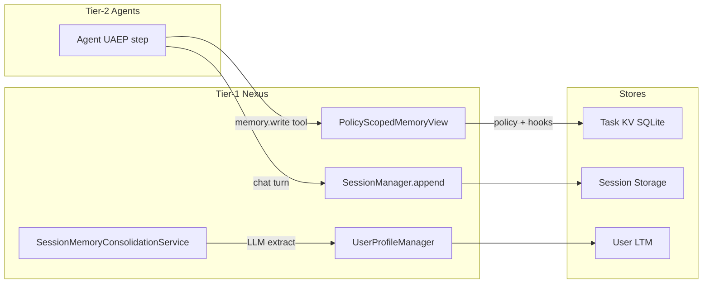
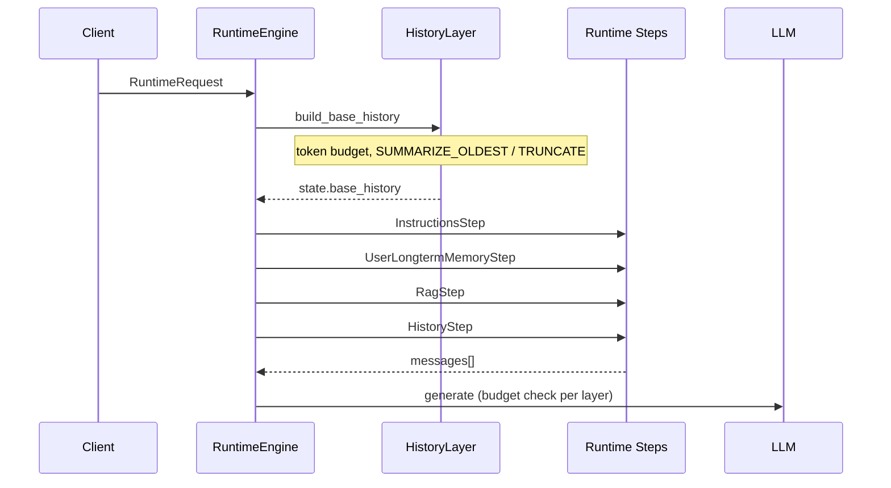
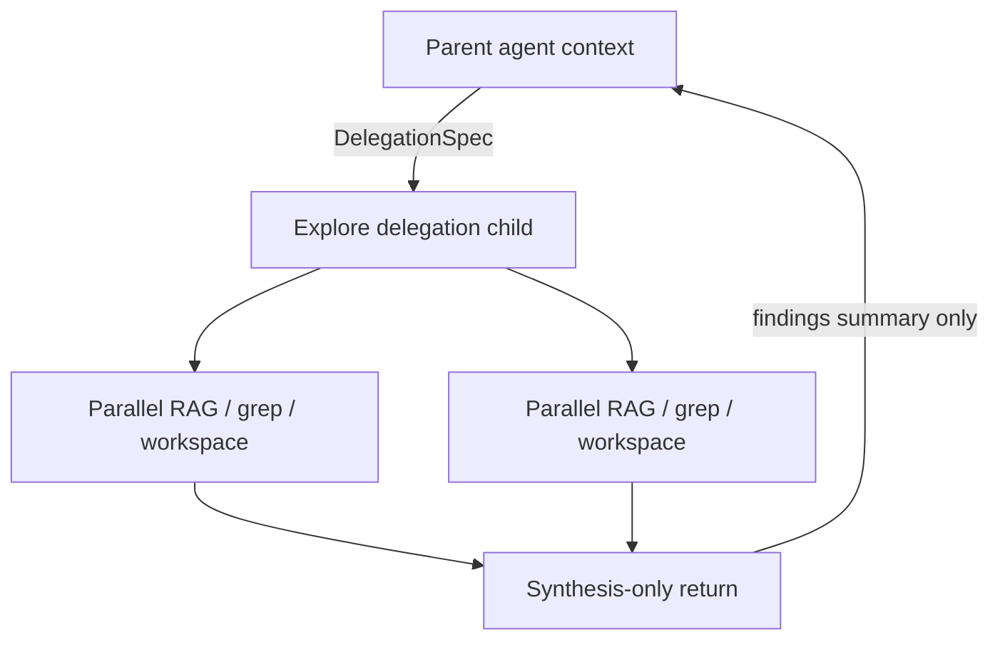

# Memory

**Status:** Canonical architecture (domain pair 1:1)  
**Hub:** [`intergrax_runtime_architecture.md`](../intergrax_runtime_architecture.md)  
**Plan (1:1):** [`plan/MEMORY.md`](../plan/MEMORY.md)  
**Target:** [`IDEAL_HARNESS_AI_ARCHITECTURE.md`](../guides/IDEAL_HARNESS_AI_ARCHITECTURE.md)  
**Audit layers:** 15–16  
**Audit instruction:** [`guides/audit/MEMORY.md`](../guides/audit/MEMORY.md)  
**Related:** [`architecture/RAG.md`](RAG.md) — Tier-0 retrieval engine; this doc covers memory stores, context assembly, and the **Knowledge vs LTM** boundary.  
---

## 2. Design principles

| Principle | Meaning in Intergrax |
|-----------|---------------------|
| **Explicit stores** | Memory is never an implicit side effect of chat history alone. Every durable fact has a store, scope, and write path. |
| **Tier-1 ownership** | Nexus owns session history, context assembly, consolidation triggers, and budget policy. Agents consume via `MemoryView` and runtime steps — no direct DB access. |
| **Bounded by default** | FIFO session limits, token budgets, LTM top_k, retention_days, namespace isolation. Unbounded growth is a defect. |
| **Separation of concerns** | **Memory** = persisted state. **Context** = what the model sees this turn. **Knowledge** = document RAG (agent-mutable only via explicit tools). **Trace** = immutable audit. |
| **Retrieval-first for scale** | Large corpora (documents, codebase, long history) enter context via retrieval, summarization, or delegation — not full dumps. |
| **Policy-governed writes** | Sensitive LTM writes pass `BEFORE_MEMORY_WRITE` hooks and `MemoryWritePolicy`. |
| **Provenance everywhere** | Every context fragment in `AgentContextBundle` and every trim/summary MUST be traceable. |
| **Graph RAG ≠ agent memory** | Document knowledge graphs (`intergrax/rag/graph/`) are retrieval infrastructure — not user entity / episodic memory (Zep-style). |

---

## 3. Three-layer memory model

Production-grade Harness AI separates three cooperating layers:

```text
┌─────────────────────────────────────────────────────────────────────────┐
│  LAYER A — Memory Stores (persisted, scoped, governed)                   │
│  STM │ Task KV │ User LTM │ Org Profile │ Knowledge (RAG) │ Trace       │
└───────────────────────────────┬─────────────────────────────────────────┘
                                │ write path
┌───────────────────────────────▼─────────────────────────────────────────┐
│  LAYER B — Memory Lifecycle (when and how to persist)                    │
│  extract → score → dedup → store → index → forget/TTL                   │
└───────────────────────────────┬─────────────────────────────────────────┘
                                │ read path
┌───────────────────────────────▼─────────────────────────────────────────┐
│  LAYER C — Context Compiler (what the LLM sees this turn)                │
│  collect → rank → budget → compress → format → validate → provenance    │
└─────────────────────────────────────────────────────────────────────────┘
```

| Layer | Phase MEM (Done) | Phase MEM-DEPTH (Done) |
|-------|------------------|------------------------|
| **A — Stores** | Four operational stores + trace + RAG wired | Mongo session parity + entity graph store |
| **B — Lifecycle** | Manual/scheduled consolidation service | Auto job, dedup, episodic, structured summaries |
| **C — Context Compiler** | Separate steps (`HistoryLayer`, budget trim) | Unified `ContextCompiler` + `DegradationLadder` + pre-flight |

---

## 4. Cognitive taxonomy vs Intergrax runtime

Industry systems (LangMem, Mem0, Zep, Letta, CoALA) use a cognitive taxonomy. Intergrax maps it as follows:

| Cognitive type | Purpose | Intergrax store / mechanism | Maturity |
|----------------|---------|----------------------------|----------|
| **Working memory** | Active turn context | `state.base_history` + injected LTM/RAG/tool blocks + `AgentContextBundle` | Strong — `ContextCompiler` |
| **Episodic** | Specific past events / trajectories | `EPISODIC_EVENT` + `SESSION_SUMMARY`; session history; trace replay | Medium |
| **Semantic** | Stable facts and preferences | `USER_FACT`, `PREFERENCE`, `ORG_FACT` + vector index | Medium — extract + RAG search |
| **Procedural** | How the system should behave | `system_instructions` (user/org profile); Prompt Registry | Minimal — no versioned procedural store |
| **Knowledge** | Document / corpus truth | RAG vectorstore; Graph RAG (documents) | Strong |
| **Task-scoped** | Per-run scratch state | `TaskMemory` + `PolicyScopedMemoryView` | Strong |
| **Trace** | Audit, not agent-mutable | `RunTraceWriter` / `RuntimeEvent` | Strong |

### 4.1 `MemoryKind` tags (entry classification)

```python
# intergrax/memory/user_profile_memory.py
USER_FACT | PREFERENCE | SESSION_SUMMARY | ORG_FACT | POLICY | OTHER
```

These tags classify **LTM entries** — they are not a full episodic/semantic/procedural type system. Target extensions (MEM-DEPTH): `EPISODIC_EVENT`, `PROCEDURE`, temporal validity fields.

---

## 5. Canon §27 → operational stores

Architecture canon §27 defines **five memory types**. Runtime implements **four mutable stores** plus knowledge retrieval and immutable trace:

```text
Canon §27 type              Runtime implementation
──────────────────────────────────────────────────────────────────
1. Task Memory              TaskMemory SQLite KV → MemoryView
2. Agent Local Memory       Same KV under agent/delegation namespaces
3. User / Organization      UserProfileManager + OrganizationProfileManager
4. Long-Term Knowledge      RAG vectorstore (+ Graph RAG for documents)
5. Execution Trace          RunTraceWriter (immutable — not agent memory)

+ Short-term (operational):  SessionManager + SessionStorage (turn-by-turn chat)
```

### 5.1 Store catalog

| Store | Scope key | Module | Agent access | Default persistence |
|-------|-----------|--------|--------------|---------------------|
| **Session (STM)** | `session_id` | `runtime/nexus/session/` | Via Nexus history steps only | SQLite (lab bundle) or in-memory |
| **Task KV** | `tenant_id` + `task_id` + namespace | `runtime/task_memory/` | `memory.*` tools via `MemoryView` | SQLite (`INTERGRAX_TASK_MEMORY_DB`) |
| **User LTM** | `tenant_id` + `user_id` | `intergrax/memory/` | Nexus `UserLongtermMemoryStep` | SQLite bundle / Mongo document_store |
| **Org profile** | `org_id` | `runtime/organization/` | Nexus profile steps | SQLite bundle |
| **Shared handoff** | `task_id` | `SharedTaskContext` | `ContextManager` | Task metadata + KV bridge |
| **Knowledge (RAG)** | collection + metadata filters | `intergrax/rag/` | `rag.retrieve` tool / `RagStep` | Vector store per integration profile |
| **Trace** | `run_id` | `runtime/nexus/tracing/` | Read-only debug APIs | SQLite |

### 5.2 Session vs checkpoint vs task KV

| Concept | Intergrax | Use when |
|---------|-----------|----------|
| **Thread / session** | `SessionManager` + `session_id` | Multi-turn chat in one conversation |
| **Checkpointer** | `SQLiteTaskCheckpointStore` | Resumable UAEP / long-running loops |
| **Scoped KV** | `TaskMemory` + `MemoryView` | Per-task agent scratch, delegation state |

Do **not** store conversational turns in task KV or checkpoint cursors in session storage.

---

## 6. Write path — memory lifecycle

### 6.1 Write paths by store



| Store | Who writes | Policy |
|-------|------------|--------|
| Task KV | Agent via `memory.write` / UAEP | `MemoryWritePolicy`, `BEFORE_MEMORY_WRITE` hook, `scope_boundary` |
| Session | Nexus after each turn | Session lifecycle coordinator |
| User LTM | `SessionMemoryConsolidationService` or explicit API | LLM extraction; optional RAG index upsert |
| Org profile | `OrganizationProfileManager` | Admin / consolidation paths |
| RAG knowledge | Ingest pipelines / tools | Not agent-silent mutation of user profile |

### 6.2 Consolidation flow

`SessionMemoryConsolidationCoordinator` triggers `SessionMemoryConsolidationService`:

| Trigger | Condition |
|---------|-----------|
| `MID_SESSION` | Every N user turns (configurable interval + cooldown) |
| `CLOSE_SESSION` | Session close when `user_id` present |

Extraction produces up to `max_facts` `USER_FACT`, `max_preferences` `PREFERENCE`, optional `SESSION_SUMMARY`. May regenerate `system_instructions` via `UserProfileInstructionsService`.

**As-built:** `MemoryConsolidationJob` + `consolidation_mode` (`manual` \| `scheduled` \| `auto`) on `MemoryProfile`. ADR: [`ADR-MEM-001`](../adr/ADR-MEM-001.md).

### 6.3 Retention and forget

| Mechanism | Applies to |
|-----------|------------|
| `MemoryProfile.retention_days` | Session + task stores |
| `should_forget_stm_record` | Task KV namespaces prefixed `stm:` |
| `UserProfileMemoryEntry.deleted` | Logical delete + vector index tombstone |
| Session purge | Storage backend TTL (when configured) |

---

## 7. Read path — context assembly today

### 7.1 Nexus session turn pipeline



| Step | Source | Injection |
|------|--------|-----------|
| `InstructionsStep` | User/org `system_instructions` | System messages |
| `UserLongtermMemoryStep` | `UserProfileManager.search_longterm` | Context block before last user |
| `RagStep` | `RetrievalService` / `rag.retrieve` | Evidence chunks |
| `HistoryStep` | `state.base_history` | Conversation turns |
| Websearch | `websearch.query` | Evidence (when enabled) |

### 7.2 Graph node context (`ContextManager`)

For multi-agent `ExecutionGraph` nodes, `ContextManager.build_agent_context()` assembles:

- Task message and node spec
- Prior dependency outputs (`TaskContextAssemblyOptions` summary tier)
- Shared context reads (`SharedTaskContext`)
- `ContextBudgetPolicy` trim on composed message
- Provenance in `AgentContextBundle`

### 7.3 As-built gap: fragmented budgeting

Today each layer applies **local** limits:

| Layer | Limit mechanism |
|-------|-----------------|
| `HistoryLayer` | ~⅔ input budget for history; `history_compression_strategy` |
| `UserLongtermMemoryStep` | `max_longterm_entries_per_query`, `max_longterm_tokens` |
| `ContextBudgetPolicy` | `max_chars` + token estimate; char-cut fallback |
| `TaskContextAssemblyOptions` | `max_prior_chars`, summary tiers |

**Unified allocator:** `ContextCompiler` + `CompileContextStep` before `CoreLLMStep`; see [`ADR-MEM-001`](../adr/ADR-MEM-001.md).

---

## 8. Compression and degradation strategies

### 8.1 Strategy matrix

| Strategy | When | Module | Trace |
|----------|------|--------|-------|
| `OFF` | Debug / short sessions | `HistoryLayer` | History diag |
| `TRUNCATE_OLDEST` | History over budget; summarization failed | `HistoryLayer` | `effective_strategy` |
| `SUMMARIZE_OLDEST` | Long sessions; tokenizer available | `HistoryLayer` + `HistorySummaryPromptBuilder` | `summary_used=true` |
| `HYBRID` | Aggressive long-horizon | `HistoryLayer` | Combined |
| Summary tiers | Graph prior outputs | `ContextManager` | `AgentContextBundle.summary_tier` |
| Char/token trim | Composed agent message | `context_budget.py` | `CONTEXT_TRIMMED` |
| LTM top_k + threshold | Query relevance | `UserLongtermMemoryStep` | `UserLongtermMemorySummaryDiagV1` |
| RAG top_k + rerank | Knowledge retrieval | `RetrievalService` | RAG trace |

### 8.2 Target degradation ladder (MEM-DEPTH)

Apply in order until invariant §1.3 is satisfied:

```text
1. FULL fidelity (all sources within budget)
2. Lower summary tier on graph priors (FULL → SUMMARY_ONLY → MINIMAL)
3. Reduce LTM/RAG top_k
4. SUMMARIZE_OLDEST on session history
5. TRUNCATE_OLDEST on session history
6. Drop lowest-scored context fragments (relevance order)
7. Tokenizer-aware hard trim (last resort — never silent char-cut)
```

Each step MUST emit diagnostics with `degradation_step` and bytes/tokens removed.

---

## 9. Intelligent strategy selection

### 9.1 Decision inputs

The Harness selects memory and compression strategies from:

| Input | Profile field / config |
|-------|------------------------|
| Host memory flags | `MemoryProfile` on `ApplicationEnvironmentProfile` |
| Context preferences | `ContextProfile.decision` (`ContextDecisionProfile`) |
| Per-request override | `RuntimeRequest.history_compression_strategy` |
| Model capacity | `llm_adapter.context_window_tokens` |
| Task shape | Single chat vs `ExecutionGraph` vs delegation |
| Query emptiness | LTM step skipped on empty query |

### 9.2 `ContextDecisionProfile` (declarative policy)

```python
# intergrax/applications/contracts/environment_profile.py
include_session_history: bool = True
prefer_longterm_memory: bool = True
prefer_rag_when_enabled: bool = True
max_memory_entries_in_context: int = 8
```

**Enforced** by `ContextCompiler` via `ContextDecisionProfile` on `RuntimeConfig`.

### 9.3 Selection matrix (normative)

| Situation | Primary memory source | Compression | Secondary |
|-----------|----------------------|-------------|-----------|
| Short chat (&lt; 30% context) | Full session history | `OFF` or light | LTM if `prefer_longterm_memory` |
| Long chat (&gt; 50% context) | Session summary + recent tail | `SUMMARIZE_OLDEST` | LTM top_k reduced |
| Document Q&A | RAG retrieval | RAG top_k within budget | Minimal history |
| Multi-agent graph node | Prior outputs + shared context | Summary tier per policy | Task KV via tools |
| Delegated explore child | Isolated namespace reads | Child budget; synthesis return | Parent gets summary only |
| User returns after days | LTM semantic search | Session history empty or short | Org profile instructions |
| Codebase-scale task | RAG + workspace tools | Retrieval-first; no full dump | Explore delegation (target) |
| Regulated / high-risk | Policy + minimal context | `MINIMAL` tier; explicit citations | HITL before LTM write |

### 9.4 When to use which store (authoring guide)

| Need | Store | Do not use |
|------|-------|------------|
| "Remember this for this run only" | Task KV (`memory.write`) | Session |
| "Remember across sessions for this user" | User LTM (consolidation or explicit entry) | Task KV |
| "Team tone and constraints" | Org profile | User LTM |
| "Facts from uploaded PDFs" | RAG collection | User LTM (unless extracted fact) |
| "What happened in run #4521" | Trace / debug journal | Mutable memory |
| "Child agent scratch pad" | Delegation namespace | Parent namespace |

---

## 10. Delegation and explore pattern

### 10.1 Delegation memory (Done — R-Delegate)

Child agents read/write under:

```text
task_id/delegation/{node_id}/
```

via `PolicyScopedMemoryView`. Parent receives bounded context via `ContextManager` — not raw child history.

### 10.2 Explore pattern (target — Cursor-class)

For wide codebase or corpus search:



Properties:

- Child runs in **isolated context window**
- Parallel searches do not bloat parent history
- Return payload is **structured findings**, not raw file dumps

Target: MEM-DEPTH-4.1, MEM-DEPTH-4.2.

---

## 11. Configuration surfaces

### 11.1 `MemoryProfile`

```python
enable_user_memory: bool
enable_org_memory: bool
enable_long_term_memory: bool
enable_task_memory: bool
retention_days: int | None
scope_boundary: str = "tenant"
# Target (MEM-DEPTH): consolidation_mode: manual | scheduled | auto
```

Mapped to `RuntimeConfig` via `memory_runtime_bridge.py` / `materialize_runtime_config`.

### 11.2 `ContextProfile`

```python
assembly_options: TaskContextAssemblyOptions  # max_prior_chars, summary tier defaults
budget_policy: ContextBudgetPolicy | None   # max_chars, max_tokens_estimate
decision: ContextDecisionProfile
enable_rag: bool
enable_websearch: bool
```

### 11.3 `RuntimeConfig` LTM limits

| Field | Role |
|-------|------|
| `enable_user_longterm_memory` | Gates `UserLongtermMemoryStep` |
| `max_longterm_entries_per_query` | top_k |
| `longterm_score_threshold` | Minimum relevance |
| `max_longterm_tokens` | Injection cap |

### 11.4 Tier-3 wiring entry points

| Function | Role |
|----------|------|
| `resolve_memory_platform_wiring()` | Session + profile stores from integration profile |
| `build_session_manager_from_environment()` | SessionManager + profile managers |
| `wire_task_memory_from_profile()` | Task KV database path |
| `materialize_runtime_config()` | Profile → RuntimeConfig bridge |

---

## 12. Persistence backend matrix

| Layer | In-memory | SQLite (lab) | MongoDB | Postgres | Redis |
|-------|-----------|--------------|---------|----------|-------|
| Task KV | tests | `INTERGRAX_TASK_MEMORY_DB` | — | — | — |
| Session | fallback | sqlite bundle | **in-memory today** | spike P3 | **not memory layer** |
| User LTM | tests | sqlite bundle | `DocumentStoreUserProfileStore` | spike P3 | — |
| Org profile | tests | sqlite bundle | — | — | — |
| Trace / events | tests | yes | — | — | — |

**Lab default:** `create_sqlite_integration()` bundles session + user LTM + org + task_memory + trace — coherent dev recovery.

---

## 13. Observability

Memory and context operations emit through the Harness Observability Spine:

| Signal | Examples |
|--------|----------|
| Runtime events | `MEMORY_READ`, `MEMORY_WRITE`, `CONTEXT_ASSEMBLED`, `CONTEXT_TRIMMED` |
| Diagnostics | `HistorySummaryDiagV1`, `UserLongtermMemorySummaryDiagV1`, `SessionConsolidationDiagV1` |
| Metrics | LTM hit rate, retention violations, memory write volume (MEM-OBS.1) |
| Debug filter | `ops:memory` (DX-5.7) |

Operators reconstruct: what was retrieved, what was trimmed, which strategy fired, and why LTM was skipped.

See [`architecture/OBSERVABILITY.md`](architecture/OBSERVABILITY.md) §3.

---

## 14. Market parity reference

| Capability | LangGraph | Mem0 / Zep | Intergrax as-built | Target |
|------------|-----------|------------|-------------------|--------|
| Thread persistence | Checkpointer | Session | Session + checkpoint separate | MEM-DEPTH-2.1 |
| Scoped KV | Store API | — | TaskMemory ✅ | — |
| Auto fact extraction | — | Core | Consolidation (manual trigger) | MEM-DEPTH-3.1 |
| Entity graph memory | — | Zep ✅ | Graph RAG docs only | MEM-DEPTH-5.1 |
| Vector semantic LTM | Optional | ✅ | User LTM via RAG index ✅ | MEM-DEPTH-3.2 dedup |
| Subagent isolation | Subgraph | — | Delegation namespace ✅ | Explore pattern MEM-DEPTH-4.* |
| Unified context budget | Partial | — | Fragmented layers | MEM-DEPTH-1.* |
| Temporal fact validity | — | Zep ✅ | ❌ | MEM-DEPTH-5.2 |

---

## 15. Anti-patterns

| Anti-pattern | Why forbidden | Correct approach |
|--------------|---------------|------------------|
| Agent concatenates full chat for LLM | Unbounded overflow | Nexus `HistoryLayer` + budget |
| Agent writes SQLite / Redis directly | Tier violation | `memory.*` tools + `MemoryView` |
| Storing documents in user LTM | Wrong store semantics | RAG ingest |
| Treating Graph RAG nodes as user entities | Conflates knowledge vs memory | Separate stores §5 |
| Silent context drop | No audit | Degradation ladder + events |
| Global shared KV without namespace | Cross-tenant leak risk | `tenant_id` + `task_id` + policy |
| Using trace as mutable memory | Immutability violation | Task KV or LTM |

---

## 16. Module inventory (do not duplicate)

| Module | Tier | Role |
|--------|------|------|
| `intergrax/memory/` | 0 | ConversationalMemory, UserProfileManager, stores |
| `intergrax/runtime/task_memory/` | 1 | TaskMemory, MemoryView, delegation, retention |
| `intergrax/runtime/nexus/session/` | 1 | SessionManager, consolidation coordinator |
| `intergrax/runtime/nexus/context/` | 1 | ContextManager, HistoryLayer, context_budget |
| `intergrax/runtime/user_profile/` | 1 | Consolidation + instructions services |
| `intergrax/applications/_shared/memory_wiring.py` | 3 | Platform wiring |
| `intergrax/runtime/nexus/context/context_compiler.py` | 1 | Context Compiler + degradation ladder |
| `intergrax/runtime/nexus/session/document_store_session_storage.py` | 1 | Mongo session persistence |
| `intergrax/memory/entity_graph_memory.py` | 0 | User entity graph (≠ Graph RAG) |
| `intergrax/tools/providers/memory/` | 0 | `memory.read/write/list_keys/delete_key` |
| `intergrax/rag/` | 0 | Knowledge retrieval (not agent LTM) |

---

## 17. Maturity scorecard and gap register

| Area | Score (1–5) | Phase MEM | Phase MEM-DEPTH |
|------|-------------|-----------|-----------------|
| Task KV | 4 | Done | 4 (maintain) |
| Context / LLM window | 4.5 | Partial | Done — Context Compiler |
| STM session | 4 | Partial | Done — Mongo + SQLite parity |
| User LTM | 4 | Partial | Done — dedup, episodic, temporal |
| Org memory | 2.5 | Partial | 2.5 |
| Consolidation | 4 | Partial | Done — job + modes |
| Graph agent memory | 3 | RFC only | Done — `EntityGraphMemoryStore` |
| Context compiler (unified) | 4.5 | N/A | Done |
| **Overall** | **~4.2** | Platform wiring Done | **Done** (2026-06-08) |

**FAUDIT-32:** Memory Layer **L3+** · Context Engineering **L4** — Phase MEM-DEPTH closeout.

All implementation tasks: [Phase MEM-DEPTH](../plan/MEMORY.md).

---

## 18. Related documents

| Document | Relationship |
|----------|--------------|
| [intergrax_runtime_architecture.md §27–§28](architecture/MEMORY.md#27-memory-model) | Canon summary — links here for depth |
| [guides/AGENT_CREATION_GUIDE.md Appendix G](guides/AGENT_CREATION_GUIDE.md#appendix-g--memory--rag-naming-phase-q) | Author control plane |
| [guides/AGENT_CREATION_GUIDE.md Appendix L](guides/AGENT_CREATION_GUIDE.md#appendix-l--context-engineering-control-plane) | Context engineering control plane |
| [architecture/TOOLS.md](architecture/TOOLS.md) | `memory.*` and `rag.retrieve` tools |
| [architecture/NEXUS_EXECUTION_FLOW.md](architecture/NEXUS_EXECUTION_FLOW.md) | Runtime turn narrative |
| [IDEAL_HARNESS_AI_ARCHITECTURE.md §16](../guides/IDEAL_HARNESS_AI_ARCHITECTURE.md#16-context-engineering-layer) | Target context compiler vision |

---

*End of Memory Architecture canon.*

---

## 19. Context Quality Hardening

Context engineering MUST include explicit quality controls (not only token budgeting):

| Control | Mechanism |
|---------|-----------|
| Relevance / freshness / confidence | Scoring in context assembly |
| Duplicate suppression | Context noise controls |
| Regression benchmarks | `context_regression_benchmark.py` |
| Lineage | Traceable chain from output evidence → source |

**Code:** `runtime/architecture/context_engineering.py`, `retrieval_effectiveness.py`, `runtime/nexus/context/`.

**Authoring:** [`guides/AGENT_CREATION_GUIDE.md` Appendix L](../guides/AGENT_CREATION_GUIDE.md).

---

## 20. Knowledge Graph and Hybrid Retrieval

Graph-native knowledge evolves from optional enhancement to first-class capability:

- graph RAG support (`intergrax/rag/graph/`),
- entity–relation semantic modeling,
- hybrid retrieval: vector + keyword + graph traversal,
- graph-backed explainability in reasoning traces.

| Module | Role |
|--------|------|
| `runtime/architecture/graph_rag.py` | Graph RAG contracts |
| `hybrid_retrieval.py` | Hybrid strategy |
| `graph_provenance.py` | Lineage for graph edges |

**Distinction:** Graph RAG indexes **document knowledge** — not user episodic memory (§4). Integration backends (Neo4j, etc.) are catalog providers in [`INTEGRATIONS.md`](INTEGRATIONS.md).

---
