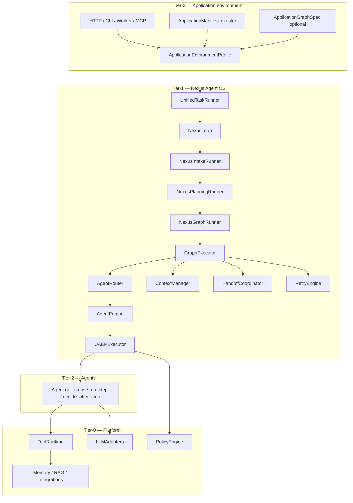
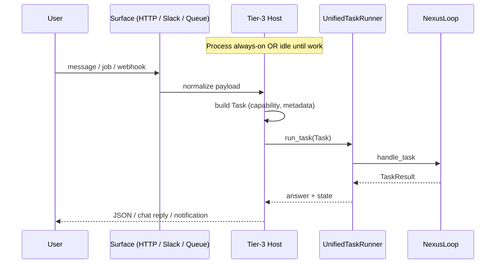
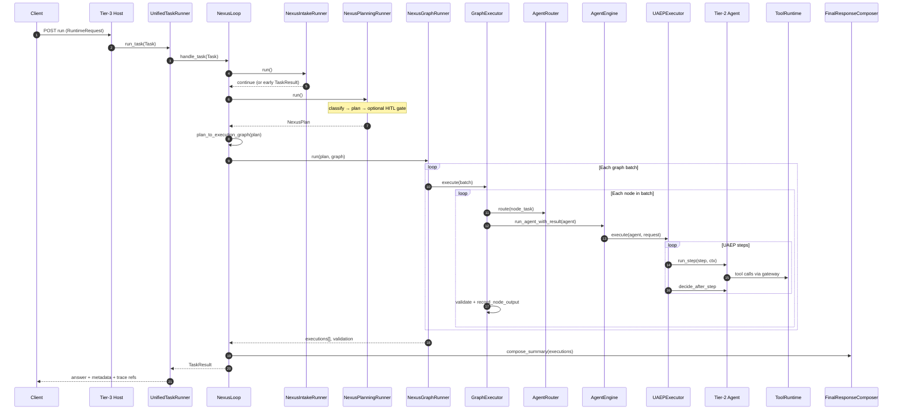
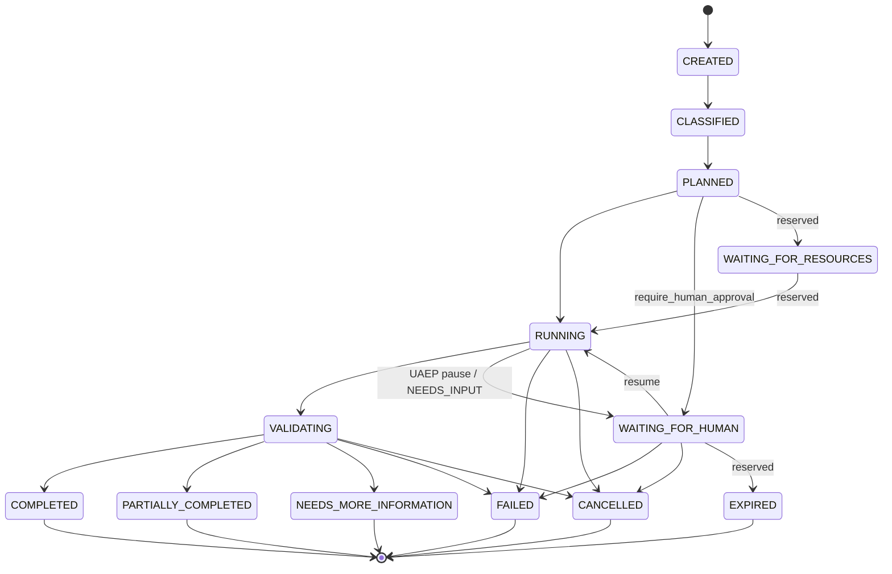

# Nexus Execution Flow

**Status:** Canonical architecture (domain pair 1:1)  
**Hub:** [`intergrax_runtime_architecture.md`](../intergrax_runtime_architecture.md)  
**Plan (1:1):** [`plan/NEXUS_EXECUTION_FLOW.md`](../plan/NEXUS_EXECUTION_FLOW.md)  
**Target:** [`IDEAL_HARNESS_AI_ARCHITECTURE.md`](../guides/IDEAL_HARNESS_AI_ARCHITECTURE.md)  
**Audit layers:** 8, 9, 10 (flow narrative) · cognition depth: [`REASONING_AND_COGNITION.md`](REASONING_AND_COGNITION.md) §7–§10  
**Audit instruction:** [`audit/NEXUS_EXECUTION_FLOW.md`](../audit/NEXUS_EXECUTION_FLOW.md)  
---

## Cursor read scope (token budget)

**Do not read this entire file in one session** (NEXUS_EXECUTION_FLOW canon).

- **Implement / audit default:** §1–§8 flow spine (purpose → classification). Extended §9+: [`satellites/NEXUS_EXECUTION_FLOW_extended_depth.md`](satellites/NEXUS_EXECUTION_FLOW_extended_depth.md).
- **Use** table of contents below — `Read` with offset/limit per §.
- **Plan hub:** [`plan/NEXUS_EXECUTION_FLOW.md`](../plan/NEXUS_EXECUTION_FLOW.md) (scoped §6 only).
- **Audit slice:** [`guides/audit_slices/NEXUS_EXECUTION_FLOW.md`](../guides/audit_slices/NEXUS_EXECUTION_FLOW.md).
- **Max reads:** at most **one** file >5k tokens per session unless RESUME cites more.

---


## Architecture satellites (read on demand)

Large § blocks moved out of the architecture hub to reduce Cursor context use.
Load **only** the satellite matching your task or cited §.

| Satellite | Contents |
|-----------|----------|
| [`satellites/NEXUS_EXECUTION_FLOW_extended_depth.md`](satellites/NEXUS_EXECUTION_FLOW_extended_depth.md) | extended depth |

> **Cursor context budget:** read hub read-scope block + **at most one** satellite per session.

## 1. Purpose and boundaries

### 1.1 What this document covers

- Full **control-flow** from task appearance to `TaskResult`
- **Data-flow** between tiers (`Task`, `SharedTaskContext`, artifacts, memory)
- **Decision ownership** — who decides agent selection, completion, retry, tools, policy
- **Orchestration variants** — single agent, multi-agent, declarative graph, handoff, HITL
- **Edge cases** — early exits, cancellation, unsupported, resume
- **Governance timeline** — when policies and hooks fire
- **Observability** — events, trace, metrics, debug APIs
- **Known runtime gaps** — honest docs↔code deltas for plan scheduling
- **Lab vs production** posture per flow variant — four-axis matrix §12.2
- **Evaluation hooks** — quality signals, registry, baselines
- **Expected telemetry** per pipeline stage

### 1.2 What this document does not cover

- Full `AgentContract` field reference → canon §12, Appendix N
- Integration/tool/skill catalogs → `architecture/INTEGRATIONS.md`, `architecture/TOOLS.md`, `architecture/SKILLS.md`
- Business product agents (Phase K) → plan §6.3
- L4 adaptive closed loops → AHIA + canon §54

### 1.3 Three planning planes (do not confuse)

Intergrax has **three independent planning/orchestration planes**:

| Plane | Owner | Decides | Example |
|-------|-------|---------|---------|
| **Nexus graph** | Tier-1 `NexusLoop` | Which **agent** runs, order, parallelism | PM → UX → Legal |
| **UAEP steps** | Tier-2 agent + `AgentEngine` | **Steps** inside one graph node | gather → analyze → summarize |
| **Tool planner** | Tier-1 `CatalogToolPlanner` | Which **tools** LLM invokes in a step loop | `rag.retrieve`, `websearch.query` |

All three converge through `ToolRuntime` for side effects and `PolicyEngine` for governance on UAEP decisions.

### 1.4 Laboratory vs production execution

| Dimension | Laboratory (`execution_mode=balanced`, lab defaults) | Production (`execution_mode=strict`) |
|-----------|------------------------------------------------------|-------------------------------------|
| `production_mode` on Nexus | `False` | `True` |
| Agent routability | Relaxed (experimental agents allowed) | `AgentRegistry.is_routable` enforced |
| Policy / security | `harness_lab.yaml`, relaxed bundles | Full `RuntimePolicyBundle` + V-SEC middleware |
| HITL | Debug APIs, manual resume | Operator queue + audit trail |
| Evaluation | `shadow_eval_enabled=True`, observe-only adaptive | `require_baseline_for_release`, trend gates (when CI enforced) |
| Merge / final answer | `FinalResponseComposer` string concat OK | Needs `MergePolicy` for multi-agent (FLOW-7) |
| Planner | Deterministic `TaskPlanner` | LLM `engine` planner expected (FLOW-1) |
| Proof level | Gate + acceptance tests | Product graph apps + ops evidence (W-OPS) |

**Rule:** UC-1–UC-6 are **harness-proven** in lab; **production-ready** multi-agent product flows (UC-5 at scale, §42.43) remain **Phase K / FLOW-8** until explicit product decision.

**Production-ready checklist (FLOW-MAINT-02):**

| Gate | Strict / product host | Evidence |
|------|----------------------|----------|
| `execution_mode=strict` | Required | `ApplicationEnvironmentProfile` |
| W-OPS SLO hooks | Trace + task lifecycle events persisted | `observability_profile` + OTEL slug |
| Reference host presets | `harness_production_stack` or product manifest | `applications/*/manifest.py` |
| Planner fail-fast | `planner_kind=engine` requires `llm_adapter` in wiring context | `test_orchestration_wiring.py` |
| Partial results policy | `ResiliencePolicy.allow_partial_result` honored in graph runner | `test_graph_runner_resilience.py::test_graph_runner_honors_allow_partial_result_lifecycle` |
| Queue worker (optional) | `INCLUDE_QUEUE_WORKER=true` for async intake | ORCH-MAINT-01 lab scaffold default |

---

## 2. Layer model at runtime



**Dependency rule:** `intergrax/` must not import `agents/` or `applications/`. Applications wire agents into `AgentRegistry` at bootstrap.

---

## 3. Entry points — how tasks appear

| Entry | Module | Same path as HTTP? |
|-------|--------|-------------------|
| HTTP `POST /runs` or `/v1/*/run` | `NexusTaskExecutionAdapter` → `UnifiedTaskRunner` | Baseline |
| Lab harness | `lab_fastapi.py` | Yes |
| MCP server | `mcp_nexus_server.py` | Yes |
| Eval runner | `nexus_eval_runner.py` | Yes |
| Long-running scheduler resume | `long_running/scheduler.py` | Yes (resume token) |
| Scaffold `new-agent` smoke | `scaffold/new_agent.py` | Yes (direct `handle_task`) |
| Debug HITL service | `debug/hitl_service.py` | Yes |

```text
RuntimeRequest / HTTP payload
    → task_from_runtime_request()  (or Task built directly)
    → UnifiedTaskRunner.run_task(task)
    → NexusLoop.handle_task(task)
```

**Tenant scope:** `UnifiedTaskRunner` wraps execution in `llm_tenant_scope(task.tenant_id)` for LLM metering.

**Bootstrap path (Tier-3):**

```text
ApplicationManifest
    → wire_application_environment()
    → AgentRegistry.register(agents…)
    → build_nexus_loop_from_environment(registry, env, …)
    → UnifiedTaskRunner(nexus_loop)
```

Key wiring: `intergrax/applications/_shared/nexus_factory.py`, `orchestration_wiring.py`, `harness_host_runtime.py`.

### 3.1 Application interaction scenarios (same Nexus path)

Every scenario below uses **`UnifiedTaskRunner.run_task()`**. Differences are **host posture** (when tasks appear) and **profile orchestration** (how many agents, in what order).

| Scenario | Host posture | Task creation | Orchestration config | Agent execution |
|----------|--------------|---------------|----------------------|-----------------|
| **S1 — Single reactive Q&A** | HTTP/MCP on demand | `POST …/run` builds `Task` with `capability` | `planner_kind=default`, 1 agent | One graph node → UAEP |
| **S2 — Free-text chat** | Daemon + intake | Slack/HTTP; capability from adapter or classifier | `classifier_kind=rules` (ORCH-CONFIG.1) or COG-3 LLM when done | As S1 or pipeline |
| **S3 — Multi-agent sequential** | On demand | `capability=*.pipeline` or orchestration token | `graph_spec` `DEPENDS_ON` chain | Nodes A→B→C sequentially |
| **S4 — Multi-agent parallel** | On demand | One `Task`, graph with independent nodes | `max_parallel_nodes`, `merge_strategy` | Batch gather in `GraphExecutor` |
| **S5 — Background batch** | Always-on worker | Queue/scheduler enqueues `Task` | `long_running_enabled`, checkpoints | Same graph rules; notify on complete |
| **S6 — Hybrid daemon** | Always-on + workers | Interactive tasks + cron index jobs | Separate capabilities per job type | Independent Nexus runs per `Task` |
| **S7 — HITL pause/resume** | Any | Agent `REQUEST_HUMAN` or planning gate | `require_human_approval`, critic L2 | `WAITING_FOR_HUMAN` → resume token → same path |

**Harness proof (CFG-06 / S3):** `tests/integration/runtime/test_orchestration_cfg_simulation.py` · canon [`ORCHESTRATION.md`](ORCHESTRATION.md) §56.13.



**Continuous vs reactive clarification:**

| Component | Continuous? | Reactive? |
|-----------|-------------|-----------|
| Tier-3 host process (uvicorn, worker) | Can be always-on | Accepts work on demand |
| `NexusLoop` | Loaded at bootstrap | Invoked per `Task` |
| Tier-2 agent instances in registry | Registered at bootstrap | Executed per graph node |
| Background index / queue consumer | Separate `Task` triggers | N/A |

**Routing:** configuration cases **CFG-*** [`ORCHESTRATION.md`](ORCHESTRATION.md) §56.7 · Tier-3 summary [`TIER3_APPLICATION_ENVIRONMENT.md`](TIER3_APPLICATION_ENVIRONMENT.md) §23 · routing modes [`REASONING_AND_COGNITION.md`](REASONING_AND_COGNITION.md) §9.4.

**Completion:** structural validation (`non_empty_summary`) is always applied; semantic completion (critic, HITL) is profile-driven — [`CRITIC_VERIFICATION.md`](CRITIC_VERIFICATION.md#verification-safety-boundaries).

---

## 4. Master sequence — happy path



---

## 5. NexusLoop phases (implementation map)

`NexusLoop._handle_task_impl()` — `intergrax/runtime/nexus/nexus_loop.py`

| Step | Runner / function | Output |
|------|-------------------|--------|
| 1 | `resolve_nexus_lifecycle()` | `TaskLifecycle`, `TaskTraceEmitter` |
| 2 | `NexusIntakeRunner.run()` | `early_result?` |
| 3 | `NexusPlanningRunner.run()` | `plan` or `early_result?` |
| 4 | `plan_to_execution_graph(plan)` | `ExecutionGraph` |
| 5 | `NexusGraphRunner.run()` | `executions` or `early_result?` |
| 6 | `_finish_task()` + `FinalResponseComposer` | `TaskResult` |

### 5.1 Orchestration package (`intergrax/runtime/nexus/orchestration/`)

| Module | Responsibility |
|--------|----------------|
| `intake_runner.py` | Resume, long-running restore, early HITL verdicts |
| `planning_runner.py` | Classify → plan → pre-graph human gate |
| `graph_runner.py` | GraphExecutor, final validation, terminal states |
| `hitl_runner.py` | Human pause/reject/escalate, lifecycle hooks |
| `task_finisher.py` | Build `TaskResult` + cleanup |
| `lifecycle_bridge.py` | Lifecycle + trace persistence |
| `long_running_bridge.py` | Checkpoint on pause/progress |
| `task_events.py` | `RuntimeEvent` publication |
| `graph_trace_callbacks.py` | Per-node trace |
| `human_response.py` | Persist human decisions |
| `workspace_cleanup.py` | Shadow/sandbox cleanup |

---

## 6. Task lifecycle state machine

`TaskLifecycle` — `intergrax/runtime/task/task_lifecycle.py`



| State | Set by (typical) | Meaning |
|-------|------------------|---------|
| `CREATED` | Intake reset on resume | Fresh or restored task |
| `CLASSIFIED` | `NexusPlanningRunner` after classifier | Routing label assigned |
| `PLANNED` | After `planner.plan()` | `NexusPlan` exists |
| `WAITING_FOR_HUMAN` | Planning gate or graph `NEEDS_INPUT` | HITL queue |
| `RUNNING` | Before graph execution | Agents executing |
| `VALIDATING` | `NexusGraphRunner` post-graph | Final validation |
| `COMPLETED` | Validation OK, all nodes OK | Success |
| `PARTIALLY_COMPLETED` | Some nodes failed, policy allows | Partial success |
| `NEEDS_MORE_INFORMATION` | Validation requests more input | Soft stop |
| `FAILED` | Unsupported, hook block, graph fail | Hard fail |
| `CANCELLED` | `CancellationCoordinator` | User/system cancel |

**Reserved states (not implemented — do not use in product design until scheduled):**

| State | Status | Plan action |
|-------|--------|-------------|
| `WAITING_FOR_RESOURCES` | **Reserved v1** — valid transitions; Nexus graph runner does not enter this state; see [ADR-FLOW-002](adr/entries/2026-06-07/ADR-FLOW-002.md) | Long-running / scheduler band |
| `EXPIRED` | **Reserved v1** — intended for HITL/scheduler timeout; see [ADR-FLOW-002](adr/entries/2026-06-07/ADR-FLOW-002.md) | Long-running / scheduler band |

Until implemented, operators should assume only the states in the diagram above are reachable from Nexus.

---

## 7. Classification — first orchestration decision

> **Canonical depth:** [`REASONING_AND_COGNITION.md`](REASONING_AND_COGNITION.md) §9 — this section is the **flow narrative** summary only.

`TaskClassifier` / `ClassifyingTaskClassifier` — `intergrax/runtime/nexus/task_classifier.py`

**Classifier does not mutate `Task.state`** — only `task.runtime.classification`. `TaskLifecycle` owns state.


| Classification | Planner behavior |
|----------------|------------------|
| `SINGLE_AGENT_*` | One `PlanStep` |
| `CAPABILITY_ROUTED` | One step; agent from capability match |
| `MULTI_AGENT` | Sequential steps for **all** agents with capability |
| `UNSUPPORTED` | Empty plan → immediate FAILED |
| `HUMAN_APPROVAL_REQUIRED` | Plan created; pause before graph if not resumed |
| `HIGH_RISK` | Label only (planner uses underlying class) |
| `LONG_RUNNING` | Label; checkpoint store if scheduler enabled |

**Wiring:** `OrchestrationProfile.classifier_kind` → only `default` today (`orchestration_wiring.py`).

---

## 8. Planning — graph topology before execution

> **Canonical depth:** [`REASONING_AND_COGNITION.md`](REASONING_AND_COGNITION.md) §10–§11 — this section is the **flow narrative** summary only.

### 8.1 Planner selection

| `planner_kind` | Implementation | LLM used? |
|----------------|----------------|-----------|
| `null` / `default` | `TaskPlanner()` | No |
| `engine` | `EngineBackedNexusPlanner` → `build_nexus_plan_from_llm()` | **Yes** (LLM JSON parse; falls back to `TaskPlanner` on failure) |
| unknown | — | `OrchestrationWiringError` at bootstrap |

**Note:** `planner_kind=engine` requires `llm_adapter` at factory bootstrap. Parsed plan steps must reference routable `agent_id` values from the registry.

If `ApplicationEnvironmentProfile.graph_spec.nodes` is non-empty:

```text
GraphSpecSeedingPlanner wraps inner planner
    if should_seed_plan_from_graph_spec(task):  # no plan_id on task
        application_graph_spec_to_nexus_plan(spec, task)
    else
        inner.plan(task, registry)
```

### 8.2 TaskPlanner strategies

`intergrax/runtime/nexus/planning/task_planner.py`

| Trigger | Plan shape |
|---------|------------|
| Default / single | 1 step, `agent_id` or first registry/capability match |
| `MULTI_AGENT` | N sequential steps, `depends_on` chain |
| `research.pipeline` or `intent=research_summarize` | 2 steps: web_search → summarize |
| `UNSUPPORTED` | 0 steps |

### 8.3 Declarative graph (`ApplicationGraphSpec`)

`graph_spec_to_plan.py` mapping:

| Edge kind | Effect on `NexusPlan` |
|-----------|----------------------|
| `DEPENDS_ON` | Target step `depends_on` source step |
| `DELEGATES_TO` | Child step `depends_on` parent; `DelegationSpec` on **child** via `SubtaskContract` (ADR-FLOW-001) |

Fluent builder: `AgentGraph` — `intergrax/applications/contracts/graph_builder.py`

```python
AgentGraph()
    .add(PMAgent).add(UXAgent)
    .edge("PMAgent", "UXAgent")           # DEPENDS_ON
    .delegates_to("PMAgent", "Research")  # DelegationSpec on PMAgent step
```

### 8.4 Plan → ExecutionGraph

`plan_to_execution_graph()` — `intergrax/runtime/nexus/execution/graph_builder.py`

Each `PlanStep` → `ExecutionNode` with `depends_on`, optional `delegation`.

---
