# Nexus Execution Flow

**Status:** Canonical architecture (domain pair 1:1)  
**Hub:** [`intergrax_runtime_architecture.md`](../intergrax_runtime_architecture.md)  
**Plan (1:1):** [`plan/NEXUS_EXECUTION_FLOW.md`](../plan/NEXUS_EXECUTION_FLOW.md)  
**Target:** [`IDEAL_HARNESS_AI_ARCHITECTURE.md`](../guides/IDEAL_HARNESS_AI_ARCHITECTURE.md)  
**Audit layers:** 8, 9, 10 (flow narrative) · cognition depth: [`REASONING_AND_COGNITION.md`](REASONING_AND_COGNITION.md) §7–§10  
**Audit instruction:** [`audit/NEXUS_EXECUTION_FLOW.md`](../audit/NEXUS_EXECUTION_FLOW.md)  
---

## Cursor read scope (token budget)

**Do not read this entire file in one session** (NEXUS_EXECUTION_FLOW canon).

- **Implement / audit default:** §1–§20 flow narrative; **production posture:** §12.2. Reference §21+: [`arch/NEXUS_EXECUTION_FLOW_scenario_catalog.md`](arch/NEXUS_EXECUTION_FLOW_scenario_catalog.md).
- **Use** table of contents below — `Read` with offset/limit per §.
- **Plan hub:** [`plan/NEXUS_EXECUTION_FLOW.md`](../plan/NEXUS_EXECUTION_FLOW.md) (scoped §6 only).
- **Audit slice:** [`guides/audit_slices/NEXUS_EXECUTION_FLOW.md`](../guides/audit_slices/NEXUS_EXECUTION_FLOW.md).
- **Max reads:** at most **one** file >5k tokens per session unless RESUME cites more.

---


## Architecture satellites (read on demand)

Large § blocks moved out of the architecture hub to reduce Cursor context use.
Load **only** the satellite matching your task or cited §.

| Satellite | Contents |
|-----------|----------|
| [`arch/NEXUS_EXECUTION_FLOW_scenario_catalog.md`](arch/NEXUS_EXECUTION_FLOW_scenario_catalog.md) | scenario catalog |

> **Cursor context budget:** read hub read-scope block + **at most one** satellite per session.

## 1. Purpose and boundaries

### 1.1 What this document covers

- Full **control-flow** from task appearance to `TaskResult`
- **Data-flow** between tiers (`Task`, `SharedTaskContext`, artifacts, memory)
- **Decision ownership** — who decides agent selection, completion, retry, tools, policy
- **Orchestration variants** — single agent, multi-agent, declarative graph, handoff, HITL
- **Edge cases** — early exits, cancellation, unsupported, resume
- **Governance timeline** — when policies and hooks fire
- **Observability** — events, trace, metrics, debug APIs
- **Known runtime gaps** — honest docs↔code deltas for plan scheduling
- **Lab vs production** posture per flow variant — four-axis matrix §12.2
- **Evaluation hooks** — quality signals, registry, baselines
- **Expected telemetry** per pipeline stage

### 1.2 What this document does not cover

- Full `AgentContract` field reference → canon §12, Appendix N
- Integration/tool/skill catalogs → `architecture/INTEGRATIONS.md`, `architecture/TOOLS.md`, `architecture/SKILLS.md`
- Business product agents (Phase K) → plan §6.3
- L4 adaptive closed loops → AHIA + canon §54

### 1.3 Three planning planes (do not confuse)

Intergrax has **three independent planning/orchestration planes**:

| Plane | Owner | Decides | Example |
|-------|-------|---------|---------|
| **Nexus graph** | Tier-1 `NexusLoop` | Which **agent** runs, order, parallelism | PM → UX → Legal |
| **UAEP steps** | Tier-2 agent + `AgentEngine` | **Steps** inside one graph node | gather → analyze → summarize |
| **Tool planner** | Tier-1 `CatalogToolPlanner` | Which **tools** LLM invokes in a step loop | `rag.retrieve`, `websearch.query` |

All three converge through `ToolRuntime` for side effects and `PolicyEngine` for governance on UAEP decisions.

### 1.4 Laboratory vs production execution

| Dimension | Laboratory (`execution_mode=balanced`, lab defaults) | Production (`execution_mode=strict`) |
|-----------|------------------------------------------------------|-------------------------------------|
| `production_mode` on Nexus | `False` | `True` |
| Agent routability | Relaxed (experimental agents allowed) | `AgentRegistry.is_routable` enforced |
| Policy / security | `harness_lab.yaml`, relaxed bundles | Full `RuntimePolicyBundle` + V-SEC middleware |
| HITL | Debug APIs, manual resume | Operator queue + audit trail |
| Evaluation | `shadow_eval_enabled=True`, observe-only adaptive | `require_baseline_for_release`, trend gates (when CI enforced) |
| Merge / final answer | `FinalResponseComposer` string concat OK | Needs `MergePolicy` for multi-agent (FLOW-7) |
| Planner | Deterministic `TaskPlanner` | LLM `engine` planner expected (FLOW-1) |
| Proof level | Gate + acceptance tests | Product graph apps + ops evidence (W-OPS) |

**Rule:** UC-1–UC-6 are **harness-proven** in lab; **production-ready** multi-agent product flows (UC-5 at scale, §42.43) remain **Phase K / FLOW-8** until explicit product decision.

**Production-ready checklist (FLOW-MAINT-02):**

| Gate | Strict / product host | Evidence |
|------|----------------------|----------|
| `execution_mode=strict` | Required | `ApplicationEnvironmentProfile` |
| W-OPS SLO hooks | Trace + task lifecycle events persisted | `observability_profile` + OTEL slug |
| Reference host presets | `harness_production_stack` or product manifest | `applications/*/manifest.py` |
| Planner fail-fast | `planner_kind=engine` requires `llm_adapter` in wiring context | `test_orchestration_wiring.py` |
| Partial results policy | `ResiliencePolicy.allow_partial_result` honored in graph runner | `test_graph_runner_resilience.py::test_graph_runner_honors_allow_partial_result_lifecycle` |
| Queue worker (optional) | `INCLUDE_QUEUE_WORKER=true` for async intake | ORCH-MAINT-01 lab scaffold default |

---

## 2. Layer model at runtime

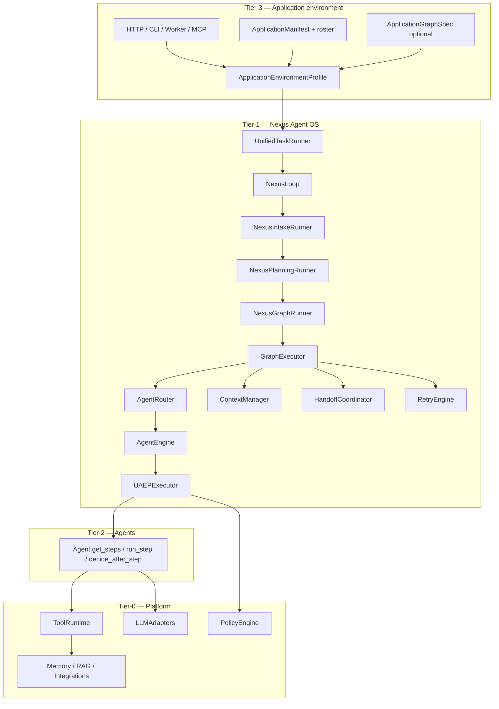

**Dependency rule:** `intergrax/` must not import `agents/` or `applications/`. Applications wire agents into `AgentRegistry` at bootstrap.

---

## 3. Entry points — how tasks appear

| Entry | Module | Same path as HTTP? |
|-------|--------|-------------------|
| HTTP `POST /runs` or `/v1/*/run` | `NexusTaskExecutionAdapter` → `UnifiedTaskRunner` | Baseline |
| Lab harness | `lab_fastapi.py` | Yes |
| MCP server | `mcp_nexus_server.py` | Yes |
| Eval runner | `nexus_eval_runner.py` | Yes |
| Long-running scheduler resume | `long_running/scheduler.py` | Yes (resume token) |
| Scaffold `new-agent` smoke | `scaffold/new_agent.py` | Yes (direct `handle_task`) |
| Debug HITL service | `debug/hitl_service.py` | Yes |

```text
RuntimeRequest / HTTP payload
    → task_from_runtime_request()  (or Task built directly)
    → UnifiedTaskRunner.run_task(task)
    → NexusLoop.handle_task(task)
```

**Tenant scope:** `UnifiedTaskRunner` wraps execution in `llm_tenant_scope(task.tenant_id)` for LLM metering.

**Bootstrap path (Tier-3):**

```text
ApplicationManifest
    → wire_application_environment()
    → AgentRegistry.register(agents…)
    → build_nexus_loop_from_environment(registry, env, …)
    → UnifiedTaskRunner(nexus_loop)
```

Key wiring: `intergrax/applications/_shared/nexus_factory.py`, `orchestration_wiring.py`, `harness_host_runtime.py`.

### 3.1 Application interaction scenarios (same Nexus path)

Every scenario below uses **`UnifiedTaskRunner.run_task()`**. Differences are **host posture** (when tasks appear) and **profile orchestration** (how many agents, in what order).

| Scenario | Host posture | Task creation | Orchestration config | Agent execution |
|----------|--------------|---------------|----------------------|-----------------|
| **S1 — Single reactive Q&A** | HTTP/MCP on demand | `POST …/run` builds `Task` with `capability` | `planner_kind=default`, 1 agent | One graph node → UAEP |
| **S2 — Free-text chat** | Daemon + intake | Slack/HTTP; capability from adapter or classifier | `classifier_kind=rules` (ORCH-CONFIG.1) or COG-3 LLM when done | As S1 or pipeline |
| **S3 — Multi-agent sequential** | On demand | `capability=*.pipeline` or orchestration token | `graph_spec` `DEPENDS_ON` chain | Nodes A→B→C sequentially |
| **S4 — Multi-agent parallel** | On demand | One `Task`, graph with independent nodes | `max_parallel_nodes`, `merge_strategy` | Batch gather in `GraphExecutor` |
| **S5 — Background batch** | Always-on worker | Queue/scheduler enqueues `Task` | `long_running_enabled`, checkpoints | Same graph rules; notify on complete |
| **S6 — Hybrid daemon** | Always-on + workers | Interactive tasks + cron index jobs | Separate capabilities per job type | Independent Nexus runs per `Task` |
| **S7 — HITL pause/resume** | Any | Agent `REQUEST_HUMAN` or planning gate | `require_human_approval`, critic L2 | `WAITING_FOR_HUMAN` → resume token → same path |

**Harness proof (CFG-06 / S3):** `tests/integration/runtime/test_orchestration_cfg_simulation.py` · canon [`ORCHESTRATION.md`](ORCHESTRATION.md) §56.13.

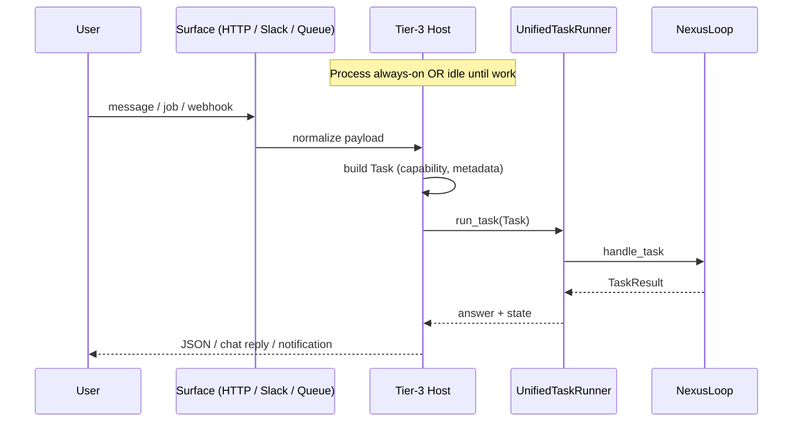

**Continuous vs reactive clarification:**

| Component | Continuous? | Reactive? |
|-----------|-------------|-----------|
| Tier-3 host process (uvicorn, worker) | Can be always-on | Accepts work on demand |
| `NexusLoop` | Loaded at bootstrap | Invoked per `Task` |
| Tier-2 agent instances in registry | Registered at bootstrap | Executed per graph node |
| Background index / queue consumer | Separate `Task` triggers | N/A |

**Routing:** configuration cases **CFG-*** [`ORCHESTRATION.md`](ORCHESTRATION.md) §56.7 · Tier-3 summary [`TIER3_APPLICATION_ENVIRONMENT.md`](TIER3_APPLICATION_ENVIRONMENT.md) §23 · routing modes [`REASONING_AND_COGNITION.md`](REASONING_AND_COGNITION.md) §9.4.

**Completion:** structural validation (`non_empty_summary`) is always applied; semantic completion (critic, HITL) is profile-driven — [`CRITIC_VERIFICATION.md`](CRITIC_VERIFICATION.md).

---

## 4. Master sequence — happy path

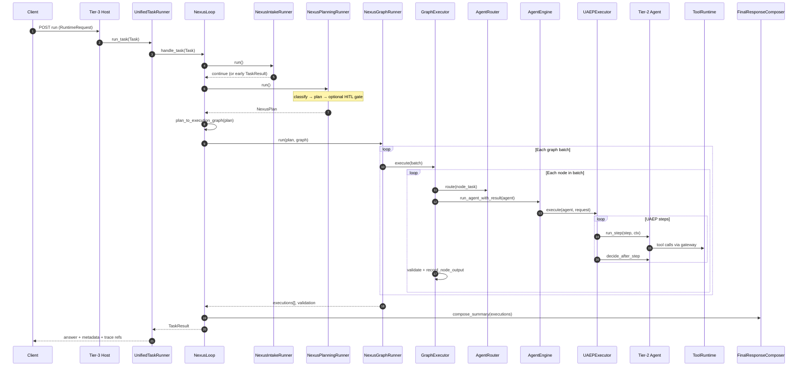

---

## 5. NexusLoop phases (implementation map)

`NexusLoop._handle_task_impl()` — `intergrax/runtime/nexus/nexus_loop.py`

| Step | Runner / function | Output |
|------|-------------------|--------|
| 1 | `resolve_nexus_lifecycle()` | `TaskLifecycle`, `TaskTraceEmitter` |
| 2 | `NexusIntakeRunner.run()` | `early_result?` |
| 3 | `NexusPlanningRunner.run()` | `plan` or `early_result?` |
| 4 | `plan_to_execution_graph(plan)` | `ExecutionGraph` |
| 5 | `NexusGraphRunner.run()` | `executions` or `early_result?` |
| 6 | `_finish_task()` + `FinalResponseComposer` | `TaskResult` |

### 5.1 Orchestration package (`intergrax/runtime/nexus/orchestration/`)

| Module | Responsibility |
|--------|----------------|
| `intake_runner.py` | Resume, long-running restore, early HITL verdicts |
| `planning_runner.py` | Classify → plan → pre-graph human gate |
| `graph_runner.py` | GraphExecutor, final validation, terminal states |
| `hitl_runner.py` | Human pause/reject/escalate, lifecycle hooks |
| `task_finisher.py` | Build `TaskResult` + cleanup |
| `lifecycle_bridge.py` | Lifecycle + trace persistence |
| `long_running_bridge.py` | Checkpoint on pause/progress |
| `task_events.py` | `RuntimeEvent` publication |
| `graph_trace_callbacks.py` | Per-node trace |
| `human_response.py` | Persist human decisions |
| `workspace_cleanup.py` | Shadow/sandbox cleanup |

---

## 6. Task lifecycle state machine

`TaskLifecycle` — `intergrax/runtime/task/task_lifecycle.py`

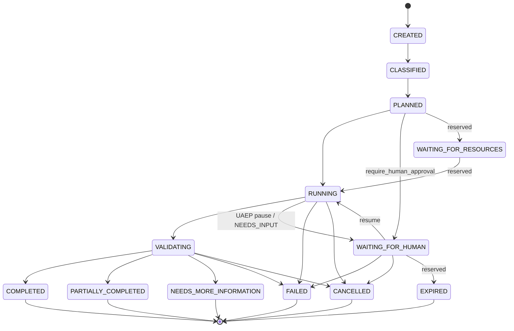

| State | Set by (typical) | Meaning |
|-------|------------------|---------|
| `CREATED` | Intake reset on resume | Fresh or restored task |
| `CLASSIFIED` | `NexusPlanningRunner` after classifier | Routing label assigned |
| `PLANNED` | After `planner.plan()` | `NexusPlan` exists |
| `WAITING_FOR_HUMAN` | Planning gate or graph `NEEDS_INPUT` | HITL queue |
| `RUNNING` | Before graph execution | Agents executing |
| `VALIDATING` | `NexusGraphRunner` post-graph | Final validation |
| `COMPLETED` | Validation OK, all nodes OK | Success |
| `PARTIALLY_COMPLETED` | Some nodes failed, policy allows | Partial success |
| `NEEDS_MORE_INFORMATION` | Validation requests more input | Soft stop |
| `FAILED` | Unsupported, hook block, graph fail | Hard fail |
| `CANCELLED` | `CancellationCoordinator` | User/system cancel |

**Reserved states (not implemented — do not use in product design until scheduled):**

| State | Status | Plan action |
|-------|--------|-------------|
| `WAITING_FOR_RESOURCES` | **Reserved v1** — valid transitions; Nexus graph runner does not enter this state; see [ADR-FLOW-002](adr/entries/2026-06-07/ADR-FLOW-002.md) | Long-running / scheduler band |
| `EXPIRED` | **Reserved v1** — intended for HITL/scheduler timeout; see [ADR-FLOW-002](adr/entries/2026-06-07/ADR-FLOW-002.md) | Long-running / scheduler band |

Until implemented, operators should assume only the states in the diagram above are reachable from Nexus.

---

## 7. Classification — first orchestration decision

> **Canonical depth:** [`REASONING_AND_COGNITION.md`](REASONING_AND_COGNITION.md) §9 — this section is the **flow narrative** summary only.

`TaskClassifier` / `ClassifyingTaskClassifier` — `intergrax/runtime/nexus/task_classifier.py`

**Classifier does not mutate `Task.state`** — only `task.runtime.classification`. `TaskLifecycle` owns state.

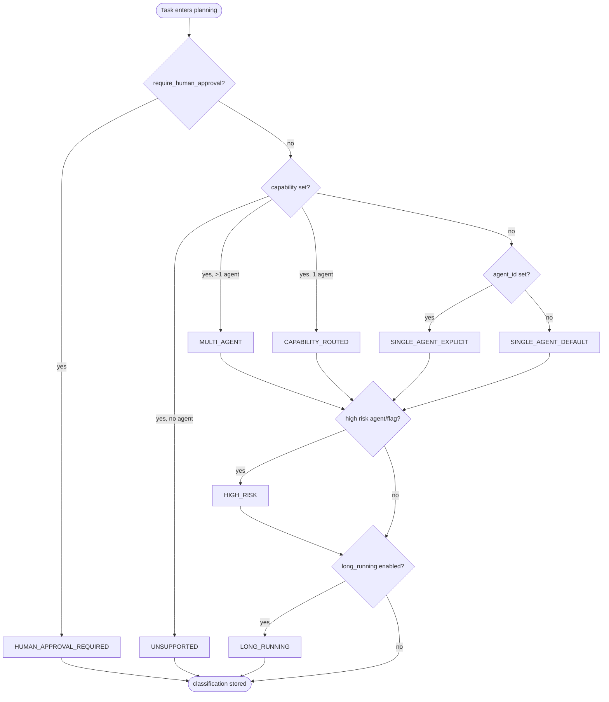

| Classification | Planner behavior |
|----------------|------------------|
| `SINGLE_AGENT_*` | One `PlanStep` |
| `CAPABILITY_ROUTED` | One step; agent from capability match |
| `MULTI_AGENT` | Sequential steps for **all** agents with capability |
| `UNSUPPORTED` | Empty plan → immediate FAILED |
| `HUMAN_APPROVAL_REQUIRED` | Plan created; pause before graph if not resumed |
| `HIGH_RISK` | Label only (planner uses underlying class) |
| `LONG_RUNNING` | Label; checkpoint store if scheduler enabled |

**Wiring:** `OrchestrationProfile.classifier_kind` → only `default` today (`orchestration_wiring.py`).

---

## 8. Planning — graph topology before execution

> **Canonical depth:** [`REASONING_AND_COGNITION.md`](REASONING_AND_COGNITION.md) §10–§11 — this section is the **flow narrative** summary only.

### 8.1 Planner selection

| `planner_kind` | Implementation | LLM used? |
|----------------|----------------|-----------|
| `null` / `default` | `TaskPlanner()` | No |
| `engine` | `EngineBackedNexusPlanner` → `build_nexus_plan_from_llm()` | **Yes** (LLM JSON parse; falls back to `TaskPlanner` on failure) |
| unknown | — | `OrchestrationWiringError` at bootstrap |

**Note:** `planner_kind=engine` requires `llm_adapter` at factory bootstrap. Parsed plan steps must reference routable `agent_id` values from the registry.

If `ApplicationEnvironmentProfile.graph_spec.nodes` is non-empty:

```text
GraphSpecSeedingPlanner wraps inner planner
    if should_seed_plan_from_graph_spec(task):  # no plan_id on task
        application_graph_spec_to_nexus_plan(spec, task)
    else
        inner.plan(task, registry)
```

### 8.2 TaskPlanner strategies

`intergrax/runtime/nexus/planning/task_planner.py`

| Trigger | Plan shape |
|---------|------------|
| Default / single | 1 step, `agent_id` or first registry/capability match |
| `MULTI_AGENT` | N sequential steps, `depends_on` chain |
| `research.pipeline` or `intent=research_summarize` | 2 steps: web_search → summarize |
| `UNSUPPORTED` | 0 steps |

### 8.3 Declarative graph (`ApplicationGraphSpec`)

`graph_spec_to_plan.py` mapping:

| Edge kind | Effect on `NexusPlan` |
|-----------|----------------------|
| `DEPENDS_ON` | Target step `depends_on` source step |
| `DELEGATES_TO` | Child step `depends_on` parent; `DelegationSpec` on **child** via `SubtaskContract` (ADR-FLOW-001) |

Fluent builder: `AgentGraph` — `intergrax/applications/contracts/graph_builder.py`

```python
AgentGraph()
    .add(PMAgent).add(UXAgent)
    .edge("PMAgent", "UXAgent")           # DEPENDS_ON
    .delegates_to("PMAgent", "Research")  # DelegationSpec on PMAgent step
```

### 8.4 Plan → ExecutionGraph

`plan_to_execution_graph()` — `intergrax/runtime/nexus/execution/graph_builder.py`

Each `PlanStep` → `ExecutionNode` with `depends_on`, optional `delegation`.

---

## 9. Graph execution — batches, routing, merge

### 9.1 Topological batches

`ExecutionGraph.batches()` → list of parallelizable node groups.

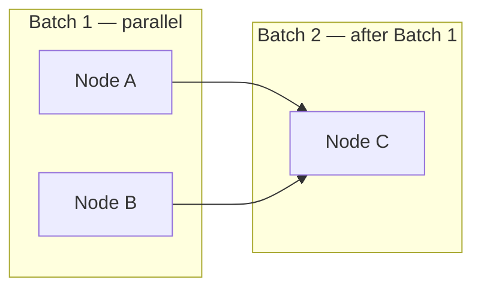

| Control | Source |
|---------|--------|
| Parallel within batch | `asyncio.gather` in `GraphExecutor` |
| `max_parallel_nodes` | `OrchestrationProfile` → semaphore |
| `max_inflight_nodes` | Optional backpressure event `GRAPH_BACKPRESSURE` |
| Sequential across batches | `depends_on` topological order |
| Stop on failure | First failed node aborts remaining graph (unless retry recovers) |

### 9.2 Per-node execution pipeline

`GraphExecutor._execute_node()`:

1. Skip if checkpoint says completed or cancelled
2. `ContextManager.build_agent_context()` → apply to `node_task`
3. Middleware `BEFORE_AGENT_SELECTION` → `AgentRouter.route()` → `AFTER_AGENT_SELECTION`
4. `RetryEngine.execute_with_retry()` → `AgentEngine.run_agent_with_result()`
5. Validate via `NexusValidationEngine`
6. On success: `record_node_output()` → optional dynamic handoff node
7. On failure: node `FAILED`, graph may stop

### 9.3 AgentRouter priority

`intergrax/runtime/nexus/agent_router.py`

1. `task.agent_id` if registered and `is_routable(production_mode)`
2. `task.context.capability` → highest `can_handle().score`
3. `registry.find_best_match(context)`
4. Fallback: first `list_routable_agent_ids()`

`production_mode=True` when `execution_mode=strict` on environment profile.

### 9.4 Cross-node data flow

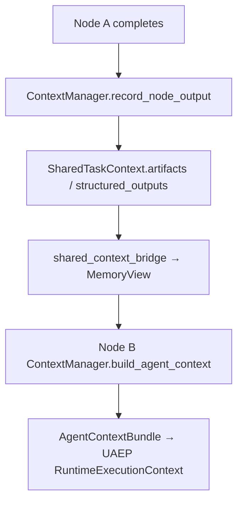

**Rule:** agents never call each other. All cross-agent data via `SharedTaskContext` / `MemoryView` (canon §42.14).

### 9.5 Final result merge

**Implemented (FLOW-7):** `FinalResponseComposer.compose_summary()` — `intergrax/runtime/nexus/response/final_response_composer.py`

| `OrchestrationProfile.merge_strategy` | Behavior |
|---------------------------------------|----------|
| `concat` (default) | `"[agent_id] summary"` blocks joined by `\n\n` |
| `last_wins` | Last non-empty agent summary |
| `structured_json` | JSON payload with per-agent status and summary |

Metadata via `compose_metadata()`: `plan_id`, `agent_ids`, `retry_count`, `all_completed`.

**Future (not in FLOW-7):** citation-preserving merge, validator-aware merge, LLM-assisted synthesis, conflict-aware HITL — see [`IDEAL_HARNESS_AI_ARCHITECTURE.md`](guides/IDEAL_HARNESS_AI_ARCHITECTURE.md).

---

## 10. UAEP — execution inside one graph node

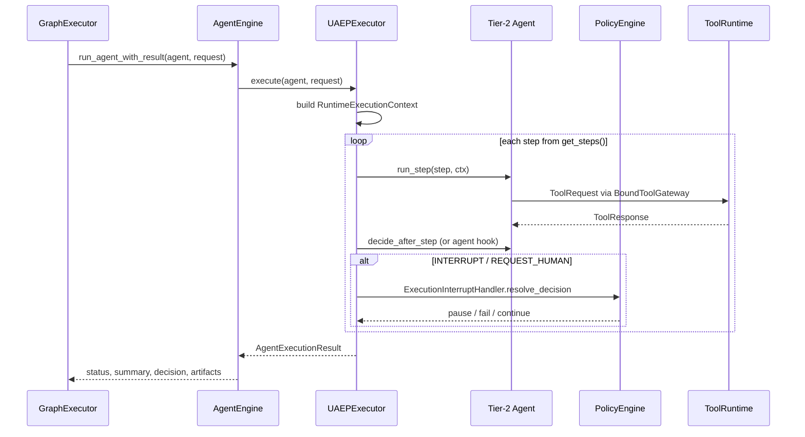

| `AgentDecision` | Nexus action |
|-----------------|--------------|
| `CONTINUE` | Next UAEP step |
| `COMPLETE` | Node success path |
| `RETRY` | UAEP/runtime retry policy (not agent loop over adapters) |
| `REQUEST_HUMAN` | Pause → `WAITING_FOR_HUMAN` |
| `INTERRUPT` | `PolicyEngine.evaluate_interrupt` → HITL or fail |
| `HANDOFF` | `HandoffCoordinator` inserts graph node |
| `MODIFY_PLAN` | Reserved / policy-dependent replan |
| `FAIL` | Node failed |
| `CANCEL` | `CancellationCoordinator` |

---

## 11. Decision ownership matrix

| Decision | Owner | Input | Output |
|----------|-------|-------|--------|
| Task classification | `TaskClassifier` | `Task`, registry | `classification` label |
| Plan topology | `NexusTaskPlannerProtocol` | classification, registry, graph_spec | `NexusPlan` |
| Graph structure | `plan_to_execution_graph` | plan | `ExecutionGraph` |
| Agent for node | `AgentRouter` | `node_task`, capability, contract | `Agent` instance |
| UAEP step order | Tier-2 `get_steps()` | agent contract | step list |
| Step continue/stop | Agent `decide_after_step` | step output | `AgentDecision` |
| Interrupt resolution | `ExecutionInterruptHandler` + `PolicyEngine` | interrupt, decision | pause/fail/continue |
| Node validation | `NexusValidationEngine` | execution, plan_criteria | `ValidationResult` |
| Node retry / alternate agent | `RetryEngine` | validation fail, policy | retry or switch agent |
| Dynamic handoff target | `HandoffCoordinator` | `AgentHandoff` | new graph node |
| Graph continuation | `GraphExecutor` | node status | next batch or stop |
| Task terminal state | `NexusGraphRunner` + validation | all executions | COMPLETED/FAILED/… |
| Final answer text | `FinalResponseComposer` | execution summaries | string |
| Tool allow-list | `AgentContract` + skills + `RuntimePolicyBundle` | contract, skill_ids | `allowed_tools` |
| Tool invocation | `ToolRuntime` | `ToolRequest` | policy-checked execute |
| LLM tool selection | `CatalogToolPlanner` / native tool_calls | LLM response | planned tool calls |

---

## 12. Multi-agent variants (use cases)

### UC-1 — Single agent (lab default)

**Config:** one agent in roster, no `graph_spec`, no capability.

```text
classification: SINGLE_AGENT_DEFAULT
plan: 1 step → agent_id = first in registry
graph: 1 node
```

### UC-2 — Explicit agent

**Config:** `Task(agent_id="echo", …)`

```text
classification: SINGLE_AGENT_EXPLICIT
plan: 1 step with fixed agent_id
```

### UC-3 — Capability routing (one agent)

**Config:** `Task(context.capability="legal.review")`, one agent registered.

```text
classification: CAPABILITY_ROUTED
plan: 1 step, agent from find_by_capability
```

### UC-4 — Auto multi-agent (same capability)

**Config:** two+ agents register same capability, task requests that capability.

```text
classification: MULTI_AGENT
plan: sequential steps for ALL matching agents (order = registry order)
graph: chain depends_on step_1 → step_2 → …
```

### UC-5 — Declarative graph (recommended for product)

**Config:** `ApplicationEnvironmentProfile.graph_spec` or `HarnessApplication.graph(AgentGraph()…)`.

```text
GraphSpecSeedingPlanner → NexusPlan from edges
graph: parallel batches from DEPENDS_ON topology
```

### UC-6 — Research pipeline (built-in)

**Config:** `capability=research.pipeline` or `intent=research_summarize`.

```text
plan: research step → summarize step (depends_on)
```

### UC-7 — Runtime handoff

**Config:** agent returns `AgentDecision.HANDOFF` with `AgentHandoff` payload.

```text
GraphExecutor._maybe_execute_handoff → new node appended → executed before batch ends
```

### UC-8 — Human approval before run

**Config:** `task.options.governance.require_human_approval=True`.

```text
classification: HUMAN_APPROVAL_REQUIRED
plan created → WAITING_FOR_HUMAN before graph
resume → RUNNING → graph executes
```

### UC-9 — Long-running + checkpoint

**Config:** `orchestration_profile.long_running_enabled` + `reliability_profile.long_running_scheduler_enabled`.

```text
checkpoints on pause/progress via long_running_bridge
resume restores plan/graph/UAEP cursor from SQLite
```

### 12.1 Production readiness, tests, and telemetry by variant

| UC | Lab-ready | Production-ready | Primary gate tests | Key telemetry |
|----|-----------|------------------|-------------------|---------------|
| UC-1 Single agent | **Yes** | Partial (needs strict profile proof) | `test_acceptance_01_single_agent_execution` | `TASK_CREATED`, `PLAN_CREATED`, `TASK_COMPLETED` |
| UC-2 Explicit agent | **Yes** | Partial | `test_acceptance_01_*` + router unit tests | + `agent_id` in trace metadata |
| UC-3 Capability routed | **Yes** | Partial | `tests/unit/runtime/nexus/` classifier tests | + `classification=capability_routed` |
| UC-4 Auto multi-agent | **Yes** | Partial (ordering fragile) | `test_acceptance_02_sequential_multi_agent` | + per-node `on_node_complete` |
| UC-5 Declarative graph | **Yes** | Partial | `test_graph_spec_to_plan.py`, `test_lab_graph_spec.py` | + `plan_id`, `graph_id` |
| UC-6 Research pipeline | **Yes** (stub agents) | No (stub descriptions) | planner unit tests | `PLAN_CREATED` step_count=2 |
| UC-7 Runtime handoff | **Yes** | Partial | `test_graph_executor_handoff_retry.py`, `test_acceptance_08_memory_handoff` | `HANDOFF_*`, `ops:handoff` |
| UC-8 HITL before run | **Yes** | Partial | `test_acceptance_04_human_approval_flow` | `HUMAN_APPROVAL_REQUESTED`, `WAITING_FOR_HUMAN` |
| UC-9 Long-running | **Yes** | Partial (scheduler optional) | `test_acceptance_05_checkpoint_recovery`, `05b_mid_step_uaep_resume` | checkpoint events, `TASK_PROGRESS` |

**Why Production-ready = Partial (2026-06-09 audit, synced):** harness runtime proves semantics; production claims additionally require (a) `execution_mode=strict` + critic profile on the deployment host, (b) operational SLO evidence (W-OPS), (c) product-specific validation beyond reference host presets. Reference hosts mount task control + async APIs (H-APP-WIRING **Done**); LKW hybrid daemon remains **Deferred** §6.3. UC-6 remains **No** until product research agents replace stubs (§6.3).

**Additional cross-cutting acceptance:** `test_acceptance_03_parallel_multi_agent`, `06_retry_flow`, `07_partial_results`, `09_sandbox_tool_execution`, `10_shadow_workspace` — `tests/acceptance/agent_os/test_agent_os_scenarios.py`.

**Four-axis maturity:** legacy **Lab-ready** / **Production-ready = Partial** labels in the table above map to [`MATURITY_TAXONOMY.md`](../guides/MATURITY_TAXONOMY.md) — typically **P1–P2** (lab) and **P2–P3** (partial production) with **E3** acceptance evidence, **not** **P4** without W-OPS and strict-host proof. Per-scenario detail: §12.2.

### 12.2 Scenario Production Status

**Purpose:** Explicit production posture for **execution-path scenarios** (S1–S8). These differ from **application interaction scenarios** in §3.1 (host posture / intake timing) and from **use-case variants** UC-1–UC-9 in §12 — cross-ref those tables for UC-specific tests and telemetry.

**Taxonomy:** [`MATURITY_TAXONOMY.md`](../guides/MATURITY_TAXONOMY.md) — four independent axes (**A** / **I** / **P** / **E**). Levels on one axis do **not** imply levels on another.

**Cross-references:** [`SYSTEM_INVARIANTS.md`](../guides/SYSTEM_INVARIANTS.md) · [`RELIABILITY_FAILURE_AND_HITL.md`](RELIABILITY_FAILURE_AND_HITL.md) · [`UNIFIED_EXECUTION_RUNTIME.md`](UNIFIED_EXECUTION_RUNTIME.md) · [`AGENT_CONTRACTS_AND_ASSEMBLY.md`](AGENT_CONTRACTS_AND_ASSEMBLY.md)

#### Normative rules

1. A scenario **MUST NOT** be treated as production-ready only because it appears in this architecture document. Production readiness requires an explicit **Production readiness** maturity of **P4** or higher and stated evidence on the **Evidence** axis.
2. When implementing or modifying Nexus execution paths, Cursor **MUST** identify which scenario (S1–S8) is being changed and **MUST NOT** silently upgrade that scenario's production readiness — update this matrix and evidence in the same change set when maturity claims change.

#### Scenario matrix (S1–S8)

| Scenario | Intended use | Current status | Architecture maturity | Implementation maturity | Production readiness | Evidence maturity | Required evidence / remaining gaps | Notes |
|----------|--------------|----------------|----------------------|----------------------|---------------------|-------------------|-------------------------------------|-------|
| **S1 — Single task through UnifiedTaskRunner** | Tier-3 host sends one `Task` through `UnifiedTaskRunner.run_task()` → `NexusLoop.handle_task()` to one selected agent (canonical happy path) | **Current supported path** (lab + reference hosts) | **A5** — normative entry in §3–§4; tier boundaries enforced | **I4** — all listed entry points converge on UTR (`NexusTaskExecutionAdapter`, MCP, eval runner, long-running resume) | **P2** — harness-proven; **P3** only with `execution_mode=strict` + reference host preset (§1.4) | **E3** — `test_acceptance_01_single_agent_execution`; `test_nexus_task_execution_adapter.py`; J1 unified entry integration | W-OPS SLO persistence; product-host ops window before **P4** | Maps to UC-1/UC-2/UC-3 single-node plans. Legacy §12.1: Lab-ready **Yes**, Production-ready **Partial**. |
| **S2 — Single agent bounded local loop** | `AgentEngine` runs one Tier-2 agent through bounded UAEP step loop under policy / budget / context / observability controls | **Current supported path** | **A5** — §10, §11; canon UAEP contract | **I4** — `UAEPExecutor` + `AgentEngine.run_agent_with_result()` on graph path; bounded `decide_after_step` loop | **P2** — lab default; strict profile + critic wiring for **P3** | **E3** — `test_acceptance_01_*`; ACP checkpoint/resume acceptance family | Step-budget and run-budget enforcement proof on product agents; must be verified against deployment profile | Not unbounded ReAct — agent emits `AgentDecision`, runtime owns retry (§14.1 layer B). |
| **S3 — Tool execution through ToolRuntime** | Agent requests tool action; side effects go through `ToolRuntime` / policy / observability (no direct SDK) | **Current supported path** | **A5** — §15–§17; [`TOOLS.md`](TOOLS.md) pipeline | **I4** — `RuntimeToolInvoker`, `BoundToolGateway`, policy middleware L0–L7 | **P2** — sandbox path proven; **P3** with full `RuntimePolicyBundle` + V-SEC on strict host | **E3** — `test_acceptance_09_sandbox_tool_execution`; tool gate tests | Semantic/hierarchical selection modes (TOOL-ENG-13/14) before **P4** on broad catalogs; idempotency evidence per tool class | Legacy §12.1 cross-cutting acceptance includes `10_shadow_workspace`. |
| **S4 — Context-compiled LLM step** | LLM context assembled through `ContextCompiler` / ContextEngine degradation ladder, not unbounded prompt concatenation | **Current supported path** (lab); hot-path wiring complete | **A4** — [`CONTEXT_ENGINEERING.md`](CONTEXT_ENGINEERING.md) §10; MEM/CE canon | **I4** — CE-EXT + CE-3.9 hot-path compiler on Nexus agent context build | **P2** — lab/dev; long-session and token-budget proof thin for **P3+** | **E3** — `test_context_compiler.py`, `test_compile_service.py`, `test_acceptance_context_compiler_long_session.py` | Product-scale context profiles + degradation telemetry under strict host; must be verified against target app roster | `ContextManager.build_agent_context()` → compiled bundle before UAEP LLM step. |
| **S5 — Multi-agent graph execution** | Nexus / graph runtime selects and executes multiple agents as an `ExecutionGraph` (sequential, parallel, declarative `graph_spec`) | **Current supported path** (lab); product graphs **controlled** | **A5** — §8–§9, §12 UC-4/UC-5; ORCH canon | **I4** — `GraphExecutor`, `GraphSpecSeedingPlanner`, merge composer (FLOW-7) | **P2** — harness CFG + acceptance; **P3** partial — ordering/merge limits (§12.1 UC-4 **Partial**) | **E3** — `test_acceptance_02/03_*`, `test_orchestration_cfg_simulation.py`, `test_graph_spec_to_plan.py` | FLOW-8 product host (§6.3); W-OPS multi-node traces; `MergePolicy` beyond concat for product **P4** | Legacy §12.1: UC-4/UC-5 Lab-ready **Yes**, Production-ready **Partial**. |
| **S6 — Retry / failure / degradation path** | Runtime handles validation failure, tool failure, timeout, retry, partial result, degradation or stop | **Current supported path** (lab) | **A4** — §14; [`RELIABILITY_FAILURE_AND_HITL.md`](RELIABILITY_FAILURE_AND_HITL.md) | **I4** — three retry layers wired (§14.1); `ResiliencePolicy.allow_partial_result` (FLOW-MAINT-01/05) | **P2** — lab resilience proven; whole-run retry (layer C) **disabled by default** | **E3** — `test_acceptance_06_retry_flow`, `07_partial_results`, `test_graph_runner_resilience.py` | Layer C (`RetryCoordinator`) opt-in proof; budget-exceeded → HITL wiring; ops runbooks for degradation | Agents **MUST NOT** unbounded retry loops ([`SYSTEM_INVARIANTS.md`](../guides/SYSTEM_INVARIANTS.md) §8). |
| **S7 — HITL approval path** | Agent requests human input or approval; Nexus / HITL mechanism manages approval boundary | **Controlled / lab**; production queue posture profile-driven | **A4** — §6 lifecycle, §12 UC-8; REL + CVL canon | **I3** — planning gate + UAEP `REQUEST_HUMAN` / interrupt handler; debug + harness APIs | **P2** — acceptance + lab HITL service; **P3** with operator queue + audit on strict host | **E3** — `test_acceptance_04_human_approval_flow`; CRIT-V-FOLLOWUP L2 HITL tests | Production operator queue SLA; `EXPIRED` lifecycle reserved (ADR-FLOW-002); semantic critic-only gates insufficient for irreversible actions (SYS-INV §8) | Distinct from ad-hoc agent messages — runtime owns `WAITING_FOR_HUMAN`. |
| **S8 — Advanced adaptive / scaling / autonomous optimization** | AHIA observes/proposes/evaluates; Elastic Capacity Plane scales infra — may propose routing, policy or profile changes | **Target / restricted** — observe-only default; **not auto-applied in production** unless governance explicitly enables | **A4** — [`ADAPTIVE_HARNESS_INTELLIGENCE.md`](ADAPTIVE_HARNESS_INTELLIGENCE.md); target architecture documented | **I2** — observation/mining modules; closed-loop auto-apply **not** production default | **P0–P1** — **MUST NOT** silently mutate prompts, routing, policies or profiles ([`SYSTEM_INVARIANTS.md`](../guides/SYSTEM_INVARIANTS.md) §9) | **E1–E2** — ADRs, AHIA plan closeout; limited harness observation tests | Explicit product/governance enablement + **E4+** before any auto-apply **P3+**; ECP must not decide agent topology | Legacy **L4** AHIA modes ≠ production-ready — map per [`MATURITY_TAXONOMY.md`](../guides/MATURITY_TAXONOMY.md) legacy table. |

#### Status legend

| **Current status** | Meaning |
|--------------------|---------|
| **Current supported path** | Intended harness path; safe for lab and reference hosts with documented profile limits |
| **Controlled / lab** | Implemented but requires explicit profile, operator tooling, or tenant gate before production scale |
| **Target / restricted** | Architecture and partial code exist; production auto-apply forbidden by default |

**Audit ID:** P2-ARCH-04 (2026-06-20)

---

## 13. Delegation vs depends_on vs handoff

### 13.1 Semantic model (three mechanisms)

| Mechanism | When | Who schedules child | Memory model |
|-----------|------|---------------------|--------------|
| `DEPENDS_ON` | Declarative graph | Plan → separate graph node | Shared context via `ContextManager` |
| `DELEGATES_TO` | Declarative graph | Plan expansion → child node ([ADR-FLOW-001](adr/entries/2026-06-07/ADR-FLOW-001.md)) | Child node + `DelegationSpec` via `SubtaskContract` |
| `AgentDecision.HANDOFF` | Runtime | `HandoffCoordinator` inserts node | Handoff payload in shared context |
| UAEP steps | Inside one node | Same agent | Agent-local + shared read |

### 13.2 Runtime semantics (post FLOW-2/14)

| View | `DELEGATES_TO` meaning |
|------|------------------------|
| **Canon §42.14.3** | Subagent equivalent — child execution with `DelegationSpec` |
| **Runtime (truth)** | `graph_spec_to_plan.py` expands edge → child `PlanStep`; `DelegationSpec` on **child**; `GraphExecutor` routes `child_agent_id` |

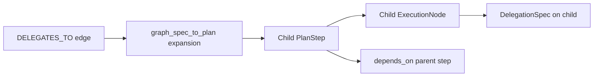

**`max_delegation_depth`:** enforced in `GraphExecutor` (FLOW-3). **`max_llm_calls` / `max_tool_calls`:** optional delegation budget envelope (FLOW-15).

### 13.3 Decision record

Accepted and implemented: [`adr/entries/2026-06-07/ADR-FLOW-001.md`](adr/entries/2026-06-07/ADR-FLOW-001.md) (FLOW-2, FLOW-14).

---

## 14. Retry, failure, and abandonment

### 14.1 Three retry layers (do not conflate)

| Layer | Component | Trigger | Scope | Who decides | Default |
|-------|-----------|---------|-------|-------------|---------|
| **A — Graph node** | `RetryEngine` | `NexusValidationEngine` fails node result | Same graph node; may switch agent | Runtime (`decide()` alternate agent) | `max_retries=1`; factory sets 3 or 1 (`strict`) |
| **B — ACP / agent run** | `AgentEngine`, `HarnessKernel`, `AgentDecision.RETRY` | LLM/tool transient, agent requests retry via `StepOutcome` | **Inside one node** — `on_next_step` loop | Runtime policy (`max_run_retries` on `RuntimeConfig`) | Per agent host |
| **C — Whole run** | `RetryCoordinator` in `NexusGraphRunner` | Re-execute entire graph after failure | Full plan / all nodes | Runtime coordinator | **`max_run_retries=0` — disabled** |


**Agent rule:** agents emit `AgentDecision.RETRY` — they do **not** loop `for attempt in range(n)` over adapters (canon §31, §42.34).

### 14.2 Abandonment triggers

| Condition | Terminal state | Who decides |
|-----------|----------------|-------------|
| `UNSUPPORTED` classification | `FAILED` | `NexusPlanningRunner` |
| Hook `BLOCK` on lifecycle | `FAILED` | Middleware |
| Human `REJECT` | `FAILED` | `NexusHitlRunner` |
| Max node retries exceeded | `FAILED` | `RetryEngine` |
| Graph node failure (strict) | `FAILED` | `NexusGraphRunner` |
| Cancel requested | `CANCELLED` | `CancellationCoordinator` |
| `NEEDS_INPUT` / governance pause | `WAITING_FOR_HUMAN` | UAEP + graph runner |
| Budget exceeded (when wired) | `FAILED` or HITL | `RunBudget` / cost profile |

---

## 15. Tool selection flow

> **Canonical tool engine manifest:** [`TOOLS.md`](TOOLS.md#tool-execution-pipeline) — full select → invoke → log pipeline and component roles.  
> **Production selection modes:** [`TOOLS.md` §Tool selection modes](TOOLS.md#tool-selection-modes-production-strategies) — standard / semantic / hierarchical. This section covers the **selection** subgraph; §16–§17 cover governance hooks and telemetry.

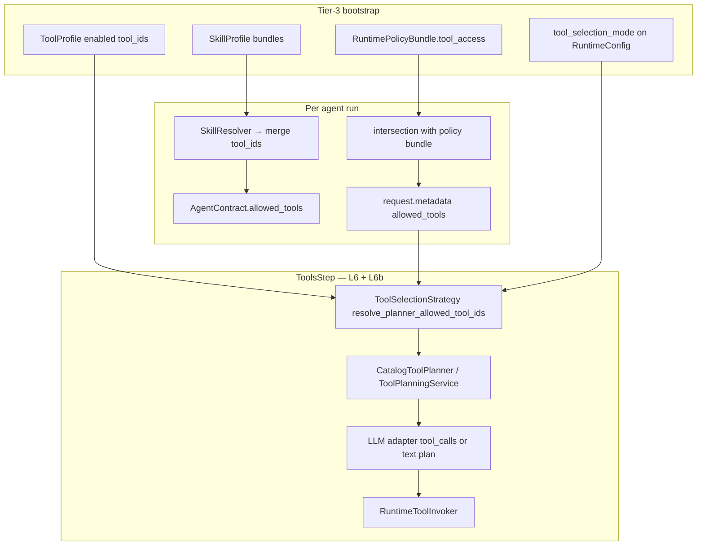

| Stage | Enforces |
|-------|----------|
| Bootstrap (L0) | Which tools exist in registry for this host |
| Contract + skills (L1–L2) | Agent-level allow-list |
| Policy bundle (L3–L5) | Org/tenant / plan restrictions |
| **Selection mode (L6)** | Schema narrowing — standard (`full_catalog`), keyword top-k (`retrieval_top_k`), skill pack; **semantic** / **hierarchical** planned (TOOL-ENG-13/14) — see [`TOOLS.md`](TOOLS.md#tool-selection-modes-production-strategies) |
| **LLM planner (L6b)** | `CatalogToolPlanner` → `tool_calls` from narrowed schema |
| `RuntimeToolInvoker` (L7) | Per-call scope, trace, idempotency |
| Security middleware | `BEFORE_TOOL_CALL` injection defense |

**Agents must not** import vendor SDKs or call integrations directly (canon §42.12, §42.41).

### 15.1 Tool invocation orchestration (Plane 3 — vs graph)

> **Canonical patterns:** [`TOOLS.md`](TOOLS.md#tool-invocation-patterns-production-orchestration) — single / parallel batch / bounded ReAct / deterministic chain.  
> **Agent graph orchestration:** [`ORCHESTRATION.md`](ORCHESTRATION.md) §50–§56 — `ExecutionGraph` / `GraphExecutor` (separate domain).

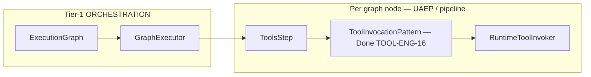

| Layer | Orchestrates | Module | Tool iterations? |
|-------|--------------|--------|------------------|
| **Agent graph** | Agents, delegation, merge | `GraphExecutor` | **No** — ADR-TOOL-002 rejects tool ReAct from graph |
| **Tool invocation pattern** | Multi-call plan within one step | `ToolInvocationPattern` **Done** (TOOL-ENG-16) | **Yes** — `bounded_react`, `parallel_batch`, etc. |
| **Atomic invoke** | Single `tool_id` call | `RuntimeToolInvoker` | N/A |

**Flow (production):** `run_bounded_tool_loop` / `ctx.invoke_tool` → `resolve_invocation_pattern(config)` → shipped or custom `ToolInvocationPattern.execute()` → `RuntimeToolInvoker` (TOOL-ENG-16/22).

---
