# Nexus Execution Flow Reference

**Status:** Canonical architecture document
**Hub:** [`intergrax_runtime_architecture.md`](../intergrax_runtime_architecture.md)
**Target:** [`IDEAL_HARNESS_AI_ARCHITECTURE.md`](../IDEAL_HARNESS_AI_ARCHITECTURE.md)
**Implementation:** [`INTERGRAX_IMPLEMENTATION_PLAN.md`](../INTERGRAX_IMPLEMENTATION_PLAN.md) · [`plan/phases/`](../plan/phases/)

---


**Status:** Living **operational** reference for Nexus execution flow (2026-06-07) — narrative aligned with **current runtime code**, with explicit target semantics where canon ahead of implementation  
**Audience:** Platform engineers, Tier-3 authors, auditors, implementers updating the plan  
**Scope:** Task intake → Nexus orchestration → agent execution → result, governance, observability, evaluation hooks  

This document is the **single narrative guide** for how Intergrax orchestrates agents. It **does not replace** canonical contracts — it links and operationalizes them.

### Document hierarchy (read order)

```text
IDEAL_HARNESS_AI_ARCHITECTURE.md     →  target Harness AI reference (L0–L4)
intergrax_runtime_architecture.md    →  canonical contracts + architecture (§42)
architecture/NEXUS_EXECUTION_FLOW.md    →  operational execution narrative (this file)
INTERGRAX_IMPLEMENTATION_PLAN.md     →  implementation status, phases, gap queue
```

| Role | Canonical source |
|------|------------------|
| Target architecture | [`IDEAL_HARNESS_AI_ARCHITECTURE.md`](IDEAL_HARNESS_AI_ARCHITECTURE.md) |
| Contracts (what) | [`intergrax_runtime_architecture.md`](intergrax_runtime_architecture.md) §42 |
| Control plane (how to configure) | [`guides/AGENT_CREATION_GUIDE.md`](guides/AGENT_CREATION_GUIDE.md) Appendix I, H, J |
| Phase status / gaps | [`INTERGRAX_IMPLEMENTATION_PLAN.md`](INTERGRAX_IMPLEMENTATION_PLAN.md) |
| Audit layers §7–§10 | [`INTEGRAX_HARNESS_AUDIT_MAP.md`](INTEGRAX_HARNESS_AUDIT_MAP.md) |
| Delegation target semantics | [`adr/ADR-FLOW-001.md`](adr/ADR-FLOW-001.md) |
| L4 adaptive loops (separate) | [`architecture/ADAPTIVE_HARNESS_INTELLIGENCE.md`](architecture/ADAPTIVE_HARNESS_INTELLIGENCE.md) |

**Use this doc to update the plan:** Section [25 — Plan traceability matrix](#25-plan-traceability-matrix) maps runtime gaps to proposed plan rows (`FLOW-GAP.*`).

**Verdict:** Treat this file as **best current description of Nexus execution truth** plus a **gap map** — not as “architecture with zero gaps.”

---

## 1. Purpose and boundaries

### 1.1 What this document covers

- Full **control-flow** from task appearance to `TaskResult`
- **Data-flow** between tiers (`Task`, `SharedTaskContext`, artifacts, memory)
- **Decision ownership** — who decides agent selection, completion, retry, tools, policy
- **Orchestration variants** — single agent, multi-agent, declarative graph, handoff, HITL
- **Edge cases** — early exits, cancellation, unsupported, resume
- **Governance timeline** — when policies and hooks fire
- **Observability** — events, trace, metrics, debug APIs
- **Known runtime gaps** — honest docs↔code deltas for plan scheduling
- **Lab vs production** posture per flow variant
- **Evaluation hooks** — quality signals, registry, baselines
- **Expected telemetry** per pipeline stage

### 1.2 What this document does not cover

- Full `AgentContract` field reference → canon §12, Appendix N
- Integration/tool/skill catalogs → `architecture/INTEGRATIONS.md`, `architecture/TOOLS.md`, `architecture/SKILLS.md`
- Business product agents (Phase K) → plan §6.3
- L4 adaptive closed loops → AHIA + canon §54

### 1.3 Three planning planes (do not confuse)

Intergrax has **three independent planning/orchestration planes**:

| Plane | Owner | Decides | Example |
|-------|-------|---------|---------|
| **Nexus graph** | Tier-1 `NexusLoop` | Which **agent** runs, order, parallelism | PM → UX → Legal |
| **UAEP steps** | Tier-2 agent + `AgentEngine` | **Steps** inside one graph node | gather → analyze → summarize |
| **Tool planner** | Tier-1 `CatalogToolPlanner` | Which **tools** LLM invokes in a step loop | `rag.retrieve`, `websearch.query` |

All three converge through `ToolRuntime` for side effects and `PolicyEngine` for governance on UAEP decisions.

### 1.4 Laboratory vs production execution

| Dimension | Laboratory (`execution_mode=balanced`, lab defaults) | Production (`execution_mode=strict`) |
|-----------|------------------------------------------------------|-------------------------------------|
| `production_mode` on Nexus | `False` | `True` |
| Agent routability | Relaxed (experimental agents allowed) | `AgentRegistry.is_routable` enforced |
| Policy / security | `harness_lab.yaml`, relaxed bundles | Full `RuntimePolicyBundle` + V-SEC middleware |
| HITL | Debug APIs, manual resume | Operator queue + audit trail |
| Evaluation | `shadow_eval_enabled=True`, observe-only adaptive | `require_baseline_for_release`, trend gates (when CI enforced) |
| Merge / final answer | `FinalResponseComposer` string concat OK | Needs `MergePolicy` for multi-agent (FLOW-7) |
| Planner | Deterministic `TaskPlanner` | LLM `engine` planner expected (FLOW-1) |
| Proof level | Gate + acceptance tests | Product graph apps + ops evidence (W-OPS) |

**Rule:** UC-1–UC-6 are **harness-proven** in lab; **production-ready** multi-agent product flows (UC-5 at scale, §42.43) remain **Phase K / FLOW-8** until explicit product decision.

---

## 2. Layer model at runtime

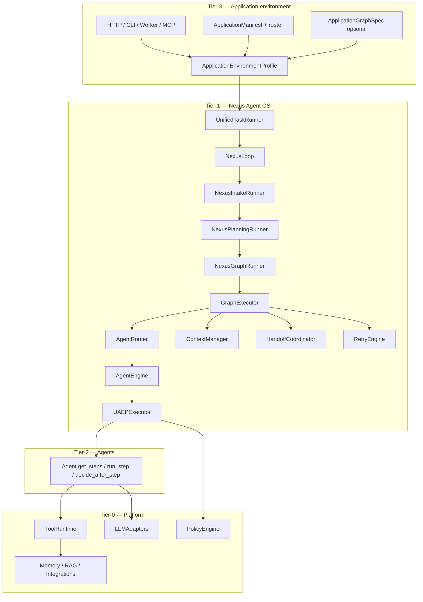

**Dependency rule:** `intergrax/` must not import `agents/` or `applications/`. Applications wire agents into `AgentRegistry` at bootstrap.

---

## 3. Entry points — how tasks appear

| Entry | Module | Same path as HTTP? |
|-------|--------|-------------------|
| HTTP `POST /runs` or `/v1/*/run` | `NexusTaskExecutionAdapter` → `UnifiedTaskRunner` | Baseline |
| Lab harness | `lab_fastapi.py` | Yes |
| MCP server | `mcp_nexus_server.py` | Yes |
| Eval runner | `nexus_eval_runner.py` | Yes |
| Long-running scheduler resume | `long_running/scheduler.py` | Yes (resume token) |
| Scaffold `new-agent` smoke | `scaffold/new_agent.py` | Yes (direct `handle_task`) |
| Debug HITL service | `debug/hitl_service.py` | Yes |

```text
RuntimeRequest / HTTP payload
    → task_from_runtime_request()  (or Task built directly)
    → UnifiedTaskRunner.run_task(task)
    → NexusLoop.handle_task(task)
```

**Tenant scope:** `UnifiedTaskRunner` wraps execution in `llm_tenant_scope(task.tenant_id)` for LLM metering.

**Bootstrap path (Tier-3):**

```text
ApplicationManifest
    → wire_application_environment()
    → AgentRegistry.register(agents…)
    → build_nexus_loop_from_environment(registry, env, …)
    → UnifiedTaskRunner(nexus_loop)
```

Key wiring: `intergrax/applications/_shared/nexus_factory.py`, `orchestration_wiring.py`, `harness_host_runtime.py`.

---

## 4. Master sequence — happy path

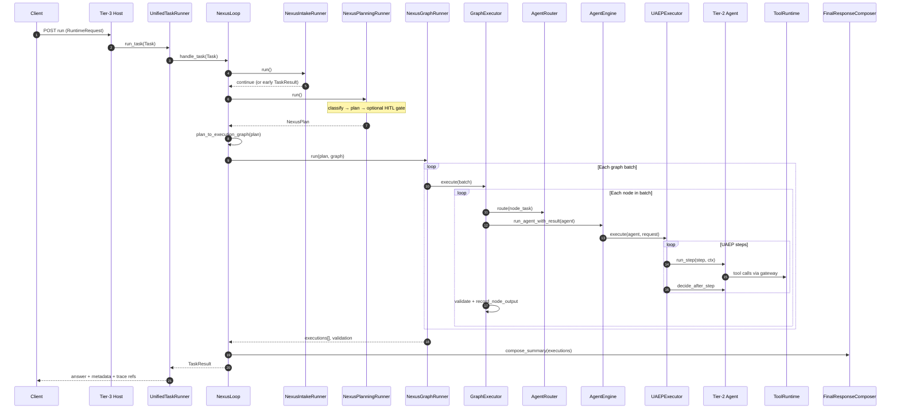

---

## 5. NexusLoop phases (implementation map)

`NexusLoop._handle_task_impl()` — `intergrax/runtime/nexus/nexus_loop.py`

| Step | Runner / function | Output |
|------|-------------------|--------|
| 1 | `resolve_nexus_lifecycle()` | `TaskLifecycle`, `TaskTraceEmitter` |
| 2 | `NexusIntakeRunner.run()` | `early_result?` |
| 3 | `NexusPlanningRunner.run()` | `plan` or `early_result?` |
| 4 | `plan_to_execution_graph(plan)` | `ExecutionGraph` |
| 5 | `NexusGraphRunner.run()` | `executions` or `early_result?` |
| 6 | `_finish_task()` + `FinalResponseComposer` | `TaskResult` |

### 5.1 Orchestration package (`intergrax/runtime/nexus/orchestration/`)

| Module | Responsibility |
|--------|----------------|
| `intake_runner.py` | Resume, long-running restore, early HITL verdicts |
| `planning_runner.py` | Classify → plan → pre-graph human gate |
| `graph_runner.py` | GraphExecutor, final validation, terminal states |
| `hitl_runner.py` | Human pause/reject/escalate, lifecycle hooks |
| `task_finisher.py` | Build `TaskResult` + cleanup |
| `lifecycle_bridge.py` | Lifecycle + trace persistence |
| `long_running_bridge.py` | Checkpoint on pause/progress |
| `task_events.py` | `RuntimeEvent` publication |
| `graph_trace_callbacks.py` | Per-node trace |
| `human_response.py` | Persist human decisions |
| `workspace_cleanup.py` | Shadow/sandbox cleanup |

---

## 6. Task lifecycle state machine

`TaskLifecycle` — `intergrax/runtime/task/task_lifecycle.py`

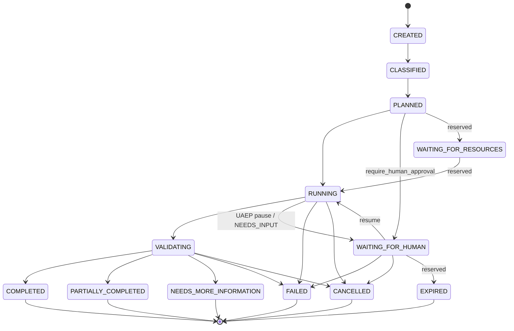

| State | Set by (typical) | Meaning |
|-------|------------------|---------|
| `CREATED` | Intake reset on resume | Fresh or restored task |
| `CLASSIFIED` | `NexusPlanningRunner` after classifier | Routing label assigned |
| `PLANNED` | After `planner.plan()` | `NexusPlan` exists |
| `WAITING_FOR_HUMAN` | Planning gate or graph `NEEDS_INPUT` | HITL queue |
| `RUNNING` | Before graph execution | Agents executing |
| `VALIDATING` | `NexusGraphRunner` post-graph | Final validation |
| `COMPLETED` | Validation OK, all nodes OK | Success |
| `PARTIALLY_COMPLETED` | Some nodes failed, policy allows | Partial success |
| `NEEDS_MORE_INFORMATION` | Validation requests more input | Soft stop |
| `FAILED` | Unsupported, hook block, graph fail | Hard fail |
| `CANCELLED` | `CancellationCoordinator` | User/system cancel |

**Reserved states (not implemented — do not use in product design until scheduled):**

| State | Status | Plan action |
|-------|--------|-------------|
| `WAITING_FOR_RESOURCES` | **Reserved v1** — valid transitions; Nexus graph runner does not enter this state; see [ADR-FLOW-002](adr/ADR-FLOW-002.md) | Long-running / scheduler band |
| `EXPIRED` | **Reserved v1** — intended for HITL/scheduler timeout; see [ADR-FLOW-002](adr/ADR-FLOW-002.md) | Long-running / scheduler band |

Until implemented, operators should assume only the states in the diagram above are reachable from Nexus.

---

## 7. Classification — first orchestration decision

`TaskClassifier` / `ClassifyingTaskClassifier` — `intergrax/runtime/nexus/task_classifier.py`

**Classifier does not mutate `Task.state`** — only `task.runtime.classification`. `TaskLifecycle` owns state.


| Classification | Planner behavior |
|----------------|------------------|
| `SINGLE_AGENT_*` | One `PlanStep` |
| `CAPABILITY_ROUTED` | One step; agent from capability match |
| `MULTI_AGENT` | Sequential steps for **all** agents with capability |
| `UNSUPPORTED` | Empty plan → immediate FAILED |
| `HUMAN_APPROVAL_REQUIRED` | Plan created; pause before graph if not resumed |
| `HIGH_RISK` | Label only (planner uses underlying class) |
| `LONG_RUNNING` | Label; checkpoint store if scheduler enabled |

**Wiring:** `OrchestrationProfile.classifier_kind` → only `default` today (`orchestration_wiring.py`).

---

## 8. Planning — graph topology before execution

### 8.1 Planner selection

| `planner_kind` | Implementation | LLM used? |
|----------------|----------------|-----------|
| `null` / `default` | `TaskPlanner()` | No |
| `engine` | `EngineBackedNexusPlanner` → `build_nexus_plan_from_llm()` | **Yes** (LLM JSON parse; falls back to `TaskPlanner` on failure) |
| unknown | — | `OrchestrationWiringError` at bootstrap |

**Note:** `planner_kind=engine` requires `llm_adapter` at factory bootstrap. Parsed plan steps must reference routable `agent_id` values from the registry.

If `ApplicationEnvironmentProfile.graph_spec.nodes` is non-empty:

```text
GraphSpecSeedingPlanner wraps inner planner
    if should_seed_plan_from_graph_spec(task):  # no plan_id on task
        application_graph_spec_to_nexus_plan(spec, task)
    else
        inner.plan(task, registry)
```

### 8.2 TaskPlanner strategies

`intergrax/runtime/nexus/planning/task_planner.py`

| Trigger | Plan shape |
|---------|------------|
| Default / single | 1 step, `agent_id` or first registry/capability match |
| `MULTI_AGENT` | N sequential steps, `depends_on` chain |
| `research.pipeline` or `intent=research_summarize` | 2 steps: web_search → summarize |
| `UNSUPPORTED` | 0 steps |

### 8.3 Declarative graph (`ApplicationGraphSpec`)

`graph_spec_to_plan.py` mapping:

| Edge kind | Effect on `NexusPlan` |
|-----------|----------------------|
| `DEPENDS_ON` | Target step `depends_on` source step |
| `DELEGATES_TO` | Child step `depends_on` parent; `DelegationSpec` on **child** via `SubtaskContract` (ADR-FLOW-001) |

Fluent builder: `AgentGraph` — `intergrax/applications/contracts/graph_builder.py`

```python
AgentGraph()
    .add(PMAgent).add(UXAgent)
    .edge("PMAgent", "UXAgent")           # DEPENDS_ON
    .delegates_to("PMAgent", "Research")  # DelegationSpec on PMAgent step
```

### 8.4 Plan → ExecutionGraph

`plan_to_execution_graph()` — `intergrax/runtime/nexus/execution/graph_builder.py`

Each `PlanStep` → `ExecutionNode` with `depends_on`, optional `delegation`.

---

## 9. Graph execution — batches, routing, merge

### 9.1 Topological batches

`ExecutionGraph.batches()` → list of parallelizable node groups.

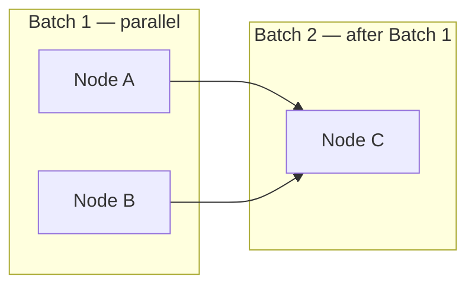

| Control | Source |
|---------|--------|
| Parallel within batch | `asyncio.gather` in `GraphExecutor` |
| `max_parallel_nodes` | `OrchestrationProfile` → semaphore |
| `max_inflight_nodes` | Optional backpressure event `GRAPH_BACKPRESSURE` |
| Sequential across batches | `depends_on` topological order |
| Stop on failure | First failed node aborts remaining graph (unless retry recovers) |

### 9.2 Per-node execution pipeline

`GraphExecutor._execute_node()`:

1. Skip if checkpoint says completed or cancelled
2. `ContextManager.build_agent_context()` → apply to `node_task`
3. Middleware `BEFORE_AGENT_SELECTION` → `AgentRouter.route()` → `AFTER_AGENT_SELECTION`
4. `RetryEngine.execute_with_retry()` → `AgentEngine.run_agent_with_result()`
5. Validate via `NexusValidationEngine`
6. On success: `record_node_output()` → optional dynamic handoff node
7. On failure: node `FAILED`, graph may stop

### 9.3 AgentRouter priority

`intergrax/runtime/nexus/agent_router.py`

1. `task.agent_id` if registered and `is_routable(production_mode)`
2. `task.context.capability` → highest `can_handle().score`
3. `registry.find_best_match(context)`
4. Fallback: first `list_routable_agent_ids()`

`production_mode=True` when `execution_mode=strict` on environment profile.

### 9.4 Cross-node data flow

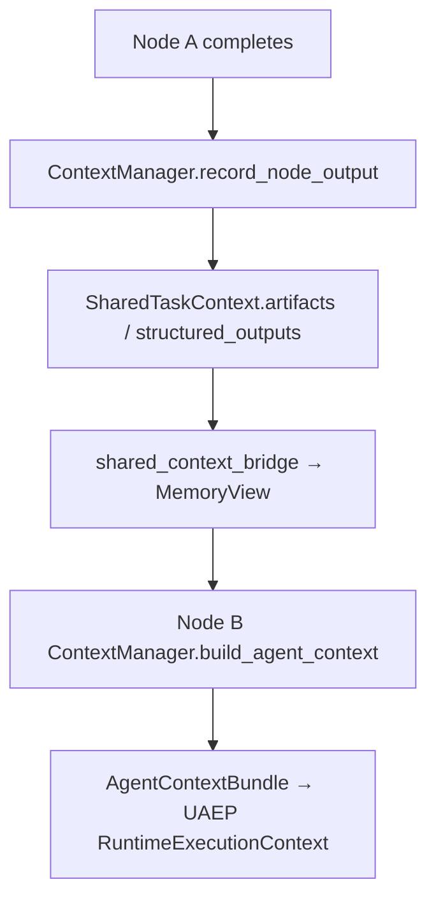

**Rule:** agents never call each other. All cross-agent data via `SharedTaskContext` / `MemoryView` (canon §42.14).

### 9.5 Final result merge

**Implemented (FLOW-7):** `FinalResponseComposer.compose_summary()` — `intergrax/runtime/nexus/response/final_response_composer.py`

| `OrchestrationProfile.merge_strategy` | Behavior |
|---------------------------------------|----------|
| `concat` (default) | `"[agent_id] summary"` blocks joined by `\n\n` |
| `last_wins` | Last non-empty agent summary |
| `structured_json` | JSON payload with per-agent status and summary |

Metadata via `compose_metadata()`: `plan_id`, `agent_ids`, `retry_count`, `all_completed`.

**Future (not in FLOW-7):** citation-preserving merge, validator-aware merge, LLM-assisted synthesis, conflict-aware HITL — see [`IDEAL_HARNESS_AI_ARCHITECTURE.md`](IDEAL_HARNESS_AI_ARCHITECTURE.md).

---

## 10. UAEP — execution inside one graph node

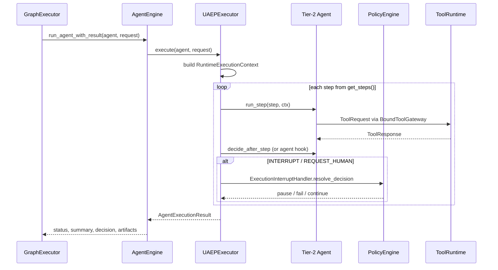

| `AgentDecision` | Nexus action |
|-----------------|--------------|
| `CONTINUE` | Next UAEP step |
| `COMPLETE` | Node success path |
| `RETRY` | UAEP/runtime retry policy (not agent loop over adapters) |
| `REQUEST_HUMAN` | Pause → `WAITING_FOR_HUMAN` |
| `INTERRUPT` | `PolicyEngine.evaluate_interrupt` → HITL or fail |
| `HANDOFF` | `HandoffCoordinator` inserts graph node |
| `MODIFY_PLAN` | Reserved / policy-dependent replan |
| `FAIL` | Node failed |
| `CANCEL` | `CancellationCoordinator` |

---

## 11. Decision ownership matrix

| Decision | Owner | Input | Output |
|----------|-------|-------|--------|
| Task classification | `TaskClassifier` | `Task`, registry | `classification` label |
| Plan topology | `NexusTaskPlannerProtocol` | classification, registry, graph_spec | `NexusPlan` |
| Graph structure | `plan_to_execution_graph` | plan | `ExecutionGraph` |
| Agent for node | `AgentRouter` | `node_task`, capability, contract | `Agent` instance |
| UAEP step order | Tier-2 `get_steps()` | agent contract | step list |
| Step continue/stop | Agent `decide_after_step` | step output | `AgentDecision` |
| Interrupt resolution | `ExecutionInterruptHandler` + `PolicyEngine` | interrupt, decision | pause/fail/continue |
| Node validation | `NexusValidationEngine` | execution, plan_criteria | `ValidationResult` |
| Node retry / alternate agent | `RetryEngine` | validation fail, policy | retry or switch agent |
| Dynamic handoff target | `HandoffCoordinator` | `AgentHandoff` | new graph node |
| Graph continuation | `GraphExecutor` | node status | next batch or stop |
| Task terminal state | `NexusGraphRunner` + validation | all executions | COMPLETED/FAILED/… |
| Final answer text | `FinalResponseComposer` | execution summaries | string |
| Tool allow-list | `AgentContract` + skills + `RuntimePolicyBundle` | contract, skill_ids | `allowed_tools` |
| Tool invocation | `ToolRuntime` | `ToolRequest` | policy-checked execute |
| LLM tool selection | `CatalogToolPlanner` / native tool_calls | LLM response | planned tool calls |

---

## 12. Multi-agent variants (use cases)

### UC-1 — Single agent (lab default)

**Config:** one agent in roster, no `graph_spec`, no capability.

```text
classification: SINGLE_AGENT_DEFAULT
plan: 1 step → agent_id = first in registry
graph: 1 node
```

### UC-2 — Explicit agent

**Config:** `Task(agent_id="echo", …)`

```text
classification: SINGLE_AGENT_EXPLICIT
plan: 1 step with fixed agent_id
```

### UC-3 — Capability routing (one agent)

**Config:** `Task(context.capability="legal.review")`, one agent registered.

```text
classification: CAPABILITY_ROUTED
plan: 1 step, agent from find_by_capability
```

### UC-4 — Auto multi-agent (same capability)

**Config:** two+ agents register same capability, task requests that capability.

```text
classification: MULTI_AGENT
plan: sequential steps for ALL matching agents (order = registry order)
graph: chain depends_on step_1 → step_2 → …
```

### UC-5 — Declarative graph (recommended for product)

**Config:** `ApplicationEnvironmentProfile.graph_spec` or `HarnessApplication.graph(AgentGraph()…)`.

```text
GraphSpecSeedingPlanner → NexusPlan from edges
graph: parallel batches from DEPENDS_ON topology
```

### UC-6 — Research pipeline (built-in)

**Config:** `capability=research.pipeline` or `intent=research_summarize`.

```text
plan: research step → summarize step (depends_on)
```

### UC-7 — Runtime handoff

**Config:** agent returns `AgentDecision.HANDOFF` with `AgentHandoff` payload.

```text
GraphExecutor._maybe_execute_handoff → new node appended → executed before batch ends
```

### UC-8 — Human approval before run

**Config:** `task.options.governance.require_human_approval=True`.

```text
classification: HUMAN_APPROVAL_REQUIRED
plan created → WAITING_FOR_HUMAN before graph
resume → RUNNING → graph executes
```

### UC-9 — Long-running + checkpoint

**Config:** `orchestration_profile.long_running_enabled` + `reliability_profile.long_running_scheduler_enabled`.

```text
checkpoints on pause/progress via long_running_bridge
resume restores plan/graph/UAEP cursor from SQLite
```

### 12.1 Production readiness, tests, and telemetry by variant

| UC | Lab-ready | Production-ready | Primary gate tests | Key telemetry |
|----|-----------|------------------|-------------------|---------------|
| UC-1 Single agent | **Yes** | Partial (needs strict profile proof) | `test_acceptance_01_single_agent_execution` | `TASK_CREATED`, `PLAN_CREATED`, `TASK_COMPLETED` |
| UC-2 Explicit agent | **Yes** | Partial | `test_acceptance_01_*` + router unit tests | + `agent_id` in trace metadata |
| UC-3 Capability routed | **Yes** | Partial | `tests/unit/runtime/nexus/` classifier tests | + `classification=capability_routed` |
| UC-4 Auto multi-agent | **Yes** | Partial (ordering fragile) | `test_acceptance_02_sequential_multi_agent` | + per-node `on_node_complete` |
| UC-5 Declarative graph | **Yes** | Partial | `test_graph_spec_to_plan.py`, `test_lab_graph_spec.py` | + `plan_id`, `graph_id` |
| UC-6 Research pipeline | **Yes** (stub agents) | No (stub descriptions) | planner unit tests | `PLAN_CREATED` step_count=2 |
| UC-7 Runtime handoff | **Yes** | Partial | `test_graph_executor_handoff_retry.py`, `test_acceptance_08_memory_handoff` | `HANDOFF_*`, `ops:handoff` |
| UC-8 HITL before run | **Yes** | Partial | `test_acceptance_04_human_approval_flow` | `HUMAN_APPROVAL_REQUESTED`, `WAITING_FOR_HUMAN` |
| UC-9 Long-running | **Yes** | Partial (scheduler optional) | `test_acceptance_05_checkpoint_recovery`, `05b_mid_step_uaep_resume` | checkpoint events, `TASK_PROGRESS` |

**Additional cross-cutting acceptance:** `test_acceptance_03_parallel_multi_agent`, `06_retry_flow`, `07_partial_results`, `09_sandbox_tool_execution`, `10_shadow_workspace` — `tests/acceptance/agent_os/test_agent_os_scenarios.py`.

---

## 13. Delegation vs depends_on vs handoff

### 13.1 Semantic model (three mechanisms)

| Mechanism | When | Who schedules child | Memory model |
|-----------|------|---------------------|--------------|
| `DEPENDS_ON` | Declarative graph | Plan → separate graph node | Shared context via `ContextManager` |
| `DELEGATES_TO` | Declarative graph | Plan expansion → child node ([ADR-FLOW-001](adr/ADR-FLOW-001.md)) | Child node + `DelegationSpec` via `SubtaskContract` |
| `AgentDecision.HANDOFF` | Runtime | `HandoffCoordinator` inserts node | Handoff payload in shared context |
| UAEP steps | Inside one node | Same agent | Agent-local + shared read |

### 13.2 Runtime semantics (post FLOW-2/14)

| View | `DELEGATES_TO` meaning |
|------|------------------------|
| **Canon §42.14.3** | Subagent equivalent — child execution with `DelegationSpec` |
| **Runtime (truth)** | `graph_spec_to_plan.py` expands edge → child `PlanStep`; `DelegationSpec` on **child**; `GraphExecutor` routes `child_agent_id` |

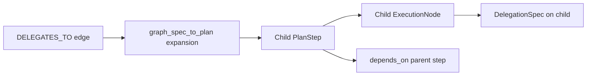

**`max_delegation_depth`:** enforced in `GraphExecutor` (FLOW-3). **`max_llm_calls` / `max_tool_calls`:** optional delegation budget envelope (FLOW-15).

### 13.3 Decision record

Accepted and implemented: [`adr/ADR-FLOW-001.md`](adr/ADR-FLOW-001.md) (FLOW-2, FLOW-14).

---

## 14. Retry, failure, and abandonment

### 14.1 Three retry layers (do not conflate)

| Layer | Component | Trigger | Scope | Who decides | Default |
|-------|-----------|---------|-------|-------------|---------|
| **A — Graph node** | `RetryEngine` | `NexusValidationEngine` fails node result | Same graph node; may switch agent | Runtime (`decide()` alternate agent) | `max_retries=1`; factory sets 3 or 1 (`strict`) |
| **B — UAEP / agent run** | `RuntimeEngine`, `AgentDecision.RETRY` | LLM/tool transient, agent requests retry | **Inside one node** — UAEP steps or legacy pipeline | Runtime policy (`max_run_retries` on `RuntimeConfig`) | Per agent host |
| **C — Whole run** | `RetryCoordinator` in `NexusGraphRunner` | Re-execute entire graph after failure | Full plan / all nodes | Runtime coordinator | **`max_run_retries=0` — disabled** |

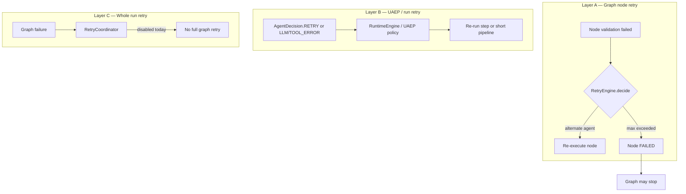

**Agent rule:** agents emit `AgentDecision.RETRY` — they do **not** loop `for attempt in range(n)` over adapters (canon §31, §42.34).

### 14.2 Abandonment triggers

| Condition | Terminal state | Who decides |
|-----------|----------------|-------------|
| `UNSUPPORTED` classification | `FAILED` | `NexusPlanningRunner` |
| Hook `BLOCK` on lifecycle | `FAILED` | Middleware |
| Human `REJECT` | `FAILED` | `NexusHitlRunner` |
| Max node retries exceeded | `FAILED` | `RetryEngine` |
| Graph node failure (strict) | `FAILED` | `NexusGraphRunner` |
| Cancel requested | `CANCELLED` | `CancellationCoordinator` |
| `NEEDS_INPUT` / governance pause | `WAITING_FOR_HUMAN` | UAEP + graph runner |
| Budget exceeded (when wired) | `FAILED` or HITL | `RunBudget` / cost profile |

---

## 15. Tool selection flow

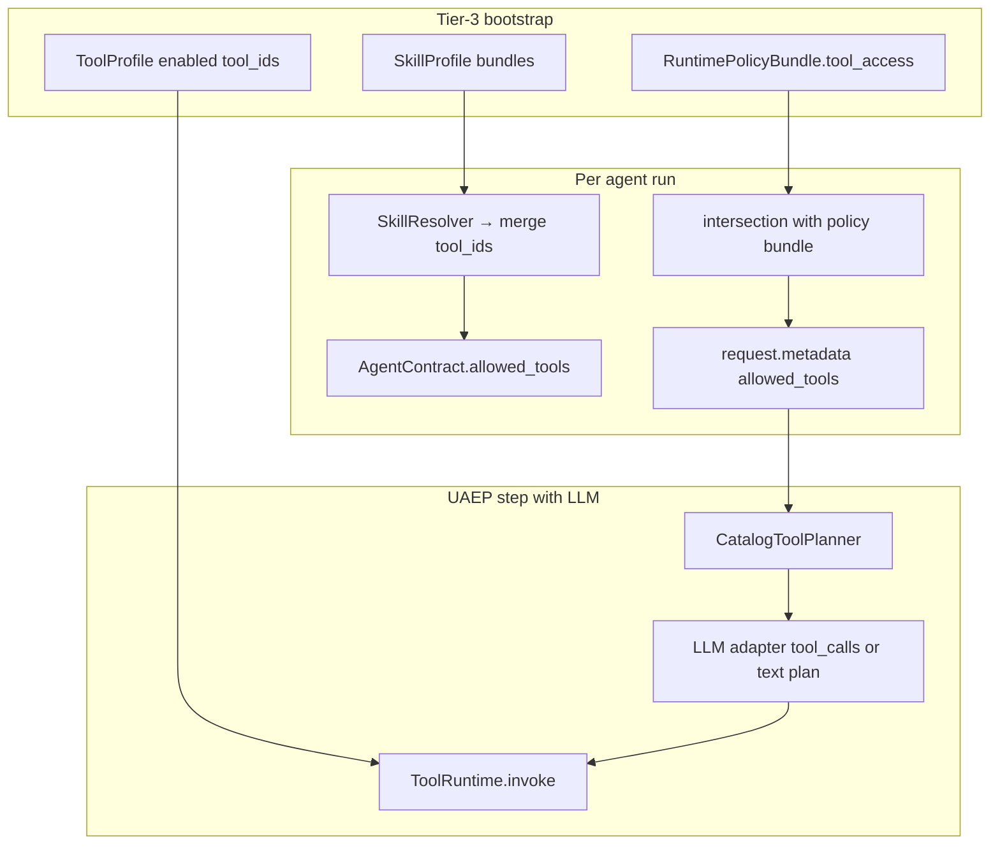

| Stage | Enforces |
|-------|----------|
| Bootstrap | Which tools exist in registry for this host |
| Contract + skills | Agent-level allow-list |
| Policy bundle | Org/tenant restrictions |
| `ToolRuntime` | Per-call policy, trace, idempotency |
| Security middleware | `BEFORE_TOOL_CALL` injection defense |

**Agents must not** import vendor SDKs or call integrations directly (canon §42.12, §42.41).

---

## 16. Governance and policy timeline

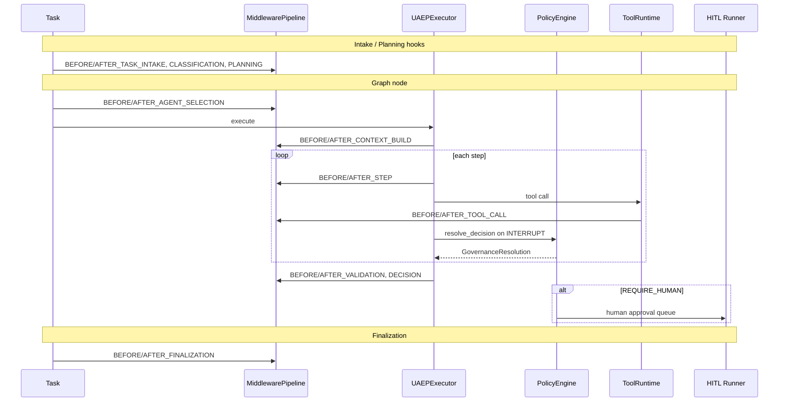

**Policy bundle read order:** Appendix H §H.4 — bundle → agent/skills → ToolRuntime → domain fragments → human gates.

**Tier-3 security profile:** `ApplicationSecurityProfile` → `application_security_wiring.py` (prompt defense, tool injection, tenant verify).

---

## 17. Observability and measurement

### 17.1 Expected telemetry by pipeline stage

| Stage | `ExecutionPhase` | Required events (minimum) | Trace / ops filter | Metrics payload |
|-------|------------------|----------------------------|--------------------|-----------------|
| Intake | `INTAKE` | `TASK_CREATED` | `ops:lifecycle` | `task_id`, `tenant_id` |
| Classification | `CLASSIFICATION` | lifecycle hook diagnostics | `ops:planning` | `classification` in payload |
| Planning | `PLANNING` | `PLAN_CREATED` | `ops:planning` | `plan_id`, `step_count` |
| Agent selection | `AGENT_SELECTION` | hook allow/block | `ops:routing` | `agent_id` |
| Context build | `CONTEXT_BUILD` | `CONTEXT_*` when enabled | `ops:context` | assembly provenance |
| Step execution | `STEP_EXECUTION` | `STEP_STARTED/COMPLETED` | `ops:execution` | step index |
| Tool call | `TOOL_EXECUTION` | `TOOL_REQUESTED/COMPLETED/FAILED` | `ops:tool_audit` | `tool_id`, latency |
| Validation | `VALIDATION` | validation result in trace | `ops:validation` | criteria pass/fail |
| Decision | `DECISION` | `DECISION_EMITTED` | `ops:governance` | decision type |
| Interrupt | `INTERRUPT_HANDLING` | `INTERRUPT_*`, `POLICY_DECISION` | `ops:governance` | interrupt type |
| Human | `HUMAN_APPROVAL` | `HUMAN_APPROVAL_REQUESTED` | `ops:hitl` | queue id / resume token |
| Retry | `RETRY_HANDLING` | `RETRY_SCHEDULED` | `ops:retry` | alternate agent |
| Handoff | `HANDOFF` | `HANDOFF_INITIATED/COMPLETED` | `ops:handoff` | target agent |
| Graph node | — | graph trace callbacks | node id in trace DB | duration |
| Finalization | `FINALIZATION` | `TASK_COMPLETED` or terminal fail | `ops:lifecycle` | LLM/RAG aggregates in payload |
| Adaptive (optional) | — | `HarnessOutcomeSignal` | adaptive store | utility, budget |

Gate: `test_all_runtime_event_types_have_ops_filter_hint` — every `RuntimeEventType` must have an ops filter hint (FAUDIT-OBS remediation).

### 17.2 Signal summary table

| Signal | Mechanism | When emitted |
|--------|-----------|--------------|
| Lifecycle | `RuntimeEventBus` → SQLite | Every phase transition |
| Plan | `PLAN_CREATED` | After planning |
| Node | Graph trace callbacks | `on_node_start/complete` |
| Handoff | `HANDOFF_INITIATED/COMPLETED` | Dynamic handoff |
| Retry | `RETRY_SCHEDULED` | `RetryEngine` |
| HITL | `HUMAN_APPROVAL_REQUESTED` | Pause |
| Tools | `TOOL_*` events | Each `ToolRuntime.invoke` |
| Policy | `POLICY_DECISION`, `INTERRUPT_*` | UAEP governance |
| Terminal | `TASK_COMPLETED` / fail events | `_finish_task` |
| Trace DB | `RunTraceWriter` / `PersistingTaskTraceEmitter` | Full run |
| LLM metrics | `llm_tenant_scope` + completion envelope | Per LLM call |
| Adaptive | `SignalCollector` | Post-task outcome (if adaptive profile enabled) |

**Lab inspect:**

```bash
GET /debug/tasks/{id}/trace?include_runtime=true
GET /debug/tasks/{id}/events
GET /debug/tasks/{id}/metrics
```

See [`guides/HARNESS_ENVIRONMENT.md`](guides/HARNESS_ENVIRONMENT.md), Appendix H §H.5.

---

## 18. Evaluation hooks in execution flow

Quality and benchmarking are **not** a separate pipeline — they attach to the same Nexus path via Tier-3 profiles and post-run bridges.

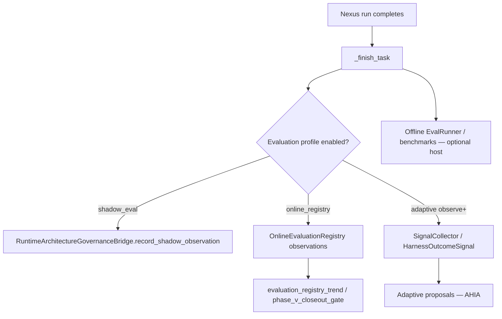

| Hook | Where | When | Module |
|------|-------|------|--------|
| **Node validation** | `NexusValidationEngine` | After each graph node | `validation_engine.py` — criteria from `NexusPlan.validation_criteria` |
| **CVL partial verify** | `CriticOrchestrator.verify_partial` | When `CriticProfile.scopes.node_partial` | `critic_wiring.py` → `GraphExecutor` (CRIT-V-3.4) |
| **CVL final verify** | `CriticOrchestrator.verify_final` | Before terminal `COMPLETED` | `graph_runner.py` (CRIT-V-3.5) |
| **Evaluator-loop** | `EvaluatorLoopExecutor` | `CoordinationPattern.EVALUATOR_LOOP` nodes | `evaluator_loop_executor.py` → `graph_executor.py` (CRIT-V-4) |
| **Critic trace** | `CriticTraceEmitter` | Each CVL invocation | `critic.*` steps in lab trace API (CRIT-V-3.6) |
| **Validator agents** | Graph node (UC-5 / §42.43) | Scheduled like any agent | Agent contract + `ValidationResult` |
| **Shadow evaluation** | Post-step / governance bridge | When `EvaluationProfile.shadow_eval_enabled` | `runtime_governance_bridge.py` |
| **Online evaluation registry** | Post-run observation | `evaluation_wiring.py` → `NexusLoop.evaluation_registry` | `online_evaluation_registry.py` |
| **Outcome signals** | After `_finish_task` | `record_task_outcome_signal()` | `adaptive/signal_emission.py` |
| **LLM-as-judge** | Not universal — opt-in | `eval.judge` via `L1Gateway` or offline semantic `NexusEvalRunner` | `tools/providers/eval/judge.py`, `eval/nexus_eval_runner.py` (CRIT-V-2 / CRIT-V-5) |
| **Baseline / release gate** | CI / ops | `require_baseline_for_release` | `phase_v_closeout_gate.py`, `maturity_gate_evidence.py` |
| **Quality regression** | Compare runs | Evaluation registry trends | `evaluation_registry_trends.py` |

**L3+ ideal harness alignment:** baseline scores before change, post-change scores in `OnlineEvaluationRegistry`, trend comparison before promotion — see [`IDEAL_HARNESS_AI_ARCHITECTURE.md`](IDEAL_HARNESS_AI_ARCHITECTURE.md) and plan Phase EVAL / V gates.

**Post-graph hook (FLOW-9):** `NexusLoop` records multi-agent evaluation observations when `EvaluationProfile` is enabled. Evaluator nodes and LLM-judge remain **opt-in** per application policy — not mandatory on every run.

---

## 19. Edge cases catalog

| ID | Condition | Phase | Behavior | Terminal |
|----|-----------|-------|----------|----------|
| EC-01 | No agent for capability | Planning | Empty plan / UNSUPPORTED | `FAILED` |
| EC-02 | `require_human_approval` not resumed | Planning | Checkpoint, return awaiting | `WAITING_FOR_HUMAN` |
| EC-03 | Lifecycle hook BLOCK | Any hooked phase | `early_result` | `FAILED` |
| EC-04 | Human REJECT | Intake/HITL | `handle_human_rejection` | `FAILED` |
| EC-05 | Human ESCALATE | HITL | escalation chain | `WAITING_FOR_HUMAN` |
| EC-06 | Resume after HITL | Intake | Reset to CREATED path | continue |
| EC-07 | `plan_id` pre-set on task | Planning | Skip graph_spec seed | inner planner only |
| EC-08 | Parallel batch partial fail | Graph | Stops subsequent batches | `FAILED` / partial |
| EC-09 | `NEEDS_INPUT` from agent | Graph/UAEP | Governance pause | `WAITING_FOR_HUMAN` |
| EC-10 | Cancel mid-graph | Graph | Skip pending nodes | `CANCELLED` |
| EC-11 | Checkpoint resume | Graph | Skip completed nodes | continue |
| EC-12 | Retry alternate agent | Graph | Same node, new agent_id | retry or fail |
| EC-13 | Dynamic handoff invalid | Graph | Handoff validation fail | node `FAILED` |
| EC-14 | Graph cycle (bug) | Graph | Topological fallback | **risk** — may run early |
| EC-15 | `engine` planner without LLM | Bootstrap | `OrchestrationWiringError` | host fails fast |
| EC-16 | Strict mode non-routable agent | Routing | `RuntimeError` | node fail |
| EC-17 | Long-running scheduler disabled | Reliability | No checkpoint store on loop | no auto-resume |

---

## 20. Reference flow — PM → UX → Legal (canon §42.43)

Declarative product-style flow (requires Tier-2 agents + Tier-3 `graph_spec`):

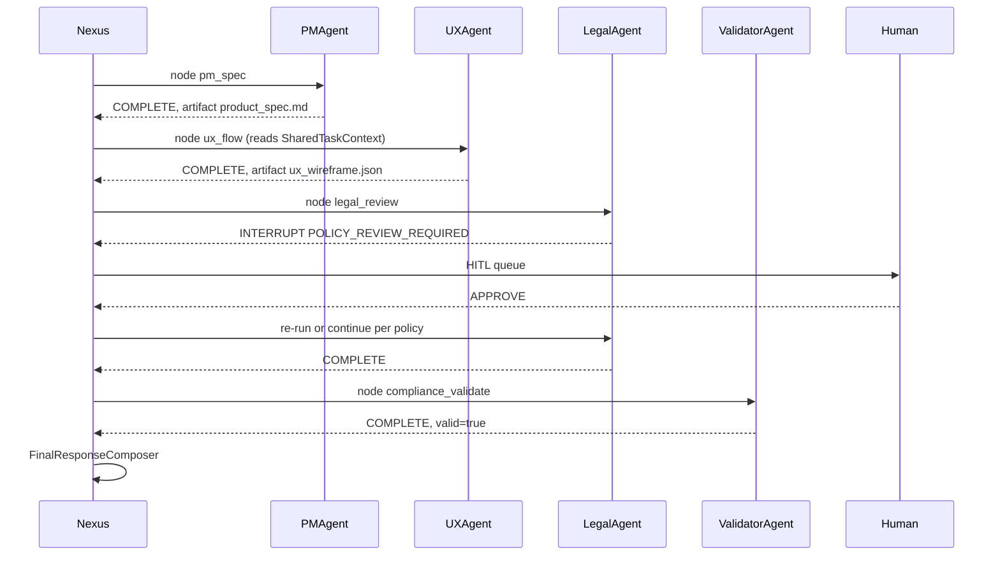

**Status:** Pattern is **documented and supported by runtime**; concrete PM/UX/Legal agents are **Phase K deferred** (plan §6.3).

---

## 21. Module index (quick lookup)

| Concern | Primary module |
|---------|----------------|
| Entry | `runtime/task/unified_task_runner.py` |
| Loop | `runtime/nexus/nexus_loop.py` |
| Intake | `runtime/nexus/orchestration/intake_runner.py` |
| Planning | `runtime/nexus/orchestration/planning_runner.py` |
| Graph phase | `runtime/nexus/orchestration/graph_runner.py` |
| Graph exec | `runtime/nexus/execution/graph_executor.py` |
| Plan build | `runtime/nexus/execution/graph_builder.py` |
| Classifier | `runtime/nexus/task_classifier.py` |
| Planner | `runtime/nexus/planning/task_planner.py` |
| Router | `runtime/nexus/agent_router.py` |
| Context | `runtime/nexus/context/context_manager.py` |
| Handoff | `runtime/nexus/handoff/coordinator.py` |
| Retry | `runtime/nexus/retry/retry_engine.py` |
| Agent bridge | `agents/agent_engine.py` |
| UAEP | `agents/uaep.py` |
| Tools | `runtime/nexus/tools/` + `tools/runtime/` |
| Policy | `runtime/policy/policy_engine.py` |
| Tier-3 factory | `applications/_shared/nexus_factory.py` |
| Orchestration wiring | `applications/_shared/orchestration_wiring.py` |
| Graph spec bridge | `applications/_shared/graph_spec_to_plan.py` |
| Fluent graph API | `applications/contracts/graph_builder.py` |
| Harness builder | `harness/app.py` |

---

## 22. Verification evidence

| Concern | Test / command |
|---------|----------------|
| Graph handoff + retry | `pytest tests/integration/runtime/test_graph_executor_handoff_retry.py -m gate` |
| Graph unit coverage | `pytest tests/unit/runtime/execution/ -m gate` |
| Orchestration wiring | `pytest tests/unit/applications/test_orchestration_wiring.py -m gate` |
| Graph spec plan | `pytest tests/unit/applications/test_graph_spec_to_plan.py -m gate` |
| Nexus runners | `pytest tests/unit/runtime/nexus/ -m gate` |
| Agent OS acceptance | `pytest tests/acceptance/agent_os/ -m gate` |
| Full gate | `uv run pytest -m gate -q` |
| Harness hygiene | `python scripts/check_harness_no_getattr.py` |

---

## 23. Known runtime gaps (docs ↔ code)

Honest deltas for plan scheduling. **Closeout phases (ORCH Done) wired bootstrap; these are depth gaps.**

### 23.1 Gap categories

| Category | Meaning | Examples |
|----------|---------|----------|
| **Runtime-core** | Blocks correct Harness semantics in production multi-agent | **Closed** (FLOW-1–6, 13–15) |
| **Production-hardening** | Lab works; product needs richer merge/eval/policy | **Closed** (FLOW-7, 9, 11, 14) |
| **Product-proof** | Needs Tier-2/Tier-3 product agents, not platform code | **Deferred** (FLOW-8 → §6.3) |
| **DX / documentation** | Authoring ergonomics or doc-only until ADR | **Closed** (FLOW-5, 10, 16, 17) |

### 23.2 Gap register

| ID | Gap | Current behavior | Category | Severity | AUDIT_MAP |
|----|-----|------------------|----------|----------|-----------|
| FLOW-GAP-01 | `EngineBackedNexusPlanner` | **Closed (FLOW-1)** — `EngineBackedNexusPlanner` bridges engine planner to `NexusTaskPlannerProtocol` | Runtime-core | High | §7 |
| FLOW-GAP-02 | `DELEGATES_TO` / `child_agent_id` | **Closed (FLOW-2/14)** — [ADR-FLOW-001](adr/ADR-FLOW-001.md) child node expansion + `SubtaskContract` | Runtime-core | **Critical** | §10 |
| FLOW-GAP-03 | `max_delegation_depth` | **Closed (FLOW-3)** — enforced in `GraphExecutor` | Runtime-core | Medium | §10 |
| FLOW-GAP-04 | Run-level `RetryCoordinator` | **Closed (FLOW-4)** — `OrchestrationProfile.max_run_retries` wired in `NexusGraphRunner` | Runtime-core | Medium | §9, §22 |
| FLOW-GAP-05 | `AgentGraph.on_error(retry)` | **Closed (FLOW-5)** — `retry_on_error` propagated to `GraphExecutor` retry policy | DX | Low | §9 |
| FLOW-GAP-06 | Graph cycle fallback | **Closed (FLOW-6)** — `ExecutionGraphCycleError` on cycle | Runtime-core | Medium | §9 |
| FLOW-GAP-07 | `FinalResponseComposer` | **Closed (FLOW-7)** — `MergeStrategy` profile-driven merge | Production-hardening | Medium | §9 |
| FLOW-GAP-08 | `WAITING_FOR_RESOURCES` / `EXPIRED` | **Closed (FLOW-10)** — [ADR-FLOW-002](adr/ADR-FLOW-002.md) reserved v1 semantics | DX / lifecycle | Low | §8 |
| FLOW-GAP-09 | Pre-plan LLM policy hooks | **Closed (FLOW-11)** — `evaluate_pre_llm` at planning boundary | Production-hardening | Medium | §5 |
| FLOW-GAP-10 | Product multi-agent proof | **Deferred (FLOW-8)** — §6.3 product gate | Product-proof | Product | §28 |
| FLOW-GAP-11 | Evaluator / LLM-judge not mandatory on multi-agent fan-in | **Closed (FLOW-9)** — post-graph eval observation hook in `NexusLoop` | Production-hardening | Medium | §25 |
| FLOW-GAP-12 | `max_inflight_nodes` not on `OrchestrationProfile` | **Closed (FLOW-13)** — profile field + `nexus_factory` wire | Runtime-core | Medium | §9 |
| FLOW-GAP-13 | `SubtaskContract` not used in declarative graph | **Closed (FLOW-14)** — `graph_spec_to_plan` uses `SubtaskContract.to_delegation_spec()` | Runtime-core | Medium | §10 |
| FLOW-GAP-14 | Subagent budget not delegated | **Closed (FLOW-15)** — `max_llm_calls`/`max_tool_calls` on delegation envelope | Production-hardening | Medium | §10 |
| FLOW-GAP-15 | `MODIFY_PLAN` reserved / undocumented | **Closed (FLOW-16)** — [ADR-FLOW-003](adr/ADR-FLOW-003.md); `MODIFY_PLAN_NOT_SUPPORTED` without handoff | DX | Low | §9 |
| FLOW-GAP-16 | `MULTI_AGENT` step order fragile | **Closed (FLOW-17)** — `multi_agent_order` on `OrchestrationProfile` | DX | Low | §9 |

**Status (2026-06-07):** Phase FLOW **Done** (17/18); `FLOW-GAP-01`…`09`, `11`…`16` **closed**; `FLOW-GAP-10` → FLOW-8 **Deferred** (§6.3). See [Phase FLOW](plan/phases/core-runtime.md).

---

## 24. Cognition / planning depth note

Ideal Harness AI ([`IDEAL_HARNESS_AI_ARCHITECTURE.md`](IDEAL_HARNESS_AI_ARCHITECTURE.md)) expects explicit **cognition plane**: model selection, prompt compiler layers, structured plan contracts, `DecisionRecord` per step.

**Intergrax today:**

| Capability | Status |
|------------|--------|
| Deterministic `TaskPlanner` + classifier | **Done** — production-lab ready |
| Declarative `graph_spec` | **Done** (ORCH-2) |
| LLM-backed Nexus planner (`planner_kind=engine`) | **Done** (FLOW-1) — `EngineBackedNexusPlanner` |
| `DecisionRecord` universal per UAEP step | **Done** (FLOW-12) — `DECISION_EMITTED` + `decision_record` payload; gate regression test |
| Engine planner modules (`engine_planner_orchestrator.py`) | **Bridged** via `nexus_llm_plan_builder.py` |

Harness MVP and new Tier-2 agents remain unblocked. LLM-backed dynamic decomposition is **available** when `planner_kind=engine`; product parity claims still require operational validation per deployment profile.

---

## 25. Plan traceability matrix

**Status:** **Done** (2026-06-07) — canonical implementation in [`INTERGRAX_IMPLEMENTATION_PLAN.md`](INTERGRAX_IMPLEMENTATION_PLAN.md) [Phase FLOW](#phase-flow--nexus-execution-depth) · closed queue [§6.1aj](INTERGRAX_IMPLEMENTATION_PLAN.md#61aj-harness-implementation-queue--nexus-execution-depth-closed) · execution [§6.2aj](INTERGRAX_IMPLEMENTATION_PLAN.md#62aj-phase-flow-execution-order-band-2aj--active-2026-06-07) · traceability **Appendix N (FLOW)** · **FLOW-8 Deferred**.

### 25.1 Implementation rows (Phase FLOW — Band 2aj)

| Plan ID | Source | Deliverable | Acceptance | Priority |
|---------|--------|-------------|------------|----------|
| FLOW-1 | FLOW-GAP-01 | Real `EngineBackedNexusPlanner` using `engine_planner_orchestrator` | Plan steps from LLM parse; gate tests | High |
| FLOW-2 | FLOW-GAP-02 | **ADR-FLOW-001** — expand `DELEGATES_TO` to child `ExecutionNode` | Child agent executes with `DelegationSpec`; gate tests | **Critical** |
| FLOW-3 | FLOW-GAP-03 | Enforce `max_delegation_depth` in `GraphExecutor` | Depth exceeded → fail with trace | Medium |
| FLOW-4 | FLOW-GAP-04 | Enable opt-in run-level retry via profile | `OrchestrationProfile.max_run_retries` | Medium |
| FLOW-5 | FLOW-GAP-05 | Wire `AgentGraph.on_error` to `RetryPolicy` | Integration test | Low |
| FLOW-6 | FLOW-GAP-06 | Strict cycle detection in `ExecutionGraph.batches()` | Cycle → plan error | Medium |
| FLOW-7 | FLOW-GAP-07 | `MergePolicy` / `FinalResponseComposerProfile` | Profile-driven merge strategies | Medium |
| FLOW-8 | FLOW-GAP-10 | Reference Tier-3 app implementing §42.43 | 3+ agent graph_spec demo | Product |
| FLOW-9 | FLOW-GAP-11 | Documented evaluator-node pattern + optional post-graph eval hook | Eval registry observation per multi-agent run | Medium |
| FLOW-10 | FLOW-GAP-08 | Implement or remove reserved lifecycle states | ADR + runner sets state OR enum trim | Low |
| FLOW-11 | FLOW-GAP-09 | Pre-plan / pre-LLM policy extension points | Hook tests + Appendix H cross-ref | Medium |
| FLOW-12 | §24 / FAUDIT-COG-1 | `DecisionRecord` regression gate | `DECISION_EMITTED` on every step decision | Medium |
| FLOW-13 | FLOW-GAP-12 | `max_inflight_nodes` on profile + factory wire | `GRAPH_BACKPRESSURE` when cap hit | Medium |
| FLOW-14 | FLOW-GAP-13 | `SubtaskContract` in ADR-FLOW-001 expansion | Scopes/objective on child `DelegationSpec` | Medium |
| FLOW-15 | FLOW-GAP-14 | Subagent budget envelope enforcement | Child exceeds envelope → fail | Medium |
| FLOW-16 | FLOW-GAP-15 | `MODIFY_PLAN` ADR ([ADR-FLOW-003](adr/ADR-FLOW-003.md)) | Reserved semantics or enum trim | Low |
| FLOW-17 | FLOW-GAP-16 | `MULTI_AGENT` ordering policy on profile | Stable declared agent order | Low |
| FLOW-DOC.* | — | Flow reference + plan sync after each PR | Zero open `FLOW-GAP` in §23 | Low |

### 25.2 FAUDIT layer uplift targets

| AUDIT_MAP § | Current (FAUDIT-32) | This doc sections | Close via |
|-------------|---------------------|-------------------|-----------|
| §5 Policy | L2 partial | §17, FLOW-GAP-09 | FLOW-11 |
| §7 Reasoning/Planning | L2 | §7–§8, §24, FLOW-GAP-01 | FLOW-1, FLOW-12 |
| §8 Execution Runtime | L3 | §4–§6, §19, FLOW-GAP-08 | FLOW-10, maintenance |
| §9 Orchestration/Graph | L3 partial | §9, §14, FLOW-GAP-04–07, 12, 15–16 | FLOW-3–7, FLOW-13, FLOW-16, FLOW-17 |
| §10 Subagents | L2 | §13, FLOW-GAP-02–03, 13–14 | **FLOW-2**, FLOW-3, FLOW-14, FLOW-15 |
| §25 Evaluation | L2 | §18, FLOW-GAP-11 | FLOW-9 |

### 25.3 Documentation sync checklist (per FLOW PR)

- [x] Phase FLOW registered in plan — master table, §6.1aj, §6.2aj, Appendix N (FLOW)
- [x] FLOW-GAP-12–16 + FLOW-13–17 added (2026-06-07 audit closeout)
- [x] Update this doc §23 gaps table (paydown log) — 2026-06-07 Phase FLOW closeout
- [x] ADR-FLOW-001/002/003 accepted
- [x] Run gate + §6.1 scripts per AGENTS.md — **906 passed**
- [x] Update Appendix I §I.4 — `planner_kind=engine` (`EngineBackedNexusPlanner`) — 2026-06-07
- [x] Update canon §42.14.3 — ADR-FLOW-001 implementation — 2026-06-07
- [x] Plan §0.3 execution path unchanged (entry points stable)

---

## 26. Related documents (navigation)

| Document | Link |
|----------|------|
| Docs index | [README.md — Documentation index](../README.md#documentation-index) |
| Architecture canon | [`intergrax_runtime_architecture.md`](intergrax_runtime_architecture.md) |
| Agent workflow | [`guides/AGENT_CREATION_GUIDE.md`](guides/AGENT_CREATION_GUIDE.md) |
| Implementation plan | [`INTERGRAX_IMPLEMENTATION_PLAN.md`](INTERGRAX_IMPLEMENTATION_PLAN.md) |
| Harness audit map | [`INTEGRAX_HARNESS_AUDIT_MAP.md`](INTEGRAX_HARNESS_AUDIT_MAP.md) |
| Root README | [`../README.md`](../README.md) |
| AGENTS.md (AI routing) | [`../AGENTS.md`](../AGENTS.md) |
| Delegation ADR | [`adr/ADR-FLOW-001.md`](adr/ADR-FLOW-001.md) |
| Lifecycle ADR | [`adr/ADR-FLOW-002.md`](adr/ADR-FLOW-002.md) |
| MODIFY_PLAN ADR | [`adr/ADR-FLOW-003.md`](adr/ADR-FLOW-003.md) |
| Ideal harness target | [`IDEAL_HARNESS_AI_ARCHITECTURE.md`](IDEAL_HARNESS_AI_ARCHITECTURE.md) |

---

**Maintainer note:** When runtime behavior changes, update **this file first** (narrative truth), then sync canon §42.14.3 / §42.43, [ADR-FLOW-001](adr/ADR-FLOW-001.md), and plan traceability §25 — not the other way around.
