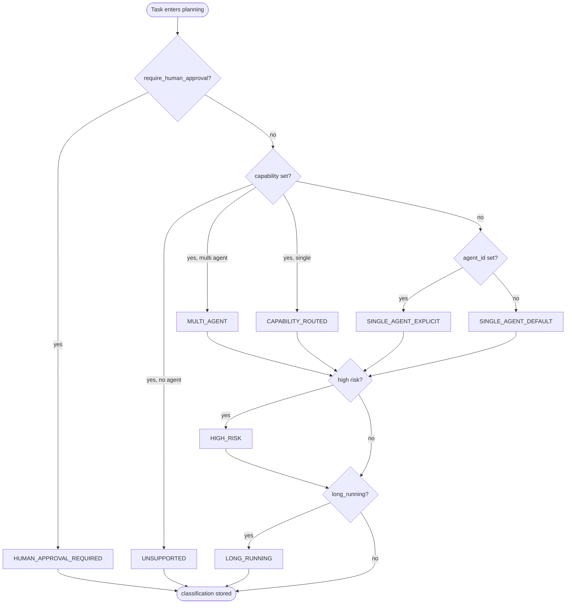
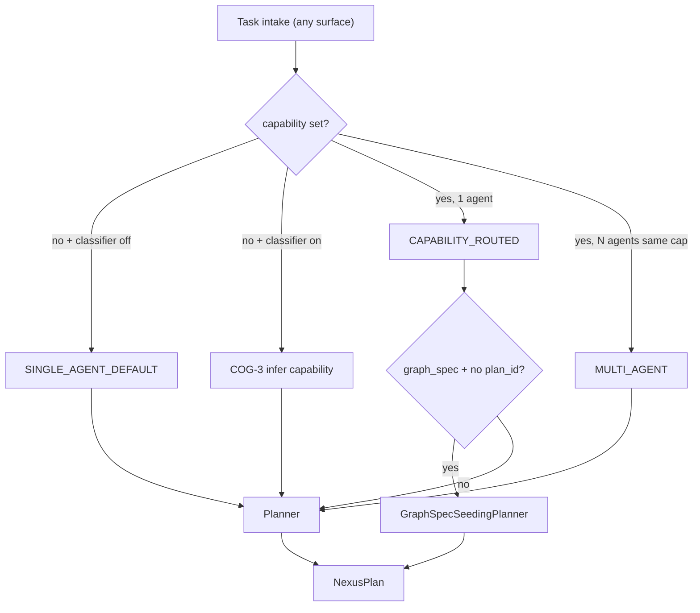

# Reasoning and Cognition

**Status:** Canonical architecture (domain pair 1:1)  
**Hub:** [`intergrax_runtime_architecture.md`](../intergrax_runtime_architecture.md)  
**Plan (1:1):** [`plan/REASONING_AND_COGNITION.md`](../plan/REASONING_AND_COGNITION.md)  
**Target:** [`IDEAL_HARNESS_AI_ARCHITECTURE.md`](../guides/IDEAL_HARNESS_AI_ARCHITECTURE.md) §3.5  
**Audit layers:** 7 (Reasoning, Planning and Cognition) · cross-ref 17 (Prompt Registry input)  
**Audit instruction:** [`audit/REASONING_AND_COGNITION.md`](../audit/REASONING_AND_COGNITION.md)  
---

## Cursor read scope (token budget)

**Do not read this entire file in one session** (REASONING_AND_COGNITION canon).

- **Implement / audit default:** DecisionRecord + planner/classifier spine. Skip historical sprint logs unless cited.
- **Use** table of contents below — `Read` with offset/limit per §.
- **Plan hub:** [`plan/REASONING_AND_COGNITION.md`](../plan/REASONING_AND_COGNITION.md) (scoped §6 only).
- **Audit slice:** [`guides/audit_slices/REASONING_AND_COGNITION.md`](../guides/audit_slices/REASONING_AND_COGNITION.md).
- **Max reads:** at most **one** file >5k tokens per session unless RESUME cites more.

---


## Architecture satellites (read on demand)

Large § blocks moved out of the architecture hub to reduce Cursor context use.
Load **only** the satellite matching your task or cited §.

| Satellite | Contents |
|-----------|----------|
| [`arch/REASONING_AND_COGNITION_scenario_catalog.md`](arch/REASONING_AND_COGNITION_scenario_catalog.md) | scenario catalog |

> **Cursor context budget:** read hub read-scope block + **at most one** satellite per session.


## Table of contents

1. [Purpose](#1-purpose)
2. [Problem statement](#2-problem-statement)
3. [Terminology](#3-terminology)
4. [Design principles](#4-design-principles)
5. [Three cognition planes](#5-three-cognition-planes)
6. [Ideal Cognition Layer alignment](#6-ideal-cognition-layer-alignment)
7. [Tier placement and responsibility matrix](#7-tier-placement-and-responsibility-matrix)
8. [Domain boundaries](#8-domain-boundaries)
9. [Task classification](#9-task-classification)
10. [Nexus planning](#10-nexus-planning)
11. [Declarative graph seeding](#11-declarative-graph-seeding)
12. [Retired engine planner stack](#12-retired-engine-planner-stack)
13. [Tool planning](#13-tool-planning)
14. [UAEP step cognition and DecisionRecord](#14-uaep-step-cognition-and-decisionrecord)
15. [Prompt compilation as cognition input](#15-prompt-compilation-as-cognition-input)
16. [Model selection for reasoning](#16-model-selection-for-reasoning)
17. [Reasoning failure taxonomy](#17-reasoning-failure-taxonomy)
18. [Observability and trace contracts](#18-observability-and-trace-contracts)
19. [Integration with adjacent subsystems](#19-integration-with-adjacent-subsystems)
20. [End-to-end cognition flow](#20-end-to-end-cognition-flow)
21. [Maturity scorecard and gap register](#21-maturity-scorecard-and-gap-register)
22. [Related documents](#22-related-documents)
23. [Appendix A — Code map](#appendix-a--code-map)
24. [Appendix B — Configuration surface](#appendix-b--configuration-surface)
25. [Appendix C — Audit and ideal traceability](#appendix-c--audit-and-ideal-traceability)

---

## 1. Purpose

Define the **Reasoning and Cognition Layer (RCL)** — the Harness AI subsystem that answers:

> **What should happen next — which agents, tools, and steps — before side effects execute?**

RCL completes the **Think → Plan → Decide** path that precedes orchestrated execution and verification. It **does not** own graph scheduling, retries, HITL queues, or final correctness proofs — those belong to [`ORCHESTRATION.md`](ORCHESTRATION.md), [`NEXUS_EXECUTION_FLOW.md`](NEXUS_EXECUTION_FLOW.md), and [`CRITIC_VERIFICATION.md`](CRITIC_VERIFICATION.md) respectively.

**Strategic positioning:** The Harness owns **how** reasoning is structured, observable, and separated from execution; agents and applications own **domain-specific** step logic inside UAEP bounds.

**Core invariant:** Reasoning outputs MUST be **typed contracts** (`NexusPlan`, `PlanStep`, `ToolPlanDecision`, `DecisionRecord`) — never opaque free-text plans consumed directly by executors without validation. (`EnginePlan` retired — legacy trace types only; see §12.)

---

## 2. Problem statement

Intergrax already implements substantial cognition mechanics, but until this domain pair they were **documented only as fragments** across orchestration flow, UAEP, LLM adapters, and prompt registry docs. Gaps vs production-grade Harness AI and FAUDIT-32 §7:

| Gap (pre-RCL) | Status after COG-DEPTH / COG-PROD |
|-----|--------|
| No single canon for cognition plane | **Closed** — this domain pair (COG-DOC) |
| `planner_kind=engine` ad-hoc LLM prompt | **Closed** — `nexus_task_planner` registry id (COG-2.1); user context via template (COG-PROD.2) |
| Dual planner stacks (`NexusPlan` vs `EnginePlan`) | **Closed** — `EnginePlan` retired (ACP-CLOSE-LEG-5); `NexusPlan` is sole task contract; legacy trace types only |
| Nexus-level `DecisionRecord` | **Closed** — `PLAN_CREATED` + `DECISION_EMITTED` at planning boundary (COG-4.*); enriched metadata (COG-PROD.3) |
| Reasoning failure taxonomy | **Closed** — `ReasoningFailureKind` enum + trace metadata (COG-6.*) |
| Classifier surface | **Done** — `classifier_kind=rules|llm` + `IntentRoute` (ORCH-CONFIG.1, COG-3.*) |
| Model routing for reasoning | **Partial → COG-PROD** — deny gate shipped (COG-5.3); separate planner adapter via `ReasoningProfile.planner_llm_profile` (COG-PROD.1) |
| `planner_parse_retries` on profile | **COG-PROD.2** — wired on unified LLM parse path |
| `resolve_engine_planner_prompt_config()` | **COG-PROD.3** — agent-level engine prompt binding |

Runtime depth uplift: Phase **COG-DEPTH** (closed 2026-06-09) · production hardening: Phase **COG-PROD** in [`plan/REASONING_AND_COGNITION.md`](../plan/REASONING_AND_COGNITION.md).

---

## 3. Terminology

| Term | Meaning in Intergrax |
|------|----------------------|
| **Reasoning** | Any deterministic or LLM-backed process that selects the next structured action without committing side effects |
| **Cognition** | Reasoning plus its inputs: assembled prompts, memory injections, policy overlays, model choice |
| **Classification** | First routing label on a Nexus task (`TaskClassification`) — constrains planner strategies |
| **Planning** | Production of `NexusPlan` — agent topology and step graph **before** `GraphExecutor` |
| **Tool planning** | Selection of tool calls inside a UAEP step loop (`ToolPlanDecision`) |
| **Step planning** | Internal UAEP step sequencing (`StepPlanner`, agent `get_steps`) |
| **DecisionRecord** | Typed rationale artifact for a model/tool/subagent choice (`decision_record.v1`) |
| **Engine planner (retired)** | Removed with ACP-CLOSE-LEG-5 — use Nexus `EngineBackedNexusPlanner` or agent `on_next_step` |
| **Nexus planner** | Task-level `NexusPlan` producer (`TaskPlanner`, `EngineBackedNexusPlanner`, graph seed wrapper) |
| **Graph seeding** | Mapping declarative `ApplicationGraphSpec` → `NexusPlan` when task has no pre-set `plan_id` |
| **RCL** | Reasoning and Cognition Layer — this document |

**Not RCL:** Graph batch scheduling, checkpoint resume, merge policies, critic verification, adaptive profile promotion.

---

## 4. Design principles

| Principle | Meaning in Intergrax |
|-----------|---------------------|
| **Reasoning before side effects** | Classifiers and planners run in `NexusPlanningRunner` before `GraphExecutor` mutates external state |
| **Typed plan contracts** | `NexusPlan`, `PlanStep`, `ToolPlanDecision` are Pydantic/dataclass boundaries — executors reject invalid shapes |
| **Separation from execution** | UAEP steps 3–8 (`UNIFIED_EXECUTION_RUNTIME` §42.5) isolate context build, step loop, validation from Nexus graph scheduling |
| **Observable decisions** | Every UAEP step emits `DECISION_EMITTED` with `DecisionRecord` payload (FLOW-12 / FAUDIT-COG.1) |
| **Explicit strategies** | `planner_kind`, `classifier_kind`, `multi_agent_order`, graph seed rules — no hidden planner selection |
| **Fail safe on LLM parse** | LLM planners fall back to deterministic `TaskPlanner` on parse/validation failure |
| **Prompt governance** | Cognition prompts SHOULD use Prompt Registry ids — ad-hoc strings are technical debt (COG-2.*) |
| **Judge separation (cross-domain)** | When reasoning invokes LLM for planning, profile SHOULD differ from producer agent where policy requires — aligns with CVL judge separation |
| **Tier discipline** | Tier-1 owns universal planners/classifiers/decision contracts; Tier-2 owns domain step content; Tier-3 selects profiles |

---

## 5. Three cognition planes

Intergrax implements cognition at **three nested scopes**. All three converge on `ToolRuntime` for side effects and `PolicyEngine` for governance — but **decide** at different boundaries:

```text
┌─────────────────────────────────────────────────────────────────────────┐
│  PLANE 1 — Nexus task cognition (global)                                 │
│  Classify task → produce NexusPlan → validation_criteria                 │
│  Modules: TaskClassifier, TaskPlanner, EngineBackedNexusPlanner,         │
│           GraphSpecSeedingPlanner, NexusPlanningRunner                   │
└───────────────────────────────┬─────────────────────────────────────────┘
                                │ plan steps
┌───────────────────────────────▼─────────────────────────────────────────┐
│  PLANE 2 — UAEP step cognition (per agent node)                          │
│  build_context → step loop → AgentDecision → DecisionRecord              │
│  Modules: AgentEngine, UAEP, StepPlanner, agent.get_steps()              │
└───────────────────────────────┬─────────────────────────────────────────┘
                                │ tool requests
┌───────────────────────────────▼─────────────────────────────────────────┐
│  PLANE 3 — Tool cognition (per step tool loop)                           │
│  LLM selects tools → ToolPlanDecision → ToolRuntime                      │
│  Modules: CatalogToolPlanner, ToolPlanningService, ToolPlanDecision      │
└─────────────────────────────────────────────────────────────────────────┘
```

| Plane | Question answered | Primary output | Orchestration consumes |
|-------|-------------------|----------------|------------------------|
| **1 — Nexus task** | Which agents, in what order, with what dependencies? | `NexusPlan` | `plan_to_execution_graph()` |
| **2 — UAEP step** | What does this agent do inside one graph node? | `AgentExecutionResult`, `DecisionRecord` | Node completion, handoff |
| **3 — Tool** | Which tools does the LLM invoke this iteration? | `ToolPlanDecision` | `ToolRuntime.execute` |

**Rule:** Do not collapse planes — Nexus MUST NOT micromanage tool-level loops; agents MUST NOT rewrite global multi-agent topology without Nexus delegation contracts.

**Flow narrative (sequence diagrams, UC-*):** [`NEXUS_EXECUTION_FLOW.md`](NEXUS_EXECUTION_FLOW.md) §4–§18 — RCL owns cognition **depth**; FLOW owns end-to-end **narrative**.

---

## 6. Ideal Cognition Layer alignment

[`IDEAL_HARNESS_AI_ARCHITECTURE.md`](../guides/IDEAL_HARNESS_AI_ARCHITECTURE.md) §3.5 defines:

- LLM provider abstraction → [`LLM_ADAPTERS.md`](LLM_ADAPTERS.md)
- Prompt compiler (context + policy + memory) → §15 below + [`AGENT_CONTRACTS_AND_ASSEMBLY.md`](AGENT_CONTRACTS_AND_ASSEMBLY.md) §17
- Model selection (cost, latency, risk, quality) → §16 below + `LLMProfile` / future `ReasoningProfile`
- Structured output contracts → `NexusPlan`, `ToolPlanDecision`, `DecisionRecord`

Ideal execution spine (§3.5 flow):

```text
Policy allows → Orchestrator creates plan → Cognition selects model + builds context
    → Capability executes → Memory enriches → …
```

Intergrax maps **Orchestrator creates plan** to Plane 1 (`NexusPlanningRunner`) and **Cognition selects model + builds context** to Planes 2–3 plus `ContextManager` ([`MEMORY.md`](MEMORY.md) §7).

---

## 7. Tier placement and responsibility matrix

### 7.1 Responsibility matrix

| Concern | Tier-0 | Tier-1 RCL / Nexus | Tier-2 Agent | Tier-3 Application |
|---------|--------|---------------------|--------------|-------------------|
| `DecisionRecord` contract | defines | emits on UAEP paths | supplies step rationale metadata | — |
| `NexusPlan` / `PlanStep` | — | `TaskPlanner`, LLM planners, graph seed | — | `graph_spec`, `OrchestrationProfile` |
| `TaskClassification` | enum | `TaskClassifier` | — | governance flags on task |
| Tool planning | `ToolRegistry` | `CatalogToolPlanner` | tool allowlists via contract | `ToolProfile` |
| Prompt layers for planning | `YamlPromptRegistry` | planner prompt ids (target) | agent prompt ids | `PromptProfile` |
| Plan validation criteria | — | `NexusValidationEngine` consumes | `Agent.validate()` | `validation_criteria` on plan |
| Domain step logic | — | UAEP loop only | **primary owner** | agent roster |
| Dynamic replan | — | `allow_dynamic_replan` flag + `replan_policy.v1` metadata (AUDIT-IDEAL-7.2) | replan hooks in engine path | profile toggle |

### 7.2 What RCL MUST NOT do

- Schedule parallel graph batches or enforce `max_inflight_nodes` — [`ORCHESTRATION.md`](ORCHESTRATION.md)
- Prove output correctness — [`CRITIC_VERIFICATION.md`](CRITIC_VERIFICATION.md)
- Persist memory or assemble full context budget — [`MEMORY.md`](MEMORY.md)
- Encode domain business rules inside universal planners
- Call vendor LLM SDKs outside `LLMAdapter`

### 7.3 What agents/applications MUST NOT do

- Bypass `NexusPlanningRunner` to run multi-agent workflows privately
- Emit untyped plan dicts directly to `GraphExecutor`
- Skip `DecisionRecord` emission on governed decision paths
- Hardcode planner prompts when registry ids exist for the host profile

---

## 8. Domain boundaries

```text
REASONING_AND_COGNITION  →  what / why (plan, classify, decide, tool select)
ORCHESTRATION            →  when / order / retry / parallel (graph, scheduler)
NEXUS_EXECUTION_FLOW     →  end-to-end narrative across domains
LLM_ADAPTERS             →  provider wire protocol, response envelope
AGENT_CONTRACTS §17      →  prompt asset governance (input to cognition)
MEMORY §7                →  context compiler output fed into cognition
CRITIC_VERIFICATION      →  verify outputs and trajectories (post-decision)
```

| Adjacent domain | RCL hands off | RCL receives |
|-----------------|---------------|--------------|
| `ORCHESTRATION` | `NexusPlan` | classified `Task`, registry |
| `UNIFIED_EXECUTION_RUNTIME` | step decisions | UAEP execution context |
| `LLM_ADAPTERS` | `generate_messages` requests | `LLMAdapterResponse` |
| `TOOLS` | `ToolPlanDecision` | tool schemas, policy tags |
| `CRITIC_VERIFICATION` | agent output artifacts | validation failures (revise loops) |

---

## 9. Task classification

Classification is the **first cognition decision** on every Nexus task. It constrains planner behavior but does **not** mutate `Task.state` — `TaskLifecycle` owns lifecycle state.

**Module:** `intergrax/runtime/nexus/task_classifier.py`  
**Runner integration:** `NexusPlanningRunner.run()` after intake hooks  
**Wiring:** `OrchestrationProfile.classifier_kind` → `default` | `rules` | `llm` (`orchestration_wiring.py` · ORCH-CONFIG.1 · COG-3.*)

### 9.1 Classification labels

| `TaskClassification` | Meaning | Planner effect |
|----------------------|---------|----------------|
| `SINGLE_AGENT_DEFAULT` | No explicit agent or capability | One step; first registry agent |
| `SINGLE_AGENT_EXPLICIT` | `task.agent_id` set | One step; fixed agent |
| `CAPABILITY_ROUTED` | Capability matches one agent | One step; capability match |
| `MULTI_AGENT` | Multiple agents share capability | Sequential steps; order from `multi_agent_order` |
| `UNSUPPORTED` | No agent for requested capability | Empty plan → terminal FAILED |
| `HUMAN_APPROVAL_REQUIRED` | Governance flag | Plan created; pause before graph if not resumed |
| `HIGH_RISK` | Risk label on agent/flag | Label overlay; underlying strategy preserved |
| `LONG_RUNNING` | Long-running profile enabled | Label; checkpoint path when scheduler enabled |

### 9.2 Decision flow



### 9.3 Trace events

| Phase | Event | Hint group |
|-------|-------|------------|
| Classification | lifecycle hook diagnostics | `ops:planning` |
| | payload includes `classification` | |

**Done (ORCH-CONFIG.1 · COG-3.*):** `classifier_kind=rules|llm` + `IntentRoute` on `OrchestrationProfile`; LLM classifier falls back to deterministic rules on parse failure; classification trace includes confidence + rationale when available.

### 9.4 Orchestration routing modes (do not confuse with `TaskClassification`)

`TaskClassification` labels describe **how many agents match the requested capability**, not the **multi-agent collaboration topology**. Authors need a separate mental model:

| Routing mode | How it is selected | Agent roles | Typical classification label |
|--------------|-------------------|-------------|------------------------------|
| **Single-agent routed** | One agent matches `task.context.capability` | One specialist | `CAPABILITY_ROUTED` |
| **Same-capability multi-agent** | Multiple agents declare **identical** capability | Competing or sequential specialists with same skill tag | `MULTI_AGENT` |
| **Pipeline graph** | `ApplicationGraphSpec` on profile + task without `plan_id` | Different capabilities in fixed order | `CAPABILITY_ROUTED` or `MULTI_AGENT` after graph seed |
| **Pipeline capability** | `task.context.capability` ends with `.pipeline` (convention) | Planner emits known multi-step plan | Varies; often `CAPABILITY_ROUTED` |
| **Engine-planned** | `planner_kind=engine` | LLM builds `NexusPlan` from registry + message | Underlying label preserved |
| **Explicit agent** | `task.agent_id` set | Fixed agent regardless of capability | `SINGLE_AGENT_EXPLICIT` |

```text
WRONG:  "I have 2 agents (docs + web) → MULTI_AGENT will chain them"
RIGHT:  "I have 2 agents → graph_spec DEPENDS_ON chain OR *.pipeline OR engine planner"
```

| Symptom | Misconfiguration | Fix |
|---------|------------------|-----|
| Only first agent runs | `CAPABILITY_ROUTED` with one matching capability | Add `graph_spec` or use `*.pipeline` |
| All same-capability agents run in sequence | `MULTI_AGENT` triggered intentionally | Expected only for redundant specialists |
| Graph ignored | Task carries pre-built `plan_id` | Clear `plan_id` for fresh graph seed |
| Chat sends free text, wrong agent | No L1 capability; classifier not enabled | `classifier_kind=rules` + `IntentRoute`, or host `B1` shim |

**Cross-ref:** full configuration canon (CFG-*, matrices, plan register) — [`ORCHESTRATION.md`](ORCHESTRATION.md) §56 · Tier-3 host summary — [`TIER3_APPLICATION_ENVIRONMENT.md`](TIER3_APPLICATION_ENVIRONMENT.md) §23.

### 9.5 Intake → classification → planning contract



**Ownership:** Tier-3 sets `capability` unless COG-3 classifier is enabled. Tier-1 never parses vendor-specific payload formats — adapters normalize first.

---

## 10. Nexus planning

Planning produces **`NexusPlan`** — the task-level contract consumed by `plan_to_execution_graph()`.

### 10.1 Core models

```python
# intergrax/runtime/nexus/planning/task_planner.py

class PlanStep(BaseModel):
    step_id: str
    agent_id: str | None
    capability: str | None
    description: str
    depends_on: list[str]
    delegation: DelegationSpec | None

class NexusPlan(BaseModel):
    plan_id: str
    task_id: str
    classification: str
    steps: list[PlanStep]
    validation_criteria: list[str]
    graph_retry_on_error: int | None
```

### 10.2 Planner selection

| `OrchestrationProfile.planner_kind` | Implementation | LLM? |
|-------------------------------------|----------------|------|
| `null` / `default` | `TaskPlanner()` | No |
| `engine` | `EngineBackedNexusPlanner` → `build_nexus_plan_from_llm()` | Yes |
| unknown | — | `OrchestrationWiringError` at bootstrap |

**Bootstrap rule:** `planner_kind=engine` requires `OrchestrationWiringContext.llm_adapter` — host fails fast otherwise.

**Parse rule:** LLM planner validates `agent_id` against `registry.list_routable_agent_ids()`; any unknown id → fallback to `TaskPlanner`.

### 10.3 Deterministic TaskPlanner strategies

| Trigger | Plan shape |
|---------|------------|
| Default / single-agent classifications | 1 step |
| `MULTI_AGENT` | N sequential steps with `depends_on` chain |
| `research.pipeline` or `intent=research_summarize` | 2 steps: web_search → summarize |
| `*.pipeline` (product convention) | Prefer `graph_spec` seed or registered planner rule — do not assume generic `TaskPlanner` knows every product |
| `UNSUPPORTED` | 0 steps |

**Ordering:** `OrchestrationProfile.multi_agent_order` — `registry` (default) or declared stable order (FLOW-17).

### 10.4 LLM-backed Nexus planner (FLOW-1)

`EngineBackedNexusPlanner` (`orchestration_wiring.py`) delegates to `build_nexus_plan_from_llm()`:

1. Resolve prompt via `nexus_planner_prompts.nexus_task_planner_prompt()` — registry id `nexus_task_planner` (system + `user_template` variables)
2. Call planner `LLMAdapter.generate_messages` (producer-separated when `ReasoningProfile.planner_llm_profile` set — §16)
3. Parse JSON `{"steps":[{"agent_id","description","depends_on"}]}` with optional `planner_parse_retries` (COG-PROD.2)
4. On any validation failure → `TaskPlanner.plan()` fallback; annotate `ReasoningFailureKind` on metadata

### 10.5 Planning phase runner

`NexusPlanningRunner` (`planning_runner.py`):

1. Intake hooks (`BEFORE_TASK_INTAKE`, classification hooks)
2. `classifier.classify(task)`
3. Pre-plan policy hooks (FLOW-11)
4. `planner.plan(task, registry)` → `NexusPlan`
5. HITL gate when `HUMAN_APPROVAL_REQUIRED`
6. Emit `PLAN_CREATED` (`ops:planning`) with `plan_id`, `step_count`
7. Set lifecycle `PLANNED`

**Policy integration:** `PolicyEngine` may BLOCK at planning boundary — classified as reasoning-policy failure (§17).

### 10.6 Plan → execution handoff

```text
NexusPlan
    → plan_to_execution_graph()   # graph_builder.py
    → ExecutionGraph
    → GraphExecutor               # ORCHESTRATION domain
```

RCL responsibility **ends** at validated `NexusPlan` handoff; graph execution is orchestration.

---

## 11. Declarative graph seeding

When Tier-3 declares `ApplicationEnvironmentProfile.graph_spec.nodes` and the task has **no** pre-set `plan_id`:

```text
GraphSpecSeedingPlanner wraps inner planner
    if should_seed_plan_from_graph_spec(task):
        application_graph_spec_to_nexus_plan(spec, task)
    else:
        inner.plan(task, registry)
```

| Edge kind | Effect on `NexusPlan` |
|-----------|----------------------|
| `DEPENDS_ON` | Target step `depends_on` source |
| `DELEGATES_TO` | Child step + `DelegationSpec` on child ([ADR-FLOW-001](../adr/entries/2026-06-07/ADR-FLOW-001.md)) |

**Authoring:** `AgentGraph` fluent builder — `intergrax/applications/contracts/graph_builder.py`  
**Application domain:** [`TIER3_APPLICATION_ENVIRONMENT.md`](TIER3_APPLICATION_ENVIRONMENT.md)

---
