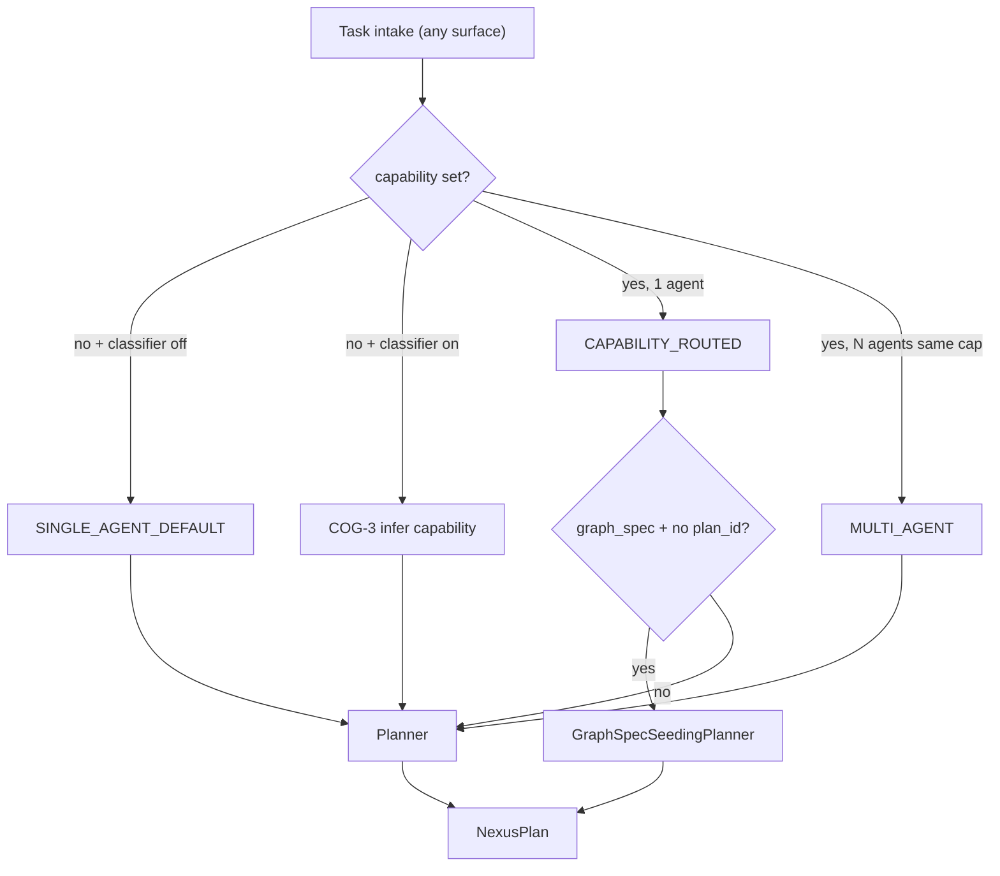
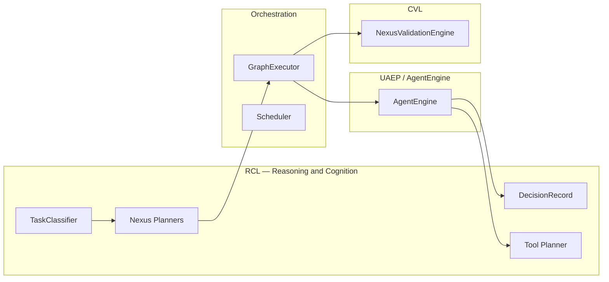
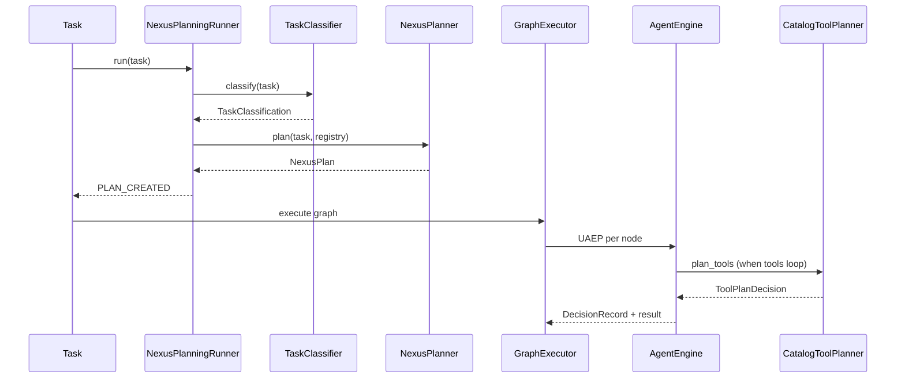

# Reasoning and Cognition

**Status:** Canonical architecture (domain pair 1:1)  
**Hub:** [`intergrax_runtime_architecture.md`](../intergrax_runtime_architecture.md)  
**Plan (1:1):** [`plan/REASONING_AND_COGNITION.md`](../plan/REASONING_AND_COGNITION.md)  
**Target:** [`IDEAL_HARNESS_AI_ARCHITECTURE.md`](../guides/IDEAL_HARNESS_AI_ARCHITECTURE.md) §3.5  
**Audit layers:** 7 (Reasoning, Planning and Cognition) · cross-ref 17 (Prompt Registry input)  
---

## Table of contents

1. [Purpose](#1-purpose)
2. [Problem statement](#2-problem-statement)
3. [Terminology](#3-terminology)
4. [Design principles](#4-design-principles)
5. [Three cognition planes](#5-three-cognition-planes)
6. [Ideal Cognition Layer alignment](#6-ideal-cognition-layer-alignment)
7. [Tier placement and responsibility matrix](#7-tier-placement-and-responsibility-matrix)
8. [Domain boundaries](#8-domain-boundaries)
9. [Task classification](#9-task-classification)
10. [Nexus planning](#10-nexus-planning)
11. [Declarative graph seeding](#11-declarative-graph-seeding)
12. [Engine planner (RuntimeEngine path)](#12-engine-planner-runtimeengine-path)
13. [Tool planning](#13-tool-planning)
14. [UAEP step cognition and DecisionRecord](#14-uaep-step-cognition-and-decisionrecord)
15. [Prompt compilation as cognition input](#15-prompt-compilation-as-cognition-input)
16. [Model selection for reasoning](#16-model-selection-for-reasoning)
17. [Reasoning failure taxonomy](#17-reasoning-failure-taxonomy)
18. [Observability and trace contracts](#18-observability-and-trace-contracts)
19. [Integration with adjacent subsystems](#19-integration-with-adjacent-subsystems)
20. [End-to-end cognition flow](#20-end-to-end-cognition-flow)
21. [Maturity scorecard and gap register](#21-maturity-scorecard-and-gap-register)
22. [Related documents](#22-related-documents)
23. [Appendix A — Code map](#appendix-a--code-map)
24. [Appendix B — Configuration surface](#appendix-b--configuration-surface)
25. [Appendix C — Audit and ideal traceability](#appendix-c--audit-and-ideal-traceability)

---

## 1. Purpose

Define the **Reasoning and Cognition Layer (RCL)** — the Harness AI subsystem that answers:

> **What should happen next — which agents, tools, and steps — before side effects execute?**

RCL completes the **Think → Plan → Decide** path that precedes orchestrated execution and verification. It **does not** own graph scheduling, retries, HITL queues, or final correctness proofs — those belong to [`ORCHESTRATION.md`](ORCHESTRATION.md), [`NEXUS_EXECUTION_FLOW.md`](NEXUS_EXECUTION_FLOW.md), and [`CRITIC_VERIFICATION.md`](CRITIC_VERIFICATION.md) respectively.

**Strategic positioning:** The Harness owns **how** reasoning is structured, observable, and separated from execution; agents and applications own **domain-specific** step logic inside UAEP bounds.

**Core invariant:** Reasoning outputs MUST be **typed contracts** (`NexusPlan`, `PlanStep`, `ToolPlanDecision`, `DecisionRecord`, `EnginePlan`) — never opaque free-text plans consumed directly by executors without validation.

---

## 2. Problem statement

Intergrax already implements substantial cognition mechanics, but until this domain pair they were **documented only as fragments** across orchestration flow, UAEP, LLM adapters, and prompt registry docs. Gaps vs production-grade Harness AI and FAUDIT-32 §7:

| Gap | Impact |
|-----|--------|
| No single canon for cognition plane | Authors cannot find planner / classifier / decision contracts in one place |
| `planner_kind=engine` uses ad-hoc LLM prompt | Not routed through Prompt Registry; weak governance |
| `EnginePlannerOrchestrator` bridged, not first-class Nexus path | Two planner stacks (`NexusPlan` vs `EnginePlan`) with incomplete unification |
| Nexus-level decisions lack universal `DecisionRecord` | FAUDIT-COG.1 closed for UAEP steps only; planning phase rationale partial |
| No explicit reasoning failure taxonomy | Planning parse errors, policy blocks, and runtime failures conflated in ops |
| Classifier surface | **Done** — `classifier_kind=rules|llm` + `IntentRoute` (ORCH-CONFIG.1, COG-3.*) |
| Model routing for reasoning not policy-unified | FAUDIT-LLM.1 residual — planner LLM ≠ producer LLM discipline incomplete at Nexus boundary |

RCL closes the **documentation and contract boundary** gap first; runtime depth uplift is tracked in [`plan/REASONING_AND_COGNITION.md`](../plan/REASONING_AND_COGNITION.md) Phase COG-DEPTH.

---

## 3. Terminology

| Term | Meaning in Intergrax |
|------|----------------------|
| **Reasoning** | Any deterministic or LLM-backed process that selects the next structured action without committing side effects |
| **Cognition** | Reasoning plus its inputs: assembled prompts, memory injections, policy overlays, model choice |
| **Classification** | First routing label on a Nexus task (`TaskClassification`) — constrains planner strategies |
| **Planning** | Production of `NexusPlan` / `EnginePlan` — agent topology and step graph **before** `GraphExecutor` |
| **Tool planning** | Selection of tool calls inside a UAEP step loop (`ToolPlanDecision`) |
| **Step planning** | Internal UAEP step sequencing (`StepPlanner`, agent `get_steps`) |
| **DecisionRecord** | Typed rationale artifact for a model/tool/subagent choice (`decision_record.v1`) |
| **Engine planner** | LLM-backed `EnginePlan` path used by `RuntimeEngine` / replan loops |
| **Nexus planner** | Task-level `NexusPlan` producer (`TaskPlanner`, `EngineBackedNexusPlanner`, graph seed wrapper) |
| **Graph seeding** | Mapping declarative `ApplicationGraphSpec` → `NexusPlan` when task has no pre-set `plan_id` |
| **RCL** | Reasoning and Cognition Layer — this document |

**Not RCL:** Graph batch scheduling, checkpoint resume, merge policies, critic verification, adaptive profile promotion.

---

## 4. Design principles

| Principle | Meaning in Intergrax |
|-----------|---------------------|
| **Reasoning before side effects** | Classifiers and planners run in `NexusPlanningRunner` before `GraphExecutor` mutates external state |
| **Typed plan contracts** | `NexusPlan`, `PlanStep`, `EnginePlan`, `ToolPlanDecision` are Pydantic/dataclass boundaries — executors reject invalid shapes |
| **Separation from execution** | UAEP steps 3–8 (`UNIFIED_EXECUTION_RUNTIME` §42.5) isolate context build, step loop, validation from Nexus graph scheduling |
| **Observable decisions** | Every UAEP step emits `DECISION_EMITTED` with `DecisionRecord` payload (FLOW-12 / FAUDIT-COG.1) |
| **Explicit strategies** | `planner_kind`, `classifier_kind`, `multi_agent_order`, graph seed rules — no hidden planner selection |
| **Fail safe on LLM parse** | LLM planners fall back to deterministic `TaskPlanner` on parse/validation failure |
| **Prompt governance** | Cognition prompts SHOULD use Prompt Registry ids — ad-hoc strings are technical debt (COG-2.*) |
| **Judge separation (cross-domain)** | When reasoning invokes LLM for planning, profile SHOULD differ from producer agent where policy requires — aligns with CVL judge separation |
| **Tier discipline** | Tier-1 owns universal planners/classifiers/decision contracts; Tier-2 owns domain step content; Tier-3 selects profiles |

---

## 5. Three cognition planes

Intergrax implements cognition at **three nested scopes**. All three converge on `ToolRuntime` for side effects and `PolicyEngine` for governance — but **decide** at different boundaries:

```text
┌─────────────────────────────────────────────────────────────────────────┐
│  PLANE 1 — Nexus task cognition (global)                                 │
│  Classify task → produce NexusPlan → validation_criteria                 │
│  Modules: TaskClassifier, TaskPlanner, EngineBackedNexusPlanner,         │
│           GraphSpecSeedingPlanner, NexusPlanningRunner                   │
└───────────────────────────────┬─────────────────────────────────────────┘
                                │ plan steps
┌───────────────────────────────▼─────────────────────────────────────────┐
│  PLANE 2 — UAEP step cognition (per agent node)                          │
│  build_context → step loop → AgentDecision → DecisionRecord              │
│  Modules: AgentEngine, UAEP, StepPlanner, agent.get_steps()              │
└───────────────────────────────┬─────────────────────────────────────────┘
                                │ tool requests
┌───────────────────────────────▼─────────────────────────────────────────┐
│  PLANE 3 — Tool cognition (per step tool loop)                           │
│  LLM selects tools → ToolPlanDecision → ToolRuntime                      │
│  Modules: CatalogToolPlanner, ToolPlanningService, ToolPlanDecision      │
└─────────────────────────────────────────────────────────────────────────┘
```

| Plane | Question answered | Primary output | Orchestration consumes |
|-------|-------------------|----------------|------------------------|
| **1 — Nexus task** | Which agents, in what order, with what dependencies? | `NexusPlan` | `plan_to_execution_graph()` |
| **2 — UAEP step** | What does this agent do inside one graph node? | `AgentExecutionResult`, `DecisionRecord` | Node completion, handoff |
| **3 — Tool** | Which tools does the LLM invoke this iteration? | `ToolPlanDecision` | `ToolRuntime.execute` |

**Rule:** Do not collapse planes — Nexus MUST NOT micromanage tool-level loops; agents MUST NOT rewrite global multi-agent topology without Nexus delegation contracts.

**Flow narrative (sequence diagrams, UC-*):** [`NEXUS_EXECUTION_FLOW.md`](NEXUS_EXECUTION_FLOW.md) §4–§18 — RCL owns cognition **depth**; FLOW owns end-to-end **narrative**.

---

## 6. Ideal Cognition Layer alignment

[`IDEAL_HARNESS_AI_ARCHITECTURE.md`](../guides/IDEAL_HARNESS_AI_ARCHITECTURE.md) §3.5 defines:

- LLM provider abstraction → [`LLM_ADAPTERS.md`](LLM_ADAPTERS.md)
- Prompt compiler (context + policy + memory) → §15 below + [`AGENT_CONTRACTS_AND_ASSEMBLY.md`](AGENT_CONTRACTS_AND_ASSEMBLY.md) §17
- Model selection (cost, latency, risk, quality) → §16 below + `LLMProfile` / future `ReasoningProfile`
- Structured output contracts → `NexusPlan`, `EnginePlan`, `ToolPlanDecision`, `DecisionRecord`

Ideal execution spine (§3.5 flow):

```text
Policy allows → Orchestrator creates plan → Cognition selects model + builds context
    → Capability executes → Memory enriches → …
```

Intergrax maps **Orchestrator creates plan** to Plane 1 (`NexusPlanningRunner`) and **Cognition selects model + builds context** to Planes 2–3 plus `ContextManager` ([`MEMORY.md`](MEMORY.md) §7).

---

## 7. Tier placement and responsibility matrix

### 7.1 Responsibility matrix

| Concern | Tier-0 | Tier-1 RCL / Nexus | Tier-2 Agent | Tier-3 Application |
|---------|--------|---------------------|--------------|-------------------|
| `DecisionRecord` contract | defines | emits on UAEP paths | supplies step rationale metadata | — |
| `NexusPlan` / `PlanStep` | — | `TaskPlanner`, LLM planners, graph seed | — | `graph_spec`, `OrchestrationProfile` |
| `TaskClassification` | enum | `TaskClassifier` | — | governance flags on task |
| `EnginePlan` | — | `EnginePlannerOrchestrator` | — | forced plan replay configs |
| Tool planning | `ToolRegistry` | `CatalogToolPlanner` | tool allowlists via contract | `ToolProfile` |
| Prompt layers for planning | `YamlPromptRegistry` | planner prompt ids (target) | agent prompt ids | `PromptProfile` |
| Plan validation criteria | — | `NexusValidationEngine` consumes | `Agent.validate()` | `validation_criteria` on plan |
| Domain step logic | — | UAEP loop only | **primary owner** | agent roster |
| Dynamic replan | — | `allow_dynamic_replan` flag (partial) | replan hooks in engine path | profile toggle |

### 7.2 What RCL MUST NOT do

- Schedule parallel graph batches or enforce `max_inflight_nodes` — [`ORCHESTRATION.md`](ORCHESTRATION.md)
- Prove output correctness — [`CRITIC_VERIFICATION.md`](CRITIC_VERIFICATION.md)
- Persist memory or assemble full context budget — [`MEMORY.md`](MEMORY.md)
- Encode domain business rules inside universal planners
- Call vendor LLM SDKs outside `LLMAdapter`

### 7.3 What agents/applications MUST NOT do

- Bypass `NexusPlanningRunner` to run multi-agent workflows privately
- Emit untyped plan dicts directly to `GraphExecutor`
- Skip `DecisionRecord` emission on governed decision paths
- Hardcode planner prompts when registry ids exist for the host profile

---

## 8. Domain boundaries

```text
REASONING_AND_COGNITION  →  what / why (plan, classify, decide, tool select)
ORCHESTRATION            →  when / order / retry / parallel (graph, scheduler)
NEXUS_EXECUTION_FLOW     →  end-to-end narrative across domains
LLM_ADAPTERS             →  provider wire protocol, response envelope
AGENT_CONTRACTS §17      →  prompt asset governance (input to cognition)
MEMORY §7                →  context compiler output fed into cognition
CRITIC_VERIFICATION      →  verify outputs and trajectories (post-decision)
```

| Adjacent domain | RCL hands off | RCL receives |
|-----------------|---------------|--------------|
| `ORCHESTRATION` | `NexusPlan` | classified `Task`, registry |
| `UNIFIED_EXECUTION_RUNTIME` | step decisions | UAEP execution context |
| `LLM_ADAPTERS` | `generate_messages` requests | `LLMAdapterResponse` |
| `TOOLS` | `ToolPlanDecision` | tool schemas, policy tags |
| `CRITIC_VERIFICATION` | agent output artifacts | validation failures (revise loops) |

---

## 9. Task classification

Classification is the **first cognition decision** on every Nexus task. It constrains planner behavior but does **not** mutate `Task.state` — `TaskLifecycle` owns lifecycle state.

**Module:** `intergrax/runtime/nexus/task_classifier.py`  
**Runner integration:** `NexusPlanningRunner.run()` after intake hooks  
**Wiring:** `OrchestrationProfile.classifier_kind` → `default` only (`orchestration_wiring.py`)

### 9.1 Classification labels

| `TaskClassification` | Meaning | Planner effect |
|----------------------|---------|----------------|
| `SINGLE_AGENT_DEFAULT` | No explicit agent or capability | One step; first registry agent |
| `SINGLE_AGENT_EXPLICIT` | `task.agent_id` set | One step; fixed agent |
| `CAPABILITY_ROUTED` | Capability matches one agent | One step; capability match |
| `MULTI_AGENT` | Multiple agents share capability | Sequential steps; order from `multi_agent_order` |
| `UNSUPPORTED` | No agent for requested capability | Empty plan → terminal FAILED |
| `HUMAN_APPROVAL_REQUIRED` | Governance flag | Plan created; pause before graph if not resumed |
| `HIGH_RISK` | Risk label on agent/flag | Label overlay; underlying strategy preserved |
| `LONG_RUNNING` | Long-running profile enabled | Label; checkpoint path when scheduler enabled |

### 9.2 Decision flow


### 9.3 Trace events

| Phase | Event | Hint group |
|-------|-------|------------|
| Classification | lifecycle hook diagnostics | `ops:planning` |
| | payload includes `classification` | |

**Partial (ORCH-CONFIG.1):** `classifier_kind=rules` + `IntentRoute` on `OrchestrationProfile`. **Future (COG-3.*):** LLM-backed classifier, confidence scores on classification.

### 9.4 Orchestration routing modes (do not confuse with `TaskClassification`)

`TaskClassification` labels describe **how many agents match the requested capability**, not the **multi-agent collaboration topology**. Authors need a separate mental model:

| Routing mode | How it is selected | Agent roles | Typical classification label |
|--------------|-------------------|-------------|------------------------------|
| **Single-agent routed** | One agent matches `task.context.capability` | One specialist | `CAPABILITY_ROUTED` |
| **Same-capability multi-agent** | Multiple agents declare **identical** capability | Competing or sequential specialists with same skill tag | `MULTI_AGENT` |
| **Pipeline graph** | `ApplicationGraphSpec` on profile + task without `plan_id` | Different capabilities in fixed order | `CAPABILITY_ROUTED` or `MULTI_AGENT` after graph seed |
| **Pipeline capability** | `task.context.capability` ends with `.pipeline` (convention) | Planner emits known multi-step plan | Varies; often `CAPABILITY_ROUTED` |
| **Engine-planned** | `planner_kind=engine` | LLM builds `NexusPlan` from registry + message | Underlying label preserved |
| **Explicit agent** | `task.agent_id` set | Fixed agent regardless of capability | `SINGLE_AGENT_EXPLICIT` |

```text
WRONG:  "I have 2 agents (docs + web) → MULTI_AGENT will chain them"
RIGHT:  "I have 2 agents → graph_spec DEPENDS_ON chain OR *.pipeline OR engine planner"
```

| Symptom | Misconfiguration | Fix |
|---------|------------------|-----|
| Only first agent runs | `CAPABILITY_ROUTED` with one matching capability | Add `graph_spec` or use `*.pipeline` |
| All same-capability agents run in sequence | `MULTI_AGENT` triggered intentionally | Expected only for redundant specialists |
| Graph ignored | Task carries pre-built `plan_id` | Clear `plan_id` for fresh graph seed |
| Chat sends free text, wrong agent | No L1 capability; classifier not enabled | `classifier_kind=rules` + `IntentRoute`, or host `B1` shim |

**Cross-ref:** full configuration canon (CFG-*, matrices, plan register) — [`ORCHESTRATION.md`](ORCHESTRATION.md) §56 · Tier-3 host summary — [`TIER3_APPLICATION_ENVIRONMENT.md`](TIER3_APPLICATION_ENVIRONMENT.md) §23.

### 9.5 Intake → classification → planning contract



**Ownership:** Tier-3 sets `capability` unless COG-3 classifier is enabled. Tier-1 never parses vendor-specific payload formats — adapters normalize first.

---

## 10. Nexus planning

Planning produces **`NexusPlan`** — the task-level contract consumed by `plan_to_execution_graph()`.

### 10.1 Core models

```python
# intergrax/runtime/nexus/planning/task_planner.py

class PlanStep(BaseModel):
    step_id: str
    agent_id: str | None
    capability: str | None
    description: str
    depends_on: list[str]
    delegation: DelegationSpec | None

class NexusPlan(BaseModel):
    plan_id: str
    task_id: str
    classification: str
    steps: list[PlanStep]
    validation_criteria: list[str]
    graph_retry_on_error: int | None
```

### 10.2 Planner selection

| `OrchestrationProfile.planner_kind` | Implementation | LLM? |
|-------------------------------------|----------------|------|
| `null` / `default` | `TaskPlanner()` | No |
| `engine` | `EngineBackedNexusPlanner` → `build_nexus_plan_from_llm()` | Yes |
| unknown | — | `OrchestrationWiringError` at bootstrap |

**Bootstrap rule:** `planner_kind=engine` requires `OrchestrationWiringContext.llm_adapter` — host fails fast otherwise.

**Parse rule:** LLM planner validates `agent_id` against `registry.list_routable_agent_ids()`; any unknown id → fallback to `TaskPlanner`.

### 10.3 Deterministic TaskPlanner strategies

| Trigger | Plan shape |
|---------|------------|
| Default / single-agent classifications | 1 step |
| `MULTI_AGENT` | N sequential steps with `depends_on` chain |
| `research.pipeline` or `intent=research_summarize` | 2 steps: web_search → summarize |
| `*.pipeline` (product convention) | Prefer `graph_spec` seed or registered planner rule — do not assume generic `TaskPlanner` knows every product |
| `UNSUPPORTED` | 0 steps |

**Ordering:** `OrchestrationProfile.multi_agent_order` — `registry` (default) or declared stable order (FLOW-17).

### 10.4 LLM-backed Nexus planner (FLOW-1)

`EngineBackedNexusPlanner` (`orchestration_wiring.py`) delegates to `build_nexus_plan_from_llm()`:

1. Build prompt listing routable `agent_id` values and task metadata
2. Call `LLMAdapter.generate_messages`
3. Parse JSON `{"steps":[{"agent_id","description","depends_on"}]}`
4. On any validation failure → `TaskPlanner.plan()` fallback

**Technical debt:** prompt is inline string — target: Prompt Registry id `nexus.task_planner.v1` (COG-2.1).

### 10.5 Planning phase runner

`NexusPlanningRunner` (`planning_runner.py`):

1. Intake hooks (`BEFORE_TASK_INTAKE`, classification hooks)
2. `classifier.classify(task)`
3. Pre-plan policy hooks (FLOW-11)
4. `planner.plan(task, registry)` → `NexusPlan`
5. HITL gate when `HUMAN_APPROVAL_REQUIRED`
6. Emit `PLAN_CREATED` (`ops:planning`) with `plan_id`, `step_count`
7. Set lifecycle `PLANNED`

**Policy integration:** `PolicyEngine` may BLOCK at planning boundary — classified as reasoning-policy failure (§17).

### 10.6 Plan → execution handoff

```text
NexusPlan
    → plan_to_execution_graph()   # graph_builder.py
    → ExecutionGraph
    → GraphExecutor               # ORCHESTRATION domain
```

RCL responsibility **ends** at validated `NexusPlan` handoff; graph execution is orchestration.

---

## 11. Declarative graph seeding

When Tier-3 declares `ApplicationEnvironmentProfile.graph_spec.nodes` and the task has **no** pre-set `plan_id`:

```text
GraphSpecSeedingPlanner wraps inner planner
    if should_seed_plan_from_graph_spec(task):
        application_graph_spec_to_nexus_plan(spec, task)
    else:
        inner.plan(task, registry)
```

| Edge kind | Effect on `NexusPlan` |
|-----------|----------------------|
| `DEPENDS_ON` | Target step `depends_on` source |
| `DELEGATES_TO` | Child step + `DelegationSpec` on child ([ADR-FLOW-001](../adr/ADR-FLOW-001.md)) |

**Authoring:** `AgentGraph` fluent builder — `intergrax/applications/contracts/graph_builder.py`  
**Application domain:** [`TIER3_APPLICATION_ENVIRONMENT.md`](TIER3_APPLICATION_ENVIRONMENT.md)

---

## 12. Engine planner (RuntimeEngine path)

Separate from Nexus task planning, **`EnginePlannerOrchestrator`** serves the RuntimeEngine / replan loop with **`EnginePlan`** models.

| Module | Role |
|--------|------|
| `engine_planner_orchestrator.py` | LLM plan generation, forced-plan replay |
| `engine_plan_models.py` | `EnginePlan`, `PlannerPromptConfig` |
| `engine_planner_parse.py` | Structured parse helpers |
| `engine_planner_messages.py` | Message assembly |
| `engine_planner_diagnostics.py` | Planner debug metadata |
| `plan_loop_controller.py` | Replan loop control |
| `plan_sources.py` | `LLMPlanSource`, replay sources |

**Bridge status:** Nexus `planner_kind=engine` uses **`nexus_llm_plan_builder.py`** — a lighter JSON bridge — **not** the full `EnginePlannerOrchestrator` stack. Unification is COG-1.* backlog.

**When to use which path:**

| Path | Entry | Output | Typical use |
|------|-------|--------|-------------|
| Nexus planners | `NexusPlanningRunner` | `NexusPlan` | Multi-agent task orchestration |
| Engine planner | `RuntimeEngine` / step pipelines | `EnginePlan` | Single-runtime step decomposition, replan |

---

## 13. Tool planning

Tool cognition selects **which tools** the LLM calls inside a step loop.

| Module | Role |
|--------|------|
| `catalog_tool_planner.py` | Tier-1 `ToolPlannerProtocol` implementation |
| `tool_planning_service.py` | LLM + registry orchestration |
| `tool_plan_decision.py` | `ToolPlanDecision` output model |
| `tool_planner_protocol.py` | Planner interface |

```python
@dataclass
class ToolPlanDecision:
    final_answer: str | None
    tool_plan: ToolCallPlan | None
    messages: list[ChatMessage]
```

**Distinction:** `ToolPlanDecision` ≠ `AgentDecision` (§42.7 UAEP) — tool planner serves tools-agent and step loops; UAEP wraps agent semantics.

**Prompt config:** `ToolPlanningConfig` may bind `YamlPromptRegistry` — preferred pattern for Plane 3 prompts.

---

## 14. UAEP step cognition and DecisionRecord

UAEP ([`UNIFIED_EXECUTION_RUNTIME.md`](UNIFIED_EXECUTION_RUNTIME.md) §42.5) mandates the agent step loop. Cognition-relevant steps:

```text
3. BEFORE_CONTEXT_BUILD hooks
4. agent.build_context(request)
5. AFTER_CONTEXT_BUILD hooks
6. FOR each AgentStep:
       execute_step → emit STEP_* → collect AgentDecision → DecisionRecord
7. agent.validate(output)
```

### 14.1 DecisionRecord contract

```python
# intergrax/contracts/decision_record.py

class DecisionRecord(BaseModel):
    decision_id: str
    trace_id: str
    run_id: str
    tenant_id: str
    task_id: str
    agent_id: str
    step_id: str
    decision_type: str
    rationale: str
    policy_action: str
    version: str = "decision_record.v1"
    created_at: datetime
    metadata: dict[str, Any]
```

**Emission:** `AgentEngine` / UAEP emits `RuntimeEventType.DECISION_EMITTED` with `decision_record` payload on governed step paths (FLOW-12).

**Gate:** regression test verifies emit on UAEP decision paths — `tests/integration/agents/`.

### 14.2 AgentDecision vs DecisionRecord

| Artifact | Scope | Purpose |
|----------|-------|---------|
| `AgentDecision` | Step control flow | CONTINUE / INTERRUPT / FAIL loop |
| `DecisionRecord` | Audit + explainability | Persistent rationale for ops and eval |

### 14.3 Step planner (internal)

`intergrax/runtime/nexus/planning/step_planner/` — strategies for runtime step plans inside engine pipelines. Consumed by RuntimeEngine paths, not directly by Nexus graph scheduling.

**Gap (COG-4.*):** Nexus planning phase does not yet emit `DecisionRecord` for classification/planner choice — only UAEP steps.

---

## 15. Prompt compilation as cognition input

Cognition quality depends on layered prompt assembly. Prompt **assets** are governed in [`AGENT_CONTRACTS_AND_ASSEMBLY.md`](AGENT_CONTRACTS_AND_ASSEMBLY.md) §17; RCL **consumes** composed prompts at decision time.

| Layer | Source | Cognition use |
|-------|--------|---------------|
| System | Prompt Registry | Planner + agent identity |
| Task | Task message / plan step description | Planner prompts |
| Policy | `prompt_policy_overlay.py` | Deny/allow overlays on planner LLM calls |
| Context | `ContextManager` / `ContextCompiler` | Agent step cognition |
| Memory | `UserLongtermMemoryStep`, RAG steps | Agent step cognition |

**Requirements (audit §7):**

- No ad-hoc string assembly for production planners (target)
- Golden catalog regression — `check_harness_prompt_golden_catalog.py`
- Tier-3 `PromptProfile` selects catalog path per host

**Authoring:** [`guides/AGENT_CREATION_GUIDE.md` Appendix M](../guides/AGENT_CREATION_GUIDE.md) · Appendix I §I.4 planning strategies

---

## 16. Model selection for reasoning

Reasoning MAY use a different LLM profile than the producing agent — especially for planners and tool loops.

| Surface | Today | Target |
|---------|-------|--------|
| Nexus LLM planner | Same adapter as wiring context | Optional dedicated planner model via `ReasoningProfile` (COG-5.*) |
| Tool planner | Service-bound `LLMAdapter` | Profile-driven |
| UAEP agent steps | Agent `LLMProfile` | Unchanged |
| CVL judge | Separate critic profile | [`CRITIC_VERIFICATION.md`](CRITIC_VERIFICATION.md) |

**Related:** FAUDIT-LLM.1 policy-driven routing — [`LLM_ADAPTERS.md`](LLM_ADAPTERS.md), [`ADAPTIVE_HARNESS_INTELLIGENCE.md`](ADAPTIVE_HARNESS_INTELLIGENCE.md) routing proposals.

**Provider metadata:** `LLMTokenUsage.reasoning_tokens` captures provider-native reasoning token accounting — observability only, not harness reasoning layer semantics.

---

## 17. Reasoning failure taxonomy

Classify failures **before** orchestration retry logic conflates them:

| Class | Code | Typical cause | Terminal? | Owner action |
|-------|------|---------------|-----------|--------------|
| **Classification unsupported** | `COG-UNSUPPORTED` | No agent for capability | Yes — FAILED | Register agent or fix capability |
| **Planner parse** | `COG-PLAN-PARSE` | LLM JSON invalid | Fallback planner | Check prompt / model |
| **Planner validation** | `COG-PLAN-VALID` | Unknown agent_id in plan | Fallback planner | Fix registry roster |
| **Policy block (planning)** | `COG-POLICY-BLOCK` | Pre-plan hook BLOCK | Yes — FAILED | Policy rule change |
| **Human rejected plan** | `COG-HITL-REJECT` | Operator REJECT at plan gate | Yes — FAILED | Re-intake task |
| **Empty plan** | `COG-PLAN-EMPTY` | UNSUPPORTED classification | Yes — FAILED | — |
| **Engine replan exhausted** | `COG-REPLAN-EXHAUST` | Replan budget exceeded | Step FAILED | Tune replan policy |
| **Tool plan failure** | `COG-TOOL-PLAN` | Tool planner error | Step retry / fail | Tool registry / prompt |
| **Decision record missing** | `COG-DECISION-GATE` | UAEP path skipped emit | Gate test fail | Fix AgentEngine path |

**Target (COG-6.*):** explicit `ReasoningFailureKind` enum on trace events — today inferred from lifecycle + hook payloads.

---

## 18. Observability and trace contracts

| Phase | Event | Hint | Key payload fields |
|-------|-------|------|-------------------|
| Intake | `TASK_CREATED` | `ops:lifecycle` | `task_id`, `tenant_id` |
| Classification | hook diagnostics | `ops:planning` | `classification` |
| Planning | `PLAN_CREATED` | `ops:planning` | `plan_id`, `step_count` |
| UAEP step | `STEP_STARTED` / `STEP_COMPLETED` | `trace:step` | step index |
| UAEP decision | `DECISION_EMITTED` | `ops:planning` | `decision_record` |
| Tool plan | tool planner traces | `ops:tools` | tool ids selected |

**SLO hooks:** planning latency, planner fallback rate, LLM parse error rate — Phase COG-OBS.* in plan.

**Debug APIs:** FastAPI run inspection surfaces plan id and classification when wired through lab hosts.

---

## 19. Integration with adjacent subsystems



| Subsystem | Integration point |
|-----------|-------------------|
| `PolicyEngine` | Pre-plan hooks, tool scope on planner LLM calls |
| `AgentRegistry` | Routable agent ids for planners |
| `ContextManager` | Feeds Plane 2 cognition — not owned by RCL |
| `OnlineEvaluationRegistry` | May consume `DecisionRecord` metadata for trajectory eval |
| `AdaptiveHarness` | Proposes `planner_kind` / strategy changes — observe-only default |
| `HITL` | Plan approval gates in `NexusPlanningRunner` |

---

## 20. End-to-end cognition flow



**Platform principle ([`PLATFORM_FOUNDATION.md`](PLATFORM_FOUNDATION.md) §8.3):** Nexus owns **global** reasoning (Plane 1); agents own **local** execution cognition (Planes 2–3) within UAEP bounds.

---

## 21. Maturity scorecard and gap register

| Area | Score (L0–L4) | Status | Close via |
|------|---------------|--------|-----------|
| Task classification (deterministic) | L3 | Done | COG-DOC.* |
| Deterministic TaskPlanner | L3 | Done | maintain |
| Declarative graph_spec seeding | L3 | Done | ORCH-2 |
| LLM Nexus planner (bridged) | L3 | **Done** | COG-1.* |
| Engine planner unification | L3 | **Done** | COG-1.* |
| DecisionRecord on UAEP | L3 | Done | FLOW-12 |
| DecisionRecord on Nexus planning | L3 | **Done** | COG-4.* |
| Prompt Registry on all planners | L3 | **Done** | COG-2.* |
| Rules classifier (`classifier_kind=rules`) | L3 | **Done** | ORCH-CONFIG.1 · COG-3.1 |
| LLM classifier (`classifier_kind=llm`) | L2 | **Done** | COG-3.2–3.3 |
| Reasoning failure taxonomy in trace | L3 | **Done** | COG-6.* |
| Model routing for reasoning | L3 | **Done** | COG-5.* |
| **Overall RCL (FAUDIT-32 §7)** | **L3+** | **Done** | Phase COG-DEPTH (2026-06-09) |

**Post-COG-DEPTH:** P0/P1/P2 complete; incremental L4 depth remains maintenance-only.

All implementation tasks: [`plan/REASONING_AND_COGNITION.md`](../plan/REASONING_AND_COGNITION.md).

---

## 22. Related documents

| Document | Relationship |
|----------|--------------|
| [`ORCHESTRATION.md`](ORCHESTRATION.md) | Nexus loop; graph scheduling consumes plans |
| [`NEXUS_EXECUTION_FLOW.md`](NEXUS_EXECUTION_FLOW.md) | End-to-end flow narrative; §7–§8 summary points here |
| [`UNIFIED_EXECUTION_RUNTIME.md`](UNIFIED_EXECUTION_RUNTIME.md) §42.5 | UAEP separation invariant |
| [`LLM_ADAPTERS.md`](LLM_ADAPTERS.md) | Provider abstraction for cognition LLM calls |
| [`AGENT_CONTRACTS_AND_ASSEMBLY.md`](AGENT_CONTRACTS_AND_ASSEMBLY.md) §17 | Prompt Registry governance |
| [`MEMORY.md`](MEMORY.md) §7 | Context compiler feeds cognition inputs |
| [`CRITIC_VERIFICATION.md`](CRITIC_VERIFICATION.md) | Post-reasoning verification (PEV) |
| [`PLATFORM_FOUNDATION.md`](PLATFORM_FOUNDATION.md) §8.3 | Nexus owns global reasoning |
| [`guides/INTEGRAX_HARNESS_AUDIT_MAP.md`](../guides/INTEGRAX_HARNESS_AUDIT_MAP.md) §7 | Audit procedure |
| [`guides/AGENT_CREATION_GUIDE.md`](../guides/AGENT_CREATION_GUIDE.md) Appendix I §I.4 | Planning strategies for authors |
| [`adr/ADR-FLOW-001.md`](../adr/ADR-FLOW-001.md) | Delegation expansion in plans |
| [`adr/ADR-FLOW-003.md`](../adr/ADR-FLOW-003.md) | MODIFY_PLAN reserved semantics |
| [`ELASTIC_CAPACITY_AND_SCALING.md`](ELASTIC_CAPACITY_AND_SCALING.md) | Execution capacity (dimension A) vs agent topology (dimension B) |

---

## Appendix A — Code map

| Module | Tier | Plane | Role |
|--------|------|-------|------|
| `runtime/nexus/task_classifier.py` | 1 | 1 | Task classification |
| `runtime/nexus/orchestration/planning_runner.py` | 1 | 1 | Planning phase orchestration |
| `runtime/nexus/planning/task_planner.py` | 1 | 1 | `NexusPlan`, `TaskPlanner` |
| `runtime/nexus/planning/nexus_llm_plan_builder.py` | 1 | 1 | LLM → `NexusPlan` bridge |
| `runtime/nexus/planning/nexus_planner_protocol.py` | 1 | 1 | Planner protocol |
| `runtime/nexus/planning/engine_planner_orchestrator.py` | 1 | 1/2 | `EnginePlan` LLM planner |
| `runtime/nexus/planning/plan_loop_controller.py` | 1 | 2 | Replan control |
| `runtime/nexus/planning/step_planner/` | 1 | 2 | Step plan strategies |
| `runtime/nexus/tools/catalog_tool_planner.py` | 1 | 3 | Tool planning |
| `runtime/nexus/tools/tool_planning_service.py` | 1 | 3 | Tool plan LLM service |
| `contracts/decision_record.py` | 0 | 2 | DecisionRecord contract |
| `agents/uaep.py` | 2 | 2 | UAEP + DECISION_EMITTED |
| `applications/_shared/orchestration_wiring.py` | 3 | 1 | Profile → planner/classifier |
| `applications/contracts/graph_builder.py` | 3 | 1 | Declarative graph authoring |
| `applications/contracts/environment_profile.py` | 3 | — | `OrchestrationProfile` |
| `prompts/registry/` | 0 | input | Prompt assets |
| `runtime/architecture/prompt_composition.py` | 1 | input | Layer composition |

---

## Appendix B — Configuration surface

### OrchestrationProfile (cognition-relevant fields)

From `ApplicationEnvironmentProfile.orchestration_profile`:

| Field | Type | Cognition effect |
|-------|------|------------------|
| `planner_kind` | `str \| null` | `default` → `TaskPlanner`; `engine` → LLM planner |
| `classifier_kind` | `str \| null` | `default` → `TaskClassifier` |
| `multi_agent_order` | `str` | Agent ordering in MULTI_AGENT plans |
| `allow_dynamic_replan` | `bool` | Engine replan loops (partial) |
| `merge_strategy` | `str` | **Orchestration** — post-execution merge, not planning |

**Future `ReasoningProfile` (COG-5.1):** dedicated planner LLM id, parse retry budget, prompt registry ids, classification mode — proposed Tier-3 profile; not shipped.

### Authoring patterns

| Pattern | `planner_kind` | When |
|---------|----------------|------|
| Lab / deterministic | `default` | Predictable agent tests |
| Dynamic decomposition | `engine` | Multi-agent product hosts with LLM |
| Declarative product graph | `default` + `graph_spec` | Fixed topology applications |

---

## Appendix C — Audit and ideal traceability

| Source | Section | RCL section |
|--------|---------|-------------|
| IDEAL §3.5 Cognition Layer | Model + prompt + contracts | §6, §15, §16 |
| AUDIT_MAP §7 | Reasoning/planning/cognition audit | Whole document |
| FAUDIT-COG.1 | DecisionRecord per step | §14 |
| FAUDIT-LLM.1 | Policy model routing | §16, COG-5.* |
| FLOW-1 | EngineBackedNexusPlanner | §10.4 |
| FLOW-11 | Pre-plan policy hooks | §10.5 |
| FLOW-12 | DecisionRecord gate | §14 |
| ORCH-1 | Planner strategies | §10 |
| PLATFORM §8.3 | Nexus global reasoning | §20 |

---

*End of Reasoning and Cognition Architecture canon.*
