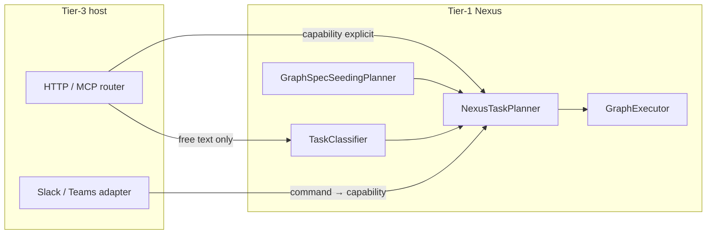

# Tier-3 Application Environment, Sandbox, and Shadow Workspace

**Status:** Canonical architecture (domain pair 1:1)  
**Hub:** [`intergrax_runtime_architecture.md`](../intergrax_runtime_architecture.md)  
**Plan (1:1):** [`plan/TIER3_APPLICATION_ENVIRONMENT.md`](../plan/TIER3_APPLICATION_ENVIRONMENT.md)  
**Target:** [`IDEAL_HARNESS_AI_ARCHITECTURE.md`](../guides/IDEAL_HARNESS_AI_ARCHITECTURE.md)  
**Audit layers:** 28  
---

---

# 20. Shadow Workspace Model

A Shadow Workspace is an isolated temporary workspace used to perform work without directly modifying the main environment.

Inspired by Cursor-like execution environments.

Shadow Workspaces may be used for:

- code experiments
- document analysis
- temporary data transformations
- simulated business workflows
- vendor research sessions
- legal document review sessions
- onboarding simulations

A Shadow Workspace should provide:

- isolation
- temporary storage
- reproducibility
- rollback safety
- inspectable artifacts
- cleanup

---


---

# 21. Sandbox Model

A sandbox is a controlled execution environment.

Use sandboxes for:

- code execution
- browser automation
- file manipulation
- risky tool use
- external data extraction
- generated script execution

Sandbox execution should be:

- isolated
- observable
- permission-controlled
- interruptible
- disposable
- reproducible when possible

---

---

# 22. Application Environment Profile (canonical)

Tier-3 hosts are configured through **`ApplicationEnvironmentProfile`** — a typed umbrella aggregating every harness control plane slice.

## 22.1 Profile composition

| Sub-profile | Purpose |
|-------------|---------|
| `IdentityProfile` | API key, tenant_required, service identities |
| `PolicyRulesProfile` + `ExecutionMode` | Declarative rules + STRICT/BALANCED/EXPLORATORY |
| `ApplicationSecurityProfile` | Per-app V-SEC toggles |
| `ToolProfile` / `SkillProfile` | Allowed catalogs |
| `IntegrationProfile` | Provider stack |
| `LLMProfile` / `ModalityProfile` | Model and modality posture |
| `ContextProfile` / `MemoryProfile` / `ContextDecisionProfile` | Assembly and stores |
| `PromptProfile` | YAML prompt catalog path |
| `ReliabilityProfile` | Idempotency, circuit breaker, checkpoint |
| `ObservabilityProfile` | Trace, OTEL, metrics plugins |
| `OrchestrationProfile` | Planner/classifier kinds, delegation depth |
| `ApplicationGraphSpec` | Declarative multi-agent topology |

**Contract:** `intergrax/applications/contracts/environment_profile.py`

## 22.2 Unified wiring entrypoints

```text
ApplicationManifest
    -> build ApplicationBuildContext
    -> wire_application_environment(ctx, profile)
    -> materialize_runtime_config(request, harness_ctx, env)
    -> build_nexus_loop_from_environment(...)
    -> UnifiedTaskRunner (§41)
```

| Module | Role |
|--------|------|
| `applications/_shared/environment_wiring.py` | Single wiring entry |
| `runtime_config_bridge.py` | Environment → `RuntimeConfig` |
| `nexus_factory.py` | NexusLoop from profile |
| `identity_wiring.py` | Host auth from `IdentityProfile` |
| `shadow_wiring.py` / `sandbox_wiring.py` | Isolated execution |
| `*_runtime_bridge.py` | Domain bridges (RAG, memory, policy, …) |

## 22.3 Interaction surfaces (intake)

Normalized intake MUST converge on the same Nexus lifecycle:

| Surface | Typical entry |
|---------|---------------|
| HTTP API | `applications/*/host/` FastAPI routers |
| CLI | `intergrax` CLI / lab commands |
| Slack / Teams | `POST /v1/interactions/intake` + adapters |
| Webhook / worker | `applications/_shared/task_intake.py`, queue consumers |
| Scheduler | `intergrax/queueing/` + long-running task API |

See [`ORCHESTRATION.md`](ORCHESTRATION.md) §48 for `TaskEnvelope` normalization.

## 22.4 Host migration rule

Every Tier-3 application MUST:

1. declare `environment` on `ApplicationManifest`,
2. wire through `wire_application_environment` (no ad-hoc `getattr` profile access),
3. keep business logic in Tier-2 agents — hosts only compose harness.

**Plan:** [`plan/TIER3_APPLICATION_ENVIRONMENT.md`](../plan/TIER3_APPLICATION_ENVIRONMENT.md) Phase H-APP (43 tasks, Done).

## 22.5 Related documents

| Document | Relationship |
|----------|--------------|
| [`applications/USAGE.md`](../../applications/USAGE.md) | Authoring Tier-3 hosts |
| [`UNIFIED_EXECUTION_RUNTIME.md`](UNIFIED_EXECUTION_RUNTIME.md) | UAEP + policy runtime |
| [`ORCHESTRATION.md`](ORCHESTRATION.md) | Nexus orchestration fields on profile |
| [`ELASTIC_CAPACITY_AND_SCALING.md`](ELASTIC_CAPACITY_AND_SCALING.md) | `ScalingProfile`, deploy/Helm vs ECP provisioning |
| [`guides/HARNESS_ENVIRONMENT.md`](../guides/HARNESS_ENVIRONMENT.md) | Lab stack operator guide |

---

# 23. Application interaction postures (canonical)

Tier-3 hosts are **composition shells** around a long-lived Nexus runtime. The same platform mechanisms support different **interaction postures** — selected through `ApplicationEnvironmentProfile` and host wiring, not separate runtime forks.

> **Master configuration canon (all postures × agent counts × strategies × CFG cases):** [`ORCHESTRATION.md`](ORCHESTRATION.md) **§56** — start there for product design and implementation planning. This section is the **Tier-3 host summary** only.

**Runtime narrative:** [`NEXUS_EXECUTION_FLOW.md`](NEXUS_EXECUTION_FLOW.md) §3.1 · **Patterns:** [`ORCHESTRATION.md`](ORCHESTRATION.md) §50–§56 · **Routing modes:** [`REASONING_AND_COGNITION.md`](REASONING_AND_COGNITION.md) §9.4.

## 23.1 Posture catalog

| Posture | Process model | Task trigger | Typical surfaces |
|---------|---------------|--------------|------------------|
| **Reactive on-demand** | Host daemon idle until work arrives | User/API message per `Task` | HTTP `POST …/run`, MCP, Slack/Teams intake (`execute=true`) |
| **Always-on daemon** | Host process runs continuously | Same as reactive; plus health/index maintenance | Local HTTP/MCP, tray, Socket Mode Slack |
| **Scheduled / queued background** | Worker consumes queue or cron | Scheduler, file watcher, webhook enqueue | `intergrax/queueing/`, long-running API, `message_bus` |
| **Hybrid** | Daemon + background workers | Mix of interactive and async tasks | LKW-style: index in background, Q&A on demand |

**Invariant:** every posture normalizes work to **`Task` → `UnifiedTaskRunner` → `NexusLoop.handle_task()`**. Surfaces differ; Nexus lifecycle does not.

```text
Bootstrap (once per host process):
  ApplicationManifest + ApplicationEnvironmentProfile
    → wire_application_environment()
    → build_application_registry()
    → build_nexus_loop_from_environment()
    → UnifiedTaskRunner(nexus_loop)

Per unit of work (any posture):
  Surface adapter → Task → UnifiedTaskRunner.run_task() → NexusLoop
```

Agents are **not** separate OS processes. They are registry entries invoked **on demand** per graph node. The host may be always-on; agents remain passive until Nexus schedules a node.

## 23.2 Profile knobs per posture

| Concern | Profile / module | Reactive | Always-on daemon | Background / hybrid |
|---------|------------------|----------|------------------|---------------------|
| HTTP/MCP serving | Host `factory.py` | Optional | **Required** | Often required for ops |
| Interaction intake | `wire_interaction_intake_service` | Optional | Recommended | Optional (notify only) |
| Long-running + checkpoint | `OrchestrationProfile.long_running_enabled`, `ReliabilityProfile` | Off unless large jobs | On for reports / HITL | **On** for batch pipelines |
| Queue consumer | `applications/_shared/task_intake.py`, `queueing/` | Rare | Optional | **Required** for async |
| Notification on complete | `NotificationAdapter`, integration webhooks | Optional | Recommended | **Required** for user alert |
| Shadow / sandbox | `ShadowWorkspaceProfile`, `SandboxProfile` | Per task | Per task | Per task |
| Execution mode | `ExecutionMode` STRICT / BALANCED / EXPLORATORY | Product choice | Product choice | Often BALANCED for batch |

**Rule:** posture is a **product wiring decision** on Tier-3. Tier-1 Nexus semantics are identical across postures.

## 23.3 Routing responsibility matrix (who sets `capability`)

Free-text user input does **not** implicitly select agents. Routing is explicit at one of four layers:

| Layer | Owner | When to use | Sets on `Task` |
|-------|-------|-------------|----------------|
| **L1 — Client / API contract** | Tier-3 router or API schema | Client knows intent (`dispute.scenario`, `research.pipeline`) | `context.capability`, optional `agent_id` |
| **L2 — Interaction adapter** | `InteractionIntakeService` + surface adapter | Slack slash command, structured lab JSON | `message` + mapped `capability` from command prefix |
| **L3 — Tier-1 classifier** | `TaskClassifier` / `classifier_kind=rules` / future LLM (`COG-3.*`) | Chat UX with raw user text | `classification` + inferred `capability` when rules/LLM enabled |
| **L4 — Declarative graph** | `ApplicationGraphSpec` + `GraphSpecSeedingPlanner` | Multi-agent product with fixed topology | Plan steps from `graph_spec`; task `capability` selects pipeline entry |



**Authoring defaults (harness):**

| UX pattern | Minimum routing layer | Do not rely on |
|------------|----------------------|----------------|
| Typed REST API | L1 | Classifier alone |
| Slash command (`/dsw analyze …`) | L2 | Default agent fallback |
| Free-text chatbot | L3 when available; until then L1 shim in host | `SINGLE_AGENT_DEFAULT` |
| Fixed multi-agent product | L1 `*.pipeline` capability + L4 `graph_spec` | `MULTI_AGENT` classification alone |

See [`REASONING_AND_COGNITION.md`](REASONING_AND_COGNITION.md) §9.4 for classification vs orchestration mode.

## 23.4 Multi-agent topology configuration (Tier-3)

Three **supported** ways to run multiple agents with different roles. Pick one per product; do not mix ad-hoc.

| Mode | Mechanism | Agent relationship | Classification typical |
|------|-----------|-------------------|------------------------|
| **A — Declarative graph** | `ApplicationGraphSpec` on profile | `depends_on` / `delegates_to` edges | `CAPABILITY_ROUTED` or `MULTI_AGENT` after seed |
| **B — Pipeline capability** | `Task.context.capability = "<app>.pipeline"` | Sequential steps from `TaskPlanner` or graph seed | Product-specific; see §23.5 |
| **C — Engine planner** | `OrchestrationProfile.planner_kind = engine` | LLM emits `NexusPlan` steps | Any; validated against registry |

**Not a multi-agent mode:** `TaskClassification.MULTI_AGENT` when several agents declare the **same** capability — that is **competitive routing**, not a cross-role pipeline. See [`REASONING_AND_COGNITION.md`](REASONING_AND_COGNITION.md) §9.4.

### Graph spec seeding rules (runtime today)

`GraphSpecSeedingPlanner` wraps the inner planner when `environment.graph_spec.nodes` is non-empty:

```text
should_seed_plan_from_graph_spec(task) is True
  AND graph_spec.nodes non-empty
    → application_graph_spec_to_nexus_plan(spec, task)
  ELSE
    → inner.planner.plan(task, registry)   # TaskPlanner or EngineBackedNexusPlanner
```

`should_seed_plan_from_graph_spec` is true when the task has **no pre-assigned** `task.runtime.orchestration.plan_id`.

**Authoring conventions:**

| Convention | Purpose |
|------------|---------|
| `capability = "<product>.pipeline"` | Signals multi-step product intent to operators and traces |
| `graph_spec` with `DEPENDS_ON` chain | Sequential cooperation (A → B → C) |
| Parallel branches | Multiple nodes with no `depends_on` between them → same topological batch |
| `DELEGATES_TO` edges | Hierarchical delegation per [ADR-FLOW-001](../adr/ADR-FLOW-001.md) |
| `merge_strategy` on profile | How parallel/sequential summaries compose for the user |

**Implemented (H-APP-DOC.2 / ORCH-CONFIG.2):** `ApplicationGraphSpec.trigger_capabilities` — seed graph only when task capability matches (avoids graph override on single-agent routes). See ADR-FLOW-004.

## 23.5 Scenario recipes (configuration templates)

Copy a row when designing a new Tier-3 host. Adjust profile fields; do not fork Nexus.

| Product scenario | Posture | Agents | Coordination pattern | Key profile settings |
|------------------|---------|--------|----------------------|----------------------|
| Single Q&A agent | Reactive | 1 | Orchestrator–worker (1 node) | `planner_kind=default`, explicit `capability` on API |
| Chat with raw user text | Reactive / daemon | 1+ | Classifier → single or pipeline | `classifier_kind=rules` + `intent_routes` (ORCH-CONFIG.1); `engine` when COG-3 done |
| Research: search then summarize | Reactive | 2 | Sequential pipeline | `capability=research.pipeline` **or** `graph_spec` chain |
| Dispute prep: intake → analyze → strategy → scenario | Reactive / hybrid | 4 | Sequential graph | `graph_spec` + `*.pipeline` token · product example §6.3 (DSW) · harness: CFG-06 sim |
| Parallel doc review shards | Background + reactive | N | Peer-to-peer (parallel batch) | `graph_spec` without inter-node `depends_on`; `max_parallel_nodes` |
| PM delegates to specialists | Reactive | 3+ | Hierarchical | `DELEGATES_TO` edges + `max_delegation_depth` |
| Quality gate before answer | Reactive | 2+ | Evaluator-loop | CVL hooks + `CoordinationPattern.EVALUATOR_LOOP` |
| Index corpus continuously | Hybrid daemon | 1 | Scheduled single-agent | Queue + `dispute.intake`; notify on batch complete |
| Legal draft review + HITL | Reactive | 1–2 | Supervisor–worker | `require_human_approval`, shadow workspace, L2 critic |

**Cross-ref:** pattern names and parallelism rules — [`ORCHESTRATION.md`](ORCHESTRATION.md) §50–§51; completion policy — [`CRITIC_VERIFICATION.md`](CRITIC_VERIFICATION.md).

## 23.6 Host checklist (every Tier-3 application)

1. Declare `environment` on `ApplicationManifest` with intended posture (§23.2).
2. Wire **all** chosen surfaces to `UnifiedTaskRunner` (HTTP, MCP, interaction intake if needed).
3. For multi-agent: set `graph_spec` **or** document `*.pipeline` capability **or** enable `planner_kind=engine`.
4. Set `merge_strategy` for multi-node UX (`concat` vs `last_wins` vs `structured_json`).
5. Set `execution_mode=strict` in production; wire critic profile for high-risk capabilities.
6. Do not implement business orchestration loops in Tier-2 — use Nexus graph + UAEP steps.

**Plan:** [`plan/TIER3_APPLICATION_ENVIRONMENT.md`](../plan/TIER3_APPLICATION_ENVIRONMENT.md) Phase H-APP-DOC · platform cases **ORCH-CONFIG** in [`plan/ORCHESTRATION.md`](../plan/ORCHESTRATION.md).

---
