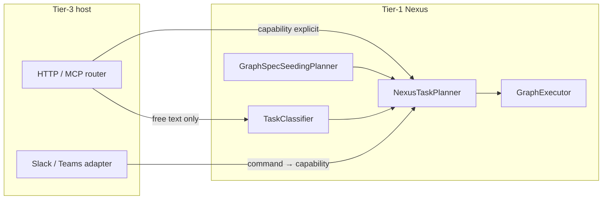
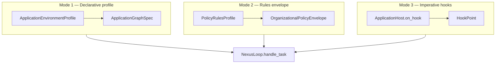

# Tier-3 Application Environment, Sandbox, and Shadow Workspace

**Status:** Canonical architecture (domain pair 1:1) · **Application authoring gate:** §24–§50 + APP-CON-* / APP-EVOL-* / APP-OPS-* (host environments)  
**Hub:** [`intergrax_runtime_architecture.md`](../intergrax_runtime_architecture.md)  
**Plan (1:1):** [`plan/TIER3_APPLICATION_ENVIRONMENT.md`](../plan/TIER3_APPLICATION_ENVIRONMENT.md)  
**Target:** [`IDEAL_HARNESS_AI_ARCHITECTURE.md`](../guides/IDEAL_HARNESS_AI_ARCHITECTURE.md) §26  
**Audit layers:** 3, 28  
**Audit instruction:** [`audit/TIER3_APPLICATION_ENVIRONMENT.md`](../audit/TIER3_APPLICATION_ENVIRONMENT.md)  
**Agent cooperation:** [`AGENT_CONTRACTS_AND_ASSEMBLY.md`](AGENT_CONTRACTS_AND_ASSEMBLY.md) §30 · §35–§39 · [`guides/AGENT_CREATION_GUIDE.md`](../guides/AGENT_CREATION_GUIDE.md) Appendix H · AC  
**Last updated:** 2026-06-17 — **Full Harness LC** (re-validates H-APP + APP-CON/EVOL/OPS)

---

## Table of contents

| § | Topic |
|---|--------|
| [§20](#20-shadow-workspace-model) | Shadow workspace model |
| [§21](#21-sandbox-model) | Sandbox model |
| [§22](#22-application-environment-profile-canonical) | **ApplicationEnvironmentProfile** (composition root) |
| [§22.6](#226-hierarchical-profile-bundles) | **Hierarchical profile bundles** (P1-ARCH-01 · ADR-APP-003) |
| [§23](#23-application-interaction-postures-canonical) | Interaction postures, routing, scenarios |
| [§24](#24-application-contract) | **Application contract** (`ApplicationManifest`) |
| [§25](#25-application-interface-run_task-facade-harnessapplication-and-applicationhost) | **Application interface:** `run_task()`, `HarnessApplication`, `ApplicationHost` |
| [§26](#26-application-execution-result) | **Application execution result** (Plane A) |
| [§27](#27-application-roster-and-registry-assembly) | Roster and registry assembly |
| [§28](#28-application-environment-architecture-app) | **Application Environment Architecture (APP)** |
| [§29](#29-tier-and-terminology-canon-application) | Tier and terminology canon (application) |
| [§30](#30-three-environment-control-modes) | Three environment control modes |
| [§31](#31-author-facing-harnessapplication-facade) | Author-facing `HarnessApplication` facade |
| [§32](#32-applicationhost-hook-surface) | **ApplicationHost hook surface** |
| [§33](#33-dual-observability-application-and-agent-planes) | Dual observability planes |
| [§34](#34-per-agent-binding-from-the-application) | Per-agent binding from application |
| [§35](#35-use-case-catalog-application--environment) | Use-case catalog |
| [§36](#36-final-architecture-application--agent--harness-cooperation) | Final architecture synthesis |
| [§37](#37-pre-implementation-operational-contracts-app-con) | Pre-implementation operational contracts |
| [§38](#38-execution-responsibility-stack-l4-application) | Execution stack: L4 application |
| [§39](#39-organizational-policy-envelope--virtual-workforce) | Organizational policy envelope |
| [§40](#40-production-reliability-safety-and-release-gates-tier-3) | Production reliability and release gates |
| [§41](#41-composition-primitives-separation-matrix) | Composition primitives separation |
| [§42](#42-applicationenvironmentstate-typed-host-state) | **ApplicationEnvironmentState** |
| [§43](#43-budget-reactions-and-token-governance) | Budget reactions and token governance |
| [§44](#44-scenario-test-matrix-tier-3) | Scenario test matrix |
| [§45](#45-checklist-for-new-application-implementation) | New application checklist |
| [§46](#46-production-readiness-acceptance-criteria) | Production readiness acceptance criteria |
| [§47](#47-developer-mental-model) | **Developer mental model** (recipes) |
| [§48](#48-application-artifacts) | **Application artifacts** |
| [§49](#49-runtime-evolution-and-governance) | **Runtime evolution and governance** |
| [§50](#50-platform-operations-canon) | **Platform operations canon** (capability graph, registry, ownership, health) |
| [§51](#51-cross-document-consistency-freeze) | **Cross-document consistency** (freeze audit) |

---

---
# 20. Shadow Workspace Model

An isolated temporary filesystem workspace for work **without mutating the main product environment** — Cursor-like experiments, document drafts, simulated workflows.

**Code:** `intergrax/runtime/workspace/shadow_workspace.py` · `ShadowWorkspaceManager` · wired via `wire_shadow_workspace()` · profile `ShadowWorkspaceProfile`.

## 20.1 Lifecycle (normative)

```text
1. CREATE     ShadowWorkspaceManager.open_or_create(tenant_id, task_id)
              → ShadowWorkspace.create under profile.root (default build/shadow_workspaces)
2. MOUNT      Task metadata: shadow_workspace_id, shadow_workspace=true
              Agent/tool paths resolve under workspace.root (policy-bound)
3. EXECUTE    write/read, list artifacts, optional snapshots
4. CAPTURE    list_artifacts() → ShadowArtifact[]; manifest → WorkspaceArtifactRef (§48)
5. ROLLBACK   snapshot restore when author requests undo path
6. CLEANUP    cleanup_for_task(tenant_id, task_id) or cleanup(workspace_id)
7. RETENTION  ShadowWorkspaceProfile.retention_hours; ops job may purge stale dirs
8. AUDIT      artifacts in trace + RunArtifactBundle on ApplicationRunSummary
```

## 20.2 Isolation and permissions

| Concern | Mechanism |
|---------|-----------|
| Tenant boundary | Path: `{root}/{tenant_id}/{task_id}/{workspace_id}/` |
| Tool access | Only via harness tools with shadow path policy — no raw host FS in agents |
| Execution mode | STRICT hosts deny writes outside workspace root |
| Provenance | `tenant_id`, `task_id`, `workspace_id` on every artifact |

## 20.3 Integration with application state

When active, `ApplicationEnvironmentState.shadow_workspace` (§42) carries `workspace_id`, paths — updated by host hooks on `AFTER_TASK_INTAKE` or framework seed (**Done** APP-CON-3 lifecycle middleware).

## 20.4 Use cases

Code experiments · document analysis · temporary transforms · simulated business workflows · vendor research · legal review drafts · onboarding simulations.

## 20.5 Anti-patterns

| ID | Anti-pattern | Correct |
|----|--------------|---------|
| SHW-AP-01 | Product writes directly to repo working tree | Shadow workspace + capture |
| SHW-AP-02 | No cleanup after task | `cleanup_for_task` in factory lifespan / finalization hook |
| SHW-AP-03 | Secrets in workspace without classification | `ArtifactSecurityClass` §48 |

---


---

# 21. Sandbox Model

A **controlled execution environment** for risky computation — code exec, browser automation, generated scripts.

**Code:** `intergrax/runtime/sandbox/session.py` · `SandboxSessionManager` · `wire_sandbox_sessions()` · `SandboxProfile.enable_exec_tool` adds `sandbox.exec` to tool profile.

## 21.1 Lifecycle (normative)

```text
1. CREATE     SandboxSessionManager.open_or_create(tenant_id, task_id)
2. MOUNT      sandbox session id on Task metadata; ToolRuntime routes sandbox.exec here
3. EXECUTE    isolated subprocess/container per session implementation
4. CAPTURE    stdout/files → SandboxArtifactRef (§48)
5. ROLLBACK   dispose session without promoting outputs (failed validation)
6. CLEANUP    cleanup_for_task / cleanup(session_id) — mandatory on task terminal
7. RETENTION  shorter than shadow (default delete_on_task_complete=true, 24h max)
8. AUDIT      tool trace + sandbox artifact bundle on Plane A
```

## 21.2 Isolation levels

| Level | Description | When |
|-------|-------------|------|
| **L1 — FS session** | Directory-isolated session root | Default lab/product |
| **L2 — Tool gateway** | Policy + injection defense on args | STRICT + `ApplicationSecurityProfile` |
| **L3 — Product required** | `product_requires_sandbox()` true | Product hosts with side-effect tool prefixes |

## 21.3 Permissions and observability

- Interruptible via Nexus task cancel + session dispose
- Observable: tool events, session id in trace, optional `BEFORE_TOOL_CALL` hook audit
- Permission-controlled: `ToolProfile` + policy — agents never open shell directly

## 21.4 Integration with ApplicationRunSummary

`RunArtifactBundle.sandbox[]` linked from task metadata key `run_artifact_bundle.v1` (§48) — rollup for operators.

---

---

# 22. Application Environment Profile (canonical)

Tier-3 hosts are configured through **`ApplicationEnvironmentProfile`** — a typed umbrella aggregating every harness control plane slice.

**Evolution (P1-ARCH-01):** the flat surface in §22.1 remains the **current wire-compatible shape** (`spec_version` `1.x`). Canonical target structure is **seven nested bundles** under the same root — §22.6 · [`ADR-APP-003`](../adr/entries/2026-06-17/ADR-APP-003.md) · plan `APP-EVOL-8`.

## 22.1 Profile composition (flat surface — current)

| Sub-profile | Purpose |
|-------------|---------|
| `IdentityProfile` | API key, tenant_required, service identities |
| `PolicyRulesProfile` + `ExecutionMode` | Declarative rules + STRICT/BALANCED/EXPLORATORY |
| `ApplicationSecurityProfile` | Per-app V-SEC toggles |
| `GuardrailProfile` | Vendor LLM guardrail scan toggles (`enabled`, `scan_input/output/tool_calls`, Colang/Bedrock options) |
| `ToolProfile` / `SkillProfile` | Allowed catalogs |
| `IntegrationProfile` | Provider stack — includes optional `llm_guardrail` slug (§47) |
| `LLMProfile` / `ModalityProfile` | Model and modality posture |
| `LLMRoutingProfile` (M-LLM-X.9) | Dynamic model routing — built-in + custom `LLMRoutingRule` classes · [ADR-LLM-003](../adr/entries/2026-06-19/ADR-LLM-003.md) |
| `ContextProfile` / `MemoryProfile` / `ContextDecisionProfile` | Assembly and stores |
| `PromptProfile` | YAML prompt catalog path |
| `ReliabilityProfile` | Idempotency, circuit breaker, checkpoint |
| `ObservabilityProfile` | Trace, OTEL, metrics plugins |
| `CostProfile` / `ComplianceProfile` | Budgets, reactions, compliance domain class |
| `EvaluationProfile` / `CriticProfile` / `AdaptiveProfile` | Eval, PEV, L4 adaptive loop (when enabled) |
| `ReasoningProfile` | Planner/classifier LLM ids, denied models |
| `OrchestrationProfile` | Planner/classifier kinds, delegation depth, long-running |
| `ScalingProfile` / `HostDeploymentProfile` | ECP cross-ref, deploy posture |
| `GovernanceProfile` / `IntegrationGovernanceProfile` | Platform cadence + marketplace **feature flags** (not ownership — see §51) |
| `ApplicationGraphSpec` | Declarative multi-agent topology |
| `OrganizationalPolicyEnvelope` | Virtual org / workforce simulation (§39) |
| `ShadowWorkspaceProfile` / `SandboxProfile` | Isolated workspaces (§20–§21) |
| `ApplicationFeatures` | Lab vs product surface toggles |
| `domain_policy_fragments` | Product-specific `RuntimePolicyBundle` slices |

**Contract:** `intergrax/applications/contracts/environment_profile.py`

## 22.2 Unified wiring entrypoints

```text
ApplicationManifest
    -> build ApplicationBuildContext
    -> wire_application_environment(ctx, profile)
    -> materialize_runtime_config(request, harness_ctx, env)
    -> build_nexus_loop_from_environment(...)
    -> UnifiedTaskRunner (§41)
```

| Module | Role |
|--------|------|
| `applications/_shared/environment_wiring.py` | Single wiring entry |
| `runtime_config_bridge.py` | Environment → `RuntimeConfig` |
| `nexus_factory.py` | NexusLoop from profile |
| `identity_wiring.py` | Host auth from `IdentityProfile` |
| `shadow_wiring.py` / `sandbox_wiring.py` | Isolated execution |
| `guardrail_wiring.py` / `guardrail_runtime_bridge.py` | `llm_guardrail` slug → `LlmGuardrailMiddleware` (M.12) |
| `*_runtime_bridge.py` | Domain bridges (RAG, memory, policy, …) |

## 22.3 Interaction surfaces (intake)

Normalized intake MUST converge on the same Nexus lifecycle:

| Surface | Typical entry |
|---------|---------------|
| HTTP API | `applications/*/host/` FastAPI routers |
| CLI | `intergrax` CLI / lab commands |
| Slack / Teams | `POST /v1/interactions/intake` + adapters |
| Webhook / worker | `applications/_shared/task_intake.py`, queue consumers |
| Scheduler | `intergrax/queueing/` + long-running task API |

See [`ORCHESTRATION.md`](ORCHESTRATION.md) §48 for `TaskEnvelope` normalization.

## 22.4 Host migration rule

Every Tier-3 application MUST:

1. declare `environment` on `ApplicationManifest`,
2. wire through `wire_application_environment` (no ad-hoc `getattr` profile access),
3. keep business logic in Tier-2 agents — hosts only compose harness.

**Plan:** [`plan/TIER3_APPLICATION_ENVIRONMENT.md`](../plan/TIER3_APPLICATION_ENVIRONMENT.md) — Phase H-APP **Done** · [Architecture fidelity matrix](../plan/TIER3_APPLICATION_ENVIRONMENT.md#architecture-fidelity-matrix--20-51) for §20–§51 implementation status.

## 22.5 Related documents

| Document | Relationship |
|----------|--------------|
| [`applications/USAGE.md`](../../applications/USAGE.md) | Authoring Tier-3 hosts |
| [`UNIFIED_EXECUTION_RUNTIME.md`](UNIFIED_EXECUTION_RUNTIME.md) | UAEP + policy runtime |
| [`ORCHESTRATION.md`](ORCHESTRATION.md) | Nexus orchestration fields on profile |
| [`ELASTIC_CAPACITY_AND_SCALING.md`](ELASTIC_CAPACITY_AND_SCALING.md) | `ScalingProfile`, deploy/Helm vs ECP provisioning |
| [`guides/HARNESS_ENVIRONMENT.md`](../guides/HARNESS_ENVIRONMENT.md) | Lab stack operator guide |
| [`ADR-APP-003`](../adr/entries/2026-06-17/ADR-APP-003.md) | Hierarchical profile bundles decision |

## 22.6 Hierarchical profile bundles

**Status:** Architecture **accepted** · **M1 Done** · **M2 Done** · **M3 Done** (`APP-EVOL-8.6`) · **ADR:** [`ADR-APP-003`](../adr/entries/2026-06-17/ADR-APP-003.md) · **Code:** `intergrax/applications/contracts/environment_profile/`

### 22.6.1 Problem

`ApplicationEnvironmentProfile` aggregates **43+ top-level fields** across **25+ sub-profile types**. Each new harness domain adds another top-level slot. Sub-profiles are typed and wired independently, but the **flat namespace** increases author cognitive load, preset duplication, and merge-surface growth (`runtime_config_bridge`, `merge_environment`, `EnvironmentSnapshot` digests).

**Invariant preserved:** **`ApplicationEnvironmentProfile` remains the single composition root** (`APP-INV-06`). Bundles are **grouping containers only** — not new runtime primitives and not replacements for §41 separation (`ApplicationGraphSpec`, `OrganizationalPolicyEnvelope`, `AgentBinding`, `ApplicationHost`).

### 22.6.2 Bundle model

Seven nested containers replace the flat top-level namespace. Sub-profile **types are unchanged** — only nesting and authoring presets evolve.

```text
ApplicationEnvironmentProfile                    # composition root (unchanged name)
├── meta: HostMeta                               # host identity posture
├── security: SecurityEnvelope                   # trust boundary + org rules
├── capabilities: CapabilityBundle               # Tier-0 catalogs (tools/skills/LLM/…)
├── cognition: CognitionBundle                   # reasoning, orchestration, critic, eval
├── governance: GovernanceBundle                 # reliability, observability, cost, ops
├── topology: TopologyBundle                     # declarative multi-agent graph
├── isolation: IsolationBundle                   # shadow workspace + sandbox
└── extensions: EnvironmentExtensions            # domain_policy_fragments escape hatch
```

| Bundle | Nested fields (maps from §22.1 flat field) | Answers |
|--------|---------------------------------------------|---------|
| **`HostMeta`** | `profile_id`, `spec_version`, `application_profile`, `execution_mode`, `features` | *What kind of host is this?* |
| **`SecurityEnvelope`** | `identity_profile` → `identity`; `security_profile` → `application_security`; `guardrail_profile` → `guardrails`; `policy_rules`; `compliance_profile` → `compliance`; `organizational_policy` | *Who may run, under which rules?* |
| **`CapabilityBundle`** | `integration_profile` → `integrations`; `tool_profile` → `tools`; `skill_profile` → `skills`; `llm_profile` → `llm`; `modality_profile` → `modality`; `prompt_profile` → `prompt`; `context_profile` → `context`; `memory_profile` → `memory`; `tool_selection_*` + `tool_invocation_*` + `max_parallel_tool_calls` → `tool_selection` / `tool_invocation` | *What catalogs and context planes are enabled?* |
| **`CognitionBundle`** | `reasoning_profile` → `reasoning`; `orchestration_profile` → `orchestration`; `critic_profile` → `critic`; `adaptive_profile` → `adaptive`; `evaluation_profile` → `evaluation`; `codecraft_profile` → `codecraft` | *How does the harness plan, verify, and adapt?* |
| **`GovernanceBundle`** | `reliability_profile` → `reliability`; `observability_profile` → `observability`; `cost_profile` → `cost`; `scaling_profile` → `scaling`; `governance_profile` → `platform`; `capability_governance_profile` → `capability`; `agent_governance_profile` → `agent`; `integration_governance_profile` → `integration_marketplace`; `host_deployment_profile` → `deployment`; `execution_boundary_export_profile` → `boundary_export` | *SRE, budget, deploy, platform ops* |
| **`TopologyBundle`** | `graph_spec` | *Declarative agent topology (§41 primitive)* |
| **`IsolationBundle`** | `shadow_workspace`; `sandbox` | *Safe experiment / code-exec isolation (§20–§21)* |
| **`EnvironmentExtensions`** | `domain_policy_fragments` | *Product-specific `RuntimePolicyBundle` slices — typed escape hatch* |

**Field count:** 43 flat top-level → **7 containers** (+ unchanged sub-profile schemas inside bundles).

### 22.6.3 Authoring (target)

Reusable capability presets MAY be shared across hosts:

```python
LEGAL_CAPABILITIES = CapabilityBundle.product(
    tools=..., skills=..., llm=..., context=..., memory=...,
)

ApplicationEnvironmentProfile(
    meta=HostMeta.product(profile_id="legal.prod"),
    security=SecurityEnvelope.strict(org=legal_org_envelope()),
    capabilities=LEGAL_CAPABILITIES,
    cognition=CognitionBundle.regulated(),
    governance=GovernanceBundle.production_slo(),
    topology=TopologyBundle(graph_spec=legal_graph_spec()),
    isolation=IsolationBundle.product(),
)
```

Effective per-agent config remains **`EnvironmentProfile ⊕ AgentBinding.merge_environment()`** — bundles do not replace `AgentBinding` slices (§34 · ACP §30).

### 22.6.4 Migration phases (normative)

| Phase | Scope | `spec_version` | Breaking? |
|-------|-------|----------------|-----------|
| **M1 — Grouping** | Nested bundle models on root; flat accessors as `@property` shims; flat JSON deserializer | `1.x` | **No** |
| **M2 — Authoring** | Per-bundle presets (`CapabilityBundle.lab()`, `GovernanceBundle.strict()`, shared packs) | `1.x` | **No** |
| **M3 — Canonical nested** | Nested JSON/schema canonical; flat top-level deprecated | `2.0.0` | **Yes** (major) |

**Wiring unchanged in M1–M2:** `wire_application_environment`, `materialize_runtime_config`, and `build_nexus_loop_from_environment` continue to read profile slices through shims or bundle paths — no Nexus fork.

**Snapshot / diff:** `EnvironmentSnapshot` and `ApplicationEnvironmentDiff` MUST digest bundle-normalized canonical form so nested and flat serializations produce identical fingerprints when semantically equal (`APP-EVOL-8.3`).

### 22.6.5 Anti-patterns

| ID | Anti-pattern | Correct |
|----|--------------|---------|
| BND-AP-01 | Multiple composition roots (`HostProfile` + `CapabilityProfile` as peers) | Single `ApplicationEnvironmentProfile` root with nested bundles |
| BND-AP-02 | Bundle contains business logic or wiring | Bundles are Pydantic data only; wiring stays in `applications/_shared/*_wiring.py` |
| BND-AP-03 | Merge `OrganizationalPolicyEnvelope` into `CapabilityBundle` | Org envelope stays in `SecurityEnvelope` (§41 primitive) |
| BND-AP-04 | Per-agent overrides in host bundles | Use `AgentBinding` + `merge_environment()` |

**Plan:** [`plan/TIER3_APPLICATION_ENVIRONMENT.md`](../plan/TIER3_APPLICATION_ENVIRONMENT.md) — `APP-EVOL-8` · `P1-ARCH-01`.

---

# 23. Application interaction postures (canonical)

Tier-3 hosts are **composition shells** around a long-lived Nexus runtime. The same platform mechanisms support different **interaction postures** — selected through `ApplicationEnvironmentProfile` and host wiring, not separate runtime forks.

> **Master configuration canon (all postures × agent counts × strategies × CFG cases):** [`ORCHESTRATION.md`](ORCHESTRATION.md) **§56** — start there for product design and implementation planning. This section is the **Tier-3 host summary** only.

**Runtime narrative:** [`NEXUS_EXECUTION_FLOW.md`](NEXUS_EXECUTION_FLOW.md) §3.1 · **Patterns:** [`ORCHESTRATION.md`](ORCHESTRATION.md) §50–§56 · **Routing modes:** [`REASONING_AND_COGNITION.md`](REASONING_AND_COGNITION.md) §9.4.

## 23.1 Posture catalog

| Posture | Process model | Task trigger | Typical surfaces |
|---------|---------------|--------------|------------------|
| **Reactive on-demand** | Host daemon idle until work arrives | User/API message per `Task` | HTTP `POST …/run`, MCP, Slack/Teams intake (`execute=true`) |
| **Always-on daemon** | Host process runs continuously | Same as reactive; plus health/index maintenance | Local HTTP/MCP, tray, Socket Mode Slack |
| **Scheduled / queued background** | Worker consumes queue or cron | Scheduler, file watcher, webhook enqueue | `intergrax/queueing/`, long-running API, `message_bus` |
| **Hybrid** | Daemon + background workers | Mix of interactive and async tasks | LKW-style: index in background, Q&A on demand |

**Invariant:** every posture normalizes work to **`Task` → `UnifiedTaskRunner` → `NexusLoop.handle_task()`**. Surfaces differ; Nexus lifecycle does not.

```text
Bootstrap (once per host process):
  ApplicationManifest + ApplicationEnvironmentProfile
    → wire_application_environment()
    → build_application_registry()
    → build_nexus_loop_from_environment()
    → UnifiedTaskRunner(nexus_loop)

Per unit of work (any posture):
  Surface adapter → Task → UnifiedTaskRunner.run_task() → NexusLoop
```

Agents are **not** separate OS processes. They are registry entries invoked **on demand** per graph node. The host may be always-on; agents remain passive until Nexus schedules a node.

## 23.2 Profile knobs per posture

| Concern | Profile / module | Reactive | Always-on daemon | Background / hybrid |
|---------|------------------|----------|------------------|---------------------|
| HTTP/MCP serving | Host `factory.py` | Optional | **Required** | Often required for ops |
| Interaction intake | `wire_interaction_intake_service` | Optional | Recommended | Optional (notify only) |
| Long-running + checkpoint | `OrchestrationProfile.long_running_enabled`, `ReliabilityProfile` | Off unless large jobs | On for reports / HITL | **On** for batch pipelines |
| Queue consumer | `applications/_shared/task_intake.py`, `queueing/` | Rare | Optional | **Required** for async |
| Notification on complete | `NotificationAdapter`, integration webhooks | Optional | Recommended | **Required** for user alert |
| Shadow / sandbox | `ShadowWorkspaceProfile`, `SandboxProfile` | Per task | Per task | Per task |
| Execution mode | `ExecutionMode` STRICT / BALANCED / EXPLORATORY | Product choice | Product choice | Often BALANCED for batch |

**Rule:** posture is a **product wiring decision** on Tier-3. Tier-1 Nexus semantics are identical across postures.

## 23.3 Routing responsibility matrix (who sets `capability`)

Free-text user input does **not** implicitly select agents. Routing is explicit at one of four layers:

| Layer | Owner | When to use | Sets on `Task` |
|-------|-------|-------------|----------------|
| **L1 — Client / API contract** | Tier-3 router or API schema | Client knows intent (`dispute.scenario`, `research.pipeline`) | `context.capability`, optional `agent_id` |
| **L2 — Interaction adapter** | `InteractionIntakeService` + surface adapter | Slack slash command, structured lab JSON | `message` + mapped `capability` from command prefix |
| **L3 — Tier-1 classifier** | `TaskClassifier` / `classifier_kind=rules` / future LLM (`COG-3.*`) | Chat UX with raw user text | `classification` + inferred `capability` when rules/LLM enabled |
| **L4 — Declarative graph** | `ApplicationGraphSpec` + `GraphSpecSeedingPlanner` | Multi-agent product with fixed topology | Plan steps from `graph_spec`; task `capability` selects pipeline entry |



**Authoring defaults (harness):**

| UX pattern | Minimum routing layer | Do not rely on |
|------------|----------------------|----------------|
| Typed REST API | L1 | Classifier alone |
| Slash command (`/dsw analyze …`) | L2 | Default agent fallback |
| Free-text chatbot | L3 when available; until then L1 shim in host | `SINGLE_AGENT_DEFAULT` |
| Fixed multi-agent product | L1 `*.pipeline` capability + L4 `graph_spec` | `MULTI_AGENT` classification alone |

See [`REASONING_AND_COGNITION.md`](REASONING_AND_COGNITION.md) §9.4 for classification vs orchestration mode.

## 23.4 Multi-agent topology configuration (Tier-3)

Three **supported** ways to run multiple agents with different roles. Pick one per product; do not mix ad-hoc.

| Mode | Mechanism | Agent relationship | Classification typical |
|------|-----------|-------------------|------------------------|
| **A — Declarative graph** | `ApplicationGraphSpec` on profile | `depends_on` / `delegates_to` edges | `CAPABILITY_ROUTED` or `MULTI_AGENT` after seed |
| **B — Pipeline capability** | `Task.context.capability = "<app>.pipeline"` | Sequential steps from `TaskPlanner` or graph seed | Product-specific; see §23.5 |
| **C — Engine planner** | `OrchestrationProfile.planner_kind = engine` | LLM emits `NexusPlan` steps | Any; validated against registry |

**Not a multi-agent mode:** `TaskClassification.MULTI_AGENT` when several agents declare the **same** capability — that is **competitive routing**, not a cross-role pipeline. See [`REASONING_AND_COGNITION.md`](REASONING_AND_COGNITION.md) §9.4.

### Graph spec seeding rules (runtime today)

`GraphSpecSeedingPlanner` wraps the inner planner when `environment.graph_spec.nodes` is non-empty:

```text
should_seed_plan_from_graph_spec(task) is True
  AND graph_spec.nodes non-empty
    → application_graph_spec_to_nexus_plan(spec, task)
  ELSE
    → inner.planner.plan(task, registry)   # TaskPlanner or EngineBackedNexusPlanner
```

`should_seed_plan_from_graph_spec` is true when the task has **no pre-assigned** `task.runtime.orchestration.plan_id`.

**Authoring conventions:**

| Convention | Purpose |
|------------|---------|
| `capability = "<product>.pipeline"` | Signals multi-step product intent to operators and traces |
| `graph_spec` with `DEPENDS_ON` chain | Sequential cooperation (A → B → C) |
| Parallel branches | Multiple nodes with no `depends_on` between them → same topological batch |
| `DELEGATES_TO` edges | Hierarchical delegation per [ADR-FLOW-001](../adr/entries/2026-06-07/ADR-FLOW-001.md) |
| `merge_strategy` on profile | How parallel/sequential summaries compose for the user |

**Implemented (H-APP-DOC.2 / ORCH-CONFIG.2):** `ApplicationGraphSpec.trigger_capabilities` — seed graph only when task capability matches (avoids graph override on single-agent routes). See ADR-FLOW-004.

## 23.5 Scenario recipes (configuration templates)

Copy a row when designing a new Tier-3 host. Adjust profile fields; do not fork Nexus.

| Product scenario | Posture | Agents | Coordination pattern | Key profile settings |
|------------------|---------|--------|----------------------|----------------------|
| Single Q&A agent | Reactive | 1 | Orchestrator–worker (1 node) | `planner_kind=default`, explicit `capability` on API |
| Chat with raw user text | Reactive / daemon | 1+ | Classifier → single or pipeline | `classifier_kind=rules` + `intent_routes` (ORCH-CONFIG.1); `engine` when COG-3 done |
| Research: search then summarize | Reactive | 2 | Sequential pipeline | `capability=research.pipeline` **or** `graph_spec` chain |
| Dispute prep: intake → analyze → strategy → scenario | Reactive / hybrid | 4 | Sequential graph | `graph_spec` + `*.pipeline` token · product example §6.3 (DSW) · harness: CFG-06 sim |
| Parallel doc review shards | Background + reactive | N | Peer-to-peer (parallel batch) | `graph_spec` without inter-node `depends_on`; `max_parallel_nodes` |
| PM delegates to specialists | Reactive | 3+ | Hierarchical | `DELEGATES_TO` edges + `max_delegation_depth` |
| Quality gate before answer | Reactive | 2+ | Evaluator-loop | CVL hooks + `CoordinationPattern.EVALUATOR_LOOP` |
| Index corpus continuously | Hybrid daemon | 1 | Scheduled single-agent | Queue + `dispute.intake`; notify on batch complete |
| Legal draft review + HITL | Reactive | 1–2 | Supervisor–worker | `require_human_approval`, shadow workspace, L2 critic |

**Cross-ref:** pattern names and parallelism rules — [`ORCHESTRATION.md`](ORCHESTRATION.md) §50–§51; completion policy — [`CRITIC_VERIFICATION.md`](CRITIC_VERIFICATION.md).

## 23.6 Host checklist (every Tier-3 application)

1. Declare `environment` on `ApplicationManifest` with intended posture (§23.2).
2. Wire **all** chosen surfaces to `UnifiedTaskRunner` (HTTP, MCP, interaction intake if needed).
3. For multi-agent: set `graph_spec` **or** document `*.pipeline` capability **or** enable `planner_kind=engine`.
4. Set `merge_strategy` for multi-node UX (`concat` vs `last_wins` vs `structured_json`).
5. Set `execution_mode=strict` in production; wire critic profile for high-risk capabilities.
6. Do not implement business orchestration loops in Tier-2 — use Nexus graph + UAEP steps.

**Plan:** [`plan/TIER3_APPLICATION_ENVIRONMENT.md`](../plan/TIER3_APPLICATION_ENVIRONMENT.md) Phase H-APP-DOC · platform cases **ORCH-CONFIG** in [`plan/ORCHESTRATION.md`](../plan/ORCHESTRATION.md).

## 23.7 Tier-3 host wiring audit (as-built 2026-06-09)

**Canonical full matrix:** [`ORCHESTRATION.md`](ORCHESTRATION.md) §59.2.

Phase H-APP (**Done**) delivered unified `ApplicationEnvironmentProfile` and `wire_application_environment` — but **surface mounting** (task control API, scheduler, interactions, reliability enricher) is **per-host optional**. Only `lab_application` is the reference for full platform runtime capabilities (ORCH-6, FLOW-CTL, REL-ADV HTTP).

| Gap ID | Symptom | Affected hosts | Plan |
|--------|---------|----------------|------|
| T3-GAP-01 | No `mount_harness_task_routes` | LKW, dispute_sim, assistant (opt-in) | **Closed** on lab/legal/research/poc · H-APP-WIRING.1 **Done** |
| T3-GAP-02 | Reliability task enricher not in factory | LKW, dispute_sim, assistant | **Closed** on reference hosts · runner `task_enricher` |
| T3-GAP-03 | Long-running scheduler not wired | LKW (opt-in) | **Closed** on reference hosts (legal/research/poc/dispute_sim/lab default on) |
| T3-GAP-04 | Interaction intake not enabled | LKW (opt-in) | **Closed** on reference hosts incl. dispute_sim (`INCLUDE_INTERACTIONS` default on) |
| T3-GAP-05 | Queue worker not scaffold-default | Most hosts | **Partial** — opt-in `INCLUDE_QUEUE_WORKER` (legal + scaffold); dispute_sim optional |
| T3-GAP-06 | Hybrid daemon (CFG-14) — LKW incomplete | `local_workspace_application` | **Deferred** §6.3 · doc in LKW `ARCHITECTURE.md` |

**Authoring rule:** do not claim CFG-13/14/20 production-ready on a host until §23.7 gaps for that host are closed or explicitly documented in product `ARCHITECTURE.md`.

## 23.8 Technical debt — docs vs implementation (post closeout 2026-06-09)

| Topic | Architecture says | Current code | Debt |
|-------|-------------------|--------------|------|
| Unified task control API | ORCH §57, FLOW §28, REL §35 | `mount_harness_task_routes` on reference hosts + scaffold | LKW opt-in only |
| Async batch | ORCH-6 `run_async` | Reference hosts mount `/v1/tasks/run-async` | Durable queue opt-in (`INCLUDE_QUEUE_WORKER`) |
| Strict multi-agent | `with_reference_host_platform_defaults()` | legal/research/poc/dispute_sim presets | Product E1+E3 demo **Deferred** §6.3 |
| Free-text routing | `classifier_kind=rules` | Reference host presets enable rules classifier | LKW/assistant per-host opt-in |
| Scaffold parity | H-APP-DOC.4 + H-APP-WIRING Done | Scaffold defaults: `INCLUDE_TASK_CONTROL`, interactions, scheduler | Queue worker still opt-in |

**Paydown:** [Phase H-APP-WIRING](../plan/TIER3_APPLICATION_ENVIRONMENT.md) (Band 2aw) **Done** (2026-06-09). Default queue: §6.1 gate maintenance only.

---

# 24. Application Contract

Every deployable Tier-3 environment MUST declare a clear **application contract** via **`ApplicationManifest`**.

The contract MUST be easy for humans and LLMs to understand — symmetric to **`AgentContract`** (ACP §12).

## 24.1 Minimum required fields

```text
ApplicationManifest:
    app_id                    # stable slug, e.g. legal_application
    name
    description
    version
    profile                   # LAB | PRODUCT
    route_prefix              # HTTP API prefix, e.g. /v1/legal
    env_prefix                # MY_APP_* environment variables
    default_host / default_port
    default_capability        # optional API default routing token
    agents: list[AgentBinding]
    integration_profile       # default IntegrationProfile when environment omits
    features: ApplicationFeatures
    environment: ApplicationEnvironmentProfile | null
```

**Contract module:** `intergrax/applications/contracts/manifest.py`

## 24.2 AgentBinding (roster entry contract)

Each roster entry binds a **capability** to a **concrete Tier-2 implementation**:

```text
AgentBinding:
    agent_type | import_path          # Tier-2 class (prefer AgentBinding.mount)
    factory | factory_path             # Tier-3 factory for configured agents
    capabilities: list[str]            # routing tokens (normative for Nexus)
    contract_id: str | null
    enabled / default / requires_uaep
    memory_scope_override
    rag_collection_override
    tool_allowlist_extra / tool_denylist
    org_role_id                        # virtual workforce role (§39)
    budget_slice                       # per-agent limits (ACP §25.5 · §34)
    config: dict                       # lightweight factory options — not secrets
```

**Routing invariant (normative — §37.4):** Nexus selects agents by **`capabilities[]`** match on `Task.required_capability` — **not** by Python class name in the task payload. Class name appears **only** in `AgentBinding` for wiring.

## 24.3 Application vs product vs agent

| Artifact | Tier | Contract | Lives in |
|----------|------|----------|----------|
| **Agent** | 2 | `AgentContract` | `agents/<slug>/` |
| **Application environment** | 3 | `ApplicationManifest` + `ApplicationEnvironmentProfile` | `applications/<app>/` |
| **Product** | — | Business offering | product `ARCHITECTURE.md` + Tier-3 host |

**Rule:** business logic and cognitive steps live in Tier-2 agents. Tier-3 hosts **compose** harness capabilities — they do not implement domain `on_next_step` loops (ACP §38).

---

# 25. Application Interface: `run_task()` Facade, `HarnessApplication`, and `ApplicationHost`

Symmetric to ACP §13 — application authors have **one task entry** and **optional hook surface** for dynamic behavior.

## 25.1 Primary author API — `UnifiedTaskRunner.run_task()`

**Authors SHOULD route all surfaces through one task lifecycle:**

```text
result = await task_runner.run_task(task: Task) -> TaskResult
```

**Internal engine:** surface adapter → normalize `Task` → `NexusLoop.handle_task()` → graph execution → `TaskResult` + `ApplicationRunSummary` (§26). Authors MUST NOT reimplement Nexus orchestration in host `factory.py`.

| Responsibility | Owner |
|----------------|-------|
| HTTP/MCP/Slack intake, auth, tenant | **Tier-3 host** |
| `Task` construction (`capability`, metadata, identity) | **Tier-3 host** |
| Classifier, planner, graph execution | **NexusLoop** (Tier-1) |
| Agent cognitive steps | **Tier-2** (`Agent.run()` / `on_next_step`) |
| Policy, trace, budgets on agent steps | **HarnessKernel** (ACP §38) |
| Dynamic environment reactions at Nexus boundaries | **ApplicationHost** hooks (§32) |

## 25.2 Fluent builder — `HarnessApplication`

**Authors MAY use the lab/product fluent facade** (DX-2.1):

```text
app = (
    HarnessApplication("my_lab")
    .agents(EchoAgent, ResearchAgent)
    .integrations(IntegrationProfile.lab_stack())
    .environment(ApplicationEnvironmentProfile.lab_defaults())
    .graph(AgentGraph()...)
    .mode(ExecutionMode.BALANCED)
    .hooks(MyApplicationHost())
    .build_fastapi()
)
```

| Method | Role |
|--------|------|
| `.agents(*types)` | Roster via `AgentBinding.mount` |
| `.environment(profile)` | Full `ApplicationEnvironmentProfile` |
| `.graph(AgentGraph)` | Declarative topology → `graph_spec` |
| `.hooks(ApplicationHost)` | Imperative Nexus hook overrides (§32) |
| `.from_files(env_path, agents_path)` | YAML round-trip (DX-5.3) |
| `.build_runtime()` / `.build_fastapi()` | `HarnessHostRuntime` assembly |

**Module:** `intergrax/harness/app.py`

## 25.3 Imperative API — `ApplicationHost.on_hook()`

**Authors SHOULD implement dynamic environment behavior through typed hooks** — not private orchestration loops:

```text
class MyApplicationHost:
    def on_hook(self, point: HookPoint, context: HookContext) -> HookResult | None:
        ...
```

Return **`None`** to defer to default Nexus/harness behavior. Return **`HookResult`** to allow, block, modify, or escalate (§32).

**Protocol:** `intergrax/harness/application_host.py`  
**Bridge:** `intergrax/harness/hooks.py` → `ApplicationHostMiddleware`  
**Wiring:** `apply_application_host_wiring(nexus, host)` in `applications/_shared/application_host_wiring.py` (**Done** APP-CON-1)

### 25.3.1 Hooks are event reactions — not a cognitive loop (normative)

Tier-3 applications **do not** receive `on_next_orchestration_step()` or any session step loop analogous to `Agent.on_next_step()`. That would duplicate **NexusLoop** (L3/L4 confusion) and bypass graph policy, parallel caps, and Plane A trace.

| Mechanism | What it controls | Loop? |
|-----------|------------------|-------|
| **`ApplicationEnvironmentProfile`** | Catalogs, modes, orchestration knobs | No — declarative |
| **`ApplicationGraphSpec`** | Multi-agent **topology** (who runs in what order) | No — declarative plan seed |
| **`OrganizationalPolicyEnvelope`** | Org-wide **rules** and channels | No — declarative + policy engine |
| **`AgentBinding`** | Per-agent runtime **slices** at merge | No — declarative |
| **`ApplicationHost.on_hook`** | **Event reactions** at Nexus boundaries | No — callback per `HookPoint` |
| **`Agent.on_next_step`** | Domain **cognition** per agent iteration | Yes — agent-only (ACP §32) |

**Full environment customization** combines: profile + graph spec + policy envelope + roster + hooks + shadow/sandbox — **never** a private orchestration `while` loop in Tier-3.

## 25.4 Framework surface (Tier-3 vs author visibility)

| Surface | Who implements | Author visibility |
|---------|----------------|-------------------|
| `ApplicationManifest` / `build_*_manifest()` | Product author | **Public — composition contract** |
| `ApplicationEnvironmentProfile` | Product author | **Public — governance envelope** |
| `wire_application_environment()` | Framework | **Public — call once at bootstrap** |
| `build_harness_host_runtime()` | Framework | **Public — preferred factory path** |
| `HarnessApplication` | Framework facade | **Public — lab/quickstart** |
| `ApplicationHost.on_hook` | Subclass / Protocol impl | **Public — environment reactions** |
| `host/factory.py` FastAPI lifespan | Product author | **Public — surface mounting only** |
| `NexusLoop.handle_task` | Tier-1 | **Internal — do not call from product business code** |
| `Agent.run` / `on_next_step` | Tier-2 | **Internal to application** — invoked by Nexus per graph node |

## 25.5 Legacy and forbidden paths

| Path | Status |
|------|--------|
| Ad-hoc `NexusLoop(...)` construction in every host | **Deprecated** — use `build_nexus_loop_from_environment` |
| `getattr(manifest, "field")` in wiring | **Forbidden** — typed manifest access (H-APP.0.3) |
| Business orchestration `while` loops in Tier-3 | **Forbidden** — use `graph_spec` + Nexus |
| Import `agents.*` business rules into `factory.py` | **Forbidden** — roster + profile only |
| `Application.on_next_orchestration_step()` as public API | **Rejected** — duplicates NexusLoop (APP-INV-03) |

**Guide:** [`applications/USAGE.md`](../../applications/USAGE.md) · [`guides/EXTENSION_AUTHOR_GUIDE.md`](../guides/EXTENSION_AUTHOR_GUIDE.md) §0 · **Plan:** Phase **H-APP** + **H-APP-CON**.

---

# 26. Application Execution Result

Every completed `Task` SHOULD expose a structured **application-level** result for operators and product UIs.

## 26.1 Plane A — `ApplicationRunSummary`

**Canonical type:** `intergrax/contracts/application_run_summary.py`

```text
ApplicationRunSummary:
    schema_version: application_run_summary.v1
    task_id
    graph_id
    terminal_status
    agent_invocations: list[AgentInvocationSummary]
    total_agents / total_steps / total_llm_tokens
    completed_at
    metadata:
        run_artifact_bundle.v1 → RunArtifactBundle §48
```

Populated by `build_application_run_summary()` on Nexus task completion (ACP-OBS-2). Attached to `TaskResult.metadata` under `application_run_summary.v1`.

## 26.2 Plane B — per-agent traces

Each graph node produces **`AgentRunResult`** + **`AgentRunTrace`** (ACP §31). Application authors inspect Plane B in pytest via direct `agent.run()` or from task metadata when wired.

| Plane | Audience | Primary type |
|-------|----------|--------------|
| **A — Application** | Ops, product dashboards, multi-agent UX | `ApplicationRunSummary` |
| **B — Agent** | Agent authors, eval, debug | `AgentRunTrace` |

**Rule:** Tier-3 hosts MUST NOT parse raw trace DB tables for product UX when `ApplicationRunSummary` is available on `TaskResult`.

## 26.3 TaskResult contract (host-facing)

```text
TaskResult:
    task_id
    status
    output / structured_output
    metadata:
        application_run_summary.v1  → ApplicationRunSummary
        trace_id / graph_id         → join keys for observability spine
```

---

# 27. Application Roster and Registry Assembly

Nexus discovers agents through **`AgentRegistry`** built at host bootstrap — symmetric to ACP §15.

## 27.1 Bootstrap pipeline

```text
ApplicationManifest
    → ApplicationBuildContext.for_manifest(...)
    → build_application_registry(manifest, ctx, builders=...)
    → AgentRegistry (enabled bindings only)
    → NexusLoop(registry, ...)
```

**Module:** `intergrax/applications/_shared/wiring.py`

## 27.2 Factory resolution order

For each `AgentBinding`, instance creation order (normative):

```text
1. binding.factory(ctx, binding)     # typed callable
2. builders[agent_type]              # type-keyed map
3. factory_path import               # scaffold/YAML only
4. agent_type()                      # zero-arg constructor
```

## 27.3 Conformance checks

| Check | Module | When |
|-------|--------|------|
| Manifest round-trip | `test_manifest_conformance.py` | CI gate |
| Tool/skill ⊆ environment | `EnvironmentSkillToolConsistencyCheck` | `wire_application_environment` |
| Capability routing | `check_capability_routing.py` | CI gate (ACP-CON-6) |
| Agent registry bypass | `check_agent_registry_bypass.py` | Tier-2 must not import integrations directly |

## 27.4 Registry anti-patterns

| ID | Anti-pattern | Correct |
|----|--------------|---------|
| REG-AP-01 | Hardcoded agent class in NexusLoop subclass | `AgentBinding` + capability token |
| REG-AP-02 | Dynamic `importlib` roster without manifest | `ApplicationManifest` + typed builders |
| REG-AP-03 | Disabled agent still in routing defaults | `enabled=False` on binding |
| REG-AP-04 | Same capability on two defaults | Exactly one `default=True` per capability class |

---

# 28. Application Environment Architecture (APP)

Define the **Application Environment Architecture (APP)** — how Tier-3 environments are authored, how they bind Tier-2 agents, and how **environment control** (declarative, rules, hooks) interacts with Nexus **without** collapsing the harness into application classes.

APP answers:

> **How does a developer build a production-grade application environment quickly — business app, lab, virtual organization, or simulation — while staying inside harness governance?**

APP does **not** replace Nexus, redefine tiers, or introduce a second agent execution engine.

## 28.1 Design invariants

| ID | Invariant |
|----|-----------|
| **APP-INV-01** | Nexus remains Agent OS — global orchestration, policy, HITL, multi-agent graph (ACP-INV-01) |
| **APP-INV-02** | All work normalizes to **`Task` → `UnifiedTaskRunner` → `NexusLoop`** — no surface-specific runtime forks |
| **APP-INV-03** | Business logic lives in **Tier-2 agents** — Tier-3 hosts MUST NOT implement domain cognitive loops |
| **APP-INV-04** | Configuration: **manifest + profile in Tier-3**; **contract + `on_next_step` in Tier-2** (ACP-INV-06) |
| **APP-INV-05** | Side effects at environment boundary via **hooks, policy, webhooks** — never ad-hoc vendor SDKs in `factory.py` |
| **APP-INV-06** | **`ApplicationEnvironmentProfile`** is the single composition root for harness slices (IDEAL §17) — nested bundles §22.6 group fields; they do not create additional roots |
| **APP-INV-07** | Imperative control via **`ApplicationHost` + `HookPoint`** — not duplicate `NexusLoop` subclasses |
| **APP-INV-08** | Organizational policy is **Tier-3 data** — agents consume merged context; hosts declare envelope (§39) |
| **APP-INV-09** | **`run_task()` / HTTP `/run`** is the application entry; **`Agent.run()`** is the agent entry (ACP-INV-09) |
| **APP-INV-10** | Every enabled profile slice MUST wire through `*_runtime_bridge.py` — no orphan Pydantic fields |

## 28.2 Rejected architecture (audit outcome)

```text
REJECTED: Application class with on_next_orchestration_step() mirroring Agent.on_next_step
REJECTED: Tier-3 host implementing multi-agent pipelines in factory.py while-loops
REJECTED: Application owns AgentRegistry, PolicyEngine, or GraphExecutor directly
REJECTED: Separate runtime fork per product posture (reactive vs daemon vs batch)
REJECTED: Embedding org compliance rules only in agent source (§39 · ACP-INV-12)
REJECTED: New 22nd domain pair duplicating ORCHESTRATION + UAEP inside "Application Contracts"
```

**Rationale:** The harness is the product; applications are **replaceable compositions** — same as agents (ACP §21.3).

---

# 29. Tier and Terminology Canon (Application)

Complements ACP §22 — application author vocabulary.

## 29.1 Four tiers — application lens

| Term | Tier | One-sentence definition |
|------|------|-------------------------|
| **Application** | 3 | Deployable **environment**: manifest, profile, roster, surfaces, deploy artifacts |
| **Application host** | 3 | Running process: `factory.py` + FastAPI/MCP + `HarnessHostRuntime` |
| **HarnessApplication** | 3 | Fluent builder facade for lab/quickstart (DX-2) |
| **ApplicationEnvironmentProfile** | 3 | Typed umbrella of all harness control-plane slices |
| **Agent** | 2 | Domain worker invoked **per graph node** — not a host OS process |
| **Nexus** | 1 | Agent OS executing `Task` graphs |
| **Harness (practical)** | 0+1+3 | Platform catalogs + Nexus + application wiring |

## 29.2 Runnable application instance

A **single host process** materializes:

```text
ApplicationManifest + ApplicationEnvironmentProfile
    → wire_application_environment()
    → build_application_registry()
    → build_harness_host_runtime()
        → NexusLoop + UnifiedTaskRunner + observability/reliability wiring
    → mount HTTP / MCP / intake / scheduler surfaces
```

Per **unit of work**:

```text
Surface → Task → UnifiedTaskRunner.run_task() → NexusLoop.handle_task()
    → graph node → Agent.run() → on_next_step loop (ACP §38)
    → ApplicationRunSummary on completion
```

## 29.3 Responsibility matrix (application author)

| Concern | Tier-3 Application | Tier-1 Nexus | Tier-2 Agent |
|---------|-------------------|--------------|--------------|
| User intake / chat API | **owner** | — | — |
| `Task` construction | **owner** | consumes | — |
| Capability on `Task` | **owner** (L1–L4 §23.3) | routes | declares |
| `ApplicationGraphSpec` | **owner** | seeds plan | — |
| `OrganizationalPolicyEnvelope` | **owner** | enforces | consumes §39 |
| Multi-agent orchestration | configures | **owner** | participates |
| Domain reasoning | — | — | **owner** (`on_next_step`) |
| Tool/skill catalogs enabled | **owner** (profiles) | executes | uses via gateways |
| HTTP auth / tenant | **owner** (`IdentityProfile`) | — | — |
| Trace / cost dashboards | **owner** (profiles) | emits | Plane B trace |

---

# 30. Three Environment Control Modes

Symmetric to ACP §23 (three cognition planes) — applications choose **how** environment behavior is expressed.



| Mode | Question | Primary types | When to use |
|------|----------|---------------|-------------|
| **1 — Declarative** | What catalogs, graph, posture, execution mode? | `ApplicationEnvironmentProfile`, `ApplicationGraphSpec` | Default — 80% of products |
| **2 — Rules** | What org/regulatory constraints apply to all agents? | `PolicyRulesProfile`, `OrganizationalPolicyEnvelope` | Compliance, virtual workforce, simulation |
| **3 — Imperative hooks** | What dynamic reaction at Nexus boundary? | `ApplicationHost`, `HookResult`, `HookPoint` | Budget exceed, custom intake, block agent selection |

**Anti-pattern APP-AP-01:** Implementing Mode 1 topology inside Mode 3 hooks — use `graph_spec` instead.

**Anti-pattern APP-AP-02:** Encoding Mode 2 rules only in agent `if org == "acme"` — use envelope (§39).

**Canon:** posture and routing detail — §23; agent consumption — ACP §30.

---

# 31. Author-facing `HarnessApplication` Facade

Symmetric to ACP §29 (author-facing `run()` facade).

## 31.1 Target author workflow

```text
1. Scaffold: python -m intergrax.scaffold new-application <slug> [--profile lab|product]
2. Declare ApplicationManifest + ApplicationEnvironmentProfile (manifest.py, environment_profile.py)
3. Register AgentBinding roster with factories
4. Optional: subclass ApplicationHost for HookPoint reactions
5. Wire factory.py via build_harness_host_runtime() — mount surfaces
6. Test: pytest applications/<app>/ tests + Task → ApplicationRunSummary assertion
7. Prod: same profile, different organizational envelope per tenant (UC-11)
```

## 31.2 Progressive disclosure (DX-0.4)

| Stage | Command | Delivers |
|-------|---------|----------|
| Minimal | `new-stack --minimal` | Harness-only factory |
| Standard | `new-application` / `new-stack` | Docker, MCP, deploy doc |
| Promote | `scaffold expand <slug>` | Upgrade minimal → standard |

## 31.3 Host factory responsibilities (normative)

`applications/<app>/host/factory.py` MAY:

- load settings from env (`Settings.from_env()`)
- call `build_harness_host_runtime(manifest, environment, ...)`
- mount HTTP routes, MCP, interaction intake, task control, scheduler
- attach product-specific middleware **only** when profile-driven wiring insufficient

`factory.py` MUST NOT:

- implement agent business steps
- construct `NexusLoop` with ad-hoc kwargs bypassing profile
- import vendor SDKs for domain operations

---

# 32. ApplicationHost Hook Surface

Symmetric to ACP §32 (`on_next_step`) — **event-driven** environment control, not a cognitive step loop.

## 32.0 Author readability and typed contracts (normative)

Application hook authors MUST be able to answer from code alone:

1. At which **HookPoint** does this reaction run?
2. What **HookAction** can be returned (`allow` | `block` | `modify` | `escalate`)?
3. Does the hook defer to default behavior (`return None`)?

Untyped dict mutation of Nexus internals from Tier-3 is **not supported** — use `HookResult.modified_payload` only where documented for the hook point.

## 32.1 Hook lifecycle matrix — allowed actions per HookPoint

Normative for application authors. **`BLOCK`** stops the pipeline at that boundary. **`MODIFY`** shallow-merges `modified_payload` into `HookContext.runtime_state` (see `HookRegistry`). **`ESCALATE`** routes to HITL / escalation coordinator where wired. **`ALLOW`** / `None` defers to harness defaults.

| HookPoint | BLOCK | MODIFY | ESCALATE | Typical application use |
|-----------|-------|--------|----------|-------------------------|
| `BEFORE_TASK_INTAKE` | Yes | Yes — metadata keys | Rare | Reject intake, seed `app_env_state.v1` |
| `AFTER_TASK_INTAKE` | No | Yes | No | Audit labels, attach org/scenario ids |
| `BEFORE_CLASSIFICATION` | Yes | Yes — classifier hints in `runtime_state` | No | Force capability hint |
| `AFTER_CLASSIFICATION` | No | Yes | No | Log routing decision |
| `BEFORE_PLANNING` | Yes | Yes | No | Block disallowed planner kinds |
| `AFTER_PLANNING` | No | Yes | No | Validate plan against product policy |
| `BEFORE_AGENT_SELECTION` | **Yes** | Limited | No | Deny agent id / org role mismatch |
| `AFTER_AGENT_SELECTION` | No | Yes | No | Trace roster resolution |
| `BEFORE_CONTEXT_BUILD` | Yes | Yes | No | Strip forbidden metadata |
| `BEFORE_LLM_INFERENCE` / `AFTER_*` | Yes | Yes — guardrail payloads | Rare | Product-specific LLM gates (prefer profile) |
| `BEFORE_TOOL_CALL` / `AFTER_TOOL_CALL` | Yes | Rare | No | Prefer `ToolProfile` + policy rules |
| `BEFORE_HUMAN_APPROVAL` | Yes | Yes | **Yes** | Custom HITL templates |
| `AFTER_HUMAN_APPROVAL` | No | Yes | No | Resume notifications |
| `BEFORE_FINALIZATION` | Yes | Yes | No | Business outcome webhook prep |
| `AFTER_FINALIZATION` | No | Yes | No | Product analytics emit |
| `BEFORE_TRACE_PERSIST` | Yes | Yes — redaction labels | No | Prefer `ObservabilityProfile` |
| `BEFORE_MEMORY_WRITE` | Yes | Yes | No | Tenant scope enforcement backup |

**Rules:**

- ApplicationHost hooks MUST NOT invoke tools or LLM directly — schedule work by returning `BLOCK` / `ESCALATE` or by setting hints for Nexus/agents.
- Prefer **Mode 1–2** (profile, envelope) over hooks when behavior is static across tasks.
- `MODIFY` is **not** a substitute for `ApplicationGraphSpec` topology changes mid-flight.

Full enum: `intergrax/runtime/hooks/hook_point.py`

## 32.2 HookResult contract

```text
HookResult:
    action: allow | block | modify | escalate
    modified_payload: dict | null
    reason: str | null
```

## 32.3 Example — block agent on policy

```python
from intergrax.harness.application_host import ApplicationHost
from intergrax.runtime.hooks.hook_context import HookContext, HookResult, HookAction
from intergrax.runtime.hooks.hook_point import HookPoint


class StrictOrgHost:
    def on_hook(self, point: HookPoint, context: HookContext) -> HookResult | None:
        if point != HookPoint.BEFORE_AGENT_SELECTION:
            return None
        denied = context.runtime_state.get("org_denied_agents", [])
        if context.agent_id in denied:
            return HookResult(action=HookAction.BLOCK, reason="org_policy_denied")
        return None
```

## 32.4 ApplicationHost vs Agent.on_next_step

| Dimension | `ApplicationHost.on_hook` | `Agent.on_next_step` |
|-----------|---------------------------|----------------------|
| Layer | L4 environment boundary | L2 domain cognition |
| Frequency | Nexus lifecycle events | Every agent iteration |
| May invoke tools? | **No** — use agents | **Yes** via gateways |
| May select next graph agent? | **Indirect** — block/modify selection | **No** — use `StepOutcome` handoff/delegate |
| Replaces NexusLoop? | **No** | **No** |

## 32.5 Code map

| Component | Status | Path |
|-----------|--------|------|
| `ApplicationHost` Protocol | **Done** DX-5.1 | `intergrax/harness/application_host.py` |
| `ApplicationHostMiddleware` | **Done** DX-5.2 | `intergrax/harness/hooks.py` |
| `apply_application_host_wiring` | **Done** APP-CON-1 | `applications/_shared/application_host_wiring.py` |
| Wired in `build_harness_host_runtime` | **Done** APP-CON-1 | `application_host=` parameter |
| `HarnessApplication.hooks()` | **Done** APP-CON-1 | passes host to `build_harness_host_runtime` |
| `ApplicationEnvironmentState` | **Done** APP-CON-2 | `applications/contracts/environment_state.py` |
| `merge_host_into_pipeline` | **Done** DX-5.2 | alternative composition helper |

## 32.6 Hook runtime contract — ordering, conflicts, determinism

Normative execution semantics for **all** middleware + `ApplicationHost` hooks on `MiddlewarePipeline`.

### 32.6.1 Invocation order

```text
run_before(HookPoint):
  1. Middleware sorted by priority ASC (lower runs first)
  2. First non-ALLOW short-circuits the chain
  3. HookRegistry handlers for the point (if middleware all ALLOW)

run_after(HookPoint):
  1. HookRegistry first
  2. Middleware priority DESC
  3. First non-ALLOW short-circuits
```

**Default priorities (reference):** `TraceEmittingMiddleware` < V-SEC middleware (50) ≈ `ApplicationHostMiddleware` (50). When priorities tie, registration order applies — **product hosts SHOULD use distinct priorities** for multiple custom middleware (APP-CON-3).

### 32.6.2 Multiple ApplicationHost implementations

Tier-3 exposes **one** `ApplicationHost` per process. Multiple concerns (org policy, billing, intake) SHOULD be composed **inside** a single class (delegation pattern) — not multiple competing hosts.

### 32.6.3 Conflict resolution

| Situation | Rule |
|-----------|------|
| **BLOCK** vs MODIFY | **BLOCK wins** — pipeline stops; MODIFY not applied |
| Two MODIFY payloads | Shallow merge in order; later middleware wins on key collision |
| BLOCK + reason | Propagated to task/agent failure surface; audited in trace |
| ESCALATE | Routes to HITL coordinator when wired; else treated as BLOCK (safe default) |

### 32.6.4 MODIFY merge semantics

- Merge target: `HookContext.runtime_state` only — **not** Task body, graph, or agent state
- Model: shallow `dict.update` per hook registry (`hook_registry.py`)
- Authors MUST namespace under `app_env_state.v1` for typed state (§42)
- Forbidden: MODIFY of `capability`, `agent_id` unless hook point documents it (agent selection only)

### 32.6.5 Sync vs async, timeout, retry, idempotency

| Topic | Normative target | Status |
|-------|------------------|--------|
| **Sync vs async** | `on_hook` is **sync** today; MAY return coroutine in APP-CON-3 — until then no `await` in host | **Done** sync |
| **Timeout** | Host hook max wall time (e.g. 250ms prod) — exceed → `hook_timeout` + trace | **Done** APP-CON-5 |
| **Retry** | Hooks are **not** retried — side effects must be idempotent | **Normative** |
| **Idempotency** | Same `HookPoint` + same `task_id` + same phase: host MUST tolerate duplicate calls | **Author responsibility** |
| **Error handling** | Uncaught exception → BLOCK with `hook_error`; task fails closed in STRICT | **Done** APP-CON-5 |
| **Audit events** | Every non-ALLOW emits `RuntimeEvent` with `hook_name`, `point`, `action`, `reason` | **Done** APP-CON-5 |

### 32.6.6 Determinism rule

Hooks MAY influence **whether** and **how** work proceeds — they MUST NOT replace Nexus planning or agent cognition. Deterministic replay (lab) requires hooks be pure functions of `(HookPoint, HookContext)` or record decisions in `app_env_state.v1`.

---

# 33. Dual Observability: Application and Agent Planes

Symmetric to ACP §31 — application authors operate primarily on **Plane A**.

## 33.1 Plane definitions

| Plane | Name | Primary consumer | Canonical type |
|-------|------|------------------|----------------|
| **A** | Application orchestration | Tier-3 ops, product UX | `ApplicationRunSummary` |
| **B** | Agent session | Tier-2 authors, eval | `AgentRunTrace` |

## 33.2 Join keys

```text
TaskResult.metadata["application_run_summary.v1"]  →  Plane A rollup
TaskResult.metadata["trace_id"]                    →  OBS spine
AgentRunResult.trace                               →  Plane B per node
```

## 33.3 Application observability profile

Configure via `ObservabilityProfile` on environment — wired by `wire_application_observability()`:

- trace DB path / in-memory lab mode
- runtime events store
- optional product debug surface (`ApplicationFeatures.debug_surface`)
- OTEL / metrics plugins when enabled

**Rule:** Tier-3 MUST NOT fork parallel trace pipelines — use harness spine ([`OBSERVABILITY.md`](OBSERVABILITY.md)).

## 33.4 Compliance rollups (org environments)

When `OrganizationalPolicyEnvelope` is set, Plane A dashboards SHOULD include policy verdict rollups from Plane B steps (ACP §39.5 · ACP-ORG-4).

---

# 34. Per-Agent Binding from the Application

Application-side canon for ACP §30 — what Tier-3 declares so agents receive merged environment at `Agent.run()`.

## 34.1 Merge pipeline (agent run time)

```text
ApplicationEnvironmentProfile
    + AgentBinding slices (tools, memory, RAG, budget, org_role_id)
    + Task metadata (tenant, user, matter_id, scenario hints)
        → merge_environment() → EffectiveAgentRunEnvironment
            → AgentStepContext.merged_environment
```

**Agent-side detail:** ACP §30 · `intergrax/agents/run_environment.py`

## 34.2 Binding slices (normative)

| Slice field | Affects at run time |
|-------------|---------------------|
| `tool_allowlist_extra` / `tool_denylist` | Merged tool policy |
| `memory_scope_override` | Namespace on `memory_view` |
| `rag_collection_override` | RAG gateway collection |
| `org_role_id` | `OrganizationalPolicyContext` overlay §39 |
| `budget_slice` | Per-agent token/cost caps §25.5 |

## 34.3 Application token budgets

| Tier | Owns |
|------|------|
| **Tier-3** | `CostProfile`, `AgentBinding.budget_slice`, `BudgetReactionProfile`, notification slugs |
| **Tier-1** | Metering, hard caps, `BUDGET_*` events |
| **Tier-2** | Read usage; soft strategy only |

**Cross-plan:** ACP-TOK-2 · ACP-TOK-3 (**Done**) — kernel enforcement + host reaction hooks. Tier-3 configures; harness enforces (ACP §25.5).

## 34.4 Anti-patterns (application binding)

| ID | Anti-pattern | Correct |
|----|--------------|---------|
| BIND-AP-01 | Secrets in `AgentBinding.config` | Integration profile + secret store |
| BIND-AP-02 | Per-agent env vars read in agent code | `merge_environment` + metadata |
| BIND-AP-03 | Different roster per surface without manifest | Single manifest; feature flags on binding `enabled` |
| BIND-AP-04 | Org rules in agent `if` statements | `OrganizationalPolicyEnvelope` §39 |

---

# 35. Use-Case Catalog (Application + Environment)

Canonical scenarios — all supported by the **same** harness path; differ in profile + roster + postures.

| ID | Scenario | Entry | Environment pattern | Agent pattern |
|----|----------|-------|---------------------|---------------|
| **UC-A1** | Single-agent Q&A API | HTTP `POST …/run` | Reactive, explicit `capability` | One agent, one node |
| **UC-A2** | Multi-agent pipeline | `Task` + `*.pipeline` or `graph_spec` | `ApplicationGraphSpec` chain | One class per role |
| **UC-A3** | Always-on lab daemon | `HarnessApplication.serve()` | Daemon + debug surface | Passive until scheduled |
| **UC-A4** | Slack / Teams product | Interaction intake | `wire_interaction_intake_service` | L2 routing §23.3 |
| **UC-A5** | Background batch / index | Queue worker | Hybrid + `ReliabilityProfile` | Single or sharded agents |
| **UC-A6** | Legal / research prod host | Product manifest | `ExecutionMode.STRICT` + critic | Contract-declared capabilities |
| **UC-A7** | Virtual organization / workforce | `Task` + org profile | `OrganizationalPolicyEnvelope` + `org_role_id` | Same agent classes, different envelope |
| **UC-A8** | Business simulation | `dispute_sim` / scenario graph | `graph_spec` + scenario bindings | Multi-role pipeline |
| **UC-A9** | Eval / CI harness host | Batch `run_task` | Fixture `ApplicationEnvironmentProfile` | Assert `ApplicationRunSummary` |
| **UC-A10** | YAML-driven lab | `HarnessApplication.from_files()` | DX-5.3 env.yaml | Roster from agents.yaml |

**Flexibility rule:** UC-A2 and UC-A7 stack — graph topology + org envelope are independent dimensions.

**Scenario recipes (concrete):** §23.5.

---

# 36. Final Architecture: Application + Agent + Harness Cooperation

Synthesis of §24–§35 and ACP §36.

## 36.1 Responsibility split (final)

| Layer | Delivers to author | Delivers to ops |
|-------|-------------------|-----------------|
| **Tier-3 Application** | Manifest, profile, roster, hooks, surfaces | `ApplicationRunSummary`, deploy artifacts |
| **Tier-2 Agent** | `on_next_step`, cognitive patterns | `AgentRunResult` + `AgentRunTrace` |
| **Tier-1 Nexus** | Transparent when using `Task` | Task orchestration, checkpoints |
| **Tier-0 Harness** | Catalogs via profiles | Policy, observability spine |

## 36.2 Speed + flexibility guarantees

| Guarantee | Mechanism |
|-----------|-----------|
| Fast new product host | `scaffold new-application` + `HarnessApplication` |
| No policy in agent source | `ApplicationEnvironmentProfile` + envelope §39 |
| Same agents, multiple products | Different manifests; shared `agents/` |
| Multi-agent without host code | `ApplicationGraphSpec` |
| Dynamic environment rules | `ApplicationHost` hooks §32 |
| Virtual org without agent forks | `OrganizationalPolicyEnvelope` §39 |
| Prod strictness | `ExecutionMode.STRICT` + APP-PROD gates §40 |

## 36.3 Implementation alignment (2026-06-11)

| Component | Status | Remaining |
|-----------|--------|-----------|
| `ApplicationEnvironmentProfile` | **Done** H-APP | — |
| Unified wiring | **Done** H-APP | — |
| `HarnessApplication` facade | **Done** DX-2 | — |
| `ApplicationHost` → Nexus pipeline | **Done** APP-CON-1 | — |
| `ApplicationEnvironmentState` | **Done** APP-CON-2 | Kernel seeding on intake (optional) |
| `ApplicationRunSummary` | **Done** ACP-OBS-2 | — |
| Org envelope | **Done** ACP-ORG-1..2 | Enforcement depth ACP-ORG-3 |
| Budget reactions (hard cap + notify) | **Done** | ACP-TOK-* · APP-PROD-7 §43 |
| APP production scoreboard | **Done** | APP-PROD-1..9 · `check_application_production_gates.py` |

---

# 37. Pre-Implementation Operational Contracts (APP-CON)

Normative before shipping new Tier-3 hosts.

## 37.1 Hard task contract

Hosts MUST normalize all surfaces to **`Task`** with:

```text
Task:
    task_id
    message / structured input
    context.capability          # routing token when known (§23.3)
    metadata                    # tenant, user, org, scenario, product fields
    runtime identity fields     # from IdentityProfile resolution
```

Pydantic models for manifest and profile: **`extra=forbid`**.

## 37.2 Capability routing (enforcement)

```text
Task.required_capability / context.capability
    → Nexus classifier/planner
    → AgentRegistry.query(capabilities)
    → AgentBinding selects implementation class
```

CI: `check_capability_routing.py` (shared with ACP-CON-6).

## 37.3 Identity and tenant (summary)

Full canon: ACP §30.9 · `IdentityProfile`

- Interactive tasks: `tenant_id` + `user_id` required when `tenant_required=True`
- Org background jobs: `principal_type=org_system`, `memory_scope=org`
- Host MUST wire `wire_application_identity()` before run endpoints

## 37.4 Host security model

| Guard | STRICT behavior |
|-------|-----------------|
| Tool catalog | Intersection of `ToolProfile` + binding slices |
| Integration access | `IntegrationProfile` only — agents use tools |
| Secrets | Never in manifest `config` or committed `.env` |
| Auth on `/run` | `IdentityProfile.require_api_key` or product auth middleware |

## 37.5 Terminal status vocabulary

Application-level outcomes SHOULD map to controlled task statuses — align with `AgentRunStatus` and Nexus task finisher enums. Free-text terminal reasons on product APIs SHOULD be mapped to enums at the HTTP boundary.

---

# 38. Execution Responsibility Stack (L4 Application)

Symmetric to ACP §38 — **application author mental model**.

## 38.1 Four layers (normative)

```text
┌─────────────────────────────────────────────────────────────────────────┐
│ L4  Application host + surfaces                                         │
│     • intake → Task • manifest/profile • hooks • auth • deploy          │
│     • ApplicationRunSummary (Plane A)                                     │
│     DOES NOT: agent on_next_step • tool gateway • cognitive planning     │
└───────────────────────────────┬─────────────────────────────────────────┘
                                │ UnifiedTaskRunner.run_task()
┌───────────────────────────────▼─────────────────────────────────────────┐
│ L3  NexusLoop.handle_task() — Agent OS orchestration                    │
│     • classifier • planner • graph • HITL • task checkpoints            │
│     DOES NOT: replace agent cognitive loop                                │
└───────────────────────────────┬─────────────────────────────────────────┘
                                │ per graph node
┌───────────────────────────────▼─────────────────────────────────────────┐
│ L2  Agent.run() + on_next_step() — see ACP §38                          │
└───────────────────────────────┬─────────────────────────────────────────┘
                                │
┌───────────────────────────────▼─────────────────────────────────────────┐
│ L1  HarnessKernel.execute_step() — see ACP §38                          │
└─────────────────────────────────────────────────────────────────────────┘
```

## 38.2 Decision ownership (application author)

| Question | Owner |
|----------|-------|
| Which surfaces does this product expose? | **Tier-3 host** |
| What is on the manifest roster? | **Tier-3 author** |
| What harness slices are enabled? | **`ApplicationEnvironmentProfile`** |
| Which agent handles this capability? | **Nexus** + registry (Tier-3 declares roster) |
| What is the multi-agent topology? | **`graph_spec`** or planner (Tier-3 config) |
| What org rules apply? | **`OrganizationalPolicyEnvelope`** §39 |
| Dynamic block/modify at intake? | **`ApplicationHost`** hook §32 |
| What does the agent think next? | **Agent `on_next_step`** — not Tier-3 |

---

# 39. Organizational Policy Envelope & Virtual Workforce

**Canonical home (Tier-3).** Agent consumption and kernel enforcement: ACP §39.

**Goal:** Tier-3 environment simulates an **organization** — procedures, channels, playbooks — constraining virtual employee agents **without** forking agent code.

## 39.1 Concept

```text
OrganizationalPolicyEnvelope (Tier-3)
    → merge_environment() → OrganizationalPolicyContext
        → all agents in roster during run
            → HarnessKernel policy phases enforce channel/tool/scenario rules
```

## 39.2 Contract

`intergrax/applications/contracts/org_policy.py`:

```text
OrganizationalPolicyEnvelope:
    organization_id, display_name, execution_mode
    policy_rules, guardrails
    sop_catalog_path, scenario_bindings, rag_playbook_collection
    channel_policy, tool_policy_overlay, communication_rules
    compliance_profile_id, observability_labels
```

Attach via `ApplicationEnvironmentProfile.organizational_policy`.

## 39.3 Virtual workforce roster

```text
AgentBinding(
    agent_id="cs_agent",
    org_role_id="customer_service_rep",
    capabilities=["support.respond"],
)
```

Same agent class across bank / retail / lab — **different envelope per deployment**.

## 39.4 Enforcement stack

| Phase | Owner |
|-------|-------|
| Intake metadata (org, scenario) | Tier-3 host |
| `merge_environment` | Harness |
| `on_next_step` domain intent | Agent |
| Policy pre/post, tool deny, guardrails | `HarnessKernel` |

## 39.5 Measurement

`PolicyVerdictRecord` on agent steps → roll up to `ApplicationRunSummary` compliance fields (ACP §39.5 · ACP-ORG-4).

## 39.6 Anti-patterns

| ID | Anti-pattern | Correct |
|----|--------------|---------|
| ORG-AP-01 | `if org == "acme"` in agent | `ChannelPolicy` on envelope |
| ORG-AP-02 | Rules only in system prompt | `PolicyRulesProfile` + verdicts |
| ORG-AP-03 | Per-agent duplicate compliance | Shared envelope |

**Preset:** `ApplicationEnvironmentProfile.lab_org_virtual_workforce_defaults()`.

---

# 40. Production Reliability, Safety, and Release Gates (Tier-3)

Symmetric to ACP §40 — **host environments** that run mutating workloads.

## 40.1 Host readiness dimensions

| Dimension | Requirement |
|-----------|-------------|
| Wiring | `build_harness_host_runtime` — no ad-hoc Nexus |
| Identity | `IdentityProfile` enforced on prod routes |
| Execution mode | `STRICT` in production |
| Reliability | `ReliabilityProfile` + task checkpoints when long-running |
| Observability | `ObservabilityProfile` + trace persistence |
| Roster | `EnvironmentSkillToolConsistencyCheck` passes |
| Org / compliance | Envelope + eval golden scenarios when UC-A7 |
| Deploy triad | Docker + `BUILD_AND_DEPLOY.md` + gate test |

## 40.2 APP-PROD gate register

| ID | Deliverable | Status | Command / test |
|----|-------------|--------|----------------|
| APP-PROD-1 | `check_application_production_gates.py` — no ad-hoc Nexus, harness runtime | **Done** | `python scripts/check_application_production_gates.py` |
| APP-PROD-2 | Reference hosts use `build_harness_host_runtime` exclusively | **Done** | H-APP-WIRING |
| APP-PROD-3 | `ApplicationHost` mounted when provided | **Done** | `test_application_host_wiring` |
| APP-PROD-4 | Manifest conformance | **Done** | `test_manifest_conformance` |
| APP-PROD-5 | Deploy triad | **Done** | `test_application_deploy_triad` |
| APP-PROD-6 | `check_environment_state_usage` — hooks use `app_env_state.v1` | **Done** | `check_environment_state_usage.py` · `environment_state_usage_wiring.py` |
| APP-PROD-7 | `check_budget_enforcement` — COST profile on STRICT product hosts | **Done** | `check_budget_enforcement.py` |
| APP-PROD-8 | `check_workspace_cleanup` — factory lifespan cleanup hooks | **Done** | `check_workspace_cleanup.py` · `build_factory_lifespans` |
| APP-PROD-9 | Gate test + CI `gate-governance-tier` | **Done** | `test_check_application_production_gates.py` |

## 40.3 Mutating product checklist

Before claiming production-ready for mutating hosts:

1. `execution_mode=strict`
2. `ReliabilityProfile` idempotency + checkpoints enabled
3. `CriticProfile` for high-risk capabilities
4. `mount_harness_task_routes` when HITL/long-running required
5. Product `ARCHITECTURE.md` documents §23.7 gaps closed or deferred

---

# 41. Composition Primitives — Separation Matrix

Normative mapping — **do not conflate** these primitives:

| Primitive | Layer | Answers | Does NOT |
|-----------|-------|---------|----------|
| **`ApplicationGraphSpec`** | Declarative topology | Which agents, in what order/parallelism, edges | Domain reasoning; per-step tool calls |
| **`ApplicationHost`** | Imperative reactions | Dynamic block/modify/escalate at Nexus events | Replace graph; cognitive loop |
| **`OrganizationalPolicyEnvelope`** | Rules / simulation | Org-wide channels, playbooks, tool denies | Per-agent factory logic |
| **`AgentBinding`** | Per-agent wiring | Implementation class, capability, slices, `org_role_id` | Orchestration topology |
| **`ApplicationEnvironmentProfile`** | Harness slices (§22.1 flat · §22.6 bundles) | Catalogs, modes, observability, cost, reliability | Business rules in code; not a second composition root |
| **`ShadowWorkspaceProfile` / `SandboxProfile`** | Isolation | Safe experiments / code exec | Agent selection |
| **`NexusLoop`** | Tier-1 OS | Execute Task graph with policy | Product-specific forks |

```text
Topology     → ApplicationGraphSpec (+ OrchestrationProfile)
Rules        → OrganizationalPolicyEnvelope + PolicyRulesProfile
Per-agent    → AgentBinding → merge_environment()
Reactions    → ApplicationHost.on_hook()
Catalogs     → ApplicationEnvironmentProfile → CapabilityBundle (§22.6) or flat sub-profiles (§22.1)
Cognition    → Agent.on_next_step() ONLY
```

---

# 42. ApplicationEnvironmentState (Typed Host State)

**Contract:** `intergrax/applications/contracts/environment_state.py` · schema **`app_env_state.v2`** on wire key **`app_env_state.v1`**.

Hooks receive `HookContext.runtime_state: dict`. Application authors MUST use the typed model — not ad-hoc keys.

## 42.1 Core fields

```text
ApplicationEnvironmentState:
    schema_version: app_env_state.v2
    app_id, profile_id, profile_snapshot_id
    execution_mode
    task_id, run_id, graph_id | null
    phase: EnvironmentTaskPhase
    health: EnvironmentHealthStatus
    organization_id | null
    policy_overlays: PolicyOverlayState
    hitl: HitlEscalationState
    budget: ActiveBudgetState
    shadow_workspace: WorkspaceIsolationRef | null
    sandbox_session: SandboxIsolationRef | null
    pending_notifications: list[PendingNotification]
    custom: dict                              # small product extensions only
```

## 42.2 Nested models

| Model | Purpose |
|-------|---------|
| `PolicyOverlayState` | Org id, role, scenario, playbook ids, tool denies, prompt overlays |
| `HitlEscalationState` | `pending`, `ticket_id`, `escalation_reason`, `awaiting_role` |
| `ActiveBudgetState` | Agent/env token totals, limits, warn/emitted/exceeded, `last_reaction` |
| `WorkspaceIsolationRef` / `SandboxIsolationRef` | Active isolation handles + paths |
| `PendingNotification` | Queued notify channel + template for host reactions |

## 42.3 Persistence rules

| State class | Scope | Persistence |
|-------------|-------|-------------|
| `app_env_state.v1` | Single **Task** lifecycle | MODIFY merges across hooks; cleared on new task |
| Agent cognition `acp.state.v1` | Agent run | ACP checkpoint — separate plane |
| Artifacts §48 | Task + retention policy | Filesystem / object store |
| Trace / summary | Ops | OBS spine + `ApplicationRunSummary` |

**Rules:** no secrets in `custom`; no unbounded lists; cross-task workflow state → task memory or external store.

## 42.4 Helpers

- `seed_application_environment_state(...)` — intake bootstrap
- `ApplicationEnvironmentState.from_runtime_state(ctx.runtime_state)`
- `state.patch_runtime_state()` → `HookResult.modified_payload`

**Done APP-CON-3:** `ApplicationEnvironmentStateMiddleware` auto-updates `phase`, `budget`, HITL fields on hook context (`application_environment_state_middleware.py`).

---

# 43. Budget Reactions and Token Governance

Symmetric to ACP §25.5 — **application configures**, **harness enforces**, **agents read**. Full agent-side detail: ACP §25.4–§25.5.

## 43.1 End-to-end runtime flow

```text
Tier-3 config (CostProfile + AgentBinding.budget_slice + budget_reaction)
    → materialize_runtime_config / merge_environment
    → ResolvedBudgetLimits on AgentStepContext (ACP-TOK-1)
    → each LLM call meters tokens (LLM adapters + §25.4 rollups)
    → HarnessKernel pre-LLM check (ACP-TOK-2):
         if tokens_total >= limit * warn_threshold_ratio → BUDGET_THRESHOLD event + notify
         if hard limit exceeded → apply BudgetExceededReaction
    → ApplicationEnvironmentState.budget updated (APP-CON-3)
    → host notify / custom_hook / HITL / abort / degrade_model (ACP-TOK-3)
    → Plane A ApplicationRunSummary totals + Plane B step records
```

## 43.2 Configuration surfaces (Tier-3)

| Surface | Field | Scope |
|---------|-------|-------|
| Environment ceiling | `CostProfile.max_total_tokens` | Whole task / graph (`RunBudget` Nexus) |
| Per-agent cap | `AgentBinding.budget_slice` | Single agent run |
| Reactions | `CostProfile.budget_reaction` | Threshold + exceed behavior |
| Enforcement | `AgentBudgetSlice.enforcement` | `hard` \| `advisory` |

**Merge order:** platform default → `cost_profile` → `budget_slice` → request overrides (STRICT denies widen).

## 43.3 BudgetReactionProfile (normative)

```text
BudgetReactionProfile:
    on_agent_limit_exceeded: abort | hitl | degrade_model | notify_only | custom_hook
    on_environment_limit_exceeded: abort | hitl | degrade_model | notify_only | custom_hook | pause_graph
    notify_channels: list[in_app | webhook | slack | email | trace_only]
    warn_threshold_ratio: float = 0.80
    custom_hook_id: str | null
    user_message_template: str | null
```

## 43.4 Soft vs hard caps

| Kind | Detection | Kernel | Host (Tier-3) |
|------|-----------|-----------------|---------------|
| **Soft** | usage ≥ limit × ratio | `BUDGET_THRESHOLD` event | `notify_channels`; update `budget.warn_emitted` |
| **Hard agent** | agent scope ≥ limit, `enforcement=hard` | Block LLM; `on_agent_limit_exceeded` | HITL ticket / webhook / `custom_hook_id` |
| **Hard environment** | env scope ≥ limit | Block graph LLM; `on_environment_limit_exceeded` | May `pause_graph` + operator alert |
| **Advisory** | limit set, `enforcement=advisory` | Meter only | Agent soft strategy in `on_next_step` |

## 43.5 Reaction semantics (kernel + host)

| Reaction | Kernel effect | Host / operator surface |
|----------|---------------|-------------------------|
| **`abort`** | `BUDGET_EXCEEDED`, terminal `budget_exceeded` | Error + `user_message_template` |
| **`hitl`** | `pause_hitl` / Nexus HITL runner | `HitlEscalationState` §42 |
| **`degrade_model`** | `StepLLMRouter` cheapest allowed model | Trace warning |
| **`notify_only`** | Continue if advisory; always emit events | Slack/webhook/in_app via integration slugs |
| **`custom_hook`** | Emit payload to host registry | Billing, paging, CRM — **no vendor SDK in Tier-2** |
| **`pause_graph`** | Environment exceed only — freeze graph | Task status + summary |

## 43.6 Acceptance tests (gates)

| Test | Asserts | Gate |
|------|---------|------|
| `test_budget_threshold_event` | Soft warn at 80% | ACP-TOK-2 |
| `test_hard_cap_blocks_llm` | No LLM after exceed | ACP-TOK-2 |
| `test_budget_reaction_hitl` | HITL pause on agent exceed | ACP-TOK-3 |
| `test_budget_custom_hook` | Host callback invoked | ACP-TOK-3 |
| `test_environment_cap_pause_graph` | Graph stops on env exceed | ACP-TOK-3 |
| `check_application_production_gates` | Host wiring + manifest | APP-PROD-1 |
| `check_budget_enforcement` | STRICT product COST + `budget_slice` | APP-PROD-7 |

## 43.7 Implementation status (honest)

| ID | Deliverable | Status |
|----|-------------|--------|
| Contracts | `BudgetReactionProfile`, `AgentBudgetSlice` | **Done** |
| Metering | `invocation_usage` rollups | **Done** ACP-TOK-1 |
| Kernel enforce + reactions | `HarnessKernel` pre-LLM | **Done** ACP-TOK-2 · ACP-TOK-3 |
| Host notify + hooks | Tier-3 wiring | **Done** ACP-TOK-3 |
| Product gate | `check_budget_enforcement` | **Done** APP-PROD-7 |
| Nexus `RunBudget` | Environment cap | **Partial** COST-1 |

**Production claim:** mutating STRICT product hosts MUST declare `budget_reaction` + per-agent `budget_slice` (APP-PROD-7).

**Anti-pattern BUD-AP-01:** Hardcoded limits in `on_next_step`. **Correct:** `budget_slice` + `budget_reaction`.

---

# 44. Scenario Test Matrix (Tier-3)

Minimum verification before claiming host maturity. Map to §23.5 recipes and §35 UC-A*.

| Scenario | Posture | Required tests | Key assertions |
|----------|---------|----------------|----------------|
| **Reactive single-agent** | HTTP `/run` | Unit: manifest conformance; integration: `run_task` | `TaskResult` completed; Plane A summary |
| **Always-on daemon** | `serve()` / factory lifespan | Smoke: health + `/run` | Process boots; scheduler if enabled |
| **Scheduled / queue** | `INCLUDE_QUEUE_WORKER` | Integration: enqueue → worker | Async completion notification |
| **Hybrid** | daemon + queue | Product ARCHITECTURE + integration | Background + interactive paths |
| **Multi-agent graph** | `graph_spec` | `test_lab_graph_spec` pattern | Node order / parallel batches in trace |
| **Virtual org** | `organizational_policy` | UC-11 golden (ACP-ORG-5) | `PolicyVerdictRecord`; denied tools blocked |
| **Simulation** | dispute_sim / scenario bindings | Graph + scenario metadata | Scenario playbook overlay applied |
| **Mutating prod** | STRICT + reliability | ACP-PROD + APP-PROD §46 | Idempotency + checkpoint on host |
| **ApplicationHost hook** | any | `test_application_host_wiring` | Middleware mounted; BLOCK works |
| **Budget exceed** | cost_profile | ACP-TOK-2 · ACP-TOK-3 · APP-PROD-7 | `BUDGET_EXCEEDED` + reaction path |

**Gate commands:**

```bash
python scripts/check_tier3_scenario_matrix.py
uv run pytest tests/unit/applications/test_tier3_scenario_matrix.py -m tier3_scenario -q
uv run pytest -m gate -q
```

**Registry:** `intergrax/applications/_shared/tier3_scenario_matrix_wiring.py` maps each reference host package to minimum §44 scenarios and UC-A* evidence paths under `tests/unit/applications/`.

---

# 45. Checklist For New Application Implementation

Before implementing a new Tier-3 environment, answer:

```text
 1. What product hypothesis does this environment test?
 2. What is app_id and deployment posture (§23.1)?
 3. Which agents are on the roster — AgentBinding.mount for each?
 4. What capabilities route tasks — explicit L1 or classifier L3?
 5. Single-agent or multi-agent — graph_spec vs pipeline token (§23.4)?
 6. Full ApplicationEnvironmentProfile declared — no orphan slices?
 7. wire_application_environment() — no getattr on manifest?
 8. build_harness_host_runtime() — not ad-hoc NexusLoop?
 9. All surfaces → UnifiedTaskRunner.run_task()?
10. IdentityProfile matches auth story (tenant/user)?
11. ExecutionMode STRICT for prod?
12. ObservabilityProfile + ApplicationRunSummary on Task completion?
13. Business logic only in Tier-2 agents?
14. Org simulation needed — OrganizationalPolicyEnvelope (§39)?
15. Dynamic reactions — ApplicationHost hooks (§32) vs profile-only?
16. Deploy triad present (Docker, BUILD_AND_DEPLOY, .env.example)?
17. pytest smoke for manifest + host factory?
18. Cross-ref product ARCHITECTURE.md — not duplicated in platform plan?
```

If these questions cannot be answered, do not ship the host. **Guides:** [`guides/APPLICATION_CREATION_GUIDE.md`](../guides/APPLICATION_CREATION_GUIDE.md) · [`applications/USAGE.md`](../../applications/USAGE.md) · [`guides/AGENT_CREATION_GUIDE.md`](../guides/AGENT_CREATION_GUIDE.md) Step 4E · Appendix H.

---

# 46. Production Readiness Acceptance Criteria

A Tier-3 host MAY be labeled **production-ready** only when **all** mandatory rows pass for its posture class.

## 46.1 Mandatory (every product host)

| # | Criterion | Evidence |
|---|-----------|----------|
| P1 | `ApplicationManifest` + full `ApplicationEnvironmentProfile` on manifest | `test_manifest_conformance` |
| P2 | `build_harness_host_runtime()` — no ad-hoc `NexusLoop(...)` | Code review / APP-PROD-1 |
| P3 | `wire_application_environment()` — no `getattr` on manifest | `check_harness_no_getattr` |
| P4 | All surfaces → `UnifiedTaskRunner.run_task()` | Factory + router review |
| P5 | `execution_mode=strict` in production profile | `environment_profile.py` |
| P6 | `IdentityProfile` matches deployed auth | Integration test or manual runbook |
| P7 | `EnvironmentSkillToolConsistencyCheck` passes | Wiring logs / unit test |
| P8 | Deploy triad (Docker, `BUILD_AND_DEPLOY.md`, `.env.example`) | `test_application_deploy_triad` |
| P9 | Business logic only in Tier-2 agents | `check_agent_registry_bypass` |
| P10 | §23.7 host gaps closed **or** documented in product `ARCHITECTURE.md` | Doc link |

## 46.2 Required when capability applies

| Capability | Additional criteria |
|------------|---------------------|
| Long-running / HITL | `ReliabilityProfile` + `mount_harness_task_routes` + checkpoint store |
| Multi-agent | `graph_spec` or documented pipeline token + `ApplicationRunSummary` test |
| Interaction intake | `wire_interaction_intake_service` + signature tests |
| Virtual org (UC-A7) | `OrganizationalPolicyEnvelope` + eval golden zero `POLICY_DENIED` on happy path |
| `ApplicationHost` hooks | APP-CON-1 middleware mounted + hook unit test |
| Mutating tools in STRICT | ACP-PROD gates on agents + host idempotency store |
| Budget-sensitive | `budget_reaction` + per-agent `budget_slice`; APP-PROD-7 gate on STRICT hosts |

## 46.3 Maturity score (architecture audit)

| Dimension | Target | Current (2026-06-14) |
|-----------|--------|----------------------|
| Architecture completeness | 10/10 | **10/10** — APP-CON §24–§48 + evolution §49 + ops §50 |
| Hook runtime wiring | 10/10 | **10/10** — APP-CON-1 · APP-CON-5 Done |
| Budget / prod gates | 10/10 | **10/10** — APP-PROD-1..9 **Done** · ACP-TOK-1..3 · ACP-TOK-CI **Done** |
| Evolution / governance | 10/10 | **10/10** — APP-EVOL-1..7 **Done** · §49.2.4 typed migrations |
| Platform operations | 10/10 | **10/10** — APP-OPS-1..4 **Done** · health score · registry CLI |
| **Overall production readiness** | — | **~9.5/10** reference platform; enterprise marketplace/distribution **P4** |
| **Architecture freeze readiness** | — | **Architecturally Mature** — §24–§51 + APP-* **Done**; P4 = marketplace UI + semver on graph/envelope models |

---

# 47. Developer Mental Model

**“What do I implement for environment type X?”** — five recipes. Cognition stays in agents only.

## 47.1 Minimal lab application

| Implement | Do not implement |
|-----------|------------------|
| `manifest.py` + `ApplicationEnvironmentProfile.lab_defaults()` | Nexus subclass |
| `host/factory.py` → `build_harness_host_runtime` | `on_next_step` in host |
| `AgentBinding.mount(EchoAgent)` | Business rules in factory |
| Optional `HarnessApplication` for quick test | Org envelope |

**Files:** `manifest.py`, `host/environment_profile.py`, `host/factory.py`, `host/main.py`, `.env.example`

## 47.2 Product application (single/multi agent)

| Implement | Do not implement |
|-----------|------------------|
| Full `ApplicationEnvironmentProfile` (STRICT, OBS, REL) | Ad-hoc `NexusLoop(` |
| Roster + factories per agent | Multi-agent loops in Tier-3 |
| `graph_spec` **or** explicit API capabilities | Hidden agent routing |
| HTTP/MCP routes → `UnifiedTaskRunner` | Direct `agent.run()` from routers |
| Deploy triad | |

**Files:** above + `serving/fastapi_router.py`, `docker/`, `BUILD_AND_DEPLOY.md`, product `ARCHITECTURE.md`

## 47.3 Virtual organization

| Implement | Do not implement |
|-----------|------------------|
| `OrganizationalPolicyEnvelope` on profile | `if org ==` in agents |
| `AgentBinding.org_role_id` per role | Duplicate compliance in Tier-2 |
| Policy YAML under `host/policy/rules/` | |
| Eval golden scenarios (UC-A7) | |

## 47.4 Simulation / scenario host

| Implement | Do not implement |
|-----------|------------------|
| `ApplicationGraphSpec` + `scenario_bindings` | Custom orchestration loop |
| `capability=*.pipeline` on API | |
| `dispute_sim`-style reference patterns | |

## 47.5 Mutating production host

| Implement | Do not implement |
|-----------|------------------|
| Everything in §47.2 + §46.1 mandatory | Ship without `budget_reaction` + `budget_slice` (APP-PROD-7) |
| `ReliabilityProfile` idempotency + checkpoints | |
| `CriticProfile` for high-risk caps | |
| `budget_reaction` when cost-sensitive | |
| `mount_harness_task_routes` for HITL | |
| Pass `check_application_production_gates.py` | |

**Rule of thumb:** if it **thinks**, it belongs in **`agents/`**. If it **composes, constrains, or reacts**, it belongs in **`applications/`** profile/manifest/hooks.

---

# 48. Application Artifacts

**Contract:** `intergrax/applications/contracts/application_artifacts.py`

Artifacts are **first-class outputs** of application environments — linked to `task_id`, `run_id`, `graph_id`, with provenance and retention.

## 48.1 Reference types

| Type | Model | Typical source |
|------|-------|----------------|
| Application | `ApplicationArtifactRef` | Business outcome webhooks, exports |
| Shadow workspace | `WorkspaceArtifactRef` | `ShadowWorkspace.list_artifacts()` |
| Sandbox | `SandboxArtifactRef` | `sandbox.exec` outputs |
| Rollup | `RunArtifactBundle` | Attached to `ApplicationRunSummary` metadata |

## 48.2 Common fields

```text
artifact_id, uri, size_bytes, sha256
task_id, run_id?, graph_id?
owner_app_id, tenant_id
security_class: public | internal | confidential | restricted
visibility: task_only | application | tenant | operator
retention: retain_hours, delete_on_task_complete, archive_to_object_store
provenance: application | shadow_workspace | sandbox | tool
```

## 48.3 Metadata keys

| Key | Content |
|-----|---------|
| `application_run_summary.v1` | Plane A rollup §26 |
| `run_artifact_bundle.v1` | `RunArtifactBundle` §48 |

## 48.4 Lifecycle

```text
produce → classify → attach to task metadata → expose in summary → retain/purge per policy
```

**Rule:** operators discover artifacts via summary + bundle — not by scanning host filesystem ad hoc.

---

# 49. Runtime Evolution and Governance

Operational lifecycle for Tier-3 environments at scale — **versioning, migration, capability sunset, agent promotion, recovery, diff, packaging**. This chapter does **not** introduce a new cognition loop or Nexus fork; it defines how **declarative** application artifacts evolve and how **hosts** react when reality diverges from config.

**Design principle:** configuration is immutable-at-a-point-in-time; **snapshots** + **migrations** make change auditable. Runtime always executes against a **resolved snapshot**, not “latest YAML on disk” in STRICT production.

```text
Author edits manifest / profile / graph / envelope
    → version bump + migration script (when breaking)
    → EnvironmentSnapshot materialized at deploy / task intake
    → Nexus executes against snapshot
    → Recovery / diff / audit use same snapshot ids
```

**Cross-domain:** agent cognition versioning → ACP §25 · capability semver → UAEP §42.27 · checkpoint/resume → [`RELIABILITY_FAILURE_AND_HITL.md`](RELIABILITY_FAILURE_AND_HITL.md) §33.3 · agent lifecycle evaluator → `intergrax/runtime/architecture/agent_lifecycle_governance.py`.

---

## 49.1 Environment Versioning

### 49.1.1 Version surfaces (normative)

| Artifact | Version field | Semantics |
|----------|---------------|-----------|
| **`ApplicationManifest`** | `version: semver` | Deployable application package release |
| **`ApplicationEnvironmentProfile`** | `spec_version: str` | Serialized profile shape for UI round-trip (DX-7.2) |
| **`ApplicationGraphSpec`** | `graph_version: semver` (**P4 backlog**) | Migration schema supports versions; model field not yet on `ApplicationGraphSpec` |
| **`OrganizationalPolicyEnvelope`** | `envelope_version: semver` (**P4 backlog**) | Migration schema supports versions; model uses `schema_version` today |
| **`ApplicationEnvironmentState`** | `profile_snapshot_id` | Active resolved profile fingerprint for a Task |
| **Wire contracts** | `schema_version` | e.g. `app_env_state.v2`, `run_artifact_bundle.v1` |

### 49.1.2 EnvironmentSnapshot (**Done** · APP-EVOL-1)

Immutable materialization of everything Nexus needs for one deploy or one Task intake:

```text
EnvironmentSnapshot:
    snapshot_id: str                    # stable hash or uuid
    app_id: str
    app_version: semver
    profile_snapshot_id: str
    manifest_digest: sha256
    graph_spec_digest: sha256 | null
    org_envelope_digest: sha256 | null
    roster_digest: sha256               # AgentBinding[] resolved
    captured_at: datetime
    captured_by: deploy | intake | manual_export
```

**Rules:**

- STRICT production Tasks SHOULD record `profile_snapshot_id` on `ApplicationEnvironmentState` (§42).
- Lab MAY run without snapshot persistence — product hosts MUST NOT.
- Snapshot is the **unit of replay** for simulation and post-incident audit.

### 49.1.3 ApplicationVersion

Logical release of a Tier-3 host — ties together manifest semver, container image tag, and optional changelog:

```text
ApplicationVersion:
    app_id: str
    version: semver
    git_ref: str | null
    image_tag: str | null
    changelog_ref: str | null
    compatible_runtime: str            # harness baseline, e.g. "1.0.0"
```

**Status:** `ApplicationManifest.version` **Done**; `EnvironmentSnapshot` **Done** (`APP-EVOL-1` · ADR-APP-002); `ApplicationPackage` closure **Done** (`APP-EVOL-7` · `package_wiring.py`).

---

## 49.2 Environment Migration

### 49.2.1 ApplicationMigration

Declarative description of how to move from snapshot A → B:

```text
ApplicationMigration:
    migration_id: str
    from_app_version: semver_range
    to_app_version: semver
    steps: list[MigrationStep]
    rollback_supported: bool
```

```text
MigrationStep:
    target: profile | graph_spec | org_envelope | roster | hooks
    action: transform | replace | validate_only
    script_ref: str                      # e.g. migrations/2026_06_profile_v2.py
    breaking: bool
```

### 49.2.2 What migrates (by primitive)

| Primitive | Typical change | Migration strategy |
|-----------|----------------|-------------------|
| **`ApplicationEnvironmentProfile`** | New sub-profile field, default change | Transform script + `spec_version` bump |
| **`ApplicationGraphSpec`** | Node rename, edge change | Graph migration + golden trace replay |
| **`OrganizationalPolicyEnvelope`** | Playbook/tool deny change | Envelope version + eval golden refresh |
| **`AgentBinding`** | Capability rename, agent swap | Roster migration + alias period (§49.3) |
| **Hooks** | New HookPoint behavior | Host code deploy — not data migration |

### 49.2.3 EnvironmentUpgrade flow (runtime)

```text
1. Operator bumps ApplicationManifest.version
2. CI runs migration validators + scenario matrix §44
3. Deploy new image → factory builds with new profile
4. On first Task intake after deploy:
     capture EnvironmentSnapshot
     seed app_env_state with profile_snapshot_id
5. In-flight Tasks: finish on intake snapshot OR policy-driven drain (product choice)
```

**Anti-pattern EVOL-AP-01:** Editing production YAML without version bump — breaks audit and replay.

### 49.2.4 Typed migration primitives (**Done** · APP-EVOL-2b)

`ApplicationMigration` orchestrates **typed** sub-migrations — one schema per primitive, composable in CI:

```text
ProfileMigration:
    migration_id: str
    from_spec_version: str
    to_spec_version: str
    field_transforms: list[FieldTransform]
    default_injection: dict              # new fields with safe defaults
    breaking: bool

GraphSpecMigration:
    migration_id: str
    from_graph_version: semver
    to_graph_version: semver
    node_renames: dict[str, str]
    edge_rewrites: list[EdgeRewrite]
    removed_nodes_policy: fail | orphan_audit

OrgEnvelopeMigration:
    migration_id: str
    from_envelope_version: semver
    to_envelope_version: semver
    playbook_id_map: dict[str, str]
    tool_deny_additions: list[str]
    tool_deny_removals: list[str]
```

**Rules:**

- Each primitive migration MUST have a **golden replay** or eval scenario when `breaking=true`.
- `ProfileMigration` runs before `GraphSpecMigration` before `OrgEnvelopeMigration` (dependency order).
- Partial migrations are forbidden in STRICT — all three digests must match target snapshot (§49.1.2).

**Status:** `ApplicationMigration` + typed sub-migrations **Done** (`APP-EVOL-2` · `APP-EVOL-2b` · `application_migration.py` · `check_application_migrations.py`).

---

## 49.3 Capability Governance

Tier-3 routes work via **capability tokens** on `Task` and `AgentBinding.capabilities[]` (§24.2, §37.4). At scale, capabilities need a **lifecycle** independent of agent class names.

### 49.3.1 Capability registry model (normative · **Done** APP-EVOL-3)

```text
CapabilityDescriptor:                    # UAEP §42.27 — harness-wide
    capability: str                       # e.g. research.pipeline
    version: semver
    agent_id: str
    contract_version: str
    deprecated: bool
    superseded_by: str | null

CapabilityAlias:                         # APP-EVOL-3 Done
    alias: str                            # research.pipeline (legacy)
    canonical: str                         # research.orchestrate
    sunset_at: datetime | null

CapabilityDeprecation:
    capability: str
    version: semver
    notice_ref: str
    migration_guide_ref: str
    block_routing_after: datetime
```

### 49.3.2 Tier-3 binding rules

| Rule | Enforcement |
|------|-------------|
| Manifest roster lists **canonical** capabilities only | `EnvironmentSkillToolConsistencyCheck` |
| Deprecated capability in STRICT | Nexus routing policy blocks or warns (V-REM-ALG.1) |
| Breaking capability change | Major semver bump; alias window ≥ 14 days |
| `research.pipeline` retired | Remove from `AgentBinding`; keep alias redirect in registry until sunset |

**Example:** `research.pipeline` superseded by `research.orchestrate` — Tier-3 manifest updates bindings; harness registry serves alias during migration window.

**Status:** `CapabilityDescriptor` + `CapabilityAlias` **Done** (`capability_alias.py` · `capability_alias_wiring.py` · intake middleware APP-EVOL-3); retired-agent routing filter **Done** (V-REM-ALG.1).

---

## 49.4 Agent Lifecycle Governance

Today: `Application → AgentBinding → Agent`. At 500 agents, **which agents may run in production** must be explicit.

### 49.4.1 AgentLifecycle states

**Code:** `intergrax/contracts/agent_lifecycle_state.py` · `AgentLifecycleState`

```text
experimental → development → candidate → staging → production → deprecated → retired
```

Each Tier-2 agent contract carries `lifecycle_state` (ACP). Tier-3 **`AgentBinding`** references agents that MUST satisfy host policy.

### 49.4.2 Governance policies (**Done** · APP-EVOL-4)

```text
AgentApprovalPolicy:
    allowed_states_for_strict: list[AgentLifecycleState]   # default: [production]
    allow_staging_in_balanced: bool

AgentPromotionPolicy:
    required_gates: list[str]              # e.g. ACP-PROD-1, eval golden id
    min_eval_pass_rate: float | null

AgentCertification:
    agent_id: str
    agent_version: semver
    certified_at: datetime
    certified_by: str
    evidence_refs: list[str]               # test run ids, ADR links
```

### 49.4.3 Tier-3 enforcement

| Posture | Rule |
|---------|------|
| **STRICT production** | `registry_assembly_resolver` rejects non-`PRODUCTION` agents unless explicit waiver in product ARCHITECTURE |
| **STAGING host** | `STAGING` + `PRODUCTION` allowed |
| **Lab** | All states except `RETIRED` (retired blocked — V-REM-ALG.1) |
| **Deprecation** | `evaluate_agent_lifecycle_transition()` — migration window + guide refs required |

**Promotion flow:** agent passes ACP-PROD gates → lifecycle `STAGING` → product host eval → `PRODUCTION` → added to `ApplicationManifest.agents`.

**Status:** lifecycle enum + transition evaluator **Done** (V-ALG.3); `AgentCertificationRecord` + STRICT roster gate **Done** (`agent_governance.py` · `agent_certification_wiring.py` · APP-EVOL-4).

---

## 49.5 Runtime Recovery

Reliability primitives exist (`ReliabilityProfile`, checkpoints, idempotency, compensation). Tier-3 needs an explicit **Application Recovery Contract** — what the **host** guarantees after failure.

### 49.5.1 Failure scenarios

| Scenario | Detection | Tier-3 host responsibility |
|----------|-----------|----------------------------|
| **Host process crash** | K8s / supervisor restart | Factory idempotent bootstrap; scheduler resumes pending tasks |
| **Container restart** | Lifespan hook | `wire_long_running_scheduler` + checkpoint store |
| **Partial graph execution** | Graph node failure | Nexus retry policy; `ApplicationRunSummary` partial status |
| **Node failure (single agent)** | Agent run FAILED | Orchestration retry / alternate binding (graph policy) |
| **HITL pause** | `HitlEscalationState` §42 | `mount_harness_task_routes` resume endpoint |
| **Budget hard exceed** | §43 | Terminal or HITL per `BudgetReactionProfile` |

### 49.5.2 Recovery actions (normative)

```text
ApplicationRecoveryContract:
    on_host_restart: resume_scheduler | cold_start_only
    on_task_interrupted: resume | restart | escalate_hitl
    on_graph_node_failure: retry_node | skip_with_audit | abort_graph
    on_corrupt_checkpoint: replay_from_snapshot | abort_with_incident
    max_resume_attempts: int
    preserve_snapshot_id: bool = true
```

| Action | When | Harness mechanism |
|--------|------|-------------------|
| **`resume`** | Checkpoint exists, same snapshot | `resume_token` + task checkpoint store |
| **`restart`** | Idempotent task, no partial side effects | New `task_id`, same payload + idempotency key |
| **`rollback`** | Mutating tool failure | Compensation queue (ACP-PROD-5) |
| **`replay`** | Lab / simulation | `EnvironmentSnapshot` + trace replay |

### 49.5.3 Product host checklist

Mutating STRICT hosts MUST document in product `ARCHITECTURE.md`:

1. Checkpoint store path and retention
2. Scheduler enabled for async/long-running
3. Recovery action per scenario above
4. Whether in-flight tasks drain on deploy or abort

**Cross-ref:** [`RELIABILITY_FAILURE_AND_HITL.md`](RELIABILITY_FAILURE_AND_HITL.md) §33.3, §34.4 · ACP checkpoint host wiring.

**Status:** typed `ApplicationRecoveryContract` on `ReliabilityProfile` **Done** (`application_recovery_contract.py` · `recovery_contract_wiring.py` · APP-EVOL-5).

---

## 49.6 Environment Diff and Audit

Large agent environments require **diff**, not eyeballing YAML.

### 49.6.1 ApplicationEnvironmentDiff (**Done** · APP-EVOL-6)

```text
ApplicationEnvironmentDiff:
    left_snapshot_id: str
    right_snapshot_id: str
    profile_diff: StructuredDiff
    graph_diff: StructuredDiff | null
    envelope_diff: StructuredDiff | null
    roster_diff: list[RosterEntryChange]
    risk_level: low | medium | high
    breaking_changes: list[str]
```

### 49.6.2 Diff operations

| Function | Input | Output |
|----------|-------|--------|
| `diff_profile(a, b)` | Two `ApplicationEnvironmentProfile` | Field-level changes, execution_mode delta |
| `diff_graph(a, b)` | Two `ApplicationGraphSpec` | Added/removed nodes, edge changes |
| `diff_envelope(a, b)` | Two `OrganizationalPolicyEnvelope` | Tool denies, playbook, channel changes |
| `diff_roster(a, b)` | Two `AgentBinding[]` | Capability/agent swaps |

### 49.6.3 Audit use cases

- **Pre-deploy review:** `diff(snapshot_prod, snapshot_candidate)` in CI
- **Incident:** compare `profile_snapshot_id` on failed Task vs current deploy
- **Org simulation:** diff envelope before enabling new playbook

**CLI:** `intergrax doctor diff-app --app legal --left 0.1.0 --right 0.2.0` (`doctor_diff_app.py` · `--json` · `--fail-on-high`).

**Status:** **Done** (`application_environment_diff.py` · `environment_diff_wiring.py` · `check_application_environment_diff.py` · APP-EVOL-6).

---

## 49.7 Application Packaging and Distribution

Intergrax composes **Applications + Agents + Skills + Tools + Profiles**. A formal **package** model enables marketplace-style distribution without forking the harness.

### 49.7.1 ApplicationPackage (**Done** · APP-EVOL-7)

```text
ApplicationPackage:
    package_id: str                        # e.g. com.intergrax.research
    app_id: str
    version: semver
    manifest: ApplicationManifest          # frozen
    dependencies: list[ApplicationDependency]
    distribution: ApplicationDistribution
```

```text
ApplicationDependency:
    kind: agent | skill | tool | integration | profile_fragment
    ref: str                               # slug or version pin
    version_constraint: str                # semver range
    optional: bool = false
```

```text
ApplicationDistribution:
    channel: local | git | registry | marketplace
    artifact_uri: str | null
    checksum: sha256
    signature_ref: str | null
```

### 49.7.2 Dependency closure

At `wire_application_environment()` time, resolver MUST verify:

```text
manifest.agents[]           → agent packages present in registry
environment tool/skill ids  → subset of catalogs (existing conformance)
integration_profile         → providers available
graph_spec nodes            → roster capabilities satisfied
```

**Scaffold today:** `new-stack` bundles agent + application; `agent_catalog.py` resolves specs — precursor to full `ApplicationPackage`.

### 49.7.3 Distribution rules

| Rule | Rationale |
|------|-----------|
| Package is **immutable** at a version | Reproducible deploys |
| Dependencies pinned in STRICT | No surprise catalog drift |
| Secrets never in package | `.env.example` only |
| Business logic stays Tier-2 | Package wires, does not embed cognition |

**Status:** **Done** (`application_package.py` · `package_wiring.py` · `package_emit.py` · `check_application_package.py` · APP-EVOL-7).

---

## 49.8 Implementation register (APP-EVOL)

| ID | Deliverable | Status | Acceptance |
|----|-------------|--------|------------|
| APP-EVOL-1 | `EnvironmentSnapshot` + snapshot capture on intake | **Done** | `test_environment_snapshot_wiring.py` · ADR-APP-002 |
| APP-EVOL-2 | `ApplicationMigration` schema + validator CLI | **Done** | `check_application_migrations.py` |
| APP-EVOL-3 | `CapabilityAlias` registry + sunset routing | **Done** | `check_capability_alias_registry.py` |
| APP-EVOL-4 | `AgentCertification` + STRICT roster gate | **Done** | `check_agent_certification_roster.py` |
| APP-EVOL-5 | `ApplicationRecoveryContract` on `ReliabilityProfile` | **Done** | `check_application_recovery_contract.py` |
| APP-EVOL-6 | `ApplicationEnvironmentDiff` + `doctor diff-app` | **Done** | `check_application_environment_diff.py` |
| APP-EVOL-7 | `ApplicationPackage` + dependency resolver | **Done** | `check_application_package.py` · `package.json` from scaffold |

**Explicitly out of scope:** marketplace UI (H-APP deferred); Nexus fork; Tier-3 cognition loop.

---

# 50. Platform Operations Canon

Final freeze-ready layer for **reference platform architecture** — connects Tier-3 environments to harness-wide **capability graph**, **operational ownership**, **health scoring**, and **registry** surfaces. Does not alter Nexus, `ApplicationHost`, profile/graph/envelope primitives, or hook semantics (§32).

**Symmetry with ACP:** [`AGENT_CONTRACTS_AND_ASSEMBLY.md`](AGENT_CONTRACTS_AND_ASSEMBLY.md) describes the **executing unit** (agent); this document describes the **executing environment** (application). Together they form two peer pillars:

```text
Agent (ACP)          → how one unit thinks, acts, certifies, deprecates
Application (TIER3)  → how the environment composes, constrains, evolves, operates
```

---

## 50.1 Capability Graph (environment-scoped)

> **Canonical graph model:** ACP §19 — this section covers **Tier-3 environment view and ops** only; do not fork graph taxonomy here.

`ApplicationPackage.dependencies` (§49.7) lists **direct** refs. **CapabilityGraph** models the full **transitive** harness chain from IDEAL §19.4:

```text
Integration → Tool → Skill → Policy → Agent → Application → Product
```

### 50.1.1 Harness graph (Tier-0/1)

**Code:** `intergrax/runtime/architecture/capability_graph.py`

```text
CapabilityGraph:
    nodes: list[CapabilityNode]           # CapabilityNodeType enum
    edges: list[CapabilityEdge]           # DEPENDS_ON, CONSTRAINED_BY, SUPERSEDES, ...

CapabilityLineageReport:                 # V-CG.2
    records: upstream / downstream per node_id

CapabilityImpactReport:                  # V-CG.3
    impacts: blast_radius_node_ids per changed node
```

### 50.1.2 Environment graph view (Tier-3)

**Code:** `intergrax/applications/_shared/capability_graph_wiring.py` · `EnvironmentCapabilityGraphView`

Builds an **application-scoped subgraph** from:

- `ApplicationManifest` + `AgentBinding` roster
- `HarnessRegistrySnapshot` (tools, skills, prompts enabled by profile)
- Catalog graph seed via `build_catalog_capability_graph()`

```text
wire_environment_capability_graph(manifest, env, snapshot)
    → EnvironmentCapabilityGraphView
    → subset of global CapabilityGraph reachable from application node
```

### 50.1.3 Operations the graph enables

| Operation | API / report | Question answered |
|-----------|--------------|-------------------|
| **Lineage** | `build_capability_lineage_report(graph)` | What upstream integrations/tools feed this agent? |
| **Blast radius** | `build_capability_impact_report(graph)` | If tool X changes, what else breaks? |
| **Impact preview** | `policy_change_impact.py` | Policy deny addition — affected nodes |
| **Deprecation** | `SUPERSEDES` edge + §49.3 alias | Safe sunset window for `research.pipeline` |
| **Deploy review** | env graph diff vs previous snapshot | Unexpected new dependencies? |

### 50.1.4 Tier-3 rules

| Rule | Rationale |
|------|-----------|
| Every product host SHOULD expose graph view in ops/debug (read-only) | Impact analysis before profile edits |
| STRICT deploy CI SHOULD fail when blast radius includes uncertified agent | Governance §49.4 |
| Graph is **derived** from manifest + profile — not hand-edited parallel truth | Single source of composition |
| `ApplicationDependency` MUST resolve to graph node ids | Package ↔ graph linkage |

**Gap vs package-only model:** `ApplicationPackage` knows **what** depends on **what**; `CapabilityGraph` knows **impact**, **lineage**, and **blast radius** — required for platform-scale change management.

**Status:** harness graph + lineage/impact **Done** (V-CG.1–3); Tier-3 `EnvironmentCapabilityGraphView` **Done**; APP-OPS-1 STRICT deploy gate **Done** (`capability_graph_deploy_gate.py`).

---

## 50.2 Application ownership and operational responsibility

Agents have production ownership (V-ALG.4 · `production_ownership.py` · `OnCallOwnershipRegistry` for roster). **Applications** need the same operational contract at environment level.

### 50.2.1 ApplicationOperationalOwnership (**Done** · APP-OPS-2)

```text
ApplicationOperationalOwnership:
    app_id: str
    owner: ApplicationOwner              # business/accountable party
    maintainer: ApplicationMaintainer     # engineering team shipping host
    escalation: ApplicationEscalationContact
    on_call_rotation: str | null         # PagerDuty/Slack handle
    runbook_ref: str
    architecture_ref: str                # product ARCHITECTURE.md path
    status_page_component: str | null
```

```text
ApplicationOwner:
    name: str
    team: str
    contact: str

ApplicationMaintainer:
    team: str
    primary_contact: str
    repo_path: str                        # applications/<app>/

ApplicationEscalationContact:
    channel: slack | email | pagerduty | webhook
    target: str
    severity_routing: dict[str, str]      # sev1 → ..., sev3 → ...
```

### 50.2.2 Where it lives

| Surface | Field | Status |
|---------|-------|--------|
| `ApplicationManifest` | `ownership: ApplicationOperationalOwnership \| null` | **Done** APP-OPS-2 |
| Product `ARCHITECTURE.md` frontmatter | owner, maintainer, on-call | **Required today** (informal) |
| `ApplicationEnvironmentProfile` | inherit from manifest | **Deferred P4** — manifest gate sufficient today |
| APP-PROD gate | product hosts must declare ownership | **Done** `check_application_ownership.py` |

### 50.2.3 Enforcement

| Posture | Rule |
|---------|------|
| **PRODUCT profile** | `evaluate_application_ownership()` must pass before deploy tag |
| **Incident** | `ApplicationRunSummary` + ownership → escalation routing |
| **HITL / budget exceed** | `ApplicationEscalationContact` used by §43 notify reactions |

**Symmetric agent rule:** roster agents still require `ProductionOwnerMetadata` per contract (V-ALG.4); application ownership covers **host / environment**, not per-agent substitution.

**Status:** agent ownership **Done**; application ownership schema **Done** (`operational_ownership.py` · APP-OPS-2).

---

## 50.3 Architecture health model

APP-PROD and APP-EVOL gates are **boolean pass/fail**. At platform scale, operators need a **continuous health score** per application and per deployed environment.

### 50.3.1 EnvironmentHealthScore (**Done** · APP-OPS-3)

```text
EnvironmentHealthScore:
    app_id: str
    snapshot_id: str | null
    scored_at: datetime
    overall: float                         # 0.0 – 1.0
    dimensions: list[HealthDimensionScore]
    blockers: list[str]                    # hard failures
    warnings: list[str]
```

```text
HealthDimensionScore:
    dimension: HealthDimension
    score: float
    evidence_refs: list[str]
    stale_after: datetime | null
```

```text
HealthDimension (enum):
    deprecated_capabilities
    stale_agents                         # lifecycle < PRODUCTION in STRICT roster
    failed_migrations
    policy_coverage                      # org envelope eval golden pass rate
    test_coverage                        # §44 scenario matrix completeness
    ownership_complete
    capability_graph_valid
    budget_governance_configured
    recovery_contract_documented
```

### 50.3.2 ApplicationHealthScore

Rollup across **all registered environments** for one `app_id`:

```text
ApplicationHealthScore:
    app_id: str
    environments: list[EnvironmentHealthScore]
    worst_environment: str | null
    production_ready: bool                 # all prod envs ≥ threshold
```

### 50.3.3 Scoring rules (normative targets)

| Dimension | Green (≥0.9) | Red trigger |
|-----------|--------------|-------------|
| `deprecated_capabilities` | zero deprecated caps in roster | any deprecated cap in STRICT |
| `stale_agents` | all roster agents PRODUCTION | STAGING agent in prod host |
| `failed_migrations` | last migration CI green | breaking bump without migration |
| `policy_coverage` | UC-A7 golden pass | POLICY_DENIED on happy path |
| `test_coverage` | §44 rows pass for posture | missing scenario test |
| `capability_graph_valid` | no orphan nodes in env graph | unreachable agent node |

**CLI:** `intergrax doctor health-app --app legal` (`--json` · `--write` · `--fail-below`).

**Relation to §42:** `EnvironmentHealthStatus` on `ApplicationEnvironmentState` is **runtime task-scoped**; `EnvironmentHealthScore` is **ops platform-scoped** — complementary, not duplicate.

**Status:** **Done** (`environment_health_score.py` · `health_score_wiring.py` · `check_application_health_score.py` · APP-OPS-3).

---

## 50.4 Application and environment registry

Platform engineering surface — **inventory** of what exists, where it runs, at which version. Distinct from runtime Nexus registry (agent instances).

### 50.4.1 ApplicationRegistry **Done** (APP-OPS-4)

```text
ApplicationRegistry:
    entries: list[ApplicationRegistryEntry]

ApplicationRegistryEntry:
    app_id: str
    name: str
    current_version: semver
    package_ref: ApplicationPackage | null
    ownership: ApplicationOperationalOwnership
    health: ApplicationHealthScore | null
    registered_at: datetime
    source: git | manual | marketplace
```

**Operations:**

- `list_applications()` — all Tier-3 packages in monorepo + external
- `get_application(app_id)` — manifest + latest health
- `register_application(package)` — on scaffold / CI publish

### 50.4.2 EnvironmentRegistry **Done** (APP-OPS-4)

A **deployed instance** of an application (lab, staging, prod, tenant-specific):

```text
EnvironmentRegistry:
    entries: list[EnvironmentRegistryEntry]

EnvironmentRegistryEntry:
    environment_id: str                    # e.g. research-prod-eu1
    app_id: str
    app_version: semver
    profile_id: str
    execution_mode: ExecutionMode
    deployment: EnvironmentDeployment
    snapshot_id: str | null               # last known EnvironmentSnapshot
    health: EnvironmentHealthScore | null
```

```text
EnvironmentDeployment:
    channel: local | docker | k8s | serverless
    region: str | null
    image_tag: str | null
    endpoint: str | null
    deployed_at: datetime
    deployed_by: str
```

### 50.4.3 Registry operations

| Command | Returns |
|------------------|---------|
| `intergrax apps list` | All applications |
| `intergrax apps show <app_id>` | Versions, ownership, health |
| `intergrax envs list [--app <id>]` | All environments |
| `intergrax envs show <env_id>` | Deployment, snapshot, graph summary |

**Storage:** file-based registry in monorepo (`build/application_registry.json`, `build/environment_registry.json`).

**CLI:** `intergrax apps list|show|sync` · `intergrax envs list|show`.

**Status:** **Done** (`application_registry.py` · `registry_ops_wiring.py` · `check_application_registry.py` · APP-OPS-4). Ops automation should prefer registry artifacts over `applications/README.md`.

---

## 50.5 Implementation register (APP-OPS)

| ID | Deliverable | Status | Acceptance |
|----|-------------|--------|------------|
| APP-OPS-1 | STRICT deploy gate: `EnvironmentCapabilityGraphView` + blast radius check | **Done** | `check_capability_graph_strict_deploy.py` |
| APP-OPS-2 | `ApplicationOperationalOwnership` on manifest + APP-PROD gate | **Done** | `check_application_ownership.py` |
| APP-OPS-3 | `EnvironmentHealthScore` + `doctor health-app` | **Done** | `check_application_health_score.py` |
| APP-OPS-4 | `ApplicationRegistry` + `EnvironmentRegistry` + CLI | **Done** | `check_application_registry.py` |
| APP-EVOL-2b | `ProfileMigration` / `GraphSpecMigration` / `OrgEnvelopeMigration` | **Done** | `migration_wiring.py` typed validators |

**Architecture freeze boundary:** APP-OPS-1..4 **Done** — Tier-3 canon is **feature-complete** for reference platform; remaining work is implementation, not structural redesign.

---

# 51. Cross-Document Consistency (Freeze)

Pre-freeze **semantic audit** — overlap between Tier-3, ACP, UAEP, and IDEAL. Full evidence: [`guides/GOVERNANCE_CONSISTENCY_AUDIT.md`](../guides/GOVERNANCE_CONSISTENCY_AUDIT.md).

## 51.1 Verdict (2026-06-11)

| Question | Result |
|----------|--------|
| Two definitions of capability? | **No** — routing (`CapabilityDescriptor` / `AgentRegistry`) vs structure (`CapabilityGraph`) are layered |
| Two registries for the same thing? | **No** — runtime `AgentRegistry` ≠ ops `ApplicationRegistry` / `EnvironmentRegistry` |
| Ownership duplicates lifecycle? | **No** — lifecycle = state; ownership = on-call contacts (agent vs application scopes) |
| Health score duplicates APP-PROD? | **No** — gates = boolean blockers; score = continuous rollup |
| §50 vs IDEAL conflict? | **No** |

## 51.2 Naming risks (glossary discipline)

| Do not introduce | Use instead |
|------------------|-------------|
| `CapabilityRegistry` | `AgentRegistry` (routing) + `CapabilityGraph` (dependencies) |
| `GovernanceProfile` as ownership | `ApplicationOperationalOwnership` (§50.2) or `ProductionOwnerMetadata` (ACP §20) |
| `applications/README.md` as ops registry | `ApplicationRegistry` when APP-OPS-4 ships |

## 51.3 Canonical split (two pillars)

```text
ACP §12–§45   → executing unit (agent): contract, cognition, lifecycle, certification
TIER3 §24–§50 → executing environment (application): profile, hooks, evolution, ops
Shared        → CapabilityGraph (ACP §19), routing (UAEP §42.27), registries (ACP §18)
```

**Freeze status:** Tier-3 structural architecture **approved** with glossary rules above.

---

**Plan:** [`plan/TIER3_APPLICATION_ENVIRONMENT.md`](../plan/TIER3_APPLICATION_ENVIRONMENT.md) — [fidelity matrix](../plan/TIER3_APPLICATION_ENVIRONMENT.md#architecture-fidelity-matrix--20-51) · [APP-* master backlog](../plan/TIER3_APPLICATION_ENVIRONMENT.md#master-implementation-backlog-app-unified) · phases H-APP-CON · H-APP-EVOL · H-APP-OPS · H-APP-FREEZE  
**Consistency audit:** [`guides/GOVERNANCE_CONSISTENCY_AUDIT.md`](../guides/GOVERNANCE_CONSISTENCY_AUDIT.md)

---