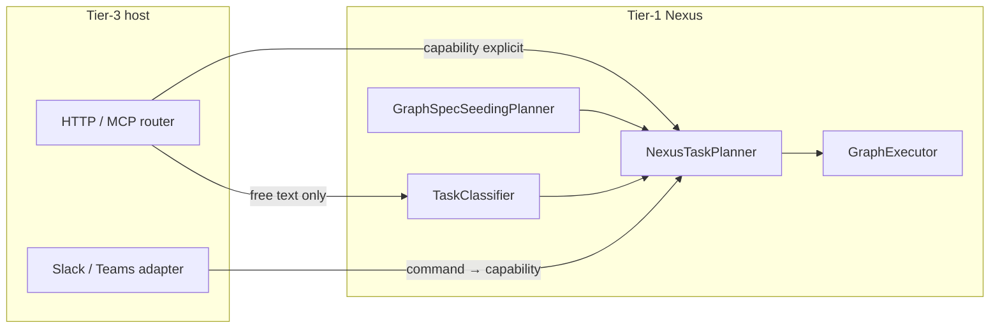
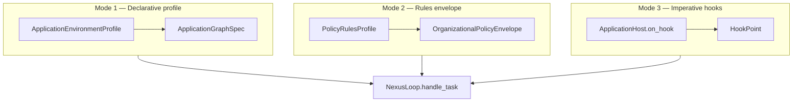

# Tier-3 Application Environment, Sandbox, and Shadow Workspace

**Status:** Canonical architecture (domain pair 1:1) · **Application authoring gate:** §24–§45 + APP-CON-* (host environments)  
**Hub:** [`intergrax_runtime_architecture.md`](../intergrax_runtime_architecture.md)  
**Plan (1:1):** [`plan/TIER3_APPLICATION_ENVIRONMENT.md`](../plan/TIER3_APPLICATION_ENVIRONMENT.md)  
**Target:** [`IDEAL_HARNESS_AI_ARCHITECTURE.md`](../guides/IDEAL_HARNESS_AI_ARCHITECTURE.md) §26  
**Audit layers:** 3, 28  
**Audit instruction:** [`guides/audit/TIER3_APPLICATION_ENVIRONMENT.md`](../guides/audit/TIER3_APPLICATION_ENVIRONMENT.md)  
**Agent cooperation:** [`AGENT_CONTRACTS_AND_ASSEMBLY.md`](AGENT_CONTRACTS_AND_ASSEMBLY.md) §30 · §35–§39 · [`guides/AGENT_CREATION_GUIDE.md`](../guides/AGENT_CREATION_GUIDE.md) Appendix H · AC  

---

## Table of contents

| § | Topic |
|---|--------|
| [§20](#20-shadow-workspace-model) | Shadow workspace model |
| [§21](#21-sandbox-model) | Sandbox model |
| [§22](#22-application-environment-profile-canonical) | **ApplicationEnvironmentProfile** (composition root) |
| [§23](#23-application-interaction-postures-canonical) | Interaction postures, routing, scenarios |
| [§24](#24-application-contract) | **Application contract** (`ApplicationManifest`) |
| [§25](#25-application-interface-run_task-facade-harnessapplication-and-applicationhost) | **Application interface:** `run_task()`, `HarnessApplication`, `ApplicationHost` |
| [§26](#26-application-execution-result) | **Application execution result** (Plane A) |
| [§27](#27-application-roster-and-registry-assembly) | Roster and registry assembly |
| [§28](#28-application-environment-architecture-app) | **Application Environment Architecture (APP)** |
| [§29](#29-tier-and-terminology-canon-application) | Tier and terminology canon (application) |
| [§30](#30-three-environment-control-modes) | Three environment control modes |
| [§31](#31-author-facing-harnessapplication-facade) | Author-facing `HarnessApplication` facade |
| [§32](#32-applicationhost-hook-surface) | **ApplicationHost hook surface** |
| [§33](#33-dual-observability-application-and-agent-planes) | Dual observability planes |
| [§34](#34-per-agent-binding-from-the-application) | Per-agent binding from application |
| [§35](#35-use-case-catalog-application--environment) | Use-case catalog |
| [§36](#36-final-architecture-application--agent--harness-cooperation) | Final architecture synthesis |
| [§37](#37-pre-implementation-operational-contracts-app-con) | Pre-implementation operational contracts |
| [§38](#38-execution-responsibility-stack-l4-application) | Execution stack: L4 application |
| [§39](#39-organizational-policy-envelope--virtual-workforce) | Organizational policy envelope |
| [§40](#40-production-reliability-safety-and-release-gates-tier-3) | Production reliability and release gates |
| [§41](#41-composition-primitives-separation-matrix) | Composition primitives separation |
| [§42](#42-applicationenvironmentstate-typed-host-state) | **ApplicationEnvironmentState** |
| [§43](#43-budget-reactions-and-token-governance) | Budget reactions and token governance |
| [§44](#44-scenario-test-matrix-tier-3) | Scenario test matrix |
| [§45](#45-checklist-for-new-application-implementation) | New application checklist |
| [§46](#46-production-readiness-acceptance-criteria) | Production readiness acceptance criteria |

---

---
# 20. Shadow Workspace Model

A Shadow Workspace is an isolated temporary workspace used to perform work without directly modifying the main environment.

Inspired by Cursor-like execution environments.

Shadow Workspaces may be used for:

- code experiments
- document analysis
- temporary data transformations
- simulated business workflows
- vendor research sessions
- legal document review sessions
- onboarding simulations

A Shadow Workspace should provide:

- isolation
- temporary storage
- reproducibility
- rollback safety
- inspectable artifacts
- cleanup

---


---

# 21. Sandbox Model

A sandbox is a controlled execution environment.

Use sandboxes for:

- code execution
- browser automation
- file manipulation
- risky tool use
- external data extraction
- generated script execution

Sandbox execution should be:

- isolated
- observable
- permission-controlled
- interruptible
- disposable
- reproducible when possible

---

---

# 22. Application Environment Profile (canonical)

Tier-3 hosts are configured through **`ApplicationEnvironmentProfile`** — a typed umbrella aggregating every harness control plane slice.

## 22.1 Profile composition

| Sub-profile | Purpose |
|-------------|---------|
| `IdentityProfile` | API key, tenant_required, service identities |
| `PolicyRulesProfile` + `ExecutionMode` | Declarative rules + STRICT/BALANCED/EXPLORATORY |
| `ApplicationSecurityProfile` | Per-app V-SEC toggles |
| `GuardrailProfile` | Vendor LLM guardrail scan toggles (`enabled`, `scan_input/output/tool_calls`, Colang/Bedrock options) |
| `ToolProfile` / `SkillProfile` | Allowed catalogs |
| `IntegrationProfile` | Provider stack — includes optional `llm_guardrail` slug (§47) |
| `LLMProfile` / `ModalityProfile` | Model and modality posture |
| `ContextProfile` / `MemoryProfile` / `ContextDecisionProfile` | Assembly and stores |
| `PromptProfile` | YAML prompt catalog path |
| `ReliabilityProfile` | Idempotency, circuit breaker, checkpoint |
| `ObservabilityProfile` | Trace, OTEL, metrics plugins |
| `CostProfile` / `ComplianceProfile` | Budgets, reactions, compliance domain class |
| `EvaluationProfile` / `CriticProfile` / `AdaptiveProfile` | Eval, PEV, L4 adaptive loop (when enabled) |
| `ReasoningProfile` | Planner/classifier LLM ids, denied models |
| `OrchestrationProfile` | Planner/classifier kinds, delegation depth, long-running |
| `ScalingProfile` / `HostDeploymentProfile` | ECP cross-ref, deploy posture |
| `GovernanceProfile` / `IntegrationGovernanceProfile` | Lifecycle and integration governance |
| `ApplicationGraphSpec` | Declarative multi-agent topology |
| `OrganizationalPolicyEnvelope` | Virtual org / workforce simulation (§39) |
| `ShadowWorkspaceProfile` / `SandboxProfile` | Isolated workspaces (§20–§21) |
| `ApplicationFeatures` | Lab vs product surface toggles |
| `domain_policy_fragments` | Product-specific `RuntimePolicyBundle` slices |

**Contract:** `intergrax/applications/contracts/environment_profile.py`

## 22.2 Unified wiring entrypoints

```text
ApplicationManifest
    -> build ApplicationBuildContext
    -> wire_application_environment(ctx, profile)
    -> materialize_runtime_config(request, harness_ctx, env)
    -> build_nexus_loop_from_environment(...)
    -> UnifiedTaskRunner (§41)
```

| Module | Role |
|--------|------|
| `applications/_shared/environment_wiring.py` | Single wiring entry |
| `runtime_config_bridge.py` | Environment → `RuntimeConfig` |
| `nexus_factory.py` | NexusLoop from profile |
| `identity_wiring.py` | Host auth from `IdentityProfile` |
| `shadow_wiring.py` / `sandbox_wiring.py` | Isolated execution |
| `guardrail_wiring.py` / `guardrail_runtime_bridge.py` | `llm_guardrail` slug → `LlmGuardrailMiddleware` (M.12) |
| `*_runtime_bridge.py` | Domain bridges (RAG, memory, policy, …) |

## 22.3 Interaction surfaces (intake)

Normalized intake MUST converge on the same Nexus lifecycle:

| Surface | Typical entry |
|---------|---------------|
| HTTP API | `applications/*/host/` FastAPI routers |
| CLI | `intergrax` CLI / lab commands |
| Slack / Teams | `POST /v1/interactions/intake` + adapters |
| Webhook / worker | `applications/_shared/task_intake.py`, queue consumers |
| Scheduler | `intergrax/queueing/` + long-running task API |

See [`ORCHESTRATION.md`](ORCHESTRATION.md) §48 for `TaskEnvelope` normalization.

## 22.4 Host migration rule

Every Tier-3 application MUST:

1. declare `environment` on `ApplicationManifest`,
2. wire through `wire_application_environment` (no ad-hoc `getattr` profile access),
3. keep business logic in Tier-2 agents — hosts only compose harness.

**Plan:** [`plan/TIER3_APPLICATION_ENVIRONMENT.md`](../plan/TIER3_APPLICATION_ENVIRONMENT.md) Phase H-APP (43 tasks, Done).

## 22.5 Related documents

| Document | Relationship |
|----------|--------------|
| [`applications/USAGE.md`](../../applications/USAGE.md) | Authoring Tier-3 hosts |
| [`UNIFIED_EXECUTION_RUNTIME.md`](UNIFIED_EXECUTION_RUNTIME.md) | UAEP + policy runtime |
| [`ORCHESTRATION.md`](ORCHESTRATION.md) | Nexus orchestration fields on profile |
| [`ELASTIC_CAPACITY_AND_SCALING.md`](ELASTIC_CAPACITY_AND_SCALING.md) | `ScalingProfile`, deploy/Helm vs ECP provisioning |
| [`guides/HARNESS_ENVIRONMENT.md`](../guides/HARNESS_ENVIRONMENT.md) | Lab stack operator guide |

---

# 23. Application interaction postures (canonical)

Tier-3 hosts are **composition shells** around a long-lived Nexus runtime. The same platform mechanisms support different **interaction postures** — selected through `ApplicationEnvironmentProfile` and host wiring, not separate runtime forks.

> **Master configuration canon (all postures × agent counts × strategies × CFG cases):** [`ORCHESTRATION.md`](ORCHESTRATION.md) **§56** — start there for product design and implementation planning. This section is the **Tier-3 host summary** only.

**Runtime narrative:** [`NEXUS_EXECUTION_FLOW.md`](NEXUS_EXECUTION_FLOW.md) §3.1 · **Patterns:** [`ORCHESTRATION.md`](ORCHESTRATION.md) §50–§56 · **Routing modes:** [`REASONING_AND_COGNITION.md`](REASONING_AND_COGNITION.md) §9.4.

## 23.1 Posture catalog

| Posture | Process model | Task trigger | Typical surfaces |
|---------|---------------|--------------|------------------|
| **Reactive on-demand** | Host daemon idle until work arrives | User/API message per `Task` | HTTP `POST …/run`, MCP, Slack/Teams intake (`execute=true`) |
| **Always-on daemon** | Host process runs continuously | Same as reactive; plus health/index maintenance | Local HTTP/MCP, tray, Socket Mode Slack |
| **Scheduled / queued background** | Worker consumes queue or cron | Scheduler, file watcher, webhook enqueue | `intergrax/queueing/`, long-running API, `message_bus` |
| **Hybrid** | Daemon + background workers | Mix of interactive and async tasks | LKW-style: index in background, Q&A on demand |

**Invariant:** every posture normalizes work to **`Task` → `UnifiedTaskRunner` → `NexusLoop.handle_task()`**. Surfaces differ; Nexus lifecycle does not.

```text
Bootstrap (once per host process):
  ApplicationManifest + ApplicationEnvironmentProfile
    → wire_application_environment()
    → build_application_registry()
    → build_nexus_loop_from_environment()
    → UnifiedTaskRunner(nexus_loop)

Per unit of work (any posture):
  Surface adapter → Task → UnifiedTaskRunner.run_task() → NexusLoop
```

Agents are **not** separate OS processes. They are registry entries invoked **on demand** per graph node. The host may be always-on; agents remain passive until Nexus schedules a node.

## 23.2 Profile knobs per posture

| Concern | Profile / module | Reactive | Always-on daemon | Background / hybrid |
|---------|------------------|----------|------------------|---------------------|
| HTTP/MCP serving | Host `factory.py` | Optional | **Required** | Often required for ops |
| Interaction intake | `wire_interaction_intake_service` | Optional | Recommended | Optional (notify only) |
| Long-running + checkpoint | `OrchestrationProfile.long_running_enabled`, `ReliabilityProfile` | Off unless large jobs | On for reports / HITL | **On** for batch pipelines |
| Queue consumer | `applications/_shared/task_intake.py`, `queueing/` | Rare | Optional | **Required** for async |
| Notification on complete | `NotificationAdapter`, integration webhooks | Optional | Recommended | **Required** for user alert |
| Shadow / sandbox | `ShadowWorkspaceProfile`, `SandboxProfile` | Per task | Per task | Per task |
| Execution mode | `ExecutionMode` STRICT / BALANCED / EXPLORATORY | Product choice | Product choice | Often BALANCED for batch |

**Rule:** posture is a **product wiring decision** on Tier-3. Tier-1 Nexus semantics are identical across postures.

## 23.3 Routing responsibility matrix (who sets `capability`)

Free-text user input does **not** implicitly select agents. Routing is explicit at one of four layers:

| Layer | Owner | When to use | Sets on `Task` |
|-------|-------|-------------|----------------|
| **L1 — Client / API contract** | Tier-3 router or API schema | Client knows intent (`dispute.scenario`, `research.pipeline`) | `context.capability`, optional `agent_id` |
| **L2 — Interaction adapter** | `InteractionIntakeService` + surface adapter | Slack slash command, structured lab JSON | `message` + mapped `capability` from command prefix |
| **L3 — Tier-1 classifier** | `TaskClassifier` / `classifier_kind=rules` / future LLM (`COG-3.*`) | Chat UX with raw user text | `classification` + inferred `capability` when rules/LLM enabled |
| **L4 — Declarative graph** | `ApplicationGraphSpec` + `GraphSpecSeedingPlanner` | Multi-agent product with fixed topology | Plan steps from `graph_spec`; task `capability` selects pipeline entry |



**Authoring defaults (harness):**

| UX pattern | Minimum routing layer | Do not rely on |
|------------|----------------------|----------------|
| Typed REST API | L1 | Classifier alone |
| Slash command (`/dsw analyze …`) | L2 | Default agent fallback |
| Free-text chatbot | L3 when available; until then L1 shim in host | `SINGLE_AGENT_DEFAULT` |
| Fixed multi-agent product | L1 `*.pipeline` capability + L4 `graph_spec` | `MULTI_AGENT` classification alone |

See [`REASONING_AND_COGNITION.md`](REASONING_AND_COGNITION.md) §9.4 for classification vs orchestration mode.

## 23.4 Multi-agent topology configuration (Tier-3)

Three **supported** ways to run multiple agents with different roles. Pick one per product; do not mix ad-hoc.

| Mode | Mechanism | Agent relationship | Classification typical |
|------|-----------|-------------------|------------------------|
| **A — Declarative graph** | `ApplicationGraphSpec` on profile | `depends_on` / `delegates_to` edges | `CAPABILITY_ROUTED` or `MULTI_AGENT` after seed |
| **B — Pipeline capability** | `Task.context.capability = "<app>.pipeline"` | Sequential steps from `TaskPlanner` or graph seed | Product-specific; see §23.5 |
| **C — Engine planner** | `OrchestrationProfile.planner_kind = engine` | LLM emits `NexusPlan` steps | Any; validated against registry |

**Not a multi-agent mode:** `TaskClassification.MULTI_AGENT` when several agents declare the **same** capability — that is **competitive routing**, not a cross-role pipeline. See [`REASONING_AND_COGNITION.md`](REASONING_AND_COGNITION.md) §9.4.

### Graph spec seeding rules (runtime today)

`GraphSpecSeedingPlanner` wraps the inner planner when `environment.graph_spec.nodes` is non-empty:

```text
should_seed_plan_from_graph_spec(task) is True
  AND graph_spec.nodes non-empty
    → application_graph_spec_to_nexus_plan(spec, task)
  ELSE
    → inner.planner.plan(task, registry)   # TaskPlanner or EngineBackedNexusPlanner
```

`should_seed_plan_from_graph_spec` is true when the task has **no pre-assigned** `task.runtime.orchestration.plan_id`.

**Authoring conventions:**

| Convention | Purpose |
|------------|---------|
| `capability = "<product>.pipeline"` | Signals multi-step product intent to operators and traces |
| `graph_spec` with `DEPENDS_ON` chain | Sequential cooperation (A → B → C) |
| Parallel branches | Multiple nodes with no `depends_on` between them → same topological batch |
| `DELEGATES_TO` edges | Hierarchical delegation per [ADR-FLOW-001](../adr/ADR-FLOW-001.md) |
| `merge_strategy` on profile | How parallel/sequential summaries compose for the user |

**Implemented (H-APP-DOC.2 / ORCH-CONFIG.2):** `ApplicationGraphSpec.trigger_capabilities` — seed graph only when task capability matches (avoids graph override on single-agent routes). See ADR-FLOW-004.

## 23.5 Scenario recipes (configuration templates)

Copy a row when designing a new Tier-3 host. Adjust profile fields; do not fork Nexus.

| Product scenario | Posture | Agents | Coordination pattern | Key profile settings |
|------------------|---------|--------|----------------------|----------------------|
| Single Q&A agent | Reactive | 1 | Orchestrator–worker (1 node) | `planner_kind=default`, explicit `capability` on API |
| Chat with raw user text | Reactive / daemon | 1+ | Classifier → single or pipeline | `classifier_kind=rules` + `intent_routes` (ORCH-CONFIG.1); `engine` when COG-3 done |
| Research: search then summarize | Reactive | 2 | Sequential pipeline | `capability=research.pipeline` **or** `graph_spec` chain |
| Dispute prep: intake → analyze → strategy → scenario | Reactive / hybrid | 4 | Sequential graph | `graph_spec` + `*.pipeline` token · product example §6.3 (DSW) · harness: CFG-06 sim |
| Parallel doc review shards | Background + reactive | N | Peer-to-peer (parallel batch) | `graph_spec` without inter-node `depends_on`; `max_parallel_nodes` |
| PM delegates to specialists | Reactive | 3+ | Hierarchical | `DELEGATES_TO` edges + `max_delegation_depth` |
| Quality gate before answer | Reactive | 2+ | Evaluator-loop | CVL hooks + `CoordinationPattern.EVALUATOR_LOOP` |
| Index corpus continuously | Hybrid daemon | 1 | Scheduled single-agent | Queue + `dispute.intake`; notify on batch complete |
| Legal draft review + HITL | Reactive | 1–2 | Supervisor–worker | `require_human_approval`, shadow workspace, L2 critic |

**Cross-ref:** pattern names and parallelism rules — [`ORCHESTRATION.md`](ORCHESTRATION.md) §50–§51; completion policy — [`CRITIC_VERIFICATION.md`](CRITIC_VERIFICATION.md).

## 23.6 Host checklist (every Tier-3 application)

1. Declare `environment` on `ApplicationManifest` with intended posture (§23.2).
2. Wire **all** chosen surfaces to `UnifiedTaskRunner` (HTTP, MCP, interaction intake if needed).
3. For multi-agent: set `graph_spec` **or** document `*.pipeline` capability **or** enable `planner_kind=engine`.
4. Set `merge_strategy` for multi-node UX (`concat` vs `last_wins` vs `structured_json`).
5. Set `execution_mode=strict` in production; wire critic profile for high-risk capabilities.
6. Do not implement business orchestration loops in Tier-2 — use Nexus graph + UAEP steps.

**Plan:** [`plan/TIER3_APPLICATION_ENVIRONMENT.md`](../plan/TIER3_APPLICATION_ENVIRONMENT.md) Phase H-APP-DOC · platform cases **ORCH-CONFIG** in [`plan/ORCHESTRATION.md`](../plan/ORCHESTRATION.md).

## 23.7 Tier-3 host wiring audit (as-built 2026-06-09)

**Canonical full matrix:** [`ORCHESTRATION.md`](ORCHESTRATION.md) §59.2.

Phase H-APP (**Done**) delivered unified `ApplicationEnvironmentProfile` and `wire_application_environment` — but **surface mounting** (task control API, scheduler, interactions, reliability enricher) is **per-host optional**. Only `lab_application` is the reference for full platform runtime capabilities (ORCH-6, FLOW-CTL, REL-ADV HTTP).

| Gap ID | Symptom | Affected hosts | Plan |
|--------|---------|----------------|------|
| T3-GAP-01 | No `mount_harness_task_routes` | LKW, dispute_sim, assistant (opt-in) | **Closed** on lab/legal/research/poc · H-APP-WIRING.1 **Done** |
| T3-GAP-02 | Reliability task enricher not in factory | LKW, dispute_sim, assistant | **Closed** on reference hosts · runner `task_enricher` |
| T3-GAP-03 | Long-running scheduler not wired | LKW (opt-in) | **Closed** on reference hosts (legal/research/poc/dispute_sim/lab default on) |
| T3-GAP-04 | Interaction intake not enabled | LKW (opt-in) | **Closed** on reference hosts incl. dispute_sim (`INCLUDE_INTERACTIONS` default on) |
| T3-GAP-05 | Queue worker not scaffold-default | Most hosts | **Partial** — opt-in `INCLUDE_QUEUE_WORKER` (legal + scaffold); dispute_sim optional |
| T3-GAP-06 | Hybrid daemon (CFG-14) — LKW incomplete | `local_workspace_application` | **Deferred** §6.3 · doc in LKW `ARCHITECTURE.md` |

**Authoring rule:** do not claim CFG-13/14/20 production-ready on a host until §23.7 gaps for that host are closed or explicitly documented in product `ARCHITECTURE.md`.

## 23.8 Technical debt — docs vs implementation (post closeout 2026-06-09)

| Topic | Architecture says | Current code | Debt |
|-------|-------------------|--------------|------|
| Unified task control API | ORCH §57, FLOW §28, REL §35 | `mount_harness_task_routes` on reference hosts + scaffold | LKW opt-in only |
| Async batch | ORCH-6 `run_async` | Reference hosts mount `/v1/tasks/run-async` | Durable queue opt-in (`INCLUDE_QUEUE_WORKER`) |
| Strict multi-agent | `with_reference_host_platform_defaults()` | legal/research/poc/dispute_sim presets | Product E1+E3 demo **Deferred** §6.3 |
| Free-text routing | `classifier_kind=rules` | Reference host presets enable rules classifier | LKW/assistant per-host opt-in |
| Scaffold parity | H-APP-DOC.4 + H-APP-WIRING Done | Scaffold defaults: `INCLUDE_TASK_CONTROL`, interactions, scheduler | Queue worker still opt-in |

**Paydown:** [Phase H-APP-WIRING](../plan/TIER3_APPLICATION_ENVIRONMENT.md) (Band 2aw) **Done** (2026-06-09). Default queue: §6.1 gate maintenance only.

---

# 24. Application Contract

Every deployable Tier-3 environment MUST declare a clear **application contract** via **`ApplicationManifest`**.

The contract MUST be easy for humans and LLMs to understand — symmetric to **`AgentContract`** (ACP §12).

## 24.1 Minimum required fields

```text
ApplicationManifest:
    app_id                    # stable slug, e.g. legal_application
    name
    description
    version
    profile                   # LAB | PRODUCT
    route_prefix              # HTTP API prefix, e.g. /v1/legal
    env_prefix                # MY_APP_* environment variables
    default_host / default_port
    default_capability        # optional API default routing token
    agents: list[AgentBinding]
    integration_profile       # default IntegrationProfile when environment omits
    features: ApplicationFeatures
    environment: ApplicationEnvironmentProfile | null
```

**Contract module:** `intergrax/applications/contracts/manifest.py`

## 24.2 AgentBinding (roster entry contract)

Each roster entry binds a **capability** to a **concrete Tier-2 implementation**:

```text
AgentBinding:
    agent_type | import_path          # Tier-2 class (prefer AgentBinding.mount)
    factory | factory_path             # Tier-3 factory for configured agents
    capabilities: list[str]            # routing tokens (normative for Nexus)
    contract_id: str | null
    enabled / default / requires_uaep
    memory_scope_override
    rag_collection_override
    tool_allowlist_extra / tool_denylist
    org_role_id                        # virtual workforce role (§39)
    budget_slice                       # per-agent limits (ACP §25.5 · §34)
    config: dict                       # lightweight factory options — not secrets
```

**Routing invariant (normative — §37.4):** Nexus selects agents by **`capabilities[]`** match on `Task.required_capability` — **not** by Python class name in the task payload. Class name appears **only** in `AgentBinding` for wiring.

## 24.3 Application vs product vs agent

| Artifact | Tier | Contract | Lives in |
|----------|------|----------|----------|
| **Agent** | 2 | `AgentContract` | `agents/<slug>/` |
| **Application environment** | 3 | `ApplicationManifest` + `ApplicationEnvironmentProfile` | `applications/<app>/` |
| **Product** | — | Business offering | product `ARCHITECTURE.md` + Tier-3 host |

**Rule:** business logic and cognitive steps live in Tier-2 agents. Tier-3 hosts **compose** harness capabilities — they do not implement domain `on_next_step` loops (ACP §38).

---

# 25. Application Interface: `run_task()` Facade, `HarnessApplication`, and `ApplicationHost`

Symmetric to ACP §13 — application authors have **one task entry** and **optional hook surface** for dynamic behavior.

## 25.1 Primary author API — `UnifiedTaskRunner.run_task()`

**Authors SHOULD route all surfaces through one task lifecycle:**

```text
result = await task_runner.run_task(task: Task) -> TaskResult
```

**Internal engine:** surface adapter → normalize `Task` → `NexusLoop.handle_task()` → graph execution → `TaskResult` + `ApplicationRunSummary` (§26). Authors MUST NOT reimplement Nexus orchestration in host `factory.py`.

| Responsibility | Owner |
|----------------|-------|
| HTTP/MCP/Slack intake, auth, tenant | **Tier-3 host** |
| `Task` construction (`capability`, metadata, identity) | **Tier-3 host** |
| Classifier, planner, graph execution | **NexusLoop** (Tier-1) |
| Agent cognitive steps | **Tier-2** (`Agent.run()` / `on_next_step`) |
| Policy, trace, budgets on agent steps | **HarnessKernel** (ACP §38) |
| Dynamic environment reactions at Nexus boundaries | **ApplicationHost** hooks (§32) |

## 25.2 Fluent builder — `HarnessApplication`

**Authors MAY use the lab/product fluent facade** (DX-2.1):

```text
app = (
    HarnessApplication("my_lab")
    .agents(EchoAgent, ResearchAgent)
    .integrations(IntegrationProfile.lab_stack())
    .environment(ApplicationEnvironmentProfile.lab_defaults())
    .graph(AgentGraph()...)
    .mode(ExecutionMode.BALANCED)
    .hooks(MyApplicationHost())
    .build_fastapi()
)
```

| Method | Role |
|--------|------|
| `.agents(*types)` | Roster via `AgentBinding.mount` |
| `.environment(profile)` | Full `ApplicationEnvironmentProfile` |
| `.graph(AgentGraph)` | Declarative topology → `graph_spec` |
| `.hooks(ApplicationHost)` | Imperative Nexus hook overrides (§32) |
| `.from_files(env_path, agents_path)` | YAML round-trip (DX-5.3) |
| `.build_runtime()` / `.build_fastapi()` | `HarnessHostRuntime` assembly |

**Module:** `intergrax/harness/app.py`

## 25.3 Imperative API — `ApplicationHost.on_hook()`

**Authors SHOULD implement dynamic environment behavior through typed hooks** — not private orchestration loops:

```text
class MyApplicationHost:
    def on_hook(self, point: HookPoint, context: HookContext) -> HookResult | None:
        ...
```

Return **`None`** to defer to default Nexus/harness behavior. Return **`HookResult`** to allow, block, modify, or escalate (§32).

**Protocol:** `intergrax/harness/application_host.py`  
**Bridge:** `intergrax/harness/hooks.py` → `ApplicationHostMiddleware`  
**Wiring:** `apply_application_host_wiring(nexus, host)` in `applications/_shared/application_host_wiring.py` (**Done** APP-CON-1)

### 25.3.1 Hooks are event reactions — not a cognitive loop (normative)

Tier-3 applications **do not** receive `on_next_orchestration_step()` or any session step loop analogous to `Agent.on_next_step()`. That would duplicate **NexusLoop** (L3/L4 confusion) and bypass graph policy, parallel caps, and Plane A trace.

| Mechanism | What it controls | Loop? |
|-----------|------------------|-------|
| **`ApplicationEnvironmentProfile`** | Catalogs, modes, orchestration knobs | No — declarative |
| **`ApplicationGraphSpec`** | Multi-agent **topology** (who runs in what order) | No — declarative plan seed |
| **`OrganizationalPolicyEnvelope`** | Org-wide **rules** and channels | No — declarative + policy engine |
| **`AgentBinding`** | Per-agent runtime **slices** at merge | No — declarative |
| **`ApplicationHost.on_hook`** | **Event reactions** at Nexus boundaries | No — callback per `HookPoint` |
| **`Agent.on_next_step`** | Domain **cognition** per agent iteration | Yes — agent-only (ACP §32) |

**Full environment customization** combines: profile + graph spec + policy envelope + roster + hooks + shadow/sandbox — **never** a private orchestration `while` loop in Tier-3.

## 25.4 Framework surface (Tier-3 vs author visibility)

| Surface | Who implements | Author visibility |
|---------|----------------|-------------------|
| `ApplicationManifest` / `build_*_manifest()` | Product author | **Public — composition contract** |
| `ApplicationEnvironmentProfile` | Product author | **Public — governance envelope** |
| `wire_application_environment()` | Framework | **Public — call once at bootstrap** |
| `build_harness_host_runtime()` | Framework | **Public — preferred factory path** |
| `HarnessApplication` | Framework facade | **Public — lab/quickstart** |
| `ApplicationHost.on_hook` | Subclass / Protocol impl | **Public — environment reactions** |
| `host/factory.py` FastAPI lifespan | Product author | **Public — surface mounting only** |
| `NexusLoop.handle_task` | Tier-1 | **Internal — do not call from product business code** |
| `Agent.run` / `on_next_step` | Tier-2 | **Internal to application** — invoked by Nexus per graph node |

## 25.5 Legacy and forbidden paths

| Path | Status |
|------|--------|
| Ad-hoc `NexusLoop(...)` construction in every host | **Deprecated** — use `build_nexus_loop_from_environment` |
| `getattr(manifest, "field")` in wiring | **Forbidden** — typed manifest access (H-APP.0.3) |
| Business orchestration `while` loops in Tier-3 | **Forbidden** — use `graph_spec` + Nexus |
| Import `agents.*` business rules into `factory.py` | **Forbidden** — roster + profile only |
| `Application.on_next_orchestration_step()` as public API | **Rejected** — duplicates NexusLoop (APP-INV-03) |

**Guide:** [`applications/USAGE.md`](../../applications/USAGE.md) · [`guides/EXTENSION_AUTHOR_GUIDE.md`](../guides/EXTENSION_AUTHOR_GUIDE.md) §0 · **Plan:** Phase **H-APP** + **H-APP-CON**.

---

# 26. Application Execution Result

Every completed `Task` SHOULD expose a structured **application-level** result for operators and product UIs.

## 26.1 Plane A — `ApplicationRunSummary`

**Canonical type:** `intergrax/contracts/application_run_summary.py`

```text
ApplicationRunSummary:
    schema_version: application_run_summary.v1
    task_id
    graph_id
    terminal_status
    agent_invocations: list[AgentInvocationSummary]
    total_agents / total_steps / total_llm_tokens
    completed_at
```

Populated by `build_application_run_summary()` on Nexus task completion (ACP-OBS-2). Attached to `TaskResult.metadata` under `application_run_summary.v1`.

## 26.2 Plane B — per-agent traces

Each graph node produces **`AgentRunResult`** + **`AgentRunTrace`** (ACP §31). Application authors inspect Plane B in pytest via direct `agent.run()` or from task metadata when wired.

| Plane | Audience | Primary type |
|-------|----------|--------------|
| **A — Application** | Ops, product dashboards, multi-agent UX | `ApplicationRunSummary` |
| **B — Agent** | Agent authors, eval, debug | `AgentRunTrace` |

**Rule:** Tier-3 hosts MUST NOT parse raw trace DB tables for product UX when `ApplicationRunSummary` is available on `TaskResult`.

## 26.3 TaskResult contract (host-facing)

```text
TaskResult:
    task_id
    status
    output / structured_output
    metadata:
        application_run_summary.v1  → ApplicationRunSummary
        trace_id / graph_id         → join keys for observability spine
```

---

# 27. Application Roster and Registry Assembly

Nexus discovers agents through **`AgentRegistry`** built at host bootstrap — symmetric to ACP §15.

## 27.1 Bootstrap pipeline

```text
ApplicationManifest
    → ApplicationBuildContext.for_manifest(...)
    → build_application_registry(manifest, ctx, builders=...)
    → AgentRegistry (enabled bindings only)
    → NexusLoop(registry, ...)
```

**Module:** `intergrax/applications/_shared/wiring.py`

## 27.2 Factory resolution order

For each `AgentBinding`, instance creation order (normative):

```text
1. binding.factory(ctx, binding)     # typed callable
2. builders[agent_type]              # type-keyed map
3. factory_path import               # scaffold/YAML only
4. agent_type()                      # zero-arg constructor
```

## 27.3 Conformance checks

| Check | Module | When |
|-------|--------|------|
| Manifest round-trip | `test_manifest_conformance.py` | CI gate |
| Tool/skill ⊆ environment | `EnvironmentSkillToolConsistencyCheck` | `wire_application_environment` |
| Capability routing | `check_capability_routing.py` | CI gate (ACP-CON-6) |
| Agent registry bypass | `check_agent_registry_bypass.py` | Tier-2 must not import integrations directly |

## 27.4 Registry anti-patterns

| ID | Anti-pattern | Correct |
|----|--------------|---------|
| REG-AP-01 | Hardcoded agent class in NexusLoop subclass | `AgentBinding` + capability token |
| REG-AP-02 | Dynamic `importlib` roster without manifest | `ApplicationManifest` + typed builders |
| REG-AP-03 | Disabled agent still in routing defaults | `enabled=False` on binding |
| REG-AP-04 | Same capability on two defaults | Exactly one `default=True` per capability class |

---

# 28. Application Environment Architecture (APP)

Define the **Application Environment Architecture (APP)** — how Tier-3 environments are authored, how they bind Tier-2 agents, and how **environment control** (declarative, rules, hooks) interacts with Nexus **without** collapsing the harness into application classes.

APP answers:

> **How does a developer build a production-grade application environment quickly — business app, lab, virtual organization, or simulation — while staying inside harness governance?**

APP does **not** replace Nexus, redefine tiers, or introduce a second agent execution engine.

## 28.1 Design invariants

| ID | Invariant |
|----|-----------|
| **APP-INV-01** | Nexus remains Agent OS — global orchestration, policy, HITL, multi-agent graph (ACP-INV-01) |
| **APP-INV-02** | All work normalizes to **`Task` → `UnifiedTaskRunner` → `NexusLoop`** — no surface-specific runtime forks |
| **APP-INV-03** | Business logic lives in **Tier-2 agents** — Tier-3 hosts MUST NOT implement domain cognitive loops |
| **APP-INV-04** | Configuration: **manifest + profile in Tier-3**; **contract + `on_next_step` in Tier-2** (ACP-INV-06) |
| **APP-INV-05** | Side effects at environment boundary via **hooks, policy, webhooks** — never ad-hoc vendor SDKs in `factory.py` |
| **APP-INV-06** | **`ApplicationEnvironmentProfile`** is the single composition root for harness slices (IDEAL §17) |
| **APP-INV-07** | Imperative control via **`ApplicationHost` + `HookPoint`** — not duplicate `NexusLoop` subclasses |
| **APP-INV-08** | Organizational policy is **Tier-3 data** — agents consume merged context; hosts declare envelope (§39) |
| **APP-INV-09** | **`run_task()` / HTTP `/run`** is the application entry; **`Agent.run()`** is the agent entry (ACP-INV-09) |
| **APP-INV-10** | Every enabled profile slice MUST wire through `*_runtime_bridge.py` — no orphan Pydantic fields |

## 28.2 Rejected architecture (audit outcome)

```text
REJECTED: Application class with on_next_orchestration_step() mirroring Agent.on_next_step
REJECTED: Tier-3 host implementing multi-agent pipelines in factory.py while-loops
REJECTED: Application owns AgentRegistry, PolicyEngine, or GraphExecutor directly
REJECTED: Separate runtime fork per product posture (reactive vs daemon vs batch)
REJECTED: Embedding org compliance rules only in agent source (§39 · ACP-INV-12)
REJECTED: New 22nd domain pair duplicating ORCHESTRATION + UAEP inside "Application Contracts"
```

**Rationale:** The harness is the product; applications are **replaceable compositions** — same as agents (ACP §21.3).

---

# 29. Tier and Terminology Canon (Application)

Complements ACP §22 — application author vocabulary.

## 29.1 Four tiers — application lens

| Term | Tier | One-sentence definition |
|------|------|-------------------------|
| **Application** | 3 | Deployable **environment**: manifest, profile, roster, surfaces, deploy artifacts |
| **Application host** | 3 | Running process: `factory.py` + FastAPI/MCP + `HarnessHostRuntime` |
| **HarnessApplication** | 3 | Fluent builder facade for lab/quickstart (DX-2) |
| **ApplicationEnvironmentProfile** | 3 | Typed umbrella of all harness control-plane slices |
| **Agent** | 2 | Domain worker invoked **per graph node** — not a host OS process |
| **Nexus** | 1 | Agent OS executing `Task` graphs |
| **Harness (practical)** | 0+1+3 | Platform catalogs + Nexus + application wiring |

## 29.2 Runnable application instance

A **single host process** materializes:

```text
ApplicationManifest + ApplicationEnvironmentProfile
    → wire_application_environment()
    → build_application_registry()
    → build_harness_host_runtime()
        → NexusLoop + UnifiedTaskRunner + observability/reliability wiring
    → mount HTTP / MCP / intake / scheduler surfaces
```

Per **unit of work**:

```text
Surface → Task → UnifiedTaskRunner.run_task() → NexusLoop.handle_task()
    → graph node → Agent.run() → on_next_step loop (ACP §38)
    → ApplicationRunSummary on completion
```

## 29.3 Responsibility matrix (application author)

| Concern | Tier-3 Application | Tier-1 Nexus | Tier-2 Agent |
|---------|-------------------|--------------|--------------|
| User intake / chat API | **owner** | — | — |
| `Task` construction | **owner** | consumes | — |
| Capability on `Task` | **owner** (L1–L4 §23.3) | routes | declares |
| `ApplicationGraphSpec` | **owner** | seeds plan | — |
| `OrganizationalPolicyEnvelope` | **owner** | enforces | consumes §39 |
| Multi-agent orchestration | configures | **owner** | participates |
| Domain reasoning | — | — | **owner** (`on_next_step`) |
| Tool/skill catalogs enabled | **owner** (profiles) | executes | uses via gateways |
| HTTP auth / tenant | **owner** (`IdentityProfile`) | — | — |
| Trace / cost dashboards | **owner** (profiles) | emits | Plane B trace |

---

# 30. Three Environment Control Modes

Symmetric to ACP §23 (three cognition planes) — applications choose **how** environment behavior is expressed.



| Mode | Question | Primary types | When to use |
|------|----------|---------------|-------------|
| **1 — Declarative** | What catalogs, graph, posture, execution mode? | `ApplicationEnvironmentProfile`, `ApplicationGraphSpec` | Default — 80% of products |
| **2 — Rules** | What org/regulatory constraints apply to all agents? | `PolicyRulesProfile`, `OrganizationalPolicyEnvelope` | Compliance, virtual workforce, simulation |
| **3 — Imperative hooks** | What dynamic reaction at Nexus boundary? | `ApplicationHost`, `HookResult`, `HookPoint` | Budget exceed, custom intake, block agent selection |

**Anti-pattern APP-AP-01:** Implementing Mode 1 topology inside Mode 3 hooks — use `graph_spec` instead.

**Anti-pattern APP-AP-02:** Encoding Mode 2 rules only in agent `if org == "acme"` — use envelope (§39).

**Canon:** posture and routing detail — §23; agent consumption — ACP §30.

---

# 31. Author-facing `HarnessApplication` Facade

Symmetric to ACP §29 (author-facing `run()` facade).

## 31.1 Target author workflow

```text
1. Scaffold: python -m intergrax.scaffold new-application <slug> [--profile lab|product]
2. Declare ApplicationManifest + ApplicationEnvironmentProfile (manifest.py, environment_profile.py)
3. Register AgentBinding roster with factories
4. Optional: subclass ApplicationHost for HookPoint reactions
5. Wire factory.py via build_harness_host_runtime() — mount surfaces
6. Test: pytest applications/<app>/ tests + Task → ApplicationRunSummary assertion
7. Prod: same profile, different organizational envelope per tenant (UC-11)
```

## 31.2 Progressive disclosure (DX-0.4)

| Stage | Command | Delivers |
|-------|---------|----------|
| Minimal | `new-stack --minimal` | Harness-only factory |
| Standard | `new-application` / `new-stack` | Docker, MCP, deploy doc |
| Promote | `scaffold expand <slug>` | Upgrade minimal → standard |

## 31.3 Host factory responsibilities (normative)

`applications/<app>/host/factory.py` MAY:

- load settings from env (`Settings.from_env()`)
- call `build_harness_host_runtime(manifest, environment, ...)`
- mount HTTP routes, MCP, interaction intake, task control, scheduler
- attach product-specific middleware **only** when profile-driven wiring insufficient

`factory.py` MUST NOT:

- implement agent business steps
- construct `NexusLoop` with ad-hoc kwargs bypassing profile
- import vendor SDKs for domain operations

---

# 32. ApplicationHost Hook Surface

Symmetric to ACP §32 (`on_next_step`) — **event-driven** environment control, not a cognitive step loop.

## 32.0 Author readability and typed contracts (normative)

Application hook authors MUST be able to answer from code alone:

1. At which **HookPoint** does this reaction run?
2. What **HookAction** can be returned (`allow` | `block` | `modify` | `escalate`)?
3. Does the hook defer to default behavior (`return None`)?

Untyped dict mutation of Nexus internals from Tier-3 is **not supported** — use `HookResult.modified_payload` only where documented for the hook point.

## 32.1 Hook lifecycle matrix — allowed actions per HookPoint

Normative for application authors. **`BLOCK`** stops the pipeline at that boundary. **`MODIFY`** shallow-merges `modified_payload` into `HookContext.runtime_state` (see `HookRegistry`). **`ESCALATE`** routes to HITL / escalation coordinator where wired. **`ALLOW`** / `None` defers to harness defaults.

| HookPoint | BLOCK | MODIFY | ESCALATE | Typical application use |
|-----------|-------|--------|----------|-------------------------|
| `BEFORE_TASK_INTAKE` | Yes | Yes — metadata keys | Rare | Reject intake, seed `app_env_state.v1` |
| `AFTER_TASK_INTAKE` | No | Yes | No | Audit labels, attach org/scenario ids |
| `BEFORE_CLASSIFICATION` | Yes | Yes — classifier hints in `runtime_state` | No | Force capability hint |
| `AFTER_CLASSIFICATION` | No | Yes | No | Log routing decision |
| `BEFORE_PLANNING` | Yes | Yes | No | Block disallowed planner kinds |
| `AFTER_PLANNING` | No | Yes | No | Validate plan against product policy |
| `BEFORE_AGENT_SELECTION` | **Yes** | Limited | No | Deny agent id / org role mismatch |
| `AFTER_AGENT_SELECTION` | No | Yes | No | Trace roster resolution |
| `BEFORE_CONTEXT_BUILD` | Yes | Yes | No | Strip forbidden metadata |
| `BEFORE_LLM_INFERENCE` / `AFTER_*` | Yes | Yes — guardrail payloads | Rare | Product-specific LLM gates (prefer profile) |
| `BEFORE_TOOL_CALL` / `AFTER_TOOL_CALL` | Yes | Rare | No | Prefer `ToolProfile` + policy rules |
| `BEFORE_HUMAN_APPROVAL` | Yes | Yes | **Yes** | Custom HITL templates |
| `AFTER_HUMAN_APPROVAL` | No | Yes | No | Resume notifications |
| `BEFORE_FINALIZATION` | Yes | Yes | No | Business outcome webhook prep |
| `AFTER_FINALIZATION` | No | Yes | No | Product analytics emit |
| `BEFORE_TRACE_PERSIST` | Yes | Yes — redaction labels | No | Prefer `ObservabilityProfile` |
| `BEFORE_MEMORY_WRITE` | Yes | Yes | No | Tenant scope enforcement backup |

**Rules:**

- ApplicationHost hooks MUST NOT invoke tools or LLM directly — schedule work by returning `BLOCK` / `ESCALATE` or by setting hints for Nexus/agents.
- Prefer **Mode 1–2** (profile, envelope) over hooks when behavior is static across tasks.
- `MODIFY` is **not** a substitute for `ApplicationGraphSpec` topology changes mid-flight.

Full enum: `intergrax/runtime/hooks/hook_point.py`

## 32.2 HookResult contract

```text
HookResult:
    action: allow | block | modify | escalate
    modified_payload: dict | null
    reason: str | null
```

## 32.3 Example — block agent on policy

```python
from intergrax.harness.application_host import ApplicationHost
from intergrax.runtime.hooks.hook_context import HookContext, HookResult, HookAction
from intergrax.runtime.hooks.hook_point import HookPoint


class StrictOrgHost:
    def on_hook(self, point: HookPoint, context: HookContext) -> HookResult | None:
        if point != HookPoint.BEFORE_AGENT_SELECTION:
            return None
        denied = context.runtime_state.get("org_denied_agents", [])
        if context.agent_id in denied:
            return HookResult(action=HookAction.BLOCK, reason="org_policy_denied")
        return None
```

## 32.4 ApplicationHost vs Agent.on_next_step

| Dimension | `ApplicationHost.on_hook` | `Agent.on_next_step` |
|-----------|---------------------------|----------------------|
| Layer | L4 environment boundary | L2 domain cognition |
| Frequency | Nexus lifecycle events | Every agent iteration |
| May invoke tools? | **No** — use agents | **Yes** via gateways |
| May select next graph agent? | **Indirect** — block/modify selection | **No** — use `StepOutcome` handoff/delegate |
| Replaces NexusLoop? | **No** | **No** |

## 32.5 Code map

| Component | Status | Path |
|-----------|--------|------|
| `ApplicationHost` Protocol | **Done** DX-5.1 | `intergrax/harness/application_host.py` |
| `ApplicationHostMiddleware` | **Done** DX-5.2 | `intergrax/harness/hooks.py` |
| `apply_application_host_wiring` | **Done** APP-CON-1 | `applications/_shared/application_host_wiring.py` |
| Wired in `build_harness_host_runtime` | **Done** APP-CON-1 | `application_host=` parameter |
| `HarnessApplication.hooks()` | **Done** APP-CON-1 | passes host to `build_harness_host_runtime` |
| `ApplicationEnvironmentState` | **Done** APP-CON-2 | `applications/contracts/environment_state.py` |
| `merge_host_into_pipeline` | **Done** DX-5.2 | alternative composition helper |

---

# 33. Dual Observability: Application and Agent Planes

Symmetric to ACP §31 — application authors operate primarily on **Plane A**.

## 33.1 Plane definitions

| Plane | Name | Primary consumer | Canonical type |
|-------|------|------------------|----------------|
| **A** | Application orchestration | Tier-3 ops, product UX | `ApplicationRunSummary` |
| **B** | Agent session | Tier-2 authors, eval | `AgentRunTrace` |

## 33.2 Join keys

```text
TaskResult.metadata["application_run_summary.v1"]  →  Plane A rollup
TaskResult.metadata["trace_id"]                    →  OBS spine
AgentRunResult.trace                               →  Plane B per node
```

## 33.3 Application observability profile

Configure via `ObservabilityProfile` on environment — wired by `wire_application_observability()`:

- trace DB path / in-memory lab mode
- runtime events store
- optional product debug surface (`ApplicationFeatures.debug_surface`)
- OTEL / metrics plugins when enabled

**Rule:** Tier-3 MUST NOT fork parallel trace pipelines — use harness spine ([`OBSERVABILITY.md`](OBSERVABILITY.md)).

## 33.4 Compliance rollups (org environments)

When `OrganizationalPolicyEnvelope` is set, Plane A dashboards SHOULD include policy verdict rollups from Plane B steps (ACP §39.5 · ACP-ORG-4).

---

# 34. Per-Agent Binding from the Application

Application-side canon for ACP §30 — what Tier-3 declares so agents receive merged environment at `Agent.run()`.

## 34.1 Merge pipeline (agent run time)

```text
ApplicationEnvironmentProfile
    + AgentBinding slices (tools, memory, RAG, budget, org_role_id)
    + Task metadata (tenant, user, matter_id, scenario hints)
        → merge_environment() → EffectiveAgentRunEnvironment
            → AgentStepContext.merged_environment
```

**Agent-side detail:** ACP §30 · `intergrax/agents/run_environment.py`

## 34.2 Binding slices (normative)

| Slice field | Affects at run time |
|-------------|---------------------|
| `tool_allowlist_extra` / `tool_denylist` | Merged tool policy |
| `memory_scope_override` | Namespace on `memory_view` |
| `rag_collection_override` | RAG gateway collection |
| `org_role_id` | `OrganizationalPolicyContext` overlay §39 |
| `budget_slice` | Per-agent token/cost caps §25.5 |

## 34.3 Application token budgets

| Tier | Owns |
|------|------|
| **Tier-3** | `CostProfile`, `AgentBinding.budget_slice`, `BudgetReactionProfile`, notification slugs |
| **Tier-1** | Metering, hard caps, `BUDGET_*` events |
| **Tier-2** | Read usage; soft strategy only |

**Cross-plan:** ACP-TOK-2 (Planned) — kernel enforcement + host reaction hooks.

## 34.4 Anti-patterns (application binding)

| ID | Anti-pattern | Correct |
|----|--------------|---------|
| BIND-AP-01 | Secrets in `AgentBinding.config` | Integration profile + secret store |
| BIND-AP-02 | Per-agent env vars read in agent code | `merge_environment` + metadata |
| BIND-AP-03 | Different roster per surface without manifest | Single manifest; feature flags on binding `enabled` |
| BIND-AP-04 | Org rules in agent `if` statements | `OrganizationalPolicyEnvelope` §39 |

---

# 35. Use-Case Catalog (Application + Environment)

Canonical scenarios — all supported by the **same** harness path; differ in profile + roster + postures.

| ID | Scenario | Entry | Environment pattern | Agent pattern |
|----|----------|-------|---------------------|---------------|
| **UC-A1** | Single-agent Q&A API | HTTP `POST …/run` | Reactive, explicit `capability` | One agent, one node |
| **UC-A2** | Multi-agent pipeline | `Task` + `*.pipeline` or `graph_spec` | `ApplicationGraphSpec` chain | One class per role |
| **UC-A3** | Always-on lab daemon | `HarnessApplication.serve()` | Daemon + debug surface | Passive until scheduled |
| **UC-A4** | Slack / Teams product | Interaction intake | `wire_interaction_intake_service` | L2 routing §23.3 |
| **UC-A5** | Background batch / index | Queue worker | Hybrid + `ReliabilityProfile` | Single or sharded agents |
| **UC-A6** | Legal / research prod host | Product manifest | `ExecutionMode.STRICT` + critic | Contract-declared capabilities |
| **UC-A7** | Virtual organization / workforce | `Task` + org profile | `OrganizationalPolicyEnvelope` + `org_role_id` | Same agent classes, different envelope |
| **UC-A8** | Business simulation | `dispute_sim` / scenario graph | `graph_spec` + scenario bindings | Multi-role pipeline |
| **UC-A9** | Eval / CI harness host | Batch `run_task` | Fixture `ApplicationEnvironmentProfile` | Assert `ApplicationRunSummary` |
| **UC-A10** | YAML-driven lab | `HarnessApplication.from_files()` | DX-5.3 env.yaml | Roster from agents.yaml |

**Flexibility rule:** UC-A2 and UC-A7 stack — graph topology + org envelope are independent dimensions.

**Scenario recipes (concrete):** §23.5.

---

# 36. Final Architecture: Application + Agent + Harness Cooperation

Synthesis of §24–§35 and ACP §36.

## 36.1 Responsibility split (final)

| Layer | Delivers to author | Delivers to ops |
|-------|-------------------|-----------------|
| **Tier-3 Application** | Manifest, profile, roster, hooks, surfaces | `ApplicationRunSummary`, deploy artifacts |
| **Tier-2 Agent** | `on_next_step`, cognitive patterns | `AgentRunResult` + `AgentRunTrace` |
| **Tier-1 Nexus** | Transparent when using `Task` | Task orchestration, checkpoints |
| **Tier-0 Harness** | Catalogs via profiles | Policy, observability spine |

## 36.2 Speed + flexibility guarantees

| Guarantee | Mechanism |
|-----------|-----------|
| Fast new product host | `scaffold new-application` + `HarnessApplication` |
| No policy in agent source | `ApplicationEnvironmentProfile` + envelope §39 |
| Same agents, multiple products | Different manifests; shared `agents/` |
| Multi-agent without host code | `ApplicationGraphSpec` |
| Dynamic environment rules | `ApplicationHost` hooks §32 |
| Virtual org without agent forks | `OrganizationalPolicyEnvelope` §39 |
| Prod strictness | `ExecutionMode.STRICT` + APP-PROD gates §40 |

## 36.3 Implementation alignment (2026-06-11)

| Component | Status | Remaining |
|-----------|--------|-----------|
| `ApplicationEnvironmentProfile` | **Done** H-APP | — |
| Unified wiring | **Done** H-APP | — |
| `HarnessApplication` facade | **Done** DX-2 | — |
| `ApplicationHost` → Nexus pipeline | **Done** APP-CON-1 | — |
| `ApplicationEnvironmentState` | **Done** APP-CON-2 | Kernel seeding on intake (optional) |
| `ApplicationRunSummary` | **Done** ACP-OBS-2 | — |
| Org envelope | **Done** ACP-ORG-1..2 | Enforcement depth ACP-ORG-3 |
| Budget reactions (hard cap + notify) | **Partial** | ACP-TOK-2 · ACP-TOK-3 §43 |
| APP production scoreboard | **Partial** | APP-PROD-1 §46 |

---

# 37. Pre-Implementation Operational Contracts (APP-CON)

Normative before shipping new Tier-3 hosts.

## 37.1 Hard task contract

Hosts MUST normalize all surfaces to **`Task`** with:

```text
Task:
    task_id
    message / structured input
    context.capability          # routing token when known (§23.3)
    metadata                    # tenant, user, org, scenario, product fields
    runtime identity fields     # from IdentityProfile resolution
```

Pydantic models for manifest and profile: **`extra=forbid`**.

## 37.2 Capability routing (enforcement)

```text
Task.required_capability / context.capability
    → Nexus classifier/planner
    → AgentRegistry.query(capabilities)
    → AgentBinding selects implementation class
```

CI: `check_capability_routing.py` (shared with ACP-CON-6).

## 37.3 Identity and tenant (summary)

Full canon: ACP §30.9 · `IdentityProfile`

- Interactive tasks: `tenant_id` + `user_id` required when `tenant_required=True`
- Org background jobs: `principal_type=org_system`, `memory_scope=org`
- Host MUST wire `wire_application_identity()` before run endpoints

## 37.4 Host security model

| Guard | STRICT behavior |
|-------|-----------------|
| Tool catalog | Intersection of `ToolProfile` + binding slices |
| Integration access | `IntegrationProfile` only — agents use tools |
| Secrets | Never in manifest `config` or committed `.env` |
| Auth on `/run` | `IdentityProfile.require_api_key` or product auth middleware |

## 37.5 Terminal status vocabulary

Application-level outcomes SHOULD map to controlled task statuses — align with `AgentRunStatus` and Nexus task finisher enums. Free-text terminal reasons on product APIs SHOULD be mapped to enums at the HTTP boundary.

---

# 38. Execution Responsibility Stack (L4 Application)

Symmetric to ACP §38 — **application author mental model**.

## 38.1 Four layers (normative)

```text
┌─────────────────────────────────────────────────────────────────────────┐
│ L4  Application host + surfaces                                         │
│     • intake → Task • manifest/profile • hooks • auth • deploy          │
│     • ApplicationRunSummary (Plane A)                                     │
│     DOES NOT: agent on_next_step • tool gateway • cognitive planning     │
└───────────────────────────────┬─────────────────────────────────────────┘
                                │ UnifiedTaskRunner.run_task()
┌───────────────────────────────▼─────────────────────────────────────────┐
│ L3  NexusLoop.handle_task() — Agent OS orchestration                    │
│     • classifier • planner • graph • HITL • task checkpoints            │
│     DOES NOT: replace agent cognitive loop                                │
└───────────────────────────────┬─────────────────────────────────────────┘
                                │ per graph node
┌───────────────────────────────▼─────────────────────────────────────────┐
│ L2  Agent.run() + on_next_step() — see ACP §38                          │
└───────────────────────────────┬─────────────────────────────────────────┘
                                │
┌───────────────────────────────▼─────────────────────────────────────────┐
│ L1  HarnessKernel.execute_step() — see ACP §38                          │
└─────────────────────────────────────────────────────────────────────────┘
```

## 38.2 Decision ownership (application author)

| Question | Owner |
|----------|-------|
| Which surfaces does this product expose? | **Tier-3 host** |
| What is on the manifest roster? | **Tier-3 author** |
| What harness slices are enabled? | **`ApplicationEnvironmentProfile`** |
| Which agent handles this capability? | **Nexus** + registry (Tier-3 declares roster) |
| What is the multi-agent topology? | **`graph_spec`** or planner (Tier-3 config) |
| What org rules apply? | **`OrganizationalPolicyEnvelope`** §39 |
| Dynamic block/modify at intake? | **`ApplicationHost`** hook §32 |
| What does the agent think next? | **Agent `on_next_step`** — not Tier-3 |

---

# 39. Organizational Policy Envelope & Virtual Workforce

**Canonical home (Tier-3).** Agent consumption and kernel enforcement: ACP §39.

**Goal:** Tier-3 environment simulates an **organization** — procedures, channels, playbooks — constraining virtual employee agents **without** forking agent code.

## 39.1 Concept

```text
OrganizationalPolicyEnvelope (Tier-3)
    → merge_environment() → OrganizationalPolicyContext
        → all agents in roster during run
            → HarnessKernel policy phases enforce channel/tool/scenario rules
```

## 39.2 Contract

`intergrax/applications/contracts/org_policy.py`:

```text
OrganizationalPolicyEnvelope:
    organization_id, display_name, execution_mode
    policy_rules, guardrails
    sop_catalog_path, scenario_bindings, rag_playbook_collection
    channel_policy, tool_policy_overlay, communication_rules
    compliance_profile_id, observability_labels
```

Attach via `ApplicationEnvironmentProfile.organizational_policy`.

## 39.3 Virtual workforce roster

```text
AgentBinding(
    agent_id="cs_agent",
    org_role_id="customer_service_rep",
    capabilities=["support.respond"],
)
```

Same agent class across bank / retail / lab — **different envelope per deployment**.

## 39.4 Enforcement stack

| Phase | Owner |
|-------|-------|
| Intake metadata (org, scenario) | Tier-3 host |
| `merge_environment` | Harness |
| `on_next_step` domain intent | Agent |
| Policy pre/post, tool deny, guardrails | `HarnessKernel` |

## 39.5 Measurement

`PolicyVerdictRecord` on agent steps → roll up to `ApplicationRunSummary` compliance fields (ACP §39.5 · ACP-ORG-4).

## 39.6 Anti-patterns

| ID | Anti-pattern | Correct |
|----|--------------|---------|
| ORG-AP-01 | `if org == "acme"` in agent | `ChannelPolicy` on envelope |
| ORG-AP-02 | Rules only in system prompt | `PolicyRulesProfile` + verdicts |
| ORG-AP-03 | Per-agent duplicate compliance | Shared envelope |

**Preset:** `ApplicationEnvironmentProfile.lab_org_virtual_workforce_defaults()`.

---

# 40. Production Reliability, Safety, and Release Gates (Tier-3)

Symmetric to ACP §40 — **host environments** that run mutating workloads.

## 40.1 Host readiness dimensions

| Dimension | Requirement |
|-----------|-------------|
| Wiring | `build_harness_host_runtime` — no ad-hoc Nexus |
| Identity | `IdentityProfile` enforced on prod routes |
| Execution mode | `STRICT` in production |
| Reliability | `ReliabilityProfile` + task checkpoints when long-running |
| Observability | `ObservabilityProfile` + trace persistence |
| Roster | `EnvironmentSkillToolConsistencyCheck` passes |
| Org / compliance | Envelope + eval golden scenarios when UC-A7 |
| Deploy triad | Docker + `BUILD_AND_DEPLOY.md` + gate test |

## 40.2 APP-PROD gate register (target)

| ID | Deliverable | Status |
|----|-------------|--------|
| APP-PROD-1 | `check_application_host_wiring.py` — no direct NexusLoop in factories | Planned |
| APP-PROD-2 | Reference hosts use `build_harness_host_runtime` exclusively | **Done** (H-APP-WIRING) |
| APP-PROD-3 | `ApplicationHost` mounted when `hooks()` provided | **Done** APP-CON-1 |
| APP-PROD-4 | Prod manifest conformance in gate CI | **Done** H-APP.0.5 |
| APP-PROD-5 | Deploy triad gate | **Done** AA phase |

## 40.3 Mutating product checklist

Before claiming production-ready for mutating hosts:

1. `execution_mode=strict`
2. `ReliabilityProfile` idempotency + checkpoints enabled
3. `CriticProfile` for high-risk capabilities
4. `mount_harness_task_routes` when HITL/long-running required
5. Product `ARCHITECTURE.md` documents §23.7 gaps closed or deferred

---

# 41. Composition Primitives — Separation Matrix

Normative mapping — **do not conflate** these primitives:

| Primitive | Layer | Answers | Does NOT |
|-----------|-------|---------|----------|
| **`ApplicationGraphSpec`** | Declarative topology | Which agents, in what order/parallelism, edges | Domain reasoning; per-step tool calls |
| **`ApplicationHost`** | Imperative reactions | Dynamic block/modify/escalate at Nexus events | Replace graph; cognitive loop |
| **`OrganizationalPolicyEnvelope`** | Rules / simulation | Org-wide channels, playbooks, tool denies | Per-agent factory logic |
| **`AgentBinding`** | Per-agent wiring | Implementation class, capability, slices, `org_role_id` | Orchestration topology |
| **`ApplicationEnvironmentProfile`** | Harness slices | Catalogs, modes, observability, cost, reliability | Business rules in code |
| **`ShadowWorkspaceProfile` / `SandboxProfile`** | Isolation | Safe experiments / code exec | Agent selection |
| **`NexusLoop`** | Tier-1 OS | Execute Task graph with policy | Product-specific forks |

```text
Topology     → ApplicationGraphSpec (+ OrchestrationProfile)
Rules        → OrganizationalPolicyEnvelope + PolicyRulesProfile
Per-agent    → AgentBinding → merge_environment()
Reactions    → ApplicationHost.on_hook()
Catalogs     → ApplicationEnvironmentProfile sub-profiles
Cognition    → Agent.on_next_step() ONLY
```

---

# 42. ApplicationEnvironmentState (Typed Host State)

**Contract:** `intergrax/applications/contracts/environment_state.py`

Hooks today receive `HookContext.runtime_state: dict`. Application authors SHOULD use typed state under key **`app_env_state.v1`**:

```text
ApplicationEnvironmentState:
    schema_version: app_env_state.v1
    app_id
    profile_id
    execution_mode
    organization_id | null
    active_scenario_id | null
    budget_warn_emitted: bool
    budget_exceeded: bool
    custom: dict                          # product extensions — keep small
```

**Helpers:**

- `seed_application_environment_state(...)` — bootstrap on intake hooks
- `ApplicationEnvironmentState.from_runtime_state(ctx.runtime_state)` — read
- `state.patch_runtime_state()` — `HookResult.modified_payload` for MODIFY

**Rules:**

- Host state is **task-scoped** unless explicitly persisted via Tier-0 stores — not a second agent session state.
- Do not store secrets or large blobs in `custom`.
- Agent-private cognition remains `acp.state.v1` (ACP §37.2) — separate from `app_env_state.v1`.

---

# 43. Budget Reactions and Token Governance

Symmetric to ACP §25.5 — **application configures**, **harness enforces**, **agents read**.

## 43.1 Configuration surfaces (Tier-3)

| Surface | Field | Scope |
|---------|-------|-------|
| Environment ceiling | `CostProfile.max_total_tokens` | Whole task / graph |
| Per-agent cap | `AgentBinding.budget_slice` | Single agent run |
| Reactions | `CostProfile.budget_reaction` → `BudgetReactionProfile` | Threshold + exceed behavior |
| Enforcement | `AgentBudgetSlice.enforcement` | `hard` \| `advisory` |

**Module:** `intergrax/contracts/agent_budget.py`

## 43.2 BudgetReactionProfile (normative)

```text
BudgetReactionProfile:
    on_agent_limit_exceeded: abort | hitl | degrade_model | notify_only | custom_hook
    on_environment_limit_exceeded: abort | hitl | degrade_model | notify_only | custom_hook
    notify_channels: list[in_app | webhook | slack | email | trace_only]
    warn_threshold_ratio: float          # soft threshold — default 0.80
    custom_hook_id: str | null
    user_message_template: str | null
```

## 43.3 Soft vs hard caps

| Kind | Detection | Harness behavior | Application configures |
|------|-----------|------------------|------------------------|
| **Soft (advisory)** | `tokens_total` ≥ `limit * warn_threshold_ratio` | Emit `BUDGET_THRESHOLD` event; optional notify | `warn_threshold_ratio`, `notify_channels` |
| **Hard** | `tokens_total` ≥ limit with `enforcement=hard` | Block next LLM; apply `on_*_limit_exceeded` | `budget_slice`, `max_total_tokens`, reaction enum |

## 43.4 Reaction semantics

| Reaction | Effect |
|----------|--------|
| **`abort`** | Terminal task/agent run with `BUDGET_EXCEEDED` |
| **`hitl`** | Pause for human approval — resume governance |
| **`degrade_model`** | Router switches to cheaper allowed model (within `LLMProfile`) |
| **`notify_only`** | Emit events + optional webhook — run may continue if advisory |
| **`custom_hook`** | Invoke registered host hook id — product paging / billing |

## 43.5 Implementation status

| ID | Deliverable | Status |
|----|-------------|--------|
| Contracts `BudgetReactionProfile` | Pydantic model | **Done** |
| `ResolvedBudgetLimits` on step context | Read surface for agents | **Partial** ACP-TOK-1 |
| Kernel hard cap + reactions | `HarnessKernel` enforcement | **Planned** ACP-TOK-2 |
| Host notify + custom_hook wiring | Tier-3 integration | **Planned** ACP-TOK-3 |

**Anti-pattern BUD-AP-01:** Hardcoded limits in `on_next_step`. **Correct:** `budget_slice` + `budget_reaction`.

---

# 44. Scenario Test Matrix (Tier-3)

Minimum verification before claiming host maturity. Map to §23.5 recipes and §35 UC-A*.

| Scenario | Posture | Required tests | Key assertions |
|----------|---------|----------------|----------------|
| **Reactive single-agent** | HTTP `/run` | Unit: manifest conformance; integration: `run_task` | `TaskResult` completed; Plane A summary |
| **Always-on daemon** | `serve()` / factory lifespan | Smoke: health + `/run` | Process boots; scheduler if enabled |
| **Scheduled / queue** | `INCLUDE_QUEUE_WORKER` | Integration: enqueue → worker | Async completion notification |
| **Hybrid** | daemon + queue | Product ARCHITECTURE + integration | Background + interactive paths |
| **Multi-agent graph** | `graph_spec` | `test_lab_graph_spec` pattern | Node order / parallel batches in trace |
| **Virtual org** | `organizational_policy` | UC-11 golden (ACP-ORG-5) | `PolicyVerdictRecord`; denied tools blocked |
| **Simulation** | dispute_sim / scenario bindings | Graph + scenario metadata | Scenario playbook overlay applied |
| **Mutating prod** | STRICT + reliability | ACP-PROD + APP-PROD §46 | Idempotency + checkpoint on host |
| **ApplicationHost hook** | any | `test_application_host_wiring` | Middleware mounted; BLOCK works |
| **Budget exceed** | cost_profile | Planned ACP-TOK-2 gate | `BUDGET_EXCEEDED` + reaction path |

**Gate commands:**

```bash
uv run pytest tests/unit/applications/ -q
uv run pytest -m gate -q
```

---

# 45. Checklist For New Application Implementation

Before implementing a new Tier-3 environment, answer:

```text
 1. What product hypothesis does this environment test?
 2. What is app_id and deployment posture (§23.1)?
 3. Which agents are on the roster — AgentBinding.mount for each?
 4. What capabilities route tasks — explicit L1 or classifier L3?
 5. Single-agent or multi-agent — graph_spec vs pipeline token (§23.4)?
 6. Full ApplicationEnvironmentProfile declared — no orphan slices?
 7. wire_application_environment() — no getattr on manifest?
 8. build_harness_host_runtime() — not ad-hoc NexusLoop?
 9. All surfaces → UnifiedTaskRunner.run_task()?
10. IdentityProfile matches auth story (tenant/user)?
11. ExecutionMode STRICT for prod?
12. ObservabilityProfile + ApplicationRunSummary on Task completion?
13. Business logic only in Tier-2 agents?
14. Org simulation needed — OrganizationalPolicyEnvelope (§39)?
15. Dynamic reactions — ApplicationHost hooks (§32) vs profile-only?
16. Deploy triad present (Docker, BUILD_AND_DEPLOY, .env.example)?
17. pytest smoke for manifest + host factory?
18. Cross-ref product ARCHITECTURE.md — not duplicated in platform plan?
```

If these questions cannot be answered, do not ship the host. **Guides:** [`applications/USAGE.md`](../../applications/USAGE.md) · [`guides/AGENT_CREATION_GUIDE.md`](../guides/AGENT_CREATION_GUIDE.md) Step 4E · Appendix H.

---

# 46. Production Readiness Acceptance Criteria

A Tier-3 host MAY be labeled **production-ready** only when **all** mandatory rows pass for its posture class.

## 46.1 Mandatory (every product host)

| # | Criterion | Evidence |
|---|-----------|----------|
| P1 | `ApplicationManifest` + full `ApplicationEnvironmentProfile` on manifest | `test_manifest_conformance` |
| P2 | `build_harness_host_runtime()` — no ad-hoc `NexusLoop(...)` | Code review / APP-PROD-1 |
| P3 | `wire_application_environment()` — no `getattr` on manifest | `check_harness_no_getattr` |
| P4 | All surfaces → `UnifiedTaskRunner.run_task()` | Factory + router review |
| P5 | `execution_mode=strict` in production profile | `environment_profile.py` |
| P6 | `IdentityProfile` matches deployed auth | Integration test or manual runbook |
| P7 | `EnvironmentSkillToolConsistencyCheck` passes | Wiring logs / unit test |
| P8 | Deploy triad (Docker, `BUILD_AND_DEPLOY.md`, `.env.example`) | `test_application_deploy_triad` |
| P9 | Business logic only in Tier-2 agents | `check_agent_registry_bypass` |
| P10 | §23.7 host gaps closed **or** documented in product `ARCHITECTURE.md` | Doc link |

## 46.2 Required when capability applies

| Capability | Additional criteria |
|------------|---------------------|
| Long-running / HITL | `ReliabilityProfile` + `mount_harness_task_routes` + checkpoint store |
| Multi-agent | `graph_spec` or documented pipeline token + `ApplicationRunSummary` test |
| Interaction intake | `wire_interaction_intake_service` + signature tests |
| Virtual org (UC-A7) | `OrganizationalPolicyEnvelope` + eval golden zero `POLICY_DENIED` on happy path |
| `ApplicationHost` hooks | APP-CON-1 middleware mounted + hook unit test |
| Mutating tools in STRICT | ACP-PROD gates on agents + host idempotency store |
| Budget-sensitive | `budget_reaction` configured + ACP-TOK-2/3 when implemented |

## 46.3 Maturity score (architecture audit)

| Dimension | Target | Current (2026-06-11) |
|-----------|--------|----------------------|
| Architecture completeness | 9/10 | **9/10** — APP-CON canon §24–§46 |
| Hook runtime wiring | 10/10 | **9/10** — APP-CON-1 Done; intake state seed optional |
| Budget / prod gates | 10/10 | **6/10** — ACP-TOK-2/3, APP-PROD-1 open |
| **Overall production readiness** | — | **~7.5/10** — safe for lab/reference; mutating prod needs TOK + PROD gates |

---

**Plan:** Phase **H-APP-CON** — [`plan/TIER3_APPLICATION_ENVIRONMENT.md`](../plan/TIER3_APPLICATION_ENVIRONMENT.md)

---