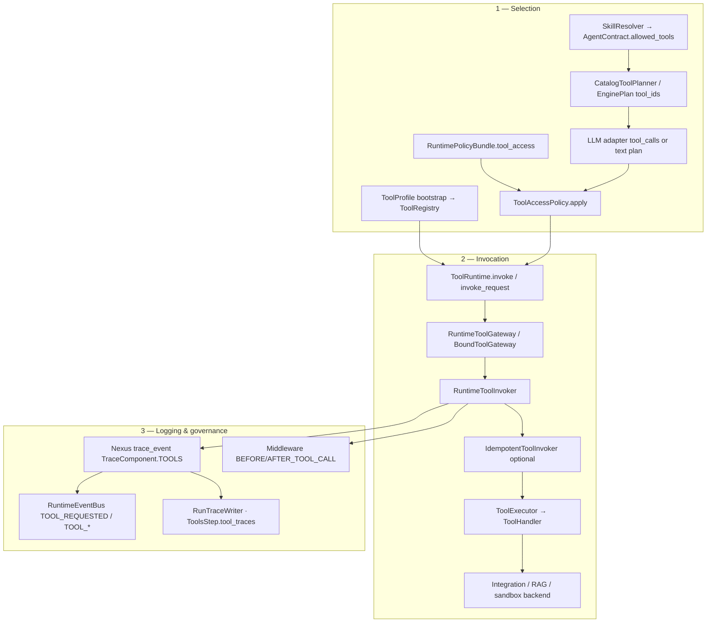

# Tools

**Status:** Canonical architecture (domain pair 1:1)  
**Hub:** [`intergrax_runtime_architecture.md`](../intergrax_runtime_architecture.md)  
**Plan (1:1):** [`plan/TOOLS.md`](../plan/TOOLS.md)  
**Target:** [`IDEAL_HARNESS_AI_ARCHITECTURE.md`](../guides/IDEAL_HARNESS_AI_ARCHITECTURE.md)  
**Audit layers:** 11  
---

---

# Intergrax Tool Library

**Last updated:** 2026-06-08 — **48 bundles** · **190 catalog tools** (verified via `register_default_tools()`)

The **Tool Library** (`intergrax/tools/`) is Intergrax’s modular catalog of **LLM-facing, agent-invokable capabilities**. Tools sit between agents and the [Integration Library](architecture/INTEGRATIONS.md): they expose semantic operations (JSON schemas, descriptions, risk metadata) while composing integration contracts and platform modules underneath.

**Related docs:**

| Document | Purpose |
|----------|---------|
| Phase **M-RAG** | [`plan/TOOLS.md`](../plan/TOOLS.md) — RAG engine phases M-RAG.1–M-RAG.17 |
| RAG stack canon | [`intergrax_runtime_architecture.md`](../intergrax_runtime_architecture.md) — Tier-0 retrieval architecture |
| [guides/EXTENSION_AUTHOR_GUIDE.md](../guides/EXTENSION_AUTHOR_GUIDE.md) | **External tool plugins** — `ToolPlugin`, entry points, MCP export |
| [intergrax/tools/USAGE.md](../../intergrax/tools/USAGE.md) | **Operational guide** — wire tools in Tier-3 apps and invoke from agents |
| [`intergrax_runtime_architecture.md`](../intergrax_runtime_architecture.md) §7.1.6–§7.1.7, §22 | Architecture canon — Tool Library, unified tool model |
| [`plan/TOOLS.md`](../plan/TOOLS.md) Phase O · **T-EXPAND** | Phase status, catalog expansion waves T1–T11 |
| [`plan/TOOLS.md`](../plan/TOOLS.md) Phase V | Architecture hardening: security/cost governance and evaluation discipline (`V-SEC.*`, `V-COST.*`, `V-EVAL.*`) |
| [INTEGRATIONS.md](INTEGRATIONS.md) | **167** backend adapters tools compose (not called directly by agents) |
| [guides/AGENT_CREATION_GUIDE.md](../guides/AGENT_CREATION_GUIDE.md) Appendix E | How agents declare `allowed_tools` vs applications wire backends |
| [NEXUS_EXECUTION_FLOW.md](NEXUS_EXECUTION_FLOW.md) §15 | Runtime narrative — tool **selection** flow (diagram) |
| [UNIFIED_EXECUTION_RUNTIME.md](UNIFIED_EXECUTION_RUNTIME.md) §42.12 | `ToolRuntime` enforcement — `ToolRequest`, `TOOL_*` events |
| [OBSERVABILITY.md](OBSERVABILITY.md) | Tool audit signals — `ops:tool_audit`, trace taxonomy |
| **This doc — [Tool execution pipeline](#tool-execution-pipeline)** | End-to-end select → invoke → log (canonical for audit §11) |

---

## Design principles

| Principle | What it means |
|-----------|---------------|
| **LLM-first contracts** | Every tool has `tool_id`, `description`, Pydantic `input_schema` / `output_schema` — optimized for model tool selection and MCP export. |
| **Compose integrations** | Handlers call `IssueTracker`, `SearchProvider`, RAG managers, etc. — never vendor SDKs. |
| **Single execution path** | All invocations route through `ToolRuntime` → `RuntimeToolInvoker` (trace, policy, idempotency). |
| **Plugin-native catalog** | Shipped and external bundles implement `ToolPlugin`; register via `register_tool_plugin()` or entry point `intergrax.tools`. Scaffold: `python -m intergrax.scaffold new-tool-bundle <bundle_id>`. |
| **Explicit registration** | Tier-3 calls `bootstrap_catalogs()` then `ToolProfile` + `ToolWiringContext`; agents never self-register tools. |
| **Unified model** | Platform capabilities (RAG, web search, Jira, sandbox) are **tools** — not parallel boolean flags (§7.1.7). |
| **Dual export** | Same `ToolContract` → OpenAI function schema, MCP tool, and `ToolRequest.tool_name`. |

---

## Four-layer stack

```text
Tier-2  Agent (skill_ids, allowed_tools, ToolRequest)
        │
        ▼
Tier-0  Skill Library (MVP Done) — composable packs: tool_ids + prompts + policy — see [architecture/SKILLS.md](architecture/SKILLS.md)
        │
        ▼
Tier-0  Tool Library (rag.retrieve, jira.search_tasks, …)
        │
        ▼
Tier-0  Integration Library (IssueTracker, SearchProvider, VectorStore, …)
```

Skills are **not** tools — see architecture §7.1.8. Catalog: [architecture/SKILLS.md](architecture/SKILLS.md).

**Agents declare tool_ids.** **Applications enable tools** via `ToolProfile` and inject integrations via `ToolWiringContext`. **Integrations** remain vendor-swappable without agent changes.

---

## How wiring works (Phase O.2)

```text
Tier-3 application (tool_wiring.py)
        │
        ├── IntegrationProfile.resolve()  ──►  ToolWiringContext.from_integration_profile()
        │
        ▼
ToolProfile(enabled=[...], enabled_bundles=[...])
        │
        ▼
bootstrap_catalogs()  ──►  register_default_tools()  ──►  build_registry_from_profile(profile, ctx)
        │
        ▼
ToolRegistry  ──►  RuntimeToolInvoker  ──►  Agent / CatalogToolPlanner / MCP
```

**Example — enable tools from catalog profile:**

```python
from intergrax.tools.registry import (
    ToolProfile,
    ToolWiringContext,
    build_registry_from_profile,
    register_default_tools,
)
from intergrax.integrations import IntegrationProfile, register_default_integrations

register_default_integrations()
register_default_tools()

profile = IntegrationProfile(issue_tracker="jira")
ctx = ToolWiringContext.from_integration_profile(profile)

registry = build_registry_from_profile(
    ToolProfile(enabled_bundles=["jira"]),
    ctx=ctx,
)
```

---

## Tool engine (implemented today)

Runtime tool engine (Phase O **Done** · **T-EXPAND Done** · **T14–T17 Done** — full **190-tool** catalog registered):

| Component | Path | Status |
|-----------|------|--------|
| `ToolContract` | `intergrax/tools/core/contracts.py` | **Done** — `ToolRiskLevel`, `ToolRetryPolicy`, metadata; invoker enforces timeout/retry |
| `ToolRegistry` | `intergrax/tools/registry/runtime.py` | **Done** |
| `ToolHandler` / `ToolExecutor` | `intergrax/tools/tool_executor.py` | **Done** |
| `ToolExecutionRequest` / `ToolExecutionResult` | `intergrax/tools/execution_models.py` | **Done** |
| `ToolProvider` protocol | `intergrax/tools/core/provider.py` | **Done** — accepts optional `ToolWiringContext` |
| `ToolCatalog` / `ToolProfile` / `ToolWiringContext` | `intergrax/tools/registry/` | **Done** — Phase O.2; typed integration slots + `TaskMemoryViewBinding` / `shadow_workspace` (T-EXPAND) |
| `runtime_bound_catalog` | `intergrax/runtime/nexus/tools/runtime_bound_catalog.py` | **Done** — UAEP dispatch for `workspace.*` / `memory.*` / `harness.*` (incl. compare/export) · §42.12 |
| `register_default_tools()` / `build_registry_from_profile()` | `intergrax/tools/registry/bootstrap.py`, `factory.py` | **Done** |
| `RuntimeToolInvoker` | `intergrax/runtime/nexus/tools/invoker.py` | **Done** — validation, trace, error mapping |
| `RuntimeToolGateway` | `intergrax/runtime/nexus/tools/tool_gateway.py` | **Done** — UAEP / §42.12 entry; `nexus.capability_plan` prefers `tool_ids` (e.g. `rag.retrieve`) over legacy `use_rag` booleans |
| `CatalogToolPlanner` (LLM planner) | `intergrax/runtime/nexus/tools/catalog_tool_planner.py` | **Done** — OpenAI schema from registry via `ToolPlanningService` |
| `ToolAccessPolicy` | `intergrax/runtime/nexus/tools/tool_access_policy.py` | **Done** |
| `resolve_allowed_tools_from_config` | `intergrax/runtime/policy/tool_policy_resolution.py` | **Done** — merges `RuntimePolicyBundle.tool_access` (`StaticToolScopePolicy`) into `ToolRuntime` / gateway |
| Legacy `ToolBase` | `intergrax/tools/tools_base.py` | **Deprecated** — use `ToolContract` (Phase O.7 Done) |

**Naming:** docs use **Tool engine** for the Tier-1 runtime stack below; **`ToolRuntime`** is the enforcement facade agents and Nexus MUST call (§42.12). Catalog types live in Tier-0 `intergrax/tools/`.

---

## Tool execution pipeline

The **tool engine** is the Tier-1 stack that **selects** which catalog tools may run, **invokes** them through a single policy-checked path, and **logs** every attempt. Agents and graph nodes never call handlers or integrations directly.

**Read order:** this section (manifest) → [`NEXUS_EXECUTION_FLOW.md`](NEXUS_EXECUTION_FLOW.md) §15–§17 (runtime sequence) → [`UNIFIED_EXECUTION_RUNTIME.md`](UNIFIED_EXECUTION_RUNTIME.md) §42.12 (contracts).



### Phase responsibilities

| Phase | Question answered | Primary components | Tier |
|-------|-------------------|-------------------|------|
| **1 — Selection** | Which tools exist and which may this run use? | `ToolProfile`, `SkillResolver`, `resolve_allowed_tools_from_config`, `CatalogToolPlanner`, `ToolPlanningService`, `ToolAccessPolicy` | Tier-3 bootstrap + Tier-1 |
| **2 — Invocation** | How is one tool call executed safely? | `ToolRuntime`, `RuntimeToolGateway`, `RuntimeToolInvoker`, `ToolExecutor`, `runtime_bound_catalog` | Tier-1 |
| **3 — Logging** | What happened, for audit and debug? | `trace_event`, `RuntimeEvent` (`TOOL_*`), security middleware, `RunTraceWriter`, `ToolsStep.tool_traces` | Tier-1 + observability |

### Entry paths (same invoker)

| Path | When used | Module |
|------|-----------|--------|
| **UAEP agent step** | Agent-local tool loop (`tools_mode`) | `ToolsStep` → `RuntimeToolInvoker` |
| **Capability plan** | Engine / Nexus plan with `tool_ids` | `ToolRuntime.invoke` → pipeline steps or catalog |
| **Graph / UAEP gateway** | Bound agent with `ToolRequest` | `RuntimeToolGateway` / `BoundToolGateway` |
| **Direct catalog context** | Nexus-internal bounded inject | `catalog_context.invoke_catalog_context_tool` |

All paths converge on **`RuntimeToolInvoker`** — registry lookup, input/output schema validation, `ToolScopePolicy`, timeout/retry, error mapping to `RuntimeErrorCode`, and trace start/end.

### Selection detail

1. **Bootstrap (host):** `ToolProfile` + `ToolWiringContext` → `build_registry_from_profile()` — only enabled tools exist in the registry ([How wiring works](#how-wiring-works-phase-o2)).
2. **Per run:** `SkillResolver` merges `skill_ids` → tool allow-list on `AgentContract`; `RuntimePolicyBundle.tool_access` may further restrict.
3. **Per step:** `CatalogToolPlanner` exports OpenAI function schemas from the filtered registry; LLM returns `tool_calls` or structured plan (`EnginePlan.tool_ids`).
4. **Pre-invoke filter:** `ToolAccessPolicy.apply()` intersects planned `tool_ids` with effective allow-list and optional `ModalityProfile`.

See [`REASONING_AND_COGNITION.md`](REASONING_AND_COGNITION.md) — cognition dimension **3 (Tool)**: `ToolPlanDecision` → `ToolRuntime`.

### Invocation detail

```text
ToolExecutionRequest(run_id, step_id, tool_id, input, idempotency_key)
    → RuntimeToolInvoker.invoke(state, agent_id, request)
        → ToolScopePolicy.is_allowed(agent_id, tool_id)  # deny → trace + ToolScopeViolationError
        → ToolRegistry.get_contract(tool_id)
        → validate input_schema / execute handler / validate output_schema
        → map exceptions → RuntimeErrorCode
        → optional ToolRetryPolicy (runtime-managed, not agent loop)
    → ToolExecutionResult(success, output | error)
```

`ToolRuntime.invoke_request(ToolRequest)` is the UAEP §42.12 contract surface; legacy pipeline booleans normalize to `tool_ids` before dispatch (Phase LEG **Done**).

### Logging detail

| Signal | Mechanism | When |
|--------|-----------|------|
| Step trace | `state.trace_event(component=TOOLS, step=tool_invocation_*)` | Every invoker attempt (incl. denied scope) |
| Runtime events | `TOOL_REQUESTED`, terminal `TOOL_COMPLETED` / `TOOL_FAILED` / `TOOL_DENIED` | §42.12 — gate: every invoke |
| Ops filter | `ops:tool_audit` hint on tool events | [`OBSERVABILITY.md`](OBSERVABILITY.md) |
| Agent loop summary | `ToolsStep` → `state.tool_traces` (`ToolCallTrace`) | Agent-local planner loop |
| Security | `MiddlewarePipeline` `BEFORE/AFTER_TOOL_CALL` | Injection defense (`ApplicationSecurityProfile`) |
| Persisted run | `RunTraceWriter` / lab `GET /debug/tasks/{id}/trace` | Full run post-mortem |

**Authoring:** [`AGENT_CREATION_GUIDE.md`](../guides/AGENT_CREATION_GUIDE.md) Appendix J · **Audit:** [`INTEGRAX_HARNESS_AUDIT_MAP.md`](../guides/INTEGRAX_HARNESS_AUDIT_MAP.md) §11.

---

## Catalog summary

| Metric | Count |
|--------|------:|
| Shipped bundles (`ToolPlugin`) | **48** |
| Registered `tool_id` values | **190** |
| Stable bundles | **47** |
| Beta bundles | **1** (`openai_vector_store`) |

**Bundle index (selected):** `interaction` (3) · `workflow` (5) · `harness` (6) · `websearch` (4) · `notify` (6) · `health` (11) · `eval` (7) · `collaboration` (7) · `hitl` (5) · `platform` (8) · `rag` (11) — full list in [Full tool index](#full-tool-index) below.

Source: `intergrax/tools/registry/shipped_plugins.py`.

---

## Catalog tools

Status legend: **Done** = registered handler in catalog. **Beta** = bundle status `ToolBundleStatus.BETA`.

### Context & retrieval

| tool_id | Status | Description | Composes |
|---------|--------|-------------|----------|
| `rag.retrieve` | **Done** | Hybrid retrieval + optional rerank via `RetrievalService` / `RagProfile` | `vectorstore_manager`, `embedding_manager`, optional `retrieval_service` |
| `rag.ingest_document` | **Done** | `IngestPipeline`: parse (catalog/handler registry) → chunk (strategy id) → embed → index | Same managers + optional `contextual_enricher` |
| `rag.delete_documents` | **Done** | Delete indexed vector chunks by document id | `vectorstore_manager` |
| `rag.describe_collection` | **Done** | Collection stats: document count + available collection names | `vectorstore_manager` |
| `websearch.query` | **Done** | Run web search and return normalized snippets | `websearch_executor` or `SearchProvider` |
| `websearch.read_url` | **Done** | Fetch a URL and return extracted title + plain text | `websearch` page fetch pipeline |
| `websearch.fetch_batch` | **Done** | Fetch multiple URLs and return combined context | `websearch` page fetch pipeline |
| `websearch.invalidate_cache` | **Done** | Invalidate cached web search query results | `WebSearchCacheBinding` on `websearch_executor` |
| `rag.list_collections` | **Done** | List vector index collection names | `vectorstore_manager` |
| `rag.list_documents` | **Done** | Paginated document id listing | `vectorstore_manager` + `VectorStoreDocumentListerBinding` |
| `rag.get_document` | **Done** | Fetch indexed document text/metadata by id | `vectorstore_manager` |
| `rag.check_index_status` | **Done** | Index readiness probe (count + collections) | `vectorstore_manager` |
| `rag.search_by_metadata` | **Done** | Metadata-only index scan (exact key/value filters) | `vectorstore_manager` + `VectorstoreIndexLifecycleBinding` |
| `rag.purge_collection` | **Done** | Controlled collection purge (dry-run + tenant scope) | `vectorstore_manager` |

**Catalog providers:** Phase O complete — all first-party tools registered; applications wire via `host/tool_wiring.py`.

**Ready-to-use hosts:** `lab_application`, `legal_application`, `research_application`, `poc_template_application` — see [`intergrax/tools/USAGE.md`](../intergrax/tools/USAGE.md).

**Product env flags:** `LEGAL_ENABLE_RAG` / `LEGAL_ENABLE_RAG_INGEST`, `RESEARCH_ENABLE_RAG` / `RESEARCH_ENABLE_RAG_INGEST` — wire vectorstore + embedding managers in `host/tool_wiring.py`.

### Execution & sandbox

| tool_id | Status | Description | Composes |
|---------|--------|-------------|----------|
| `sandbox.exec` | **Done** | Execute allowlisted operation in runtime sandbox | `sandbox_session` via `ToolWiringContext`; optional `sandbox_host` integration → `HostedSandboxSession` bridge (M.6 P6) |

### Security (M.6 P6)

| tool_id | Status | Description | Composes |
|---------|--------|-------------|----------|
| `security.scan` | **Done** | Scan container image or repository path for policy violations | `security_scanner` (`trivy`, `semgrep`, `snyk`) via `ToolWiringContext` |

### Workflow orchestration (M.6 P6)

| tool_id | Status | Description | Composes |
|---------|--------|-------------|----------|
| `workflow.trigger` | **Done** | Trigger a batch eval / RAG refresh workflow run | `workflow_orchestrator` (`prefect`, `airflow`) |
| `workflow.poll` | **Done** | Poll workflow run status | `workflow_orchestrator` |
| `workflow.fetch_logs` | **Done** | Fetch tail logs for a workflow run | `workflow_orchestrator` |
| `workflow.list_runs` | **Done** | List recent orchestrator runs (optional workflow filter) | `workflow_orchestrator` |
| `workflow.cancel_run` | **Done** | Cancel a running orchestrator run | `workflow_orchestrator` |

### Issue tracker (Jira)

| tool_id | Status | Description | Composes |
|---------|--------|-------------|----------|
| `jira.get_issue` | **Done** | Fetch single issue by key | `IssueTracker` (`jira` integration) |
| `jira.add_comment` | **Done** | Add comment to issue | `IssueTracker` |
| `jira.search_tasks` | **Done** | Search issues by project, status, assignee (builds JQL internally) | `IssueTracker` |

### Wiki / knowledge

| tool_id | Status | Description | Composes |
|---------|--------|-------------|----------|
| `confluence.get_page` | **Done** | Fetch wiki page content | `WikiKnowledge` |
| `confluence.search_pages` | **Done** | Search internal documentation | `WikiKnowledge` |
| `confluence.search` | **Done** | Alias of `confluence.search_pages` (shorter tool_id for LLM catalogs) | `WikiKnowledge` |

### Notifications (side-effect tools)

| tool_id | Status | Description | Composes |
|---------|--------|-------------|----------|
| `notify.send` | **Done** | Send outbound notification message | `NotificationChannel` |
| `notify.send_batch` | **Done** | Send up to 50 notification messages in one call | `NotificationChannel` |
| `notify.schedule` | **Done** (T10) | Schedule deferred notification delivery | `ScheduledNotificationBinding` |
| `notify.list_scheduled` | **Done** (T11) | List deferred notification schedules | `ScheduledNotificationBinding` |
| `notify.cancel_scheduled` | **Done** (T11) | Cancel a pending deferred notification | `ScheduledNotificationBinding` |

### Issue tracker (GitLab)

| tool_id | Status | Description | Composes |
|---------|--------|-------------|----------|
| `gitlab.create_issue` | **Done** | Create GitLab issue | `IssueTracker` (`gitlab`) |

### Observability (bundle **beta**)

| tool_id | Status | Description | Composes |
|---------|--------|-------------|----------|
| `metrics.query_instant` | **Done** | Instant metrics query | `ObservabilityBackend` (`prometheus`) |
| `logs.search` | **Done** | Search log index | `ObservabilityBackend` (`elasticsearch`, `opensearch`) |
| `observability.query_traces` | **Done** | Query LLM/agent traces | `ObservabilityBackend` (`langfuse`, `langsmith`, …) |
| `errors.capture` | **Done** | Report error events | `ObservabilityBackend` (`sentry`) |

### Eval logging

| tool_id | Status | Description | Composes |
|---------|--------|-------------|----------|
| `braintrust.log_eval` | **Done** | Log eval score | `ObservabilityBackend` (`braintrust`, role `eval`) |

### PagerDuty

| tool_id | Status | Description | Composes |
|---------|--------|-------------|----------|
| `pagerduty.trigger_incident` | **Done** | Trigger on-call incident | `NotificationChannel` (`pagerduty`) |
| `pagerduty.acknowledge_incident` | **Done** (T10) | Acknowledge incident by dedup key | `NotificationChannel` (`pagerduty`) |

### Speech (modality — Phase W-ML)

| tool_id | Status | Description | Composes |
|---------|--------|-------------|----------|
| `speech.synthesize` | **Done** | Text-to-speech synthesis | `SpeechProviderBackend` (`deepgram`, `elevenlabs`, …) via `ToolWiringContext.speech_provider` |
| `speech.transcribe` | **Done** | Speech-to-text transcription | `SpeechProviderBackend` |

### Vision (modality — Plane C)

| tool_id | Status | Description | Composes |
|---------|--------|-------------|----------|
| `vision.detect` | **Done** | Object detection (YOLO/ONNX backends) | `intergrax/model_inference/` + `ModalityInferenceExecutor` |
| `vision.segment` | **Done** | Image segmentation | `model_inference` registry |
| `vision.ocr_regions` | **Done** | OCR text regions from media | `model_inference` registry |

### Classical ML (modality)

| tool_id | Status | Description | Composes |
|---------|--------|-------------|----------|
| `ml.predict` | **Done** | Single prediction | `intergrax/model_inference/` |
| `ml.explain` | **Done** | Model explainability | `model_inference` |
| `ml.batch_predict` | **Done** | Batch inference | `model_inference` |

### OpenAI managed vector store (bundle **beta**, vendor-specific)

| tool_id | Status | Description | Composes |
|---------|--------|-------------|----------|
| `openai.file_search.query` | **Beta** | Query OpenAI hosted vector store (`file_search`) | OpenAI Responses API (not harness `rag.retrieve`) |
| `openai.vector_store.upload` | **Beta** | Upload folder files to OpenAI vector store | OpenAI Files API |
| `openai.vector_store.clear` | **Beta** | Clear all files from OpenAI vector store (destructive) | OpenAI vector store API |

See [openai_vector_store USAGE](../intergrax/tools/providers/openai_vector_store/USAGE.md).

### Composite observability (Phase M.10)

Harness lab uses **one primary** `observability_backend` (Sentry) plus **additional slugs** in `IntegrationProfile.options` (LangSmith). `ToolWiringContext.from_integration_profile()` builds `observability_backends`; each tool picks a backend by role (`errors`, `traces`, `logs`, `eval`) via `resolve_observability_backend()`. See [observability USAGE](../intergrax/tools/providers/observability/USAGE.md).

### Runtime-bound workspace & memory (T-EXPAND T1)

| tool_id | Status | Description | Composes |
|---------|--------|-------------|----------|
| `workspace.write_file` | **Done** | Write UTF-8 text into shadow workspace | `ToolWiringContext.shadow_workspace` or UAEP `exec_ctx.metadata["shadow_workspace"]` |
| `workspace.read_file` | **Done** | Read shadow workspace file | `ShadowWorkspace` |
| `workspace.list_files` | **Done** | List workspace artifacts | `ShadowWorkspace` |
| `workspace.snapshot` | **Done** | Point-in-time workspace snapshot | `ShadowWorkspace` |
| `workspace.delete_file` | **Done** | Delete a file from shadow workspace | `ShadowWorkspace` |
| `workspace.search` | **Done** | Grep/search text across workspace files | `ShadowWorkspace` |
| `workspace.export_artifact` | **Done** (T10) | Export shadow artifact to object storage | `ShadowWorkspace` + `ObjectStorage` |
| `workspace.import_artifact` | **Done** (T10) | Import object storage blob into shadow workspace | `ShadowWorkspace` + `ObjectStorage` |
| `memory.read` | **Done** | Read task memory record | `ToolWiringContext.memory_view` (`TaskMemoryViewBinding`) |
| `memory.write` | **Done** | Write/merge task memory | `PolicyScopedMemoryView` |
| `memory.list_keys` | **Done** | List keys in namespace | `PolicyScopedMemoryView` |
| `memory.delete_key` | **Done** (T10) | Delete task memory record | `PolicyScopedMemoryView` |

UAEP agents invoke `workspace.*` / `memory.*` via `BoundToolGateway` → `runtime_bound_catalog.py` (same pattern as `sandbox.exec`).

### Provider-agnostic integration bridges (T-EXPAND T1–T3)

| Bundle | tool_ids | Composes |
|--------|----------|----------|
| `knowledge` | `knowledge.get_page`, `knowledge.search` | `WikiKnowledge` (any wiki slug) |
| `document` | `document.parse`, `document.parse_preview` | `DocumentParser` — enable explicitly in `ToolProfile` (not auto-enabled from ingest-only profiles) |
| `browser` | `browser.fetch_page` | `BrowserAutomation` |
| `storage` | `storage.get`, `storage.put`, `storage.presigned_url`, `storage.delete`, `storage.exists` | `ObjectStorage` |
| `issues` | `issues.get_issue`, `issues.add_comment`, `issues.search`, `issues.create_issue` | `IssueTracker` + `IssueCreator` (provider-agnostic; complements `jira.*` / `gitlab.*`) |
| `platform` | `platform.get_secret`, `platform.evaluate_feature_flag`, `platform.get_workflow_run`, `platform.list_check_suites`, `platform.list_workflow_runs`, `platform.cancel_workflow_run` | `SecretsStore`, `FeatureFlagBackend`, `CiCdBackend` |
| `message_bus` | `message_bus.enqueue`, `message_bus.get_status`, `message_bus.get_result`, `message_bus.list_tasks`, `message_bus.cancel`, `message_bus.purge_completed` | `MessageBus` (`TaskQueue`) |
| `graph` | `graph.run_query`, `graph.get_node` | `GraphStore` |
| `collaboration` | `collaboration.send_mail`, `collaboration.list_messages`, `collaboration.get_message`, `collaboration.list_calendar`, `collaboration.get_user`, `collaboration.reply_message`, `collaboration.create_event` | `CollaborationSuite` |
| `cache` | `cache.get`, `cache.set` | `KeyValueCache` |
| `database` | `database.query`, `database.execute`, `database.describe_schema` | `RelationalStore` |
| `records` | `records.get`, `records.put`, `records.delete`, `records.query`, `records.describe_collection`, `records.count` | `DocumentStore` |
| `hitl` | `hitl.list_pending`, `hitl.get_decision`, `hitl.summarize_queue`, `hitl.submit_response`, `hitl.list_for_task` | `HumanDecisionStoreBinding` (runtime-bound) |
| `cloud_platform` | `cloud_platform.health`, `cloud_platform.resolve` | `CloudPlatform` |
| `vector_store` | `vector_store.count`, `vector_store.delete`, `vector_store.list_collections`, `vector_store.health` | `vectorstore_manager` |
| `interaction` | `interaction.list_sessions`, `interaction.get_last_input`, `interaction.get_session_history` | `SessionStorageBinding` (runtime-bound) |

`extend_tool_profile_for_integration()` auto-appends agent-facing tool_ids when matching `IntegrationCategory` slots are configured (`integration_tool_profile.py`). Infrastructure-only slots (e.g. `document_parser` for RAG ingest) are **not** auto-enabled.

---

## Tool metadata (contract — Phase O.1 Done)

| Field | Purpose | Status |
|-------|---------|--------|
| `tool_id` | Stable registry key and `ToolRequest.tool_name` | **Done** |
| `name` | Human-readable label | **Done** |
| `description` | LLM tool-selection text (required) | **Done** |
| `description_short` | Optional compact variant for large catalogs | **Done** |
| `input_schema` / `output_schema` | Pydantic models → JSON Schema export | **Done** |
| `risk_level` | `ToolRiskLevel`: LOW \| MEDIUM \| HIGH \| CRITICAL | **Done** |
| `side_effects` | Whether invocation mutates external state | **Done** |
| `injects_context` | When true, Nexus merges output into LLM prompt (§22.1) | **Done** — catalog shim in `catalog_context.py` |
| `timeout_ms` | Runtime-enforced ceiling via `RuntimeToolInvoker` | **Done** |
| `retry_policy` | `ToolRetryPolicy` — runtime-managed retries | **Done** |
| `error_mapping` | Exception type → `RuntimeErrorCode` | **Done** |
| `category` / `tags` | Filtering for large tool sets and MCP grouping | **Done** |

---

## Unified tool model vs legacy flags

| Legacy (deprecated) | Target (canonical) |
|---------------------|--------|
| `ToolInvocationPlan.use_rag` | `tool_ids=["rag.retrieve"]` |
| `ToolInvocationPlan.use_websearch` | `tool_ids=["websearch.query"]` |
| `ToolInvocationPlan.use_tools` | `use_tools=True` (`CatalogToolPlanner` over registry) |
| `LegalToolPlan.use_rag` / `use_websearch` | `tool_ids` + legacy booleans (auto-synced) |

**Rule:** No new platform capability flags — ship as catalog tools. Legacy booleans emit deprecation trace when used without explicit `tool_ids`. See §7.1.7 and Phase O.5 (**Done**).

---

## MCP export

Each application MAY mount catalog tools on MCP (`applications/<app>/mcp/server.py`). Implemented flow (Phase O.6):

```text
ToolRegistry (from wire_*_tools)
    → exporters.to_mcp_tools(contracts)
    → mount_catalog_tools_on_mcp (list_catalog_tools, describe_catalog_tool)
    → FastMCP server (alongside list_agents, run_agent)
```

OpenAI export: `intergrax.tools.exporters.to_openai_tools(registry)` — used by `CatalogToolPlanner` / `ToolPlanningService`.

---

## Full tool index

Alphabetical reference — all **150** first-party catalog tools (Phase O + M.6 P6 + W-ML + **T-EXPAND** + **T4** + **T5** + **T6** + **T7** + **T8** + **T9** + **T10**).

| tool_id | Bundle | Category | Status | Composes / module |
|---------|--------|----------|--------|-------------------|
| `braintrust.log_eval` | braintrust | observability | **Done** | `braintrust` — [USAGE](../intergrax/tools/providers/braintrust/USAGE.md) |
| `browser.fetch_page` | browser | browser | **Done** | `BrowserAutomation` |
| `cache.get` | cache | cache | **Done** | `KeyValueCache` |
| `cache.set` | cache | cache | **Done** | `KeyValueCache` |
| `cache.delete` | cache | cache | **Done** | `KeyValueCache` |
| `cache.list_keys` | cache | cache | **Done** | `KeyValueCacheListerBinding` (optional backend) |
| `cloud_platform.health` | cloud_platform | cloud_platform | **Done** (T11) | `CloudPlatform` |
| `cloud_platform.resolve` | cloud_platform | cloud_platform | **Done** (T11) | `CloudPlatform` |
| `billing.list_usage` | billing | billing | **Done** | `BillingMeterBackend` |
| `billing.record_usage` | billing | billing | **Done** | `BillingMeterBackend` |
| `cost.check_quota` | cost | cost | **Done** | V-COST quota models / runtime-bound |
| `cost.forecast_spend` | cost | cost | **Done** | V-COST.3 `build_cost_forecast_report` / runtime-bound |
| `cost.get_run_budget` | cost | cost | **Done** | `RunBudget` / runtime-bound |
| `collaboration.create_event` | collaboration | collaboration | **Done** | `CollaborationSuite` |
| `collaboration.get_message` | collaboration | collaboration | **Done** | `CollaborationSuite` |
| `collaboration.get_user` | collaboration | collaboration | **Done** | `CollaborationSuite` |
| `collaboration.list_calendar` | collaboration | collaboration | **Done** | `CollaborationSuite` |
| `collaboration.list_messages` | collaboration | collaboration | **Done** | `CollaborationSuite` |
| `collaboration.send_mail` | collaboration | collaboration | **Done** | `CollaborationSuite` |
| `collaboration.reply_message` | collaboration | collaboration | **Done** | `CollaborationSuite` |
| `crm.get_account` | crm | crm | **Done** | `CrmBackend` |
| `crm.list_contacts` | crm | crm | **Done** | `CrmBackend` |
| `crm.list_tickets` | crm | crm | **Done** | `CrmBackend` |
| `database.describe_schema` | database | database | **Done** | `RelationalStore` (sqlite introspection) |
| `database.execute` | database | database | **Done** | `RelationalStore` |
| `database.query` | database | database | **Done** | `RelationalStore` |
| `confluence.get_page` | confluence | wiki | **Done** | `confluence` — [USAGE](../intergrax/tools/providers/confluence/USAGE.md) |
| `document.parse` | document | document | **Done** | `DocumentParser` |
| `document.parse_preview` | document | document | **Done** | `DocumentParser` (bounded preview) |
| `filesystem.glob` | filesystem | filesystem | **Done** | allowlisted read roots |
| `filesystem.list` | filesystem | filesystem | **Done** | allowlisted read roots |
| `filesystem.read_text` | filesystem | filesystem | **Done** | allowlisted read roots |
| `filesystem.stat` | filesystem | filesystem | **Done** | allowlisted read roots |
| `filesystem.write_text` | filesystem | filesystem | **Done** | allowlisted read roots (write) |
| `eval.compare_releases` | eval | eval | **Done** | `OnlineEvaluationRegistry` (V-EVAL) |
| `eval.list_observations` | eval | eval | **Done** | `OnlineEvaluationRegistry` (V-EVAL) |
| `eval.record_observation` | eval | eval | **Done** | `OnlineEvaluationRegistry` (V-EVAL) |
| `eval.summarize_release` | eval | eval | **Done** | `OnlineEvaluationRegistry` (V-EVAL) |
| `eval.export_observations` | eval | eval | **Done** (T10) | `OnlineEvaluationRegistry` (V-EVAL) |
| `eval.judge` | eval | eval | **Done** (T13 / CRIT-V) | LLM-as-judge semantic scoring — `CriticProfile` |
| `eval.trajectory` | eval | eval | **Done** (T13 / CRIT-V) | Trajectory/process scoring from run trace |
| `confluence.search` | confluence | wiki | **Done** | `confluence` (alias) — [USAGE](../intergrax/tools/providers/confluence/USAGE.md) |
| `confluence.search_pages` | confluence | wiki | **Done** | `confluence` — [USAGE](../intergrax/tools/providers/confluence/USAGE.md) |
| `errors.capture` | observability | observability | **Done** | `sentry` — [USAGE](../intergrax/tools/providers/observability/USAGE.md) |
| `gitlab.create_issue` | gitlab | issue_tracker | **Done** | `gitlab` — [USAGE](../intergrax/tools/providers/gitlab/USAGE.md) |
| `graph.get_node` | graph | graph | **Done** | `GraphStore` |
| `graph.run_query` | graph | graph | **Done** | `GraphStore` |
| `harness.get_run` | harness | harness | **Done** | `RunTraceReader` / `trace_reader` ctx slot |
| `harness.get_run_cost` | harness | harness | **Done** | `RunTraceReader` / V-COST stats |
| `harness.get_run_events` | harness | harness | **Done** | `RunTraceReader` |
| `harness.list_runs` | harness | harness | **Done** | `RunTraceReader` |
| `harness.compare_runs` | harness | harness | **Done** | `RunTraceReader` / runtime-bound |
| `harness.export_run_bundle` | harness | harness | **Done** | `RunTraceReader` / runtime-bound |
| `health.check_integration` | health | health | **Done** | integration catalog health probes |
| `health.check_profile` | health | health | **Done** | `IntegrationProfile` slot probes |
| `health.check_object_storage` | health | health | **Done** (T12) | category slot probe |
| `health.check_key_value_cache` | health | health | **Done** (T12) | category slot probe |
| `health.check_message_bus` | health | health | **Done** (T12) | category slot probe |
| `health.check_graph_store` | health | health | **Done** (T12) | category slot probe |
| `health.check_identity_provider` | health | health | **Done** (T12) | category slot probe |
| `health.check_relational_store` | health | health | **Done** (T12) | category slot probe |
| `health.check_wiki_knowledge` | health | health | **Done** (T12) | category slot probe |
| `health.check_search_provider` | health | health | **Done** (T12) | category slot probe |
| `health.check_notification_channel` | health | health | **Done** (T12) | category slot probe |
| `hitl.get_decision` | hitl | hitl | **Done** | `HumanDecisionStoreBinding` |
| `hitl.list_for_task` | hitl | hitl | **Done** (T11) | `HumanDecisionStoreBinding` |
| `hitl.list_pending` | hitl | hitl | **Done** | `HumanDecisionStoreBinding` |
| `hitl.submit_response` | hitl | hitl | **Done** (T11) | `HumanDecisionStoreBinding` |
| `hitl.summarize_queue` | hitl | hitl | **Done** | `HumanDecisionStoreBinding` |
| `interaction.get_last_input` | interaction | interaction | **Done** | `SessionStorageBinding` |
| `interaction.list_sessions` | interaction | interaction | **Done** | `SessionStorageBinding` |
| `interaction.get_session_history` | interaction | interaction | **Done** (T10) | `SessionStorageBinding` |
| `issues.add_comment` | issues | issues | **Done** | `IssueTracker` |
| `issues.create_issue` | issues | issues | **Done** | `IssueCreator` |
| `issues.get_issue` | issues | issues | **Done** | `IssueTracker` |
| `issues.search` | issues | issues | **Done** | `IssueTracker` |
| `identity.get_user` | identity | identity | **Done** | `IdentityProviderBackend` |
| `identity.list_tenants` | identity | identity | **Done** | `IdentityProviderBackend` |
| `identity.verify_token` | identity | identity | **Done** | `IdentityProviderBackend` |
| `knowledge.get_page` | knowledge | knowledge | **Done** | `WikiKnowledge` |
| `knowledge.search` | knowledge | knowledge | **Done** | `WikiKnowledge` |
| `jira.add_comment` | jira | issue_tracker | **Done** | `jira` — [USAGE](../intergrax/tools/providers/jira/USAGE.md) |
| `jira.get_issue` | jira | issue_tracker | **Done** | `jira` — [USAGE](../intergrax/tools/providers/jira/USAGE.md) |
| `jira.search_tasks` | jira | issue_tracker | **Done** | `jira` — [USAGE](../intergrax/tools/providers/jira/USAGE.md) |
| `memory.list_keys` | memory | memory | **Done** | `TaskMemoryViewBinding` |
| `memory.read` | memory | memory | **Done** | `TaskMemoryViewBinding` |
| `memory.write` | memory | memory | **Done** | `TaskMemoryViewBinding` |
| `memory.delete_key` | memory | memory | **Done** (T10) | `TaskMemoryViewBinding` |
| `message_bus.cancel` | message_bus | message_bus | **Done** | `MessageBus` |
| `message_bus.enqueue` | message_bus | message_bus | **Done** | `MessageBus` |
| `message_bus.get_result` | message_bus | message_bus | **Done** | `MessageBus` |
| `message_bus.get_status` | message_bus | message_bus | **Done** | `MessageBus` |
| `message_bus.list_tasks` | message_bus | message_bus | **Done** | `MessageBus` |
| `message_bus.purge_completed` | message_bus | message_bus | **Done** (T10) | `MessageBus` (`TaskQueue.purge_completed`) |
| `logs.search` | observability | observability | **Done** | `elasticsearch` / `opensearch` — [USAGE](../intergrax/tools/providers/observability/USAGE.md) |
| `logs.tail` | observability | observability | **Done** | `elasticsearch` / `opensearch` — [USAGE](../intergrax/tools/providers/observability/USAGE.md) |
| `metrics.query_instant` | observability | observability | **Done** | `prometheus` — [USAGE](../intergrax/tools/providers/observability/USAGE.md) |
| `metrics.query_range` | observability | observability | **Done** | `prometheus` — [USAGE](../intergrax/tools/providers/observability/USAGE.md) |
| `ml.batch_predict` | ml | ml | **Done** | `intergrax/model_inference/` |
| `ml.explain` | ml | ml | **Done** | `model_inference` |
| `ml.predict` | ml | ml | **Done** | `model_inference` |
| `notify.send` | notify | notification | **Done** | `notification_channel` slug — [USAGE](../intergrax/tools/providers/notify/USAGE.md) |
| `notify.send_batch` | notify | notification | **Done** | `notification_channel` slug — [USAGE](../intergrax/tools/providers/notify/USAGE.md) |
| `notify.schedule` | notify | notification | **Done** (T10) | `ScheduledNotificationBinding` — [USAGE](../intergrax/tools/providers/notify/USAGE.md) |
| `notify.list_scheduled` | notify | notification | **Done** (T11) | `ScheduledNotificationBinding` — [USAGE](../intergrax/tools/providers/notify/USAGE.md) |
| `notify.cancel_scheduled` | notify | notification | **Done** (T11) | `ScheduledNotificationBinding` — [USAGE](../intergrax/tools/providers/notify/USAGE.md) |
| `notify.dispatch_due` | notify | notification | **Done** (T12) | Tier-0 scheduled notification dispatcher — [USAGE](../intergrax/tools/providers/notify/USAGE.md) |
| `platform.evaluate_feature_flag` | platform | platform | **Done** | `FeatureFlagBackend` |
| `platform.get_secret` | platform | platform | **Done** | `SecretsStore` |
| `platform.put_secret` | platform | platform | **Done** | `SecretsStore` (CRITICAL risk) |
| `platform.delete_secret` | platform | platform | **Done** | `SecretsStore` (CRITICAL risk) |
| `platform.get_workflow_run` | platform | platform | **Done** | `CiCdBackend` |
| `platform.cancel_workflow_run` | platform | platform | **Done** | `CiCdBackend` |
| `platform.list_workflow_runs` | platform | platform | **Done** | `CiCdBackend` |
| `observability.query_traces` | observability | observability | **Done** | `langfuse` / observability slug — [USAGE](../intergrax/tools/providers/observability/USAGE.md) |
| `openai.file_search.query` | openai_vector_store | retrieval | **Beta** | OpenAI `file_search` — [USAGE](../intergrax/tools/providers/openai_vector_store/USAGE.md) |
| `openai.vector_store.clear` | openai_vector_store | retrieval | **Beta** | OpenAI vector store API — [USAGE](../intergrax/tools/providers/openai_vector_store/USAGE.md) |
| `openai.vector_store.upload` | openai_vector_store | retrieval | **Beta** | OpenAI Files API — [USAGE](../intergrax/tools/providers/openai_vector_store/USAGE.md) |
| `pagerduty.trigger_incident` | pagerduty | notification | **Done** | `pagerduty` — [USAGE](../intergrax/tools/providers/pagerduty/USAGE.md) |
| `pagerduty.acknowledge_incident` | pagerduty | notification | **Done** (T10) | `pagerduty` adapter — [USAGE](../intergrax/tools/providers/pagerduty/USAGE.md) |
| `rag.check_index_status` | rag | retrieval | **Done** | `vectorstore_manager` — [USAGE](../intergrax/tools/providers/rag/USAGE.md) |
| `rag.delete_documents` | rag | retrieval | **Done** | `vectorstore_manager` — [USAGE](../intergrax/tools/providers/rag/USAGE.md) |
| `rag.describe_collection` | rag | retrieval | **Done** | `vectorstore_manager` — [USAGE](../intergrax/tools/providers/rag/USAGE.md) |
| `rag.get_document` | rag | retrieval | **Done** | `vectorstore_manager` — [USAGE](../intergrax/tools/providers/rag/USAGE.md) |
| `rag.ingest_document` | rag | retrieval | **Done** | `vectorstore_manager`, `embedding_manager` — [USAGE](../intergrax/tools/providers/rag/USAGE.md) |
| `rag.list_collections` | rag | retrieval | **Done** | `vectorstore_manager` — [USAGE](../intergrax/tools/providers/rag/USAGE.md) |
| `rag.purge_collection` | rag | retrieval | **Done** | `vectorstore_manager` — [USAGE](../intergrax/tools/providers/rag/USAGE.md) |
| `rag.search_by_metadata` | rag | retrieval | **Done** | `vectorstore_manager` — [USAGE](../intergrax/tools/providers/rag/USAGE.md) |
| `records.describe_collection` | records | records | **Done** | `DocumentStore` |
| `records.delete` | records | records | **Done** | `DocumentStore` |
| `records.get` | records | records | **Done** | `DocumentStore` |
| `records.put` | records | records | **Done** | `DocumentStore` |
| `records.query` | records | records | **Done** | `DocumentStore` |
| `records.count` | records | records | **Done** (T10) | `DocumentStore` |
| `rag.retrieve` | rag | retrieval | **Done** | `vectorstore_manager`, `embedding_manager` — [USAGE](../intergrax/tools/providers/rag/USAGE.md) |
| `rag.rerank` | rag | retrieval | **Done** | `reranker_manager` / `RerankProvider` |
| `sandbox.exec` | sandbox | sandbox | **Done** | `sandbox_session` / `sandbox_host` — [USAGE](../intergrax/tools/providers/sandbox/USAGE.md) |
| `storage.delete` | storage | storage | **Done** | `ObjectStorage` |
| `storage.get` | storage | storage | **Done** | `ObjectStorage` |
| `storage.presigned_url` | storage | storage | **Done** | `ObjectStorage` |
| `storage.put` | storage | storage | **Done** | `ObjectStorage` |
| `storage.exists` | storage | storage | **Done** (T10) | `ObjectStorage` |
| `security.scan` | security | security | **Done** | `security_scanner` (`trivy`, `semgrep`, `snyk`) |
| `security.summarize_findings` | security | security | **Done** | pure aggregation (no backend) |
| `speech.synthesize` | speech | speech | **Done** | `SpeechProviderBackend` |
| `speech.transcribe` | speech | speech | **Done** | `SpeechProviderBackend` |
| `vision.detect` | vision | vision | **Done** | `model_inference` (Plane C) |
| `vision.ocr_regions` | vision | vision | **Done** | `model_inference` |
| `vision.segment` | vision | vision | **Done** | `model_inference` |
| `vector_store.count` | vector_store | vector_store | **Done** (T11) | `vectorstore_manager` |
| `vector_store.delete` | vector_store | vector_store | **Done** (T11) | `vectorstore_manager` |
| `vector_store.health` | vector_store | vector_store | **Done** (T11) | `vectorstore_manager` |
| `vector_store.list_collections` | vector_store | vector_store | **Done** (T11) | `vectorstore_manager` |
| `websearch.fetch_batch` | websearch | retrieval | **Done** | page fetch pipeline — [USAGE](../intergrax/tools/providers/websearch/USAGE.md) |
| `websearch.query` | websearch | retrieval | **Done** | `websearch_executor`, `search_provider` — [USAGE](../intergrax/tools/providers/websearch/USAGE.md) |
| `websearch.read_url` | websearch | retrieval | **Done** | page fetch — [USAGE](../intergrax/tools/providers/websearch/USAGE.md) |
| `websearch.invalidate_cache` | websearch | retrieval | **Done** | `WebSearchCacheBinding` — [USAGE](../intergrax/tools/providers/websearch/USAGE.md) |
| `workflow.cancel_run` | workflow | workflow | **Done** | `workflow_orchestrator` |
| `workflow.fetch_logs` | workflow | workflow | **Done** | `workflow_orchestrator` |
| `workflow.poll` | workflow | workflow | **Done** | `workflow_orchestrator` |
| `workflow.trigger` | workflow | workflow | **Done** | `workflow_orchestrator` |
| `workflow.list_runs` | workflow | workflow | **Done** | `workflow_orchestrator` |
| `workspace.delete_file` | workspace | workspace | **Done** | `ShadowWorkspace` |
| `workspace.list_files` | workspace | workspace | **Done** | `ShadowWorkspace` |
| `workspace.read_file` | workspace | workspace | **Done** | `ShadowWorkspace` |
| `workspace.search` | workspace | workspace | **Done** | `ShadowWorkspace` |
| `workspace.snapshot` | workspace | workspace | **Done** | `ShadowWorkspace` |
| `workspace.write_file` | workspace | workspace | **Done** | `ShadowWorkspace` |
| `workspace.export_artifact` | workspace | workspace | **Done** (T10) | `ShadowWorkspace` + `ObjectStorage` |
| `workspace.import_artifact` | workspace | workspace | **Done** (T10) | `ShadowWorkspace` + `ObjectStorage` |

### Agent builder essentials (T-EXPAND T14–T17)

| tool_id | Status | Description | Composes |
|---------|--------|-------------|----------|
| `catalog.list_tools` | **Done** (T14) | List tools in current `ToolRegistry` | `ToolRegistry` (registration-time ref) |
| `catalog.describe_tool` | **Done** (T14) | Describe one tool contract + JSON schemas | `ToolRegistry` |
| `agent.list_agents` | **Done** (T14) | List registered agent ids | `AgentRegistryBinding` |
| `agent.get_contract` | **Done** (T14) | Serialized `AgentContract` metadata | `AgentRegistryBinding` |
| `skill.resolve` | **Done** (T14) | Resolve `skill_ids` → tool/prompt/policy pack | `SkillResolverBinding` |
| `code.exec` | **Done** (T15) | Run Python in sandbox (`run_python` op) | `SandboxSession` |
| `script.run` | **Done** (T15) | Run allowlisted script in sandbox root | `SandboxSession` |
| `browser.run` | **Done** (T15) | Fetch page via `BrowserAutomation` or sandbox fallback | `BrowserAutomation` / sandbox |
| `sandbox.list_operations` | **Done** (T15) | List allowlisted sandbox operations | `SandboxSession.manifest()` |
| `ltm.search` | **Done** (T16) | Search user long-term memory | `UserProfileManagerBinding` |
| `ltm.write_fact` | **Done** (T16) | Write governed LTM fact (`MemoryKind`) | `UserProfileManagerBinding` |
| `memory.search` | **Done** (T16) | Substring search in task memory namespace | `TaskMemoryViewBinding` |
| `context.summarize` | **Done** (T16) | Trim/compress text to token budget | `ContextBudgetPolicy` |
| `context.estimate_tokens` | **Done** (T16) | Char→token estimate for budgeting | `context_budget.estimate_tokens` |
| `http.request` | **Done** (T17) | Allowlisted HTTP call | `HttpClientBackend` |
| `interaction.post_reply` | **Done** (T17) | Outbound reply with thread/session metadata | `NotificationChannel` |
| `issues.update_issue` | **Done** (T17) | Update issue status/assignee/summary | `IssueTracker` + `IssueUpdater` |
| `rag.preview_retrieval` | **Done** (T17) | Dry-run retrieval (no full context inject) | `RetrievalService` |

**Total:** 190 tools · 48 bundles.

---

## Adding a new tool

1. Add handler under `intergrax/tools/providers/<domain>/` — subclass `ServiceToolHandler` (or `WiringContextToolHandler` for custom logic); put business logic in `service.py`.
2. Compose existing integration contracts — add integration provider first if missing.
3. Register in `register_default_tools()` (Phase O.2).
4. Add unit tests under `tests/unit/tools/providers/<domain>/`.
5. Add `providers/<domain>/USAGE.md` (English).
6. Update this catalog and Phase O tracker in the implementation plan.
7. Wire in one Tier-3 application via `ToolProfile` + `ToolWiringContext`.

Delivery checklist: [plan/TOOLS.md) — Phase O.4 workflow.

---

## Tests

Tool runtime regression (existing):

```bash
uv run pytest tests/unit/runtime/tools/ tests/unit/tools/ -q
```

Catalog conformance (Phase O.4+):

```bash
uv run pytest tests/unit/tools/providers/ -q
```

For harness hardening streams, additionally run adversarial and governance-focused checks
when available in Phase V (`V-SEC.*`, `V-COST.*`, `V-EVAL.*`) before release cut.

