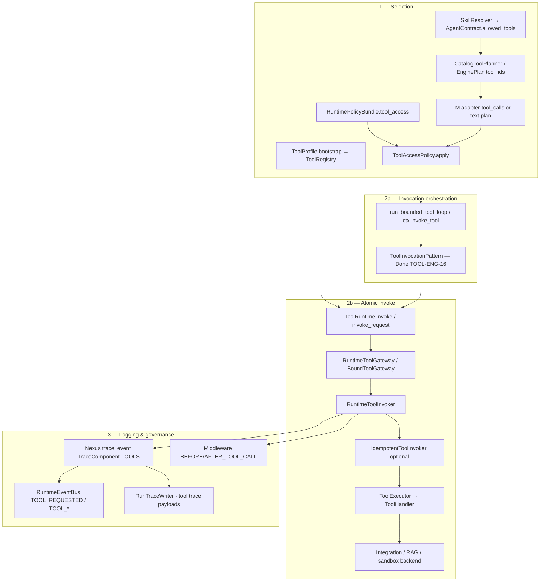

# Tools

**Status:** Canonical architecture (domain pair 1:1)  
**Hub:** [`intergrax_runtime_architecture.md`](../intergrax_runtime_architecture.md)  
**Plan (1:1):** [`plan/TOOLS.md`](../plan/TOOLS.md)  
**Target:** [`IDEAL_HARNESS_AI_ARCHITECTURE.md`](../guides/IDEAL_HARNESS_AI_ARCHITECTURE.md)  
**Audit layers:** 11  
**Audit instruction:** [`audit/TOOLS.md`](../audit/TOOLS.md)  
---

## Cursor read scope (token budget)

**Do not read this entire file in one session** (TOOLS canon).

- **Implement / audit default:** ToolRuntime path + plugin model + policy invoke (hub § through production posture). Selection / invocation patterns: [`arch/TOOLS_selection_and_plugins.md`](arch/TOOLS_selection_and_plugins.md). RuntimeConfig fields: [`arch/TOOLS_runtime_config_reference.md`](arch/TOOLS_runtime_config_reference.md).
- **Use** table of contents below — `Read` with offset/limit per §.
- **Plan hub:** [`plan/TOOLS.md`](../plan/TOOLS.md) (scoped §6 only).
- **Audit slice:** [`guides/audit_slices/TOOLS.md`](../guides/audit_slices/TOOLS.md).
- **Max reads:** at most **one** file >5k tokens per session unless RESUME cites more.

---


## Architecture satellites (read on demand)

Large § blocks moved out of the architecture hub to reduce Cursor context use.
Load **only** the satellite matching your task or cited §.

| Satellite | Contents |
|-----------|----------|
| [`arch/TOOLS_selection_and_plugins.md`](arch/TOOLS_selection_and_plugins.md) | selection, plugins, invocation patterns |
| [`arch/TOOLS_runtime_config_reference.md`](arch/TOOLS_runtime_config_reference.md) | runtime config reference |

> **Cursor context budget:** read hub read-scope block + **at most one** satellite per session.

---

# Intergrax Tool Library

**Last updated:** 2026-06-19 (interactive audit revalidation) — **48 bundles** · **200 catalog tools** · selection modes: [§Production strategies](#tool-selection-modes-production-strategies) · invocation patterns: [§Invocation patterns](#tool-invocation-patterns-production-orchestration) · engine audit: [§Production posture](#tool-engine-production-posture-2026-06-10) · [§Execution surfaces](#execution-surfaces-matrix) · completion sprints: [`plan/TOOLS.md`](../plan/TOOLS.md#layer-completion-sprints-2026-06-12)

The **Tool Library** (`intergrax/tools/`) is Intergrax’s modular catalog of **LLM-facing, agent-invokable capabilities**. Tools sit between agents and the [Integration Library](architecture/INTEGRATIONS.md): they expose semantic operations (JSON schemas, descriptions, risk metadata) while composing integration contracts and platform modules underneath.

**Related docs:**

| Document | Purpose |
|----------|---------|
| Phase **M-RAG** | [`plan/RAG.md`](../plan/RAG.md) — RAG engine phases M-RAG.1–M-RAG.22 |
| RAG stack canon | [`intergrax_runtime_architecture.md`](../intergrax_runtime_architecture.md) — Tier-0 retrieval architecture |
| [guides/EXTENSION_AUTHOR_GUIDE.md](../guides/EXTENSION_AUTHOR_GUIDE.md) | **External tool plugins** — `ToolPlugin`, entry points, MCP export |
| [intergrax/tools/USAGE.md](../../intergrax/tools/USAGE.md) | **Operational guide** — wire tools in Tier-3 apps and invoke from agents |
| [`intergrax_runtime_architecture.md`](../intergrax_runtime_architecture.md) §7.1.6–§7.1.7, §22 | Architecture canon — Tool Library, unified tool model |
| [`plan/TOOLS.md`](../plan/TOOLS.md) Phase O · **T-EXPAND** | Phase status, catalog expansion waves T1–T11 (**closed**) |
| [`plan/TOOLS.md`](../plan/TOOLS.md) Phase **TOOL-ENG** | **Closed** (2026-06-12) — tool engine hardening + layer completion S0–S8 · **Full Harness LC** (2026-06-17) |
| [`plan/TOOLS.md`](../plan/TOOLS.md) Phase V | Architecture hardening: security/cost governance and evaluation discipline (`V-SEC.*`, `V-COST.*`, `V-EVAL.*`) |
| [INTEGRATIONS.md](INTEGRATIONS.md) | **167** backend adapters tools compose (not called directly by agents) |
| [guides/AGENT_CREATION_GUIDE.md](../guides/AGENT_CREATION_GUIDE.md) Appendix E | How agents declare `allowed_tools` vs applications wire backends |
| [NEXUS_EXECUTION_FLOW.md](NEXUS_EXECUTION_FLOW.md) §15 | Runtime narrative — tool **selection** flow (diagram) |
| [UNIFIED_EXECUTION_RUNTIME.md](UNIFIED_EXECUTION_RUNTIME.md) §42.12 | `ToolRuntime` enforcement — `ToolRequest`, `TOOL_*` events |
| [OBSERVABILITY.md](OBSERVABILITY.md#observability-event-spine) | Tool audit on runtime spine — `TOOL_*` events, `ops:tool_audit`, [event ownership rules](OBSERVABILITY.md#event-ownership-rules) |
| **This doc — [Tool execution pipeline](#tool-execution-pipeline)** | End-to-end select → invoke → log (canonical for audit §11) |

---

## Design principles

| Principle | What it means |
|-----------|---------------|
| **LLM-first contracts** | Every tool has `tool_id`, `description`, Pydantic `input_schema` / `output_schema` — optimized for model tool selection and MCP export. |
| **Compose integrations** | Handlers call `IssueTracker`, `SearchProvider`, RAG managers, etc. — never vendor SDKs. |
| **Single execution path** | All invocations route through `ToolRuntime` → `RuntimeToolInvoker` (trace, policy, idempotency). |
| **Plugin-native catalog** | Shipped and external bundles implement `ToolPlugin`; register via `register_tool_plugin()` or entry point `intergrax.tools`. Scaffold: `python -m intergrax.scaffold new-tool-bundle <bundle_id>`. |
| **Explicit registration** | Tier-3 calls `bootstrap_catalogs()` then `ToolProfile` + `ToolWiringContext`; agents never self-register tools. |
| **Unified model** | Platform capabilities (RAG, web search, Jira, sandbox) are **tools** — not parallel boolean flags (§7.1.7). |
| **Dual export** | Same `ToolContract` → OpenAI function schema, MCP tool, and `ToolRequest.tool_name`. |

---

## Four-layer stack

```text
Tier-2  Agent (skill_ids, allowed_tools, ToolRequest)
        │
        ▼
Tier-0  Skill Library (MVP Done) — composable packs: tool_ids + prompts + policy — see [architecture/SKILLS.md](architecture/SKILLS.md)
        │
        ▼
Tier-0  Tool Library (rag.retrieve, jira.search_tasks, …)
        │
        ▼
Tier-0  Integration Library (IssueTracker, SearchProvider, VectorStore, …)
```

Skills are **not** tools — see architecture §7.1.8. Catalog: [architecture/SKILLS.md](architecture/SKILLS.md).

**Agents declare tool_ids.** **Applications enable tools** via `ToolProfile` and inject integrations via `ToolWiringContext`. **Integrations** remain vendor-swappable without agent changes.

---

## How wiring works (Phase O.2)

```text
Tier-3 application (tool_wiring.py)
        │
        ├── IntegrationProfile.resolve()  ──►  ToolWiringContext.from_integration_profile()
        │
        ▼
ToolProfile(enabled=[...], enabled_bundles=[...])
        │
        ▼
bootstrap_catalogs()  ──►  register_default_tools()  ──►  build_registry_from_profile(profile, ctx)
        │
        ▼
ToolRegistry  ──►  RuntimeToolInvoker  ──►  Agent / CatalogToolPlanner / MCP
```

**Example — enable tools from catalog profile:**

```python
from intergrax.tools.registry import (
    ToolProfile,
    ToolWiringContext,
    build_registry_from_profile,
    register_default_tools,
)
from intergrax.integrations import IntegrationProfile, register_default_integrations

register_default_integrations()
register_default_tools()

profile = IntegrationProfile(issue_tracker="jira")
ctx = ToolWiringContext.from_integration_profile(profile)

registry = build_registry_from_profile(
    ToolProfile(enabled_bundles=["jira"]),
    ctx=ctx,
)
```

---

## Tool engine (implemented today)

Runtime tool engine (Phase O **Done** · **T-EXPAND Done** · **T14–T17 Done** — full **190-tool** catalog registered):

| Component | Path | Status |
|-----------|------|--------|
| `ToolContract` | `intergrax/tools/core/contracts.py` | **Done** — `ToolRiskLevel`, `ToolRetryPolicy`, metadata; invoker enforces timeout/retry |
| `ToolRegistry` | `intergrax/tools/registry/runtime.py` | **Done** |
| `ToolHandler` / `ToolExecutor` | `intergrax/tools/tool_executor.py` | **Done** |
| `ToolExecutionRequest` / `ToolExecutionResult` | `intergrax/tools/execution_models.py` | **Done** |
| `ToolProvider` protocol | `intergrax/tools/core/provider.py` | **Done** — accepts optional `ToolWiringContext` |
| `ToolCatalog` / `ToolProfile` / `ToolWiringContext` | `intergrax/tools/registry/` | **Done** — Phase O.2; typed integration slots + `TaskMemoryViewBinding` / `shadow_workspace` (T-EXPAND) |
| `runtime_bound_catalog` | `intergrax/runtime/nexus/tools/runtime_bound_catalog.py` | **Done** — UAEP dispatch for `workspace.*` / `memory.*` / `harness.*` (incl. compare/export) · §42.12 |
| `register_default_tools()` / `build_registry_from_profile()` | `intergrax/tools/registry/bootstrap.py`, `factory.py` | **Done** |
| `RuntimeToolInvoker` | `intergrax/runtime/nexus/tools/invoker.py` | **Done** — validation, trace, error mapping |
| `RuntimeToolGateway` | `intergrax/runtime/nexus/tools/tool_gateway.py` | **Done** — capability aliases + registered catalog `tool_id` via `catalog_dispatch` (TOOL-ENG-2) |
| `catalog_dispatch` | `intergrax/runtime/nexus/tools/catalog_dispatch.py` | **Done** — per-id plan dispatch + gateway invoke (TOOL-ENG-1/2) |
| `BoundToolGateway` | `intergrax/runtime/nexus/tools/uaep_tool_gateway.py` | **Done** — UAEP §42.12 facade: `sandbox.exec` + 18 runtime-bound ids; catalog `tool_id`s delegate to `RuntimeToolGateway` (ADR-TOOL-001 · TOOL-ENG-2) |
| `CatalogToolPlanner` (LLM planner) | `intergrax/runtime/nexus/tools/catalog_tool_planner.py` | **Done** — OpenAI schema from registry via `ToolPlanningService` ([§Multi-tool execution](#multi-tool-execution-semantics)) |
| `ToolPlanningService` | `intergrax/runtime/nexus/tools/tool_planning_service.py` | **Done** — native `generate_with_tools` or JSON fallback; `allowed_tool_ids` filter (TOOL-ENG-4) |
| `tool_planner_input` | `intergrax/runtime/nexus/tools/tool_planner_input.py` | **Done** — `tools_context_scope` assembly (TOOL-ENG-11) |
| `tool_selection` | `intergrax/runtime/nexus/tools/tool_selection.py` | **Done** — `ToolSelectionStrategy` router (TOOL-ENG-5/26/31/32) |
| `tool_loop` | `intergrax/runtime/nexus/tools/tool_loop.py` | **Done** — delegates to `ToolInvocationPattern` (TOOL-ENG-6,22) |
| `plan_context_invocation` | `intergrax/runtime/nexus/tools/plan_context_invocation.py` | **Done** — RAG/websearch/tools context for `ToolRuntime` (replaces retired pipeline steps) |
| `ToolInvocationPattern` | `intergrax/runtime/nexus/tools/tool_invocation_pattern.py` | **Done** — protocol + `pattern_for_mode()` (TOOL-ENG-16,21) · ADR-TOOL-003 |
| `SinglePassPattern` / `BoundedReactPattern` / `ParallelBatchPattern` | `intergrax/runtime/nexus/tools/patterns/` | **Done** — shipped orchestration (TOOL-ENG-17,18,9) |
| `ToolInvocationAggregate` | `intergrax/runtime/nexus/tools/tool_invocation_aggregate.py` | **Done** — batch merge (TOOL-ENG-29) |
| `IdempotentToolInvoker` | `intergrax/runtime/tools/idempotent_invoker.py` | **Done** — exactly-once for `side_effects` + `idempotency_key` |
| `catalog_context` | `intergrax/runtime/nexus/tools/catalog_context.py` | **Done** — `rag.retrieve` / `websearch.query` dispatch via `plan_context_invocation` |
| `ToolAccessPolicy` | `intergrax/runtime/nexus/tools/tool_access_policy.py` | **Done** — plan-level filter (`ToolInvocationPlan`); modality intersect |
| `StaticToolScopePolicy` | `intergrax/runtime/tools/scope_policy.py` | **Done** — wired via `config.tool_scope_policy` in `RuntimeContext.build()` (TOOL-ENG-3) |
| `resolve_allowed_tools_from_config` | `intergrax/runtime/policy/tool_policy_resolution.py` | **Done** — merges `RuntimePolicyBundle.tool_access` into `ToolRuntime` / gateway |
| Legacy `ToolBase` | `intergrax/tools/tools_base.py` | **Deprecated** — use `ToolContract` (Phase O.7 Done) |

**Naming:** docs use **Tool engine** for the Tier-1 runtime stack below; **`ToolRuntime`** is the enforcement facade agents and Nexus MUST call (§42.12). Catalog types live in Tier-0 `intergrax/tools/`.

---

## Tool execution pipeline

The **tool engine** is the Tier-1 stack that **selects** which catalog tools may run, **invokes** them through a single policy-checked path, and **logs** every attempt. Agents and graph nodes never call handlers or integrations directly.

**Read order:** this section (manifest) → [`NEXUS_EXECUTION_FLOW.md`](NEXUS_EXECUTION_FLOW.md) §15–§17 (runtime sequence) → [`UNIFIED_EXECUTION_RUNTIME.md`](UNIFIED_EXECUTION_RUNTIME.md) §42.12 (contracts).



### Phase responsibilities

| Phase | Question answered | Primary components | Tier |
|-------|-------------------|-------------------|------|
| **1 — Selection** | Which tools exist and which may this run use? | `ToolProfile`, `SkillResolver`, `resolve_allowed_tools_from_config`, `ToolSelectionStrategy`, `CatalogToolPlanner`, `ToolPlanningService`, `ToolAccessPolicy` | Tier-3 bootstrap + Tier-1 |
| **2a — Orchestration** | How is a **plan batch** executed (single / parallel / chain / ReAct)? | `ToolInvocationPattern` **Done** (TOOL-ENG-16) via `run_bounded_tool_loop` / `resolve_invocation_pattern()` | Tier-1 |
| **2b — Atomic invoke** | How is **one** tool call executed safely? | `ToolRuntime`, `RuntimeToolGateway`, `RuntimeToolInvoker`, `ToolExecutor`, `runtime_bound_catalog` | Tier-1 |
| **3 — Logging** | What happened, for audit and debug? | `trace_event`, `RuntimeEvent` (`TOOL_*`), security middleware, `RunTraceWriter`, agent/tool trace metadata — **must** use spine ([`OBSERVABILITY.md`](OBSERVABILITY.md#observability-event-spine); no private tool trace stores) | Tier-1 + observability |

### Entry paths — convergence on invoker

| Path | When used | Dispatch module | Reaches `RuntimeToolInvoker`? |
|------|-----------|-----------------|-------------------------------|
| **ACP `ctx.invoke_tool`** | Agent `on_next_step` / cognitive patterns (ReAct, etc.) | `BoundToolGateway` → `RuntimeToolGateway` | **Yes** — per `tool_id` on allow-list |
| **ToolRuntime catalog context** | `enable_rag` / `enable_websearch` or explicit `tool_ids` | `plan_context_invocation` + `catalog_context` | **Yes** — `rag.retrieve` / `websearch.query` |
| **Bounded tool loop** | ReAct / pattern with `max_tool_iterations > 1` | `tool_loop.run_bounded_tool_loop` | **Yes** — native tool-call rounds |
| **Capability `ToolRuntime.invoke`** | Legacy capability aliases (`use_rag`, `use_tools`) | `ToolRuntime` plan dispatch | **Partial** — prefer explicit `tool_ids` |
| **Engine plan tool_ids** | Nexus `EngineBackedNexusPlanner` node metadata | `ToolRuntime` via graph/agent host | **Yes** — when host wires planner output |
| **Tests / internal** | Unit tests, provider conformance | Direct `RuntimeToolInvoker.invoke` | **Yes** |

All successful catalog executions converge on **`RuntimeToolInvoker`** (optionally wrapped by **`IdempotentToolInvoker`**) — registry lookup, input/output schema validation, optional `ToolScopePolicy`, timeout/retry, error mapping, trace start/end.

Multi-call batches route through **`run_bounded_tool_loop`** / **`ctx.invoke_tool`**, which resolve and delegate to a configured **`ToolInvocationPattern`** before `RuntimeToolInvoker` (see [§Invocation patterns](#tool-invocation-patterns-production-orchestration)).

### Selection detail (layers)

| Layer | Mechanism | What it filters | Applied when |
|-------|-----------|-----------------|--------------|
| **L0 Host catalog** | `ToolProfile` + `build_registry_from_profile()` | Which tools exist in runtime `ToolRegistry` | `RuntimeContext.build()` |
| **L1 Agent contract** | `AgentContract.allowed_tools` | Declared agent capability | Graph / UAEP bind |
| **L2 Skill packs** | `SkillResolver` → `tool_ids` on contract | Composed allow-list | Agent registration |
| **L3 Policy bundle** | `RuntimePolicyBundle.tool_access` (`StaticToolScopePolicy`) | Tier-3 static scope | `resolve_allowed_tools_from_config` |
| **L4 Modality** | `ModalityProfile` → `filter_tool_ids_by_modality_profile` | Media/ML plane tools | `ToolAccessPolicy.apply_modality_profile` |
| **L5 Plan filter** | `ToolAccessPolicy.apply` on `ToolInvocationPlan` | `use_rag` / `use_websearch` / `tool_ids` / `use_tools` | `ToolRuntime.invoke` |
| **L6 Schema narrowing** | `ToolSelectionStrategy` → `resolve_planner_allowed_tool_ids` | Subset passed to `ToolPlanningService` / `to_openai_tools` (see [§Production strategies](#tool-selection-modes-production-strategies)) | `run_bounded_tool_loop` / `ctx.invoke_tool` (TOOL-ENG-5) |
| **L6b LLM planner** | `ToolPlanningService` → `generate_with_tools` | Model picks `tool_calls` from narrowed schema | `CatalogToolPlanner` |
| **L7 Invoker scope** | `ToolScopePolicy.is_allowed` on `RuntimeToolInvoker` | Per-call deny | **Done** — `scope_policy` from `RuntimeConfig` (TOOL-ENG-3) |

See [`REASONING_AND_COGNITION.md`](REASONING_AND_COGNITION.md) — cognition Plane 3 (Tool): `ToolPlanDecision` ≠ `AgentDecision` (§42.7).

### Invocation detail

```text
ToolExecutionRequest(run_id, step_id, tool_id, input, idempotency_key)
    → [optional] IdempotentToolInvoker (side_effects + idempotency_key)
    → RuntimeToolInvoker.invoke(state, agent_id, request)
        → ToolScopePolicy.is_allowed(agent_id, tool_id)   # when wired; else skipped
        → ToolRegistry.get(tool_id)
        → validate input_schema
        → ToolExecutor → ToolHandler → integration backend
        → validate output_schema (strict isinstance)
        → ToolRetryPolicy on contract (runtime-managed; agents MUST NOT retry)
    → ToolExecutionResult(success, output | error)
```

`ToolRuntime.invoke_request(ToolRequest)` is the UAEP §42.12 surface; routes **sandbox**, **runtime-bound** ids, **capability aliases**, and **catalog `tool_id`s** via `BoundToolGateway` → `RuntimeToolGateway` (TOOL-ENG-2 **Done** · ADR-TOOL-001).

### Logging detail

| Signal | Mechanism | When |
|--------|-----------|------|
| Step trace | `state.trace_event(component=TOOLS, step=tool_invocation_*)` | Every invoker attempt (incl. denied scope) |
| Idempotency | `idempotency_cache_hit` trace step | Deduped side-effect replay |
| Runtime events | `TOOL_REQUESTED`, `TOOL_COMPLETED` / `TOOL_FAILED` / `TOOL_DENIED` | §42.12 |
| Ops filter | `ops:tool_audit` hint on tool events | [`OBSERVABILITY.md`](OBSERVABILITY.md) |
| Agent loop summary | `run_bounded_tool_loop` / `ctx.invoke_tool` → `state.tool_traces` (`ToolCallTrace`) | Single-pass planner |
| Budget | `enforce_tool_call_budget` → `BudgetEnforcer.check_tool_calls` | After each tool trace |
| Security | `MiddlewarePipeline` `BEFORE/AFTER_TOOL_CALL` | Guardrails / injection scan |
| Persisted run | `RunTraceWriter` / lab trace API | Post-mortem |

**Authoring:** [`AGENT_CREATION_GUIDE.md`](../guides/AGENT_CREATION_GUIDE.md) Appendix J · **Audit:** [`INTEGRAX_HARNESS_AUDIT_MAP.md`](../guides/INTEGRAX_HARNESS_AUDIT_MAP.md) §11 · **Engine work:** [`plan/TOOLS.md`](../plan/TOOLS.md) Phase **TOOL-ENG**.

---

## Tool engine production posture (2026-06-10)

Full-stack audit of **Tier-0 catalog + Tier-1 tool engine** (selection → invoke → verify → log). Distinct from AUDIT-IDEAL-11.* (catalog sandbox/MCP/lint — **Done**).

### Maturity matrix

| Area | Posture | Notes |
|------|---------|-------|
| **Tier-0 catalog** (`ToolContract`, plugins, 190 tools) | **Production** | Contracts, exporters, provider tests, integration composition |
| **Single invoke** (`RuntimeToolInvoker`) | **Production** | Schema, timeout, retry, trace, idempotency wrapper |
| **Pipeline tool step** (`run_bounded_tool_loop` / `ctx.invoke_tool`) | **Done** | Planner wired; bounded loop via `tool_loop_step` (TOOL-ENG-6 · ADR-TOOL-002) |
| **Planner wiring** (`CatalogToolPlanner`) | **Done** | `wire_catalog_tool_planner_if_enabled` in `planner_bootstrap.py` (TOOL-ENG-0) |
| **Multi-tool / ReAct loop** | **Done** | `max_tool_iterations` + native `role=tool` chain (TOOL-ENG-6) |
| **Invocation pattern plugin** (`ToolInvocationPattern`) | **Production** | All shipped modes + `DeterministicChainPattern` (TOOL-ENG-16–24,28) |
| **Invoker test regression** (`modality_tool_trace`) | **Done** | TOOL-ENG-TEST.1 (S0) |
| **Deterministic tool chains** (output→input) | **Done** | `ToolChainSpec` + `DeterministicChainPattern` (TOOL-ENG-20) |
| **Parallel tool execution** | **Done** | `ParallelBatchPattern` + `max_parallel_tool_calls` (TOOL-ENG-9) |
| **Parallel semantic batch** | **Done** | `ParallelSemanticBatchPattern` (TOOL-ENG-25) |
| **Standard selection** (full schema → LLM) | **Production** | `FullCatalogSelectionStrategy` + `ToolPlanningService` (TOOL-ENG-0/4/5) |
| **Pre-filter selection** (keyword / skill / static) | **Production** | `ToolSelectionStrategy` — static, `skill_pack`, `retrieval_top_k` / `keyword_top_k` |
| **Semantic tool index** | **Done** | `ToolCatalogEmbedder` + `SEMANTIC` mode (TOOL-ENG-13) |
| **Hierarchical tool selection** | **Done** | Deterministic category→tool passes; optional LLM category pass opt-in (`tool_selection_hierarchical_llm_pass`, TOOL-MAINT-01b) |
| **`tool_ids` plan dispatch** | **Done** | `catalog_dispatch.invoke_catalog_tool_ids` (TOOL-ENG-1) |
| **§42.12 gateway** | **Done** | Catalog `tool_id` → invoker (TOOL-ENG-2); runtime-bound + sandbox unchanged |
| **`tool_scope_policy` wiring** | **Done** | `RuntimeToolInvoker` in `RuntimeContext.build()` (TOOL-ENG-3) |
| **Post-tool verification** | **Done** | `run_post_tool_verify` trace + enforce block (TOOL-ENG-7); optional L1 critic via CVL |
| **AHI dynamic tool modes** | **Done** | `ToolEngineHook` + `recommend_tool_modes` (TOOL-ENG-10) |
| **Observability** | **Production** | Selection + pattern diag, budget ticks, `tool_traces` (TOOL-ENG-27/32) |

**Strategic focus (2026-06-12):** Phase **TOOL-ENG** **closed** — maintenance via gate scripts; deferred: hierarchical LLM pass, optional L1 critic on tool output.

---
