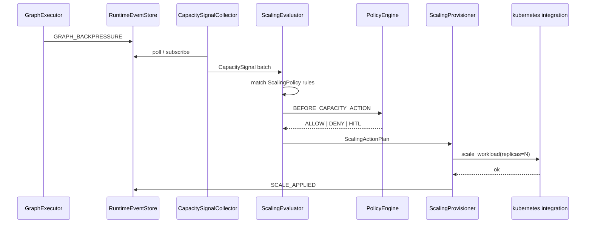

# ELASTIC_CAPACITY_AND_SCALING — §8+ extended architecture

**Parent hub:** [`ELASTIC_CAPACITY_AND_SCALING.md`](../ELASTIC_CAPACITY_AND_SCALING.md)

## 8. Tier placement and responsibility matrix

| Concern | Tier-0 | Tier-1 ECP | Tier-2 Agent | Tier-3 Application |
|---------|--------|------------|--------------|-------------------|
| Integration adapters (K8s, Celery bus) | **defines** | consumes | — | selects in profile |
| `ScalingPolicy` / `ScalingAction` contracts | defines | evaluates + orchestrates | — | configures |
| Signal collection | metrics backends | `CapacitySignalCollector` | — | webhook thresholds |
| Provision execution | tool handlers | `ScalingProvisioner` | — | — |
| In-process limits | — | may **raise ceiling** via profile patch | — | `OrchestrationProfile` caps |
| Deploy manifests (Helm, HPA YAML) | — | — | — | **owns** `applications/*/docker/` |
| Domain load patterns | — | — | may inform signals | product SLOs |

### 8.1 What ECP MUST NOT do

- Embed Kubernetes/nginx YAML generation in Nexus
- Scale inside `GraphExecutor` synchronous path
- Replace K8s HPA for raw CPU/memory without Harness-specific signals
- Add agents to `AgentRegistry` dynamically as “scaling”
- Bypass `PolicyEngine` for production scale-up

### 8.2 What applications MUST NOT do

- Call cloud APIs directly from Tier-3 host code for routine scaling
- Fork parallel capacity controllers outside ECP
- Set infinite `max_inflight_nodes` instead of provisioning replicas

---

## 9. Domain boundaries

```text
ELASTIC_CAPACITY_AND_SCALING  →  how much capacity (replicas, workers, ceilings)
ORCHESTRATION                 →  when/order/retry within capacity (graph, scheduler)
REASONING_AND_COGNITION       →  what agents/steps (plan topology)
INTEGRATIONS                  →  how to talk to K8s, queues, nginx (adapters)
OBSERVABILITY                 →  SLI storage + alert; feeds ECP signals
ADAPTIVE_HARNESS_INTELLIGENCE →  profile tuning recommendations (optional input)
TIER3_APPLICATION_ENVIRONMENT →  deploy package, ScalingProfile host wiring
```

---

## 10. Signal model

### 10.1 Primary signals (v1 target)

| Signal ID | Source (as-built) | Normalized field | Scale implication |
|-----------|-------------------|------------------|-----------------|
| `SIG_BACKPRESSURE` | `RuntimeEventType.GRAPH_BACKPRESSURE` | events/min per tenant | Raise ceiling or add replicas |
| `SIG_QUEUE_DEPTH` | `intergrax/queueing/task_index.py` | pending task count | Add async workers |
| `SIG_TASK_LATENCY` | trace / Prometheus SLI | p95 task duration | Add replicas |
| `SIG_SLO_BREACH` | W-OPS SLO catalog | boolean + budget burn | Scale + page |
| `SIG_COST_PRESSURE` | `cost_budget.py` | normalized spend rate | Scale-down or block scale-up |
| `SIG_MODALITY_QUEUE` | Celery modality executor | pending modality jobs | Modality worker pool |

### 10.2 HarnessOutcomeSignal bridge (optional)

[`ADAPTIVE_HARNESS_INTELLIGENCE.md`](ADAPTIVE_HARNESS_INTELLIGENCE.md) `HarnessOutcomeSignal` may include step/retry/parallel efficiency — ECP MAY consume as **secondary** signal; AHI does not provision infrastructure by default.

### 10.3 Signal contract

**As-built** (`intergrax/runtime/capacity/contracts.py` — ECP-1.2):

```python
class CapacitySignal(BaseModel):
    signal_id: str
    target: ScalingTarget
    metric_name: str
    value: float
    collected_at: datetime
```

**Target enrichment (ECP-PROD.1):** `tenant_id`, `source`, `unit`, `window_seconds`, `metadata` for multi-tenant fairness and PromQL windows.

---

## 11. ScalingPolicy and rules engine

### 11.1 Policy structure (target)

```text
ScalingPolicy:
    policy_id: str
    enabled: bool
    targets: list[ScalingTarget]      # deployment, worker_pool, orchestration_ceiling
    rules: list[ScalingRule]
    cooldown_seconds: int
    max_scale_up_step: int
    max_scale_down_step: int

ScalingRule:
    rule_id: str
    trigger: SignalTrigger | ScheduleTrigger | EventTrigger
    conditions: list[ScalingCondition]   # tenant, risk, time window, min replicas
    actions: list[ScalingAction]
    priority: int
```

### 11.2 Trigger types

| Trigger | Example |
|---------|---------|
| **Signal threshold** | `SIG_BACKPRESSURE > 10/min for 5m` |
| **Schedule** | Scale up 08:00 UTC weekdays |
| **Event** | `SLO_BREACH` runtime event |
| **Composite** | queue depth AND latency |

### 11.3 Condition examples

| Condition | Purpose |
|-----------|---------|
| `tenant_id in allowlist` | Noisy neighbor isolation |
| `replicas < max_replicas` | Hard cap |
| `cost_budget_remaining > 0` | FinOps gate |
| `application_profile == production` | Stricter HITL |

---

## 12. Scaling actions and integration surface

### 12.1 Action types

| Action | Integration path | Status (as-built) |
|--------|------------------|-------------------|
| `SCALE_K8S_DEPLOYMENT` | `kubernetes` cloud_platform → workload replicas | **Scaffold** — works with injected client; default factory has no scale API (ECP-PROD.3) |
| `SCALE_CELERY_WORKERS` | `celery` message_bus → worker pool | **Stub** — `pass` in provisioner (ECP-PROD.4) |
| `RAISE_ORCHESTRATION_CEILING` | Patch `OrchestrationProfile.max_inflight_nodes` | **Stub** — not applied (ECP-PROD.5) |
| `SCALE_MODALITY_POOL` | `ModalityExecutionProfile` / W-OPS.12 Celery env | **Manual** — operator env; not ECP loop |
| `NGINX_UPSTREAM_ADJUST` | — | **Cancelled** (ADR-SCALE-002) |
| `NOTIFY_ONLY` | `notification_channel` | **Not wired** in ECP evaluator |
| `REQUEST_HITL` | HITL queue | **Partial** — `hitl_required` plan status; no approval queue (ECP-PROD.6) |

### 12.2 Tool surface (target Tier-0)

| Tool id | Risk | Purpose |
|---------|------|---------|
| `capacity.scale_deployment` | High | LLM-callable only when policy allows; prefer ECP internal |
| `capacity.get_signals` | Low | Read-only diagnostics |

Agents **MUST NOT** invoke high-risk scale tools by default — ECP control plane only unless explicit Tier-3 policy.

### 12.3 Kubernetes integration (as-built)

**Live K8s soak runbook (ECP-MAINT-02):** manual operator workflow — run `uv run pytest tests/unit/runtime/capacity/test_ecp_depth_gate.py -q`, then validate cluster scale via `ScalingProvisioner` against staging deployment; export evidence to `build/capacity/k8s_soak_report.json` (operator-maintained artifact; not blocking PR CI).

**Ingress bridge (ECP-MAINT-03):** nginx/ingress integration slug owned by [`INT-MAINT-04`](../plan/INTEGRATIONS.md#61av-harness-implementation-queue--integrations-audit-maintenance-planned).

| Attribute | Value |
|-----------|-------|
| Slug | `kubernetes` |
| Category | `cloud_platform` |
| Status | Beta |
| Module | `integrations/providers/cloud_platform/kubernetes/` |
| Today | `create_kubernetes_cloud_platform()` — **health-only default client**; `KubernetesCloudPlatform.scale_workload` / `get_replicas` delegate to **injected** client |
| Target (ECP-PROD.3) | REST scale subresource on default factory when `INTERGRAX_KUBERNETES_*` configured |

**Plan reference:** [`plan/INTEGRATIONS.md`](../plan/INTEGRATIONS.md) H-INT-5 M-P4.20 — extend for scale API (ECP-4.* cross-ref).

### 12.4 nginx / ingress (not in catalog)

No `nginx` slug exists today. Target: **`ingress_controller`** or **`nginx`** under `cloud_platform` or dedicated category — load balancer upstream weight / replica registration (ECP-6.*).

---

## 13. Relationship to orchestration backpressure

[`ORCHESTRATION.md`](ORCHESTRATION.md) and [`NEXUS_EXECUTION_FLOW.md`](NEXUS_EXECUTION_FLOW.md) §9 define **in-process** limits:

| Control | Source | Event |
|---------|--------|-------|
| `max_parallel_nodes` | `OrchestrationProfile` | Semaphore within graph batch |
| `max_inflight_nodes` | `OrchestrationProfile` | `GRAPH_BACKPRESSURE` when saturated |

```python
# graph_executor.py — emits when inflight cap hit
RuntimeEventType.GRAPH_BACKPRESSURE
# hint: ops:backpressure
```

**Division of labor:**

| Mechanism | Scope |
|-----------|-------|
| Backpressure | **Throttle** within fixed replica |
| ECP | **Add replicas** or raise ceiling when throttling persists |

Recommended escalation:

```text
1. GRAPH_BACKPRESSURE sustained → ECP evaluates
2. If replicas < max AND policy allows → SCALE_K8S_DEPLOYMENT
3. Else if ceiling headroom → RAISE_ORCHESTRATION_CEILING (bounded)
4. Else → NOTIFY_ONLY + HITL
```

---

## 14. Relationship to queueing and workers

Tier-0 async plane — [`ORCHESTRATION.md`](ORCHESTRATION.md) §49:

| Module | Role |
|--------|------|
| `intergrax/queueing/` | Task index, worker registry, dispatcher |
| `intergrax/queueing/providers/celery/` | Celery task queue |
| `intergrax/queueing/providers/kafka/`, `rabbitmq/` | Broker workers |
| `intergrax/distributed/` | Rate limiter, distributed locks |

Workers consume logical tasks via `register_dispatcher_task` — **fixed pool** unless operator or ECP scales Celery workers.

**ECP target:** correlate `task_index` depth with worker count; emit `SCALE_CELERY_WORKERS` when depth exceeds threshold for N windows.

**Modality Celery scale-out (as-built):** W-OPS.12 — `INTERGRAX_MODALITY_EXECUTION=celery` documented in [`guides/HARNESS_ENVIRONMENT.md`](../guides/HARNESS_ENVIRONMENT.md). ECP generalizes this pattern beyond modality.

---

## 15. Relationship to Adaptive Harness Intelligence

| System | Role | Interaction with ECP |
|--------|------|----------------------|
| **AHI** | Proposes profile changes (routing, `max_parallel_nodes`) | May emit proposal → ECP executes if approved |
| **ECP** | Provisions infrastructure capacity | Consumes signals; may apply ceiling changes AHI recommends |

**Default:** AHI **RECOMMEND** only; ECP **APPLY** for infra mutations. Converged path requires explicit `AdaptiveProfile` + `ScalingProfile` linkage (ECP-8.* optional).

**Rejected:** AHI directly calling K8s API — violates tier separation and audit envelope.

---

## 16. ScalingProfile (Tier-3)

**As-built** on `ApplicationEnvironmentProfile` (ECP-1.1 — `environment_profile.py`):

```python
class ScalingProfile(BaseModel):
    policy: ScalingPolicy = Field(default_factory=ScalingPolicy)  # enabled=False by default
    production_adapters_enabled: bool = False  # gates InMemory probe adapters
```

`ScalingPolicy` holds `rules`, `require_hitl_for_scale_up`, `max_actions_per_hour`. Replica min/max and ceiling deltas remain **Tier-3 Helm/HPA** until ECP-PROD adds profile fields.

**Wiring:** `applications/_shared/scaling_wiring.py` → `CapacityScheduler` when `policy.enabled=true`; lab host attaches scheduler to factory lifespans (`lab_application/host/factory.py`). **Default:** disabled — external K8s HPA / Celery autoscale remain operator path.

**Production adapters:** `production_capacity_wiring.py` exercises **in-memory** K8s/Celery probes for AUDIT-IDEAL-30.4 gate — not live cluster APIs (see ECP-PROD.3–4).

---

## 17. Governance, policy, and HITL

| Risk class | Default gate |
|------------|--------------|
| Scale-up production replicas | HITL or pre-approved policy window |
| Scale-down | Automatic with hysteresis; alert on breach |
| Ceiling raise | Policy MODIFY; max delta per ADR-SCALE-001 |
| Cross-tenant scale | Forbidden — tenant-scoped signals only |

**Policy hooks (target):** `BEFORE_CAPACITY_ACTION`, `AFTER_CAPACITY_ACTION` — analogous to FLOW-11 planning hooks.

**Cost:** integrate `RuntimePolicyBundle.budget` — block scale-up when budget exhausted ([`UNIFIED_EXECUTION_RUNTIME.md`](UNIFIED_EXECUTION_RUNTIME.md) cost section).

---

## 18. Observability and trace contracts

| Event (target) | Phase | Hint | Payload |
|----------------|-------|------|---------|
| `CAPACITY_SIGNAL_COLLECTED` | observe | `ops:capacity` | signal name, value |
| `SCALE_EVALUATED` | evaluate | `ops:capacity` | matched rules |
| `SCALE_REQUESTED` | govern | `ops:capacity` | action plan |
| `SCALE_APPROVED` / `SCALE_DENIED` | govern | `ops:hitl` | policy result |
| `SCALE_APPLIED` | provision | `ops:capacity` | integration result |
| `SCALE_FAILED` | provision | `ops:alert` | error, rollback hint |

**As-built related events:**

| Event | Hint |
|-------|------|
| `GRAPH_BACKPRESSURE` | `ops:backpressure` |

**Metrics (target ECP-OBS.*):** `harness_capacity_signal_*`, `harness_scale_actions_total`, `harness_replica_count`.

**SLO linkage:** W-OPS SLO catalog in [`guides/HARNESS_ENVIRONMENT.md`](../guides/HARNESS_ENVIRONMENT.md) — breach triggers ECP rules.

---

## 19. Failure taxonomy and anti-flapping

| Class | Code | Behavior |
|-------|------|----------|
| Signal unavailable | `ECP-SIGNAL-MISSING` | Skip evaluation; alert if prolonged |
| Rule conflict | `ECP-RULE-CONFLICT` | Highest priority wins; log others |
| Policy deny | `ECP-POLICY-DENY` | No action; trace |
| Provisioner error | `ECP-PROVISION-FAIL` | Retry with backoff; no duplicate scale |
| Cooldown active | `ECP-COOLDOWN` | Suppress action |
| Flapping detected | `ECP-FLAP-GUARD` | Freeze scale-down; notify |
| Max replicas hit | `ECP-CAP-MAX` | NOTIFY_ONLY |
| HITL timeout | `ECP-HITL-TIMEOUT` | Fail safe — no scale |

**Anti-flapping:** separate up/down thresholds; minimum stable window; max actions per hour per target.

---

## 20. End-to-end capacity loop



**Scheduler:** `CapacityScheduler` — async cron / event-driven (never blocks `NexusLoop`).

---

## 21. As-built vs target

| Capability | As-built (2026-06-12) | Target phase |
|------------|----------------------|--------------|
| In-process backpressure | **Production** — `max_inflight_nodes`, `GRAPH_BACKPRESSURE` | Maintain |
| Queue workers | **Production** — fixed pool; Celery/Kafka/RabbitMQ | ECP-PROD.4 autoscale |
| K8s integration | **Beta** — health default; scale via injected client only | ECP-PROD.3 REST scale |
| Modality Celery scale-out | **Manual** — W-OPS.12 env | ECP-PROD.4 |
| SLO catalog | **Done** — W-OPS.4 | ECP-PROD.1 Prom bridge |
| ScalingProfile | **Shipped** — disabled default | ECP-PROD enablement |
| CapacitySignalCollector | **Scaffold** — gate tests; no live event bus wire | ECP-PROD.1 |
| ScalingEvaluator | **Scaffold** — unit/gate | ECP-PROD.2 HITL-safe scheduler |
| ScalingProvisioner | **Scaffold** — K8s mock path; Celery/ceiling stub | ECP-PROD.3–5 |
| nginx integration | **Cancelled** | — |
| Trace events | **Partial** — `SCALE_*` in tests; `GRAPH_BACKPRESSURE` live | ECP-PROD.7 prod emit |
| Production autoscaling | **Not shipped** | **ECP-PROD** |

---

## 22. Maturity scorecard and gap register

| Area | Score (L0–L4) | Status |
|------|---------------|--------|
| In-process concurrency limits | L3 | **Production** (ORCH/FLOW backpressure) |
| Async queue plane | L3 | **Production** (fixed worker pools) |
| Observability SLIs | L3 | **Production** (W-OPS) |
| ECP architecture & contracts | L3 | **Done** (ECP-DOC + ECP-DEPTH scaffold) |
| Declarative ScalingProfile | L2 | Shipped; **disabled** default; not driving fleet |
| Harness elastic control loop (live) | **L3** | Backpressure bridge, HITL queue, scheduler, E2E gate |
| Infra scale adapters (K8s/Celery) | **L3** | K8s REST when `INTERGRAX_KUBERNETES_URL`; Celery adapter wired |
| Load balancer integration | L0 | Cancelled (ADR-SCALE-002) |
| **Overall ECP production elasticity** | **L3** | Operator enables `ScalingProfile`; complements K8s HPA / Celery autoscale |

### 22.1 Open gap register (ECP-PROD)

| ID | Gap | Priority |
|----|-----|----------|
| ECP-PROD.1 | Wire `GRAPH_BACKPRESSURE` + `task_index` depth → `CapacitySignalCollector` on hosts | **Done** (backpressure bus; queue depth optional hook) |
| ECP-PROD.2 | `CapacityScheduler` must not apply actions when `hitl_required` / `denied` | **Done** |
| ECP-PROD.3 | K8s default factory: REST `scale` subresource when `INTERGRAX_KUBERNETES_URL` set | **Done** |
| ECP-PROD.4 | Celery provisioner: real worker scale via integration adapter | **Done** |
| ECP-PROD.5 | `RAISE_ORCHESTRATION_CEILING` applies bounded profile patch | **Done** |
| ECP-PROD.6 | HITL approval queue for scale-up (not status-only) | **Done** |
| ECP-PROD.7 | Integration test: sustained backpressure → scale action (mock K8s) | **Done** |
| AUDIT-IDEAL-30.4 | Live cluster adapters (beyond in-memory CI probe) | **Done** (URL-gated) |

**FAUDIT-32 §30** (Operational Excellence) — SLOs **production**; **elastic closed-loop** **L3** when profile enabled.

All tasks: [`plan/ELASTIC_CAPACITY_AND_SCALING.md`](../plan/ELASTIC_CAPACITY_AND_SCALING.md).

---

## 23. Related documents

| Document | Relationship |
|----------|--------------|
| [`ORCHESTRATION.md`](ORCHESTRATION.md) §49 | Scheduler, queueing, backpressure |
| [`NEXUS_EXECUTION_FLOW.md`](NEXUS_EXECUTION_FLOW.md) §9 | Graph concurrency, `GRAPH_BACKPRESSURE` |
| [`OBSERVABILITY.md`](OBSERVABILITY.md) §9.3 | Data plane scale-out (not compute) |
| [`INTEGRATIONS.md`](INTEGRATIONS.md) | K8s, Celery, Prometheus slugs |
| [`MODALITY.md`](MODALITY.md) | Worker pool / Celery modality |
| [`ADAPTIVE_HARNESS_INTELLIGENCE.md`](ADAPTIVE_HARNESS_INTELLIGENCE.md) | Profile tuning vs provisioning |
| [`TIER3_APPLICATION_ENVIRONMENT.md`](TIER3_APPLICATION_ENVIRONMENT.md) | Deploy manifests, host profiles |
| [`REASONING_AND_COGNITION.md`](REASONING_AND_COGNITION.md) | Agent topology (dimension B) |
| [`guides/HARNESS_ENVIRONMENT.md`](../guides/HARNESS_ENVIRONMENT.md) | SLO catalog, Celery env vars |
| [`adr/entries/2026-06-08/ADR-SCALE-001.md`](../adr/entries/2026-06-08/ADR-SCALE-001.md) | ECP vs K8s HPA decision |

---

## Appendix A — Code map (as-built + target)

| Module | Tier | Status | Role |
|--------|------|--------|------|
| `runtime/nexus/execution/graph_executor.py` | 1 | **Done** | `GRAPH_BACKPRESSURE` emitter |
| `applications/contracts/environment_profile.py` | 3 | **Done** | `OrchestrationProfile` ceilings |
| `applications/_shared/orchestration_wiring.py` | 3 | **Done** | Resolve max_inflight |
| `queueing/` | 0 | **Done** | Async task workers |
| `queueing/task_index.py` | 0 | **Done** | Queue depth (signal source) |
| `distributed/` | 0 | **Done** | Rate limit, locks |
| `integrations/.../kubernetes/` | 0 | **Beta** | Health default; scale needs injected client or ECP-PROD.3 |
| `integrations/providers/celery/` | 0 | **Done** | Worker app factory (not ECP-autoscaled) |
| `runtime/adaptive/` | 1 | **Done** | AHI signals (optional input) |
| `runtime/capacity/` | 1 | **Scaffold** | ECP package (ECP-DEPTH) |
| `runtime/capacity/contracts.py` | 1 | **Done** | Signals, policies, actions |
| `runtime/capacity/collector.py` | 1 | **Scaffold** | Not wired to live events (ECP-PROD.1) |
| `runtime/capacity/evaluator.py` | 1 | **Scaffold** | Gate tests |
| `runtime/capacity/provisioner.py` | 1 | **Scaffold** | K8s mock path; Celery stub |
| `runtime/capacity/scheduler.py` | 1 | **Scaffold** | HITL bypass risk (ECP-PROD.2) |
| `runtime/capacity/production_adapters.py` | 1 | **Gate probe** | InMemory only — not production |
| `applications/_shared/scaling_wiring.py` | 3 | **Done** | Disabled default; lab lifespan |
| `applications/_shared/production_capacity_wiring.py` | 3 | **Gate probe** | InMemory adapters |
| `tools/providers/capacity/` | 0 | **Not started** | Optional diagnostic tools |

---

## Appendix B — Integration catalog (scaling-relevant)

| Slug | Category | Scaling role | Maturity |
|------|----------|--------------|----------|
| `kubernetes` | cloud_platform | Deployment replica scale | Beta — extend ECP-4 |
| `celery` | message_bus | Worker pool scale | Done — wire ECP-5 |
| `rabbitmq` | message_bus | Queue consumer scale | Done — optional |
| `kafka` | message_bus | Consumer group scale | Done — optional |
| `redis` | key_value_cache | Rate limit / semaphore | Done — signal only |
| `prometheus` | observability_backend | SLI queries | Beta |
| `incident_io` | notification_channel | Scale failure incidents | Beta |
| `nginx` | — | **Not catalogued** | ECP-6 RFC |

---

## Appendix C — Audit and ideal traceability

| Source | Section | ECP section |
|--------|---------|-------------|
| AUDIT_MAP §30 | Operational Excellence | §22 — closed-loop capacity gap |
| AUDIT_MAP §9 | Orchestration / graph | §13 backpressure |
| AUDIT_MAP §21 | Observability | §10 signals |
| IDEAL §0.3 | Scale under growth | Whole document |
| W-OPS.4 | SLO catalog | §10, §18 |
| W-OPS.12 | Celery scale-out | §14 |
| H-INT-5 M-P4.20 | kubernetes integration | §12.3 |
| ADR-SCALE-001 | ECP decision | §5, §12 |

---

*End of Elastic Capacity and Scaling Architecture canon.*
