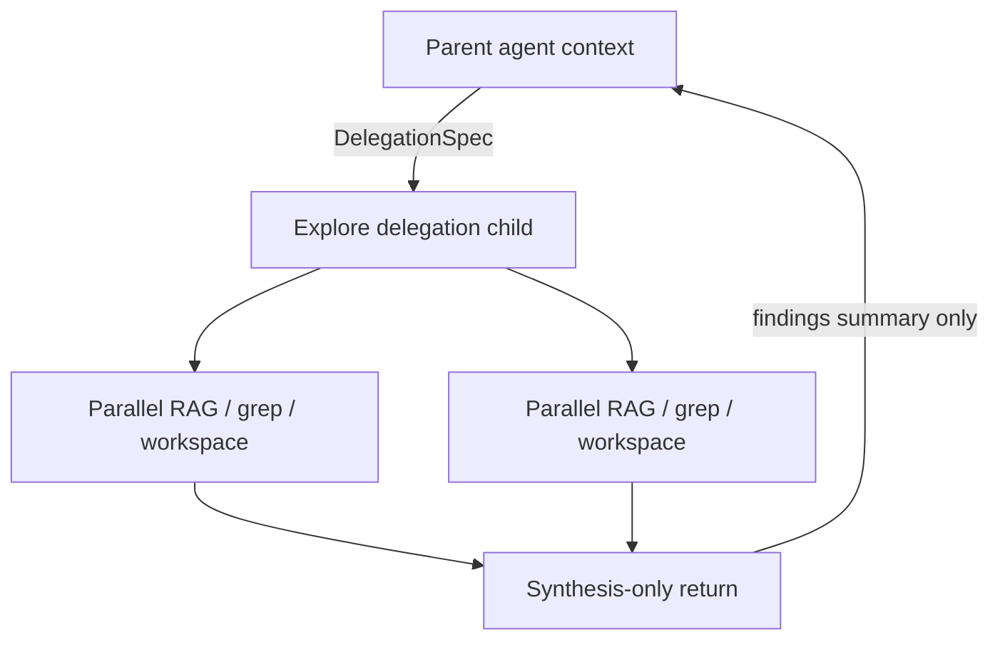

# MEMORY — §8+ extended architecture

**Parent hub:** [`MEMORY.md`](../MEMORY.md)

## 8. Compression and degradation strategies

### 8.1 Strategy matrix

| Strategy | When | Module | Trace |
|----------|------|--------|-------|
| `OFF` | Debug / short sessions | `HistoryLayer` | History diag |
| `TRUNCATE_OLDEST` | History over budget; summarization failed | `HistoryLayer` | `effective_strategy` |
| `SUMMARIZE_OLDEST` | Long sessions; tokenizer available | `HistoryLayer` + `HistorySummaryPromptBuilder` | `summary_used=true` |
| `HYBRID` | Aggressive long-horizon | `HistoryLayer` | Combined |
| Summary tiers | Graph prior outputs | `ContextManager` | `AgentContextBundle.summary_tier` |
| Char/token trim | Composed agent message | `context_budget.py` | `CONTEXT_TRIMMED` |
| LTM top_k + threshold | Query relevance | `UserLongtermMemoryStep` | `UserLongtermMemorySummaryDiagV1` |
| RAG top_k + rerank | Knowledge retrieval | `RetrievalService` | RAG trace |

### 8.2 Target degradation ladder (MEM-DEPTH)

Apply in order until invariant §1.3 is satisfied:

```text
1. FULL fidelity (all sources within budget)
2. Lower summary tier on graph priors (FULL → SUMMARY_ONLY → MINIMAL)
3. Reduce LTM/RAG top_k
4. SUMMARIZE_OLDEST on session history
5. TRUNCATE_OLDEST on session history
6. Drop lowest-scored context fragments (relevance order)
7. Tokenizer-aware hard trim (last resort — never silent char-cut)
```

Each step MUST emit diagnostics with `degradation_step` and bytes/tokens removed.

---

## 9. Intelligent strategy selection

### 9.1 Decision inputs

The Harness selects memory and compression strategies from:

| Input | Profile field / config |
|-------|------------------------|
| Host memory flags | `MemoryProfile` on `ApplicationEnvironmentProfile` |
| Context preferences | `ContextProfile.decision` (`ContextDecisionProfile`) |
| Per-request override | `RuntimeRequest.history_compression_strategy` |
| Model capacity | `llm_adapter.context_window_tokens` |
| Task shape | Single chat vs `ExecutionGraph` vs delegation |
| Query emptiness | LTM step skipped on empty query |

### 9.2 `ContextDecisionProfile` (declarative policy)

```python
# intergrax/applications/contracts/environment_profile.py
include_session_history: bool = True
prefer_longterm_memory: bool = True
prefer_rag_when_enabled: bool = True
max_memory_entries_in_context: int = 8
```

**Enforced** by `ContextCompiler` via `ContextDecisionProfile` on `RuntimeConfig`.

### 9.3 Selection matrix (normative)

| Situation | Primary memory source | Compression | Secondary |
|-----------|----------------------|-------------|-----------|
| Short chat (&lt; 30% context) | Full session history | `OFF` or light | LTM if `prefer_longterm_memory` |
| Long chat (&gt; 50% context) | Session summary + recent tail | `SUMMARIZE_OLDEST` | LTM top_k reduced |
| Document Q&A | RAG retrieval | RAG top_k within budget | Minimal history |
| Multi-agent graph node | Prior outputs + shared context | Summary tier per policy | Task KV via tools |
| Delegated explore child | Isolated namespace reads | Child budget; synthesis return | Parent gets summary only |
| User returns after days | LTM semantic search (`ltm` index) | Session history empty or short | Episodic cross-session recall when `include_cross_session_episodic` |
| Long active session (> 50% context) | Episodic semantic recall + recent tail | `SUMMARIZE_OLDEST` on remainder | LTM top_k reduced |
| Codebase-scale task | RAG + workspace tools | Retrieval-first; no full dump | Explore delegation (target) |
| Regulated / high-risk | Policy + minimal context | `MINIMAL` tier; explicit citations | HITL before LTM write |

### 9.4 When to use which store (authoring guide)

| Need | Store | Do not use |
|------|-------|------------|
| "Remember this for this run only" | Task KV (`memory.write`) | Session |
| "Remember across sessions for this user" | User LTM (consolidation or explicit entry) | Task KV |
| "Team tone and constraints" | Org profile | User LTM |
| "Facts from uploaded PDFs" | RAG collection | User LTM (unless extracted fact) |
| "What happened in run #4521" | Trace / debug journal | Mutable memory |
| "Child agent scratch pad" | Delegation namespace | Parent namespace |

---

## 10. Delegation and explore pattern

### 10.1 Delegation memory (Done — R-Delegate)

Child agents read/write under:

```text
task_id/delegation/{node_id}/
```

via `PolicyScopedMemoryView`. Parent receives bounded context via `ContextManager` — not raw child history.

### 10.2 Explore pattern (Done — MEM-DEPTH-4.2 + MEM-LC-8)

For wide codebase or corpus search:



Properties:

- Child runs in **isolated context window**
- Parallel searches do not bloat parent history
- Return payload is **structured findings**, not raw file dumps

Target: MEM-DEPTH-4.1, MEM-DEPTH-4.2 — **wired** via `explore_integration.py` in `graph_executor`.

---

## 11. Configuration surfaces

### 11.1 `MemoryProfile`

```python
enable_user_memory: bool
enable_org_memory: bool
enable_long_term_memory: bool
enable_task_memory: bool
enable_session_vector_index: bool = False          # MEM-VEC-2 — episodic turn indexing (Done)
include_cross_session_episodic: bool = False       # episodic search across sessions for same user
session_index_top_k: int = 8
session_index_score_threshold: float | None = None
vector_index_namespace: str | None = None          # collection prefix; default derived from tenant_id
session_index_roles: tuple[str, ...] = ("user", "assistant")
retention_days: int | None
scope_boundary: str = "tenant"
consolidation_mode: Literal["manual", "scheduled", "auto"]
```

Mapped to `RuntimeConfig` via `memory_runtime_bridge.py` / `materialize_runtime_config`. Vector-index flags require a resolved integration vector store — hosts without vector backend MUST fail closed (`reason=vector_backend_unavailable`) rather than silently disabling semantic recall while flags are true (MEM-VEC-1.4 gate).

### 11.2 `ContextProfile`

```python
assembly_options: TaskContextAssemblyOptions  # max_prior_chars, summary tier defaults
budget_policy: ContextBudgetPolicy | None   # max_chars, max_tokens_estimate
decision: ContextDecisionProfile
enable_rag: bool
enable_websearch: bool
```

### 11.3 `RuntimeConfig` LTM limits

| Field | Role |
|-------|------|
| `enable_user_longterm_memory` | Gates `UserLongtermMemoryStep` |
| `max_longterm_entries_per_query` | top_k |
| `longterm_score_threshold` | Minimum relevance |
| `max_longterm_tokens` | Injection cap |

### 11.4 Tier-3 wiring entry points

| Function | Role |
|----------|------|
| `resolve_memory_platform_wiring()` | Session + profile stores from integration profile |
| `build_session_manager_from_environment()` | SessionManager + profile managers — **MUST accept optional `rag_stack` for vector-enabled `UserProfileManager`** (MEM-VEC-1.1) |
| `wire_task_memory_from_profile()` | Task KV database path |
| `materialize_runtime_config()` | Profile → RuntimeConfig bridge |
| `build_runtime_context_from_environment()` | Single entry — MUST pass shared RAG stack into memory + tool wiring (MEM-VEC-1.2) |

### 11.5 Memory store and vector index plugins

| Protocol | EP group | Factory | Replaces |
|----------|----------|---------|----------|
| `UserProfileStorePlugin` | `intergrax.memory_stores` | `create_user_profile_store(**kwargs)` | Default SQLite / Mongo / in-memory LTM store |
| `SessionStoragePlugin` | `intergrax.memory_stores` | `create_session_storage(**kwargs)` | Default session persistence |
| `SessionTurnIndexStore` (MEM-VEC-2.1; plugin EP MEM-VEC-3.1 **Done**) | `intergrax.memory_stores` | `create_session_turn_index(**kwargs)` | Default: `VectorSessionTurnIndexStore` over `VectorstoreManager` |

Vector **integration** providers (Chroma, pgvector, Qdrant, …) remain in the integrations catalog — memory plugins select **how** indexes are written, not which vendor SDK is used. Custom Tier-3 hosts register EP plugins; Tier-2 agents still use Nexus APIs and tools only.

---

## 12. Persistence backend matrix

| Layer | In-memory | SQLite (lab) | MongoDB | Postgres | Redis |
|-------|-----------|--------------|---------|----------|-------|
| Task KV | tests | `INTERGRAX_TASK_MEMORY_DB` | — | — | — |
| Session | fallback | sqlite bundle | `DocumentStoreSessionStorage` (MEM-DEPTH-2.1) | spike P3 | **not memory layer** |
| User LTM | tests | sqlite bundle | `DocumentStoreUserProfileStore` | spike P3 | — |
| Org profile | tests | sqlite bundle | — | — | — |
| Trace / events | tests | yes | — | — | — |

**Lab default:** `create_sqlite_integration()` bundles session + user LTM + org + task_memory + trace — coherent dev recovery.

---

## 13. Observability

Memory and context operations emit through the Harness Observability Spine:

| Signal | Examples |
|--------|----------|
| Runtime events | `MEMORY_READ`, `MEMORY_WRITE`, `CONTEXT_ASSEMBLED`, `CONTEXT_TRIMMED` |
| Diagnostics | `HistorySummaryDiagV1`, `UserLongtermMemorySummaryDiagV1`, `SessionConsolidationDiagV1` |
| Metrics | LTM hit rate, retention violations, memory write volume (MEM-OBS.1) |
| Debug filter | `ops:memory` (DX-5.7) |

Operators reconstruct: what was retrieved, what was trimmed, which strategy fired, and why LTM was skipped.

See [`architecture/OBSERVABILITY.md`](architecture/OBSERVABILITY.md) §3.

---

## 14. Market parity reference

| Capability | LangGraph | Mem0 / Zep | Intergrax as-built | Backlog |
|------------|-----------|------------|-------------------|--------|
| Thread persistence | Checkpointer | Session | Session + checkpoint + Mongo document_store ✅ | — |
| Scoped KV | Store API | — | TaskMemory ✅ | — |
| Auto fact extraction | — | Core | Consolidation + `consolidation_mode=auto` ✅ | — |
| Entity graph memory | — | Zep ✅ | `EntityGraphMemoryStore` ✅ (≠ Graph RAG) | — |
| Vector semantic LTM | Optional | ✅ | Tier-3 wired via `memory_vector_wiring.py` ✅ | — |
| Vector semantic session recall | Optional | ✅ | Episodic index + CE provider ✅ | — |
| Subagent isolation | Subgraph | — | Delegation namespace ✅ | Explore pattern MEM-DEPTH-4.* |
| Unified context budget | Partial | — | `ContextCompiler` ✅; per-step caps remain | CE ranker tuning |
| Temporal fact validity | — | Zep ✅ | ❌ | MEM-DEPTH-5.2 |
| Plugin episodic index EP | — | — | Default adapter only | MEM-VEC-3.1 |
| Unified semantic search skill | — | ✅ | `ltm.search` tool only | MEM-VEC-3.2 |

---

## 15. Anti-patterns

| Anti-pattern | Why forbidden | Correct approach |
|--------------|---------------|------------------|
| Agent concatenates full chat for LLM | Unbounded overflow | Nexus `HistoryLayer` + budget |
| Agent writes SQLite / Redis directly | Tier violation | `memory.*` tools + `MemoryView` |
| Storing documents in user LTM | Wrong store semantics | RAG ingest (`knowledge` domain) |
| Indexing session turns only in LTM consolidation | Loses verbatim recall | `episodic` index on append (MEM-VEC-2) |
| Enabling LTM flags without wiring RAG to `UserProfileManager` | Silent no-op semantic search | MEM-VEC-1.1 harness contract |
| Treating Graph RAG nodes as user entities | Conflates knowledge vs memory | Separate stores §5.3 |
| Silent context drop | No audit | Degradation ladder + events |
| Global shared KV without namespace | Cross-tenant leak risk | `tenant_id` + `task_id` + policy |
| Using trace as mutable memory | Immutability violation | Task KV or LTM |

---

## 16. Module inventory (do not duplicate)

| Module | Tier | Role |
|--------|------|------|
| `intergrax/memory/` | 0 | ConversationalMemory, UserProfileManager, stores |
| `intergrax/runtime/task_memory/` | 1 | TaskMemory, MemoryView, delegation, retention |
| `intergrax/runtime/nexus/session/` | 1 | SessionManager, consolidation coordinator |
| `intergrax/runtime/nexus/context/` | 1 | ContextManager, HistoryLayer, context_budget |
| `intergrax/runtime/user_profile/` | 1 | Consolidation + instructions services |
| `intergrax/applications/_shared/memory_wiring.py` | 3 | Platform wiring |
| `intergrax/runtime/nexus/context/context_compiler.py` | 1 | Context Compiler + degradation ladder |
| `intergrax/runtime/nexus/session/document_store_session_storage.py` | 1 | Mongo session persistence |
| `intergrax/memory/entity_graph_memory.py` | 0 | User entity graph (≠ Graph RAG) |
| `intergrax/tools/providers/memory/` | 0 | `memory.read/write/list_keys/delete_key` |
| `intergrax/rag/` | 0 | Knowledge retrieval (not agent LTM) |

---

## 17. Maturity scorecard and gap register

| Area | Score (1–5) | Phase MEM | Phase MEM-DEPTH | Phase MEM-VEC |
|------|-------------|-----------|-----------------|---------------|
| Task KV | 4 | Done | 4 (maintain) | — |
| Context / LLM window | 4.5 | Partial | Done — Context Compiler | CE owns ranker |
| STM session | 4 | Partial | Done — Mongo + SQLite parity | — |
| User LTM | 4 | Partial | Done — store + vector wiring | Done — MEM-VEC-1 |
| LTM / session vector recall | 4 | N/A | N/A | Done — MEM-VEC-1/2 |
| Org memory | 3.5 | Partial | Done — org LTM entries + Mongo fallback store | — |
| Consolidation | 4 | Partial | Done — job + modes | — |
| Graph agent memory | 3.5 | RFC only | Done — `EntityGraphMemoryStore` + consolidation indexing | — |
| Context compiler (unified) | 4.5 | N/A | Done | CE canon |
| **Overall** | **~4.5** | Platform wiring Done | Closed | MEM-VEC **Done** |

**FAUDIT-32:** Memory Layer **L4** for vector recall and layer-completion hardening (2026-06-17).

### Audit register (open / partial — re-validate)

| ID | Gap | Severity | Phase | Status |
|----|-----|----------|-------|--------|
| MEM-AUDIT-1 | No versioned procedural memory store (Prompt Registry only) | P2 | — | **Open** (by design minimal) |
| MEM-AUDIT-2 | Org memory maturity vs user LTM | P2 | — | **Partial** — org `memory_entries` + manager search shipped |
| MEM-AUDIT-3 | Temporal fact validity on LTM entries | P2 | MEM-DEPTH-5.2 | **Done** |
| MEM-AUDIT-4 | `SessionTurnIndexStore` plugin EP not shipped | P2 | MEM-VEC-3.1 | **Done** |
| MEM-AUDIT-5 | `memory.semantic_search` skill runtime (unified LTM + episodic) | P2 | MEM-VEC-3.2 | **Done** |
| MEM-AUDIT-6 | Explore delegation pattern (Cursor-class) | P2 | MEM-DEPTH-4.* | **Done** — graph executor wiring |
| MEM-AUDIT-7 | Per-step budget caps before CE collect | P2 | CE + ADR-MEM-001 | **Partial** — global allocator Done |

**Closed baselines:** MEM (48/48), MEM-DEPTH, AUDIT-IDEAL-15.1–15.3, AUDIT-IDEAL-16.1–16.2 (CE owner).

Implementation tasks: [Phase MEM-VEC](../plan/MEMORY.md#phase-mem-vec--vector-memory-integration-band-2aw) · [Phase MEM-DEPTH](../plan/MEMORY.md) (closed).

---

## 18. Related documents

| Document | Relationship |
|----------|--------------|
| [intergrax_runtime_architecture.md §27–§28](architecture/MEMORY.md#27-memory-model) | Canon summary — links here for depth |
| [architecture/CONTEXT_ENGINEERING.md](CONTEXT_ENGINEERING.md) | Context engineering engine (Layer C); AUDIT-IDEAL-16.1–16.2 owner |
| [guides/AGENT_CREATION_GUIDE.md Appendix G](guides/AGENT_CREATION_GUIDE.md#appendix-g--memory--rag-naming-phase-q) | Author control plane |
| [guides/AGENT_CREATION_GUIDE.md Appendix L](guides/AGENT_CREATION_GUIDE.md#appendix-l--context-engineering-control-plane) | Author control plane (links CE canon) |
| [adr/entries/2026-06-08/ADR-MEM-001.md](../adr/entries/2026-06-08/ADR-MEM-001.md) | Context Compiler + degradation ladder |
| [adr/entries/2026-06-14/ADR-MEM-002.md](../adr/entries/2026-06-14/ADR-MEM-002.md) | Three-domain vector catalog |
| [architecture/TOOLS.md](architecture/TOOLS.md) | `memory.*` and `rag.retrieve` tools |
| [architecture/NEXUS_EXECUTION_FLOW.md](architecture/NEXUS_EXECUTION_FLOW.md) | Runtime turn narrative |
| [IDEAL_HARNESS_AI_ARCHITECTURE.md §16](../guides/IDEAL_HARNESS_AI_ARCHITECTURE.md#16-context-engineering-layer) | Target context compiler vision |

---

*End of Memory Architecture canon.*

---

## 19. Context quality (delegated)

Context quality controls (scoring, dedup, regression, lineage) are owned by **[`CONTEXT_ENGINEERING.md`](CONTEXT_ENGINEERING.md) §11**.

---

## 20. Knowledge Graph and Hybrid Retrieval

Graph-native knowledge evolves from optional enhancement to first-class capability:

- graph RAG support (`intergrax/rag/graph/`),
- entity–relation semantic modeling,
- hybrid retrieval: vector + keyword + graph traversal,
- graph-backed explainability in reasoning traces.

| Module | Role |
|--------|------|
| `runtime/architecture/graph_rag.py` | Graph RAG contracts |
| `hybrid_retrieval.py` | Hybrid strategy |
| `graph_provenance.py` | Lineage for graph edges |

**Distinction:** Graph RAG indexes **document knowledge** — not user episodic memory (§4). Integration backends (Neo4j, etc.) are catalog providers in [`INTEGRATIONS.md`](INTEGRATIONS.md).

---
