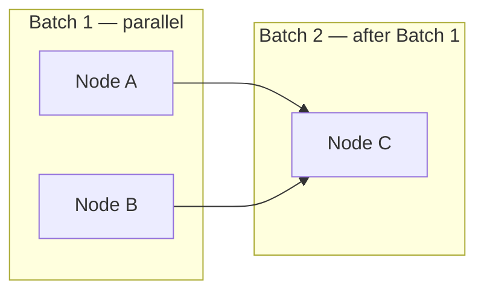
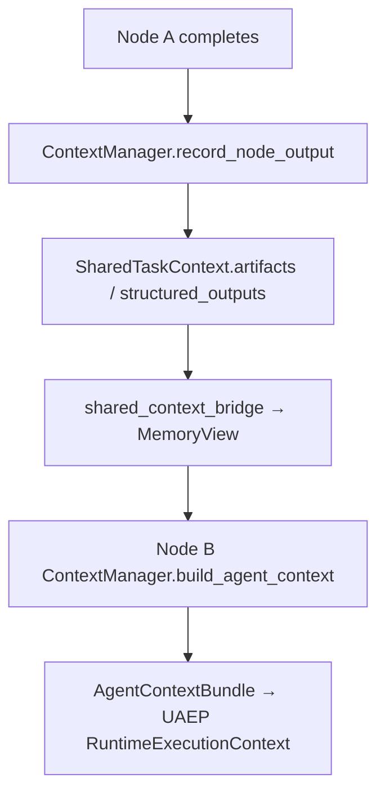
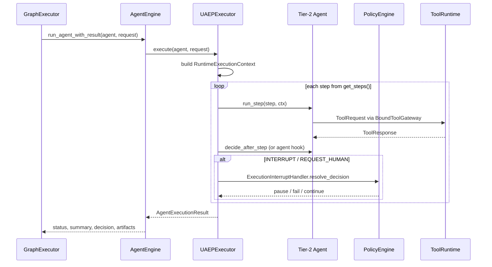
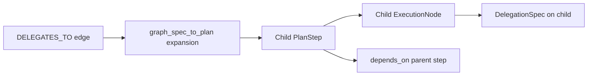
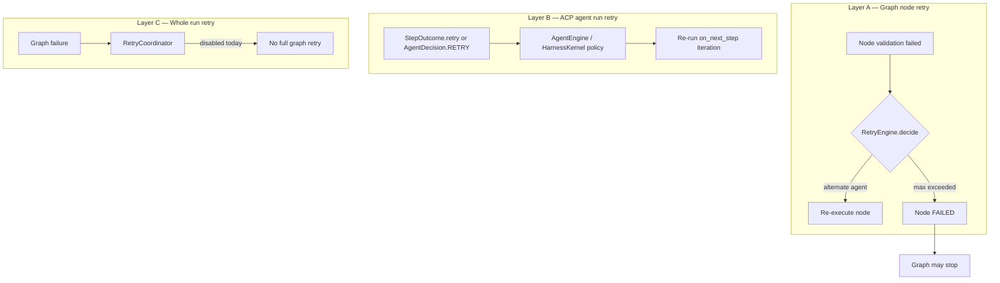
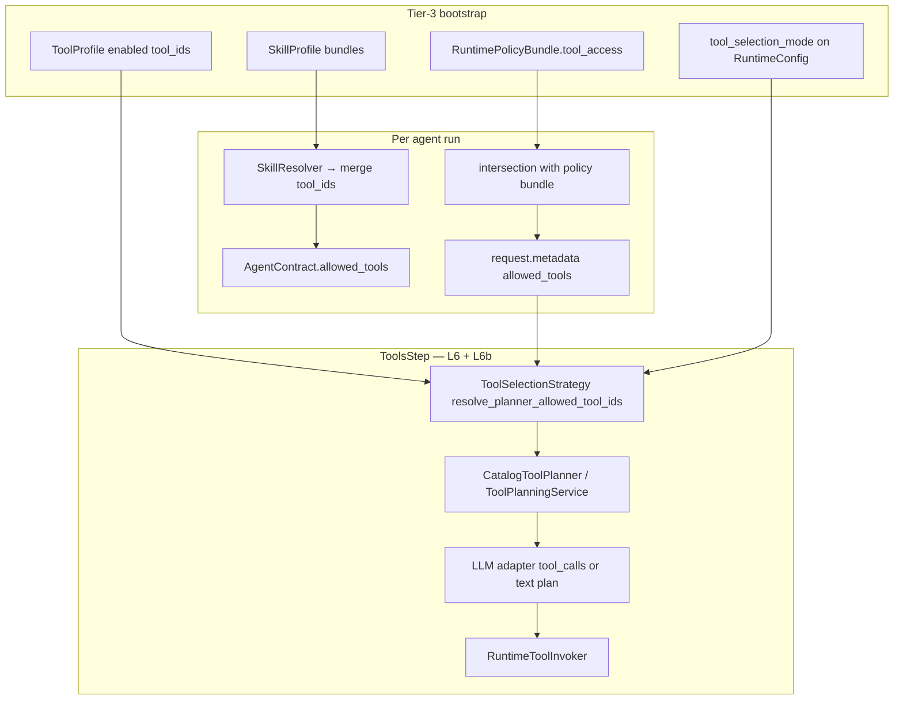
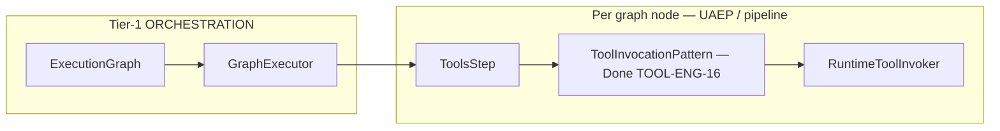
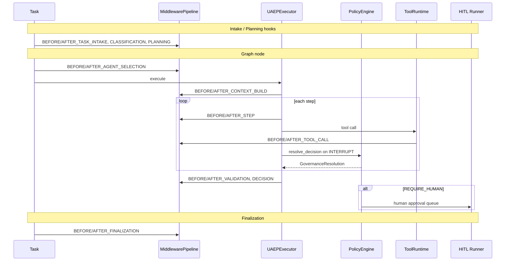
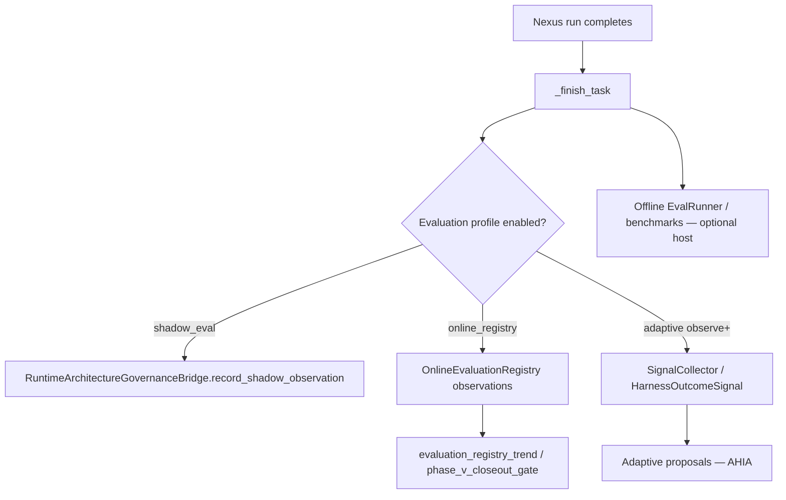

# NEXUS_EXECUTION_FLOW — §9+ extended architecture

**Parent hub:** [`NEXUS_EXECUTION_FLOW.md`](../NEXUS_EXECUTION_FLOW.md)

## 9. Graph execution — batches, routing, merge

### 9.1 Topological batches

`ExecutionGraph.batches()` → list of parallelizable node groups.



| Control | Source |
|---------|--------|
| Parallel within batch | `asyncio.gather` in `GraphExecutor` |
| `max_parallel_nodes` | `OrchestrationProfile` → semaphore |
| `max_inflight_nodes` | Optional backpressure event `GRAPH_BACKPRESSURE` |
| Sequential across batches | `depends_on` topological order |
| Stop on failure | First failed node aborts remaining graph (unless retry recovers) |

### 9.2 Per-node execution pipeline

`GraphExecutor._execute_node()`:

1. Skip if checkpoint says completed or cancelled
2. `ContextManager.build_agent_context()` → apply to `node_task`
3. Middleware `BEFORE_AGENT_SELECTION` → `AgentRouter.route()` → `AFTER_AGENT_SELECTION`
4. `RetryEngine.execute_with_retry()` → `AgentEngine.run_agent_with_result()`
5. Validate via `NexusValidationEngine`
6. On success: `record_node_output()` → optional dynamic handoff node
7. On failure: node `FAILED`, graph may stop

### 9.3 AgentRouter priority

`intergrax/runtime/nexus/agent_router.py`

1. `task.agent_id` if registered and `is_routable(production_mode)`
2. `task.context.capability` → highest `can_handle().score`
3. `registry.find_best_match(context)`
4. Fallback: first `list_routable_agent_ids()`

`production_mode=True` when `execution_mode=strict` on environment profile.

### 9.4 Cross-node data flow



**Rule:** agents never call each other. All cross-agent data via `SharedTaskContext` / `MemoryView` (canon §42.14).

### 9.5 Final result merge

**Implemented (FLOW-7):** `FinalResponseComposer.compose_summary()` — `intergrax/runtime/nexus/response/final_response_composer.py`

| `OrchestrationProfile.merge_strategy` | Behavior |
|---------------------------------------|----------|
| `concat` (default) | `"[agent_id] summary"` blocks joined by `\n\n` |
| `last_wins` | Last non-empty agent summary |
| `structured_json` | JSON payload with per-agent status and summary |

Metadata via `compose_metadata()`: `plan_id`, `agent_ids`, `retry_count`, `all_completed`.

**Future (not in FLOW-7):** citation-preserving merge, validator-aware merge, LLM-assisted synthesis, conflict-aware HITL — see [`IDEAL_HARNESS_AI_ARCHITECTURE.md`](guides/IDEAL_HARNESS_AI_ARCHITECTURE.md).

---

## 10. UAEP — execution inside one graph node



| `AgentDecision` | Nexus action |
|-----------------|--------------|
| `CONTINUE` | Next UAEP step |
| `COMPLETE` | Node success path |
| `RETRY` | UAEP/runtime retry policy (not agent loop over adapters) |
| `REQUEST_HUMAN` | Pause → `WAITING_FOR_HUMAN` |
| `INTERRUPT` | `PolicyEngine.evaluate_interrupt` → HITL or fail |
| `HANDOFF` | `HandoffCoordinator` inserts graph node |
| `MODIFY_PLAN` | Reserved / policy-dependent replan |
| `FAIL` | Node failed |
| `CANCEL` | `CancellationCoordinator` |

---

## 11. Decision ownership matrix

| Decision | Owner | Input | Output |
|----------|-------|-------|--------|
| Task classification | `TaskClassifier` | `Task`, registry | `classification` label |
| Plan topology | `NexusTaskPlannerProtocol` | classification, registry, graph_spec | `NexusPlan` |
| Graph structure | `plan_to_execution_graph` | plan | `ExecutionGraph` |
| Agent for node | `AgentRouter` | `node_task`, capability, contract | `Agent` instance |
| UAEP step order | Tier-2 `get_steps()` | agent contract | step list |
| Step continue/stop | Agent `decide_after_step` | step output | `AgentDecision` |
| Interrupt resolution | `ExecutionInterruptHandler` + `PolicyEngine` | interrupt, decision | pause/fail/continue |
| Node validation | `NexusValidationEngine` | execution, plan_criteria | `ValidationResult` |
| Node retry / alternate agent | `RetryEngine` | validation fail, policy | retry or switch agent |
| Dynamic handoff target | `HandoffCoordinator` | `AgentHandoff` | new graph node |
| Graph continuation | `GraphExecutor` | node status | next batch or stop |
| Task terminal state | `NexusGraphRunner` + validation | all executions | COMPLETED/FAILED/… |
| Final answer text | `FinalResponseComposer` | execution summaries | string |
| Tool allow-list | `AgentContract` + skills + `RuntimePolicyBundle` | contract, skill_ids | `allowed_tools` |
| Tool invocation | `ToolRuntime` | `ToolRequest` | policy-checked execute |
| LLM tool selection | `CatalogToolPlanner` / native tool_calls | LLM response | planned tool calls |

---

## 12. Multi-agent variants (use cases)

### UC-1 — Single agent (lab default)

**Config:** one agent in roster, no `graph_spec`, no capability.

```text
classification: SINGLE_AGENT_DEFAULT
plan: 1 step → agent_id = first in registry
graph: 1 node
```

### UC-2 — Explicit agent

**Config:** `Task(agent_id="echo", …)`

```text
classification: SINGLE_AGENT_EXPLICIT
plan: 1 step with fixed agent_id
```

### UC-3 — Capability routing (one agent)

**Config:** `Task(context.capability="legal.review")`, one agent registered.

```text
classification: CAPABILITY_ROUTED
plan: 1 step, agent from find_by_capability
```

### UC-4 — Auto multi-agent (same capability)

**Config:** two+ agents register same capability, task requests that capability.

```text
classification: MULTI_AGENT
plan: sequential steps for ALL matching agents (order = registry order)
graph: chain depends_on step_1 → step_2 → …
```

### UC-5 — Declarative graph (recommended for product)

**Config:** `ApplicationEnvironmentProfile.graph_spec` or `HarnessApplication.graph(AgentGraph()…)`.

```text
GraphSpecSeedingPlanner → NexusPlan from edges
graph: parallel batches from DEPENDS_ON topology
```

### UC-6 — Research pipeline (built-in)

**Config:** `capability=research.pipeline` or `intent=research_summarize`.

```text
plan: research step → summarize step (depends_on)
```

### UC-7 — Runtime handoff

**Config:** agent returns `AgentDecision.HANDOFF` with `AgentHandoff` payload.

```text
GraphExecutor._maybe_execute_handoff → new node appended → executed before batch ends
```

### UC-8 — Human approval before run

**Config:** `task.options.governance.require_human_approval=True`.

```text
classification: HUMAN_APPROVAL_REQUIRED
plan created → WAITING_FOR_HUMAN before graph
resume → RUNNING → graph executes
```

### UC-9 — Long-running + checkpoint

**Config:** `orchestration_profile.long_running_enabled` + `reliability_profile.long_running_scheduler_enabled`.

```text
checkpoints on pause/progress via long_running_bridge
resume restores plan/graph/UAEP cursor from SQLite
```

### 12.1 Production readiness, tests, and telemetry by variant

| UC | Lab-ready | Production-ready | Primary gate tests | Key telemetry |
|----|-----------|------------------|-------------------|---------------|
| UC-1 Single agent | **Yes** | Partial (needs strict profile proof) | `test_acceptance_01_single_agent_execution` | `TASK_CREATED`, `PLAN_CREATED`, `TASK_COMPLETED` |
| UC-2 Explicit agent | **Yes** | Partial | `test_acceptance_01_*` + router unit tests | + `agent_id` in trace metadata |
| UC-3 Capability routed | **Yes** | Partial | `tests/unit/runtime/nexus/` classifier tests | + `classification=capability_routed` |
| UC-4 Auto multi-agent | **Yes** | Partial (ordering fragile) | `test_acceptance_02_sequential_multi_agent` | + per-node `on_node_complete` |
| UC-5 Declarative graph | **Yes** | Partial | `test_graph_spec_to_plan.py`, `test_lab_graph_spec.py` | + `plan_id`, `graph_id` |
| UC-6 Research pipeline | **Yes** (stub agents) | No (stub descriptions) | planner unit tests | `PLAN_CREATED` step_count=2 |
| UC-7 Runtime handoff | **Yes** | Partial | `test_graph_executor_handoff_retry.py`, `test_acceptance_08_memory_handoff` | `HANDOFF_*`, `ops:handoff` |
| UC-8 HITL before run | **Yes** | Partial | `test_acceptance_04_human_approval_flow` | `HUMAN_APPROVAL_REQUESTED`, `WAITING_FOR_HUMAN` |
| UC-9 Long-running | **Yes** | Partial (scheduler optional) | `test_acceptance_05_checkpoint_recovery`, `05b_mid_step_uaep_resume` | checkpoint events, `TASK_PROGRESS` |

**Why Production-ready = Partial (2026-06-09 audit, synced):** harness runtime proves semantics; production claims additionally require (a) `execution_mode=strict` + critic profile on the deployment host, (b) operational SLO evidence (W-OPS), (c) product-specific validation beyond reference host presets. Reference hosts mount task control + async APIs (H-APP-WIRING **Done**); LKW hybrid daemon remains **Deferred** §6.3. UC-6 remains **No** until product research agents replace stubs (§6.3).

**Additional cross-cutting acceptance:** `test_acceptance_03_parallel_multi_agent`, `06_retry_flow`, `07_partial_results`, `09_sandbox_tool_execution`, `10_shadow_workspace` — `tests/acceptance/agent_os/test_agent_os_scenarios.py`.

**Four-axis maturity:** legacy **Lab-ready** / **Production-ready = Partial** labels in the table above map to [`MATURITY_TAXONOMY.md`](../guides/MATURITY_TAXONOMY.md) — typically **P1–P2** (lab) and **P2–P3** (partial production) with **E3** acceptance evidence, **not** **P4** without W-OPS and strict-host proof. Per-scenario detail: §12.2.

### 12.2 Scenario Production Status

**Purpose:** Explicit production posture for **execution-path scenarios** (S1–S8). These differ from **application interaction scenarios** in §3.1 (host posture / intake timing) and from **use-case variants** UC-1–UC-9 in §12 — cross-ref those tables for UC-specific tests and telemetry.

**Taxonomy:** [`MATURITY_TAXONOMY.md`](../guides/MATURITY_TAXONOMY.md) — four independent axes (**A** / **I** / **P** / **E**). Levels on one axis do **not** imply levels on another.

**Cross-references:** [`SYSTEM_INVARIANTS.md`](../guides/SYSTEM_INVARIANTS.md) · [`OBSERVABILITY.md`](OBSERVABILITY.md#observability-event-spine) · [`RELIABILITY_FAILURE_AND_HITL.md`](RELIABILITY_FAILURE_AND_HITL.md) · [`UNIFIED_EXECUTION_RUNTIME.md`](UNIFIED_EXECUTION_RUNTIME.md) · [`AGENT_CONTRACTS_AND_ASSEMBLY.md`](AGENT_CONTRACTS_AND_ASSEMBLY.md) · [`CRITIC_VERIFICATION.md`](CRITIC_VERIFICATION.md#verification-safety-boundaries)

#### Normative rules

1. A scenario **MUST NOT** be treated as production-ready only because it appears in this architecture document. Production readiness requires an explicit **Production readiness** maturity of **P4** or higher and stated evidence on the **Evidence** axis.
2. When implementing or modifying Nexus execution paths, Cursor **MUST** identify which scenario (S1–S8) is being changed and **MUST NOT** silently upgrade that scenario's production readiness — update this matrix and evidence in the same change set when maturity claims change.

#### Scenario matrix (S1–S8)

| Scenario | Intended use | Current status | Architecture maturity | Implementation maturity | Production readiness | Evidence maturity | Required evidence / remaining gaps | Notes |
|----------|--------------|----------------|----------------------|----------------------|---------------------|-------------------|-------------------------------------|-------|
| **S1 — Single task through UnifiedTaskRunner** | Tier-3 host sends one `Task` through `UnifiedTaskRunner.run_task()` → `NexusLoop.handle_task()` to one selected agent (canonical happy path) | **Current supported path** (lab + reference hosts) | **A5** — normative entry in §3–§4; tier boundaries enforced | **I4** — all listed entry points converge on UTR (`NexusTaskExecutionAdapter`, MCP, eval runner, long-running resume) | **P2** — harness-proven; **P3** only with `execution_mode=strict` + reference host preset (§1.4) | **E3** — `test_acceptance_01_single_agent_execution`; `test_nexus_task_execution_adapter.py`; J1 unified entry integration | W-OPS SLO persistence; product-host ops window before **P4** | Maps to UC-1/UC-2/UC-3 single-node plans. Legacy §12.1: Lab-ready **Yes**, Production-ready **Partial**. |
| **S2 — Single agent bounded local loop** | `AgentEngine` runs one Tier-2 agent through bounded UAEP step loop under policy / budget / context / observability controls | **Current supported path** | **A5** — §10, §11; canon UAEP contract | **I4** — `UAEPExecutor` + `AgentEngine.run_agent_with_result()` on graph path; bounded `decide_after_step` loop | **P2** — lab default; strict profile + critic wiring for **P3** | **E3** — `test_acceptance_01_*`; ACP checkpoint/resume acceptance family | Step-budget and run-budget enforcement proof on product agents; must be verified against deployment profile | Not unbounded ReAct — agent emits `AgentDecision`, runtime owns retry (§14.1 layer B). |
| **S3 — Tool execution through ToolRuntime** | Agent requests tool action; side effects go through `ToolRuntime` / policy / observability (no direct SDK) | **Current supported path** | **A5** — §15–§17; [`TOOLS.md`](TOOLS.md) pipeline | **I4** — `RuntimeToolInvoker`, `BoundToolGateway`, policy middleware L0–L7 | **P2** — sandbox path proven; **P3** with full `RuntimePolicyBundle` + V-SEC on strict host | **E3** — `test_acceptance_09_sandbox_tool_execution`; tool gate tests | Semantic/hierarchical selection modes (TOOL-ENG-13/14) before **P4** on broad catalogs; idempotency evidence per tool class | Legacy §12.1 cross-cutting acceptance includes `10_shadow_workspace`. |
| **S4 — Context-compiled LLM step** | LLM context assembled through `ContextCompiler` / ContextEngine degradation ladder, not unbounded prompt concatenation | **Current supported path** (lab); hot-path wiring complete | **A4** — [`CONTEXT_ENGINEERING.md`](CONTEXT_ENGINEERING.md) §10; MEM/CE canon | **I4** — CE-EXT + CE-3.9 hot-path compiler on Nexus agent context build | **P2** — lab/dev; long-session and token-budget proof thin for **P3+** | **E3** — `test_context_compiler.py`, `test_compile_service.py`, `test_acceptance_context_compiler_long_session.py` | Product-scale context profiles + degradation telemetry under strict host; must be verified against target app roster | `ContextManager.build_agent_context()` → compiled bundle before UAEP LLM step. |
| **S5 — Multi-agent graph execution** | Nexus / graph runtime selects and executes multiple agents as an `ExecutionGraph` (sequential, parallel, declarative `graph_spec`) | **Current supported path** (lab); product graphs **controlled** | **A5** — §8–§9, §12 UC-4/UC-5; ORCH canon | **I4** — `GraphExecutor`, `GraphSpecSeedingPlanner`, merge composer (FLOW-7) | **P2** — harness CFG + acceptance; **P3** partial — ordering/merge limits (§12.1 UC-4 **Partial**) | **E3** — `test_acceptance_02/03_*`, `test_orchestration_cfg_simulation.py`, `test_graph_spec_to_plan.py` | FLOW-8 product host (§6.3); W-OPS multi-node traces; `MergePolicy` beyond concat for product **P4** | Legacy §12.1: UC-4/UC-5 Lab-ready **Yes**, Production-ready **Partial**. |
| **S6 — Retry / failure / degradation path** | Runtime handles validation failure, tool failure, timeout, retry, partial result, degradation or stop | **Current supported path** (lab) | **A4** — §14; [`RELIABILITY_FAILURE_AND_HITL.md`](RELIABILITY_FAILURE_AND_HITL.md) | **I4** — three retry layers wired (§14.1); `ResiliencePolicy.allow_partial_result` (FLOW-MAINT-01/05) | **P2** — lab resilience proven; whole-run retry (layer C) **disabled by default** | **E3** — `test_acceptance_06_retry_flow`, `07_partial_results`, `test_graph_runner_resilience.py` | Layer C (`RetryCoordinator`) opt-in proof; budget-exceeded → HITL wiring; ops runbooks for degradation | Agents **MUST NOT** unbounded retry loops ([`SYSTEM_INVARIANTS.md`](../guides/SYSTEM_INVARIANTS.md) §8). |
| **S7 — HITL approval path** | Agent requests human input or approval; Nexus / HITL mechanism manages approval boundary | **Controlled / lab**; production queue posture profile-driven | **A4** — §6 lifecycle, §12 UC-8; REL + CVL canon | **I3** — planning gate + UAEP `REQUEST_HUMAN` / interrupt handler; debug + harness APIs | **P2** — acceptance + lab HITL service; **P3** with operator queue + audit on strict host | **E3** — `test_acceptance_04_human_approval_flow`; CRIT-V-FOLLOWUP L2 HITL tests | Production operator queue SLA; `EXPIRED` lifecycle reserved (ADR-FLOW-002); semantic critic-only gates insufficient for irreversible actions (SYS-INV §8) | Distinct from ad-hoc agent messages — runtime owns `WAITING_FOR_HUMAN`. |
| **S8 — Advanced adaptive / scaling / autonomous optimization** | AHIA observes/proposes/evaluates; Elastic Capacity Plane scales infra — may propose routing, policy or profile changes | **Target / restricted** — observe-only default; **not auto-applied in production** unless governance explicitly enables | **A4** — [`ADAPTIVE_HARNESS_INTELLIGENCE.md`](ADAPTIVE_HARNESS_INTELLIGENCE.md#governance-boundary); target architecture documented | **I2** — observation/mining modules; closed-loop auto-apply **not** production default | **P0–P1** — **MUST NOT** silently mutate prompts, routing, policies or profiles ([`SYSTEM_INVARIANTS.md`](../guides/SYSTEM_INVARIANTS.md) §9) | **E1–E2** — ADRs, AHIA plan closeout; limited harness observation tests | Explicit product/governance enablement + **E4+** before any auto-apply **P3+**; ECP must not decide agent topology | Legacy **L4** AHIA modes ≠ production-ready — map per [`MATURITY_TAXONOMY.md`](../guides/MATURITY_TAXONOMY.md) legacy table. See [AHI governance boundary](ADAPTIVE_HARNESS_INTELLIGENCE.md#governance-boundary) · [ECP production boundary](ELASTIC_CAPACITY_AND_SCALING.md#production-boundary). |

#### Status legend

| **Current status** | Meaning |
|--------------------|---------|
| **Current supported path** | Intended harness path; safe for lab and reference hosts with documented profile limits |
| **Controlled / lab** | Implemented but requires explicit profile, operator tooling, or tenant gate before production scale |
| **Target / restricted** | Architecture and partial code exist; production auto-apply forbidden by default |

**Audit ID:** P2-ARCH-04 (2026-06-20)

---

## 13. Delegation vs depends_on vs handoff

### 13.1 Semantic model (three mechanisms)

| Mechanism | When | Who schedules child | Memory model |
|-----------|------|---------------------|--------------|
| `DEPENDS_ON` | Declarative graph | Plan → separate graph node | Shared context via `ContextManager` |
| `DELEGATES_TO` | Declarative graph | Plan expansion → child node ([ADR-FLOW-001](adr/entries/2026-06-07/ADR-FLOW-001.md)) | Child node + `DelegationSpec` via `SubtaskContract` |
| `AgentDecision.HANDOFF` | Runtime | `HandoffCoordinator` inserts node | Handoff payload in shared context |
| UAEP steps | Inside one node | Same agent | Agent-local + shared read |

### 13.2 Runtime semantics (post FLOW-2/14)

| View | `DELEGATES_TO` meaning |
|------|------------------------|
| **Canon §42.14.3** | Subagent equivalent — child execution with `DelegationSpec` |
| **Runtime (truth)** | `graph_spec_to_plan.py` expands edge → child `PlanStep`; `DelegationSpec` on **child**; `GraphExecutor` routes `child_agent_id` |



**`max_delegation_depth`:** enforced in `GraphExecutor` (FLOW-3). **`max_llm_calls` / `max_tool_calls`:** optional delegation budget envelope (FLOW-15).

### 13.3 Decision record

Accepted and implemented: [`adr/entries/2026-06-07/ADR-FLOW-001.md`](adr/entries/2026-06-07/ADR-FLOW-001.md) (FLOW-2, FLOW-14).

---

## 14. Retry, failure, and abandonment

**Attempt Ledger:** retry/failure/HITL decisions must be reconstructable from runtime events and retry metadata — [`RELIABILITY_FAILURE_AND_HITL.md`](RELIABILITY_FAILURE_AND_HITL.md#attempt-ledger) (R0–R4 layers, stop reasons, ownership rules).

### 14.1 Three retry layers (do not conflate)

| Layer | Component | Trigger | Scope | Who decides | Default |
|-------|-----------|---------|-------|-------------|---------|
| **A — Graph node** | `RetryEngine` | `NexusValidationEngine` fails node result | Same graph node; may switch agent | Runtime (`decide()` alternate agent) | `max_retries=1`; factory sets 3 or 1 (`strict`) |
| **B — ACP / agent run** | `AgentEngine`, `HarnessKernel`, `AgentDecision.RETRY` | LLM/tool transient, agent requests retry via `StepOutcome` | **Inside one node** — `on_next_step` loop | Runtime policy (`max_run_retries` on `RuntimeConfig`) | Per agent host |
| **C — Whole run** | `RetryCoordinator` in `NexusGraphRunner` | Re-execute entire graph after failure | Full plan / all nodes | Runtime coordinator | **`max_run_retries=0` — disabled** |



**Agent rule:** agents emit `AgentDecision.RETRY` — they do **not** loop `for attempt in range(n)` over adapters (canon §31, §42.34).

### 14.2 Abandonment triggers

| Condition | Terminal state | Who decides |
|-----------|----------------|-------------|
| `UNSUPPORTED` classification | `FAILED` | `NexusPlanningRunner` |
| Hook `BLOCK` on lifecycle | `FAILED` | Middleware |
| Human `REJECT` | `FAILED` | `NexusHitlRunner` |
| Max node retries exceeded | `FAILED` | `RetryEngine` |
| Graph node failure (strict) | `FAILED` | `NexusGraphRunner` |
| Cancel requested | `CANCELLED` | `CancellationCoordinator` |
| `NEEDS_INPUT` / governance pause | `WAITING_FOR_HUMAN` | UAEP + graph runner |
| Budget exceeded (when wired) | `FAILED` or HITL | `RunBudget` / cost profile |

---

## 15. Tool selection flow

> **Canonical tool engine manifest:** [`TOOLS.md`](TOOLS.md#tool-execution-pipeline) — full select → invoke → log pipeline and component roles.  
> **Production selection modes:** [`TOOLS.md` §Tool selection modes](TOOLS.md#tool-selection-modes-production-strategies) — standard / semantic / hierarchical. This section covers the **selection** subgraph; §16–§17 cover governance hooks and telemetry.



| Stage | Enforces |
|-------|----------|
| Bootstrap (L0) | Which tools exist in registry for this host |
| Contract + skills (L1–L2) | Agent-level allow-list |
| Policy bundle (L3–L5) | Org/tenant / plan restrictions |
| **Selection mode (L6)** | Schema narrowing — standard (`full_catalog`), keyword top-k (`retrieval_top_k`), skill pack; **semantic** / **hierarchical** planned (TOOL-ENG-13/14) — see [`TOOLS.md`](TOOLS.md#tool-selection-modes-production-strategies) |
| **LLM planner (L6b)** | `CatalogToolPlanner` → `tool_calls` from narrowed schema |
| `RuntimeToolInvoker` (L7) | Per-call scope, trace, idempotency |
| Security middleware | `BEFORE_TOOL_CALL` injection defense |

**Agents must not** import vendor SDKs or call integrations directly (canon §42.12, §42.41).

### 15.1 Tool invocation orchestration (Plane 3 — vs graph)

> **Canonical patterns:** [`TOOLS.md`](TOOLS.md#tool-invocation-patterns-production-orchestration) — single / parallel batch / bounded ReAct / deterministic chain.  
> **Agent graph orchestration:** [`ORCHESTRATION.md`](ORCHESTRATION.md) §50–§56 — `ExecutionGraph` / `GraphExecutor` (separate domain).



| Layer | Orchestrates | Module | Tool iterations? |
|-------|--------------|--------|------------------|
| **Agent graph** | Agents, delegation, merge | `GraphExecutor` | **No** — ADR-TOOL-002 rejects tool ReAct from graph |
| **Tool invocation pattern** | Multi-call plan within one step | `ToolInvocationPattern` **Done** (TOOL-ENG-16) | **Yes** — `bounded_react`, `parallel_batch`, etc. |
| **Atomic invoke** | Single `tool_id` call | `RuntimeToolInvoker` | N/A |

**Flow (production):** `run_bounded_tool_loop` / `ctx.invoke_tool` → `resolve_invocation_pattern(config)` → shipped or custom `ToolInvocationPattern.execute()` → `RuntimeToolInvoker` (TOOL-ENG-16/22).

---

## 16. Governance and policy timeline



**Policy bundle read order:** Appendix H §H.4 — bundle → agent/skills → ToolRuntime → domain fragments → human gates.

**Tier-3 security profile:** `ApplicationSecurityProfile` → `application_security_wiring.py` (prompt defense, tool injection, tenant verify).

---

## 17. Observability and measurement

### 17.1 Expected telemetry by pipeline stage

| Stage | `ExecutionPhase` | Required events (minimum) | Trace / ops filter | Metrics payload |
|-------|------------------|----------------------------|--------------------|-----------------|
| Intake | `INTAKE` | `TASK_CREATED` | `ops:lifecycle` | `task_id`, `tenant_id` |
| Classification | `CLASSIFICATION` | lifecycle hook diagnostics | `ops:planning` | `classification` in payload |
| Planning | `PLANNING` | `PLAN_CREATED` | `ops:planning` | `plan_id`, `step_count` |
| Agent selection | `AGENT_SELECTION` | hook allow/block | `ops:routing` | `agent_id` |
| Context build | `CONTEXT_BUILD` | `CONTEXT_*` when enabled | `ops:context` | assembly provenance |
| Step execution | `STEP_EXECUTION` | `STEP_STARTED/COMPLETED` | `ops:execution` | step index |
| Tool call | `TOOL_EXECUTION` | `TOOL_REQUESTED/COMPLETED/FAILED` | `ops:tool_audit` | `tool_id`, latency |
| Validation | `VALIDATION` | validation result in trace | `ops:validation` | criteria pass/fail |
| Decision | `DECISION` | `DECISION_EMITTED` | `ops:governance` | decision type |
| Interrupt | `INTERRUPT_HANDLING` | `INTERRUPT_*`, `POLICY_DECISION` | `ops:governance` | interrupt type |
| Human | `HUMAN_APPROVAL` | `HUMAN_APPROVAL_REQUESTED` | `ops:hitl` | queue id / resume token |
| Retry | `RETRY_HANDLING` | `RETRY_SCHEDULED` | `ops:retry` | alternate agent |
| Handoff | `HANDOFF` | `HANDOFF_INITIATED/COMPLETED` | `ops:handoff` | target agent |
| Graph node | — | graph trace callbacks | node id in trace DB | duration |
| Finalization | `FINALIZATION` | `TASK_COMPLETED` or terminal fail | `ops:lifecycle` | LLM/RAG aggregates in payload |
| Adaptive (optional) | — | `HarnessOutcomeSignal` | adaptive store | utility, budget |

Gate: `test_all_runtime_event_types_have_ops_filter_hint` — every `RuntimeEventType` must have an ops filter hint (FAUDIT-OBS remediation).

### 17.2 Signal summary table

| Signal | Mechanism | When emitted |
|--------|-----------|--------------|
| Lifecycle | `RuntimeEventBus` → SQLite | Every phase transition |
| Plan | `PLAN_CREATED` | After planning |
| Node | Graph trace callbacks | `on_node_start/complete` |
| Handoff | `HANDOFF_INITIATED/COMPLETED` | Dynamic handoff |
| Retry | `RETRY_SCHEDULED` | `RetryEngine` |
| HITL | `HUMAN_APPROVAL_REQUESTED` | Pause |
| Tools | `TOOL_*` events | Each `ToolRuntime.invoke` |
| Policy | `POLICY_DECISION`, `INTERRUPT_*` | UAEP governance |
| Terminal | `TASK_COMPLETED` / fail events | `_finish_task` |
| Trace DB | `RunTraceWriter` / `PersistingTaskTraceEmitter` | Full run |
| LLM metrics | `llm_tenant_scope` + completion envelope | Per LLM call |
| Adaptive | `SignalCollector` | Post-task outcome (if adaptive profile enabled) |

**Lab inspect:**

```bash
GET /debug/tasks/{id}/trace?include_runtime=true
GET /debug/tasks/{id}/events
GET /debug/tasks/{id}/metrics
```

See [`guides/HARNESS_ENVIRONMENT.md`](guides/HARNESS_ENVIRONMENT.md), Appendix H §H.5.

---

## 18. Evaluation hooks in execution flow

Quality and benchmarking are **not** a separate pipeline — they attach to the same Nexus path via Tier-3 profiles and post-run bridges.



| Hook | Where | When | Module |
|------|-------|------|--------|
| **Node validation** | `NexusValidationEngine` | After each graph node | `validation_engine.py` — criteria from `NexusPlan.validation_criteria` |
| **CVL partial verify** | `CriticOrchestrator.verify_partial` | When `CriticProfile.scopes.node_partial` | `critic_wiring.py` → `GraphExecutor` (CRIT-V-3.4) |
| **CVL final verify** | `CriticOrchestrator.verify_final` | Before terminal `COMPLETED` | `graph_runner.py` (CRIT-V-3.5) |
| **Evaluator-loop** | `EvaluatorLoopExecutor` | `CoordinationPattern.EVALUATOR_LOOP` nodes | `evaluator_loop_executor.py` → `graph_executor.py` (CRIT-V-4) |
| **Critic trace** | `CriticTraceEmitter` | Each CVL invocation | `critic.*` steps in lab trace API (CRIT-V-3.6) |
| **Validator agents** | Graph node (UC-5 / §42.43) | Scheduled like any agent | Agent contract + `ValidationResult` |
| **Shadow evaluation** | Post-step / governance bridge | When `EvaluationProfile.shadow_eval_enabled` | `runtime_governance_bridge.py` |
| **Online evaluation registry** | Post-run observation | `evaluation_wiring.py` → `NexusLoop.evaluation_registry` | `online_evaluation_registry.py` |
| **Outcome signals** | After `_finish_task` | `record_task_outcome_signal()` | `adaptive/signal_emission.py` |
| **LLM-as-judge** | Not universal — opt-in | `eval.judge` via `L1Gateway` or offline semantic `NexusEvalRunner` | `tools/providers/eval/judge.py`, `eval/nexus_eval_runner.py` (CRIT-V-2 / CRIT-V-5) |
| **Baseline / release gate** | CI / ops | `require_baseline_for_release` | `phase_v_closeout_gate.py`, `maturity_gate_evidence.py` |
| **Quality regression** | Compare runs | Evaluation registry trends | `evaluation_registry_trends.py` |

**L3+ ideal harness alignment:** baseline scores before change, post-change scores in `OnlineEvaluationRegistry`, trend comparison before promotion — see [`IDEAL_HARNESS_AI_ARCHITECTURE.md`](guides/IDEAL_HARNESS_AI_ARCHITECTURE.md) and plan Phase EVAL / V gates.

**Post-graph hook (FLOW-9):** `NexusLoop` records multi-agent evaluation observations when `EvaluationProfile` is enabled. Evaluator nodes and LLM-judge remain **opt-in** per application policy — not mandatory on every run.

---
