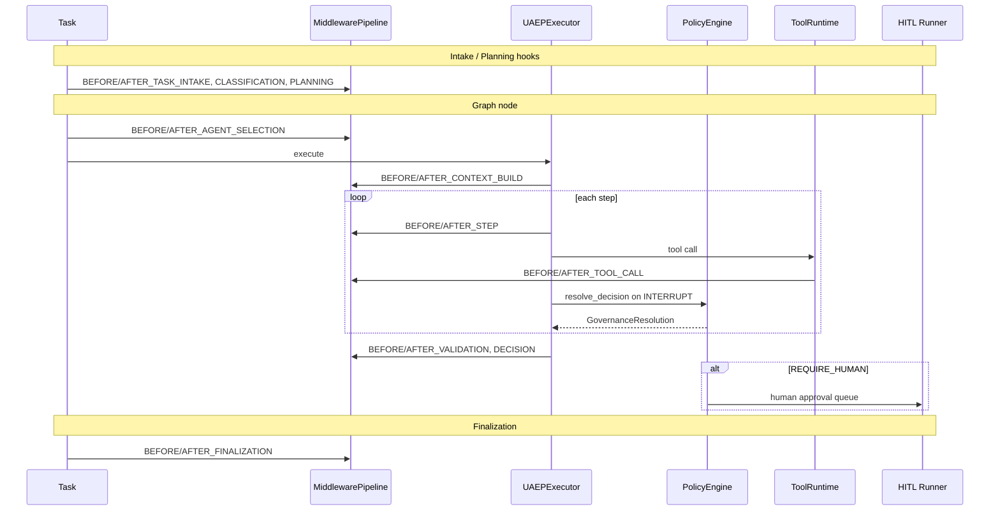
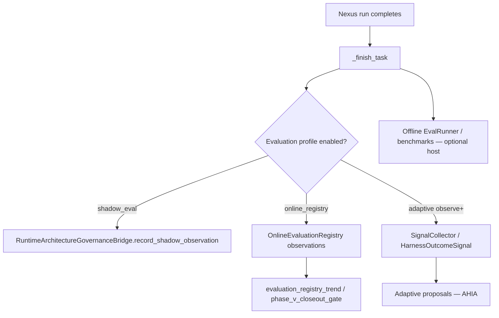

# NEXUS_EXECUTION_FLOW — §16+ scenarios & control

**Parent hub:** [`NEXUS_EXECUTION_FLOW.md`](../NEXUS_EXECUTION_FLOW.md)

## 16. Governance and policy timeline



**Policy bundle read order:** Appendix H §H.4 — bundle → agent/skills → ToolRuntime → domain fragments → human gates.

**Tier-3 security profile:** `ApplicationSecurityProfile` → `application_security_wiring.py` (prompt defense, tool injection, tenant verify).

---

## 17. Observability and measurement

### 17.1 Expected telemetry by pipeline stage

| Stage | `ExecutionPhase` | Required events (minimum) | Trace / ops filter | Metrics payload |
|-------|------------------|----------------------------|--------------------|-----------------|
| Intake | `INTAKE` | `TASK_CREATED` | `ops:lifecycle` | `task_id`, `tenant_id` |
| Classification | `CLASSIFICATION` | lifecycle hook diagnostics | `ops:planning` | `classification` in payload |
| Planning | `PLANNING` | `PLAN_CREATED` | `ops:planning` | `plan_id`, `step_count` |
| Agent selection | `AGENT_SELECTION` | hook allow/block | `ops:routing` | `agent_id` |
| Context build | `CONTEXT_BUILD` | `CONTEXT_*` when enabled | `ops:context` | assembly provenance |
| Step execution | `STEP_EXECUTION` | `STEP_STARTED/COMPLETED` | `ops:execution` | step index |
| Tool call | `TOOL_EXECUTION` | `TOOL_REQUESTED/COMPLETED/FAILED` | `ops:tool_audit` | `tool_id`, latency |
| Validation | `VALIDATION` | validation result in trace | `ops:validation` | criteria pass/fail |
| Decision | `DECISION` | `DECISION_EMITTED` | `ops:governance` | decision type |
| Interrupt | `INTERRUPT_HANDLING` | `INTERRUPT_*`, `POLICY_DECISION` | `ops:governance` | interrupt type |
| Human | `HUMAN_APPROVAL` | `HUMAN_APPROVAL_REQUESTED` | `ops:hitl` | queue id / resume token |
| Retry | `RETRY_HANDLING` | `RETRY_SCHEDULED` | `ops:retry` | alternate agent |
| Handoff | `HANDOFF` | `HANDOFF_INITIATED/COMPLETED` | `ops:handoff` | target agent |
| Graph node | — | graph trace callbacks | node id in trace DB | duration |
| Finalization | `FINALIZATION` | `TASK_COMPLETED` or terminal fail | `ops:lifecycle` | LLM/RAG aggregates in payload |
| Adaptive (optional) | — | `HarnessOutcomeSignal` | adaptive store | utility, budget |

Gate: `test_all_runtime_event_types_have_ops_filter_hint` — every `RuntimeEventType` must have an ops filter hint (FAUDIT-OBS remediation).

### 17.2 Signal summary table

| Signal | Mechanism | When emitted |
|--------|-----------|--------------|
| Lifecycle | `RuntimeEventBus` → SQLite | Every phase transition |
| Plan | `PLAN_CREATED` | After planning |
| Node | Graph trace callbacks | `on_node_start/complete` |
| Handoff | `HANDOFF_INITIATED/COMPLETED` | Dynamic handoff |
| Retry | `RETRY_SCHEDULED` | `RetryEngine` |
| HITL | `HUMAN_APPROVAL_REQUESTED` | Pause |
| Tools | `TOOL_*` events | Each `ToolRuntime.invoke` |
| Policy | `POLICY_DECISION`, `INTERRUPT_*` | UAEP governance |
| Terminal | `TASK_COMPLETED` / fail events | `_finish_task` |
| Trace DB | `RunTraceWriter` / `PersistingTaskTraceEmitter` | Full run |
| LLM metrics | `llm_tenant_scope` + completion envelope | Per LLM call |
| Adaptive | `SignalCollector` | Post-task outcome (if adaptive profile enabled) |

**Lab inspect:**

```bash
GET /debug/tasks/{id}/trace?include_runtime=true
GET /debug/tasks/{id}/events
GET /debug/tasks/{id}/metrics
```

See [`guides/HARNESS_ENVIRONMENT.md`](guides/HARNESS_ENVIRONMENT.md), Appendix H §H.5.

---

## 18. Evaluation hooks in execution flow

Quality and benchmarking are **not** a separate pipeline — they attach to the same Nexus path via Tier-3 profiles and post-run bridges.



| Hook | Where | When | Module |
|------|-------|------|--------|
| **Node validation** | `NexusValidationEngine` | After each graph node | `validation_engine.py` — criteria from `NexusPlan.validation_criteria` |
| **CVL partial verify** | `CriticOrchestrator.verify_partial` | When `CriticProfile.scopes.node_partial` | `critic_wiring.py` → `GraphExecutor` (CRIT-V-3.4) |
| **CVL final verify** | `CriticOrchestrator.verify_final` | Before terminal `COMPLETED` | `graph_runner.py` (CRIT-V-3.5) |
| **Evaluator-loop** | `EvaluatorLoopExecutor` | `CoordinationPattern.EVALUATOR_LOOP` nodes | `evaluator_loop_executor.py` → `graph_executor.py` (CRIT-V-4) |
| **Critic trace** | `CriticTraceEmitter` | Each CVL invocation | `critic.*` steps in lab trace API (CRIT-V-3.6) |
| **Validator agents** | Graph node (UC-5 / §42.43) | Scheduled like any agent | Agent contract + `ValidationResult` |
| **Shadow evaluation** | Post-step / governance bridge | When `EvaluationProfile.shadow_eval_enabled` | `runtime_governance_bridge.py` |
| **Online evaluation registry** | Post-run observation | `evaluation_wiring.py` → `NexusLoop.evaluation_registry` | `online_evaluation_registry.py` |
| **Outcome signals** | After `_finish_task` | `record_task_outcome_signal()` | `adaptive/signal_emission.py` |
| **LLM-as-judge** | Not universal — opt-in | `eval.judge` via `L1Gateway` or offline semantic `NexusEvalRunner` | `tools/providers/eval/judge.py`, `eval/nexus_eval_runner.py` (CRIT-V-2 / CRIT-V-5) |
| **Baseline / release gate** | CI / ops | `require_baseline_for_release` | `phase_v_closeout_gate.py`, `maturity_gate_evidence.py` |
| **Quality regression** | Compare runs | Evaluation registry trends | `evaluation_registry_trends.py` |

**L3+ ideal harness alignment:** baseline scores before change, post-change scores in `OnlineEvaluationRegistry`, trend comparison before promotion — see [`IDEAL_HARNESS_AI_ARCHITECTURE.md`](guides/IDEAL_HARNESS_AI_ARCHITECTURE.md) and plan Phase EVAL / V gates.

**Post-graph hook (FLOW-9):** `NexusLoop` records multi-agent evaluation observations when `EvaluationProfile` is enabled. Evaluator nodes and LLM-judge remain **opt-in** per application policy — not mandatory on every run.

---
