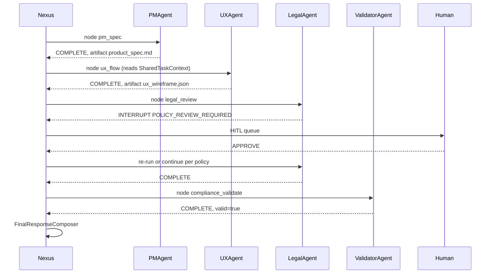

# NEXUS_EXECUTION_FLOW — §19+ scenarios & control

**Parent hub:** [`NEXUS_EXECUTION_FLOW.md`](../NEXUS_EXECUTION_FLOW.md)

## 19. Edge cases catalog

| ID | Condition | Phase | Behavior | Terminal |
|----|-----------|-------|----------|----------|
| EC-01 | No agent for capability | Planning | Empty plan / UNSUPPORTED | `FAILED` |
| EC-02 | `require_human_approval` not resumed | Planning | Checkpoint, return awaiting | `WAITING_FOR_HUMAN` |
| EC-03 | Lifecycle hook BLOCK | Any hooked phase | `early_result` | `FAILED` |
| EC-04 | Human REJECT | Intake/HITL | `handle_human_rejection` | `FAILED` |
| EC-05 | Human ESCALATE | HITL | escalation chain | `WAITING_FOR_HUMAN` |
| EC-06 | Resume after HITL | Intake | Reset to CREATED path | continue |
| EC-07 | `plan_id` pre-set on task | Planning | Skip graph_spec seed | inner planner only |
| EC-08 | Parallel batch partial fail | Graph | Stops subsequent batches | `FAILED` / partial |
| EC-09 | `NEEDS_INPUT` from agent | Graph/UAEP | Governance pause | `WAITING_FOR_HUMAN` |
| EC-10 | Cancel mid-graph | Graph | Skip pending nodes | `CANCELLED` |
| EC-11 | Checkpoint resume | Graph | Skip completed nodes | continue |
| EC-12 | Retry alternate agent | Graph | Same node, new agent_id | retry or fail |
| EC-13 | Dynamic handoff invalid | Graph | Handoff validation fail | node `FAILED` |
| EC-14 | Graph cycle (bug) | Graph | Topological fallback | **risk** — may run early |
| EC-15 | `engine` planner without LLM | Bootstrap | `OrchestrationWiringError` | host fails fast |
| EC-16 | Strict mode non-routable agent | Routing | `RuntimeError` | node fail |
| EC-17 | Long-running scheduler disabled | Reliability | No checkpoint store on loop | no auto-resume |

---

## 20. Reference flow — PM → UX → Legal (canon §42.43)

Declarative product-style flow (requires Tier-2 agents + Tier-3 `graph_spec`):

**Status:** Pattern is **documented and supported by runtime**; concrete PM/UX/Legal agents are **Phase K deferred** (plan §6.3).

---
