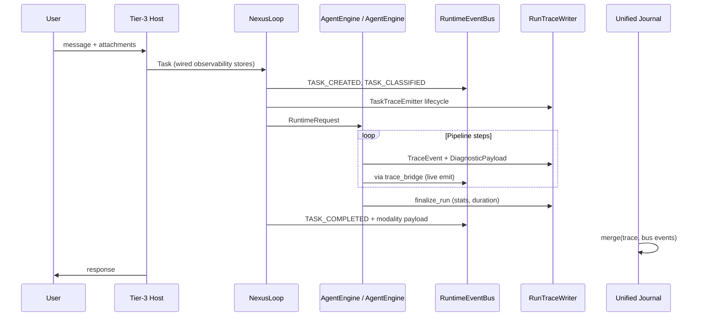

# OBSERVABILITY — §5+ extended architecture

**Parent hub:** [`OBSERVABILITY.md`](../OBSERVABILITY.md)

## 5. Information flow — end to end

### 5.1 Request lifecycle (single-agent path)



### 5.2 Multi-agent graph path

Additional signals on top of §5.1:

| Stage | Emitter | Events |
|-------|---------|--------|
| Plan → graph | `planning_runner` | `PLAN_CREATED` |
| Node start/complete | `GraphTraceCallbacks` → `TaskTraceEmitter` | bridged `STEP_STARTED/COMPLETED` |
| Delegation | `GraphExecutor` | `HANDOFF_INITIATED/COMPLETED` |
| Retry | `RetryCoordinator`, graph callbacks | `RETRY_SCHEDULED`, `RETRY_STARTED` |
| Backpressure | `GraphExecutor` | `GRAPH_BACKPRESSURE` |
| Critic | `CriticTraceEmitter` | `critic.*` steps → validation/LLM events |
| HITL pause | `hitl_runner`, `graph_runner` | `HUMAN_APPROVAL_*`, `PAUSED/RESUMED` |

### 5.3 Extension flow (agent / application custom steps)

Developers **never** write to SQLite or invent parallel buses.

```text
1. Define DiagnosticPayload subclass:
     schema_id = "intergrax.diag.<domain>.<name>"   # or "agents.<slug>.diag.<name>"
     implement to_dict(), redact()

2. Emit through spine API (`ObservabilityEmitter`):
     emitter.emit_diagnostic(
         component=TraceComponent.STEP,
         step="my_agent.custom_check",
         payload=MyAgentCheckDiagV1(...),
         event_type=RuntimeEventType.STEP_COMPLETED,  # optional canonical mapping
     )

3. Register schema in payload registry (OBS-BUS-4):
     from intergrax.runtime.observability.extension_sdk import PayloadSchemaRegistry
     PayloadSchemaRegistry.register_agent_diagnostic(MyAgentCheckDiagV1, agent_slug="<slug>")

4. (Optional) Add trace_bridge mapping if step → RuntimeEventType is non-obvious

5. Wire nothing extra in Tier-3 factory — observability stores already injected
```

**Namespace convention:**

| Owner | `schema_id` prefix | Location |
|-------|-------------------|----------|
| Harness platform | `intergrax.diag.*` | `intergrax/runtime/nexus/tracing/` |
| Critic / adaptive | `intergrax.diag.critic.*`, `intergrax.diag.adaptive.*` | `intergrax/runtime/critic/`, `adaptive/` |
| Tier-2 agent | `agents.<slug>.diag.*` | `agents/<slug>/tracing/` |
| Tier-3 product | `applications.<slug>.diag.*` | `applications/<slug>/tracing/` |

Tier-2/3 payloads MUST subclass `DiagnosticPayload` from `trace_models.py` — **no fork of the ABC**.

---

## 6. Correlation and identity model

### 6.1 Identifiers

| ID | Scope | Rule |
|----|-------|------|
| `tenant_id` | Organization / isolation boundary | Required on persisted events |
| `task_id` | User-facing work unit | Stable across retries unless policy splits |
| `run_id` | Single execution attempt | One trace timeline per run |
| `correlation_id` | Cross-service chain | Defaults to `task_id`; propagated to children |
| `parent_event_id` | Causal tree | Set by `TraceScope` / `ObservabilityEmitter` on nested calls |
| `event_id` | Unique event | `evt_*` (bus) or UUID (trace) |
| `node_id` | Graph node | Set during graph execution |
| `step_id` | UAEP / pipeline step | Middleware + UAEP |

### 6.2 TraceScope (OBS-BUS-2 — shipped)

`TraceScope` is a context manager on the spine (`intergrax/runtime/observability/trace_scope.py`):

```text
with TraceScope(emitter, run_id=..., task_id=..., tenant_id=...) as scope:
    with scope.step("tool.invoke") as step_scope:
        ...  # child events inherit parent_event_id from step anchor
```

`ObservabilityEmitter` reads the active scope when bridging trace rows to the bus. Adoption continues path-by-path in harness emitters; the contract and API are platform-complete.

---

## 7. What the platform collects (inventory)

### 7.1 Harness-native steps (automatic — no agent code)

| Domain | TraceComponent | Example `step` / schema | RuntimeEventType (via bridge or direct) |
|--------|----------------|-------------------------|----------------------------------------|
| Run lifecycle | RUNTIME | `runtime_run_start/end` | TASK_* via lifecycle |
| Session / ingest | PIPELINE | `session_and_ingest_summary` | INGESTION_FAILED |
| History / context | PIPELINE | `history_summary` | CONTEXT_BUILT |
| RAG | RAG | `rag_summary` (`intergrax.diag.rag.summary`) | — (trace); CONTEXT_* (bus) |
| Web search | WEBSEARCH | `websearch_summary` | — |
| Tools | TOOLS | `tool_invocation_*` | TOOL_* |
| LLM | ENGINE | `core_llm`, `core_llm_call_recorded`, `llm_catalog_miss` (`resolution_tier`) | LLM_CALL |
| Plan / replan | PLANNER | `engine_plan_produced`, `plan_source_*` | PLAN_* |
| Memory | MEMORY | `user_longterm_memory_summary` | MEMORY_* |
| Budget | POLICY | budget diagnostics | — |
| Policy | POLICY | policy enforcer | POLICY_DECISION |
| Critic | CRITIC | `critic.l0_failed`, `critic.final_verdict` | VALIDATION_* / LLM_CALL |
| Graph | PLANNER | `graph node start/complete` (string today) | STEP_* |
| Adaptive L4 | RUNTIME | adaptive signals | ADAPTIVE_* |

#### 7.1.1 LLM catalog miss SLO (M-LLM-X.16)

**Signal:** Plane A `step=llm_catalog_miss` · bus `LLM_CALL` · metric `intergrax_llm_catalog_miss_total{tenant_id,provider,model,resolution_tier}`.

| `resolution_tier` | Trace level | Suggested response | SLO posture |
|-------------------|-------------|-------------------|-------------|
| `fallback_default` | WARNING | Treat as **incident** for production tenants — wrong context budget | **Zero tolerance** in steady state; page on first sustained occurrence |
| `provider_default` | WARNING | Track rate by provider; common for new OpenRouter ids | **Low rate** acceptable short-term; alert if >5 misses / 30 min / provider (tune per tenant) |
| `prefix_rule` | WARNING | Informational unless volume high | Monitor weekly; bulk-add exact entries when same prefix repeats |

**Escalation:** `fallback_default` → on-call + catalog YAML patch or profile override within SLA; `provider_default` spike → platform ops + catalog/gateway metadata review; `prefix_rule` bulk → catalog hygiene backlog.

**Operator runbook:** [`intergrax/llm_adapters/USAGE.md`](../../intergrax/llm_adapters/USAGE.md) § Catalog miss operator runbook.

**CI gates:** `scripts/check_llm_catalog_miss_observability.py` (**LLM-MAINT-05**) · registered in `check_observability_gates.py` and `check_audit_ideal_gates.py` (**LLM-MAINT-06**).

### 7.2 UAEP executor signals

`intergrax/agents/uaep.py` emits directly to the bus: `CONTEXT_BUILT`, `DECISION_EMITTED`, `VALIDATION_PASSED/FAILED`, `POLICY_DECISION`, `INTERRUPT_REQUESTED`, `HUMAN_APPROVAL_REQUESTED`.

### 7.3 Closed harness gaps (OBS-BUS closeout)

All rows below were remediated in Phase OBS-BUS. **No open harness spine gaps** remain; product dashboards and mandatory external APM stay out of scope (plan §6.3a).

| Gap | Remediation |
|-----|-------------|
| `AGENT_SELECTED` not emitted | `AgentRouter` + `agent_selection.v1` (OBS-BUS-3) |
| `STEP_FAILED` not emitted on pipeline errors | `RuntimeStepFailedDiagV1` bridge (OBS-BUS-3) |
| `parent_event_id` unused | `TraceScope` + `ObservabilityEmitter` (OBS-BUS-2) |
| Graph nodes use string messages only | `graph_node.v1` payloads (OBS-BUS-3) |
| Untyped runtime payload keys | `payload_registry` + `schema_guard` (OBS-BUS-1) |
| Critic `evaluator_loop` not in bridge catalog | Bridge catalog entry (OBS-BUS-3) |
| Parser trace separate from run journal | `journal_export` + parser flush link (OBS-BUS-6) |

---

## 8. Typing model

### 8.1 Current state (L4 — OBS-BUS Done)

```text
TraceEvent.payload        → DiagnosticPayload (enforced)
RuntimeEvent.payload      → Dict envelope with payload_schema_id + data (registry-backed)
PayloadSchemaRegistry     → schema_id ↔ Pydantic model (canonical + extension SDK)
Extension SDK             → agents.<slug>.diag.* / applications.<slug>.diag.*
TraceScope                → parent_event_id causal tree
Persistence boundary      → JSON serialize at store append only
```

`trace_bridge` and `ObservabilityEmitter` populate `payload_schema_id` and structured `data` for catalog mappings. Legacy promoted keys (`model`, `tool_name`, …) may still appear for backward-compatible reads.

Canonical payload families (canon §42.23.1):

| Schema family | Used for |
|---------------|----------|
| `decision.v1` | Agent decisions |
| `tool.v1` | Tool invocations |
| `validation.v1` | Critic / schema validation |
| `interrupt.v1` | Policy interrupts |
| `human.v1` | HITL responses |
| `handoff.v1` | Graph delegation |
| `agent_selection.v1` | Router outcomes |
| `graph_node.v1` | Node execution |

### 8.2 Residual evolution (post-OBS-BUS, not blocking L4)

| Item | Notes |
|------|-------|
| Layered identity (`event_kind`, `EventCatalog`) | **OBS-EVOL-9** · ADR-OBS-003 · pre-release spine consolidation |
| `runtime_event.v2` preview | **OBS-MAINT-01** — accepted via `PREVIEW_RUNTIME_SCHEMA_VERSIONS`; canonical wire format remains `runtime_event.v1` until migration |

### Pre-release spine consolidation checklist (OBS-MAINT-04)

1. `uv run python scripts/check_observability_gates.py` green  
2. Payload registry includes all `RuntimeEventType` mappings  
3. Tenant propagation on hot-path events (`check_runtime_event_tenant_propagation.py`)  
4. Product dashboards deferred to [`plan/PLATFORM_FOUNDATION.md`](../plan/PLATFORM_FOUNDATION.md) §6.3a (Phase K) — **OBS-MAINT-02**

### 8.3 Extension rules for developers

1. **Subclass `DiagnosticPayload`** — never emit raw dicts through `RuntimeState.trace_event` (Plane B debug).
2. **Domain bus signals** — use `emit_domain_signal(kind, payload)` with registered extension payload; do **not** add `RuntimeEventType` (§4.4).
3. **Stable `schema_id`** — never reuse for different semantics; bump `schema_version` on breaking changes.
4. **Implement `redact()`** — assume production persistence.
5. **Register** new schemas in payload registry (CI gate) and document `event_kind` in agent `ARCHITECTURE.md`.
6. **Do not** import trace stores in Tier-2 — use `AgentEngine` / Nexus context only.

---

## 9. Persistence and wiring

### 9.1 Default (lab / single-tenant)

| Store | Env variable | Interface | Content |
|-------|--------------|-----------|---------|
| Run trace | `INTERGRAX_TRACE_DB` | `RunTraceWriter` | `TraceEvent` sequence + `RunMetadata` |
| Runtime events | `INTERGRAX_RUNTIME_EVENTS_DB` | `RuntimeEventPersistence` | `RuntimeEvent` journal |
| Checkpoints | `INTERGRAX_CHECKPOINTS_DB` | `TaskCheckpointReader` | Long-running state |
| Task memory | `INTERGRAX_TASK_MEMORY_DB` | `TaskMemoryPersistence` | KV memory |

### 9.2 Tier-3 wiring (zero custom observability code)

```python
from intergrax.applications._shared.observability_wiring import wire_application_observability

wiring = wire_application_observability(env_profile)
# wiring.stores.trace_store
# wiring.stores.runtime_event_store
# → passed to NexusLoop / AgentEngine via runtime_config_bridge
```

**Code path:** `observability_wiring.py` → `wire_nexus_observability()` → `open_run_trace_store()` + `resolve_runtime_event_persistence()`.

**Profiles:** `ObservabilityProfile` on `ApplicationEnvironmentProfile` controls `use_in_memory_trace`, `enable_runtime_events`.

### 9.3 Scale-out path

| Trigger | Backend | Integration | Runtime contract |
|---------|---------|-------------|------------------|
| >1M events/day/tenant | Cassandra | `document_store=cassandra` | `DocumentBackedRuntimeEventStore` via `cassandra/runtime_events.py` |
| Full-text on payloads | Elasticsearch / OpenSearch | `observability_backend=elasticsearch` | Same `RuntimeEventPersistence` protocol; search index via document-backed store |
| Centralized trace UI | Phoenix, Langfuse | Dual-write from journal export (`export_bridge.py`); parser trace for ingest | `INTERGRAX_EXPORT_JOURNAL` (default on) |
| Metrics at scale | Prometheus + OTLP | `IntegrationProfile.harness_environment()` | — |

**Profile wiring:** `open_runtime_event_store_from_profile()` resolves SQLite (default), Cassandra document store, or Elasticsearch lab index — all wrapped in `ValidatingRuntimeEventPersistence`.

**Conformance:** `assert_runtime_event_persistence_conformance()` in `intergrax/runtime/observability/persistence_conformance.py` — gate: `check_observability_persistence_conformance.py`.

**Rule (canon §33.1):** Extend `RunTraceWriter` / `RuntimeEventPersistence` — do not fork a parallel trace system.

**Compute / worker elastic capacity** (Nexus replicas, queue workers, load balancers): [`ELASTIC_CAPACITY_AND_SCALING.md`](ELASTIC_CAPACITY_AND_SCALING.md#production-boundary) — capacity signals and governed scaling; distinct from datastore scale-out above; not a production autoscaler by default.

### 9.4 Custom persistence adapter

Implement `RuntimeEventPersistence` protocol (`append`, `list_for_run`, `list_for_task`) and `RunTraceWriter` / `RunTraceReader`. Register via `IntegrationProfile` factory — same as other integration providers. Run the conformance harness before shipping a new backend.

---

## 10. Read path — inspection and monitoring

### 10.1 Unified run journal

```python
from intergrax.runtime.events.unified_run_journal import build_unified_run_journal

journal = build_unified_run_journal(persisted_run, runtime_store=event_store)
# List[RuntimeEvent] chronological — operator source of truth
```

Merge rules: persisted bus events win on `event_id`; dedupe by `trace_event_id`.

### 10.1.1 Journal export (OBS-BUS-6)

On ``TASK_COMPLETED``:

1. **Payload ref** — `journal_ref` on the terminal runtime event (`schema_version`, `run_id`, `tenant_id`, `event_count`, `parser_trace_count`).
2. **Plugin export** — `runtime.journal_export` builds `build_journal_export_snapshot()`, logs OTLP-style JSON (`render_journal_otlp_json`), and calls `export_parser_traces_from_events()` for ingest parser spans.

```python
from intergrax.runtime.observability.journal_export import build_journal_export_snapshot, render_journal_otlp_json
from intergrax.runtime.observability.export_bridge import register_journal_export_plugin
```

Disable export: `INTERGRAX_EXPORT_JOURNAL=0`. Parser vendor export remains `INTERGRAX_EXPORT_PARSER_TRACE=1`.

### 10.2 Operator surfaces

| Surface | Command / route | Returns |
|---------|-----------------|---------|
| Debug CLI | `python -m intergrax.debug trace <run_id>` | Timeline |
| Debug HTTP | `GET /debug/tasks/{run_id}/trace?include_runtime=true` | Unified journal |
| Events | `GET /debug/tasks/{run_id}/events` | Bus history |
| Metrics | `GET /debug/tasks/{run_id}/metrics` | `RunMetricsExport` |
| Progress | `GET /debug/tasks/{task_id}/progress` | Long-running % |

### 10.3 Monitoring in production

| Signal | Mechanism |
|--------|-----------|
| Error rate | Subscribe to `RuntimeEventType.*_FAILED`, `ops:alert` hints |
| Tool audit | `TOOL_*` events, `ops:tool_audit` |
| LLM cost | `TASK_COMPLETED` payload + LLM metrics plugin |
| HITL backlog | `HUMAN_APPROVAL_REQUESTED` without `RECEIVED` |
| Retry storms | `RETRY_STARTED` rate per tenant |
| Graph pressure | `GRAPH_BACKPRESSURE` |

**Ops filter hints:** `intergrax/runtime/events/phase_coverage.py` → `EVENT_OPS_FILTER_HINTS`.

External: wire `RuntimeEventBus.subscribe()` to PagerDuty/Slack via `notify` tools or custom handler.

---

## 11. Security, privacy, and retention

| Control | Implementation |
|---------|----------------|
| PII redaction | `DiagnosticPayload.redact()`, `DEFAULT_REDACTED_TEXT`, `production_mode` on messages |
| Tool I/O | `ToolInvocationStartDiagV1.redact()` strips input; end redacts output preview |
| Secrets | Never in payload; policy blocks at ToolRuntime |
| Tenant isolation | `tenant_id` on all persisted rows; queries scoped |
| Retention | Store-level policy (future); STM memory has `retention_enforcement` |

---

## 12. Tier responsibilities

| Tier | Responsibility | Must NOT |
|------|----------------|----------|
| **Tier-0** | Metrics bridges (LLM, RAG), parser trace export, observability integration providers | Own per-agent trace format |
| **Tier-1** | Spine, bus, bridge, journal, wiring, middleware, debug API | Contain business logic |
| **Tier-2** | Domain `DiagnosticPayload` extensions; consume spine via AgentEngine | Import trace DB, custom buses |
| **Tier-3** | `wire_application_observability`, profile selection, optional sinks | Reimplement RunTraceWriter |

---

## 13. Relationship to other architecture docs

| Document | Relationship |
|----------|--------------|
| [intergrax_runtime_architecture.md](intergrax_runtime_architecture.md) §33, §42.1, §42.24 | Normative summary; this doc is the deep dive |
| [architecture/NEXUS_EXECUTION_FLOW.md](architecture/NEXUS_EXECUTION_FLOW.md) | Execution narrative; cross-links execution phases |
| [architecture/CRITIC_VERIFICATION.md](architecture/CRITIC_VERIFICATION.md) | Critic trace steps on the spine |
| [architecture/ADAPTIVE_HARNESS_INTELLIGENCE.md](architecture/ADAPTIVE_HARNESS_INTELLIGENCE.md) | `ADAPTIVE_*` events |
| [guides/HARNESS_ENVIRONMENT.md](guides/HARNESS_ENVIRONMENT.md) | Lab OTLP, env vars, local backends |
| [architecture/LLM_ADAPTERS.md](architecture/LLM_ADAPTERS.md) | LLM metrics plane |
| [guides/AGENT_CREATION_GUIDE.md Appendix Q](guides/AGENT_CREATION_GUIDE.md#appendix-q--observability-control-plane-closeout) | Author wiring checklist |

---

## 14. Maturity model

| Level | Criteria |
|-------|----------|
| **L0** | Ad-hoc logging only |
| **L1** | Trace file per run, no correlation |
| **L2** | TraceEvent + SQLite, partial bus |
| **L3** | Unified journal, DiagnosticPayload guard, wiring CI |
| **L4** | Typed RuntimeEvent payloads, TraceScope tree, catalog emission, extension SDK, journal export (**current — OBS-BUS Done**) |

Audit map §21 score: **L4** (OBS-BUS-7 gate evidence).

---

## 15. Code map (implementation reference)

| Concern | Path |
|---------|------|
| Trace models | `intergrax/runtime/nexus/tracing/trace_models.py` |
| Trace payloads | `intergrax/runtime/nexus/tracing/**/*.py` |
| Runtime events | `intergrax/runtime/events/runtime_event.py` |
| Event catalog (SSOT) | `intergrax/runtime/events/event_catalog.py` |
| Domain signals (target) | `intergrax/runtime/events/signals.py`, `emit_context.py` |
| Journal query (target) | `intergrax/runtime/events/journal_query.py` |
| Event bus | `intergrax/runtime/events/event_bus.py` |
| Trace bridge | `intergrax/runtime/events/trace_bridge.py` |
| Emitter + TraceScope | `intergrax/runtime/observability/emitter.py`, `trace_scope.py` |
| Extension SDK | `intergrax/runtime/observability/extension_sdk.py`, `intergrax/scaffold/tracing_templates.py` |
| Persistence conformance | `intergrax/runtime/observability/persistence_conformance.py`, `events/stores/document_backed_runtime_event_store.py` |
| Unified journal | `intergrax/runtime/events/unified_run_journal.py` |
| Journal export | `intergrax/runtime/observability/journal_export.py`, `export_bridge.py` |
| Nexus wiring | `intergrax/runtime/nexus/observability_wiring.py` |
| App wiring | `intergrax/applications/_shared/observability_wiring.py` |
| Pipeline emit | `intergrax/runtime/nexus/engine/runtime_state.py` |
| Task lifecycle | `intergrax/runtime/task/task_trace.py` |
| Critic trace | `intergrax/runtime/critic/trace.py` |
| Graph trace | `intergrax/runtime/nexus/orchestration/graph_trace_callbacks.py` |
| Middleware | `intergrax/runtime/middleware/trace_middleware.py` |
| Metrics export | `intergrax/runtime/metrics/export.py` |
| Debug API | `intergrax/debug/router.py`, `formatters.py` |
| SQLite stores | `intergrax/runtime/nexus/tracing/sqlite_run_trace_store.py`, `events/store.py` |
| Gates | `scripts/check_observability_gates.py`, `test_observability_layer_depth_gate.py`, emission/schema/persistence audits |

---

## 16. Verification

After harness observability changes:

```bash
uv run pytest -m gate -q
python scripts/check_harness_no_getattr.py
uv run python scripts/check_observability_gates.py
```

`check_observability_gates.py` runs trace-bridge catalog, emission coverage, payload schema registry, persistence conformance, and L4 depth gate tests (CI: `.github/workflows/unit-tests.yml`).

---

## 17. Session closeout

**OBS-BUS (L4):** **Done** (2026-06-08) — unified spine, typed payloads, extension SDK, journal export, CI gates.

**OBS-EVOL-9 (P1-ARCH-02):** **Done** (2026-06-17) — layered identity (`event_kind`, `EventCatalog`, `DOMAIN_SIGNAL`, profile subscriptions, W3C trace context). Publication-ready spine (56 types). See plan OBS-EVOL-9 register and §4.4.7–4.4.13.

**Not in spine scope:** product dashboards (§6.3a), mandatory external APM, per-agent private trace DBs.

---

## 18. Execution Boundary Export (EBE) — optional side channel

**Status:** PoC v1 **Done** · PoC v2 (EBE-8) **Done** (partner validated) · **EBE-9 host signing Done** (partner validated).  
**Reference host:** `applications/attestation_demo/` · **ADR:** [ADR-OBS-002](../adr/entries/2026-06-13/ADR-OBS-002.md) · [ADR-OBS-004](../adr/entries/2026-06-19/ADR-OBS-004.md)

EBE is an **optional** export path for **unsigned, vendor-neutral** tool-boundary facts. It complements — does not replace — the Harness Observability Spine (HOS).

| Principle | Rule |
|-----------|------|
| **Emit at invoker boundary** | `RuntimeToolInvoker` hook after tool execution |
| **Emit at kernel step boundary** | `HarnessKernel.execute_step` hook after trace append (EBE-8) |
| **Event-first, receipt-second** | Platform emits `execution_boundary_event.v1`; external products sign receipts |
| **One event, one receipt** | Partner maps each `boundary_events[]` element to a separate `client_observed` receipt |
| **Non-blocking** | Buffer/sink failures never fail tool invoke |
| **Honest trust** | Unsigned when signing off (`signed: false`); host-signed when EBE-9 enabled (`host_attested`); no implied `server_attested` |
| **HOS unchanged** | Unified journal, trace bridge, middleware — no receipt logic |

### Schema

`execution_boundary_event.v1` — Pydantic model in `intergrax/runtime/attestation/execution_boundary_event.py`.

| Field | Role |
|-------|------|
| `boundary_type` | `tool_execution` (invoker) or `harness_step` (kernel) |
| `event_id` | Stable UUID per event (receipt key) |
| `event_sequence` | Monotonic per `run_id`, assigned by `BoundaryEventBuffer` |
| `policy_verdicts` / `step_outcome` | Harness-step events only |

### Configuration

`ExecutionBoundaryExportProfile` on `ApplicationEnvironmentProfile` (`step_level_enabled` for EBE-8) → `attestation_runtime_bridge.py` → `RuntimeConfig.execution_boundary_export` + optional `BoundaryEventBuffer`. UAEP and ACP session loops copy settings into `StepKernelContext` via `kernel_wiring.py`.

### PoC v2 delivery (EBE-8)

Synchronous API response (`boundary_events[]`) returns **two events per demo run** when `step_level_enabled=true`: `tool_execution` (seq 1) then `harness_step` (seq 2). Webhook sink remains **deferred**.

### PoC v3 delivery (EBE-9 host signing)

When `host_signing_enabled=true`, each event includes `signed: true` and a `host_attestation` envelope. Intergrax:

1. Canonicalizes the unsigned event → `signed_payload_hash`
2. Signs canonical JSON host-attestation statement (`boundaryattest.host-attestation.v1`)
3. Exposes `trust_model.recommended_receipt_role: host_attested`

Unsigned v2 remains available when signing is disabled. Golden vector: `applications/attestation_demo/partner_handoff/ebe9_golden_vector.v1.json`. Spec: `EBE-9_HOST_SIGNING.md`.

**Partner validation — EBE-8 (unsigned v2, 2026-06):** BoundaryAttest adapter confirmed one `client_observed` receipt per event, hash parity, independent verification, and intentional dual claims on the failed-tool fixture. Reference: `agent_experiment_runtime` @ `106aee776fcc6053e8265b9c3656638d107d351d`.

**Partner validation — EBE-9 (host signing, 2026-06):** BoundaryAttest verifier @ `61be9918bc8f91fc8f160e0392d2914f38f3d4cb` passed golden vector byte-for-byte, 39/39 tests, live two-event response from Intergrax @ `96b7f997`, unsigned v2 regression, and negative tamper cases. Host signature verified separately; partner receipts remain `client_observed`. Handoff docs: `agent_experiment_runtime` @ `13102cfaff1a7a9d212c16cd16587477cc533dc0`.

**Trace correlation scope:** `GET /debug/tasks/{run_id}/trace` supports run/task-level journal comparison (agent, capability, graph node, critic, task state). It does **not** expose EBE `event_id`, `step_id`, or `tool_id`; exact per-event correlation uses the live `boundary_events[]` from `POST /poc/run` (or buffered replay endpoint). Enriching HOS trace with EBE identifiers is optional future work, not a PoC v2 requirement.

### Non-goals

- Intergrax receipt product or BoundaryAttest embedding
- Mandatory EBE on all hosts

---

*This document is the canonical observability architecture. Update it when changing spine contracts, emission rules, or persistence profiles. Implementation status: [Phase OBS-BUS — Done](../plan/OBSERVABILITY.md). EBE PoC v1: [Phase EBE](../plan/OBSERVABILITY.md#phase-ebe--execution-boundary-export-partner-poc).*
