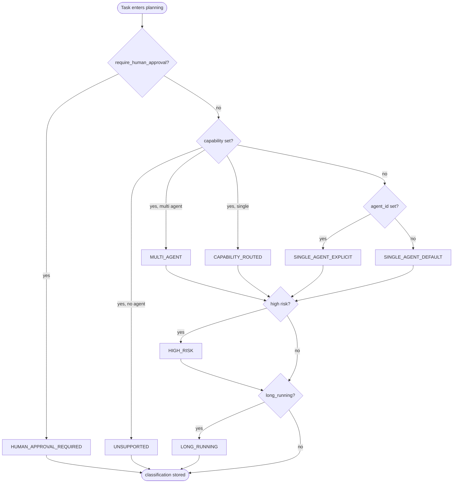
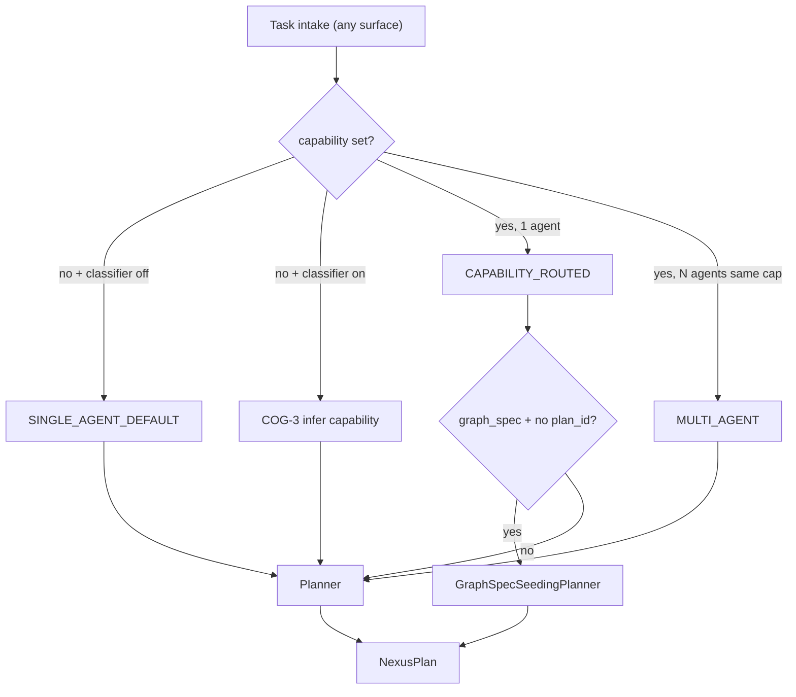
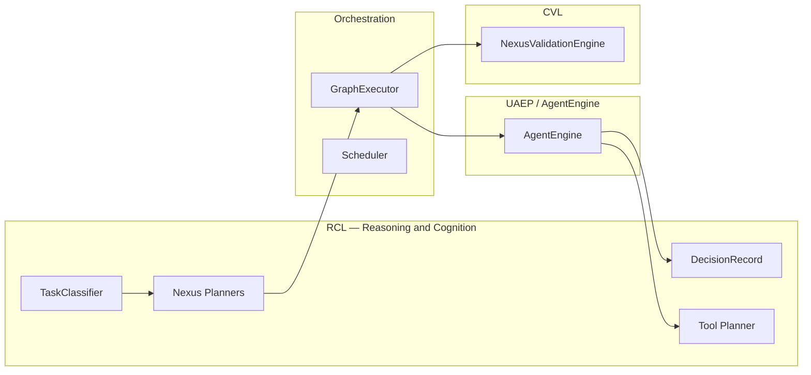
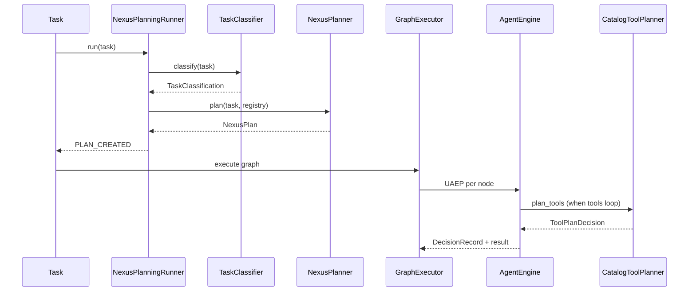

# REASONING_AND_COGNITION — §8+ extended architecture

**Parent hub:** [`REASONING_AND_COGNITION.md`](../REASONING_AND_COGNITION.md)

## 8. Domain boundaries

```text
REASONING_AND_COGNITION  →  what / why (plan, classify, decide, tool select)
ORCHESTRATION            →  when / order / retry / parallel (graph, scheduler)
NEXUS_EXECUTION_FLOW     →  end-to-end narrative across domains
LLM_ADAPTERS             →  provider wire protocol, response envelope
AGENT_CONTRACTS §17      →  prompt asset governance (input to cognition)
MEMORY §7                →  context compiler output fed into cognition
CRITIC_VERIFICATION      →  verify outputs and trajectories (post-decision)
```

| Adjacent domain | RCL hands off | RCL receives |
|-----------------|---------------|--------------|
| `ORCHESTRATION` | `NexusPlan` | classified `Task`, registry |
| `UNIFIED_EXECUTION_RUNTIME` | step decisions | UAEP execution context |
| `LLM_ADAPTERS` | `generate_messages` requests | `LLMAdapterResponse` |
| `TOOLS` | `ToolPlanDecision` | tool schemas, policy tags |
| `CRITIC_VERIFICATION` | agent output artifacts | validation failures (revise loops) |

---

## 9. Task classification

Classification is the **first cognition decision** on every Nexus task. It constrains planner behavior but does **not** mutate `Task.state` — `TaskLifecycle` owns lifecycle state.

**Module:** `intergrax/runtime/nexus/task_classifier.py`  
**Runner integration:** `NexusPlanningRunner.run()` after intake hooks  
**Wiring:** `OrchestrationProfile.classifier_kind` → `default` | `rules` | `llm` (`orchestration_wiring.py` · ORCH-CONFIG.1 · COG-3.*)

### 9.1 Classification labels

| `TaskClassification` | Meaning | Planner effect |
|----------------------|---------|----------------|
| `SINGLE_AGENT_DEFAULT` | No explicit agent or capability | One step; first registry agent |
| `SINGLE_AGENT_EXPLICIT` | `task.agent_id` set | One step; fixed agent |
| `CAPABILITY_ROUTED` | Capability matches one agent | One step; capability match |
| `MULTI_AGENT` | Multiple agents share capability | Sequential steps; order from `multi_agent_order` |
| `UNSUPPORTED` | No agent for requested capability | Empty plan → terminal FAILED |
| `HUMAN_APPROVAL_REQUIRED` | Governance flag | Plan created; pause before graph if not resumed |
| `HIGH_RISK` | Risk label on agent/flag | Label overlay; underlying strategy preserved |
| `LONG_RUNNING` | Long-running profile enabled | Label; checkpoint path when scheduler enabled |

### 9.2 Decision flow



### 9.3 Trace events

| Phase | Event | Hint group |
|-------|-------|------------|
| Classification | lifecycle hook diagnostics | `ops:planning` |
| | payload includes `classification` | |

**Done (ORCH-CONFIG.1 · COG-3.*):** `classifier_kind=rules|llm` + `IntentRoute` on `OrchestrationProfile`; LLM classifier falls back to deterministic rules on parse failure; classification trace includes confidence + rationale when available.

### 9.4 Orchestration routing modes (do not confuse with `TaskClassification`)

`TaskClassification` labels describe **how many agents match the requested capability**, not the **multi-agent collaboration topology**. Authors need a separate mental model:

| Routing mode | How it is selected | Agent roles | Typical classification label |
|--------------|-------------------|-------------|------------------------------|
| **Single-agent routed** | One agent matches `task.context.capability` | One specialist | `CAPABILITY_ROUTED` |
| **Same-capability multi-agent** | Multiple agents declare **identical** capability | Competing or sequential specialists with same skill tag | `MULTI_AGENT` |
| **Pipeline graph** | `ApplicationGraphSpec` on profile + task without `plan_id` | Different capabilities in fixed order | `CAPABILITY_ROUTED` or `MULTI_AGENT` after graph seed |
| **Pipeline capability** | `task.context.capability` ends with `.pipeline` (convention) | Planner emits known multi-step plan | Varies; often `CAPABILITY_ROUTED` |
| **Engine-planned** | `planner_kind=engine` | LLM builds `NexusPlan` from registry + message | Underlying label preserved |
| **Explicit agent** | `task.agent_id` set | Fixed agent regardless of capability | `SINGLE_AGENT_EXPLICIT` |

```text
WRONG:  "I have 2 agents (docs + web) → MULTI_AGENT will chain them"
RIGHT:  "I have 2 agents → graph_spec DEPENDS_ON chain OR *.pipeline OR engine planner"
```

| Symptom | Misconfiguration | Fix |
|---------|------------------|-----|
| Only first agent runs | `CAPABILITY_ROUTED` with one matching capability | Add `graph_spec` or use `*.pipeline` |
| All same-capability agents run in sequence | `MULTI_AGENT` triggered intentionally | Expected only for redundant specialists |
| Graph ignored | Task carries pre-built `plan_id` | Clear `plan_id` for fresh graph seed |
| Chat sends free text, wrong agent | No L1 capability; classifier not enabled | `classifier_kind=rules` + `IntentRoute`, or host `B1` shim |

**Cross-ref:** full configuration canon (CFG-*, matrices, plan register) — [`ORCHESTRATION.md`](ORCHESTRATION.md) §56 · Tier-3 host summary — [`TIER3_APPLICATION_ENVIRONMENT.md`](TIER3_APPLICATION_ENVIRONMENT.md) §23.

### 9.5 Intake → classification → planning contract



**Ownership:** Tier-3 sets `capability` unless COG-3 classifier is enabled. Tier-1 never parses vendor-specific payload formats — adapters normalize first.

---

## 10. Nexus planning

Planning produces **`NexusPlan`** — the task-level contract consumed by `plan_to_execution_graph()`.

### 10.1 Core models

```python
# intergrax/runtime/nexus/planning/task_planner.py

class PlanStep(BaseModel):
    step_id: str
    agent_id: str | None
    capability: str | None
    description: str
    depends_on: list[str]
    delegation: DelegationSpec | None

class NexusPlan(BaseModel):
    plan_id: str
    task_id: str
    classification: str
    steps: list[PlanStep]
    validation_criteria: list[str]
    graph_retry_on_error: int | None
```

### 10.2 Planner selection

| `OrchestrationProfile.planner_kind` | Implementation | LLM? |
|-------------------------------------|----------------|------|
| `null` / `default` | `TaskPlanner()` | No |
| `engine` | `EngineBackedNexusPlanner` → `build_nexus_plan_from_llm()` | Yes |
| unknown | — | `OrchestrationWiringError` at bootstrap |

**Bootstrap rule:** `planner_kind=engine` requires `OrchestrationWiringContext.llm_adapter` — host fails fast otherwise.

**Parse rule:** LLM planner validates `agent_id` against `registry.list_routable_agent_ids()`; any unknown id → fallback to `TaskPlanner`.

### 10.3 Deterministic TaskPlanner strategies

| Trigger | Plan shape |
|---------|------------|
| Default / single-agent classifications | 1 step |
| `MULTI_AGENT` | N sequential steps with `depends_on` chain |
| `research.pipeline` or `intent=research_summarize` | 2 steps: web_search → summarize |
| `*.pipeline` (product convention) | Prefer `graph_spec` seed or registered planner rule — do not assume generic `TaskPlanner` knows every product |
| `UNSUPPORTED` | 0 steps |

**Ordering:** `OrchestrationProfile.multi_agent_order` — `registry` (default) or declared stable order (FLOW-17).

### 10.4 LLM-backed Nexus planner (FLOW-1)

`EngineBackedNexusPlanner` (`orchestration_wiring.py`) delegates to `build_nexus_plan_from_llm()`:

1. Resolve prompt via `nexus_planner_prompts.nexus_task_planner_prompt()` — registry id `nexus_task_planner` (system + `user_template` variables)
2. Call planner `LLMAdapter.generate_messages` (producer-separated when `ReasoningProfile.planner_llm_profile` set — §16)
3. Parse JSON `{"steps":[{"agent_id","description","depends_on"}]}` with optional `planner_parse_retries` (COG-PROD.2)
4. On any validation failure → `TaskPlanner.plan()` fallback; annotate `ReasoningFailureKind` on metadata

### 10.5 Planning phase runner

`NexusPlanningRunner` (`planning_runner.py`):

1. Intake hooks (`BEFORE_TASK_INTAKE`, classification hooks)
2. `classifier.classify(task)`
3. Pre-plan policy hooks (FLOW-11)
4. `planner.plan(task, registry)` → `NexusPlan`
5. HITL gate when `HUMAN_APPROVAL_REQUIRED`
6. Emit `PLAN_CREATED` (`ops:planning`) with `plan_id`, `step_count`
7. Set lifecycle `PLANNED`

**Policy integration:** `PolicyEngine` may BLOCK at planning boundary — classified as reasoning-policy failure (§17).

### 10.6 Plan → execution handoff

```text
NexusPlan
    → plan_to_execution_graph()   # graph_builder.py
    → ExecutionGraph
    → GraphExecutor               # ORCHESTRATION domain
```

RCL responsibility **ends** at validated `NexusPlan` handoff; graph execution is orchestration.

---

## 11. Declarative graph seeding

When Tier-3 declares `ApplicationEnvironmentProfile.graph_spec.nodes` and the task has **no** pre-set `plan_id`:

```text
GraphSpecSeedingPlanner wraps inner planner
    if should_seed_plan_from_graph_spec(task):
        application_graph_spec_to_nexus_plan(spec, task)
    else:
        inner.plan(task, registry)
```

| Edge kind | Effect on `NexusPlan` |
|-----------|----------------------|
| `DEPENDS_ON` | Target step `depends_on` source |
| `DELEGATES_TO` | Child step + `DelegationSpec` on child ([ADR-FLOW-001](../adr/entries/2026-06-07/ADR-FLOW-001.md)) |

**Authoring:** `AgentGraph` fluent builder — `intergrax/applications/contracts/graph_builder.py`  
**Application domain:** [`TIER3_APPLICATION_ENVIRONMENT.md`](TIER3_APPLICATION_ENVIRONMENT.md)

---

## 12. Retired engine planner stack

**Status:** **Removed** (ACP-CLOSE-LEG-5 · [ADR-FLOW-005](../adr/entries/2026-06-12/ADR-FLOW-005.md)).

The Tier-1 **agent session** pipeline (`RuntimeEngine`, `RuntimePipeline`, `runtime_steps/`, pipeline-bound `plan_loop_controller`) was deleted (ACP-CLOSE-LEG-5). Per-run step decomposition and replan are **author responsibilities** inside **`on_next_step`** (cognitive patterns: ReAct, plan-execute, reflection). Nexus **task** planning (`EngineBackedNexusPlanner`, `nexus_llm_plan_builder`, `TaskPlanner`) is unchanged — it schedules multi-agent work, not in-session cognitive steps.

**Active planning paths:**

| Path | Entry | Output | Typical use |
|------|-------|--------|-------------|
| Nexus task planning | `NexusPlanningRunner` / `TaskPlanner` | `NexusPlan` | Multi-agent task orchestration |
| Nexus engine kind | `planner_kind=engine` → `EngineBackedNexusPlanner` | `NexusPlan` via `nexus_llm_plan_builder.py` | LLM JSON plan for graph nodes |
| Agent cognition | `Agent.on_next_step` | `StepOutcome` | Tool loops, sub-goals, HITL, termination |

---

## 13. Tool planning

Tool cognition selects **which tools** the LLM calls inside a step loop.

**Selection modes (production strategies):** before `ToolPlanningService` runs, `ToolSelectionStrategy` may narrow the planner schema — standard (full catalog), keyword top-k, skill pack, semantic index, and hierarchical traversal **Done** (TOOL-ENG-13/14). Canon: [`TOOLS.md`](TOOLS.md#tool-selection-modes-production-strategies) · plugin model: [`TOOLS.md`](TOOLS.md#tool-selection-plugin-model-l6-extensibility).

**Invocation patterns (orchestration):** after `ToolCallPlan` is produced, `ToolInvocationPattern` **Done** (TOOL-ENG-16) determines how the batch executes — single-pass, parallel batch, bounded ReAct, deterministic chain. Distinct from Nexus `ExecutionGraph` (agent-level). Canon: [`TOOLS.md`](TOOLS.md#tool-invocation-patterns-production-orchestration) · flow: [`NEXUS_EXECUTION_FLOW.md`](NEXUS_EXECUTION_FLOW.md) §15.1.

| Module | Role |
|--------|------|
| `tool_selection.py` | L6 schema narrowing — `ToolSelectionStrategy`, `resolve_planner_allowed_tool_ids` (TOOL-ENG-5) |
| `catalog_tool_planner.py` | Tier-1 `ToolPlannerProtocol` implementation |
| `tool_planning_service.py` | L6b LLM + registry orchestration (`to_openai_tools` on allow-list) |
| `tool_plan_decision.py` | `ToolPlanDecision` output model |
| `tool_planner_protocol.py` | Planner interface |

```python
@dataclass
class ToolPlanDecision:
    final_answer: str | None
    tool_plan: ToolCallPlan | None
    messages: list[ChatMessage]
```

**Distinction:** `ToolPlanDecision` ≠ `AgentDecision` (§42.7 UAEP) — tool planner serves tools-agent and step loops; UAEP wraps agent semantics.

**Prompt config:** `ToolPlanningConfig` may bind `YamlPromptRegistry` — preferred pattern for Plane 3 prompts.

---

## 14. UAEP step cognition and DecisionRecord

UAEP ([`UNIFIED_EXECUTION_RUNTIME.md`](UNIFIED_EXECUTION_RUNTIME.md) §42.5) mandates the agent step loop. Cognition-relevant steps:

```text
3. BEFORE_CONTEXT_BUILD hooks
4. agent.build_context(request)
5. AFTER_CONTEXT_BUILD hooks
6. FOR each AgentStep:
       execute_step → emit STEP_* → collect AgentDecision → DecisionRecord
7. agent.validate(output)
```

### 14.1 DecisionRecord contract

```python
# intergrax/contracts/decision_record.py

class DecisionRecord(BaseModel):
    decision_id: str
    trace_id: str
    run_id: str
    tenant_id: str
    task_id: str
    agent_id: str
    step_id: str
    decision_type: str
    rationale: str
    policy_action: str
    version: str = "decision_record.v1"
    created_at: datetime
    metadata: dict[str, Any]
```

**Emission:** `AgentEngine` / UAEP emits `RuntimeEventType.DECISION_EMITTED` with `decision_record` payload on governed step paths (FLOW-12).

**Gate:** regression test verifies emit on UAEP decision paths — `tests/integration/agents/`.

### 14.2 AgentDecision vs DecisionRecord

| Artifact | Scope | Purpose |
|----------|-------|---------|
| `AgentDecision` | Step control flow | CONTINUE / INTERRUPT / FAIL loop |
| `DecisionRecord` | Audit + explainability | Persistent rationale for ops and eval |

### 14.3 Agent vs Nexus planning boundary

**Agent loop:** `on_next_step` owns intra-run cognition (tools, replan, HITL). **Nexus loop:** owns multi-agent graphs, capability routing, merge policy. Do not implement private multi-agent graphs inside `on_next_step` (ACP-AP-01).

**Planning phase (COG-4.* · COG-PROD.3):** `NexusPlanningRunner` emits `DECISION_EMITTED` with `decision_type=nexus_planning` after `PLAN_CREATED` — includes `classification`, `planner_source`, `used_fallback`, `failure_kind`, and `policy_action` when policy evaluated.

---

## 15. Prompt compilation as cognition input

Cognition quality depends on layered prompt assembly. Prompt **assets** are governed in [`AGENT_CONTRACTS_AND_ASSEMBLY.md`](AGENT_CONTRACTS_AND_ASSEMBLY.md) §17; RCL **consumes** composed prompts at decision time.

| Layer | Source | Cognition use |
|-------|--------|---------------|
| System | Prompt Registry | Planner + agent identity |
| Task | Task message / plan step description | Planner prompts |
| Policy | `prompt_policy_overlay.py` | Deny/allow overlays on planner LLM calls |
| Context | `ContextManager` / `ContextCompiler` | Agent step cognition |
| Memory | `UserLongtermMemoryStep`, RAG steps | Agent step cognition |

**Requirements (audit §7):**

- Nexus/tool/engine planner prompts resolve from Prompt Registry ids on `ReasoningProfile` — CI: `check_reasoning_gates.py`
- Golden catalog regression — `check_harness_prompt_golden_catalog.py`
- Tier-3 `PromptProfile` selects catalog path per host

**Authoring:** [`guides/AGENT_CREATION_GUIDE.md` Appendix M](../guides/AGENT_CREATION_GUIDE.md) · Appendix I §I.4 planning strategies

---

## 16. Model selection for reasoning

Reasoning MAY use a different LLM profile than the producing agent — especially for planners and tool loops.

| Surface | Production path | Profile / policy |
|---------|-----------------|------------------|
| Nexus LLM planner | `resolve_planner_llm_adapter()` — separate adapter when `ReasoningProfile.planner_llm_profile` set; else producer adapter (COG-PROD.1) | `planner_llm_profile_id` for deny-list policy (COG-5.3) |
| Tool planner | `resolve_tool_planning_config()` from `tool_planner_prompt_id` | `ToolPlanningConfig` + registry |
| UAEP agent steps | Agent `LLMProfile` | Unchanged |
| CVL judge | `resolve_critic_llm_adapter()` | [`CRITIC_VERIFICATION.md`](CRITIC_VERIFICATION.md) |

**Related:** FAUDIT-LLM.1 policy-driven routing — [`LLM_ADAPTERS.md`](LLM_ADAPTERS.md), [`ADAPTIVE_HARNESS_INTELLIGENCE.md`](ADAPTIVE_HARNESS_INTELLIGENCE.md) routing proposals.

**Provider metadata:** `LLMTokenUsage.reasoning_tokens` captures provider-native reasoning token accounting — observability only, not harness reasoning layer semantics.

---

## 17. Reasoning failure taxonomy

Classify failures **before** orchestration retry logic conflates them:

| Class | Code | Typical cause | Terminal? | Owner action |
|-------|------|---------------|-----------|--------------|
| **Classification unsupported** | `COG-UNSUPPORTED` | No agent for capability | Yes — FAILED | Register agent or fix capability |
| **Planner parse** | `COG-PLAN-PARSE` | LLM JSON invalid | Fallback planner | Check prompt / model |
| **Planner validation** | `COG-PLAN-VALID` | Unknown agent_id in plan | Fallback planner | Fix registry roster |
| **Policy block (planning)** | `COG-POLICY-BLOCK` | Pre-plan hook BLOCK | Yes — FAILED | Policy rule change |
| **Human rejected plan** | `COG-HITL-REJECT` | Operator REJECT at plan gate | Yes — FAILED | Re-intake task |
| **Empty plan** | `COG-PLAN-EMPTY` | UNSUPPORTED classification | Yes — FAILED | — |
| **Engine replan exhausted** | `COG-REPLAN-EXHAUST` | Replan budget exceeded | Step FAILED | Tune replan policy |
| **Tool plan failure** | `COG-TOOL-PLAN` | Tool planner error | Step retry / fail | Tool registry / prompt |
| **Decision record missing** | `COG-DECISION-GATE` | UAEP path skipped emit | Gate test fail | Fix AgentEngine path |

**Shipped (COG-6.*):** `ReasoningFailureKind` enum on `plan_metadata`, task metadata, and `DECISION_EMITTED` payloads when planners fall back or policy blocks.

**Canonical mapping (COG-MAINT-01)** — architecture §17 codes ↔ runtime enum:

| §17 code | `ReasoningFailureKind` | Emit path |
|----------|------------------------|-----------|
| `COG-PLAN-PARSE` | `planner_parse_failed` | `nexus_plan_bridge.build_nexus_plan_unified` |
| `COG-PLAN-VALID` | `planner_validation_failed` | `nexus_plan_bridge` agent roster validation |
| `COG-POLICY-BLOCK` | `planner_policy_blocked` | `planning_runner` policy interrupt |
| `COG-UNSUPPORTED` | `classifier_unsupported` | `RulesTaskClassifier` / rules path |
| (classifier fallback) | `classifier_fallback` | `LlmTaskClassifier` parse fallback |
| (generic planner fallback) | `planner_fallback` | engine planner → `TaskPlanner` |

**Audit note (2026-06-19, COG-MAINT-DOC-01):** Mapping revalidated against `ReasoningFailureKind` enum; gates `check_reasoning_failure_taxonomy.py` and `check_reasoning_gates.py` (SYS-INV-22 plane separation) green; dynamic replan boundary proven in `tests/acceptance/agent_os/test_cog_maint_replan.py`.

---

## 18. Observability and trace contracts

| Phase | Event | Hint | Key payload fields |
|-------|-------|------|-------------------|
| Intake | `TASK_CREATED` | `ops:lifecycle` | `task_id`, `tenant_id` |
| Classification | hook diagnostics | `ops:planning` | `classification` |
| Planning | `PLAN_CREATED` | `ops:planning` | `plan_id`, `step_count` |
| UAEP step | `STEP_STARTED` / `STEP_COMPLETED` | `trace:step` | step index |
| Planning decision | `DECISION_EMITTED` | `ops:planning` | `decision_record` (phase: planning) |
| UAEP decision | `DECISION_EMITTED` | `trace:decision` | `decision_record` (phase: step_execution) |
| Tool plan | tool planner traces | `ops:tools` | tool ids selected |

**SLO hooks:** planning latency, planner fallback rate, LLM parse error rate — Phase COG-OBS.* in plan.

**Debug APIs:** FastAPI run inspection surfaces plan id and classification when wired through lab hosts.

---

## 19. Integration with adjacent subsystems



| Subsystem | Integration point |
|-----------|-------------------|
| `PolicyEngine` | Pre-plan hooks, tool scope on planner LLM calls |
| `AgentRegistry` | Routable agent ids for planners |
| `ContextManager` | Feeds Plane 2 cognition — not owned by RCL |
| `OnlineEvaluationRegistry` | May consume `DecisionRecord` metadata for trajectory eval |
| `AdaptiveHarness` | Proposes `planner_kind` / strategy changes — observe-only default |
| `HITL` | Plan approval gates in `NexusPlanningRunner` |

---

## 20. End-to-end cognition flow



**Platform principle ([`PLATFORM_FOUNDATION.md`](PLATFORM_FOUNDATION.md) §8.3):** Nexus owns **global** reasoning (Plane 1); agents own **local** execution cognition (Planes 2–3) within UAEP bounds.

---

## 21. Maturity scorecard and gap register

| Area | Score (L0–L4) | Status | Close via |
|------|---------------|--------|-----------|
| Task classification (deterministic) | L3 | Done | COG-DOC.* |
| Deterministic TaskPlanner | L3 | Done | maintain |
| Declarative graph_spec seeding | L3 | Done | ORCH-2 |
| LLM Nexus planner (bridged) | L3 | **Done** | COG-1.* |
| Engine planner unification | L3 | **Done** | COG-1.* |
| DecisionRecord on UAEP | L3 | Done | FLOW-12 |
| DecisionRecord on Nexus planning | L3 | **Done** | COG-4.* |
| Prompt Registry on all planners | L3 | **Done** | COG-2.* |
| Rules classifier (`classifier_kind=rules`) | L3 | **Done** | ORCH-CONFIG.1 · COG-3.1 |
| LLM classifier (`classifier_kind=llm`) | L2 | **Done** | COG-3.2–3.3 |
| Reasoning failure taxonomy in trace | L3 | **Done** | COG-6.* |
| Model routing for reasoning | L3 | **Done** | COG-5.* · COG-PROD.1 |
| Planner parse retry budget | L3 | **Done** | COG-PROD.2 |
| Engine planner prompt binding | L3 | **Done** | COG-PROD.3 |
| **Overall RCL (FAUDIT-32 §7)** | **L3+** | **Done** | COG-DEPTH + COG-PROD |

**Post-COG-PROD / COG-LC:** Typed reasoning plane production-ready at L3+; L4 adaptive planner selection remains AHI scope (observe-only default).

All implementation tasks: [`plan/REASONING_AND_COGNITION.md`](../plan/REASONING_AND_COGNITION.md).

---

## 22. Related documents

| Document | Relationship |
|----------|--------------|
| [`ORCHESTRATION.md`](ORCHESTRATION.md) | Nexus loop; graph scheduling consumes plans |
| [`NEXUS_EXECUTION_FLOW.md`](NEXUS_EXECUTION_FLOW.md) | End-to-end flow narrative; §7–§8 summary points here |
| [`UNIFIED_EXECUTION_RUNTIME.md`](UNIFIED_EXECUTION_RUNTIME.md) §42.5 | UAEP separation invariant |
| [`LLM_ADAPTERS.md`](LLM_ADAPTERS.md) | Provider abstraction for cognition LLM calls |
| [`AGENT_CONTRACTS_AND_ASSEMBLY.md`](AGENT_CONTRACTS_AND_ASSEMBLY.md) §17 | Prompt Registry governance |
| [`MEMORY.md`](MEMORY.md) §7 | Context compiler feeds cognition inputs |
| [`CRITIC_VERIFICATION.md`](CRITIC_VERIFICATION.md) | Post-reasoning verification (PEV) |
| [`PLATFORM_FOUNDATION.md`](PLATFORM_FOUNDATION.md) §8.3 | Nexus owns global reasoning |
| [`guides/INTEGRAX_HARNESS_AUDIT_MAP.md`](../guides/INTEGRAX_HARNESS_AUDIT_MAP.md) §7 | Audit procedure |
| [`guides/AGENT_CREATION_GUIDE.md`](../guides/AGENT_CREATION_GUIDE.md) Appendix I §I.4 | Planning strategies for authors |
| [`adr/entries/2026-06-07/ADR-FLOW-001.md`](../adr/entries/2026-06-07/ADR-FLOW-001.md) | Delegation expansion in plans |
| [`adr/entries/2026-06-07/ADR-FLOW-003.md`](../adr/entries/2026-06-07/ADR-FLOW-003.md) | MODIFY_PLAN reserved semantics |
| [`ELASTIC_CAPACITY_AND_SCALING.md`](ELASTIC_CAPACITY_AND_SCALING.md) | Execution capacity (dimension A) vs agent topology (dimension B) |

---

## Appendix A — Code map

| Module | Tier | Plane | Role |
|--------|------|-------|------|
| `runtime/nexus/task_classifier.py` | 1 | 1 | Task classification |
| `runtime/nexus/orchestration/planning_runner.py` | 1 | 1 | Planning phase orchestration |
| `runtime/nexus/planning/task_planner.py` | 1 | 1 | `NexusPlan`, `TaskPlanner` |
| `runtime/nexus/planning/nexus_llm_plan_builder.py` | 1 | 1 | LLM → `NexusPlan` entry (`planner_kind=engine`) |
| `runtime/nexus/planning/nexus_plan_bridge.py` | 1 | 1 | Unified parse/validate + `PlannerBuildDebug` |
| `runtime/nexus/planning/nexus_planner_prompts.py` | 1 | 1 | Registry-backed planner prompt resolution |
| `runtime/nexus/planning/nexus_planner_protocol.py` | 1 | 1 | Planner protocol |
| `applications/_shared/reasoning_wiring.py` | 3 | 1 | `ReasoningProfile` → tool/engine/planner LLM wiring |
| `contracts/reasoning_profile.py` | 0 | — | `ReasoningProfile` contract |
| `contracts/reasoning_failure.py` | 0 | — | `ReasoningFailureKind` taxonomy |
| `runtime/nexus/planning/engine_planner_prompts.py` | 1 | 2 | Registry-backed agent engine prompt resolution (COG-LC-S2) |
| `runtime/nexus/planning/nexus_classifier_prompts.py` | 1 | 1 | Registry-backed LLM classifier prompt (COG-LC-S6) |
| `runtime/nexus/planning/plan_loop_models.py` | 1 | 2 | `PlanLoopPolicy` for replan boundaries |
| `runtime/nexus/tools/catalog_tool_planner.py` | 1 | 3 | Tool planning |
| `runtime/nexus/tools/tool_planning_service.py` | 1 | 3 | Tool plan LLM service |
| `contracts/decision_record.py` | 0 | 2 | DecisionRecord contract |
| `agents/uaep.py` | 2 | 2 | UAEP + DECISION_EMITTED |
| `applications/_shared/orchestration_wiring.py` | 3 | 1 | Profile → planner/classifier |
| `applications/contracts/graph_builder.py` | 3 | 1 | Declarative graph authoring |
| `applications/contracts/environment_profile.py` | 3 | — | `OrchestrationProfile` |
| `prompts/registry/` | 0 | input | Prompt assets |
| `runtime/architecture/prompt_composition.py` | 1 | input | Layer composition |

---

## Appendix B — Configuration surface

### OrchestrationProfile (cognition-relevant fields)

From `ApplicationEnvironmentProfile.orchestration_profile`:

| Field | Type | Cognition effect |
|-------|------|------------------|
| `planner_kind` | `str \| null` | `default` → `TaskPlanner`; `engine` → LLM planner |
| `classifier_kind` | `str \| null` | `default` \| `rules` \| `llm` |
| `multi_agent_order` | `str` | Agent ordering in MULTI_AGENT plans |
| `allow_dynamic_replan` | `bool` | Agent `on_next_step` replan boundary (AUDIT-IDEAL-7.2) |
| `merge_strategy` | `str` | **Orchestration** — post-execution merge, not planning |

### ReasoningProfile (`ApplicationEnvironmentProfile.reasoning_profile`)

| Field | Cognition effect |
|-------|------------------|
| `planner_llm_profile` | Optional separate `LLMProfile` for Nexus/tool planners (COG-PROD.1) |
| `planner_llm_profile_id` | Policy deny-list key + observability label |
| `planner_prompt_id` | Nexus LLM planner registry id (default `nexus_task_planner`) |
| `planner_parse_retries` | LLM JSON parse retry budget on unified bridge (COG-PROD.2) |
| `tool_planner_prompt_id` | Tool catalog planner prompt id |
| `engine_planner_prompt_id` | Agent-level engine step planner id (`planner_default`, `planner_replan_default`, …) — wired to `RuntimeConfig` + task metadata (COG-LC-S2) |
| `classifier_prompt_id` | LLM classifier registry id (default `nexus_task_classifier`) (COG-LC-S6) |
| `denied_planner_model_ids` | Planning-phase model deny via `PolicyEngine` (COG-5.3) |

### Authoring patterns

| Pattern | `planner_kind` | When |
|---------|----------------|------|
| Lab / deterministic | `default` | Predictable agent tests |
| Dynamic decomposition | `engine` | Multi-agent product hosts with LLM |
| Declarative product graph | `default` + `graph_spec` | Fixed topology applications |

---

## Appendix C — Audit and ideal traceability

| Source | Section | RCL section |
|--------|---------|-------------|
| IDEAL §3.5 Cognition Layer | Model + prompt + contracts | §6, §15, §16 |
| AUDIT_MAP §7 | Reasoning/planning/cognition audit | Whole document |
| FAUDIT-COG.1 | DecisionRecord per step | §14 |
| FAUDIT-LLM.1 | Policy model routing | §16, COG-5.* |
| FLOW-1 | EngineBackedNexusPlanner | §10.4 |
| FLOW-11 | Pre-plan policy hooks | §10.5 |
| FLOW-12 | DecisionRecord gate | §14 |
| ORCH-1 | Planner strategies | §10 |
| PLATFORM §8.3 | Nexus global reasoning | §20 |

---

*End of Reasoning and Cognition Architecture canon.*
