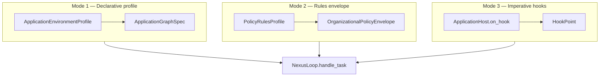

# TIER3_APPLICATION_ENVIRONMENT — extended depth (§22–§39)

**Parent hub:** [`TIER3_APPLICATION_ENVIRONMENT.md`](../TIER3_APPLICATION_ENVIRONMENT.md)

# 26. Application Execution Result

Every completed `Task` SHOULD expose a structured **application-level** result for operators and product UIs.

## 26.1 Plane A — `ApplicationRunSummary`

**Canonical type:** `intergrax/contracts/application_run_summary.py`

```text
ApplicationRunSummary:
    schema_version: application_run_summary.v1
    task_id
    graph_id
    terminal_status
    agent_invocations: list[AgentInvocationSummary]
    total_agents / total_steps / total_llm_tokens
    completed_at
    metadata:
        run_artifact_bundle.v1 → RunArtifactBundle §48
```

Populated by `build_application_run_summary()` on Nexus task completion (ACP-OBS-2). Attached to `TaskResult.metadata` under `application_run_summary.v1`.

## 26.2 Plane B — per-agent traces

Each graph node produces **`AgentRunResult`** + **`AgentRunTrace`** (ACP §31). Application authors inspect Plane B in pytest via direct `agent.run()` or from task metadata when wired.

| Plane | Audience | Primary type |
|-------|----------|--------------|
| **A — Application** | Ops, product dashboards, multi-agent UX | `ApplicationRunSummary` |
| **B — Agent** | Agent authors, eval, debug | `AgentRunTrace` |

**Rule:** Tier-3 hosts MUST NOT parse raw trace DB tables for product UX when `ApplicationRunSummary` is available on `TaskResult`.

## 26.3 TaskResult contract (host-facing)

```text
TaskResult:
    task_id
    status
    output / structured_output
    metadata:
        application_run_summary.v1  → ApplicationRunSummary
        trace_id / graph_id         → join keys for observability spine
```

---

# 27. Application Roster and Registry Assembly

Nexus discovers agents through **`AgentRegistry`** built at host bootstrap — symmetric to ACP §15.

## 27.1 Bootstrap pipeline

```text
ApplicationManifest
    → ApplicationBuildContext.for_manifest(...)
    → build_application_registry(manifest, ctx, builders=...)
    → AgentRegistry (enabled bindings only)
    → NexusLoop(registry, ...)
```

**Module:** `intergrax/applications/_shared/wiring.py`

## 27.2 Factory resolution order

For each `AgentBinding`, instance creation order (normative):

```text
1. binding.factory(ctx, binding)     # typed callable
2. builders[agent_type]              # type-keyed map
3. factory_path import               # scaffold/YAML only
4. agent_type()                      # zero-arg constructor
```

## 27.3 Conformance checks

| Check | Module | When |
|-------|--------|------|
| Manifest round-trip | `test_manifest_conformance.py` | CI gate |
| Tool/skill ⊆ environment | `EnvironmentSkillToolConsistencyCheck` | `wire_application_environment` |
| Capability routing | `check_capability_routing.py` | CI gate (ACP-CON-6) |
| Agent registry bypass | `check_agent_registry_bypass.py` | Tier-2 must not import integrations directly |

## 27.4 Registry anti-patterns

| ID | Anti-pattern | Correct |
|----|--------------|---------|
| REG-AP-01 | Hardcoded agent class in NexusLoop subclass | `AgentBinding` + capability token |
| REG-AP-02 | Dynamic `importlib` roster without manifest | `ApplicationManifest` + typed builders |
| REG-AP-03 | Disabled agent still in routing defaults | `enabled=False` on binding |
| REG-AP-04 | Same capability on two defaults | Exactly one `default=True` per capability class |

---

# 28. Application Environment Architecture (APP)

Define the **Application Environment Architecture (APP)** — how Tier-3 environments are authored, how they bind Tier-2 agents, and how **environment control** (declarative, rules, hooks) interacts with Nexus **without** collapsing the harness into application classes.

APP answers:

> **How does a developer build a production-grade application environment quickly — business app, lab, virtual organization, or simulation — while staying inside harness governance?**

APP does **not** replace Nexus, redefine tiers, or introduce a second agent execution engine.

## 28.1 Design invariants

| ID | Invariant |
|----|-----------|
| **APP-INV-01** | Nexus remains Agent OS — global orchestration, policy, HITL, multi-agent graph (ACP-INV-01) |
| **APP-INV-02** | All work normalizes to **`Task` → `UnifiedTaskRunner` → `NexusLoop`** — no surface-specific runtime forks |
| **APP-INV-03** | Business logic lives in **Tier-2 agents** — Tier-3 hosts MUST NOT implement domain cognitive loops |
| **APP-INV-04** | Configuration: **manifest + profile in Tier-3**; **contract + `on_next_step` in Tier-2** (ACP-INV-06) |
| **APP-INV-05** | Side effects at environment boundary via **hooks, policy, webhooks** — never ad-hoc vendor SDKs in `factory.py` |
| **APP-INV-06** | **`ApplicationEnvironmentProfile`** is the single composition root for harness slices (IDEAL §17) — nested bundles §22.6 group fields; they do not create additional roots |
| **APP-INV-07** | Imperative control via **`ApplicationHost` + `HookPoint`** — not duplicate `NexusLoop` subclasses |
| **APP-INV-08** | Organizational policy is **Tier-3 data** — agents consume merged context; hosts declare envelope (§39) |
| **APP-INV-09** | **`run_task()` / HTTP `/run`** is the application entry; **`Agent.run()`** is the agent entry (ACP-INV-09) |
| **APP-INV-10** | Every enabled profile slice MUST wire through `*_runtime_bridge.py` — no orphan Pydantic fields |

## 28.2 Rejected architecture (audit outcome)

```text
REJECTED: Application class with on_next_orchestration_step() mirroring Agent.on_next_step
REJECTED: Tier-3 host implementing multi-agent pipelines in factory.py while-loops
REJECTED: Application owns AgentRegistry, PolicyEngine, or GraphExecutor directly
REJECTED: Separate runtime fork per product posture (reactive vs daemon vs batch)
REJECTED: Embedding org compliance rules only in agent source (§39 · ACP-INV-12)
REJECTED: New 22nd domain pair duplicating ORCHESTRATION + UAEP inside "Application Contracts"
```

**Rationale:** The harness is the product; applications are **replaceable compositions** — same as agents (ACP §21.3).

---

# 29. Tier and Terminology Canon (Application)

Complements ACP §22 — application author vocabulary.

## 29.1 Four tiers — application lens

| Term | Tier | One-sentence definition |
|------|------|-------------------------|
| **Application** | 3 | Deployable **environment**: manifest, profile, roster, surfaces, deploy artifacts |
| **Application host** | 3 | Running process: `factory.py` + FastAPI/MCP + `HarnessHostRuntime` |
| **HarnessApplication** | 3 | Fluent builder facade for lab/quickstart (DX-2) |
| **ApplicationEnvironmentProfile** | 3 | Typed umbrella of all harness control-plane slices |
| **Agent** | 2 | Domain worker invoked **per graph node** — not a host OS process |
| **Nexus** | 1 | Agent OS executing `Task` graphs |
| **Harness (practical)** | 0+1+3 | Platform catalogs + Nexus + application wiring |

## 29.2 Runnable application instance

A **single host process** materializes:

```text
ApplicationManifest + ApplicationEnvironmentProfile
    → wire_application_environment()
    → build_application_registry()
    → build_harness_host_runtime()
        → NexusLoop + UnifiedTaskRunner + observability/reliability wiring
    → mount HTTP / MCP / intake / scheduler surfaces
```

Per **unit of work**:

```text
Surface → Task → UnifiedTaskRunner.run_task() → NexusLoop.handle_task()
    → graph node → Agent.run() → on_next_step loop (ACP §38)
    → ApplicationRunSummary on completion
```

## 29.3 Responsibility matrix (application author)

| Concern | Tier-3 Application | Tier-1 Nexus | Tier-2 Agent |
|---------|-------------------|--------------|--------------|
| User intake / chat API | **owner** | — | — |
| `Task` construction | **owner** | consumes | — |
| Capability on `Task` | **owner** (L1–L4 §23.3) | routes | declares |
| `ApplicationGraphSpec` | **owner** | seeds plan | — |
| `OrganizationalPolicyEnvelope` | **owner** | enforces | consumes §39 |
| Multi-agent orchestration | configures | **owner** | participates |
| Domain reasoning | — | — | **owner** (`on_next_step`) |
| Tool/skill catalogs enabled | **owner** (profiles) | executes | uses via gateways |
| HTTP auth / tenant | **owner** (`IdentityProfile`) | — | — |
| Trace / cost dashboards | **owner** (profiles) | emits | Plane B trace |

---

# 30. Three Environment Control Modes

Symmetric to ACP §23 (three cognition planes) — applications choose **how** environment behavior is expressed.



| Mode | Question | Primary types | When to use |
|------|----------|---------------|-------------|
| **1 — Declarative** | What catalogs, graph, posture, execution mode? | `ApplicationEnvironmentProfile`, `ApplicationGraphSpec` | Default — 80% of products |
| **2 — Rules** | What org/regulatory constraints apply to all agents? | `PolicyRulesProfile`, `OrganizationalPolicyEnvelope` | Compliance, virtual workforce, simulation |
| **3 — Imperative hooks** | What dynamic reaction at Nexus boundary? | `ApplicationHost`, `HookResult`, `HookPoint` | Budget exceed, custom intake, block agent selection |

**Anti-pattern APP-AP-01:** Implementing Mode 1 topology inside Mode 3 hooks — use `graph_spec` instead.

**Anti-pattern APP-AP-02:** Encoding Mode 2 rules only in agent `if org == "acme"` — use envelope (§39).

**Canon:** posture and routing detail — §23; agent consumption — ACP §30.

---

# 31. Author-facing `HarnessApplication` Facade

Symmetric to ACP §29 (author-facing `run()` facade).

## 31.1 Target author workflow

```text
1. Scaffold: python -m intergrax.scaffold new-application <slug> [--profile lab|product]
2. Declare ApplicationManifest + ApplicationEnvironmentProfile (manifest.py, environment_profile.py)
3. Register AgentBinding roster with factories
4. Optional: subclass ApplicationHost for HookPoint reactions
5. Wire factory.py via build_harness_host_runtime() — mount surfaces
6. Test: pytest applications/<app>/ tests + Task → ApplicationRunSummary assertion
7. Prod: same profile, different organizational envelope per tenant (UC-11)
```

## 31.2 Progressive disclosure (DX-0.4)

| Stage | Command | Delivers |
|-------|---------|----------|
| Minimal | `new-stack --minimal` | Harness-only factory |
| Standard | `new-application` / `new-stack` | Docker, MCP, deploy doc |
| Promote | `scaffold expand <slug>` | Upgrade minimal → standard |

## 31.3 Host factory responsibilities (normative)

`applications/<app>/host/factory.py` MAY:

- load settings from env (`Settings.from_env()`)
- call `build_harness_host_runtime(manifest, environment, ...)`
- mount HTTP routes, MCP, interaction intake, task control, scheduler
- attach product-specific middleware **only** when profile-driven wiring insufficient

`factory.py` MUST NOT:

- implement agent business steps
- construct `NexusLoop` with ad-hoc kwargs bypassing profile
- import vendor SDKs for domain operations

---

# 32. ApplicationHost Hook Surface

Symmetric to ACP §32 (`on_next_step`) — **event-driven** environment control, not a cognitive step loop.

## 32.0 Author readability and typed contracts (normative)

Application hook authors MUST be able to answer from code alone:

1. At which **HookPoint** does this reaction run?
2. What **HookAction** can be returned (`allow` | `block` | `modify` | `escalate`)?
3. Does the hook defer to default behavior (`return None`)?

Untyped dict mutation of Nexus internals from Tier-3 is **not supported** — use `HookResult.modified_payload` only where documented for the hook point.

## 32.1 Hook lifecycle matrix — allowed actions per HookPoint

Normative for application authors. **`BLOCK`** stops the pipeline at that boundary. **`MODIFY`** shallow-merges `modified_payload` into `HookContext.runtime_state` (see `HookRegistry`). **`ESCALATE`** routes to HITL / escalation coordinator where wired. **`ALLOW`** / `None` defers to harness defaults.

| HookPoint | BLOCK | MODIFY | ESCALATE | Typical application use |
|-----------|-------|--------|----------|-------------------------|
| `BEFORE_TASK_INTAKE` | Yes | Yes — metadata keys | Rare | Reject intake, seed `app_env_state.v1` |
| `AFTER_TASK_INTAKE` | No | Yes | No | Audit labels, attach org/scenario ids |
| `BEFORE_CLASSIFICATION` | Yes | Yes — classifier hints in `runtime_state` | No | Force capability hint |
| `AFTER_CLASSIFICATION` | No | Yes | No | Log routing decision |
| `BEFORE_PLANNING` | Yes | Yes | No | Block disallowed planner kinds |
| `AFTER_PLANNING` | No | Yes | No | Validate plan against product policy |
| `BEFORE_AGENT_SELECTION` | **Yes** | Limited | No | Deny agent id / org role mismatch |
| `AFTER_AGENT_SELECTION` | No | Yes | No | Trace roster resolution |
| `BEFORE_CONTEXT_BUILD` | Yes | Yes | No | Strip forbidden metadata |
| `BEFORE_LLM_INFERENCE` / `AFTER_*` | Yes | Yes — guardrail payloads | Rare | Product-specific LLM gates (prefer profile) |
| `BEFORE_TOOL_CALL` / `AFTER_TOOL_CALL` | Yes | Rare | No | Prefer `ToolProfile` + policy rules |
| `BEFORE_HUMAN_APPROVAL` | Yes | Yes | **Yes** | Custom HITL templates |
| `AFTER_HUMAN_APPROVAL` | No | Yes | No | Resume notifications |
| `BEFORE_FINALIZATION` | Yes | Yes | No | Business outcome webhook prep |
| `AFTER_FINALIZATION` | No | Yes | No | Product analytics emit |
| `BEFORE_TRACE_PERSIST` | Yes | Yes — redaction labels | No | Prefer `ObservabilityProfile` |
| `BEFORE_MEMORY_WRITE` | Yes | Yes | No | Tenant scope enforcement backup |

**Rules:**

- ApplicationHost hooks MUST NOT invoke tools or LLM directly — schedule work by returning `BLOCK` / `ESCALATE` or by setting hints for Nexus/agents.
- Prefer **Mode 1–2** (profile, envelope) over hooks when behavior is static across tasks.
- `MODIFY` is **not** a substitute for `ApplicationGraphSpec` topology changes mid-flight.

Full enum: `intergrax/runtime/hooks/hook_point.py`

## 32.2 HookResult contract

```text
HookResult:
    action: allow | block | modify | escalate
    modified_payload: dict | null
    reason: str | null
```

## 32.3 Example — block agent on policy

```python
from intergrax.harness.application_host import ApplicationHost
from intergrax.runtime.hooks.hook_context import HookContext, HookResult, HookAction
from intergrax.runtime.hooks.hook_point import HookPoint


class StrictOrgHost:
    def on_hook(self, point: HookPoint, context: HookContext) -> HookResult | None:
        if point != HookPoint.BEFORE_AGENT_SELECTION:
            return None
        denied = context.runtime_state.get("org_denied_agents", [])
        if context.agent_id in denied:
            return HookResult(action=HookAction.BLOCK, reason="org_policy_denied")
        return None
```

## 32.4 ApplicationHost vs Agent.on_next_step

| Dimension | `ApplicationHost.on_hook` | `Agent.on_next_step` |
|-----------|---------------------------|----------------------|
| Layer | L4 environment boundary | L2 domain cognition |
| Frequency | Nexus lifecycle events | Every agent iteration |
| May invoke tools? | **No** — use agents | **Yes** via gateways |
| May select next graph agent? | **Indirect** — block/modify selection | **No** — use `StepOutcome` handoff/delegate |
| Replaces NexusLoop? | **No** | **No** |

## 32.5 Code map

| Component | Status | Path |
|-----------|--------|------|
| `ApplicationHost` Protocol | **Done** DX-5.1 | `intergrax/harness/application_host.py` |
| `ApplicationHostMiddleware` | **Done** DX-5.2 | `intergrax/harness/hooks.py` |
| `apply_application_host_wiring` | **Done** APP-CON-1 | `applications/_shared/application_host_wiring.py` |
| Wired in `build_harness_host_runtime` | **Done** APP-CON-1 | `application_host=` parameter |
| `HarnessApplication.hooks()` | **Done** APP-CON-1 | passes host to `build_harness_host_runtime` |
| `ApplicationEnvironmentState` | **Done** APP-CON-2 | `applications/contracts/environment_state.py` |
| `merge_host_into_pipeline` | **Done** DX-5.2 | alternative composition helper |

## 32.6 Hook runtime contract — ordering, conflicts, determinism

Normative execution semantics for **all** middleware + `ApplicationHost` hooks on `MiddlewarePipeline`.

### 32.6.1 Invocation order

```text
run_before(HookPoint):
  1. Middleware sorted by priority ASC (lower runs first)
  2. First non-ALLOW short-circuits the chain
  3. HookRegistry handlers for the point (if middleware all ALLOW)

run_after(HookPoint):
  1. HookRegistry first
  2. Middleware priority DESC
  3. First non-ALLOW short-circuits
```

**Default priorities (reference):** `TraceEmittingMiddleware` < V-SEC middleware (50) ≈ `ApplicationHostMiddleware` (50). When priorities tie, registration order applies — **product hosts SHOULD use distinct priorities** for multiple custom middleware (APP-CON-3).

### 32.6.2 Multiple ApplicationHost implementations

Tier-3 exposes **one** `ApplicationHost` per process. Multiple concerns (org policy, billing, intake) SHOULD be composed **inside** a single class (delegation pattern) — not multiple competing hosts.

### 32.6.3 Conflict resolution

| Situation | Rule |
|-----------|------|
| **BLOCK** vs MODIFY | **BLOCK wins** — pipeline stops; MODIFY not applied |
| Two MODIFY payloads | Shallow merge in order; later middleware wins on key collision |
| BLOCK + reason | Propagated to task/agent failure surface; audited in trace |
| ESCALATE | Routes to HITL coordinator when wired; else treated as BLOCK (safe default) |

### 32.6.4 MODIFY merge semantics

- Merge target: `HookContext.runtime_state` only — **not** Task body, graph, or agent state
- Model: shallow `dict.update` per hook registry (`hook_registry.py`)
- Authors MUST namespace under `app_env_state.v1` for typed state (§42)
- Forbidden: MODIFY of `capability`, `agent_id` unless hook point documents it (agent selection only)

### 32.6.5 Sync vs async, timeout, retry, idempotency

| Topic | Normative target | Status |
|-------|------------------|--------|
| **Sync vs async** | `on_hook` is **sync** today; MAY return coroutine in APP-CON-3 — until then no `await` in host | **Done** sync |
| **Timeout** | Host hook max wall time (e.g. 250ms prod) — exceed → `hook_timeout` + trace | **Done** APP-CON-5 |
| **Retry** | Hooks are **not** retried — side effects must be idempotent | **Normative** |
| **Idempotency** | Same `HookPoint` + same `task_id` + same phase: host MUST tolerate duplicate calls | **Author responsibility** |
| **Error handling** | Uncaught exception → BLOCK with `hook_error`; task fails closed in STRICT | **Done** APP-CON-5 |
| **Audit events** | Every non-ALLOW emits `RuntimeEvent` with `hook_name`, `point`, `action`, `reason` | **Done** APP-CON-5 |

### 32.6.6 Determinism rule

Hooks MAY influence **whether** and **how** work proceeds — they MUST NOT replace Nexus planning or agent cognition. Deterministic replay (lab) requires hooks be pure functions of `(HookPoint, HookContext)` or record decisions in `app_env_state.v1`.

---

# 33. Dual Observability: Application and Agent Planes

Symmetric to ACP §31 — application authors operate primarily on **Plane A**.

## 33.1 Plane definitions

| Plane | Name | Primary consumer | Canonical type |
|-------|------|------------------|----------------|
| **A** | Application orchestration | Tier-3 ops, product UX | `ApplicationRunSummary` |
| **B** | Agent session | Tier-2 authors, eval | `AgentRunTrace` |

## 33.2 Join keys

```text
TaskResult.metadata["application_run_summary.v1"]  →  Plane A rollup
TaskResult.metadata["trace_id"]                    →  OBS spine
AgentRunResult.trace                               →  Plane B per node
```

## 33.3 Application observability profile

Configure via `ObservabilityProfile` on environment — wired by `wire_application_observability()`:

- trace DB path / in-memory lab mode
- runtime events store
- optional product debug surface (`ApplicationFeatures.debug_surface`)
- OTEL / metrics plugins when enabled

**Rule:** Tier-3 MUST NOT fork parallel trace pipelines — use harness spine ([`OBSERVABILITY.md`](OBSERVABILITY.md)).

## 33.4 Compliance rollups (org environments)

When `OrganizationalPolicyEnvelope` is set, Plane A dashboards SHOULD include policy verdict rollups from Plane B steps (ACP §39.5 · ACP-ORG-4).

---

# 34. Per-Agent Binding from the Application

Application-side canon for ACP §30 — what Tier-3 declares so agents receive merged environment at `Agent.run()`.

## 34.1 Merge pipeline (agent run time)

```text
ApplicationEnvironmentProfile
    + AgentBinding slices (tools, memory, RAG, budget, org_role_id)
    + Task metadata (tenant, user, matter_id, scenario hints)
        → merge_environment() → EffectiveAgentRunEnvironment
            → AgentStepContext.merged_environment
```

**Agent-side detail:** ACP §30 · `intergrax/agents/run_environment.py`

## 34.2 Binding slices (normative)

| Slice field | Affects at run time |
|-------------|---------------------|
| `tool_allowlist_extra` / `tool_denylist` | Merged tool policy |
| `memory_scope_override` | Namespace on `memory_view` |
| `rag_collection_override` | RAG gateway collection |
| `org_role_id` | `OrganizationalPolicyContext` overlay §39 |
| `budget_slice` | Per-agent token/cost caps §25.5 |

## 34.3 Application token budgets

| Tier | Owns |
|------|------|
| **Tier-3** | `CostProfile`, `AgentBinding.budget_slice`, `BudgetReactionProfile`, notification slugs |
| **Tier-1** | Metering, hard caps, `BUDGET_*` events |
| **Tier-2** | Read usage; soft strategy only |

**Cross-plan:** ACP-TOK-2 · ACP-TOK-3 (**Done**) — kernel enforcement + host reaction hooks. Tier-3 configures; harness enforces (ACP §25.5).

## 34.4 Anti-patterns (application binding)

| ID | Anti-pattern | Correct |
|----|--------------|---------|
| BIND-AP-01 | Secrets in `AgentBinding.config` | Integration profile + secret store |
| BIND-AP-02 | Per-agent env vars read in agent code | `merge_environment` + metadata |
| BIND-AP-03 | Different roster per surface without manifest | Single manifest; feature flags on binding `enabled` |
| BIND-AP-04 | Org rules in agent `if` statements | `OrganizationalPolicyEnvelope` §39 |

---

# 35. Use-Case Catalog (Application + Environment)

Canonical scenarios — all supported by the **same** harness path; differ in profile + roster + postures.

| ID | Scenario | Entry | Environment pattern | Agent pattern |
|----|----------|-------|---------------------|---------------|
| **UC-A1** | Single-agent Q&A API | HTTP `POST …/run` | Reactive, explicit `capability` | One agent, one node |
| **UC-A2** | Multi-agent pipeline | `Task` + `*.pipeline` or `graph_spec` | `ApplicationGraphSpec` chain | One class per role |
| **UC-A3** | Always-on lab daemon | `HarnessApplication.serve()` | Daemon + debug surface | Passive until scheduled |
| **UC-A4** | Slack / Teams product | Interaction intake | `wire_interaction_intake_service` | L2 routing §23.3 |
| **UC-A5** | Background batch / index | Queue worker | Hybrid + `ReliabilityProfile` | Single or sharded agents |
| **UC-A6** | Legal / research prod host | Product manifest | `ExecutionMode.STRICT` + critic | Contract-declared capabilities |
| **UC-A7** | Virtual organization / workforce | `Task` + org profile | `OrganizationalPolicyEnvelope` + `org_role_id` | Same agent classes, different envelope |
| **UC-A8** | Business simulation | `dispute_sim` / scenario graph | `graph_spec` + scenario bindings | Multi-role pipeline |
| **UC-A9** | Eval / CI harness host | Batch `run_task` | Fixture `ApplicationEnvironmentProfile` | Assert `ApplicationRunSummary` |
| **UC-A10** | YAML-driven lab | `HarnessApplication.from_files()` | DX-5.3 env.yaml | Roster from agents.yaml |

**Flexibility rule:** UC-A2 and UC-A7 stack — graph topology + org envelope are independent dimensions.

**Scenario recipes (concrete):** §23.5.

---

# 36. Final Architecture: Application + Agent + Harness Cooperation

Synthesis of §24–§35 and ACP §36.

## 36.1 Responsibility split (final)

| Layer | Delivers to author | Delivers to ops |
|-------|-------------------|-----------------|
| **Tier-3 Application** | Manifest, profile, roster, hooks, surfaces | `ApplicationRunSummary`, deploy artifacts |
| **Tier-2 Agent** | `on_next_step`, cognitive patterns | `AgentRunResult` + `AgentRunTrace` |
| **Tier-1 Nexus** | Transparent when using `Task` | Task orchestration, checkpoints |
| **Tier-0 Harness** | Catalogs via profiles | Policy, observability spine |

## 36.2 Speed + flexibility guarantees

| Guarantee | Mechanism |
|-----------|-----------|
| Fast new product host | `scaffold new-application` + `HarnessApplication` |
| No policy in agent source | `ApplicationEnvironmentProfile` + envelope §39 |
| Same agents, multiple products | Different manifests; shared `agents/` |
| Multi-agent without host code | `ApplicationGraphSpec` |
| Dynamic environment rules | `ApplicationHost` hooks §32 |
| Virtual org without agent forks | `OrganizationalPolicyEnvelope` §39 |
| Prod strictness | `ExecutionMode.STRICT` + APP-PROD gates §40 |

## 36.3 Implementation alignment (2026-06-11)

| Component | Status | Remaining |
|-----------|--------|-----------|
| `ApplicationEnvironmentProfile` | **Done** H-APP | — |
| Unified wiring | **Done** H-APP | — |
| `HarnessApplication` facade | **Done** DX-2 | — |
| `ApplicationHost` → Nexus pipeline | **Done** APP-CON-1 | — |
| `ApplicationEnvironmentState` | **Done** APP-CON-2 | Kernel seeding on intake (optional) |
| `ApplicationRunSummary` | **Done** ACP-OBS-2 | — |
| Org envelope | **Done** ACP-ORG-1..2 | Enforcement depth ACP-ORG-3 |
| Budget reactions (hard cap + notify) | **Done** | ACP-TOK-* · APP-PROD-7 §43 |
| APP production scoreboard | **Done** | APP-PROD-1..9 · `check_application_production_gates.py` |

---

# 37. Pre-Implementation Operational Contracts (APP-CON)

Normative before shipping new Tier-3 hosts.

## 37.1 Hard task contract

Hosts MUST normalize all surfaces to **`Task`** with:

```text
Task:
    task_id
    message / structured input
    context.capability          # routing token when known (§23.3)
    metadata                    # tenant, user, org, scenario, product fields
    runtime identity fields     # from IdentityProfile resolution
```

Pydantic models for manifest and profile: **`extra=forbid`**.

## 37.2 Capability routing (enforcement)

```text
Task.required_capability / context.capability
    → Nexus classifier/planner
    → AgentRegistry.query(capabilities)
    → AgentBinding selects implementation class
```

CI: `check_capability_routing.py` (shared with ACP-CON-6).

## 37.3 Identity and tenant (summary)

Full canon: ACP §30.9 · `IdentityProfile`

- Interactive tasks: `tenant_id` + `user_id` required when `tenant_required=True`
- Org background jobs: `principal_type=org_system`, `memory_scope=org`
- Host MUST wire `wire_application_identity()` before run endpoints

## 37.4 Host security model

| Guard | STRICT behavior |
|-------|-----------------|
| Tool catalog | Intersection of `ToolProfile` + binding slices |
| Integration access | `IntegrationProfile` only — agents use tools |
| Secrets | Never in manifest `config` or committed `.env` |
| Auth on `/run` | `IdentityProfile.require_api_key` or product auth middleware |

## 37.5 Terminal status vocabulary

Application-level outcomes SHOULD map to controlled task statuses — align with `AgentRunStatus` and Nexus task finisher enums. Free-text terminal reasons on product APIs SHOULD be mapped to enums at the HTTP boundary.

---

# 38. Execution Responsibility Stack (L4 Application)

Symmetric to ACP §38 — **application author mental model**.

## 38.1 Four layers (normative)

```text
┌─────────────────────────────────────────────────────────────────────────┐
│ L4  Application host + surfaces                                         │
│     • intake → Task • manifest/profile • hooks • auth • deploy          │
│     • ApplicationRunSummary (Plane A)                                     │
│     DOES NOT: agent on_next_step • tool gateway • cognitive planning     │
└───────────────────────────────┬─────────────────────────────────────────┘
                                │ UnifiedTaskRunner.run_task()
┌───────────────────────────────▼─────────────────────────────────────────┐
│ L3  NexusLoop.handle_task() — Agent OS orchestration                    │
│     • classifier • planner • graph • HITL • task checkpoints            │
│     DOES NOT: replace agent cognitive loop                                │
└───────────────────────────────┬─────────────────────────────────────────┘
                                │ per graph node
┌───────────────────────────────▼─────────────────────────────────────────┐
│ L2  Agent.run() + on_next_step() — see ACP §38                          │
└───────────────────────────────┬─────────────────────────────────────────┘
                                │
┌───────────────────────────────▼─────────────────────────────────────────┐
│ L1  HarnessKernel.execute_step() — see ACP §38                          │
└─────────────────────────────────────────────────────────────────────────┘
```

## 38.2 Decision ownership (application author)

| Question | Owner |
|----------|-------|
| Which surfaces does this product expose? | **Tier-3 host** |
| What is on the manifest roster? | **Tier-3 author** |
| What harness slices are enabled? | **`ApplicationEnvironmentProfile`** |
| Which agent handles this capability? | **Nexus** + registry (Tier-3 declares roster) |
| What is the multi-agent topology? | **`graph_spec`** or planner (Tier-3 config) |
| What org rules apply? | **`OrganizationalPolicyEnvelope`** §39 |
| Dynamic block/modify at intake? | **`ApplicationHost`** hook §32 |
| What does the agent think next? | **Agent `on_next_step`** — not Tier-3 |

---

# 39. Organizational Policy Envelope & Virtual Workforce

**Canonical home (Tier-3).** Agent consumption and kernel enforcement: ACP §39.

**Goal:** Tier-3 environment simulates an **organization** — procedures, channels, playbooks — constraining virtual employee agents **without** forking agent code.

## 39.1 Concept

```text
OrganizationalPolicyEnvelope (Tier-3)
    → merge_environment() → OrganizationalPolicyContext
        → all agents in roster during run
            → HarnessKernel policy phases enforce channel/tool/scenario rules
```

## 39.2 Contract

`intergrax/applications/contracts/org_policy.py`:

```text
OrganizationalPolicyEnvelope:
    organization_id, display_name, execution_mode
    policy_rules, guardrails
    sop_catalog_path, scenario_bindings, rag_playbook_collection
    channel_policy, tool_policy_overlay, communication_rules
    compliance_profile_id, observability_labels
```

Attach via `ApplicationEnvironmentProfile.organizational_policy`.

## 39.3 Virtual workforce roster

```text
AgentBinding(
    agent_id="cs_agent",
    org_role_id="customer_service_rep",
    capabilities=["support.respond"],
)
```

Same agent class across bank / retail / lab — **different envelope per deployment**.

## 39.4 Enforcement stack

| Phase | Owner |
|-------|-------|
| Intake metadata (org, scenario) | Tier-3 host |
| `merge_environment` | Harness |
| `on_next_step` domain intent | Agent |
| Policy pre/post, tool deny, guardrails | `HarnessKernel` |

## 39.5 Measurement

`PolicyVerdictRecord` on agent steps → roll up to `ApplicationRunSummary` compliance fields (ACP §39.5 · ACP-ORG-4).

## 39.6 Anti-patterns

| ID | Anti-pattern | Correct |
|----|--------------|---------|
| ORG-AP-01 | `if org == "acme"` in agent | `ChannelPolicy` on envelope |
| ORG-AP-02 | Rules only in system prompt | `PolicyRulesProfile` + verdicts |
| ORG-AP-03 | Per-agent duplicate compliance | Shared envelope |

**Preset:** `ApplicationEnvironmentProfile.lab_org_virtual_workforce_defaults()`.

---
