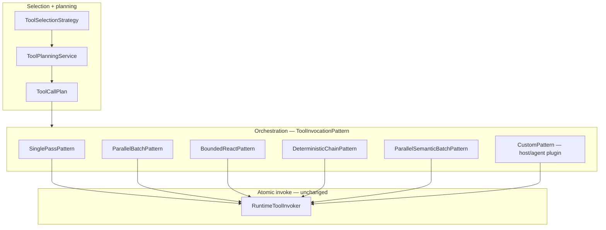

# TOOLS — runtime config reference

**Parent hub:** [`TOOLS.md`](../TOOLS.md)

## Runtime configuration reference

Tool-related fields on `RuntimeConfig` (`intergrax/runtime/nexus/config.py`). Tier-3 sets these via `materialize_runtime_config` / `runtime_config_bridge`.

| Field | Type | Default | Role |
|-------|------|---------|------|
| `tool_planner` | `ToolPlannerProtocol \| None` | `None` | `CatalogToolPlanner` / custom; **required** for `run_bounded_tool_loop` / `ctx.invoke_tool` |
| `tool_invoker` | `RuntimeToolInvoker \| IdempotentToolInvoker \| None` | built in `RuntimeContext.build()` | Execution enforcement |
| `tools_mode` | `"off" \| "auto" \| "required"` | `"auto"` | See [§tools_mode](#tools_mode) |
| `tools_context_scope` | `ToolsContextScope` | `CURRENT_MESSAGE_ONLY` | Planner input assembly ([§tools_context_scope](#tools_context_scope); TOOL-ENG-11) |
| `tool_profile` | `ToolProfile \| None` | `None` | Host catalog subset |
| `tool_wiring_context` | `ToolWiringContext \| None` | enriched at build | Integration slots for handlers |
| `tool_providers` | `Sequence[ToolProvider]` | `()` | Extra registration after profile |
| `tool_scope_policy` | `ToolScopePolicy \| None` | from `RuntimePolicyBundle` | Per-invoke allow-list (wired TOOL-ENG-3) |
| `tool_planner_prompt_id` | `str` | `tools_agent_planner` | From `ReasoningProfile` via catalog bridge (TOOL-ENG-0) |
| `tool_selection_mode` | `ToolSelectionMode` | `static` | L6 schema narrowing — see [§Production strategies](#tool-selection-modes-production-strategies) and mapping table below |
| `tool_selection_top_k` | `int` | `20` | Top-k for `retrieval_top_k` (keyword overlap; not semantic embedding search) |
| `idempotency_store` | `IdempotencyStore \| None` | `InMemoryIdempotencyStore` | Side-effect dedup |
| `policy_bundle` | `RuntimePolicyBundle \| None` | Tier-3 | `tool_access`, budget, plan-loop |
| `modality_profile` | `ModalityProfile \| None` | env profile | Tool plane filter |
| `enable_rag` / `enable_websearch` | `bool` | host-specific | Gate `rag.retrieve` (catalog) / `websearch.query` (catalog) |
| `run_budget` + `budget_policy` | `RunBudget`, `BudgetPolicy` | optional | `max_tool_calls` enforcement |

### `tools_mode`

| Value | Behavior |
|-------|----------|
| `off` | `run_bounded_tool_loop` / `ctx.invoke_tool` no-op; `cap_tools_available=False` |
| `auto` | Planner runs; zero tool calls is OK |
| `required` | If planner returns no calls → **`ToolsRequiredError`** (TOOL-ENG-8 **Done**) |

### `tools_context_scope`

**Status (2026-06-10):** consumed by `run_bounded_tool_loop` / `ctx.invoke_tool` via `resolve_tool_planner_input` (**TOOL-ENG-11**).

| Value | Intended planner input | Implemented |
|-------|------------------------|-------------|
| `current_message_only` | Latest user message | **Yes** |
| `conversation` | `base_history` + current user message | **Yes** |
| `full` | `state.messages_for_llm` | **Yes** |

### `ToolPlanningConfig`

| Field | Role |
|-------|------|
| `temperature`, `max_answer_tokens` | Passed to `generate_with_tools` / `generate_messages` |
| `system_instructions`, `planner_instructions` | From `YamlPromptRegistry` (`tools_agent_planner`) |
| `system_context_template` | Optional extra context block |

Native vs fallback: `ToolPlanningService` probes `llm.supports_tools()` — native path uses OpenAI-style `tool_calls`; fallback expects JSON `{"call_tool": {...}}` (**single** tool only).

### `tool_choice` (planner API)

`ToolPlanningService.plan_tools(..., tool_choice=...)` supports OpenAI-style `tool_choice`. Shipped patterns pass `tool_choice_for_mode(tools_mode)` from `tool_planning_policy.py` (**TOOL-ENG-12** **Done**). Hosts may use a custom `ToolPlannerProtocol` for finer control.

### Tier-3 planner bootstrap (actual)

| Step | Module | Sets `tool_planner`? |
|------|--------|----------------------|
| `apply_catalog_profiles_from_environment` | `catalog_runtime_bridge.py` | `tool_planner_prompt_id` from `ReasoningProfile` |
| `RuntimeContext.build` | `runtime_context.py` + `planner_bootstrap.py` | **Yes** — `wire_catalog_tool_planner_if_enabled` when `tools_mode≠off`, LLM present, registry non-empty |
| `resolve_tool_planning_config` | `reasoning_wiring.py` | helper only — optional for custom hosts |
| `CatalogToolPlanner.from_profile` | `catalog_tool_planner.py` | tests / manual wiring only |

**Implication:** Hosts with `tools_mode=off` (e.g. legal default) still skip `run_bounded_tool_loop` / `ctx.invoke_tool`. Hosts with `tools_mode=auto` and non-empty `tool_profile` get a live planner on the same registry as the invoker.

Product defaults: e.g. `legal_application` — `LEGAL_TOOLS_MODE` default **`off`** (`settings.py`).

---

## Execution surfaces matrix

Distinct ways catalog capabilities reach a backend — not all equivalent.

| Surface | Entry | Live invoke? | Policy / trace | Notes |
|---------|-------|--------------|----------------|-------|
| **A — ACP agent step** | `on_next_step` → `ctx.invoke_tool` | **Yes** | invoker + gateway + trace | Primary author path; ReAct uses `run_bounded_tool_loop` |
| **B — Catalog context** | `plan_context_invocation` | **Yes** | invoker + trace | `rag.retrieve` / `websearch.query` when profile enables RAG/web |
| **C — Capability gateway** | `ToolRequest` → `RuntimeToolGateway` | Partial | hooks + `ToolAccessPolicy` on plan | legacy capability aliases; prefer explicit `tool_ids` |
| **D — MCP catalog mount** | `mount_catalog_tools_on_mcp` | **Schema only** | N/A | `list_catalog_tools` / `describe_catalog_tool`; no default live handler |
| **E — Direct invoker** | tests, conformance | **Yes** | full invoker stack | provider validation path |
| **F — Critic L1 client** | `CriticEvalToolClient` | **Yes** | eval tools | `eval.judge` / `eval.trajectory`; parallel to agent loop |

---

## Agent-run tool orchestration (ACP)

| Execution context | Tool behavior |
|-------------------|---------------|
| **Reflex / single-shot** | Author calls `ctx.invoke_tool` or declarative actions in `StepOutcome` |
| **ReAct / bounded loop** | `run_bounded_tool_loop` in `tool_loop.py` — plan→invoke→observe rounds inside `on_next_step` |
| **Plan-execute pattern** | Sub-plans as agent state; tool batches via pattern helpers, not Tier-1 pipeline |
| **Graph executor node** | One `Agent.run()` per node; `allowed_tools` from binding/metadata — loop inside agent |

`ToolRuntime.invoke(plan)` serves capability-gateway aliases — **not** the default path for ACP agents (prefer `ctx.invoke_tool` + catalog `tool_ids`).

---

## Multi-tool execution semantics

**Scope:** behaviour of **`ToolInvocationPattern`** shipped modes (TOOL-ENG-16–30). Entry facade: `run_bounded_tool_loop` / `ctx.invoke_tool` → `resolve_invocation_pattern()`.

### Single-pass path (`max_tool_iterations == 1`)

1. `ToolPlanningService.plan_tools` → one `generate_with_tools` call (or JSON fallback).
2. LLM may return **multiple** `tool_calls` in one response.
3. Each call validated against `contract.input_schema` → `PlannedToolCall` list.
4. `execute_planned_tool_calls` runs calls **sequentially** in declaration order.
5. Results appended to `state.tool_traces`.
6. **Context injection:**
   - Native path with `max_tool_iterations == 1`: merged into **system** message via `tools_runtime_context` prompt.
   - Not OpenAI `role=tool` chain on single-pass synthesis path.

### Bounded ReAct path (`max_tool_iterations > 1`, TOOL-ENG-6)

1. `run_bounded_tool_loop` calls `ToolPlanningService.plan_native_round` each iteration.
2. After each batch: `append_native_tool_messages` (`assistant` + `role=tool`).
3. Loop stops on: empty `tool_calls`, budget exceeded, `max_iterations`, or planner final answer.
4. Requires native `supports_tools()` — JSON fallback remains single-iteration only.

**ADR:** [ADR-TOOL-002](../adr/entries/2026-06-11/ADR-TOOL-002.md) — tool iterations MUST NOT be scheduled from `GraphExecutor` (agent-graph boundary).

### JSON fallback path

- Planner prompt includes full `TOOLS=` JSON list.
- Parser accepts **one** `call_tool` object per plan response.
- Multi-tool in one fallback response: **not supported**.

### After tools

- Agent pattern / LLM adapter generates final answer using injected tool context (single-pass).
- Multi-iteration: appended messages already in `messages_for_llm`.
- If `state.tool_planner_answer` set → used as final answer (bypass LLM).

### Budget

- `enforce_tool_call_budget` after **each** trace entry.
- `RunBudget.max_tool_calls` (default production: 128) — see `production_budget_policy.py`.

---

## Tool invocation patterns (production orchestration)

**Audit basis:** Full-stack invocation-pattern audit 2026-06-12.  
**Plan register:** [`plan/TOOLS.md`](../plan/TOOLS.md) Phase **TOOL-ENG** — TOOL-ENG-16–30.

Modern agent systems support multiple **orchestration patterns** for executing tool plans. Intergrax canon names four production patterns plus an extensibility contract. These patterns answer: *given a `ToolCallPlan`, how are multiple invocations ordered, parallelized, chained, or re-planned?*

**Orthogonal axes** — do not conflate:

| Axis | Question | Mechanism |
|------|----------|-----------|
| **Selection (L6)** | Which tools appear in the LLM schema? | `ToolSelectionStrategy` — [§Production strategies](#tool-selection-modes-production-strategies) |
| **Planning (L6b)** | Which calls does the LLM emit? | `ToolPlannerProtocol` / `ToolPlanningService` |
| **Orchestration (2a)** | How is the call batch executed? | `ToolInvocationPattern` **Done** (TOOL-ENG-16) |
| **Atomic invoke (2b)** | How is one call enforced? | `RuntimeToolInvoker` — unchanged |



### Pattern catalog

| Pattern | Production name | When to use | Pre-LLM | Execution | Result → LLM |
|---------|-----------------|-------------|---------|-----------|--------------|
| **Single** | Standard tool choice | Small allow-list; model picks one or few tools | Full or narrowed schema | One planner round; batch invoke (today: sequential) | System prompt or single-pass context inject |
| **Parallel batch** | Fan-out gather | Independent read-only tools; latency-sensitive enrichment | Optional keyword/semantic pre-filter | **Concurrent** invoke; bounded concurrency | Aggregated traces → context inject or native messages |
| **Bounded ReAct** | Plan→invoke→observe loop | Agent must adapt tool choice from observations | Per-iteration narrowed schema | Sequential per batch; **LLM re-plans** between batches | Native `role=tool` message chain |
| **Deterministic chain** | Tool pipeline | ETL / workflow; output of A is input of B | Fixed `ToolChainSpec` (no LLM between steps) | Strictly sequential; field mapping | Final step output or merged chain result |
| **Graph** | Agent orchestration graph | Branching, cycles, multi-agent, merge | Nexus `ExecutionGraph` — **not** a tool pattern | Per-node agent runs own `ToolInvocationPattern` | Node merge policies — [`ORCHESTRATION.md`](ORCHESTRATION.md) §50–§56 |

### Pattern 1 — Single (standard tool choice)

**Definition:** Register tools with strong `ToolContract` descriptions. After L0–L5 allow-lists and optional L6 narrowing, export schema to LLM. Model selects `tool_calls`; harness executes the batch.

**Implementation today:** **Production** — `ToolSelectionStrategy` + `ToolPlanningService` + `execute_planned_tool_calls` when `max_tool_iterations == 1`.

| Component | Status |
|-----------|--------|
| Catalog + schema export | **Done** |
| `ToolSelectionMode.full_catalog` / `static` | **Done** |
| Multi-call in one planner response | **Done** |
| Shipped as named pattern class | **Done** — `SinglePassPattern` (TOOL-ENG-17) |

### Pattern 2 — Parallel batch (fan-out gather)

**Definition:** Retrieve a matching tool subset (keyword today; semantic target), invoke **all selected tools concurrently** (read-only, bounded), aggregate results, pass combined context to LLM for final synthesis.

**Implementation today:** **Done**

| Sub-capability | Status | Plan ID |
|----------------|--------|---------|
| Keyword pre-filter (`retrieval_top_k`) | **Done** | TOOL-ENG-5/15 |
| Semantic vector index for tools | **Done** | TOOL-ENG-13 |
| Concurrent read-only invoke | **Done** | TOOL-ENG-9 |
| Result aggregation contract | **Done** | TOOL-ENG-29 |
| Composite parallel-semantic batch pattern | **Done** | TOOL-ENG-25 |

**Target flow (TOOL-ENG-25):**

```text
query → SemanticToolIndexSelectionStrategy (or keyword) → top-k tool_ids
     → ParallelBatchPattern.execute(calls) — asyncio.gather, max_parallel_tools
     → ToolInvocationAggregate → inject_tool_traces_system_context / CoreLLMStep
```

### Pattern 3 — Bounded ReAct (plan→invoke→observe)

**Definition:** Iterative loop: LLM plans tools → harness invokes → observations returned to LLM → repeat until stop condition. Distinct from deterministic chains because **LLM re-plans** between batches.

**Implementation today:** **Done** — `BoundedReactPattern` via `run_bounded_tool_loop` + `max_tool_iterations` (TOOL-ENG-6/18).

| Component | Status |
|-----------|--------|
| Native `role=tool` messages | **Done** |
| Budget sync (`react_iterations_used`) | **Done** — ACP-CLOSE-PAT-1 |
| Refactor to `BoundedReactPattern` | **Done** | TOOL-ENG-18 |
| GraphExecutor scheduling tool iterations | **Rejected** — ADR-TOOL-002 |

### Pattern 4 — Deterministic chain (tool pipeline)

**Definition:** Fixed sequence of tools where step *n+1* input is derived from step *n* output via explicit field mapping — **no LLM between steps**.

**Implementation today:** **Done** (TOOL-ENG-20)

| Component | Status |
|-----------|--------|
| `ToolChainSpec` / `ChainStep` / `FieldRef` | **Done** — `tool_chain_spec.py` |
| Output→input mapper | **Done** — `tool_chain_mapper.py` |
| `DeterministicChainPattern` | **Done** — `patterns/deterministic_chain.py` |

**Example target spec:**

```text
ToolChainSpec(steps=[
  ChainStep(tool_id="rag.retrieve", input_from="user_query"),
  ChainStep(tool_id="websearch.query", input_from=FieldRef(step=0, field="citations")),
])
```

**Plan:** TOOL-ENG-20.

### Pattern 5 — Graph (agent orchestration — separate domain)

**Definition:** Conditional branches, cycles, parallel agent nodes, merge policies — LangGraph-style orchestration at **agent/step** granularity.

**Implementation today:** **Done** in [`ORCHESTRATION.md`](ORCHESTRATION.md) — `ExecutionGraph`, `GraphExecutor`, merge strategies, `max_parallel_nodes`.

**Boundary rule (canon):**

```text
ExecutionGraph     → orchestrates agents / UAEP nodes / delegation
ToolInvocationPattern → orchestrates tool calls within one agent step (Plane 3)
```

- Each graph node MAY run an agent whose pipeline includes `run_bounded_tool_loop` / `ctx.invoke_tool` with a configured `tool_invocation_pattern`.
- `GraphExecutor` MUST NOT implement tool-level ReAct loops (ADR-TOOL-002).
- Cross-ref: [`NEXUS_EXECUTION_FLOW.md`](NEXUS_EXECUTION_FLOW.md) §15.1.

### Extensibility — `ToolInvocationPattern` plugin contract

**Status:** **Done** (TOOL-ENG-16 · ADR-TOOL-003). Precedents: `ToolSelectionStrategy`, `ToolPlannerProtocol`, `ToolPlugin`.

**Target protocol:**

```text
ToolInvocationPattern (Protocol):
    pattern_id: str
    execute(
        state: RuntimeState,
        invoker: RuntimeToolInvoker,
        planner: ToolPlannerProtocol,
        plan: ToolCallPlan | None,
        *,
        allowed_tool_ids: Sequence[str] | None,
        max_iterations: int,
        planner_input: str | list[ChatMessage],
    ) -> ToolInvocationResult

ToolInvocationResult:
    tool_traces: list[ToolCallTrace]
    loop_iterations: int
    stop_reason: str
    appended_messages: list[ChatMessage]
    used_native_tool_messages: bool
```

**Shipped implementations:**

| `ToolInvocationMode` | Class | Plan ID |
|----------------------|-------|---------|
| `single_pass` | `SinglePassPattern` | TOOL-ENG-17 |
| `parallel_batch` | `ParallelBatchPattern` | TOOL-ENG-9 |
| `bounded_react` | `BoundedReactPattern` | TOOL-ENG-18 |
| `deterministic_chain` | `DeterministicChainPattern` | TOOL-ENG-20 |
| `parallel_semantic_batch` | `ParallelSemanticBatchPattern` | TOOL-ENG-25 |
| *(custom)* | Host/agent plugin via entry point | TOOL-ENG-24 |

**Configuration (production):**

| Surface | Field | Default |
|---------|-------|---------|
| `RuntimeConfig` | `tool_invocation_pattern` | `single_pass` |
| `RuntimeConfig` | `max_parallel_tool_calls` | bounded (e.g. 8) |
| `ApplicationEnvironmentProfile` | `tool_invocation_mode` | bridged via `catalog_runtime_bridge.py` |
| Entry point group | `intergrax.tool_invocation_patterns` | optional custom patterns |

**Wiring (production):** `run_bounded_tool_loop` / `ctx.invoke_tool` resolves pattern from `RuntimeConfig` via `resolve_invocation_pattern()` (TOOL-ENG-22).

### Plugin maturity matrix (2026-06-12 audit)

| Plugin surface | Protocol exists | Factory/registry | Entry points | Host wiring |
|----------------|-----------------|------------------|--------------|-------------|
| Catalog tools (`ToolPlugin`) | **Yes** | **Yes** | **Yes** | **Yes** |
| Tool selection (`ToolSelectionStrategy`) | **Yes** | `strategy_for_mode()` + entry points | **Yes** | **Yes** |
| Tool planning (`ToolPlannerProtocol`) | **Yes** | inject via config | N/A | **Yes** |
| Invocation orchestration (`ToolInvocationPattern`) | **Yes** | `pattern_for_mode()` + `resolve_invocation_pattern()` | **Yes** | **Yes** |

### Pattern vs selection mode mapping

| User intent | Selection mode (L6) | Invocation pattern (2a) |
|-------------|---------------------|-------------------------|
| Model picks from small list | `full_catalog` or `static` | `single_pass` |
| Large catalog, intent-driven subset | `semantic` (TOOL-ENG-13) or `retrieval_top_k` | `single_pass` or `parallel_semantic_batch` |
| Skill-pack scoped agent | `skill_pack` | `single_pass` |
| Multi-turn tool reasoning | any | `bounded_react` |
| Fixed ETL / workflow | plan `tool_ids` or `ToolChainSpec` | `deterministic_chain` |
| Multi-agent product flow | N/A (graph) | per-node pattern on `OrchestrationProfile` |

---
