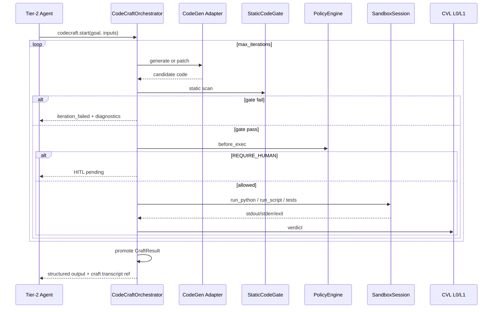

# CODE_CRAFT — §7+ extended architecture

**Parent hub:** [`CODE_CRAFT.md`](../CODE_CRAFT.md)

## 7. Tool surface (`codecraft.*`)

Catalog tools **Done** (ECC-1…ECC-5) — all route through `ToolRuntime`:

| tool_id | Role |
|---------|------|
| `codecraft.start` | Open session: `goal`, `input_artifacts`, `constraints` |
| `codecraft.run` | Single-shot: generate + gate + exec (lightweight) |
| `codecraft.iterate` | One loop iteration: optional patch + exec + test |
| `codecraft.get_state` | Session state, logs, files, iteration metrics |
| `codecraft.promote` | Explicit promotion (`supervised` mode) |
| `codecraft.dispose` | Release resources |
| `codecraft.list_ephemeral_tools` | Introspection for active craft session |

**Low-level primitives remain:** `code.exec`, `sandbox.exec`, `script.run` — for direct agent use when full ECC loop is not needed. ECC is the **governed orchestration path**; primitives are **substrate escape hatches**.

---

## 8. Iteration flow



**CVL integration:** ECC uses `CriticOrchestrator` / L0Gateway for structural verdicts — not a parallel critic stack. Semantic pass optional via `eval.judge` when profile enables L1.

---

## 9. Security and isolation

### 9.1 Defense in depth

```text
[1] ToolAccessPolicy + AgentContract.allowed_tools
[2] CodeCraftProfile.mode and limits
[3] StaticCodeGate (L0)
[4] security.scan (optional)
[5] Isolation tier (local < container < cloud)
[6] Runtime caps (timeout, memory, iterations)
[7] Network egress policy
[8] HITL gate (supervised / high-risk)
[9] Promotion filter (typed output only)
[10] Session cleanup (dispose + sandbox cleanup)
```

### 9.2 Isolation tier guidance

| Tier | Backend | Use when |
|------|---------|----------|
| `local` | `SandboxSession` subprocess in workspace root | Lab, dev, low-trust data only |
| `container` | Future: OCI-isolated runner | Staging |
| `cloud` | `HostedSandboxSession` via `sandbox_host` | Production, regulated, untrusted codegen |

**Audit note:** Local sandbox is **workspace isolation**, not OS-level containment. Production regulated profiles MUST use `cloud` or `container`.

---

## 10. Observability

### 10.1 Event taxonomy

| Event | Payload highlights | Trace step (shipped) |
|-------|-------------------|----------------------|
| `CODECRAFT_SESSION_OPENED` | `craft_id`, `mode`, `isolation_tier`, goal hash | `codecraft.session_opened` **Done** |
| `CODECRAFT_GENERATION` | iteration, `model_id`, token usage | `codecraft.generation` **Done** |
| `CODECRAFT_STATIC_GATE` | pass/fail, `rule_ids` | `codecraft.static_gate` **Done** |
| `CODECRAFT_EXEC` | `sandbox_session_id`, duration, exit_code | `codecraft.exec` **Done** |
| `CODECRAFT_TEST` | command, pass/fail | `codecraft.test` **Done** |
| `CODECRAFT_ITERATION_VERDICT` | continue / revise / promote / abort | `codecraft.iteration_verdict` **Done** |
| `CODECRAFT_HITL_REQUESTED` | reason | `codecraft.hitl_requested` **Done** |
| `CODECRAFT_PROMOTED` | schema id, artifact refs | `codecraft.promoted` **Done** |
| `CODECRAFT_DISPOSED` | cleanup status | `codecraft.disposed` **Done** |

Correlation: `craft_id` ↔ `sandbox_session_id` ↔ `task_id` ↔ `run_id` ↔ `correlation_id`.

### 10.2 Metrics (shipped — ECC-MAINT-04)

- Iterations to success, static gate failure rate, exec vs generation time ratio, token cost per craft, HITL rate in supervised mode.
- Emitted via ``codecraft.metrics_snapshot`` trace step and ``CodeCraftMetricsSnapshot.to_panel()`` (`runtime/codecraft/trace.py`).

Canon cross-ref: [`OBSERVABILITY.md`](OBSERVABILITY.md#observability-event-spine) · [`TOOLS.md`](TOOLS.md) §Tool execution pipeline · [`CRITIC_VERIFICATION.md`](CRITIC_VERIFICATION.md#verification-safety-boundaries) · [`SYSTEM_INVARIANTS.md`](../guides/SYSTEM_INVARIANTS.md) §10 · [`MATURITY_TAXONOMY.md`](../guides/MATURITY_TAXONOMY.md).

---

## CodeCraft Safety Boundary

CodeCraft may synthesize, test and execute short-lived helper code **only** through approved sandbox, policy, observability and verification mechanisms.

CodeCraft **MUST NOT** become a second autonomous runtime, private tool system or unrestricted code execution channel.

ECC is a **controlled, auditable, sandboxed auxiliary mechanism** — not an alternate AgentEngine, Nexus loop, or agent-local subprocess runtime. Agents declare goals and invoke `codecraft.*` through `ToolRuntime`; the Harness owns orchestration, gating, execution substrate, verification and promotion boundaries.

**Cross-refs:** [`SYSTEM_INVARIANTS.md`](../guides/SYSTEM_INVARIANTS.md) §10 · [`MATURITY_TAXONOMY.md`](../guides/MATURITY_TAXONOMY.md) · [`TOOLS.md`](TOOLS.md) · [`SKILLS.md`](SKILLS.md) · [`UNIFIED_EXECUTION_RUNTIME.md`](UNIFIED_EXECUTION_RUNTIME.md) · [`OBSERVABILITY.md`](OBSERVABILITY.md#observability-event-spine) · [`CRITIC_VERIFICATION.md`](CRITIC_VERIFICATION.md#verification-safety-boundaries) · [`RELIABILITY_FAILURE_AND_HITL.md`](RELIABILITY_FAILURE_AND_HITL.md#attempt-ledger) · [`INTEGRATIONS.md`](INTEGRATIONS.md) · [`AGENT_CONTRACTS_AND_ASSEMBLY.md`](AGENT_CONTRACTS_AND_ASSEMBLY.md) §21

Implementation profile modes (`disabled`, `dry_run`, `assist_only`, `supervised`, `autonomous`) — §6.3 — map onto the governance-facing [execution modes](#execution-modes) below. When in doubt, treat **Lab** or **Supervised** as the safe default; **Governed production** is never implicit.

---

## Allowed CodeCraft actions

CodeCraft **MAY**:

- synthesize short-lived helper code for a bounded task,
- execute helper code only in an approved sandbox or explicitly marked lab environment,
- run deterministic tests for generated helpers,
- refine helper code based on test failures,
- return computed results to the runtime,
- preserve trace evidence of generation, execution and validation,
- request human review before risky execution or promotion,
- propose promotion of a helper into a durable tool,
- use CVL / validation before result consumption,
- use security scanning where available,
- operate in lab/test mode when clearly marked as non-production.

---

## Disallowed CodeCraft actions

CodeCraft **MUST NOT**:

- execute arbitrary code outside approved sandbox boundaries,
- access secrets unless explicitly allowed by policy and never expose them in traces/prompts,
- mutate repository files unless the task explicitly allows code modification through approved development workflow,
- perform production side effects directly,
- bypass ToolRuntime for agent-invokable side effects,
- bypass PolicyEngine,
- bypass RuntimeEvent / observability spine,
- bypass CVL / validation where required,
- create long-running background processes,
- create private schedulers, queues or HTTP servers,
- install dependencies without explicit approval/profile support,
- promote generated code into durable tools automatically,
- become a second agent runtime or orchestration engine,
- use local subprocess execution as production sandbox,
- describe CodeCraft as production-safe without maturity/evidence statement.

---

## Execution modes

Governance-facing modes for operators, reviewers and Cursor. Map to `CodeCraftProfile.mode` and isolation settings — §6.2–§6.3.

### Disabled

CodeCraft is not available.

### Lab

CodeCraft may generate and execute helper code in a developer-controlled environment.
No production workloads.
No production secrets.
No irreversible side effects.

Typical profile mapping: `dry_run`, `assist_only`, or `supervised` with `isolation_tier=local` and non-production host profile.

### Supervised

CodeCraft may propose and test helper code, but risky execution or promotion requires human approval.

Typical profile mapping: `supervised` with `require_hitl_before_exec=true`; promotion via explicit `codecraft.promote` only.

### Governed production

CodeCraft may run in production **only** when **all** conditions are met:

- approved sandbox,
- explicit CodeCraft profile,
- policy approval,
- observability coverage,
- secret isolation,
- filesystem/network limits,
- CVL / validation,
- rollback/kill behavior,
- maturity statement using [`MATURITY_TAXONOMY.md`](../guides/MATURITY_TAXONOMY.md).

**Governed production is not the default.**

Typical profile mapping: `autonomous` or `supervised` with `isolation_tier=container` or `cloud`, production `CodeCraftProfile`, and documented four-axis maturity — not `local` subprocess isolation alone.

---

## Sandbox requirements

An approved CodeCraft sandbox **SHOULD** define:

- filesystem boundaries,
- network boundaries,
- process/time limits,
- memory/CPU limits,
- dependency installation policy,
- secret access policy,
- allowed input/output channels,
- artifact retention policy,
- logging/redaction rules,
- kill/timeout behavior,
- reproducibility expectations,
- audit evidence emitted through observability spine.

A local subprocess is **not** sufficient as a production sandbox unless explicitly wrapped, constrained, audited and approved.

See also §9 (Security and isolation) and [`INTEGRATIONS.md`](INTEGRATIONS.md) (`sandbox_host` substrate).

---

## Promotion boundary

Generated helper code is **ephemeral by default** — scoped to `craft_id` and disposed unless explicitly promoted.

Promotion into durable tool/catalog code requires:

- explicit human or governance approval,
- code review,
- tests,
- security review where applicable,
- contract definition,
- ToolRuntime compatibility,
- documentation,
- maturity/evidence statement,
- traceability from generated helper to promoted artifact.

CodeCraft **MUST NOT** silently expand the durable tool catalog. `EphemeralToolRegistry` entries remain task-scoped; global catalog changes follow the Tool Library process ([`TOOLS.md`](TOOLS.md)).

---

## Cursor review checklist

Before adding or modifying CodeCraft behavior, Cursor must verify:

- [ ] Is CodeCraft disabled, lab, supervised or governed production?
- [ ] Is execution sandboxed?
- [ ] Are filesystem, network, process and secret boundaries explicit?
- [ ] Are generated artifacts ephemeral or proposed for promotion?
- [ ] If promotion is involved, is human/governance approval required?
- [ ] Are tests and validation required before result consumption?
- [ ] Are RuntimeEvent / observability records preserved?
- [ ] Are side effects routed through ToolRuntime where agent-invokable?
- [ ] Does this avoid creating a second runtime, scheduler or tool system?
- [ ] Is maturity stated using [`MATURITY_TAXONOMY.md`](../guides/MATURITY_TAXONOMY.md)?
- [ ] Does this avoid claiming production safety without evidence?

---

## 11. Cross-domain integration matrix

| Domain | Relationship |
|--------|--------------|
| **TOOLS** | Registers `codecraft.*`; retains `code.exec` as substrate |
| **SKILLS** | `codecraft.ephemeral_builder` bundle composes tool_ids |
| **INTEGRATIONS** | `sandbox_host`, `security_scanner` |
| **LLM_ADAPTERS** | Separate codegen profile |
| **UNIFIED_EXECUTION_RUNTIME** | Policy bundle, UAEP hooks, §42.12 ToolRuntime |
| **CRITIC_VERIFICATION** | L0/L1 verdicts, evaluator-loop pattern reuse |
| **RELIABILITY_FAILURE_AND_HITL** | Sandbox/shadow substrate, cleanup, HITL |
| **OBSERVABILITY** | Event spine |
| **NEXUS_EXECUTION_FLOW** | Optional `CodeCraftNode` in graph specs |
| **ORCHESTRATION** | Subtask / branch delegation |
| **TIER3_APPLICATION_ENVIRONMENT** | `CodeCraftProfile` wiring |
| **ADAPTIVE_HARNESS_INTELLIGENCE** | L4 trigger: when to invoke craft (ECC-6) |

---

## 12. Current state vs target (summary)

| Capability | Status (2026-06-13) | Notes |
|------------|----------------------|-------|
| Isolated exec | **Done** — `runtime/sandbox/`, `code.exec` | Substrate reused |
| Cloud sandbox | **Done** — `HostedSandboxSession`, e2b/modal/daytona | ECC-4 default for regulated hosts |
| Tool policy | **Done** — `SANDBOX_REQUIRED_TOOLS`, UAEP gateway | Extended for `codecraft.*` |
| Harness craft loop | **Done** — `CodeCraftOrchestrator` | ECC-2 |
| Ephemeral tool registry | **Done** — task-scoped registry | ECC-5 |
| CodeCraftProfile | **Done** — Tier-3 profile | ECC-3 |
| Static code gate | **Done** — `StaticCodeGate` | ECC-1 |
| Promotion contract | **Done** — `CraftResult` | ECC-3 |
| CODECRAFT trace events | **Done** — full §10.1 taxonomy | S8 |
| Graph node | **Done** — optional `CodeCraftNode` | ECC-5 |
| AHI adaptive trigger | **Done** — `adaptive_trigger.py` | ECC-6 |
| Metrics dashboards | **Done** — §10.2 trace panel via `codecraft.metrics_snapshot` | ECC-MAINT-04 |

**Maturity:** **L3+** — ECC-0…ECC-6 + post-closeout S7–S11 (2026-06-13). Depth backlog GAP-ECC-20…23 **closed** (ECC-MAINT-01..04, 2026-06-18).

**Audit revalidation (2026-06-19, ECC-MAINT-DOC-01):** §6.1av confirmed · 31 unit tests + `check_codecraft_layer.py` green · no open P0/P1.

---

## 13. Anti-patterns

| Anti-pattern | Why forbidden |
|--------------|---------------|
| Craft loop in Tier-2 agent | Bypasses policy, untestable, duplicates Harness |
| Register ephemeral tools in global ToolRegistry | Catalog pollution |
| New parallel sandbox runtime | Violates §5.2 reuse |
| Direct `subprocess` in agents | Violates UAEP §42.12 |
| ECC without sandbox session | Fail-closed — no host exec fallback |
| Treating local sandbox as production security | Misleading isolation guarantee |

---

## 14. Related documentation

| Document | Role |
|----------|------|
| [`plan/CODE_CRAFT.md`](../plan/CODE_CRAFT.md) | Full audit register + ECC-0…ECC-6 implementation phases |
| [`TOOLS.md`](TOOLS.md) | Catalog primitives `code.exec`, `sandbox.exec` |
| [`SKILLS.md`](SKILLS.md) | `sandbox.code_exec`, `sandbox.refactor_loop` compositions |
| [`RELIABILITY_FAILURE_AND_HITL.md`](RELIABILITY_FAILURE_AND_HITL.md) | Sandbox/shadow isolation |
| [`CRITIC_VERIFICATION.md`](CRITIC_VERIFICATION.md) | Verification loop reuse |
| [`guides/AGENT_CREATION_GUIDE.md`](../guides/AGENT_CREATION_GUIDE.md) Appendix B | Shadow workspace + sandbox task flags |

---

## 15. Implementation status

| Phase | Scope | Status |
|-------|-------|--------|
| ECC-0 | ADR + domain pair docs | **Done** (2026-06-10) |
| ECC-1 | `codecraft.run` + static gate + trace | **Done** (2026-06-13) |
| ECC-2 | Session loop `start/iterate/dispose` | **Done** (2026-06-13) |
| ECC-3 | Modes + HITL + promotion | **Done** (2026-06-13) |
| ECC-4 | Cloud sandbox default + security.scan | **Done** (2026-06-13) |
| ECC-5 | Ephemeral tool registry + graph node | **Done** (2026-06-13) |
| ECC-6 | AHI adaptive trigger | **Done** (2026-06-13) |
| ECC-7 | Trace taxonomy parity (generation/test/verdict/HITL/promote) | **Done** (2026-06-13, S8) |
| ECC-8 | Single-shot sandbox routing parity on `codecraft.run` | **Done** (2026-06-13, S9) |
| ECC-9 | `health.check_codecraft` probe + `check_codecraft_layer.py` gate | **Done** (2026-06-13, S10) |

Detail: [`plan/CODE_CRAFT.md`](../plan/CODE_CRAFT.md).

---

## 16. Implementation module map

Tier-0 contracts and gate (ECC-1+):

| Module | Responsibility |
|--------|----------------|
| `intergrax/codecraft/contracts.py` | `CraftResult`, `StaticGateResult`, session I/O models |
| `intergrax/codecraft/profile.py` | `CodeCraftProfile`, `CraftMode` |
| `intergrax/codecraft/static_gate.py` | `StaticCodeGate` — AST, imports, size, forbidden patterns |
| `intergrax/codecraft/codegen_adapter.py` | LLM code generation (ECC-2) |
| `intergrax/codecraft/test_runner.py` | `CraftTestRunner` (ECC-2) |
| `intergrax/codecraft/promoter.py` | `CraftResultPromoter` (ECC-3) |

Tier-1 runtime orchestration:

| Module | Responsibility |
|--------|----------------|
| `intergrax/runtime/codecraft/orchestrator.py` | `CodeCraftOrchestrator` (ECC-2) |
| `intergrax/runtime/codecraft/session_manager.py` | `craft_id` lifecycle (ECC-2) |
| `intergrax/runtime/codecraft/sandbox_resolver.py` | `isolation_tier` routing (ECC-4) |
| `intergrax/runtime/codecraft/cv_bridge.py` | CVL iteration verdict (ECC-2) |
| `intergrax/runtime/codecraft/adaptive_trigger.py` | AHI catalog-miss trigger (ECC-6) |
| `intergrax/runtime/codecraft/trace.py` | `CodeCraftTraceEmitter`, `CODECRAFT_*` diagnostic steps |
| `intergrax/runtime/codecraft/ephemeral_registry.py` | Task-scoped tools (ECC-5) |

Tool surface (`ToolRuntime`):

| Module | Responsibility |
|--------|----------------|
| `intergrax/tools/providers/codecraft/bundle.py` | Register `codecraft.*` catalog tools |
| `intergrax/tools/providers/codecraft/service.py` | Handler services — gate + sandbox delegate |

Tier-3 wiring (ECC-3):

| Module | Responsibility |
|--------|----------------|
| `intergrax/applications/_shared/codecraft_wiring.py` | `wire_application_codecraft()` |
| `ApplicationEnvironmentProfile.codecraft_profile` | Host profile field |

**Trace integration:** `TraceComponent.CODECRAFT` diagnostic steps (`codecraft.session_opened`, `codecraft.static_gate`, …) — correlated via `craft_id`, `sandbox_session_id`, `run_id`. Full `RuntimeEventType` enum extension deferred until observability spine unifies tool-domain events.

**Policy:** `codecraft.*` tools added to `SANDBOX_REQUIRED_TOOLS` (same routing as `code.exec`). Fail-closed when `codecraft_profile` missing, `mode=disabled`, or sandbox session absent.

**CI gate:** `scripts/maintenance/check_codecraft_layer.py` — catalog tools, wiring, trace steps, health probe registration (ECC-9).
