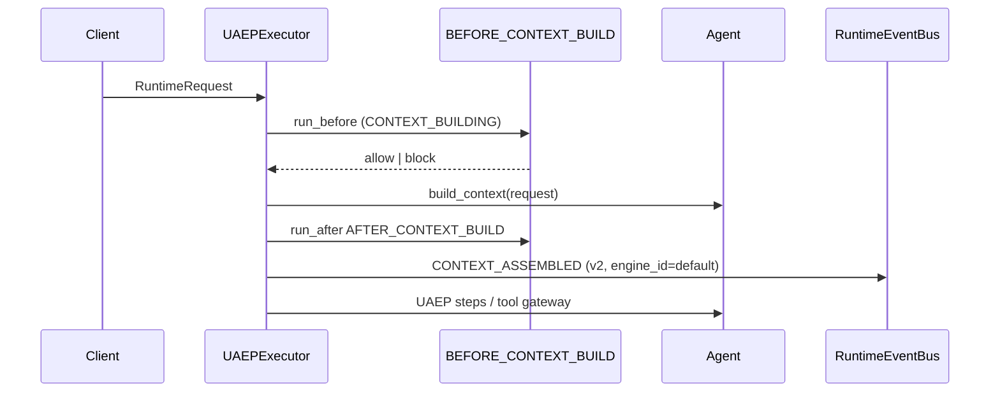
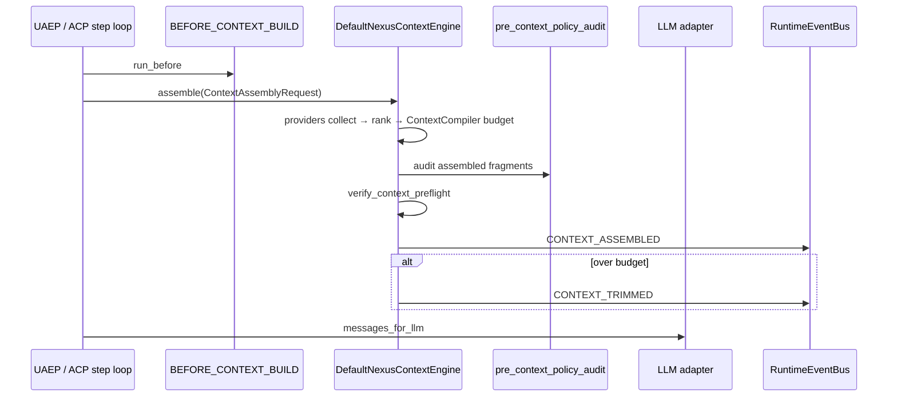
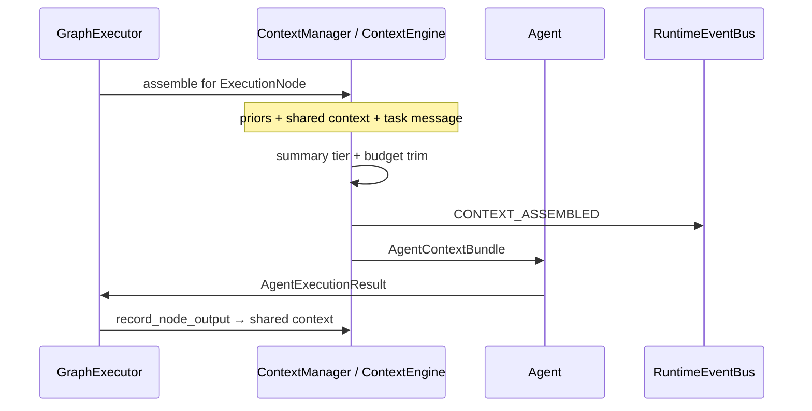

# CONTEXT_ENGINEERING — §8+ extended architecture

**Parent hub:** [`CONTEXT_ENGINEERING.md`](../CONTEXT_ENGINEERING.md)

## 8. Plugin system architecture

CE follows the same **catalog pattern** as Integration / Tool / Skill libraries ([`EXTENSION_AUTHOR_GUIDE.md`](../guides/EXTENSION_AUTHOR_GUIDE.md)).

### 8.1 Catalog surface (shipped)

| Layer | Entry point group | Protocol | Register |
|-------|-------------------|----------|----------|
| Context | `intergrax.context` | `ContextPlugin` | `register_context_plugin()` |

```python
class ContextSourceProvider(Protocol):
    provider_id: str
    supported_sources: frozenset[ContextFragmentSource]
    async def collect(
        self,
        request: ContextAssemblyRequest,
        ctx: ContextProviderContext,
    ) -> list[ContextFragment]: ...

class ContextRanker(Protocol):
    ranker_id: str
    def rank(
        self,
        fragments: list[ContextFragment],
        request: ContextAssemblyRequest,
    ) -> list[ContextFragment]: ...

class ContextBudgetAllocator(Protocol):
    """Default: ContextCompiler + DegradationLadder."""
    def allocate(
        self,
        fragments: list[ContextFragment],
        budget_tokens: int,
        request: ContextAssemblyRequest,
    ) -> BudgetAllocationResult: ...

class ContextFormatter(Protocol):
    def format(
        self,
        fragments: list[ContextFragment],
        request: ContextAssemblyRequest,
    ) -> list[ChatMessage]: ...

class ContextValidator(Protocol):
    def validate(
        self,
        assembled: AssembledContext,
        request: ContextAssemblyRequest,
    ) -> ContextValidationResult: ...

class ContextEngine(Protocol):
    engine_id: str
    async def assemble(self, request: ContextAssemblyRequest) -> AssembledContext: ...
```

### 8.2 ContextPlugin bundle

```python
@dataclass
class ContextPlugin:
    plugin_id: str
    version: str
    providers: tuple[ContextSourceProvider, ...] = ()
    ranker: ContextRanker | None = None
    allocator: ContextBudgetAllocator | None = None
    formatter: ContextFormatter | None = None
    validator: ContextValidator | None = None
    engine: type[ContextEngine] | None = None  # optional full override
```

Bootstrap (mirror `bootstrap_catalogs`):

```python
bootstrap_context_catalog(
    register_shipped=True,
    context_plugins=(MyCodebasePlugin,),
    discover_entry_points=True,  # INTERGRAX_DISCOVER_CONTEXT_PLUGINS
)
```

### 8.3 Default engine — as-built (post CE-EXT S12, 2026-06-12)

Legacy `runtime_steps` pipeline (`HistoryLayer` → `CompileContextStep`) was **removed** by ACP-CLOSE-LEG.

| Path | Collect | Budget / validate | Format | Events | Engine integration |
|------|---------|-------------------|--------|--------|-------------------|
| **Graph** | `compose_agent_message()` + optional provider `collect()` | `ContextEngine.assemble()` when `llm_adapter` wired; else `trim_message_to_budget` | bundle message | `CONTEXT_ASSEMBLED` v2 + `engine_id` | **Hybrid** — CE-3.7 |
| **UAEP** | `build_context` + optional `assemble_uaep_session_prompt` | engine merge when wired | `ContextCompiler` when engine wired | `CONTEXT_ASSEMBLED` v2 | **Hybrid** — assemble wired (CE-UAEP-ASM); provider collect via legacy bridge handles |
| **ACP** | catalog tools in `on_next_step` + provider stubs in engine | `compile_prompt_text()` / `ContextCompiler` before each LLM call | step prompt | step trace + assembly v2 when graph-wired | **Hybrid** — CE-3.9 compiler hot path |
| **Engine unit/integration** | `DefaultNexusContextEngine.assemble()` | collect → dedup → rank → `ContextCompiler` → `verify_context_preflight()` | `ChatMessage[]` | via `ContextManager` when wired | **Reference spine** |

**Unification status:** graph + UAEP use `assemble()` when engine wired (**CE-ALIGN**). **CE-PROV-WIRE** closes §7.1 provider collect for all §8.4 builtins (GAP-CTX-20). ACP step path remains hybrid (catalog tools + compiler) until optional per-step `assemble()` follow-up.

### 8.4 Built-in provider registry (normative)

| provider_id | Source(s) | Module | collect status | CE-PROV-WIRE |
|-------------|-----------|--------|----------------|--------------|
| `builtin.task_message` | TASK_MESSAGE | `builtin.py` + `legacy_bridge.py` | **live** (objective / messages handle) | CE-PROV-01 **Done** |
| `builtin.system_instructions` | SYSTEM_INSTRUCTIONS | `builtin.py` + `legacy_bridge.py` | **live (handle-gated)** | CE-PROV-02 **Done** |
| `builtin.session_history` | SESSION_HISTORY | `builtin.py` + `legacy_bridge.py` | **live** (`session_history_messages` handle) | CE-PROV-03 **Done** |
| `builtin.session_history_semantic` | SESSION_HISTORY_SEMANTIC | `session_semantic_recall.py` | **live** (vector index + hits handle) | — (CE-VEC-1) |
| `builtin.longterm_memory` | LONGTERM_MEMORY | `builtin.py` + `legacy_bridge.py` | **live (handle-gated)** | CE-PROV-04 **Done** |
| `builtin.rag` | RAG | `builtin.py` + `legacy_bridge.py` | **live (handle-gated)** | CE-PROV-05 **Done** |
| `builtin.websearch` | WEBSEARCH | `builtin.py` + `legacy_bridge.py` | **live (handle-gated)** | CE-PROV-06 **Done** |
| `builtin.tool_output` | TOOL_OUTPUT | `builtin.py` + `legacy_bridge.py` | **live (handle-gated)** | CE-PROV-07 **Done** |
| `builtin.graph_prior` | GRAPH_PRIOR | `builtin.py` + `legacy_bridge.py` | **live** (`prior_output_records` handle) | CE-PROV-08 **Done** |
| `builtin.shared_context` | SHARED_CONTEXT | `builtin.py` + `legacy_bridge.py` | **live (handle-gated)** | CE-PROV-09 **Done** |
| `builtin.attachments` | ATTACHMENT | `builtin.py` + `legacy_bridge.py` | **live (handle-gated)** | CE-PROV-10 **Done** |
| `builtin.policy_overlay` | POLICY_OVERLAY | `builtin.py` + `legacy_bridge.py` | **live (handle-gated)** | CE-PROV-11 **Done** |
| `builtin.workspace` | WORKSPACE | `workspace.py` | **live** (`workspace_files` handle) | — (CE-7.2) |

**Plan:** [`plan/CONTEXT_ENGINEERING.md`](../plan/CONTEXT_ENGINEERING.md) phase **CE-PROV-WIRE** · sprints B1–B4. Handle key contract documented in plan §CE-PROV-WIRE (2026-06-14).

### 8.5 Engine presets (Tier-3)

| Preset ID | Use case | Engine / plugins |
|-----------|----------|------------------|
| `default` | General Nexus hosts | `DefaultNexusContextEngine` |
| `codebase` | Repo-scale dev agents | `CodebaseContextEngine` + workspace providers |
| `regulated_minimal` | Legal / compliance | high confidence threshold, MINIMAL summary tier |
| `explore_child` | Delegation explore | isolated namespace providers, tight budget |
| `custom` | `ContextProfile.engine_ref` | author-registered `ContextEngine` subclass |

```python
# ApplicationEnvironmentProfile — as-built ContextProfile fields (CTX + CE-EXT)
class ContextProfile(BaseModel):
    assembly_options: TaskContextAssemblyOptions
    budget_policy: ContextBudgetPolicy | None
    decision: ContextDecisionProfile
    engine_preset: Literal["default", "codebase", "regulated_minimal", "explore_child", "custom"] = "default"
    engine_ref: str | None = None          # CE-3: dotted path to ContextEngine class
    context_plugin_ids: list[str] = []     # CE-2: enabled plugin ids
    enable_rag: bool = True
    enable_websearch: bool = True
    # ... existing drift / semantic compression flags
```

---

## 9. Execution paths

### 9.1 As-built — UAEP session turn



When `context_engine` + `llm_adapter` are wired on `UAEPExecutor`, **`assemble_uaep_session_prompt`** runs after `build_context` (**CE-UAEP-ASM**). Provider collect uses task/request metadata handles populated by upstream steps (**CE-PROV-WIRE**).

### 9.1.1 Engine assembly spine (CE-3 + CE-3.9 — shipped on ACP/graph)



ACP path: `ContextAssemblyRequest.step_kind` from `AgentStepContext` / `StepOutcome` (CE-4).

### 9.2 Nexus graph node (multi-agent)



**Graph path (CE-3.7):** `ContextManager.build_agent_context_async()` calls **`ContextEngine.assemble(scope=graph_node)`** when engine + `llm_adapter` are wired.

### 9.3 Delegation / explore child

| Aspect | Rule |
|--------|------|
| Budget | Child `RunBudget` capped; parent receives synthesis only |
| Namespace | Providers read delegation-scoped memory only |
| Preset | `explore_child` disables websearch by default |
| Return | `DelegationResult.context_summary` — not full child window |

### 9.4 ACP direct run (Tier-2)

ACP agents still collect context inside `on_next_step` via catalog context tools (`rag.retrieve`, memory skills). **CE-3.9** wires `ContextCompiler` before each LLM call via `StepLLMRouter` + `compile_service`. **CE-4** populates `step_kind` from `AgentStepContext` / `AgentContract.context_hints` (CE-5.1). Optional full `assemble()` per step is follow-up.

---

## 10. Degradation ladder (normative)

Apply until `assembled_tokens <= budget_tokens` ([`ADR-MEM-001`](../adr/entries/2026-06-08/ADR-MEM-001.md)):

```text
1. FULL fidelity
2. Lower graph summary tier (FULL → SUMMARY_ONLY → MINIMAL)
3. Reduce LTM / RAG top_k
4. SUMMARIZE_OLDEST (session)
5. TRUNCATE_OLDEST (session)
6. DROP lowest-scored optional fragments (by ranker composite)
7. DROP optional injection blocks
8. Tokenizer-aware hard trim (last resort — emit explicit CONTEXT_TRIMMED)
```

Each step **MUST** emit diagnostics: `degradation_step`, `bytes_removed`, `fragments_dropped[]`.

---

## 11. Quality controls

| Control | Mechanism | Status |
|---------|-----------|--------|
| Relevance / freshness / confidence | `ContextChunkSignal` + thresholds | **Done** — `DefaultContextRanker._apply_quality_gate()` (CE-10.1) |
| Dedup | `content_hash` / `dedup_fragments_by_hash()` | **Done** — engine collect merge (CE-10.2) |
| Drift monitoring | `ContextProfile.drift_monitoring_enabled` | **Done** |
| Semantic compression | `semantic_compression_enabled` | **Done** (profile flag) |
| Regression benchmark | `context_regression_benchmark.py` | **Done** |
| Retrieval effectiveness | `retrieval_effectiveness.py` | **Done** (RAG boundary) |

**CE-10.3** (CE-FMT-1 tag classification in `classify_candidates`) **Done** — legacy string heuristics remain fallback for non-tagged injections.

---

## 12. Context Path Unification

**Normative rule (production):** For production execution, all LLM-facing context **SHOULD** be assembled through `ContextCompiler` / `ContextEngine` or an explicitly approved equivalent context assembly path.

**Normative rule (new code):** New production code **MUST NOT** introduce a new ad-hoc prompt/context assembly path unless this architecture document explicitly approves it and defines its relationship to `ContextCompiler` / `ContextEngine`.

Parallel ad-hoc paths — agent-local prompt building, UAEP/session prompt assembly without compiler, direct history concatenation, raw messages passed directly to `LLMAdapter`, test/lab shortcuts, tool/agent-specific prompt fragments — create drift risk: production LLM calls may bypass `MemoryView`, RAG provenance, policy, budget and observability.

**Cross-refs:** [`SYSTEM_INVARIANTS.md`](../guides/SYSTEM_INVARIANTS.md) §5 · [`AGENT_AUTHOR_MINIMAL_PATH.md`](../guides/AGENT_AUTHOR_MINIMAL_PATH.md) · [`AGENT_CONTRACTS_AND_ASSEMBLY.md`](AGENT_CONTRACTS_AND_ASSEMBLY.md) §17 · [`LLM_ADAPTERS.md`](LLM_ADAPTERS.md) · [`MEMORY.md`](MEMORY.md) · [`RAG.md`](RAG.md) · [`ADAPTIVE_HARNESS_INTELLIGENCE.md`](ADAPTIVE_HARNESS_INTELLIGENCE.md#governance-boundary) (L4 adaptive ranking — observe/propose only by default)

### 12.1 Approved context paths

| Path | Role | Notes |
|------|------|-------|
| **`ContextCompiler` / `ContextEngine`** | **Canonical production path** | Collect → rank → budget → format → validate → emit; see §7–§11 |
| **Prompt Registry / approved prompt mechanism** | Source of reusable prompt **fragments** | `SystemInstructionsProvider`; **not** a full replacement for context compilation |
| **`MemoryView` / approved memory services** | Memory **access** path | Session, LTM, task KV reads; CE consumes via `MemoryContextProvider` |
| **RAG service / catalog tools** | Knowledge **retrieval** path | `rag.retrieve` and Nexus retrieval steps; CE consumes via `RagContextProvider` |
| **Test fixtures / lab shortcuts** | Non-production only | Allowed when explicitly marked **test** or **lab**; **MUST NOT** become production paths |

### 12.2 Disallowed context paths

Production agents and runtime components **MUST NOT**:

- concatenate unbounded conversation history directly into LLM messages,
- query vector stores directly from agents,
- read arbitrary memory stores directly from agents,
- bypass `ContextCompiler` for production LLM context,
- bypass policy / budget / redaction / provenance controls,
- build private prompt pipelines inside agents,
- send raw tool outputs to LLM without approved filtering / formatting,
- treat Prompt Registry as a full context engine,
- treat RAG retrieval as memory,
- treat trace logs as memory or user context.

### 12.3 Transitional / legacy paths

Some older or lab paths may still assemble prompts directly (e.g. UAEP `build_context` hybrid, ACP catalog-tool collect before per-step `assemble()`, direct `messages` to `LLMAdapter` in tests).

They are allowed **only** when explicitly marked as:

- **lab**, **test**, **migration**, **compatibility**, or **non-production**.

Any such path **SHOULD** have:

| Field | Requirement |
|-------|-------------|
| **Owner** | Team or domain responsible |
| **Reason** | Why the path exists |
| **Maturity status** | Per [`MATURITY_TAXONOMY.md`](../guides/MATURITY_TAXONOMY.md) |
| **Migration target** | Canonical CE path or approved equivalent |
| **Known risks** | Budget, provenance, policy bypass, etc. |

Do **not** remove legacy paths in this document — register and constrain them until migration completes.

### 12.4 Cursor review checklist

Before adding or modifying any LLM call, Cursor must verify:

- [ ] Is the context assembled by `ContextCompiler` / `ContextEngine` or an approved equivalent?
- [ ] Are prompt fragments coming from Prompt Registry or an approved prompt source?
- [ ] Is memory accessed through `MemoryView` / approved memory services?
- [ ] Is RAG accessed through approved RAG services / tools?
- [ ] Is provenance preserved for retrieved fragments?
- [ ] Are budgets applied before model invocation?
- [ ] Are secrets and protected data redacted before persistence and model calls where required?
- [ ] Is this path **production**, **lab**, **test**, or **compatibility**?
- [ ] If not canonical, is the path explicitly documented as transitional (§12.3)?

---

## 12. Harness integration

### 12.1 Control plane (Tier-3)

```text
ApplicationEnvironmentProfile
  └── context_profile
        ├── assembly_options → TaskContextAssemblyOptions
        ├── budget_policy → ContextBudgetPolicy
        ├── decision → ContextDecisionProfile
        ├── engine_preset / engine_ref / context_plugin_ids
        └── enable_rag / enable_websearch / compression flags

materialize_runtime_config()
  └── context_runtime_bridge.py
        → RuntimeConfig.context_budget_policy
        → task_context_assembly_options
        → context_decision_profile

wire_application_environment()
  └── context_wiring.py
        → resolve_context_manager_from_environment()
        → resolve_context_engine_from_environment()
        → resolve_context_orchestrator_from_environment()  # codebase preset only

build_nexus_loop_from_environment()
  └── NexusLoop(context_manager=...)  # optional context_engine override (CE-3.5)
```

### 12.2 Hooks

| HookPoint | When | CE behaviour |
|-----------|------|--------------|
| `BEFORE_CONTEXT_BUILD` | Before `assemble()` | Middleware may MODIFY runtime_state; BLOCK stops assembly |
| `AFTER_CONTEXT_BUILD` | After `assemble()` | Audit / enrich diagnostics |

Registered in `hook_registry.py` parity map · UAEP `run_before` / `run_after`.

### 12.3 Policy

| Check | Module |
|-------|--------|
| Pre-context policy gate | `runtime/policy/context_assembly_policy.py` (`run_pre_context_policy_gate`) |
| Static wiring audit | `pre_context_policy_audit.py` (CI marker scan) |
| Retrieval poisoning | RAG security profile — fragments filtered before inject |
| Secret redaction | `ApplicationSecurityProfile` on trace payloads |

### 12.4 Runtime events

| Event | Phase | Payload schema | Storage | Path |
|-------|-------|----------------|---------|------|
| `CONTEXT_ASSEMBLED` | `CONTEXT_BUILDING` | `context_assembly.v2` (preferred) | TraceStore | Graph + UAEP (CE-3.11, CE-4.5) |
| `CONTEXT_TRIMMED` | `CONTEXT_BUILDING` | `context_assembly.v2` | TraceStore | Graph |
| `CONTEXT_BUILT` | `CONTEXT_BUILDING` | `context_assembly.v1` (alias registry) | TraceStore | **Deprecated** — use `CONTEXT_ASSEMBLED` |
| `CONTEXT_CANDIDATE_COLLECTED` | `CONTEXT_BUILDING` | `context_candidate.v1` | TraceStore | `DefaultNexusContextEngine` when `event_bus` in provider handles (CE-9.1) |
| `CONTEXT_CANDIDATE_DROPPED` | `CONTEXT_BUILDING` | `context_candidate.v1` | TraceStore | Dedup phase + counters (`context_counters.py`) |
| `CONTEXT_VALIDATION_FAILED` | `CONTEXT_BUILDING` | `validation.v1` | TraceStore | Policy/validator failures before `assemble()` raises |

Payload fields (assembled):

```yaml
trace_id, run_id, task_id, tenant_id
assembly_scope, step_index, graph_node_id, step_kind
total_tokens, budget_tokens, degradation_steps[]
fragments_included_count, fragments_excluded_count
provenance_summary: [{source_type, source_id, token_estimate}]
engine_id, plugin_ids[]
```

### 12.5 Logging

Structured logger namespace: `intergrax.context.engine`

| Level | When |
|-------|------|
| DEBUG | Per-provider collect counts, timing |
| INFO | Assembly complete — tokens, degradation |
| WARNING | Validation near-limit, quality threshold suppressions |
| ERROR | Validation failed, provider exception (fail closed or degrade per profile) |

**Never log** raw fragment content at INFO in production profiles — use `trace_id` + `fragment_id` only.

### 12.6 Observability / tracing

| Signal | Status |
|--------|--------|
| OTel spans | **Shipped (shim)** — `context/tracking/context_spans.py`; gate: `check_context_otel_span_registry.py` |
| Metrics | **Opt-in** — `runtime/observability/context_counters.py` (`INTERGRAX_CONTEXT_METRICS`) |
| Gate scripts | `check_context_otel_span_registry.py`, `check_context_engine_wiring.py`, `intergrax doctor` |
| Dashboards | Deferred (CE-9.6) — link when OBS product dashboard slice ships |

### 12.7 Cost attribution

Context assembly CPU time and optional LLM summarization calls **MUST** attribute to `run_id` / `task_id` via V-COST hooks when semantic compression invokes LLM — **deferred** until semantic compression hot path (CE-9.5).

---

## 13. Interactive / multi-hop assembly (codebase-scale)

For Cursor-class behaviour, CE ships an **optional orchestration loop** (CE-8 — codebase preset):

```text
ContextOrchestrator (max_hops=3, latency_budget_ms)
  hop 1: coarse workspace index search → candidate paths
  hop 2: read symbols / chunks via ToolOutputProvider
  hop 3: re-rank + assemble
```

| Component | Role |
|-----------|------|
| `WorkspaceContextProvider` | Merkle + chunks (`context/providers/workspace_index.py`) |
| `rag.retrieve` | Semantic fallback |
| `explore` delegation | Wide search child agent |
| `ContextOrchestrator` | Bounded loop — not unbounded agent while-true |

**Guardrails:** `max_hops`, `max_collect_latency_ms`, policy on total tool reads per assembly.

---

## 14. Use cases

### 14.1 Short chat Q&A

- Preset: `default`
- Sources: session + LTM (if prefer) + optional RAG
- Degradation: unlikely; `OFF` compression

### 14.2 Long session support

- **Episodic semantic recall** (when `MemoryProfile.enable_session_vector_index`) — retrieve relevant past turns from the session turn vector index before assembling chronological history; see [`MEMORY.md`](MEMORY.md) §7.1.1 (MEM-VEC-2.*)
- `HistoryLayer` SUMMARIZE_OLDEST on the **remaining** chronological tail when episodic + budget still overflow
- CE drops lowest-scored optional fragments (`SESSION_HISTORY_SEMANTIC` before mandatory user turn) per degradation ladder

### 14.3 Document Q&A

- RAG provider dominant; history minimal
- Citations in fragment metadata → output grounding

### 14.4 Multi-agent legal workflow

- Graph priors with `SUMMARY_ONLY` tier
- Preset `regulated_minimal`

### 14.5 Codebase feature implementation

- Preset `codebase`
- Plugins: workspace + graph_prior + tool_output
- Orchestrator 2–3 hops
- Budget: 128k window — never full repo dump

### 14.6 Delegated research child

- Preset `explore_child`
- Parent sees synthesis fragment only via `DelegationResult`

---

## 15. Author extension guide (summary)

Full detail: [`EXTENSION_AUTHOR_GUIDE.md`](../guides/EXTENSION_AUTHOR_GUIDE.md) §Context (CE-12.1 deferred) · [`AGENT_CREATION_GUIDE.md`](../guides/AGENT_CREATION_GUIDE.md) Appendix L · `intergrax/context/plugin.py`.

```python
class MyCodebaseContextPlugin:
    plugin_id = "acme.codebase"

    def register(self, registry: ContextPluginRegistry) -> None:
        registry.add_provider(WorkspaceIndexProvider(...))
        registry.set_ranker(CodeProximityRanker(...))

# applications/myapp/host/environment_profile.py
profile = ApplicationEnvironmentProfile(
    context_profile=ContextProfile(
        engine_preset="custom",
        engine_ref="myapp.context.CodebaseContextEngine",
        context_plugin_ids=["acme.codebase"],
    ),
)
```

**Forbidden:**

- Subclassing agents to concatenate prompts
- Importing `ContextCompiler` from Tier-2 agents
- Bypassing `BEFORE_CONTEXT_BUILD` for production hosts

---

## 16. Engine depth audit register (2026-06-12, post CE-EXT)

| ID | Status | Finding (original) | Resolution |
|----|--------|-------------------|------------|
| GAP-CTX-01 | **Closed** | No `ContextSourceProvider` Protocol + registry | CE-1, CE-2 shipped |
| GAP-CTX-02 | **Closed** | No unified `ContextEngine.assemble()` | CE-3.7 graph engine path; hybrid UAEP/ACP remain |
| GAP-CTX-03 | **Closed** | No injectable `ContextEngine` on assembly path | CE-3.4, CE-3.5 |
| GAP-CTX-04 | **Closed** | No step-aware `ContextAssemblyRequest` | CE-4, CE-5.1 |
| GAP-CTX-05 | **Closed** | Quality scoring not in hot path | CE-10.1 ranker gate |
| GAP-CTX-06 | **Closed** | Workspace spike only | CE-7 workspace provider |
| GAP-CTX-07 | **Closed** | No `ContextOrchestrator` | CE-8 codebase preset |
| GAP-CTX-08 | **Closed** | `classify_candidates` string heuristics | **CE-10.3** — CE tag prefix + legacy fallback (2026-06-14) |
| GAP-CTX-09 | **Closed** | No OTel spans on hot path | CE-9.2 span registry + shim |
| GAP-CTX-10 | **Closed** | No `CONTEXT_CANDIDATE_*` bus events | CE-9.1 engine emission via `context_skill_recording` |
| GAP-CTX-11 | **Closed** | `ContextBuilder` name collision | CE-3.6 `SessionRagContextBuilder` alias |
| GAP-CTX-12 | **Deferred** | L4 adaptive ranking | AHI plan |
| GAP-CTX-13 | **Closed** | `ContextCompiler` not on hot path | CE-3.9 ACP + graph engine |
| GAP-CTX-14 | **Closed** | `CONTEXT_BUILT` vs `CONTEXT_ASSEMBLED` split | CE-3.11 unified v2 |
| GAP-CTX-15 | **Closed** | Provider `collect()` fragments not merged into LLM window | CE-FMT-1 `formatter.py` + engine merge |
| GAP-CTX-16 | **Closed** | `ContextOrchestrator` not on Nexus graph hot path | CE-8.2b `ContextManager` + wiring |
| GAP-CTX-17 | **Closed** | `engine_ref=custom` not resolved | `context_engine_resolver.load_context_engine` |
| GAP-CTX-18 | **Closed** | Preset engines lack §8.5 behavior | `preset_engines.py` |
| GAP-CTX-19 | **Closed** | Registry formatter unused | `BuiltinContextPlugin` sets `DefaultContextFormatter` |
| GAP-CTX-20 | **Closed** | 8 builtin stub `collect()` returned `[]` on engine path | **CE-PROV-WIRE** B1–B4 Done (2026-06-14) |

**Traceability:** [`plan/CONTEXT_ENGINEERING.md`](../plan/CONTEXT_ENGINEERING.md) · **CE-ALIGN** Done · **CE-PROV-WIRE** Done.

---

## 17. Module inventory

| Module | Tier | Role |
|--------|------|------|
| `intergrax/context/contracts.py` | 0 | `ContextFragment`, `ContextAssemblyRequest`, `AssembledContext` |
| `intergrax/context/protocols.py` | 0 | Provider / ranker / engine protocols |
| `intergrax/context/registry.py` | 0 | `ContextPluginRegistry` |
| `intergrax/context/plugin.py` | 0 | `register_context_plugin()` |
| `intergrax/context/bootstrap.py` | 0 | `bootstrap_context_catalog()` |
| `intergrax/context/ranker.py` | 0 | `DefaultContextRanker` (step + quality gate) |
| `intergrax/context/dedup.py` | 0 | `dedup_fragments_by_hash()` |
| `intergrax/context/orchestrator.py` | 0 | `ContextOrchestrator` (codebase preset) |
| `intergrax/context/quality.py` | 0 | `evaluate_context_engineering()` |
| `intergrax/context/providers/builtin.py` | 0 | `BuiltinContextPlugin` (all §8.4 providers live via legacy bridge) |
| `intergrax/context/providers/legacy_bridge.py` | 0 | Legacy collector adapters (**CE-PROV-BRIDGE** — B1 shipped) |
| `intergrax/context/providers/workspace.py` | 0 | `WorkspaceContextProvider` |
| `intergrax/context/providers/workspace_index.py` | 0 | Merkle workspace index |
| `intergrax/context/providers/session_semantic_recall.py` | 0 | Episodic vector recall provider |
| `intergrax/context/tracking/context_spans.py` | 0 | CE OTel span names + shim |
| `intergrax/runtime/nexus/context/context_engine.py` | 1 | `DefaultNexusContextEngine` |
| `intergrax/runtime/nexus/context/codebase_engine.py` | 1 | `CodebaseContextEngine` preset |
| `intergrax/runtime/nexus/context/compile_service.py` | 1 | ACP compiler hot-path helpers |
| `intergrax/runtime/nexus/context/context_validator.py` | 1 | `DefaultContextValidator` + preflight |
| `intergrax/runtime/nexus/context/fragment_bridge.py` | 1 | `ContextCandidate` ↔ `ContextFragment` |
| `intergrax/runtime/nexus/context/graph_assembly.py` | 1 | Graph `ContextAssemblyRequest` builder |
| `intergrax/runtime/nexus/context/context_compiler.py` | 1 | Budget allocator + degradation |
| `intergrax/runtime/nexus/context/context_preflight.py` | 1 | Never-overflow preflight |
| `intergrax/runtime/nexus/context/context_manager.py` | 1 | Graph assembly + async engine path |
| `intergrax/runtime/nexus/context/context_assembler.py` | 1 | Graph message compose helpers |
| `intergrax/runtime/nexus/context/context_builder.py` | 1 | Session RAG; `SessionRagContextBuilder` alias |
| `intergrax/runtime/policy/context_assembly_policy.py` | 1 | `run_pre_context_policy_gate()` |
| `intergrax/runtime/observability/context_counters.py` | 1 | Opt-in assembly metrics |
| `intergrax/runtime/nexus/tools/plan_context_invocation.py` | 1 | ACP catalog context injection |
| `intergrax/runtime/architecture/context_engineering.py` | 1 | Quality scoring shim |
| `intergrax/runtime/architecture/context_regression_benchmark.py` | 1 | Regression harness |
| `intergrax/memory/workspace_index_spike.py` | 0 | Legacy RFC — superseded by `context/providers/workspace_index.py` |
| `intergrax/contracts/context_assembly.py` | 0 | `TaskContextAssemblyOptions` |
| `intergrax/contracts/agent_context_hints.py` | 0 | `AgentContextHints` (CE-5.1) |
| `intergrax/applications/_shared/context_presets.py` | 3 | Tier-3 preset helpers |
| `intergrax/applications/_shared/context_runtime_bridge.py` | 3 | Profile → RuntimeConfig |
| `intergrax/applications/_shared/context_wiring.py` | 3 | Engine + manager resolution |
| `intergrax/agents/authoring/context_assembly_bridge.py` | 2 | ACP `ContextAssemblyRequest` builder |
| `intergrax/agents/uaep.py` | 2 bridge | UAEP hooks + `CONTEXT_ASSEMBLED` v2 |
| `intergrax/runtime/nexus/context/runtime_state_handle_bridge.py` | 1 | RuntimeState → CE provider metadata sync (CE-HANDLE-FILL) |
| `scripts/maintenance/check_context_engine_wiring.py` | — | CI preset resolution gate |
| `scripts/maintenance/check_context_builtin_providers.py` | — | CI builtin collect wiring gate (CE-PROV-GATE) |
| `scripts/maintenance/check_context_otel_span_registry.py` | — | CI span wiring gate |

---

## 18. Anti-patterns

| Anti-pattern | Correct approach |
|--------------|------------------|
| Agent builds `prompt = history + rag + tools` | `ContextEngine.assemble()` |
| Full session dump to LLM | HistoryLayer + CE budget |
| Silent fragment drop | Emit `CONTEXT_CANDIDATE_DROPPED` with reason |
| RAG chunks without citation metadata | `ContextFragment.metadata.citations` |
| Custom CE fork in `agents/` | `ContextPlugin` in application package |
| Storing CE diagnostics in task KV | Trace + RuntimeEvent only |

---

## 19. Related documents

| Document | Relationship |
|----------|--------------|
| [`architecture/MEMORY.md`](MEMORY.md) | Stores + lifecycle — CE consumes via providers |
| [`architecture/RAG.md`](RAG.md) | Retrieval — CE consumes chunks |
| [`plan/CONTEXT_ENGINEERING.md`](../plan/CONTEXT_ENGINEERING.md) | Implementation register |
| [`guides/AGENT_CREATION_GUIDE.md`](../guides/AGENT_CREATION_GUIDE.md) Appendix L | Author control plane |
| [`IDEAL_HARNESS_AI_ARCHITECTURE.md`](../guides/IDEAL_HARNESS_AI_ARCHITECTURE.md) §16 | Target vision |
| [`ADR-CTX-001`](../adr/entries/2026-06-12/ADR-CTX-001.md) | Domain split decision |

---

*End of Context Engineering architecture canon.*
