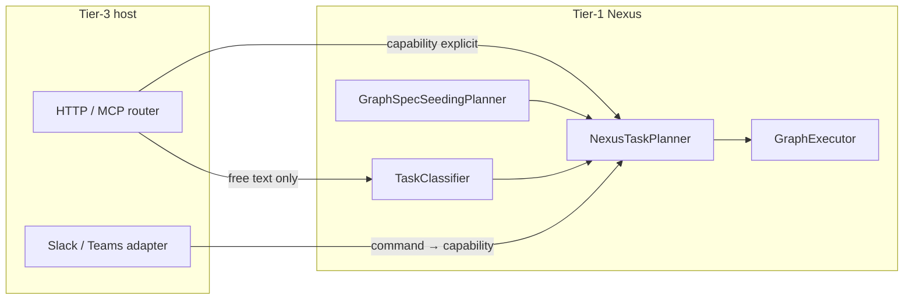

# TIER3_APPLICATION_ENVIRONMENT — extended depth

**Parent hub:** [`TIER3_APPLICATION_ENVIRONMENT.md`](../TIER3_APPLICATION_ENVIRONMENT.md)

# 20. Shadow Workspace Model

An isolated temporary filesystem workspace for work **without mutating the main product environment** — Cursor-like experiments, document drafts, simulated workflows.

**Code:** `intergrax/runtime/workspace/shadow_workspace.py` · `ShadowWorkspaceManager` · wired via `wire_shadow_workspace()` · profile `ShadowWorkspaceProfile`.

## 20.1 Lifecycle (normative)

```text
1. CREATE     ShadowWorkspaceManager.open_or_create(tenant_id, task_id)
              → ShadowWorkspace.create under profile.root (default build/shadow_workspaces)
2. MOUNT      Task metadata: shadow_workspace_id, shadow_workspace=true
              Agent/tool paths resolve under workspace.root (policy-bound)
3. EXECUTE    write/read, list artifacts, optional snapshots
4. CAPTURE    list_artifacts() → ShadowArtifact[]; manifest → WorkspaceArtifactRef (§48)
5. ROLLBACK   snapshot restore when author requests undo path
6. CLEANUP    cleanup_for_task(tenant_id, task_id) or cleanup(workspace_id)
7. RETENTION  ShadowWorkspaceProfile.retention_hours; ops job may purge stale dirs
8. AUDIT      artifacts in trace + RunArtifactBundle on ApplicationRunSummary
```

## 20.2 Isolation and permissions

| Concern | Mechanism |
|---------|-----------|
| Tenant boundary | Path: `{root}/{tenant_id}/{task_id}/{workspace_id}/` |
| Tool access | Only via harness tools with shadow path policy — no raw host FS in agents |
| Execution mode | STRICT hosts deny writes outside workspace root |
| Provenance | `tenant_id`, `task_id`, `workspace_id` on every artifact |

## 20.3 Integration with application state

When active, `ApplicationEnvironmentState.shadow_workspace` (§42) carries `workspace_id`, paths — updated by host hooks on `AFTER_TASK_INTAKE` or framework seed (**Done** APP-CON-3 lifecycle middleware).

## 20.4 Use cases

Code experiments · document analysis · temporary transforms · simulated business workflows · vendor research · legal review drafts · onboarding simulations.

## 20.5 Anti-patterns

| ID | Anti-pattern | Correct |
|----|--------------|---------|
| SHW-AP-01 | Product writes directly to repo working tree | Shadow workspace + capture |
| SHW-AP-02 | No cleanup after task | `cleanup_for_task` in factory lifespan / finalization hook |
| SHW-AP-03 | Secrets in workspace without classification | `ArtifactSecurityClass` §48 |

---


---

# 21. Sandbox Model

A **controlled execution environment** for risky computation — code exec, browser automation, generated scripts.

**Code:** `intergrax/runtime/sandbox/session.py` · `SandboxSessionManager` · `wire_sandbox_sessions()` · `SandboxProfile.enable_exec_tool` adds `sandbox.exec` to tool profile.

## 21.1 Lifecycle (normative)

```text
1. CREATE     SandboxSessionManager.open_or_create(tenant_id, task_id)
2. MOUNT      sandbox session id on Task metadata; ToolRuntime routes sandbox.exec here
3. EXECUTE    isolated subprocess/container per session implementation
4. CAPTURE    stdout/files → SandboxArtifactRef (§48)
5. ROLLBACK   dispose session without promoting outputs (failed validation)
6. CLEANUP    cleanup_for_task / cleanup(session_id) — mandatory on task terminal
7. RETENTION  shorter than shadow (default delete_on_task_complete=true, 24h max)
8. AUDIT      tool trace + sandbox artifact bundle on Plane A
```

## 21.2 Isolation levels

| Level | Description | When |
|-------|-------------|------|
| **L1 — FS session** | Directory-isolated session root | Default lab/product |
| **L2 — Tool gateway** | Policy + injection defense on args | STRICT + `ApplicationSecurityProfile` |
| **L3 — Product required** | `product_requires_sandbox()` true | Product hosts with side-effect tool prefixes |

## 21.3 Permissions and observability

- Interruptible via Nexus task cancel + session dispose
- Observable: tool events, session id in trace, optional `BEFORE_TOOL_CALL` hook audit
- Permission-controlled: `ToolProfile` + policy — agents never open shell directly

## 21.4 Integration with ApplicationRunSummary

`RunArtifactBundle.sandbox[]` linked from task metadata key `run_artifact_bundle.v1` (§48) — rollup for operators.

---

---

# 22. Application Environment Profile (canonical)

Tier-3 hosts are configured through **`ApplicationEnvironmentProfile`** — a typed umbrella aggregating every harness control plane slice.

**Evolution (P1-ARCH-01):** the flat surface in §22.1 remains the **current wire-compatible shape** (`spec_version` `1.x`). Canonical target structure is **seven nested bundles** under the same root — §22.6 · [`ADR-APP-003`](../adr/entries/2026-06-17/ADR-APP-003.md) · plan `APP-EVOL-8`.

## 22.1 Profile composition (flat surface — current)

| Sub-profile | Purpose |
|-------------|---------|
| `IdentityProfile` | API key, tenant_required, service identities |
| `PolicyRulesProfile` + `ExecutionMode` | Declarative rules + STRICT/BALANCED/EXPLORATORY |
| `ApplicationSecurityProfile` | Per-app V-SEC toggles |
| `GuardrailProfile` | Vendor LLM guardrail scan toggles (`enabled`, `scan_input/output/tool_calls`, Colang/Bedrock options) |
| `ToolProfile` / `SkillProfile` | Allowed catalogs |
| `IntegrationProfile` | Provider stack — includes optional `llm_guardrail` slug (§47) |
| `LLMProfile` / `ModalityProfile` | Model and modality posture |
| `LLMRoutingProfile` (M-LLM-X.9) | Dynamic model routing — built-in + custom `LLMRoutingRule` classes · [ADR-LLM-003](../adr/entries/2026-06-19/ADR-LLM-003.md) |
| `ContextProfile` / `MemoryProfile` / `ContextDecisionProfile` | Assembly and stores |
| `PromptProfile` | YAML prompt catalog path |
| `ReliabilityProfile` | Idempotency, circuit breaker, checkpoint |
| `ObservabilityProfile` | Trace, OTEL, metrics plugins |
| `CostProfile` / `ComplianceProfile` | Budgets, reactions, compliance domain class |
| `EvaluationProfile` / `CriticProfile` / `AdaptiveProfile` | Eval, PEV, L4 adaptive loop (when enabled) |
| `ReasoningProfile` | Planner/classifier LLM ids, denied models |
| `OrchestrationProfile` | Planner/classifier kinds, delegation depth, long-running |
| `ScalingProfile` / `HostDeploymentProfile` | ECP cross-ref, deploy posture |
| `GovernanceProfile` / `IntegrationGovernanceProfile` | Platform cadence + marketplace **feature flags** (not ownership — see §51) |
| `ApplicationGraphSpec` | Declarative multi-agent topology |
| `OrganizationalPolicyEnvelope` | Virtual org / workforce simulation (§39) |
| `ShadowWorkspaceProfile` / `SandboxProfile` | Isolated workspaces (§20–§21) |
| `ApplicationFeatures` | Lab vs product surface toggles |
| `domain_policy_fragments` | Product-specific `RuntimePolicyBundle` slices |

## 22.1.1 OECP opt-in profile surfaces (target · architectural)

Tier-3 declares which Observability & Evaluation Control Plane (OECP) capabilities are enabled per application. These are **profile-level opt-in surfaces** — declarative hooks only until OBS-ECP / OBS-CTP implementation phases land. Tier-3 does **not** define separate observability semantics ([`OBSERVABILITY.md`](../OBSERVABILITY.md#observability--evaluation-control-plane)).

| Surface | Purpose |
|---------|---------|
| `custom_telemetry_providers` | Registered `TelemetryProvider` ids/schemas executed at configured lifecycle hooks |
| `custom_telemetry_enrichers` | `TelemetryEnricher` ids augmenting spine events before persist/export |
| `custom_event_handlers` | `EventSubscriptionHandler` ids for declarative reactions (extends `ObservabilityProfile.event_subscriptions`) |
| `custom_eval_metric_plugins` | `EvalMetricPlugin` registrations beyond platform built-ins |
| `eval_dataset_refs` | Pointers to `EvalDataset` assets (manual, production sample, incident-harvested, …) |
| `eval_gate_profiles` | Trace completeness + eval regression gate modes (`observe`, `warn`, `block_release`, `block_canary_promotion`, `fail_ci`) |
| `counterfactual_profiles` | Enabled mutation/interpolation suites and fragility thresholds |
| `vendor_export_profiles` | Optional external workbench sinks (OTLP, Langfuse, LangSmith, …) with export/redaction policy |

**Rules:** surfaces reference Tier-0/1 contracts only; no private trace DB; mandatory `schema_id`, namespace, versioning, redaction, tenant isolation, retention class, export policy, sampling policy, and high-cardinality safeguards per OECP canon.

**Contract:** `intergrax/applications/contracts/environment_profile.py`

## 22.2 Unified wiring entrypoints

```text
ApplicationManifest
    -> build ApplicationBuildContext
    -> wire_application_environment(ctx, profile)
    -> materialize_runtime_config(request, harness_ctx, env)
    -> build_nexus_loop_from_environment(...)
    -> UnifiedTaskRunner (§41)
```

| Module | Role |
|--------|------|
| `applications/_shared/environment_wiring.py` | Single wiring entry |
| `runtime_config_bridge.py` | Environment → `RuntimeConfig` |
| `nexus_factory.py` | NexusLoop from profile |
| `identity_wiring.py` | Host auth from `IdentityProfile` |
| `shadow_wiring.py` / `sandbox_wiring.py` | Isolated execution |
| `guardrail_wiring.py` / `guardrail_runtime_bridge.py` | `llm_guardrail` slug → `LlmGuardrailMiddleware` (M.12) |
| `*_runtime_bridge.py` | Domain bridges (RAG, memory, policy, …) |

## 22.3 Interaction surfaces (intake)

Normalized intake MUST converge on the same Nexus lifecycle:

| Surface | Typical entry |
|---------|---------------|
| HTTP API | `applications/*/host/` FastAPI routers |
| CLI | `intergrax` CLI / lab commands |
| Slack / Teams | `POST /v1/interactions/intake` + adapters |
| Webhook / worker | `applications/_shared/task_intake.py`, queue consumers |
| Scheduler | `intergrax/queueing/` + long-running task API |

See [`ORCHESTRATION.md`](ORCHESTRATION.md) §48 for `TaskEnvelope` normalization.

## 22.4 Host migration rule

Every Tier-3 application MUST:

1. declare `environment` on `ApplicationManifest`,
2. wire through `wire_application_environment` (no ad-hoc `getattr` profile access),
3. keep business logic in Tier-2 agents — hosts only compose harness.

**Plan:** [`plan/TIER3_APPLICATION_ENVIRONMENT.md`](../plan/TIER3_APPLICATION_ENVIRONMENT.md) — Phase H-APP **Done** · [Architecture fidelity matrix](../plan/TIER3_APPLICATION_ENVIRONMENT.md#architecture-fidelity-matrix--20-51) for §20–§51 implementation status.

## 22.5 Related documents

| Document | Relationship |
|----------|--------------|
| [`applications/USAGE.md`](../../applications/USAGE.md) | Authoring Tier-3 hosts |
| [`UNIFIED_EXECUTION_RUNTIME.md`](UNIFIED_EXECUTION_RUNTIME.md) | UAEP + policy runtime |
| [`ORCHESTRATION.md`](ORCHESTRATION.md) | Nexus orchestration fields on profile |
| [`ELASTIC_CAPACITY_AND_SCALING.md`](ELASTIC_CAPACITY_AND_SCALING.md) | `ScalingProfile`, deploy/Helm vs ECP provisioning |
| [`guides/HARNESS_ENVIRONMENT.md`](../guides/HARNESS_ENVIRONMENT.md) | Lab stack operator guide |
| [`ADR-APP-003`](../adr/entries/2026-06-17/ADR-APP-003.md) | Hierarchical profile bundles decision |

## 22.6 Hierarchical profile bundles

**Status:** Architecture **accepted** · **M1 Done** · **M2 Done** · **M3 Done** (`APP-EVOL-8.6`) · **ADR:** [`ADR-APP-003`](../adr/entries/2026-06-17/ADR-APP-003.md) · **Code:** `intergrax/applications/contracts/environment_profile/`

### 22.6.1 Problem

`ApplicationEnvironmentProfile` aggregates **43+ top-level fields** across **25+ sub-profile types**. Each new harness domain adds another top-level slot. Sub-profiles are typed and wired independently, but the **flat namespace** increases author cognitive load, preset duplication, and merge-surface growth (`runtime_config_bridge`, `merge_environment`, `EnvironmentSnapshot` digests).

**Invariant preserved:** **`ApplicationEnvironmentProfile` remains the single composition root** (`APP-INV-06`). Bundles are **grouping containers only** — not new runtime primitives and not replacements for §41 separation (`ApplicationGraphSpec`, `OrganizationalPolicyEnvelope`, `AgentBinding`, `ApplicationHost`).

### 22.6.2 Bundle model

Seven nested containers replace the flat top-level namespace. Sub-profile **types are unchanged** — only nesting and authoring presets evolve.

```text
ApplicationEnvironmentProfile                    # composition root (unchanged name)
├── meta: HostMeta                               # host identity posture
├── security: SecurityEnvelope                   # trust boundary + org rules
├── capabilities: CapabilityBundle               # Tier-0 catalogs (tools/skills/LLM/…)
├── cognition: CognitionBundle                   # reasoning, orchestration, critic, eval
├── governance: GovernanceBundle                 # reliability, observability, cost, ops
├── topology: TopologyBundle                     # declarative multi-agent graph
├── isolation: IsolationBundle                   # shadow workspace + sandbox
└── extensions: EnvironmentExtensions            # domain_policy_fragments escape hatch
```

| Bundle | Nested fields (maps from §22.1 flat field) | Answers |
|--------|---------------------------------------------|---------|
| **`HostMeta`** | `profile_id`, `spec_version`, `application_profile`, `execution_mode`, `features` | *What kind of host is this?* |
| **`SecurityEnvelope`** | `identity_profile` → `identity`; `security_profile` → `application_security`; `guardrail_profile` → `guardrails`; `policy_rules`; `compliance_profile` → `compliance`; `organizational_policy` | *Who may run, under which rules?* |
| **`CapabilityBundle`** | `integration_profile` → `integrations`; `tool_profile` → `tools`; `skill_profile` → `skills`; `llm_profile` → `llm`; `modality_profile` → `modality`; `prompt_profile` → `prompt`; `context_profile` → `context`; `memory_profile` → `memory`; `tool_selection_*` + `tool_invocation_*` + `max_parallel_tool_calls` → `tool_selection` / `tool_invocation` | *What catalogs and context planes are enabled?* |
| **`CognitionBundle`** | `reasoning_profile` → `reasoning`; `orchestration_profile` → `orchestration`; `critic_profile` → `critic`; `adaptive_profile` → `adaptive`; `evaluation_profile` → `evaluation`; `codecraft_profile` → `codecraft` | *How does the harness plan, verify, and adapt?* |
| **`GovernanceBundle`** | `reliability_profile` → `reliability`; `observability_profile` → `observability`; `cost_profile` → `cost`; `scaling_profile` → `scaling`; `governance_profile` → `platform`; `capability_governance_profile` → `capability`; `agent_governance_profile` → `agent`; `integration_governance_profile` → `integration_marketplace`; `host_deployment_profile` → `deployment`; `execution_boundary_export_profile` → `boundary_export` | *SRE, budget, deploy, platform ops* |
| **`TopologyBundle`** | `graph_spec` | *Declarative agent topology (§41 primitive)* |
| **`IsolationBundle`** | `shadow_workspace`; `sandbox` | *Safe experiment / code-exec isolation (§20–§21)* |
| **`EnvironmentExtensions`** | `domain_policy_fragments` | *Product-specific `RuntimePolicyBundle` slices — typed escape hatch* |

**Field count:** 43 flat top-level → **7 containers** (+ unchanged sub-profile schemas inside bundles).

### 22.6.3 Authoring (target)

Reusable capability presets MAY be shared across hosts:

```python
LEGAL_CAPABILITIES = CapabilityBundle.product(
    tools=..., skills=..., llm=..., context=..., memory=...,
)

ApplicationEnvironmentProfile(
    meta=HostMeta.product(profile_id="legal.prod"),
    security=SecurityEnvelope.strict(org=legal_org_envelope()),
    capabilities=LEGAL_CAPABILITIES,
    cognition=CognitionBundle.regulated(),
    governance=GovernanceBundle.production_slo(),
    topology=TopologyBundle(graph_spec=legal_graph_spec()),
    isolation=IsolationBundle.product(),
)
```

Effective per-agent config remains **`EnvironmentProfile ⊕ AgentBinding.merge_environment()`** — bundles do not replace `AgentBinding` slices (§34 · ACP §30).

### 22.6.4 Migration phases (normative)

| Phase | Scope | `spec_version` | Breaking? |
|-------|-------|----------------|-----------|
| **M1 — Grouping** | Nested bundle models on root; flat accessors as `@property` shims; flat JSON deserializer | `1.x` | **No** |
| **M2 — Authoring** | Per-bundle presets (`CapabilityBundle.lab()`, `GovernanceBundle.strict()`, shared packs) | `1.x` | **No** |
| **M3 — Canonical nested** | Nested JSON/schema canonical; flat top-level deprecated | `2.0.0` | **Yes** (major) |

**Wiring unchanged in M1–M2:** `wire_application_environment`, `materialize_runtime_config`, and `build_nexus_loop_from_environment` continue to read profile slices through shims or bundle paths — no Nexus fork.

**Snapshot / diff:** `EnvironmentSnapshot` and `ApplicationEnvironmentDiff` MUST digest bundle-normalized canonical form so nested and flat serializations produce identical fingerprints when semantically equal (`APP-EVOL-8.3`).

### 22.6.5 Anti-patterns

| ID | Anti-pattern | Correct |
|----|--------------|---------|
| BND-AP-01 | Multiple composition roots (`HostProfile` + `CapabilityProfile` as peers) | Single `ApplicationEnvironmentProfile` root with nested bundles |
| BND-AP-02 | Bundle contains business logic or wiring | Bundles are Pydantic data only; wiring stays in `applications/_shared/*_wiring.py` |
| BND-AP-03 | Merge `OrganizationalPolicyEnvelope` into `CapabilityBundle` | Org envelope stays in `SecurityEnvelope` (§41 primitive) |
| BND-AP-04 | Per-agent overrides in host bundles | Use `AgentBinding` + `merge_environment()` |

**Plan:** [`plan/TIER3_APPLICATION_ENVIRONMENT.md`](../plan/TIER3_APPLICATION_ENVIRONMENT.md) — `APP-EVOL-8` · `P1-ARCH-01`.

---

# 23. Application interaction postures (canonical)

Tier-3 hosts are **composition shells** around a long-lived Nexus runtime. The same platform mechanisms support different **interaction postures** — selected through `ApplicationEnvironmentProfile` and host wiring, not separate runtime forks.

> **Master configuration canon (all postures × agent counts × strategies × CFG cases):** [`ORCHESTRATION.md`](ORCHESTRATION.md) **§56** — start there for product design and implementation planning. This section is the **Tier-3 host summary** only.

**Runtime narrative:** [`NEXUS_EXECUTION_FLOW.md`](NEXUS_EXECUTION_FLOW.md) §3.1 · **Patterns:** [`ORCHESTRATION.md`](ORCHESTRATION.md) §50–§56 · **Routing modes:** [`REASONING_AND_COGNITION.md`](REASONING_AND_COGNITION.md) §9.4.

## 23.1 Posture catalog

| Posture | Process model | Task trigger | Typical surfaces |
|---------|---------------|--------------|------------------|
| **Reactive on-demand** | Host daemon idle until work arrives | User/API message per `Task` | HTTP `POST …/run`, MCP, Slack/Teams intake (`execute=true`) |
| **Always-on daemon** | Host process runs continuously | Same as reactive; plus health/index maintenance | Local HTTP/MCP, tray, Socket Mode Slack |
| **Scheduled / queued background** | Worker consumes queue or cron | Scheduler, file watcher, webhook enqueue | `intergrax/queueing/`, long-running API, `message_bus` |
| **Hybrid** | Daemon + background workers | Mix of interactive and async tasks | LKW-style: index in background, Q&A on demand |

**Invariant:** every posture normalizes work to **`Task` → `UnifiedTaskRunner` → `NexusLoop.handle_task()`**. Surfaces differ; Nexus lifecycle does not.

```text
Bootstrap (once per host process):
  ApplicationManifest + ApplicationEnvironmentProfile
    → wire_application_environment()
    → build_application_registry()
    → build_nexus_loop_from_environment()
    → UnifiedTaskRunner(nexus_loop)

Per unit of work (any posture):
  Surface adapter → Task → UnifiedTaskRunner.run_task() → NexusLoop
```

Agents are **not** separate OS processes. They are registry entries invoked **on demand** per graph node. The host may be always-on; agents remain passive until Nexus schedules a node.

## 23.2 Profile knobs per posture

| Concern | Profile / module | Reactive | Always-on daemon | Background / hybrid |
|---------|------------------|----------|------------------|---------------------|
| HTTP/MCP serving | Host `factory.py` | Optional | **Required** | Often required for ops |
| Interaction intake | `wire_interaction_intake_service` | Optional | Recommended | Optional (notify only) |
| Long-running + checkpoint | `OrchestrationProfile.long_running_enabled`, `ReliabilityProfile` | Off unless large jobs | On for reports / HITL | **On** for batch pipelines |
| Queue consumer | `applications/_shared/task_intake.py`, `queueing/` | Rare | Optional | **Required** for async |
| Notification on complete | `NotificationAdapter`, integration webhooks | Optional | Recommended | **Required** for user alert |
| Shadow / sandbox | `ShadowWorkspaceProfile`, `SandboxProfile` | Per task | Per task | Per task |
| Execution mode | `ExecutionMode` STRICT / BALANCED / EXPLORATORY | Product choice | Product choice | Often BALANCED for batch |

**Rule:** posture is a **product wiring decision** on Tier-3. Tier-1 Nexus semantics are identical across postures.

### 23.2.1 Product workload posture vs platform deployment mechanics

Tier-3 declares **what the product needs** — continuous availability, HTTP/MCP/interaction surfaces, background components, and reactive/scheduled/hybrid workloads (see §23.1–§23.2). [`APPLICATION_HOSTING.md`](../APPLICATION_HOSTING.md) owns the **generic operational realization**: process lifecycle, liveness/readiness coordination, instance ownership, signal handling, graceful shutdown, restart supervision, generic OS hosting adapters, and service-manager integration boundaries.

Wrapping a Tier-3 application with Application Hosting does not alter `ApplicationManifest`, `ApplicationEnvironmentProfile`, `UnifiedTaskRunner`, `ApplicationHost.on_hook`, or `NexusLoop` semantics.


## 23.3 Routing responsibility matrix (who sets `capability`)

Free-text user input does **not** implicitly select agents. Routing is explicit at one of four layers:

| Layer | Owner | When to use | Sets on `Task` |
|-------|-------|-------------|----------------|
| **L1 — Client / API contract** | Tier-3 router or API schema | Client knows intent (`dispute.scenario`, `research.pipeline`) | `context.capability`, optional `agent_id` |
| **L2 — Interaction adapter** | `InteractionIntakeService` + surface adapter | Slack slash command, structured lab JSON | `message` + mapped `capability` from command prefix |
| **L3 — Tier-1 classifier** | `TaskClassifier` / `classifier_kind=rules` / future LLM (`COG-3.*`) | Chat UX with raw user text | `classification` + inferred `capability` when rules/LLM enabled |
| **L4 — Declarative graph** | `ApplicationGraphSpec` + `GraphSpecSeedingPlanner` | Multi-agent product with fixed topology | Plan steps from `graph_spec`; task `capability` selects pipeline entry |



**Authoring defaults (harness):**

| UX pattern | Minimum routing layer | Do not rely on |
|------------|----------------------|----------------|
| Typed REST API | L1 | Classifier alone |
| Slash command (`/dsw analyze …`) | L2 | Default agent fallback |
| Free-text chatbot | L3 when available; until then L1 shim in host | `SINGLE_AGENT_DEFAULT` |
| Fixed multi-agent product | L1 `*.pipeline` capability + L4 `graph_spec` | `MULTI_AGENT` classification alone |

See [`REASONING_AND_COGNITION.md`](REASONING_AND_COGNITION.md) §9.4 for classification vs orchestration mode.

## 23.4 Multi-agent topology configuration (Tier-3)

Three **supported** ways to run multiple agents with different roles. Pick one per product; do not mix ad-hoc.

| Mode | Mechanism | Agent relationship | Classification typical |
|------|-----------|-------------------|------------------------|
| **A — Declarative graph** | `ApplicationGraphSpec` on profile | `depends_on` / `delegates_to` edges | `CAPABILITY_ROUTED` or `MULTI_AGENT` after seed |
| **B — Pipeline capability** | `Task.context.capability = "<app>.pipeline"` | Sequential steps from `TaskPlanner` or graph seed | Product-specific; see §23.5 |
| **C — Engine planner** | `OrchestrationProfile.planner_kind = engine` | LLM emits `NexusPlan` steps | Any; validated against registry |

**Not a multi-agent mode:** `TaskClassification.MULTI_AGENT` when several agents declare the **same** capability — that is **competitive routing**, not a cross-role pipeline. See [`REASONING_AND_COGNITION.md`](REASONING_AND_COGNITION.md) §9.4.

### Graph spec seeding rules (runtime today)

`GraphSpecSeedingPlanner` wraps the inner planner when `environment.graph_spec.nodes` is non-empty:

```text
should_seed_plan_from_graph_spec(task) is True
  AND graph_spec.nodes non-empty
    → application_graph_spec_to_nexus_plan(spec, task)
  ELSE
    → inner.planner.plan(task, registry)   # TaskPlanner or EngineBackedNexusPlanner
```

`should_seed_plan_from_graph_spec` is true when the task has **no pre-assigned** `task.runtime.orchestration.plan_id`.

**Authoring conventions:**

| Convention | Purpose |
|------------|---------|
| `capability = "<product>.pipeline"` | Signals multi-step product intent to operators and traces |
| `graph_spec` with `DEPENDS_ON` chain | Sequential cooperation (A → B → C) |
| Parallel branches | Multiple nodes with no `depends_on` between them → same topological batch |
| `DELEGATES_TO` edges | Hierarchical delegation per [ADR-FLOW-001](../adr/entries/2026-06-07/ADR-FLOW-001.md) |
| `merge_strategy` on profile | How parallel/sequential summaries compose for the user |

**Implemented (H-APP-DOC.2 / ORCH-CONFIG.2):** `ApplicationGraphSpec.trigger_capabilities` — seed graph only when task capability matches (avoids graph override on single-agent routes). See ADR-FLOW-004.

## 23.5 Scenario recipes (configuration templates)

Copy a row when designing a new Tier-3 host. Adjust profile fields; do not fork Nexus.

| Product scenario | Posture | Agents | Coordination pattern | Key profile settings |
|------------------|---------|--------|----------------------|----------------------|
| Single Q&A agent | Reactive | 1 | Orchestrator–worker (1 node) | `planner_kind=default`, explicit `capability` on API |
| Chat with raw user text | Reactive / daemon | 1+ | Classifier → single or pipeline | `classifier_kind=rules` + `intent_routes` (ORCH-CONFIG.1); `engine` when COG-3 done |
| Research: search then summarize | Reactive | 2 | Sequential pipeline | `capability=research.pipeline` **or** `graph_spec` chain |
| Dispute prep: intake → analyze → strategy → scenario | Reactive / hybrid | 4 | Sequential graph | `graph_spec` + `*.pipeline` token · product example §6.3 (DSW) · harness: CFG-06 sim |
| Parallel doc review shards | Background + reactive | N | Peer-to-peer (parallel batch) | `graph_spec` without inter-node `depends_on`; `max_parallel_nodes` |
| PM delegates to specialists | Reactive | 3+ | Hierarchical | `DELEGATES_TO` edges + `max_delegation_depth` |
| Quality gate before answer | Reactive | 2+ | Evaluator-loop | CVL hooks + `CoordinationPattern.EVALUATOR_LOOP` |
| Index corpus continuously | Hybrid daemon | 1 | Scheduled single-agent | Queue + `dispute.intake`; notify on batch complete |
| Legal draft review + HITL | Reactive | 1–2 | Supervisor–worker | `require_human_approval`, shadow workspace, L2 critic |

**Cross-ref:** pattern names and parallelism rules — [`ORCHESTRATION.md`](ORCHESTRATION.md) §50–§51; completion policy — [`CRITIC_VERIFICATION.md`](CRITIC_VERIFICATION.md).

## 23.6 Host checklist (every Tier-3 application)

1. Declare `environment` on `ApplicationManifest` with intended posture (§23.2).
2. Wire **all** chosen surfaces to `UnifiedTaskRunner` (HTTP, MCP, interaction intake if needed).
3. For multi-agent: set `graph_spec` **or** document `*.pipeline` capability **or** enable `planner_kind=engine`.
4. Set `merge_strategy` for multi-node UX (`concat` vs `last_wins` vs `structured_json`).
5. Set `execution_mode=strict` in production; wire critic profile for high-risk capabilities.
6. Do not implement business orchestration loops in Tier-2 — use Nexus graph + UAEP steps.

**Plan:** [`plan/TIER3_APPLICATION_ENVIRONMENT.md`](../plan/TIER3_APPLICATION_ENVIRONMENT.md) Phase H-APP-DOC · platform cases **ORCH-CONFIG** in [`plan/ORCHESTRATION.md`](../plan/ORCHESTRATION.md).

## 23.7 Tier-3 host wiring audit (as-built 2026-06-09)

**Canonical full matrix:** [`ORCHESTRATION.md`](ORCHESTRATION.md) §59.2.

Phase H-APP (**Done**) delivered unified `ApplicationEnvironmentProfile` and `wire_application_environment` — but **surface mounting** (task control API, scheduler, interactions, reliability enricher) is **per-host optional**. Only `lab_application` is the reference for full platform runtime capabilities (ORCH-6, FLOW-CTL, REL-ADV HTTP).

| Gap ID | Symptom | Affected hosts | Plan |
|--------|---------|----------------|------|
| T3-GAP-01 | No `mount_harness_task_routes` | LKW, dispute_sim, assistant (opt-in) | **Closed** on lab/legal/research/poc · H-APP-WIRING.1 **Done** |
| T3-GAP-02 | Reliability task enricher not in factory | LKW, dispute_sim, assistant | **Closed** on reference hosts · runner `task_enricher` |
| T3-GAP-03 | Long-running scheduler not wired | LKW (opt-in) | **Closed** on reference hosts (legal/research/poc/dispute_sim/lab default on) |
| T3-GAP-04 | Interaction intake not enabled | LKW (opt-in) | **Closed** on reference hosts incl. dispute_sim (`INCLUDE_INTERACTIONS` default on) |
| T3-GAP-05 | Queue worker not scaffold-default | Most hosts | **Partial** — opt-in `INCLUDE_QUEUE_WORKER` (legal + scaffold); dispute_sim optional |
| T3-GAP-06 | Hybrid daemon (CFG-14) — LKW incomplete | `local_workspace_application` | **Deferred** §6.3 · doc in LKW `ARCHITECTURE.md` |

**Authoring rule:** do not claim CFG-13/14/20 production-ready on a host until §23.7 gaps for that host are closed or explicitly documented in product `ARCHITECTURE.md`.

## 23.8 Technical debt — docs vs implementation (post closeout 2026-06-09)

| Topic | Architecture says | Current code | Debt |
|-------|-------------------|--------------|------|
| Unified task control API | ORCH §57, FLOW §28, REL §35 | `mount_harness_task_routes` on reference hosts + scaffold | LKW opt-in only |
| Async batch | ORCH-6 `run_async` | Reference hosts mount `/v1/tasks/run-async` | Durable queue opt-in (`INCLUDE_QUEUE_WORKER`) |
| Strict multi-agent | `with_reference_host_platform_defaults()` | legal/research/poc/dispute_sim presets | Product E1+E3 demo **Deferred** §6.3 |
| Free-text routing | `classifier_kind=rules` | Reference host presets enable rules classifier | LKW/assistant per-host opt-in |
| Scaffold parity | H-APP-DOC.4 + H-APP-WIRING Done | Scaffold defaults: `INCLUDE_TASK_CONTROL`, interactions, scheduler | Queue worker still opt-in |

**Paydown:** [Phase H-APP-WIRING](../plan/TIER3_APPLICATION_ENVIRONMENT.md) (Band 2aw) **Done** (2026-06-09). Default queue: §6.1 gate maintenance only.

---

# 24. Application Contract

Every deployable Tier-3 environment MUST declare a clear **application contract** via **`ApplicationManifest`**.

The contract MUST be easy for humans and LLMs to understand — symmetric to **`AgentContract`** (ACP §12).

## 24.1 Minimum required fields

```text
ApplicationManifest:
    app_id                    # stable slug, e.g. legal_application
    name
    description
    version
    profile                   # LAB | PRODUCT
    route_prefix              # HTTP API prefix, e.g. /v1/legal
    env_prefix                # MY_APP_* environment variables
    default_host / default_port
    default_capability        # optional API default routing token
    agents: list[AgentBinding]
    integration_profile       # default IntegrationProfile when environment omits
    features: ApplicationFeatures
    environment: ApplicationEnvironmentProfile | null
```

**Contract module:** `intergrax/applications/contracts/manifest.py`

## 24.2 AgentBinding (roster entry contract)

Each roster entry binds a **capability** to a **concrete Tier-2 implementation**:

```text
AgentBinding:
    agent_type | import_path          # Tier-2 class (prefer AgentBinding.mount)
    factory | factory_path             # Tier-3 factory for configured agents
    capabilities: list[str]            # routing tokens (normative for Nexus)
    contract_id: str | null
    enabled / default / requires_uaep
    memory_scope_override
    rag_collection_override
    tool_allowlist_extra / tool_denylist
    org_role_id                        # virtual workforce role (§39)
    budget_slice                       # per-agent limits (ACP §25.5 · §34)
    config: dict                       # lightweight factory options — not secrets
```

**Routing invariant (normative — §37.4):** Nexus selects agents by **`capabilities[]`** match on `Task.required_capability` — **not** by Python class name in the task payload. Class name appears **only** in `AgentBinding` for wiring.

## 24.3 Application vs product vs agent

| Artifact | Tier | Contract | Lives in |
|----------|------|----------|----------|
| **Agent** | 2 | `AgentContract` | `agents/<slug>/` |
| **Application environment** | 3 | `ApplicationManifest` + `ApplicationEnvironmentProfile` | `applications/<app>/` |
| **Product** | — | Business offering | product `ARCHITECTURE.md` + Tier-3 host |

**Rule:** business logic and cognitive steps live in Tier-2 agents. Tier-3 hosts **compose** harness capabilities — they do not implement domain `on_next_step` loops (ACP §38).

---

# 25. Application Interface: `run_task()` Facade, `HarnessApplication`, and `ApplicationHost`

Symmetric to ACP §13 — application authors have **one task entry** and **optional hook surface** for dynamic behavior.

## 25.1 Primary author API — `UnifiedTaskRunner.run_task()`

**Authors SHOULD route all surfaces through one task lifecycle:**

```text
result = await task_runner.run_task(task: Task) -> TaskResult
```

**Internal engine:** surface adapter → normalize `Task` → `NexusLoop.handle_task()` → graph execution → `TaskResult` + `ApplicationRunSummary` (§26). Authors MUST NOT reimplement Nexus orchestration in host `factory.py`.

| Responsibility | Owner |
|----------------|-------|
| HTTP/MCP/Slack intake, auth, tenant | **Tier-3 host** |
| `Task` construction (`capability`, metadata, identity) | **Tier-3 host** |
| Classifier, planner, graph execution | **NexusLoop** (Tier-1) |
| Agent cognitive steps | **Tier-2** (`Agent.run()` / `on_next_step`) |
| Policy, trace, budgets on agent steps | **HarnessKernel** (ACP §38) |
| Dynamic environment reactions at Nexus boundaries | **ApplicationHost** hooks (§32) |

## 25.2 Fluent builder — `HarnessApplication`

**Authors MAY use the lab/product fluent facade** (DX-2.1):

```text
app = (
    HarnessApplication("my_lab")
    .agents(EchoAgent, ResearchAgent)
    .integrations(IntegrationProfile.lab_stack())
    .environment(ApplicationEnvironmentProfile.lab_defaults())
    .graph(AgentGraph()...)
    .mode(ExecutionMode.BALANCED)
    .hooks(MyApplicationHost())
    .build_fastapi()
)
```

| Method | Role |
|--------|------|
| `.agents(*types)` | Roster via `AgentBinding.mount` |
| `.environment(profile)` | Full `ApplicationEnvironmentProfile` |
| `.graph(AgentGraph)` | Declarative topology → `graph_spec` |
| `.hooks(ApplicationHost)` | Imperative Nexus hook overrides (§32) |
| `.from_files(env_path, agents_path)` | YAML round-trip (DX-5.3) |
| `.build_runtime()` / `.build_fastapi()` | `HarnessHostRuntime` assembly |

**Module:** `intergrax/harness/app.py`

## 25.3 Imperative API — `ApplicationHost.on_hook()`

**Authors SHOULD implement dynamic environment behavior through typed hooks** — not private orchestration loops:

```text
class MyApplicationHost:
    def on_hook(self, point: HookPoint, context: HookContext) -> HookResult | None:
        ...
```

Return **`None`** to defer to default Nexus/harness behavior. Return **`HookResult`** to allow, block, modify, or escalate (§32).

**Protocol:** `intergrax/harness/application_host.py`  
**Bridge:** `intergrax/harness/hooks.py` → `ApplicationHostMiddleware`  
**Wiring:** `apply_application_host_wiring(nexus, host)` in `applications/_shared/application_host_wiring.py` (**Done** APP-CON-1)

### 25.3.0 ApplicationHost hooks vs HostedApplicationHooks (normative)

Tier-3 defines **two distinct hook systems**. They must not be merged into one callback system, and neither mechanism may implement a private orchestration or hosting loop.

| Mechanism | Boundary | Examples |
|-----------|----------|----------|
| **`ApplicationHost.on_hook`** | Application execution and Nexus/Task boundaries | task intake · execution · tool/result boundaries · application environment reactions |
| **`HostedApplicationHooks`** | Hosted application **instance lifecycle** boundaries (platform [`APPLICATION_HOSTING.md`](../APPLICATION_HOSTING.md)) | `before_start` · `before_ready` · `before_stop` · `after_start` · `after_ready` · `after_stop` · `on_failure` |

**Neither hook mechanism implicitly invokes the other.**

A future author facade may expose hosting through `HarnessApplication.hosting(...)` — **planned only; not implemented**.

---

### 25.3.1 Hooks are event reactions — not a cognitive loop (normative)

Tier-3 applications **do not** receive `on_next_orchestration_step()` or any session step loop analogous to `Agent.on_next_step()`. That would duplicate **NexusLoop** (L3/L4 confusion) and bypass graph policy, parallel caps, and Plane A trace.

| Mechanism | What it controls | Loop? |
|-----------|------------------|-------|
| **`ApplicationEnvironmentProfile`** | Catalogs, modes, orchestration knobs | No — declarative |
| **`ApplicationGraphSpec`** | Multi-agent **topology** (who runs in what order) | No — declarative plan seed |
| **`OrganizationalPolicyEnvelope`** | Org-wide **rules** and channels | No — declarative + policy engine |
| **`AgentBinding`** | Per-agent runtime **slices** at merge | No — declarative |
| **`ApplicationHost.on_hook`** | **Event reactions** at Nexus boundaries | No — callback per `HookPoint` |
| **`Agent.on_next_step`** | Domain **cognition** per agent iteration | Yes — agent-only (ACP §32) |

**Full environment customization** combines: profile + graph spec + policy envelope + roster + hooks + shadow/sandbox — **never** a private orchestration `while` loop in Tier-3.

## 25.4 Framework surface (Tier-3 vs author visibility)

| Surface | Who implements | Author visibility |
|---------|----------------|-------------------|
| `ApplicationManifest` / `build_*_manifest()` | Product author | **Public — composition contract** |
| `ApplicationEnvironmentProfile` | Product author | **Public — governance envelope** |
| `wire_application_environment()` | Framework | **Public — call once at bootstrap** |
| `build_harness_host_runtime()` | Framework | **Public — preferred factory path** |
| `HarnessApplication` | Framework facade | **Public — lab/quickstart** |
| `ApplicationHost.on_hook` | Subclass / Protocol impl | **Public — environment reactions** |
| `host/factory.py` FastAPI lifespan | Product author | **Public — surface mounting only** |
| `NexusLoop.handle_task` | Tier-1 | **Internal — do not call from product business code** |
| `Agent.run` / `on_next_step` | Tier-2 | **Internal to application** — invoked by Nexus per graph node |

## 25.5 Legacy and forbidden paths

| Path | Status |
|------|--------|
| Ad-hoc `NexusLoop(...)` construction in every host | **Deprecated** — use `build_nexus_loop_from_environment` |
| `getattr(manifest, "field")` in wiring | **Forbidden** — typed manifest access (H-APP.0.3) |
| Business orchestration `while` loops in Tier-3 | **Forbidden** — use `graph_spec` + Nexus |
| Import `agents.*` business rules into `factory.py` | **Forbidden** — roster + profile only |
| `Application.on_next_orchestration_step()` as public API | **Rejected** — duplicates NexusLoop (APP-INV-03) |

**Guide:** [`applications/USAGE.md`](../../applications/USAGE.md) · [`guides/EXTENSION_AUTHOR_GUIDE.md`](../guides/EXTENSION_AUTHOR_GUIDE.md) §0 · **Plan:** Phase **H-APP** + **H-APP-CON**.

---
